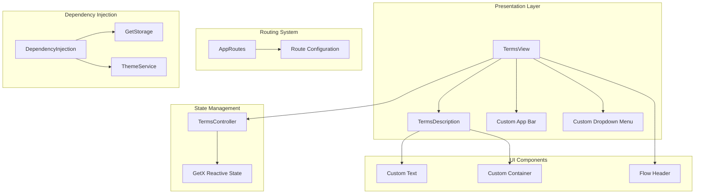
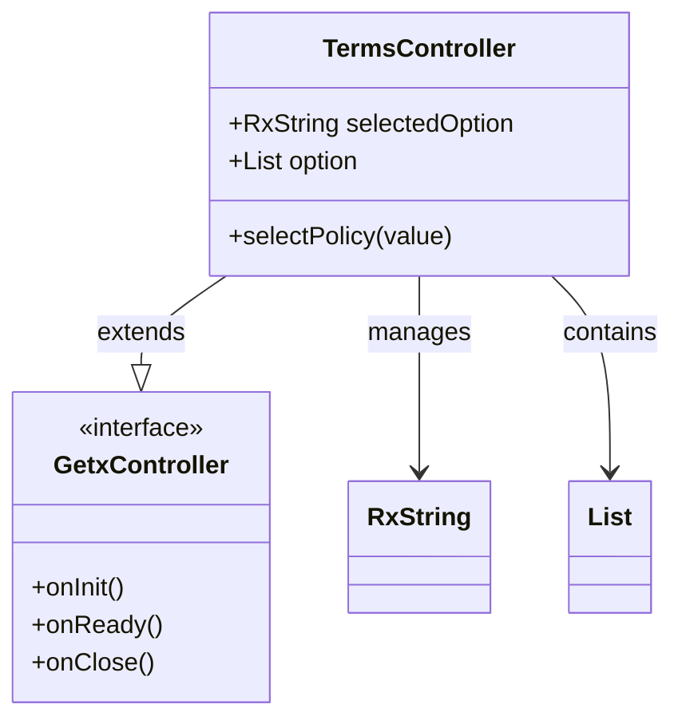
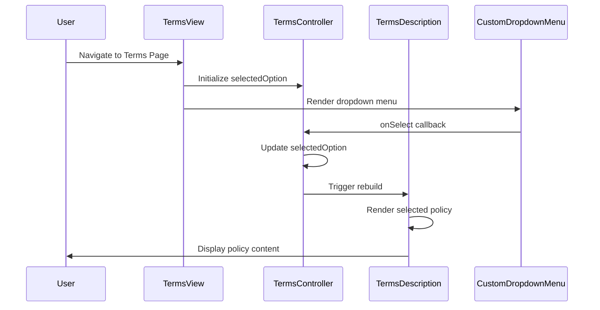
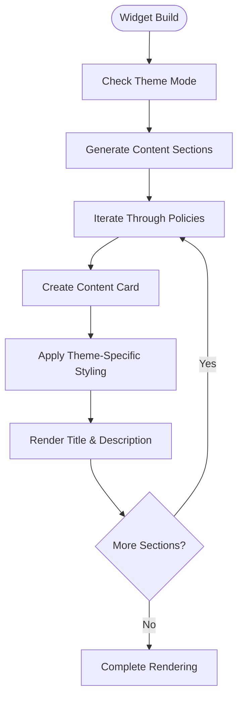
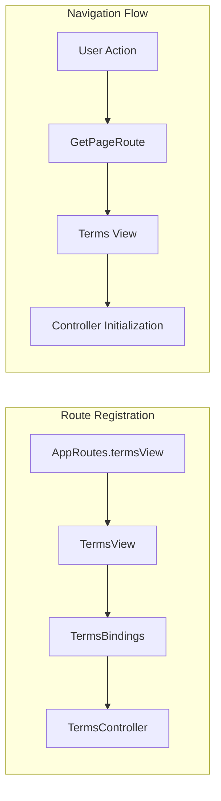
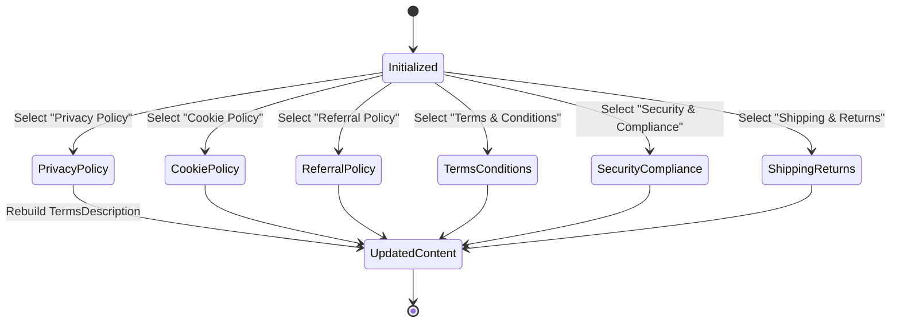
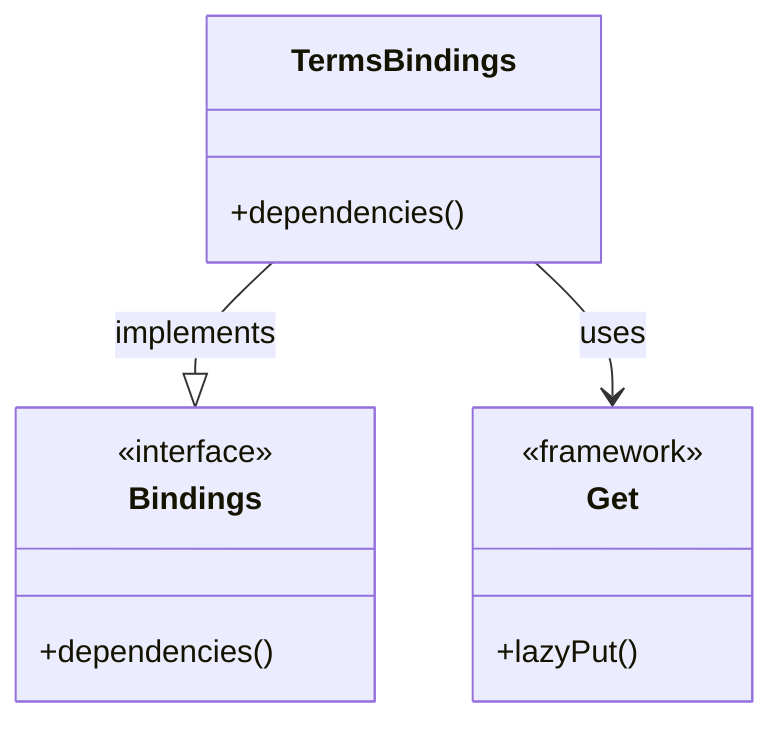

# Terms & Conditions System

<cite>
**Referenced Files in This Document**
- [main.dart](file://lib/main.dart)
- [terms_controller.dart](file://lib/features/terms/controller/terms_controller.dart)
- [terms_view.dart](file://lib/features/terms/views/terms_view.dart)
- [terms_bindings.dart](file://lib/features/terms/bindings/terms_bindings.dart)
- [terms_description.dart](file://lib/features/terms/widgets/terms_description.dart)
- [app_routes.dart](file://lib/core/routes/app_routes.dart)
- [routes.dart](file://lib/core/routes/routes.dart)
- [dependency_injection.dart](file://lib/core/di/dependency_injection.dart)
- [app_theme.dart](file://lib/core/theme/app_theme.dart)
- [colors.dart](file://lib/core/constant/colors.dart)
</cite>

## Table of Contents
1. [Introduction](#introduction)
2. [System Architecture](#system-architecture)
3. [Core Components](#core-components)
4. [User Interface Components](#user-interface-components)
5. [Navigation & Routing](#navigation--routing)
6. [State Management](#state-management)
7. [Data Presentation Layer](#data-presentation-layer)
8. [Integration Points](#integration-points)
9. [Performance Considerations](#performance-considerations)
10. [Troubleshooting Guide](#troubleshooting-guide)
11. [Conclusion](#conclusion)

## Introduction

The Terms & Conditions System is a comprehensive legal document presentation module within the ZB DEZIGN Flutter application. This system provides users with access to various legal policies including Privacy Policy, Cookie Policy, Referral Policy, Terms & Conditions, Security & Compliance, and Shipping & Returns. The system is designed with a modular architecture that leverages the GetX framework for state management, dependency injection, and navigation.

The primary objective of this system is to present standardized legal documentation in an accessible, user-friendly interface while maintaining consistency with the application's design language and providing seamless integration with the overall user experience.

## System Architecture

The Terms & Conditions System follows a clean, layered architecture pattern that separates concerns effectively:

**Diagram sources**
- [terms_view.dart:12-50](file://lib/features/terms/views/terms_view.dart#L12-L50)
- [terms_controller.dart:3-13](file://lib/features/terms/controller/terms_controller.dart#L3-L13)
- [app_routes.dart:46](file://lib/core/routes/app_routes.dart#L46)

**Section sources**
- [main.dart:12-47](file://lib/main.dart#L12-L47)
- [dependency_injection.dart:13-32](file://lib/core/di/dependency_injection.dart#L13-L32)

## Core Components

### TermsController

The TermsController serves as the central state management component for the Terms & Conditions system. It utilizes GetX's reactive programming model to manage the selected policy type and maintain a list of available policy options.

**Diagram sources**
- [terms_controller.dart:3-13](file://lib/features/terms/controller/terms_controller.dart#L3-L13)

The controller initializes with 'Privacy Policy' as the default selected option and maintains a comprehensive list of six policy categories. The reactive state management ensures automatic UI updates when users select different policy types.

**Section sources**
- [terms_controller.dart:1-14](file://lib/features/terms/controller/terms_controller.dart#L1-L14)

### TermsView

The TermsView represents the main presentation component responsible for rendering the complete Terms & Conditions interface. It orchestrates the layout and integrates various UI components to create a cohesive user experience.

**Diagram sources**
- [terms_view.dart:16-49](file://lib/features/terms/views/terms_view.dart#L16-L49)
- [terms_controller.dart:4](file://lib/features/terms/controller/terms_controller.dart#L4)

**Section sources**
- [terms_view.dart:1-51](file://lib/features/terms/views/terms_view.dart#L1-L51)

## User Interface Components

### TermsDescription Widget

The TermsDescription widget serves as the content presentation layer, displaying structured legal information in an organized, readable format. It implements a dynamic content generation system that adapts to different policy types and theme modes.

**Diagram sources**
- [terms_description.dart:14-82](file://lib/features/terms/widgets/terms_description.dart#L14-L82)

The widget contains five distinct content sections covering:
- Terms of Service for ZB Design
- Privacy Policy
- Design & Renovation Disclaimer
- Limitation of Liability
- Third-Party Services & Materials

Each section is presented with appropriate typography and spacing to ensure readability and accessibility.

**Section sources**
- [terms_description.dart:1-83](file://lib/features/terms/widgets/terms_description.dart#L1-L83)

### Custom UI Components Integration

The Terms & Conditions system integrates seamlessly with the application's existing UI component library, utilizing custom-designed widgets that maintain consistency with the overall design system.

## Navigation & Routing

### Route Configuration

The Terms & Conditions system is fully integrated into the application's routing architecture through the GetX navigation system. The route configuration ensures proper initialization and lifecycle management of the Terms components.

**Diagram sources**
- [routes.dart:291-296](file://lib/core/routes/routes.dart#L291-L296)
- [app_routes.dart:46](file://lib/core/routes/app_routes.dart#L46)

**Section sources**
- [app_routes.dart:1-48](file://lib/core/routes/app_routes.dart#L1-L48)
- [routes.dart:73-77](file://lib/core/routes/routes.dart#L73-L77)

## State Management

### Reactive State Architecture

The Terms & Conditions system employs GetX's reactive state management to ensure efficient UI updates and optimal performance. The state management follows a unidirectional data flow pattern that minimizes unnecessary rebuilds.

**Diagram sources**
- [terms_controller.dart:4-12](file://lib/features/terms/controller/terms_controller.dart#L4-L12)

The reactive state system ensures that:
- UI updates occur only when the selected policy changes
- Memory usage remains optimized through proper state cleanup
- Performance is maintained even with frequent policy switching

**Section sources**
- [terms_controller.dart:1-14](file://lib/features/terms/controller/terms_controller.dart#L1-L14)

## Data Presentation Layer

### Content Structure and Organization

The TermsDescription widget implements a structured content presentation system that organizes legal information into digestible sections. Each policy category is carefully crafted to provide comprehensive coverage while maintaining readability.

The content structure follows a consistent pattern:
1. **Title Section**: Clear, prominent policy title
2. **Content Area**: Detailed legal text with appropriate spacing
3. **Theme Adaptation**: Automatic color scheme adjustment based on current theme mode

**Section sources**
- [terms_description.dart:14-40](file://lib/features/terms/widgets/terms_description.dart#L14-L40)

## Integration Points

### Dependency Injection Integration

The Terms & Conditions system integrates with the application's dependency injection framework through the TermsBindings class, ensuring proper initialization and lifecycle management.

**Diagram sources**
- [terms_bindings.dart:4-9](file://lib/features/terms/bindings/terms_bindings.dart#L4-L9)

**Section sources**
- [terms_bindings.dart:1-10](file://lib/features/terms/bindings/terms_bindings.dart#L1-L10)

### Theme System Integration

The system seamlessly integrates with the application's theme management system, automatically adapting to light and dark themes. The color adaptation logic ensures optimal readability across different visual modes.

**Section sources**
- [app_theme.dart:1-23](file://lib/core/theme/app_theme.dart#L1-L23)
- [colors.dart:1-132](file://lib/core/constant/colors.dart#L1-L132)

## Performance Considerations

### Optimized Rendering Strategy

The Terms & Conditions system implements several performance optimization strategies:

1. **Selective Rebuilding**: Only the TermsDescription widget rebuilds when policy selection changes
2. **Memory Efficiency**: Proper disposal of reactive state when navigating away from the page
3. **Lazy Loading**: Components are loaded only when the Terms page is accessed
4. **Minimal Dependencies**: The system maintains a focused set of dependencies to reduce bundle size

### State Management Efficiency

The GetX reactive state system provides efficient state updates with minimal overhead. The system avoids unnecessary rebuilds by leveraging the reactive nature of the selectedOption variable.

## Troubleshooting Guide

### Common Issues and Solutions

**Issue**: Terms page not loading properly
- **Solution**: Verify route registration in routes.dart file
- **Check**: Ensure TermsBindings is properly imported and registered

**Issue**: Policy content not updating when selection changes
- **Solution**: Confirm RxString reactive state is properly bound
- **Check**: Verify onSelect callback implementation in TermsView

**Issue**: Theme not applying correctly to policy content
- **Solution**: Review theme detection logic in TermsDescription widget
- **Check**: Ensure color constants are properly defined in colors.dart

**Issue**: Navigation issues to Terms page
- **Solution**: Verify AppRoutes constant matches route configuration
- **Check**: Confirm route name consistency across files

**Section sources**
- [terms_view.dart:35-37](file://lib/features/terms/views/terms_view.dart#L35-L37)
- [terms_controller.dart:4](file://lib/features/terms/controller/terms_controller.dart#L4)

## Conclusion

The Terms & Conditions System represents a well-architected solution for presenting legal documentation within the ZB DEZIGN application. The system demonstrates excellent separation of concerns through its layered architecture, effective use of reactive state management, and seamless integration with the broader application ecosystem.

Key strengths of the implementation include:
- Clean, maintainable code structure following Flutter best practices
- Efficient reactive state management reducing unnecessary UI updates
- Comprehensive integration with the application's theme and navigation systems
- Scalable architecture supporting future expansion of policy types
- Performance optimizations ensuring smooth user experience

The system successfully balances functionality with maintainability, providing a solid foundation for legal document presentation while adhering to the application's design principles and technical standards.