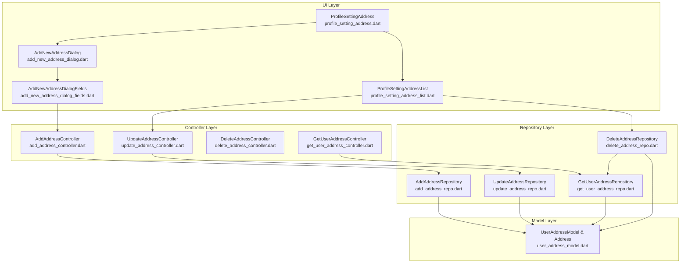
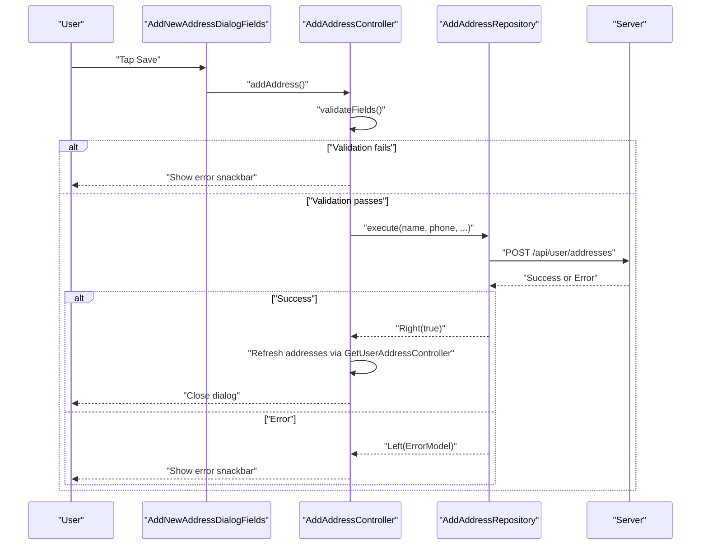
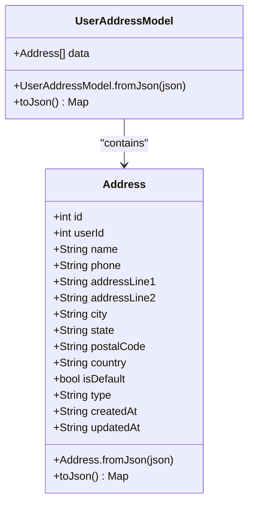
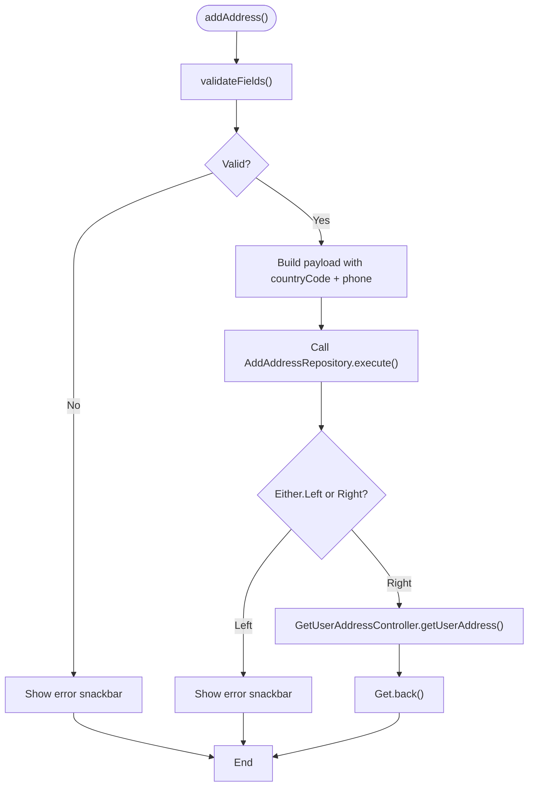
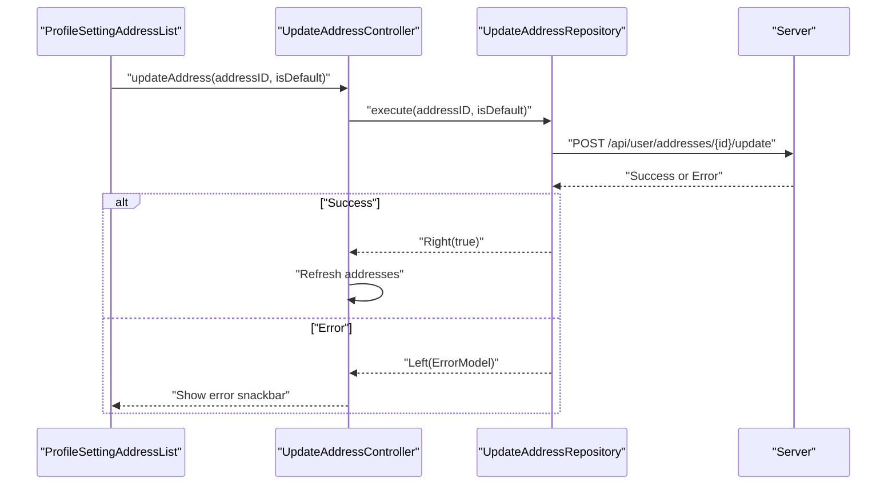
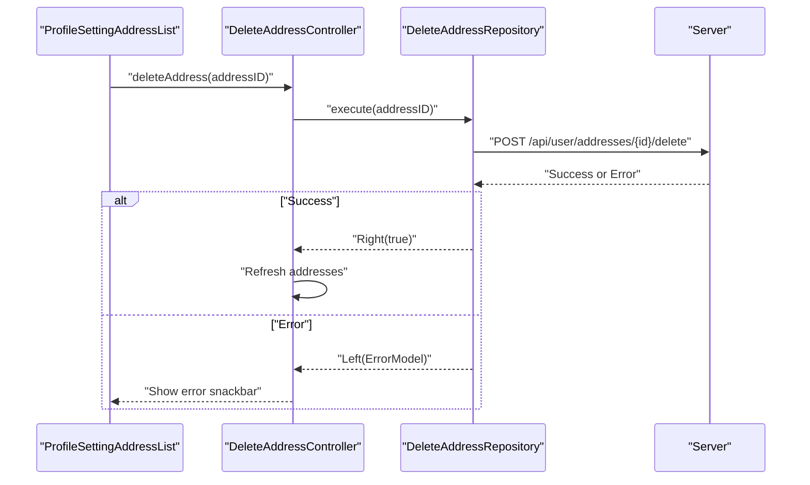
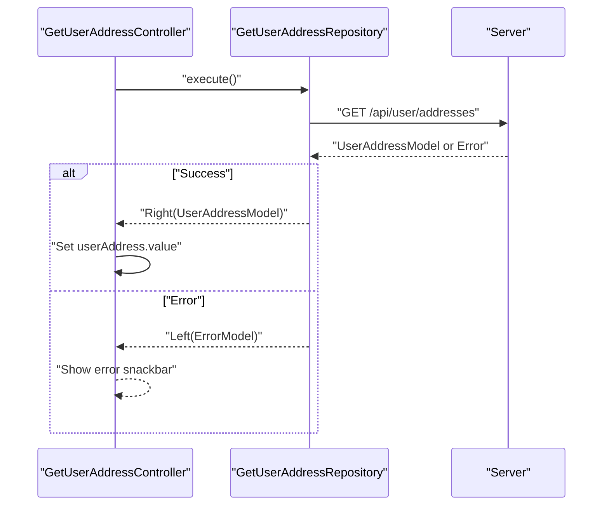
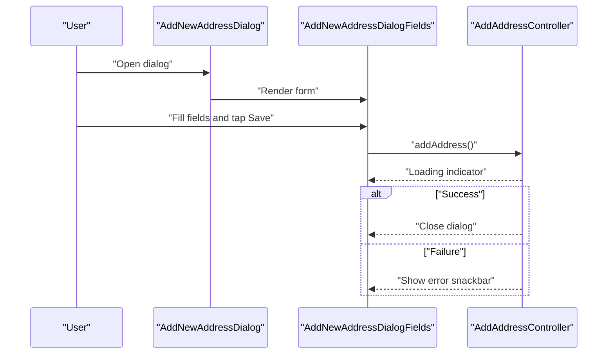
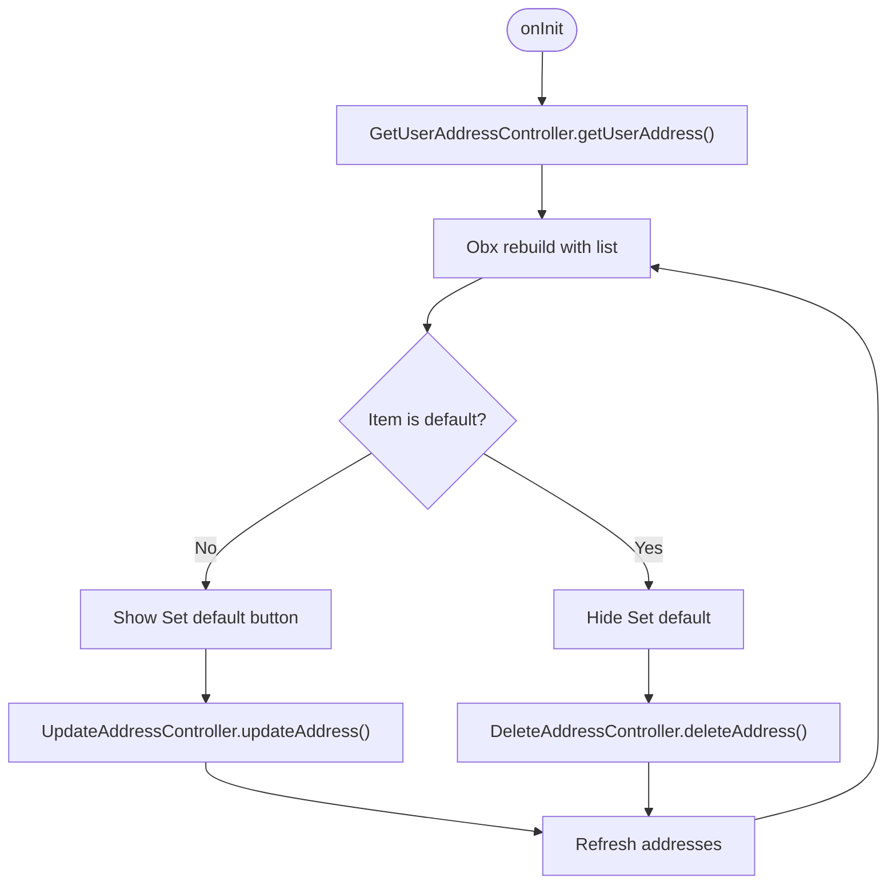
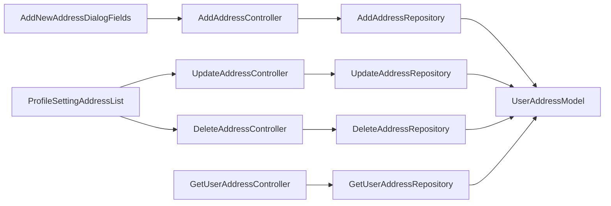

# Address Management

<cite>
**Referenced Files in This Document**
- [user_address_model.dart](file://lib/features/profile/models/user_address_model.dart)
- [add_address_controller.dart](file://lib/features/profile/controllers/add_address_controller.dart)
- [update_address_controller.dart](file://lib/features/profile/controllers/update_address_controller.dart)
- [delete_address_controller.dart](file://lib/features/profile/controllers/delete_address_controller.dart)
- [get_user_address_controller.dart](file://lib/features/profile/controllers/get_user_address_controller.dart)
- [add_address_repo.dart](file://lib/features/profile/repositories/add_address_repo.dart)
- [update_address_repo.dart](file://lib/features/profile/repositories/update_address_repo.dart)
- [delete_address_repo.dart](file://lib/features/profile/repositories/delete_address_repo.dart)
- [get_user_address_repo.dart](file://lib/features/profile/repositories/get_user_address_repo.dart)
- [add_new_address_dialog.dart](file://lib/features/profile/widgets/profile_setting_widgets/add_new_address_dialog.dart)
- [add_new_address_dialog_fields.dart](file://lib/features/profile/widgets/profile_setting_widgets/add_new_address_dialog_fields.dart)
- [profile_setting_address.dart](file://lib/features/profile/widgets/profile_setting_widgets/profile_setting_address.dart)
- [profile_setting_address_list.dart](file://lib/features/profile/widgets/profile_setting_widgets/profile_setting_address_list.dart)
</cite>

## Table of Contents
1. [Introduction](#introduction)
2. [Project Structure](#project-structure)
3. [Core Components](#core-components)
4. [Architecture Overview](#architecture-overview)
5. [Detailed Component Analysis](#detailed-component-analysis)
6. [Dependency Analysis](#dependency-analysis)
7. [Performance Considerations](#performance-considerations)
8. [Troubleshooting Guide](#troubleshooting-guide)
9. [Conclusion](#conclusion)

## Introduction
This document describes the Address Management system integrated within user profiles. It covers the end-to-end flow for managing addresses: adding new addresses, updating defaults, deleting addresses, and retrieving user addresses. It documents the controller implementations for each operation with validation and error handling, the repository layer for persistence and retrieval, and the UI components for input, validation, selection, and display. It also outlines the address model structure, validation rules, and integration with the user profile system.

## Project Structure
The Address Management feature is organized by layers:
- Models define the address data structure.
- Controllers orchestrate UI actions, validation, and inter-controller communication.
- Repositories encapsulate network calls and error modeling.
- Widgets provide the user interface for input, selection, and listing.

**Diagram sources**
- [add_new_address_dialog.dart:10-79](file://lib/features/profile/widgets/profile_setting_widgets/add_new_address_dialog.dart#L10-L79)
- [add_new_address_dialog_fields.dart:15-246](file://lib/features/profile/widgets/profile_setting_widgets/add_new_address_dialog_fields.dart#L15-L246)
- [profile_setting_address.dart:10-45](file://lib/features/profile/widgets/profile_setting_widgets/profile_setting_address.dart#L10-L45)
- [profile_setting_address_list.dart:13-150](file://lib/features/profile/widgets/profile_setting_widgets/profile_setting_address_list.dart#L13-L150)
- [add_address_controller.dart:7-112](file://lib/features/profile/controllers/add_address_controller.dart#L7-L112)
- [update_address_controller.dart:6-32](file://lib/features/profile/controllers/update_address_controller.dart#L6-L32)
- [delete_address_controller.dart:6-28](file://lib/features/profile/controllers/delete_address_controller.dart#L6-L28)
- [get_user_address_controller.dart:6-32](file://lib/features/profile/controllers/get_user_address_controller.dart#L6-L32)
- [add_address_repo.dart:8-43](file://lib/features/profile/repositories/add_address_repo.dart#L8-L43)
- [update_address_repo.dart:8-24](file://lib/features/profile/repositories/update_address_repo.dart#L8-L24)
- [delete_address_repo.dart:6-19](file://lib/features/profile/repositories/delete_address_repo.dart#L6-L19)
- [get_user_address_repo.dart:7-20](file://lib/features/profile/repositories/get_user_address_repo.dart#L7-L20)
- [user_address_model.dart:1-93](file://lib/features/profile/models/user_address_model.dart#L1-L93)

**Section sources**
- [add_new_address_dialog.dart:10-79](file://lib/features/profile/widgets/profile_setting_widgets/add_new_address_dialog.dart#L10-L79)
- [add_new_address_dialog_fields.dart:15-246](file://lib/features/profile/widgets/profile_setting_widgets/add_new_address_dialog_fields.dart#L15-L246)
- [profile_setting_address.dart:10-45](file://lib/features/profile/widgets/profile_setting_widgets/profile_setting_address.dart#L10-L45)
- [profile_setting_address_list.dart:13-150](file://lib/features/profile/widgets/profile_setting_widgets/profile_setting_address_list.dart#L13-L150)
- [add_address_controller.dart:7-112](file://lib/features/profile/controllers/add_address_controller.dart#L7-L112)
- [update_address_controller.dart:6-32](file://lib/features/profile/controllers/update_address_controller.dart#L6-L32)
- [delete_address_controller.dart:6-28](file://lib/features/profile/controllers/delete_address_controller.dart#L6-L28)
- [get_user_address_controller.dart:6-32](file://lib/features/profile/controllers/get_user_address_controller.dart#L6-L32)
- [add_address_repo.dart:8-43](file://lib/features/profile/repositories/add_address_repo.dart#L8-L43)
- [update_address_repo.dart:8-24](file://lib/features/profile/repositories/update_address_repo.dart#L8-L24)
- [delete_address_repo.dart:6-19](file://lib/features/profile/repositories/delete_address_repo.dart#L6-L19)
- [get_user_address_repo.dart:7-20](file://lib/features/profile/repositories/get_user_address_repo.dart#L7-L20)
- [user_address_model.dart:1-93](file://lib/features/profile/models/user_address_model.dart#L1-L93)

## Core Components
- Address model: Defines the address entity with metadata and timestamps, plus a wrapper for collections.
- Controllers: Encapsulate UI logic, validation, loading states, and inter-controller coordination.
- Repositories: Abstract network operations and return typed errors via Either.
- Widgets: Provide dialogs, forms, and lists for address management.

Key responsibilities:
- Validation: Required fields, phone digit extraction and length check.
- Error handling: Centralized snackbars and Either-based error propagation.
- Loading states: Reactive indicators during async operations.
- Integration: Controllers coordinate with GetUserAddressController to refresh address lists after mutations.

**Section sources**
- [user_address_model.dart:24-92](file://lib/features/profile/models/user_address_model.dart#L24-L92)
- [add_address_controller.dart:46-71](file://lib/features/profile/controllers/add_address_controller.dart#L46-L71)
- [get_user_address_controller.dart:10-24](file://lib/features/profile/controllers/get_user_address_controller.dart#L10-L24)
- [add_address_repo.dart:12-41](file://lib/features/profile/repositories/add_address_repo.dart#L12-L41)
- [update_address_repo.dart:12-22](file://lib/features/profile/repositories/update_address_repo.dart#L12-L22)
- [delete_address_repo.dart:10-17](file://lib/features/profile/repositories/delete_address_repo.dart#L10-L17)

## Architecture Overview
The system follows a layered architecture:
- UI widgets trigger controller actions.
- Controllers validate inputs, manage loading states, and call repositories.
- Repositories perform network requests and return Either<ErrorModel, T>.
- On success, controllers notify the address list controller to refresh data.
- On failure, errors are surfaced via snackbars.

**Diagram sources**
- [add_new_address_dialog_fields.dart:144-153](file://lib/features/profile/widgets/profile_setting_widgets/add_new_address_dialog_fields.dart#L144-L153)
- [add_address_controller.dart:73-110](file://lib/features/profile/controllers/add_address_controller.dart#L73-L110)
- [add_address_repo.dart:24-41](file://lib/features/profile/repositories/add_address_repo.dart#L24-L41)

**Section sources**
- [add_address_controller.dart:73-110](file://lib/features/profile/controllers/add_address_controller.dart#L73-L110)
- [add_address_repo.dart:12-41](file://lib/features/profile/repositories/add_address_repo.dart#L12-L41)
- [get_user_address_controller.dart:13-24](file://lib/features/profile/controllers/get_user_address_controller.dart#L13-L24)

## Detailed Component Analysis

### Address Model
The model defines:
- A collection wrapper with a list of Address entries.
- An Address entity with identifiers, contact info, location fields, type, default flag, and timestamps.
- Serialization/deserialization helpers for JSON interchange.

**Diagram sources**
- [user_address_model.dart:1-93](file://lib/features/profile/models/user_address_model.dart#L1-L93)

**Section sources**
- [user_address_model.dart:1-93](file://lib/features/profile/models/user_address_model.dart#L1-L93)

### Add Address Controller
Responsibilities:
- Manage multiple TextEditingControllers for form fields.
- Validate required fields and phone number (digit extraction and minimum length).
- Prepare payload and call repository.
- Handle loading state and show error snackbars on failure.
- Refresh address list and close dialog on success.

**Diagram sources**
- [add_address_controller.dart:73-110](file://lib/features/profile/controllers/add_address_controller.dart#L73-L110)

**Section sources**
- [add_address_controller.dart:7-112](file://lib/features/profile/controllers/add_address_controller.dart#L7-L112)

### Update Address Controller
Responsibilities:
- Toggle default address flag for a given ID.
- Manage loading state and handle errors via snackbars.
- Refresh address list on success.

**Diagram sources**
- [update_address_controller.dart:11-30](file://lib/features/profile/controllers/update_address_controller.dart#L11-L30)
- [update_address_repo.dart:16-22](file://lib/features/profile/repositories/update_address_repo.dart#L16-L22)

**Section sources**
- [update_address_controller.dart:6-32](file://lib/features/profile/controllers/update_address_controller.dart#L6-L32)
- [update_address_repo.dart:8-24](file://lib/features/profile/repositories/update_address_repo.dart#L8-L24)

### Delete Address Controller
Responsibilities:
- Delete an address by ID.
- Manage loading state and handle errors via snackbars.
- Refresh address list on success.

**Diagram sources**
- [delete_address_controller.dart:11-26](file://lib/features/profile/controllers/delete_address_controller.dart#L11-L26)
- [delete_address_repo.dart:10-17](file://lib/features/profile/repositories/delete_address_repo.dart#L10-L17)

**Section sources**
- [delete_address_controller.dart:6-28](file://lib/features/profile/controllers/delete_address_controller.dart#L6-L28)
- [delete_address_repo.dart:6-19](file://lib/features/profile/repositories/delete_address_repo.dart#L6-L19)

### Get User Addresses Controller
Responsibilities:
- Fetch user addresses on initialization.
- Expose reactive loading state and optional model.
- Handle errors via snackbars.

**Diagram sources**
- [get_user_address_controller.dart:13-24](file://lib/features/profile/controllers/get_user_address_controller.dart#L13-L24)
- [get_user_address_repo.dart:11-18](file://lib/features/profile/repositories/get_user_address_repo.dart#L11-L18)

**Section sources**
- [get_user_address_controller.dart:6-32](file://lib/features/profile/controllers/get_user_address_controller.dart#L6-L32)
- [get_user_address_repo.dart:7-20](file://lib/features/profile/repositories/get_user_address_repo.dart#L7-L20)

### Address Dialog Components
- Dialog container: Provides layout, header, close action, and embeds the form fields.
- Form fields: Renders labeled inputs, radio buttons for address type, checkbox for default, and a phone field that captures country code.
- Validation and submission: Calls controller.addAddress(), displays loading state, and closes on success.

**Diagram sources**
- [add_new_address_dialog.dart:14-77](file://lib/features/profile/widgets/profile_setting_widgets/add_new_address_dialog.dart#L14-L77)
- [add_new_address_dialog_fields.dart:144-153](file://lib/features/profile/widgets/profile_setting_widgets/add_new_address_dialog_fields.dart#L144-L153)
- [add_address_controller.dart:73-110](file://lib/features/profile/controllers/add_address_controller.dart#L73-L110)

**Section sources**
- [add_new_address_dialog.dart:10-79](file://lib/features/profile/widgets/profile_setting_widgets/add_new_address_dialog.dart#L10-L79)
- [add_new_address_dialog_fields.dart:15-246](file://lib/features/profile/widgets/profile_setting_widgets/add_new_address_dialog_fields.dart#L15-L246)

### Address List Widget
- Displays a scrollable list of addresses fetched from GetUserAddressController.
- Shows name, address summary, and default badge.
- Provides "Set default" action for non-default addresses and "Delete" action for all except the default.
- Uses reactive Obx to rebuild when loading or data changes.

**Diagram sources**
- [profile_setting_address_list.dart:19-147](file://lib/features/profile/widgets/profile_setting_widgets/profile_setting_address_list.dart#L19-L147)
- [get_user_address_controller.dart:26-31](file://lib/features/profile/controllers/get_user_address_controller.dart#L26-L31)
- [update_address_controller.dart:11-30](file://lib/features/profile/controllers/update_address_controller.dart#L11-L30)
- [delete_address_controller.dart:11-26](file://lib/features/profile/controllers/delete_address_controller.dart#L11-L26)

**Section sources**
- [profile_setting_address_list.dart:13-150](file://lib/features/profile/widgets/profile_setting_widgets/profile_setting_address_list.dart#L13-L150)
- [get_user_address_controller.dart:13-31](file://lib/features/profile/controllers/get_user_address_controller.dart#L13-L31)

## Dependency Analysis
- Controllers depend on repositories and on other controllers for refresh operations.
- Repositories depend on network clients and return typed errors.
- Widgets depend on controllers via GetX bindings and observe reactive states.
- The model is shared across layers for serialization/deserialization.

**Diagram sources**
- [add_new_address_dialog_fields.dart:15-246](file://lib/features/profile/widgets/profile_setting_widgets/add_new_address_dialog_fields.dart#L15-L246)
- [profile_setting_address_list.dart:13-150](file://lib/features/profile/widgets/profile_setting_widgets/profile_setting_address_list.dart#L13-L150)
- [add_address_controller.dart:7-112](file://lib/features/profile/controllers/add_address_controller.dart#L7-L112)
- [update_address_controller.dart:6-32](file://lib/features/profile/controllers/update_address_controller.dart#L6-L32)
- [delete_address_controller.dart:6-28](file://lib/features/profile/controllers/delete_address_controller.dart#L6-L28)
- [get_user_address_controller.dart:6-32](file://lib/features/profile/controllers/get_user_address_controller.dart#L6-L32)
- [add_address_repo.dart:8-43](file://lib/features/profile/repositories/add_address_repo.dart#L8-L43)
- [update_address_repo.dart:8-24](file://lib/features/profile/repositories/update_address_repo.dart#L8-L24)
- [delete_address_repo.dart:6-19](file://lib/features/profile/repositories/delete_address_repo.dart#L6-L19)
- [get_user_address_repo.dart:7-20](file://lib/features/profile/repositories/get_user_address_repo.dart#L7-L20)
- [user_address_model.dart:1-93](file://lib/features/profile/models/user_address_model.dart#L1-L93)

**Section sources**
- [add_address_controller.dart:7-112](file://lib/features/profile/controllers/add_address_controller.dart#L7-L112)
- [update_address_controller.dart:6-32](file://lib/features/profile/controllers/update_address_controller.dart#L6-L32)
- [delete_address_controller.dart:6-28](file://lib/features/profile/controllers/delete_address_controller.dart#L6-L28)
- [get_user_address_controller.dart:6-32](file://lib/features/profile/controllers/get_user_address_controller.dart#L6-L32)
- [add_address_repo.dart:8-43](file://lib/features/profile/repositories/add_address_repo.dart#L8-L43)
- [update_address_repo.dart:8-24](file://lib/features/profile/repositories/update_address_repo.dart#L8-L24)
- [delete_address_repo.dart:6-19](file://lib/features/profile/repositories/delete_address_repo.dart#L6-L19)
- [get_user_address_repo.dart:7-20](file://lib/features/profile/repositories/get_user_address_repo.dart#L7-L20)
- [user_address_model.dart:1-93](file://lib/features/profile/models/user_address_model.dart#L1-L93)

## Performance Considerations
- Prefer minimal rebuilds: Use Obx only around necessary widgets to avoid unnecessary recompositions.
- Debounce or batch UI updates when editing many fields concurrently.
- Cache country code from the phone field to avoid repeated parsing.
- Limit list rendering by virtualization; current implementation renders all items—consider pagination for large datasets.
- Avoid blocking the UI thread: Keep network calls asynchronous and show loading indicators.

## Troubleshooting Guide
Common issues and resolutions:
- Validation failures: Ensure required fields are filled and phone number contains at least ten digits after removing non-digits.
- Network errors: Inspect the error message returned by repositories and surface via snackbars.
- Stale data after mutation: Confirm that GetUserAddressController.getUserAddress() is invoked after successful add/update/delete operations.
- Phone number formatting: The controller stores the complete phone number including country code; ensure the backend expects this format.

**Section sources**
- [add_address_controller.dart:46-71](file://lib/features/profile/controllers/add_address_controller.dart#L46-L71)
- [add_address_controller.dart:99-109](file://lib/features/profile/controllers/add_address_controller.dart#L99-L109)
- [get_user_address_controller.dart:16-23](file://lib/features/profile/controllers/get_user_address_controller.dart#L16-L23)

## Conclusion
The Address Management system provides a cohesive, layered solution for CRUD operations on user addresses. It enforces validation at the controller level, handles errors consistently, and integrates seamlessly with the user profile UI. The use of reactive controllers and repositories ensures predictable data flow and maintainable code. Extending the system can involve adding new fields to the model, enhancing validation rules, and introducing pagination for large address lists.