# Credit Balance System

<cite>
**Referenced Files in This Document**
- [credit_balance_controller.dart](file://lib/features/credit_balance/controller/credit_balance_controller.dart)
- [credit_transaction_model.dart](file://lib/features/credit_balance/models/credit_transaction_model.dart)
- [credit_chart_model.dart](file://lib/features/credit_balance/models/credit_chart_model.dart)
- [credit_balance_bindings.dart](file://lib/features/credit_balance/bindings/credit_balance_bindings.dart)
- [credit_balance_view.dart](file://lib/features/credit_balance/views/credit_balance_view.dart)
- [credit_balance.dart](file://lib/features/credit_balance/widgets/credit_balance_view_widgets/credit_balance.dart)
- [credit_section.dart](file://lib/features/credit_balance/widgets/credit_balance_view_widgets/credit_section.dart)
- [credit_items.dart](file://lib/features/credit_balance/widgets/credit_balance_view_widgets/credit_items.dart)
- [credit_usage_card.dart](file://lib/features/credit_balance/widgets/credit_balance_view_widgets/credit_usage_card.dart)
- [credit_headar.dart](file://lib/features/credit_balance/widgets/credit_balance_view_widgets/credit_headar.dart)
- [credit_chart.dart](file://lib/features/credit_balance/widgets/credit_balance_view_widgets/credit_chart.dart)
- [credit_transaction_list.dart](file://lib/features/credit_balance/widgets/credit_balance_view_widgets/credit_transaction_list.dart)
- [credit_transaction_item.dart](file://lib/features/credit_balance/widgets/credit_balance_view_widgets/credit_transaction_item.dart)
- [ai_controller.dart](file://lib/features/ai/controller/ai_controller.dart)
- [ai_dropdown.dart](file://lib/features/ai/widgets/ai_view_widgets/ai_dropdown.dart)
- [ai_dropdown_credit.dart](file://lib/features/ai/widgets/ai_view_widgets/ai_dropdown_credit.dart)
- [ai_dropdown_upgrade.dart](file://lib/features/ai/widgets/ai_view_widgets/ai_dropdown_upgrade.dart)
- [ai_user_credit.dart](file://lib/features/ai/widgets/ai_view_widgets/ai_user_credit.dart)
- [ai_header.dart](file://lib/features/ai/widgets/ai_header.dart)
- [ai_bindings.dart](file://lib/features/ai/bindings/ai_bindings.dart)
- [ai_view.dart](file://lib/features/ai/views/ai_view.dart)
- [routes.dart](file://lib/core/routes/routes.dart)
- [icons_path.dart](file://lib/core/constant/icons_path.dart)
</cite>

## Update Summary
**Changes Made**
- Complete architectural overhaul from fl_chart-based bar chart to custom cylinder-based visualization system
- CreditChart widget now uses CustomPaint and CustomPainter classes for sophisticated gradient effects, lighting simulations, and custom cylinder rendering
- Implementation eliminates external dependencies in favor of custom rendering capabilities with enhanced visual aesthetics
- Active/inactive cylinder states with advanced gradient effects and lighting simulations
- Custom cylinder rendering with realistic 3D-like appearance using multiple gradient layers

## Table of Contents
1. [Introduction](#introduction)
2. [Project Structure](#project-structure)
3. [Core Components](#core-components)
4. [Architecture Overview](#architecture-overview)
5. [Detailed Component Analysis](#detailed-component-analysis)
6. [Custom Cylinder Visualization System](#custom-cylinder-visualization-system)
7. [AI Credit Integration](#ai-credit-integration)
8. [Dependency Analysis](#dependency-analysis)
9. [Performance Considerations](#performance-considerations)
10. [Troubleshooting Guide](#troubleshooting-guide)
11. [Conclusion](#conclusion)

## Introduction
This document describes the Credit Balance System, focusing on credit transactions, top-up mechanisms, and usage tracking. The system has been enhanced with a revolutionary custom cylinder-based visualization system that replaces the previous fl_chart dependency with sophisticated CustomPaint and CustomPainter implementations. The new system provides advanced gradient effects, lighting simulations, and realistic 3D-like cylinder rendering with active/inactive states. It explains the responsibilities of the credit controller for transaction processing, balance calculations, and history management. It documents the credit models for transaction records, balance updates, and financial tracking. It covers the credit view components for balance display, transaction history, and credit management interfaces. It also documents the credit binding configurations for dependency injection and service initialization, and the credit widget components for balance visualization, transaction forms, and status indicators. Finally, it addresses the integration between the credit system and user profile for a seamless credit management experience, including AI-specific credit dropdown functionality.

## Project Structure
The Credit Balance System is organized by feature with dedicated controller, models, bindings, views, and widgets. The system now includes AI integration through specialized dropdown widgets that leverage the existing credit infrastructure. The architecture has been completely redesigned around custom cylinder visualization technology. Routing integrates the credit balance view with its binding and supports AI interface navigation.

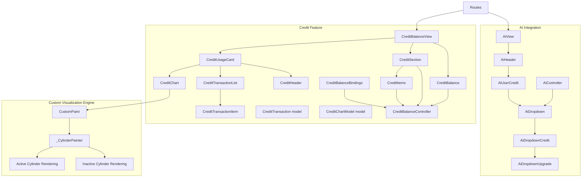

**Diagram sources**
- [routes.dart:199-202](file://lib/core/routes/routes.dart#L199-L202)
- [routes.dart:249-252](file://lib/core/routes/routes.dart#L249-L252)
- [credit_balance_view.dart:13-68](file://lib/features/credit_balance/views/credit_balance_view.dart#L13-L68)
- [credit_balance.dart:10-95](file://lib/features/credit_balance/widgets/credit_balance_view_widgets/credit_balance.dart#L10-L95)
- [credit_section.dart:13-110](file://lib/features/credit_balance/widgets/credit_balance_view_widgets/credit_section.dart#L13-L110)
- [credit_items.dart:10-81](file://lib/features/credit_balance/widgets/credit_balance_view_widgets/credit_items.dart#L10-L81)
- [credit_usage_card.dart:9-37](file://lib/features/credit_balance/widgets/credit_balance_view_widgets/credit_usage_card.dart#L9-L37)
- [credit_headar.dart:7-37](file://lib/features/credit_balance/widgets/credit_balance_view_widgets/credit_headar.dart#L7-L37)
- [credit_chart.dart:9-353](file://lib/features/credit_balance/widgets/credit_balance_view_widgets/credit_chart.dart#L9-L353)
- [credit_transaction_list.dart:10-121](file://lib/features/credit_balance/widgets/credit_balance_view_widgets/credit_transaction_list.dart#L10-L121)
- [credit_transaction_item.dart:8-73](file://lib/features/credit_balance/widgets/credit_balance_view_widgets/credit_transaction_item.dart#L8-L73)
- [credit_transaction_model.dart:1-11](file://lib/features/credit_balance/models/credit_transaction_model.dart#L1-L11)
- [credit_chart_model.dart:1-6](file://lib/features/credit_balance/models/credit_chart_model.dart#L1-L6)
- [credit_balance_controller.dart:3-7](file://lib/features/credit_balance/controller/credit_balance_controller.dart#L3-L7)
- [credit_balance_bindings.dart:4-9](file://lib/features/credit_balance/bindings/credit_balance_bindings.dart#L4-L9)
- [ai_controller.dart:7-94](file://lib/features/ai/controller/ai_controller.dart#L7-L94)
- [ai_dropdown.dart:10-70](file://lib/features/ai/widgets/ai_view_widgets/ai_dropdown.dart#L10-L70)
- [ai_dropdown_credit.dart:12-88](file://lib/features/ai/widgets/ai_view_widgets/ai_dropdown_credit.dart#L12-L88)
- [ai_dropdown_upgrade.dart:8-49](file://lib/features/ai/widgets/ai_view_widgets/ai_dropdown_upgrade.dart#L8-L49)
- [ai_user_credit.dart:8-31](file://lib/features/ai/widgets/ai_view_widgets/ai_user_credit.dart#L8-L31)
- [ai_header.dart:9-32](file://lib/features/ai/widgets/ai_header.dart#L9-L32)
- [ai_bindings.dart:4-10](file://lib/features/ai/bindings/ai_bindings.dart#L4-L10)
- [ai_view.dart:7-26](file://lib/features/ai/views/ai_view.dart#L7-L26)

**Section sources**
- [routes.dart:199-202](file://lib/core/routes/routes.dart#L199-L202)
- [routes.dart:249-252](file://lib/core/routes/routes.dart#L249-L252)
- [credit_balance_view.dart:13-68](file://lib/features/credit_balance/views/credit_balance_view.dart#L13-L68)

## Core Components
- CreditBalanceController: Manages selection state for credit packages and selected payment card. It exposes reactive properties for UI updates.
- CreditTransaction model: Represents a single credit transaction with title, date, and amount.
- CreditChartModel: Represents a data point for the usage chart with month and value.
- CreditBalanceBindings: Provides dependency injection via lazy loading for the controller.
- Views and Widgets: Compose the credit balance display, purchase section, usage card, charts, and transaction lists.
- **Custom Cylinder Visualization System**: Advanced CustomPaint implementation with CustomPainter for creating realistic 3D-like cylinders with gradient effects and lighting simulations.
- **AI Integration Components**: AiController manages AI-specific credit items and dropdown overlay functionality. AiDropdown provides credit display with dropdown trigger. AiDropdownCredit creates the overlay content with credit usage visualization. AiDropdownUpgrade offers credit package upgrade functionality.

Key responsibilities:
- Transaction processing: Represented by the transaction model and list rendering.
- Balance calculations: Not implemented in code; placeholder balance is shown in widgets.
- History management: Rendered via transaction list and items.
- **Custom Visualization**: Advanced cylinder rendering with active/inactive states, gradient effects, and lighting simulations.
- **AI Credit Management**: Handles AI-specific credit item display and dropdown overlay positioning.

**Section sources**
- [credit_balance_controller.dart:3-7](file://lib/features/credit_balance/controller/credit_balance_controller.dart#L3-L7)
- [credit_transaction_model.dart:1-11](file://lib/features/credit_balance/models/credit_transaction_model.dart#L1-L11)
- [credit_chart_model.dart:1-6](file://lib/features/credit_balance/models/credit_chart_model.dart#L1-L6)
- [credit_balance_bindings.dart:4-9](file://lib/features/credit_balance/bindings/credit_balance_bindings.dart#L4-L9)
- [credit_chart.dart:120-352](file://lib/features/credit_balance/widgets/credit_balance_view_widgets/credit_chart.dart#L120-L352)
- [ai_controller.dart:7-94](file://lib/features/ai/controller/ai_controller.dart#L7-L94)
- [ai_dropdown.dart:10-70](file://lib/features/ai/widgets/ai_view_widgets/ai_dropdown.dart#L10-L70)
- [ai_dropdown_credit.dart:12-88](file://lib/features/ai/widgets/ai_view_widgets/ai_dropdown_credit.dart#L12-L88)
- [ai_dropdown_upgrade.dart:8-49](file://lib/features/ai/widgets/ai_view_widgets/ai_dropdown_upgrade.dart#L8-L49)

## Architecture Overview
The system follows a layered architecture with enhanced AI integration and a revolutionary custom visualization engine:
- View layer: CreditBalanceView composes widgets for balance, purchase section, and usage card.
- Widget layer: Reusable widgets encapsulate UI concerns (balance display, custom cylinder chart, transaction list).
- Model layer: Immutable data models for transactions and chart data.
- Controller layer: State management for selections and reactive updates.
- Binding layer: Dependency injection for the controller.
- **Custom Visualization Layer**: Advanced CustomPaint and CustomPainter implementation for sophisticated cylinder rendering with gradient effects and lighting simulations.
- **AI Integration Layer**: Specialized controllers and widgets for AI interface credit management with overlay-based dropdown functionality.

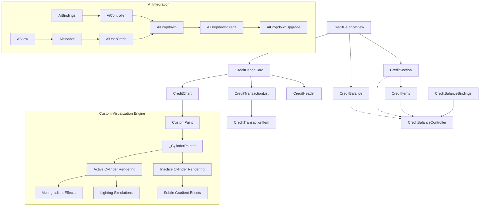

**Diagram sources**
- [credit_balance_view.dart:13-68](file://lib/features/credit_balance/views/credit_balance_view.dart#L13-L68)
- [credit_balance.dart:10-95](file://lib/features/credit_balance/widgets/credit_balance_view_widgets/credit_balance.dart#L10-L95)
- [credit_section.dart:13-110](file://lib/features/credit_balance/widgets/credit_balance_view_widgets/credit_section.dart#L13-L110)
- [credit_items.dart:10-81](file://lib/features/credit_balance/widgets/credit_balance_view_widgets/credit_items.dart#L10-L81)
- [credit_usage_card.dart:9-37](file://lib/features/credit_balance/widgets/credit_balance_view_widgets/credit_usage_card.dart#L9-L37)
- [credit_headar.dart:7-37](file://lib/features/credit_balance/widgets/credit_balance_view_widgets/credit_headar.dart#L7-L37)
- [credit_chart.dart:9-353](file://lib/features/credit_balance/widgets/credit_balance_view_widgets/credit_chart.dart#L9-L353)
- [credit_transaction_list.dart:10-121](file://lib/features/credit_balance/widgets/credit_balance_view_widgets/credit_transaction_list.dart#L10-L121)
- [credit_transaction_item.dart:8-73](file://lib/features/credit_balance/widgets/credit_balance_view_widgets/credit_transaction_item.dart#L8-L73)
- [credit_balance_controller.dart:3-7](file://lib/features/credit_balance/controller/credit_balance_controller.dart#L3-L7)
- [credit_balance_bindings.dart:4-9](file://lib/features/credit_balance/bindings/credit_balance_bindings.dart#L4-L9)
- [credit_chart.dart:120-352](file://lib/features/credit_balance/widgets/credit_balance_view_widgets/credit_chart.dart#L120-L352)
- [ai_controller.dart:7-94](file://lib/features/ai/controller/ai_controller.dart#L7-L94)
- [ai_dropdown.dart:10-70](file://lib/features/ai/widgets/ai_view_widgets/ai_dropdown.dart#L10-L70)
- [ai_dropdown_credit.dart:12-88](file://lib/features/ai/widgets/ai_view_widgets/ai_dropdown_credit.dart#L12-L88)
- [ai_dropdown_upgrade.dart:8-49](file://lib/features/ai/widgets/ai_view_widgets/ai_dropdown_upgrade.dart#L8-L49)
- [ai_user_credit.dart:8-31](file://lib/features/ai/widgets/ai_view_widgets/ai_user_credit.dart#L8-L31)
- [ai_header.dart:9-32](file://lib/features/ai/widgets/ai_header.dart#L9-L32)
- [ai_bindings.dart:4-10](file://lib/features/ai/bindings/ai_bindings.dart#L4-L10)
- [ai_view.dart:7-26](file://lib/features/ai/views/ai_view.dart#L7-L26)

## Detailed Component Analysis

### CreditBalanceController
- Responsibilities:
  - Manage selected item index for credit package selection.
  - Track selected payment card for top-ups.
- Reactive state:
  - selectedItem: RxInt for selection state.
  - selectedCard: RxString for the chosen card.
  - cardList: Static list of cards for demonstration.

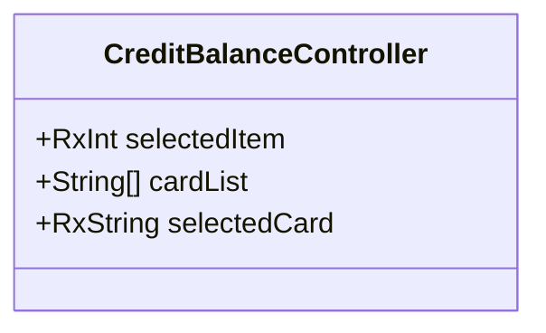

**Diagram sources**
- [credit_balance_controller.dart:3-7](file://lib/features/credit_balance/controller/credit_balance_controller.dart#L3-L7)

**Section sources**
- [credit_balance_controller.dart:3-7](file://lib/features/credit_balance/controller/credit_balance_controller.dart#L3-L7)

### Credit Transaction Model
- Purpose: Encapsulate transaction record data.
- Fields: title, date, amount.

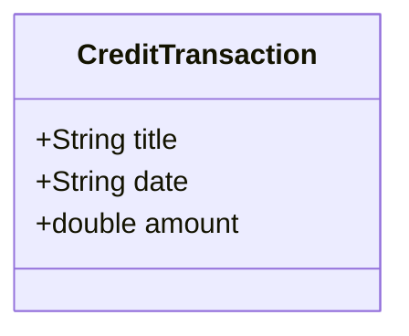

**Diagram sources**
- [credit_transaction_model.dart:1-11](file://lib/features/credit_balance/models/credit_transaction_model.dart#L1-L11)

**Section sources**
- [credit_transaction_model.dart:1-11](file://lib/features/credit_balance/models/credit_transaction_model.dart#L1-L11)

### Credit Chart Model
- Purpose: Encapsulate monthly usage data for visualization.
- Fields: month, value.

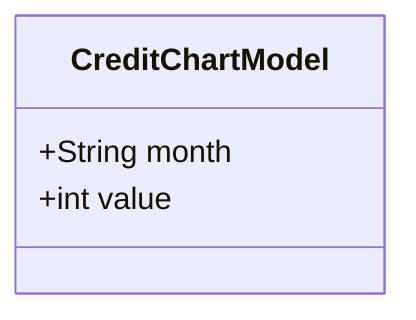

**Diagram sources**
- [credit_chart_model.dart:1-6](file://lib/features/credit_balance/models/credit_chart_model.dart#L1-L6)

**Section sources**
- [credit_chart_model.dart:1-6](file://lib/features/credit_balance/models/credit_chart_model.dart#L1-L6)

### CreditBalanceBindings
- Purpose: Provide dependency injection for the controller using Get.lazyPut.

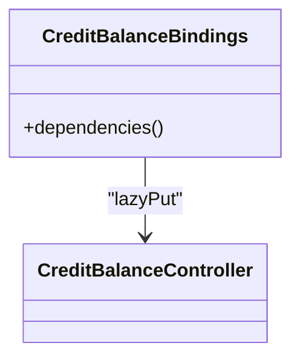

**Diagram sources**
- [credit_balance_bindings.dart:4-9](file://lib/features/credit_balance/bindings/credit_balance_bindings.dart#L4-L9)
- [credit_balance_controller.dart:3-7](file://lib/features/credit_balance/controller/credit_balance_controller.dart#L3-L7)

**Section sources**
- [credit_balance_bindings.dart:4-9](file://lib/features/credit_balance/bindings/credit_balance_bindings.dart#L4-L9)

### CreditBalanceView
- Purpose: Top-level view composing the credit balance UI.
- Behavior: Renders app bar, balance summary, purchase section, and usage card.

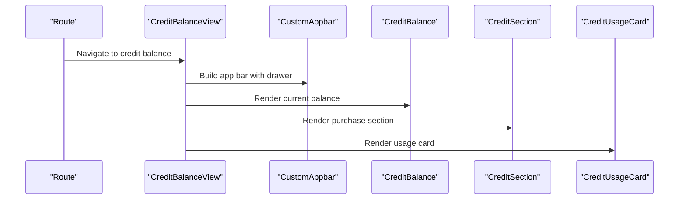

**Diagram sources**
- [routes.dart:199-202](file://lib/core/routes/routes.dart#L199-L202)
- [credit_balance_view.dart:13-68](file://lib/features/credit_balance/views/credit_balance_view.dart#L13-L68)

**Section sources**
- [credit_balance_view.dart:13-68](file://lib/features/credit_balance/views/credit_balance_view.dart#L13-L68)

### CreditBalance Widget
- Purpose: Display current credit balance and provide a purchase action.
- Behavior: Shows balance text and a button to purchase credits.

**Diagram sources**
- [credit_balance.dart:10-95](file://lib/features/credit_balance/widgets/credit_balance_view_widgets/credit_balance.dart#L10-L95)

**Section sources**
- [credit_balance.dart:10-95](file://lib/features/credit_balance/widgets/credit_balance_view_widgets/credit_balance.dart#L10-L95)

### CreditSection Widget
- Purpose: Present credit packages and payment selection.
- Behavior: Renders a grid of credit items, handles selection, and opens a payment dialog with card list.

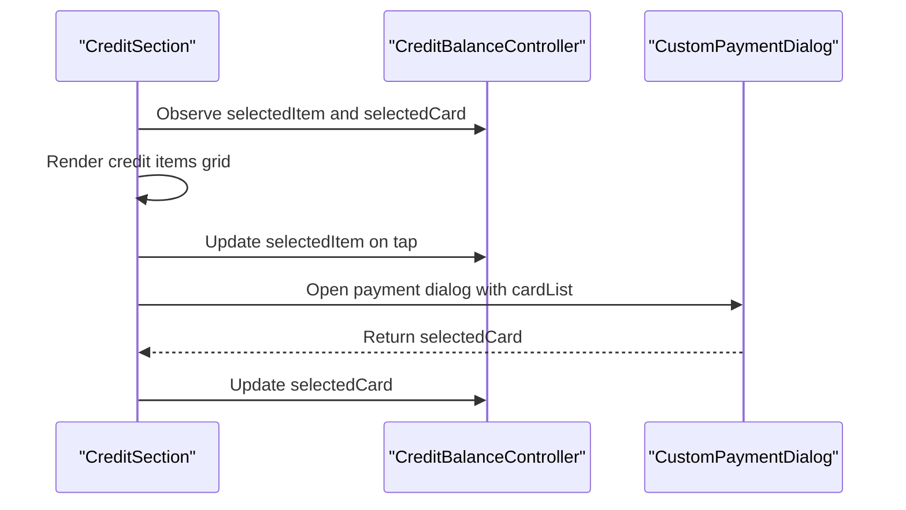

**Diagram sources**
- [credit_section.dart:13-110](file://lib/features/credit_balance/widgets/credit_balance_view_widgets/credit_section.dart#L13-L110)
- [credit_items.dart:10-81](file://lib/features/credit_balance/widgets/credit_balance_view_widgets/credit_items.dart#L10-L81)
- [credit_balance_controller.dart:3-7](file://lib/features/credit_balance/controller/credit_balance_controller.dart#L3-L7)

**Section sources**
- [credit_section.dart:13-110](file://lib/features/credit_balance/widgets/credit_balance_view_widgets/credit_section.dart#L13-L110)
- [credit_items.dart:10-81](file://lib/features/credit_balance/widgets/credit_balance_view_widgets/credit_items.dart#L10-L81)
- [credit_balance_controller.dart:3-7](file://lib/features/credit_balance/controller/credit_balance_controller.dart#L3-L7)

### CreditItems Widget
- Purpose: Grid of selectable credit package items.
- Behavior: Uses controller state to highlight selection and update reactive state.

**Section sources**
- [credit_items.dart:10-81](file://lib/features/credit_balance/widgets/credit_balance_view_widgets/credit_items.dart#L10-L81)

### CreditUsageCard Widget
- Purpose: Container for usage visualization and transaction history.
- Composition: Header, chart, and transaction list.

**Section sources**
- [credit_usage_card.dart:9-37](file://lib/features/credit_balance/widgets/credit_balance_view_widgets/credit_usage_card.dart#L9-L37)

### CreditHeader Widget
- Purpose: Title and current balance display within usage card.

**Section sources**
- [credit_headar.dart:7-37](file://lib/features/credit_balance/widgets/credit_balance_view_widgets/credit_headar.dart#L7-L37)

### CreditChart Widget
- Purpose: Custom cylinder-based visualization system replacing fl_chart dependency.
- Data: Hardcoded CreditChartModel entries for demonstration.
- **Updated**: Complete architectural overhaul from fl_chart-based bar chart to custom cylinder rendering.

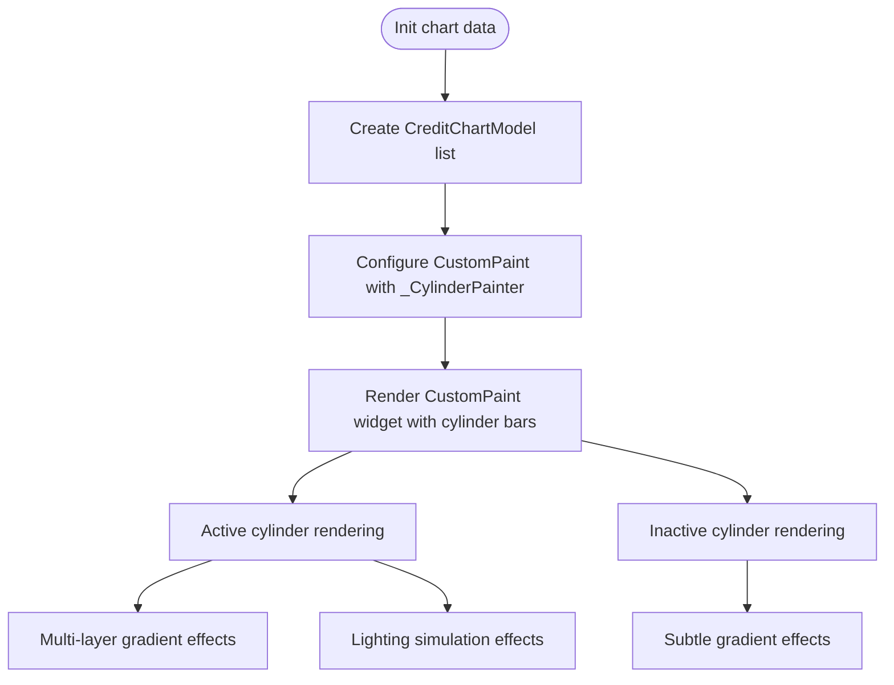

**Diagram sources**
- [credit_chart.dart:9-353](file://lib/features/credit_balance/widgets/credit_balance_view_widgets/credit_chart.dart#L9-L353)
- [credit_chart_model.dart:1-6](file://lib/features/credit_balance/models/credit_chart_model.dart#L1-L6)

**Section sources**
- [credit_chart.dart:9-353](file://lib/features/credit_balance/widgets/credit_balance_view_widgets/credit_chart.dart#L9-L353)
- [credit_chart_model.dart:1-6](file://lib/features/credit_balance/models/credit_chart_model.dart#L1-L6)

### CreditTransactionList Widget
- Purpose: List of recent credit transactions.
- Data: Hardcoded CreditTransaction entries for demonstration.

**Section sources**
- [credit_transaction_list.dart:10-121](file://lib/features/credit_balance/widgets/credit_balance_view_widgets/credit_transaction_list.dart#L10-L121)

### CreditTransactionItem Widget
- Purpose: Individual row in the transaction list.
- Behavior: Formats positive/negative amounts and renders metadata.

**Section sources**
- [credit_transaction_item.dart:8-73](file://lib/features/credit_balance/widgets/credit_balance_view_widgets/credit_transaction_item.dart#L8-L73)

## Custom Cylinder Visualization System

### CreditChart Widget Architecture
The CreditChart widget has undergone a complete architectural transformation from fl_chart-based bar charts to a sophisticated custom cylinder rendering system. This new system eliminates external dependencies while providing enhanced visual aesthetics and interactive capabilities.

**Key Features:**
- **CustomPaint Integration**: Uses Flutter's CustomPaint widget for precise control over rendering
- **CustomPainter Implementation**: Dedicated _CylinderPainter class handles all drawing operations
- **Active/Inactive States**: Dynamic rendering based on selection state with different visual treatments
- **Advanced Gradient Effects**: Multi-layer gradient systems for realistic 3D appearance
- **Lighting Simulations**: Sophisticated lighting effects simulating real-world illumination
- **Responsive Design**: Adapts to theme brightness (light/dark mode support)

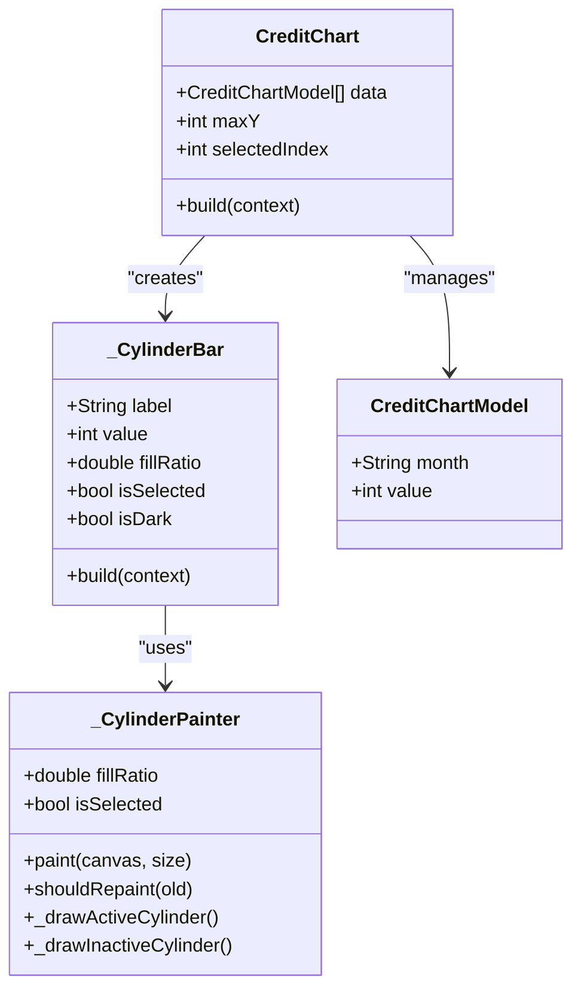

**Diagram sources**
- [credit_chart.dart:8-353](file://lib/features/credit_balance/widgets/credit_balance_view_widgets/credit_chart.dart#L8-L353)
- [credit_chart_model.dart:1-6](file://lib/features/credit_balance/models/credit_chart_model.dart#L1-L6)

### _CylinderPainter Implementation
The _CylinderPainter class is the core of the custom visualization system, implementing sophisticated rendering techniques for both active and inactive cylinder states.

**Active Cylinder Rendering (_drawActiveCylinder):**
- **Multi-gradient Background**: Dark blue gradient base with horizontal linear gradients
- **Smoky Layer Effects**: Three radial gradient layers creating atmospheric effects
- **Light Streak Simulation**: Vertical gradient streak for glass-like reflection
- **Realistic 3D Elements**: Top and bottom elliptical caps with metallic borders
- **Complex Path Clipping**: Precise clipping for proper gradient application

**Inactive Cylinder Rendering (_drawInactiveCylinder):**
- **Subtle Gradient System**: Light gray gradients for neutral appearance
- **Simple Elliptical Caps**: Basic top and bottom caps without complex effects
- **Minimal Borders**: Simple stroke borders for structural definition

**Rendering Pipeline:**
1. Calculate cylinder dimensions and clipping regions
2. Apply appropriate gradient shaders based on state
3. Draw body, caps, and borders with precision
4. Handle theme adaptation for light/dark modes
5. Optimize repaint performance with shouldRepaint override

**Section sources**
- [credit_chart.dart:120-352](file://lib/features/credit_balance/widgets/credit_balance_view_widgets/credit_chart.dart#L120-L352)

### Advanced Visual Effects
The custom cylinder system implements several advanced visual effects that surpass traditional chart rendering:

**Gradient Layering:**
- Horizontal linear gradients for cylindrical appearance
- Radial gradients for atmospheric and lighting effects
- Multi-color transitions for depth perception
- Alpha channel manipulation for transparency effects

**Lighting Simulation:**
- Directional light streaks for realistic reflections
- Multi-angle gradient blending for 3D depth
- Shadow casting through gradient transitions
- Surface texture simulation through gradient variations

**Material Properties:**
- Metallic surface appearance through gradient combinations
- Glass-like transparency effects
- Realistic edge highlighting and shadowing
- Responsive color adaptation to theme changes

**Section sources**
- [credit_chart.dart:161-347](file://lib/features/credit_balance/widgets/credit_balance_view_widgets/credit_chart.dart#L161-L347)

## AI Credit Integration

### AiController
- Purpose: Manages AI-specific credit items and dropdown overlay functionality.
- Responsibilities:
  - Maintains AI credit transaction list with predefined credit usage data.
  - Handles overlay entry creation and management for dropdown display.
  - Provides layer link for overlay positioning compatibility.
- Credit Items: Predefined list of CreditTransaction objects representing AI credit usage history.

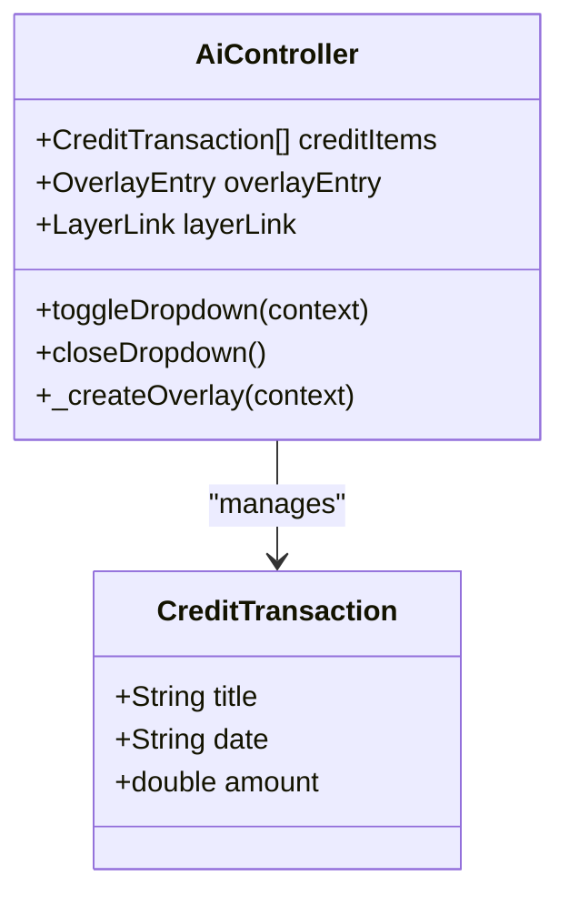

**Diagram sources**
- [ai_controller.dart:7-94](file://lib/features/ai/controller/ai_controller.dart#L7-L94)
- [credit_transaction_model.dart:1-11](file://lib/features/credit_balance/models/credit_transaction_model.dart#L1-L11)

**Section sources**
- [ai_controller.dart:7-94](file://lib/features/ai/controller/ai_controller.dart#L7-L94)
- [credit_transaction_model.dart:1-11](file://lib/features/credit_balance/models/credit_transaction_model.dart#L1-L11)

### AiDropdown Widget
- Purpose: Displays user credit information with dropdown trigger functionality.
- Behavior: Shows user avatar, name, and credit balance with expandable dropdown indicator.
- Integration: Uses LayerLink for overlay positioning compatibility with GetX framework.

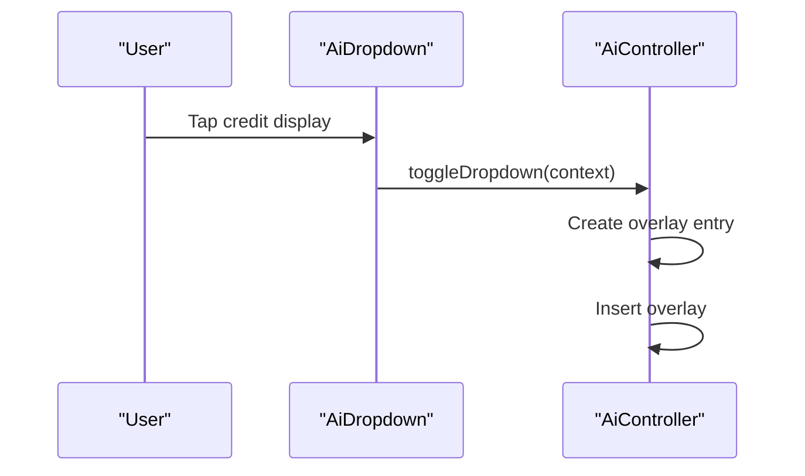

**Diagram sources**
- [ai_dropdown.dart:10-70](file://lib/features/ai/widgets/ai_view_widgets/ai_dropdown.dart#L10-L70)
- [ai_controller.dart:58-65](file://lib/features/ai/controller/ai_controller.dart#L58-L65)

**Section sources**
- [ai_dropdown.dart:10-70](file://lib/features/ai/widgets/ai_view_widgets/ai_dropdown.dart#L10-L70)
- [ai_controller.dart:58-65](file://lib/features/ai/controller/ai_controller.dart#L58-L65)

### AiDropdownCredit Widget
- Purpose: Creates the main content of the AI credit dropdown overlay.
- Features:
  - Displays credit usage header with coin icon and balance.
  - Shows credit chart visualization using the new custom cylinder system.
  - Renders scrollable transaction list using CreditTransactionItem widgets.
  - Includes upgrade button at the bottom for credit package upgrades.
- Integration: Utilizes existing CreditChart and CreditTransactionItem widgets from credit balance system.

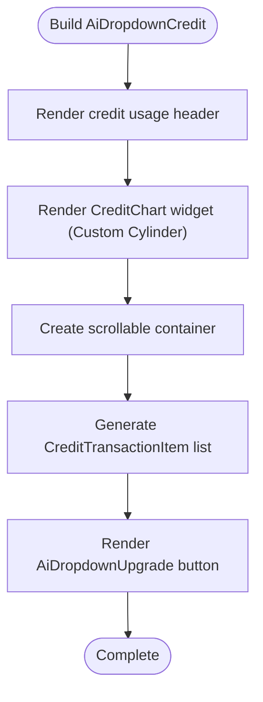

**Diagram sources**
- [ai_dropdown_credit.dart:12-88](file://lib/features/ai/widgets/ai_view_widgets/ai_dropdown_credit.dart#L12-L88)
- [credit_chart.dart:9-353](file://lib/features/credit_balance/widgets/credit_balance_view_widgets/credit_chart.dart#L9-L353)
- [credit_transaction_item.dart:8-73](file://lib/features/credit_balance/widgets/credit_balance_view_widgets/credit_transaction_item.dart#L8-L73)

**Section sources**
- [ai_dropdown_credit.dart:12-88](file://lib/features/ai/widgets/ai_view_widgets/ai_dropdown_credit.dart#L12-L88)
- [credit_chart.dart:9-353](file://lib/features/credit_balance/widgets/credit_balance_view_widgets/credit_chart.dart#L9-L353)
- [credit_transaction_item.dart:8-73](file://lib/features/credit_balance/widgets/credit_balance_view_widgets/credit_transaction_item.dart#L8-L73)

### AiDropdownUpgrade Widget
- Purpose: Provides upgrade functionality for credit packages within the AI dropdown.
- Features:
  - Blurred backdrop effect for modern UI appearance.
  - Gradient background that adapts to theme brightness.
  - Prominent upgrade button with custom styling.
  - Rounded bottom corners for visual integration with dropdown.

**Section sources**
- [ai_dropdown_upgrade.dart:8-49](file://lib/features/ai/widgets/ai_view_widgets/ai_dropdown_upgrade.dart#L8-L49)

### AiUserCredit Widget
- Purpose: Integrates credit display within AI interface layout.
- Composition: Combines back button with AiDropdown for consistent AI navigation.
- Layout: Uses row layout with space-between alignment for proper spacing.

**Section sources**
- [ai_user_credit.dart:8-31](file://lib/features/ai/widgets/ai_view_widgets/ai_user_credit.dart#L8-L31)

### AiHeader Integration
- Purpose: Provides AI interface header with integrated credit management.
- Integration: Uses AiUserCredit component for credit display within AI navigation.
- Navigation: Supports AI view navigation with proper argument passing.

**Section sources**
- [ai_header.dart:9-32](file://lib/features/ai/widgets/ai_header.dart#L9-L32)

### AiBindings
- Purpose: Provides dependency injection for AiController using Get.lazyPut.
- Integration: Enables AI credit functionality without manual controller instantiation.

**Section sources**
- [ai_bindings.dart:4-10](file://lib/features/ai/bindings/ai_bindings.dart#L4-L10)

## Dependency Analysis
- Routing integrates the credit balance view with its binding and supports AI interface navigation.
- The view depends on widgets; widgets depend on models and controller.
- Binding provides controller instantiation for dependency injection.
- **Custom Visualization Dependencies**: CreditChart widget depends on CustomPaint and CustomPainter classes for rendering.
- **AI Integration Dependencies**: AiController depends on CreditTransaction model and uses overlay positioning for dropdown functionality.
- **External Dependencies**: fl_chart remains as a dependency despite the architectural change, though it's no longer actively used in the codebase.

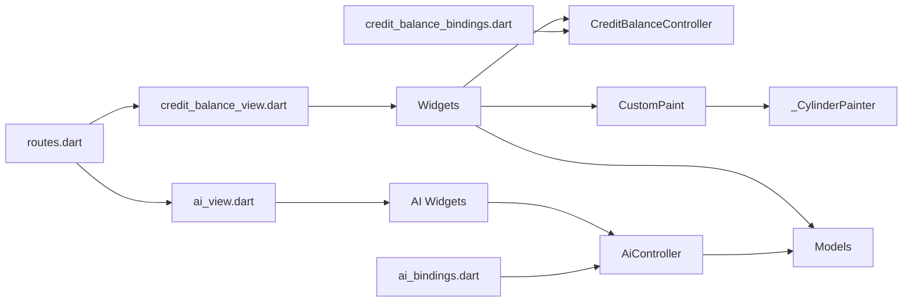

**Diagram sources**
- [routes.dart:199-202](file://lib/core/routes/routes.dart#L199-L202)
- [routes.dart:249-252](file://lib/core/routes/routes.dart#L249-L252)
- [credit_balance_view.dart:13-68](file://lib/features/credit_balance/views/credit_balance_view.dart#L13-L68)
- [ai_view.dart:7-26](file://lib/features/ai/views/ai_view.dart#L7-L26)
- [credit_balance_bindings.dart:4-9](file://lib/features/credit_balance/bindings/credit_balance_bindings.dart#L4-L9)
- [ai_bindings.dart:4-10](file://lib/features/ai/bindings/ai_bindings.dart#L4-L10)
- [credit_chart.dart:120-352](file://lib/features/credit_balance/widgets/credit_balance_view_widgets/credit_chart.dart#L120-L352)

**Section sources**
- [routes.dart:199-202](file://lib/core/routes/routes.dart#L199-L202)
- [routes.dart:249-252](file://lib/core/routes/routes.dart#L249-L252)
- [credit_balance_bindings.dart:4-9](file://lib/features/credit_balance/bindings/credit_balance_bindings.dart#L4-L9)
- [ai_bindings.dart:4-10](file://lib/features/ai/bindings/ai_bindings.dart#L4-L10)
- [credit_chart.dart:120-352](file://lib/features/credit_balance/widgets/credit_balance_view_widgets/credit_chart.dart#L120-L352)

## Performance Considerations
- Widget composition: Prefer lightweight StatelessWidgets for static content to minimize rebuild costs.
- Lists: Use ListView.builder for large transaction lists to avoid unnecessary widget creation.
- **Custom Visualization Performance**: CustomPaint and CustomPainter provide efficient rendering with optimized shouldRepaint logic.
- **Gradient Optimization**: Multi-layer gradients are computed once per paint operation, minimizing repeated calculations.
- **Theme Adaptation**: Automatic theme switching without performance penalties through built-in Flutter theme system.
- Reactive state: Limit excessive reactive updates by batching controller state changes.
- **AI Overlay Performance**: Overlay entries should be properly disposed to prevent memory leaks.
- **AI Credit Data**: Predefined credit items are efficient but consider pagination for large transaction histories.

## Troubleshooting Guide
- Missing balance updates: Verify controller state is being observed by widgets and that reactive properties are updated after actions.
- Transaction list not rendering: Confirm the transaction list length and itemBuilder are correctly configured.
- Payment dialog not selecting card: Ensure the dialog passes back the selected card and the controller updates selectedCard.
- Icons not displaying: Confirm asset paths in icons_path.dart match actual assets.
- **Custom Cylinder Rendering Issues**: Verify CustomPaint widget is properly sized and CustomPainter is receiving correct parameters.
- **Gradient Effects Not Appearing**: Check that gradient shaders are being created with valid color values and proper bounds.
- **Lighting Simulation Problems**: Ensure gradient directions and alpha values are correctly configured for desired lighting effects.
- **Theme Adaptation Failures**: Verify theme brightness detection and color adaptation logic in _CylinderPainter.
- **AI Dropdown not appearing**: Verify overlay entry is properly created and inserted, and layerLink is correctly passed to CompositedTransformTarget.
- **AI Credit items not showing**: Ensure AiController is properly injected and creditItems list contains valid CreditTransaction objects.
- **AI Upgrade button not working**: Check that AiDropdownUpgrade widget is properly positioned and receives user interaction events.

**Section sources**
- [credit_balance_controller.dart:3-7](file://lib/features/credit_balance/controller/credit_balance_controller.dart#L3-L7)
- [credit_transaction_list.dart:10-121](file://lib/features/credit_balance/widgets/credit_balance_view_widgets/credit_transaction_list.dart#L10-L121)
- [credit_chart.dart:120-352](file://lib/features/credit_balance/widgets/credit_balance_view_widgets/credit_chart.dart#L120-L352)
- [ai_controller.dart:58-94](file://lib/features/ai/controller/ai_controller.dart#L58-L94)
- [ai_dropdown_credit.dart:12-88](file://lib/features/ai/widgets/ai_view_widgets/ai_dropdown_credit.dart#L12-L88)
- [icons_path.dart:109-111](file://lib/core/constant/icons_path.dart#L109-L111)

## Conclusion
The Credit Balance System provides a modular structure for managing credit balances, presenting usage analytics, and enabling top-ups. The system has been significantly enhanced with a revolutionary custom cylinder-based visualization system that eliminates external dependencies while providing sophisticated gradient effects, lighting simulations, and realistic 3D-like cylinder rendering. The new implementation uses CustomPaint and CustomPainter classes to create advanced visual effects with active/inactive states, multi-layer gradient systems, and responsive theme adaptation.

The system has been enhanced with AI credit dropdown widgets that seamlessly integrate credit management functionality within AI interface components. The current implementation focuses on UI composition and reactive state for selection and card choice, with AI-specific credit item management and overlay-based dropdown functionality. The custom visualization system demonstrates advanced Flutter rendering capabilities while maintaining excellent performance characteristics.

Future enhancements should integrate backend APIs for real-time balance updates, transaction processing, and financial tracking, while maintaining the existing widget and model abstractions. The AI integration demonstrates successful cross-feature collaboration, enabling users to manage credits directly from AI interface contexts. The custom cylinder visualization system represents a significant architectural achievement in Flutter development, showcasing the power of CustomPaint for creating sophisticated UI components.