# Credit Balance System

<cite>
**Referenced Files in This Document**
- [credit_balance_controller.dart](file://lib/features/credit_balance/controller/credit_balance_controller.dart)
- [credit_transaction_model.dart](file://lib/features/credit_balance/models/credit_transaction_model.dart)
- [credit_chart_model.dart](file://lib/features/credit_balance/models/credit_chart_model.dart)
- [credit_balance_bindings.dart](file://lib/features/credit_balance/bindings/credit_balance_bindings.dart)
- [credit_balance_view.dart](file://lib/features/credit_balance/views/credit_balance_view.dart)
- [credit_balance.dart](file://lib/features/credit_balance/widgets/credit_balance_view_widgets/credit_balance.dart)
- [credit_section.dart](file://lib/features/credit_balance/widgets/credit_balance_view_widgets/credit_section.dart)
- [credit_items.dart](file://lib/features/credit_balance/widgets/credit_balance_view_widgets/credit_items.dart)
- [credit_usage_card.dart](file://lib/features/credit_balance/widgets/credit_balance_view_widgets/credit_usage_card.dart)
- [credit_headar.dart](file://lib/features/credit_balance/widgets/credit_balance_view_widgets/credit_headar.dart)
- [credit_chart.dart](file://lib/features/credit_balance/widgets/credit_balance_view_widgets/credit_chart.dart)
- [credit_transaction_list.dart](file://lib/features/credit_balance/widgets/credit_balance_view_widgets/credit_transaction_list.dart)
- [credit_transaction_item.dart](file://lib/features/credit_balance/widgets/credit_balance_view_widgets/credit_transaction_item.dart)
- [routes.dart](file://lib/core/routes/routes.dart)
- [icons_path.dart](file://lib/core/constant/icons_path.dart)
</cite>

## Table of Contents
1. [Introduction](#introduction)
2. [Project Structure](#project-structure)
3. [Core Components](#core-components)
4. [Architecture Overview](#architecture-overview)
5. [Detailed Component Analysis](#detailed-component-analysis)
6. [Dependency Analysis](#dependency-analysis)
7. [Performance Considerations](#performance-considerations)
8. [Troubleshooting Guide](#troubleshooting-guide)
9. [Conclusion](#conclusion)

## Introduction
This document describes the Credit Balance System, focusing on credit transactions, top-up mechanisms, and usage tracking. It explains the responsibilities of the credit controller for transaction processing, balance calculations, and history management. It documents the credit models for transaction records, balance updates, and financial tracking. It covers the credit view components for balance display, transaction history, and credit management interfaces. It also documents the credit binding configurations for dependency injection and service initialization, and the credit widget components for balance visualization, transaction forms, and status indicators. Finally, it addresses the integration between the credit system and user profile for a seamless credit management experience.

## Project Structure
The Credit Balance System is organized by feature with dedicated controller, models, bindings, views, and widgets. Routing integrates the credit balance view with its binding.

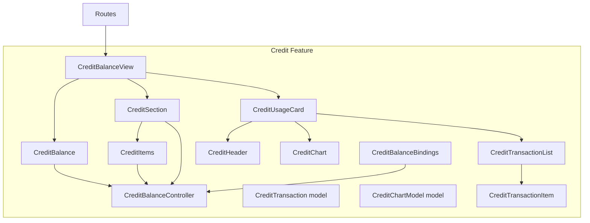

**Diagram sources**
- [routes.dart:186-189](file://lib/core/routes/routes.dart#L186-L189)
- [credit_balance_view.dart:13-68](file://lib/features/credit_balance/views/credit_balance_view.dart#L13-L68)
- [credit_balance.dart:10-95](file://lib/features/credit_balance/widgets/credit_balance_view_widgets/credit_balance.dart#L10-L95)
- [credit_section.dart:13-110](file://lib/features/credit_balance/widgets/credit_balance_view_widgets/credit_section.dart#L13-L110)
- [credit_items.dart:10-81](file://lib/features/credit_balance/widgets/credit_balance_view_widgets/credit_items.dart#L10-L81)
- [credit_usage_card.dart:9-37](file://lib/features/credit_balance/widgets/credit_balance_view_widgets/credit_usage_card.dart#L9-L37)
- [credit_headar.dart:7-37](file://lib/features/credit_balance/widgets/credit_balance_view_widgets/credit_headar.dart#L7-L37)
- [credit_chart.dart:9-126](file://lib/features/credit_balance/widgets/credit_balance_view_widgets/credit_chart.dart#L9-L126)
- [credit_transaction_list.dart:10-121](file://lib/features/credit_balance/widgets/credit_balance_view_widgets/credit_transaction_list.dart#L10-L121)
- [credit_transaction_item.dart:8-73](file://lib/features/credit_balance/widgets/credit_balance_view_widgets/credit_transaction_item.dart#L8-L73)
- [credit_transaction_model.dart:1-11](file://lib/features/credit_balance/models/credit_transaction_model.dart#L1-L11)
- [credit_chart_model.dart:1-6](file://lib/features/credit_balance/models/credit_chart_model.dart#L1-L6)
- [credit_balance_controller.dart:3-7](file://lib/features/credit_balance/controller/credit_balance_controller.dart#L3-L7)
- [credit_balance_bindings.dart:4-9](file://lib/features/credit_balance/bindings/credit_balance_bindings.dart#L4-L9)

**Section sources**
- [routes.dart:186-189](file://lib/core/routes/routes.dart#L186-L189)
- [credit_balance_view.dart:13-68](file://lib/features/credit_balance/views/credit_balance_view.dart#L13-L68)

## Core Components
- CreditBalanceController: Manages selection state for credit packages and selected payment card. It exposes reactive properties for UI updates.
- CreditTransaction model: Represents a single credit transaction with title, date, and amount.
- CreditChartModel: Represents a data point for the usage chart with month and value.
- CreditBalanceBindings: Provides dependency injection via lazy loading for the controller.
- Views and Widgets: Compose the credit balance display, purchase section, usage card, charts, and transaction lists.

Key responsibilities:
- Transaction processing: Represented by the transaction model and list rendering.
- Balance calculations: Not implemented in code; placeholder balance is shown in widgets.
- History management: Rendered via transaction list and items.

**Section sources**
- [credit_balance_controller.dart:3-7](file://lib/features/credit_balance/controller/credit_balance_controller.dart#L3-L7)
- [credit_transaction_model.dart:1-11](file://lib/features/credit_balance/models/credit_transaction_model.dart#L1-L11)
- [credit_chart_model.dart:1-6](file://lib/features/credit_balance/models/credit_chart_model.dart#L1-L6)
- [credit_balance_bindings.dart:4-9](file://lib/features/credit_balance/bindings/credit_balance_bindings.dart#L4-L9)

## Architecture Overview
The system follows a layered architecture:
- View layer: CreditBalanceView composes widgets for balance, purchase section, and usage card.
- Widget layer: Reusable widgets encapsulate UI concerns (balance display, chart, transaction list).
- Model layer: Immutable data models for transactions and chart data.
- Controller layer: State management for selections and reactive updates.
- Binding layer: Dependency injection for the controller.

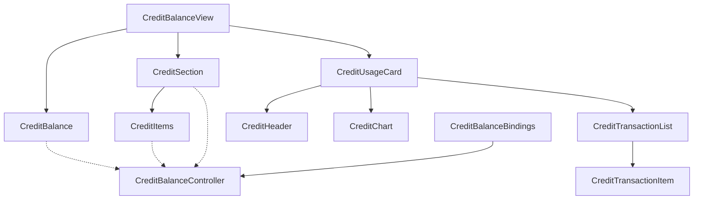

**Diagram sources**
- [credit_balance_view.dart:13-68](file://lib/features/credit_balance/views/credit_balance_view.dart#L13-L68)
- [credit_balance.dart:10-95](file://lib/features/credit_balance/widgets/credit_balance_view_widgets/credit_balance.dart#L10-L95)
- [credit_section.dart:13-110](file://lib/features/credit_balance/widgets/credit_balance_view_widgets/credit_section.dart#L13-L110)
- [credit_items.dart:10-81](file://lib/features/credit_balance/widgets/credit_balance_view_widgets/credit_items.dart#L10-L81)
- [credit_usage_card.dart:9-37](file://lib/features/credit_balance/widgets/credit_balance_view_widgets/credit_usage_card.dart#L9-L37)
- [credit_headar.dart:7-37](file://lib/features/credit_balance/widgets/credit_balance_view_widgets/credit_headar.dart#L7-L37)
- [credit_chart.dart:9-126](file://lib/features/credit_balance/widgets/credit_balance_view_widgets/credit_chart.dart#L9-L126)
- [credit_transaction_list.dart:10-121](file://lib/features/credit_balance/widgets/credit_balance_view_widgets/credit_transaction_list.dart#L10-L121)
- [credit_transaction_item.dart:8-73](file://lib/features/credit_balance/widgets/credit_balance_view_widgets/credit_transaction_item.dart#L8-L73)
- [credit_balance_controller.dart:3-7](file://lib/features/credit_balance/controller/credit_balance_controller.dart#L3-L7)
- [credit_balance_bindings.dart:4-9](file://lib/features/credit_balance/bindings/credit_balance_bindings.dart#L4-L9)

## Detailed Component Analysis

### CreditBalanceController
- Responsibilities:
  - Manage selected item index for credit package selection.
  - Track selected payment card for top-ups.
- Reactive state:
  - selectedItem: RxInt for selection state.
  - selectedCard: RxString for the chosen card.
  - cardList: Static list of cards for demonstration.

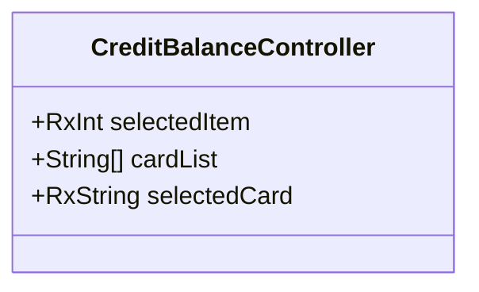

**Diagram sources**
- [credit_balance_controller.dart:3-7](file://lib/features/credit_balance/controller/credit_balance_controller.dart#L3-L7)

**Section sources**
- [credit_balance_controller.dart:3-7](file://lib/features/credit_balance/controller/credit_balance_controller.dart#L3-L7)

### Credit Transaction Model
- Purpose: Encapsulate transaction record data.
- Fields: title, date, amount.

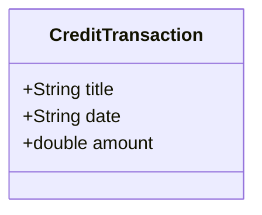

**Diagram sources**
- [credit_transaction_model.dart:1-11](file://lib/features/credit_balance/models/credit_transaction_model.dart#L1-L11)

**Section sources**
- [credit_transaction_model.dart:1-11](file://lib/features/credit_balance/models/credit_transaction_model.dart#L1-L11)

### Credit Chart Model
- Purpose: Encapsulate monthly usage data for visualization.
- Fields: month, value.

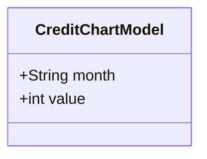

**Diagram sources**
- [credit_chart_model.dart:1-6](file://lib/features/credit_balance/models/credit_chart_model.dart#L1-L6)

**Section sources**
- [credit_chart_model.dart:1-6](file://lib/features/credit_balance/models/credit_chart_model.dart#L1-L6)

### CreditBalanceBindings
- Purpose: Provide dependency injection for the controller using Get.lazyPut.

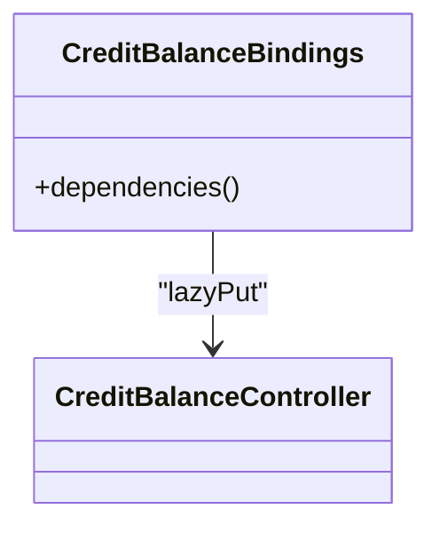

**Diagram sources**
- [credit_balance_bindings.dart:4-9](file://lib/features/credit_balance/bindings/credit_balance_bindings.dart#L4-L9)
- [credit_balance_controller.dart:3-7](file://lib/features/credit_balance/controller/credit_balance_controller.dart#L3-L7)

**Section sources**
- [credit_balance_bindings.dart:4-9](file://lib/features/credit_balance/bindings/credit_balance_bindings.dart#L4-L9)

### CreditBalanceView
- Purpose: Top-level view composing the credit balance UI.
- Behavior: Renders app bar, balance summary, purchase section, and usage card.

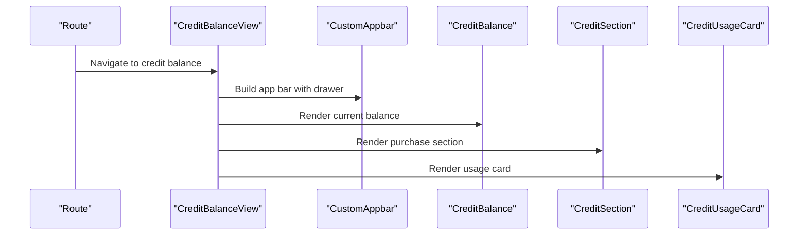

**Diagram sources**
- [routes.dart:186-189](file://lib/core/routes/routes.dart#L186-L189)
- [credit_balance_view.dart:13-68](file://lib/features/credit_balance/views/credit_balance_view.dart#L13-L68)

**Section sources**
- [credit_balance_view.dart:13-68](file://lib/features/credit_balance/views/credit_balance_view.dart#L13-L68)

### CreditBalance Widget
- Purpose: Display current credit balance and provide a purchase action.
- Behavior: Shows balance text and a button to purchase credits.

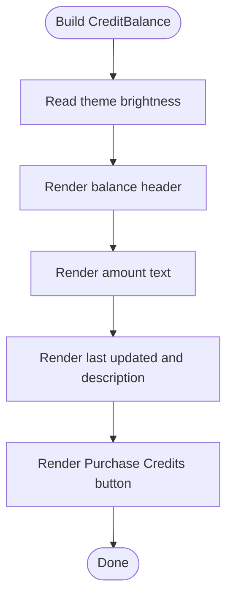

**Diagram sources**
- [credit_balance.dart:10-95](file://lib/features/credit_balance/widgets/credit_balance_view_widgets/credit_balance.dart#L10-L95)

**Section sources**
- [credit_balance.dart:10-95](file://lib/features/credit_balance/widgets/credit_balance_view_widgets/credit_balance.dart#L10-L95)

### CreditSection Widget
- Purpose: Present credit packages and payment selection.
- Behavior: Renders a grid of credit items, handles selection, and opens a payment dialog with card list.

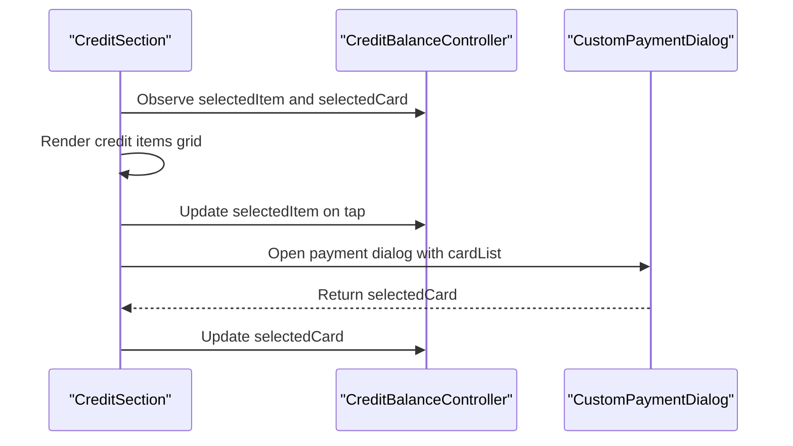

**Diagram sources**
- [credit_section.dart:13-110](file://lib/features/credit_balance/widgets/credit_balance_view_widgets/credit_section.dart#L13-L110)
- [credit_items.dart:10-81](file://lib/features/credit_balance/widgets/credit_balance_view_widgets/credit_items.dart#L10-L81)
- [credit_balance_controller.dart:3-7](file://lib/features/credit_balance/controller/credit_balance_controller.dart#L3-L7)

**Section sources**
- [credit_section.dart:13-110](file://lib/features/credit_balance/widgets/credit_balance_view_widgets/credit_section.dart#L13-L110)
- [credit_items.dart:10-81](file://lib/features/credit_balance/widgets/credit_balance_view_widgets/credit_items.dart#L10-L81)
- [credit_balance_controller.dart:3-7](file://lib/features/credit_balance/controller/credit_balance_controller.dart#L3-L7)

### CreditItems Widget
- Purpose: Grid of selectable credit package items.
- Behavior: Uses controller state to highlight selection and update reactive state.

**Section sources**
- [credit_items.dart:10-81](file://lib/features/credit_balance/widgets/credit_balance_view_widgets/credit_items.dart#L10-L81)

### CreditUsageCard Widget
- Purpose: Container for usage visualization and transaction history.
- Composition: Header, chart, and transaction list.

**Section sources**
- [credit_usage_card.dart:9-37](file://lib/features/credit_balance/widgets/credit_balance_view_widgets/credit_usage_card.dart#L9-L37)

### CreditHeader Widget
- Purpose: Title and current balance display within usage card.

**Section sources**
- [credit_headar.dart:7-37](file://lib/features/credit_balance/widgets/credit_balance_view_widgets/credit_headar.dart#L7-L37)

### CreditChart Widget
- Purpose: Bar chart visualizing monthly credit usage.
- Data: Hardcoded CreditChartModel entries for demonstration.

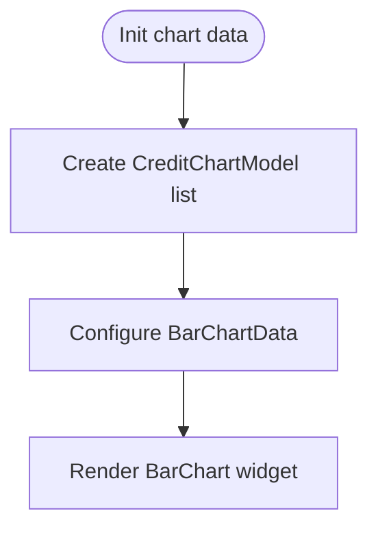

**Diagram sources**
- [credit_chart.dart:9-126](file://lib/features/credit_balance/widgets/credit_balance_view_widgets/credit_chart.dart#L9-L126)
- [credit_chart_model.dart:1-6](file://lib/features/credit_balance/models/credit_chart_model.dart#L1-L6)

**Section sources**
- [credit_chart.dart:9-126](file://lib/features/credit_balance/widgets/credit_balance_view_widgets/credit_chart.dart#L9-L126)
- [credit_chart_model.dart:1-6](file://lib/features/credit_balance/models/credit_chart_model.dart#L1-L6)

### CreditTransactionList Widget
- Purpose: List of recent credit transactions.
- Data: Hardcoded CreditTransaction entries for demonstration.

**Section sources**
- [credit_transaction_list.dart:10-121](file://lib/features/credit_balance/widgets/credit_balance_view_widgets/credit_transaction_list.dart#L10-L121)

### CreditTransactionItem Widget
- Purpose: Individual row in the transaction list.
- Behavior: Formats positive/negative amounts and renders metadata.

**Section sources**
- [credit_transaction_item.dart:8-73](file://lib/features/credit_balance/widgets/credit_balance_view_widgets/credit_transaction_item.dart#L8-L73)

## Dependency Analysis
- Routing integrates the credit balance view with its binding.
- The view depends on widgets; widgets depend on models and controller.
- Binding provides controller instantiation for dependency injection.

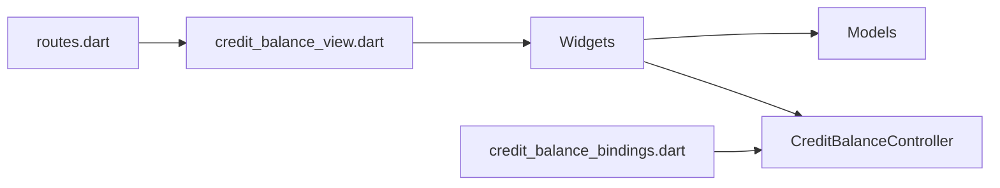

**Diagram sources**
- [routes.dart:186-189](file://lib/core/routes/routes.dart#L186-L189)
- [credit_balance_view.dart:13-68](file://lib/features/credit_balance/views/credit_balance_view.dart#L13-L68)
- [credit_balance_bindings.dart:4-9](file://lib/features/credit_balance/bindings/credit_balance_bindings.dart#L4-L9)

**Section sources**
- [routes.dart:186-189](file://lib/core/routes/routes.dart#L186-L189)
- [credit_balance_bindings.dart:4-9](file://lib/features/credit_balance/bindings/credit_balance_bindings.dart#L4-L9)

## Performance Considerations
- Widget composition: Prefer lightweight StatelessWidgets for static content to minimize rebuild costs.
- Lists: Use ListView.builder for large transaction lists to avoid unnecessary widget creation.
- Charts: Keep chart data small and immutable to prevent frequent recomputation.
- Reactive state: Limit excessive reactive updates by batching controller state changes.

## Troubleshooting Guide
- Missing balance updates: Verify controller state is being observed by widgets and that reactive properties are updated after actions.
- Transaction list not rendering: Confirm the transaction list length and itemBuilder are correctly configured.
- Payment dialog not selecting card: Ensure the dialog passes back the selected card and the controller updates selectedCard.
- Icons not displaying: Confirm asset paths in icons_path.dart match actual assets.

**Section sources**
- [credit_balance_controller.dart:3-7](file://lib/features/credit_balance/controller/credit_balance_controller.dart#L3-L7)
- [credit_transaction_list.dart:10-121](file://lib/features/credit_balance/widgets/credit_balance_view_widgets/credit_transaction_list.dart#L10-L121)
- [icons_path.dart:109-111](file://lib/core/constant/icons_path.dart#L109-L111)

## Conclusion
The Credit Balance System provides a modular structure for managing credit balances, presenting usage analytics, and enabling top-ups. The current implementation focuses on UI composition and reactive state for selection and card choice. Future enhancements should integrate backend APIs for real-time balance updates, transaction processing, and financial tracking, while maintaining the existing widget and model abstractions.