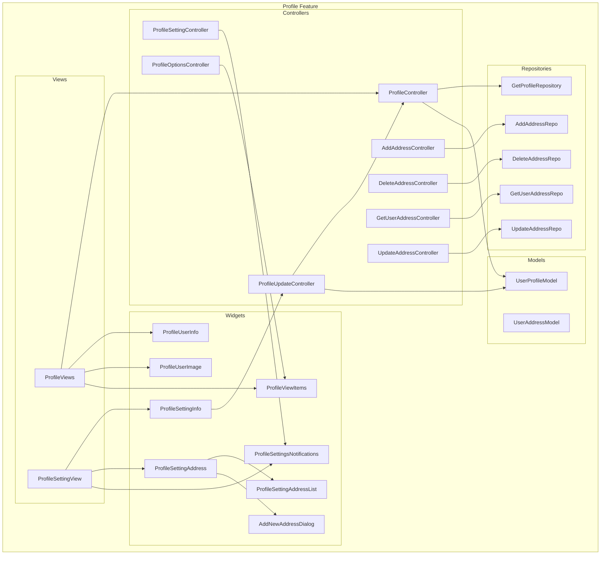
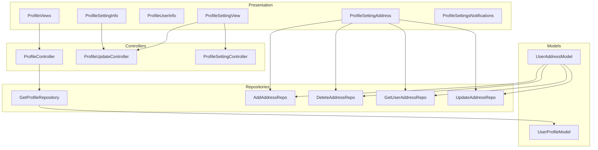
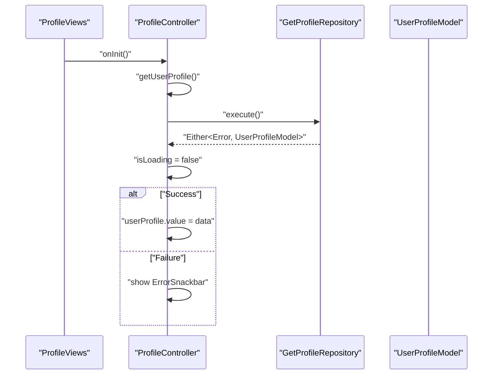
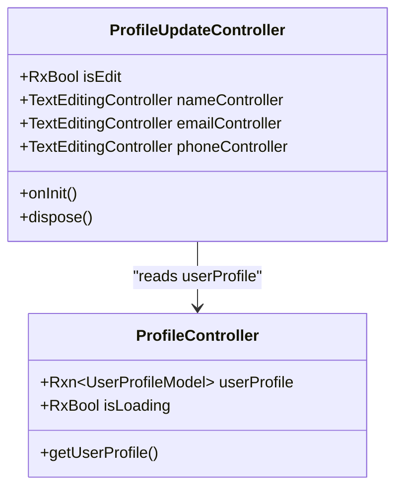
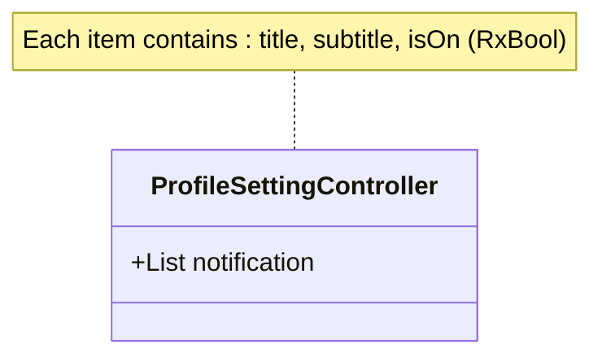
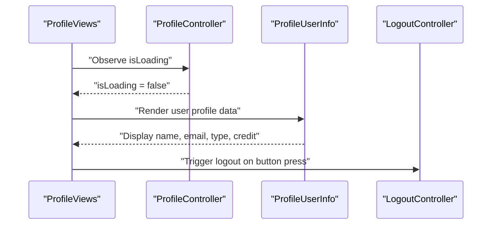
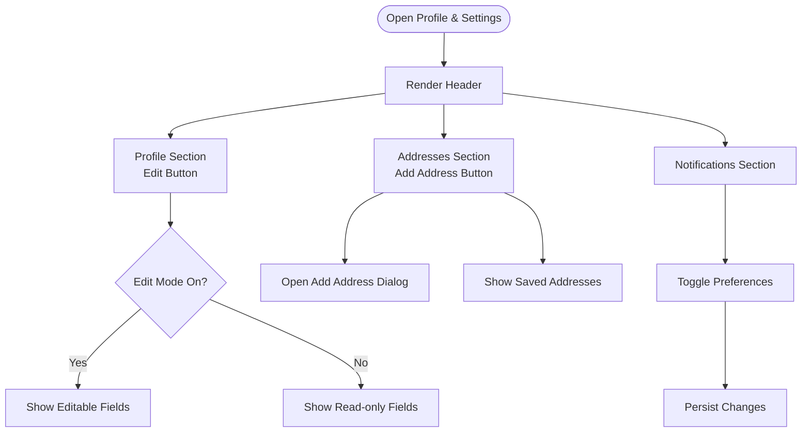
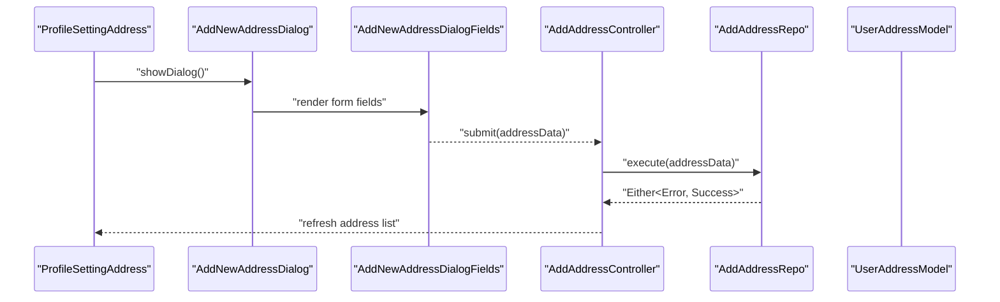
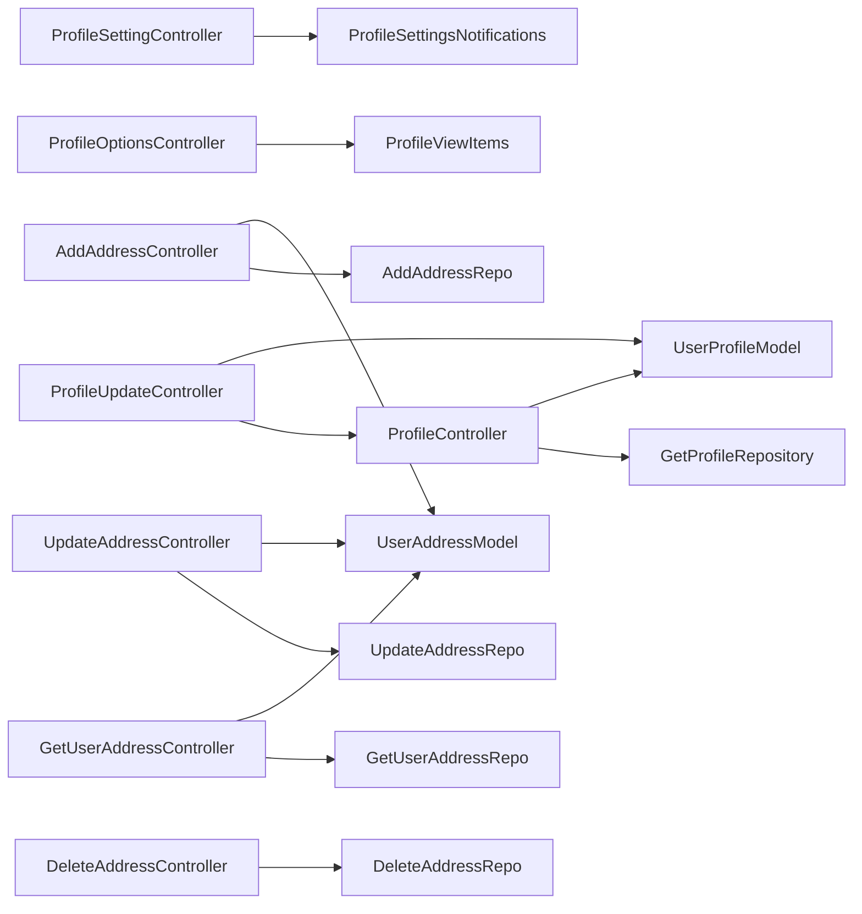

# Profile Management

<cite>
**Referenced Files in This Document**
- [profile_controller.dart](file://lib/features/profile/controllers/profile_controller.dart)
- [profile_update_controller.dart](file://lib/features/profile/controllers/profile_update_controller.dart)
- [profile_setting_controller.dart](file://lib/features/profile/controllers/profile_setting_controller.dart)
- [profile_options_controller.dart](file://lib/features/profile/controllers/profile_options_controller.dart)
- [add_address_controller.dart](file://lib/features/profile/controllers/add_address_controller.dart)
- [delete_address_controller.dart](file://lib/features/profile/controllers/delete_address_controller.dart)
- [get_user_address_controller.dart](file://lib/features/profile/controllers/get_user_address_controller.dart)
- [update_address_controller.dart](file://lib/features/profile/controllers/update_address_controller.dart)
- [get_profile_repo.dart](file://lib/features/profile/repositories/get_profile_repo.dart)
- [add_address_repo.dart](file://lib/features/profile/repositories/add_address_repo.dart)
- [delete_address_repo.dart](file://lib/features/profile/repositories/delete_address_repo.dart)
- [get_user_address_repo.dart](file://lib/features/profile/repositories/get_user_address_repo.dart)
- [update_address_repo.dart](file://lib/features/profile/repositories/update_address_repo.dart)
- [user_profile_model.dart](file://lib/core/data/global_models/user_profile_model.dart)
- [user_address_model.dart](file://lib/features/profile/models/user_address_model.dart)
- [profile_views.dart](file://lib/features/profile/views/profile_views.dart)
- [profile_setting_view.dart](file://lib/features/profile/views/profile_setting_view.dart)
- [profile_user_info.dart](file://lib/features/profile/widgets/profile_view_widgets/profile_user_info.dart)
- [profile_user_image.dart](file://lib/features/profile/widgets/profile_view_widgets/profile_user_image.dart)
- [profile_view_items.dart](file://lib/features/profile/widgets/profile_view_widgets/profile_view_items.dart)
- [theme_mode_switch_button.dart](file://lib/features/profile/widgets/profile_view_widgets/theme_mode_switch_button.dart)
- [profile_setting_info.dart](file://lib/features/profile/widgets/profile_setting_widgets/profile_setting_info.dart)
- [profile_setting_info_fields.dart](file://lib/features/profile/widgets/profile_setting_widgets/profile_setting_info_fields.dart)
- [profile_settings_header.dart](file://lib/features/profile/widgets/profile_setting_widgets/profile_settings_header.dart)
- [profile_setting_address.dart](file://lib/features/profile/widgets/profile_setting_widgets/profile_setting_address.dart)
- [profile_setting_address_list.dart](file://lib/features/profile/widgets/profile_setting_widgets/profile_setting_address_list.dart)
- [add_new_address_dialog.dart](file://lib/features/profile/widgets/profile_setting_widgets/add_new_address_dialog.dart)
- [add_new_address_dialog_fields.dart](file://lib/features/profile/widgets/profile_setting_widgets/add_new_address_dialog_fields.dart)
- [profile_settings_notifications.dart](file://lib/features/profile/widgets/profile_setting_widgets/profile_settings_notifications.dart)
- [error_snackbar.dart](file://lib/shared/widgets/snackbars/error_snackbar.dart)
- [custom_primary_button.dart](file://lib/shared/widgets/custom_button/custom_primary_button.dart)
- [custom_secondary_button.dart](file://lib/shared/widgets/custom_button/custom_secondary_button.dart)
- [custom_container.dart](file://lib/shared/widgets/custom_container.dart)
- [shared_container.dart](file://lib/shared/widgets/shared_container.dart)
- [custom_appbar.dart](file://lib/shared/widgets/custom_appbar.dart)
- [button_loading.dart](file://lib/shared/widgets/custom_loadings/button_loading.dart)
- [logout_controller.dart](file://lib/features/auth/controller/logout_controller.dart)
</cite>

## Table of Contents
1. [Introduction](#introduction)
2. [Project Structure](#project-structure)
3. [Core Components](#core-components)
4. [Architecture Overview](#architecture-overview)
5. [Detailed Component Analysis](#detailed-component-analysis)
6. [Dependency Analysis](#dependency-analysis)
7. [Performance Considerations](#performance-considerations)
8. [Troubleshooting Guide](#troubleshooting-guide)
9. [Conclusion](#conclusion)

## Introduction
This document describes the Profile Management system, covering user profile creation and editing workflows, user information management, and profile settings interface. It explains the responsibilities of the profile controller for data fetching, validation, and updates, details the profile settings controller for managing user preferences and notifications, and documents the profile view components including user information display, profile image handling, and interactive elements. It also covers the profile setting widgets for address management, personal information editing, and notification preferences, including the user address model structure, validation rules, and data persistence mechanisms. Finally, it addresses the integration between profile views and controllers for a seamless user experience.

## Project Structure
The Profile Management feature is organized under the features/profile module with clear separation of concerns:
- Controllers: encapsulate state and orchestrate data operations
- Repositories: abstract network/database operations
- Models: define data structures for user profiles and addresses
- Views: present UI and coordinate with controllers
- Widgets: reusable UI components for profile and settings screens

**Diagram sources**
- [profile_controller.dart:1-32](file://lib/features/profile/controllers/profile_controller.dart#L1-L32)
- [profile_update_controller.dart:1-28](file://lib/features/profile/controllers/profile_update_controller.dart#L1-L28)
- [profile_setting_controller.dart:1-27](file://lib/features/profile/controllers/profile_setting_controller.dart#L1-L27)
- [profile_options_controller.dart](file://lib/features/profile/controllers/profile_options_controller.dart)
- [add_address_controller.dart](file://lib/features/profile/controllers/add_address_controller.dart)
- [delete_address_controller.dart](file://lib/features/profile/controllers/delete_address_controller.dart)
- [get_user_address_controller.dart](file://lib/features/profile/controllers/get_user_address_controller.dart)
- [update_address_controller.dart](file://lib/features/profile/controllers/update_address_controller.dart)
- [get_profile_repo.dart](file://lib/features/profile/repositories/get_profile_repo.dart)
- [add_address_repo.dart](file://lib/features/profile/repositories/add_address_repo.dart)
- [delete_address_repo.dart](file://lib/features/profile/repositories/delete_address_repo.dart)
- [get_user_address_repo.dart](file://lib/features/profile/repositories/get_user_address_repo.dart)
- [update_address_repo.dart](file://lib/features/profile/repositories/update_address_repo.dart)
- [user_profile_model.dart:1-72](file://lib/core/data/global_models/user_profile_model.dart#L1-L72)
- [user_address_model.dart:1-93](file://lib/features/profile/models/user_address_model.dart#L1-L93)
- [profile_views.dart:1-58](file://lib/features/profile/views/profile_views.dart#L1-L58)
- [profile_setting_view.dart:1-64](file://lib/features/profile/views/profile_setting_view.dart#L1-L64)
- [profile_user_info.dart:1-82](file://lib/features/profile/widgets/profile_view_widgets/profile_user_info.dart#L1-L82)
- [profile_user_image.dart](file://lib/features/profile/widgets/profile_view_widgets/profile_user_image.dart)
- [profile_view_items.dart](file://lib/features/profile/widgets/profile_view_widgets/profile_view_items.dart)
- [profile_setting_info.dart:1-40](file://lib/features/profile/widgets/profile_setting_widgets/profile_setting_info.dart#L1-L40)
- [profile_setting_address.dart:1-45](file://lib/features/profile/widgets/profile_setting_widgets/profile_setting_address.dart#L1-L45)
- [profile_setting_address_list.dart](file://lib/features/profile/widgets/profile_setting_widgets/profile_setting_address_list.dart)
- [add_new_address_dialog.dart](file://lib/features/profile/widgets/profile_setting_widgets/add_new_address_dialog.dart)
- [profile_settings_notifications.dart](file://lib/features/profile/widgets/profile_setting_widgets/profile_settings_notifications.dart)

**Section sources**
- [profile_controller.dart:1-32](file://lib/features/profile/controllers/profile_controller.dart#L1-L32)
- [profile_update_controller.dart:1-28](file://lib/features/profile/controllers/profile_update_controller.dart#L1-L28)
- [profile_setting_controller.dart:1-27](file://lib/features/profile/controllers/profile_setting_controller.dart#L1-L27)
- [profile_views.dart:1-58](file://lib/features/profile/views/profile_views.dart#L1-L58)
- [profile_setting_view.dart:1-64](file://lib/features/profile/views/profile_setting_view.dart#L1-L64)

## Core Components
This section outlines the primary components involved in profile management and their responsibilities.

- ProfileController
  - Fetches user profile data via repository
  - Manages loading state and error handling
  - Exposes reactive user profile data to views

- ProfileUpdateController
  - Synchronizes with ProfileController to populate editable fields
  - Manages edit mode state and text controllers for personal info

- ProfileSettingController
  - Holds notification preferences as reactive lists
  - Provides default notification settings

- Repositories
  - Encapsulate network/database operations for profile and address management
  - Return Either-like results for success/failure handling

- Models
  - UserProfileModel: defines user profile structure
  - UserAddressModel: defines address list and individual address fields

- Views and Widgets
  - ProfileViews: renders profile screen with user info, image, and actions
  - ProfileSettingView: renders profile & settings screen with info, addresses, and notifications
  - Reusable widgets handle specific UI segments (user info, addresses, notifications)

**Section sources**
- [profile_controller.dart:6-31](file://lib/features/profile/controllers/profile_controller.dart#L6-L31)
- [profile_update_controller.dart:5-27](file://lib/features/profile/controllers/profile_update_controller.dart#L5-L27)
- [profile_setting_controller.dart:3-26](file://lib/features/profile/controllers/profile_setting_controller.dart#L3-L26)
- [user_profile_model.dart:1-72](file://lib/core/data/global_models/user_profile_model.dart#L1-L72)
- [user_address_model.dart:1-93](file://lib/features/profile/models/user_address_model.dart#L1-L93)
- [profile_views.dart:15-57](file://lib/features/profile/views/profile_views.dart#L15-L57)
- [profile_setting_view.dart:13-63](file://lib/features/profile/views/profile_setting_view.dart#L13-L63)

## Architecture Overview
The Profile Management system follows a layered architecture:
- Presentation Layer: Views and Widgets
- Controller Layer: State and UI logic
- Repository Layer: Data access abstraction
- Model Layer: Data structures

**Diagram sources**
- [profile_views.dart:15-57](file://lib/features/profile/views/profile_views.dart#L15-L57)
- [profile_setting_view.dart:13-63](file://lib/features/profile/views/profile_setting_view.dart#L13-L63)
- [profile_controller.dart:6-31](file://lib/features/profile/controllers/profile_controller.dart#L6-L31)
- [profile_update_controller.dart:5-27](file://lib/features/profile/controllers/profile_update_controller.dart#L5-L27)
- [profile_setting_controller.dart:3-26](file://lib/features/profile/controllers/profile_setting_controller.dart#L3-L26)
- [get_profile_repo.dart](file://lib/features/profile/repositories/get_profile_repo.dart)
- [add_address_repo.dart](file://lib/features/profile/repositories/add_address_repo.dart)
- [delete_address_repo.dart](file://lib/features/profile/repositories/delete_address_repo.dart)
- [get_user_address_repo.dart](file://lib/features/profile/repositories/get_user_address_repo.dart)
- [update_address_repo.dart](file://lib/features/profile/repositories/update_address_repo.dart)
- [user_profile_model.dart:1-72](file://lib/core/data/global_models/user_profile_model.dart#L1-L72)
- [user_address_model.dart:1-93](file://lib/features/profile/models/user_address_model.dart#L1-L93)

## Detailed Component Analysis

### Profile Controller Responsibilities
The ProfileController manages user profile retrieval and state:
- Initialization triggers profile fetch
- Reactive loading state toggles during fetch
- Error handling via error snackbar
- Exposes user profile data for binding in views

**Diagram sources**
- [profile_controller.dart:13-24](file://lib/features/profile/controllers/profile_controller.dart#L13-L24)
- [get_profile_repo.dart](file://lib/features/profile/repositories/get_profile_repo.dart)
- [error_snackbar.dart](file://lib/shared/widgets/snackbars/error_snackbar.dart)

**Section sources**
- [profile_controller.dart:6-31](file://lib/features/profile/controllers/profile_controller.dart#L6-L31)

### Profile Update Controller and Personal Information Editing
The ProfileUpdateController synchronizes with ProfileController to populate editable fields and manage edit mode:
- Reads current profile data from ProfileController
- Initializes text controllers with existing values
- Toggles edit mode for enabling/disabling edits
- Disposes controllers on dispose

**Diagram sources**
- [profile_update_controller.dart:5-27](file://lib/features/profile/controllers/profile_update_controller.dart#L5-L27)
- [profile_controller.dart:6-31](file://lib/features/profile/controllers/profile_controller.dart#L6-L31)

**Section sources**
- [profile_update_controller.dart:5-27](file://lib/features/profile/controllers/profile_update_controller.dart#L5-L27)

### Profile Settings Controller for Notifications
The ProfileSettingController holds notification preferences as reactive lists:
- Defines default notification items with title, subtitle, and reactive toggle state
- Supports enabling/disabling preferences

**Diagram sources**
- [profile_setting_controller.dart:3-26](file://lib/features/profile/controllers/profile_setting_controller.dart#L3-L26)

**Section sources**
- [profile_setting_controller.dart:3-26](file://lib/features/profile/controllers/profile_setting_controller.dart#L3-L26)

### Profile Views and User Information Display
ProfileViews composes the profile screen:
- Uses Obx to reactively render when loading completes
- Displays custom app bar, user image, user info, action items, and logout button
- Integrates with LogoutController for sign-out flow

ProfileUserInfo displays user details:
- Renders name, email, account type, and credit balance
- Uses theme-aware colors and assets

**Diagram sources**
- [profile_views.dart:19-56](file://lib/features/profile/views/profile_views.dart#L19-L56)
- [profile_user_info.dart:10-81](file://lib/features/profile/widgets/profile_view_widgets/profile_user_info.dart#L10-L81)
- [logout_controller.dart](file://lib/features/auth/controller/logout_controller.dart)

**Section sources**
- [profile_views.dart:15-57](file://lib/features/profile/views/profile_views.dart#L15-L57)
- [profile_user_info.dart:10-81](file://lib/features/profile/widgets/profile_view_widgets/profile_user_info.dart#L10-L81)

### Profile Setting View and Interactive Elements
ProfileSettingView organizes profile and settings sections:
- Header with back navigation and title
- Profile section with edit button
- Addresses section with add button and list
- Notifications section for preferences

**Diagram sources**
- [profile_setting_view.dart:13-63](file://lib/features/profile/views/profile_setting_view.dart#L13-L63)
- [profile_setting_info.dart:11-39](file://lib/features/profile/widgets/profile_setting_widgets/profile_setting_info.dart#L11-L39)
- [profile_setting_address.dart:10-44](file://lib/features/profile/widgets/profile_setting_widgets/profile_setting_address.dart#L10-L44)
- [profile_settings_notifications.dart](file://lib/features/profile/widgets/profile_setting_widgets/profile_settings_notifications.dart)

**Section sources**
- [profile_setting_view.dart:13-63](file://lib/features/profile/views/profile_setting_view.dart#L13-L63)
- [profile_setting_info.dart:11-39](file://lib/features/profile/widgets/profile_setting_widgets/profile_setting_info.dart#L11-L39)
- [profile_setting_address.dart:10-44](file://lib/features/profile/widgets/profile_setting_widgets/profile_setting_address.dart#L10-L44)

### Address Management Widgets and Data Persistence
Address management includes:
- ProfileSettingAddress: container with add button and address list
- ProfileSettingAddressList: renders saved addresses
- AddNewAddressDialog and AddNewAddressDialogFields: capture new address details
- Controllers and Repositories for CRUD operations on addresses

**Diagram sources**
- [profile_setting_address.dart:10-44](file://lib/features/profile/widgets/profile_setting_widgets/profile_setting_address.dart#L10-L44)
- [add_new_address_dialog.dart](file://lib/features/profile/widgets/profile_setting_widgets/add_new_address_dialog.dart)
- [add_new_address_dialog_fields.dart](file://lib/features/profile/widgets/profile_setting_widgets/add_new_address_dialog_fields.dart)
- [add_address_controller.dart](file://lib/features/profile/controllers/add_address_controller.dart)
- [add_address_repo.dart](file://lib/features/profile/repositories/add_address_repo.dart)
- [user_address_model.dart:1-93](file://lib/features/profile/models/user_address_model.dart#L1-L93)

**Section sources**
- [profile_setting_address.dart:10-44](file://lib/features/profile/widgets/profile_setting_widgets/profile_setting_address.dart#L10-L44)
- [profile_setting_address_list.dart](file://lib/features/profile/widgets/profile_setting_widgets/profile_setting_address_list.dart)
- [add_new_address_dialog.dart](file://lib/features/profile/widgets/profile_setting_widgets/add_new_address_dialog.dart)
- [add_new_address_dialog_fields.dart](file://lib/features/profile/widgets/profile_setting_widgets/add_new_address_dialog_fields.dart)
- [add_address_controller.dart](file://lib/features/profile/controllers/add_address_controller.dart)
- [add_address_repo.dart](file://lib/features/profile/repositories/add_address_repo.dart)
- [user_address_model.dart:1-93](file://lib/features/profile/models/user_address_model.dart#L1-L93)

### User Address Model Structure and Validation Rules
The UserAddressModel supports nested Address entries with the following fields:
- id, userId, name, phone
- addressLine1, addressLine2, city, state, postalCode, country
- isDefault, type, createdAt, updatedAt

Validation rules (as inferred from field types and naming):
- Required fields for new addresses: name, phone, addressLine1, city, state, postalCode, country
- Optional fields: addressLine2, type, isDefault
- Consistency: userId should match authenticated user ID
- Defaults: isDefault indicates primary address

Data persistence mechanisms:
- Serialization/deserialization via toJson/fromJson
- Repository methods handle network requests and responses

**Section sources**
- [user_address_model.dart:24-92](file://lib/features/profile/models/user_address_model.dart#L24-L92)

## Dependency Analysis
This section maps dependencies among controllers, repositories, and models to understand coupling and cohesion.

**Diagram sources**
- [profile_controller.dart:6-31](file://lib/features/profile/controllers/profile_controller.dart#L6-L31)
- [profile_update_controller.dart:5-27](file://lib/features/profile/controllers/profile_update_controller.dart#L5-L27)
- [profile_setting_controller.dart:3-26](file://lib/features/profile/controllers/profile_setting_controller.dart#L3-L26)
- [profile_options_controller.dart](file://lib/features/profile/controllers/profile_options_controller.dart)
- [add_address_controller.dart](file://lib/features/profile/controllers/add_address_controller.dart)
- [delete_address_controller.dart](file://lib/features/profile/controllers/delete_address_controller.dart)
- [get_user_address_controller.dart](file://lib/features/profile/controllers/get_user_address_controller.dart)
- [update_address_controller.dart](file://lib/features/profile/controllers/update_address_controller.dart)
- [get_profile_repo.dart](file://lib/features/profile/repositories/get_profile_repo.dart)
- [add_address_repo.dart](file://lib/features/profile/repositories/add_address_repo.dart)
- [delete_address_repo.dart](file://lib/features/profile/repositories/delete_address_repo.dart)
- [get_user_address_repo.dart](file://lib/features/profile/repositories/get_user_address_repo.dart)
- [update_address_repo.dart](file://lib/features/profile/repositories/update_address_repo.dart)
- [user_profile_model.dart:1-72](file://lib/core/data/global_models/user_profile_model.dart#L1-L72)
- [user_address_model.dart:1-93](file://lib/features/profile/models/user_address_model.dart#L1-L93)

**Section sources**
- [profile_controller.dart:6-31](file://lib/features/profile/controllers/profile_controller.dart#L6-L31)
- [profile_update_controller.dart:5-27](file://lib/features/profile/controllers/profile_update_controller.dart#L5-L27)
- [profile_setting_controller.dart:3-26](file://lib/features/profile/controllers/profile_setting_controller.dart#L3-L26)
- [user_profile_model.dart:1-72](file://lib/core/data/global_models/user_profile_model.dart#L1-L72)
- [user_address_model.dart:1-93](file://lib/features/profile/models/user_address_model.dart#L1-L93)

## Performance Considerations
- Reactive state management: Using GetX ensures efficient UI updates without unnecessary rebuilds.
- Lazy loading: Profile data is fetched on controller initialization to avoid blocking UI.
- Minimal widget rebuilds: Obx wrappers around specific UI segments reduce recomposition.
- Network efficiency: Repository methods should cache and debounce frequent operations where applicable.

## Troubleshooting Guide
Common issues and resolutions:
- Profile loading spinner persists
  - Verify isLoading is set to false after repository response
  - Check error handling path for failure scenarios

- Edit mode does not toggle
  - Confirm isEdit is bound to the edit button and state changes propagate

- Address dialog not closing
  - Ensure dialog is closed after successful submission in the controller

- Notification preferences not persisting
  - Confirm reactive state updates and persistence layer integration

**Section sources**
- [profile_controller.dart:13-24](file://lib/features/profile/controllers/profile_controller.dart#L13-L24)
- [profile_update_controller.dart:20-27](file://lib/features/profile/controllers/profile_update_controller.dart#L20-L27)
- [profile_setting_controller.dart:3-26](file://lib/features/profile/controllers/profile_setting_controller.dart#L3-L26)

## Conclusion
The Profile Management system integrates controllers, repositories, models, views, and widgets to deliver a cohesive user experience for viewing and editing profiles, managing addresses, and configuring preferences. The architecture emphasizes separation of concerns, reactive state management, and modular UI components, enabling maintainability and scalability.