# User Profile Management

<cite>
**Referenced Files in This Document**
- [pubspec.yaml](file://pubspec.yaml)
- [user_profile_model.dart](file://lib/core/data/global_models/user_profile_model.dart)
- [user_address_model.dart](file://lib/features/profile/models/user_address_model.dart)
- [credit_transaction_model.dart](file://lib/features/credit_balance/models/credit_transaction_model.dart)
- [credit_chart_model.dart](file://lib/features/credit_balance/models/credit_chart_model.dart)
- [profile_controller.dart](file://lib/features/profile/controllers/profile_controller.dart)
- [profile_update_controller.dart](file://lib/features/profile/controllers/profile_update_controller.dart)
- [profile_setting_controller.dart](file://lib/features/profile/controllers/profile_setting_controller.dart)
- [credit_balance_controller.dart](file://lib/features/credit_balance/controller/credit_balance_controller.dart)
- [get_profile_repo.dart](file://lib/features/profile/repositories/get_profile_repo.dart)
- [get_user_address_repo.dart](file://lib/features/profile/repositories/get_user_address_repo.dart)
- [add_address_repo.dart](file://lib/features/profile/repositories/add_address_repo.dart)
- [update_address_repo.dart](file://lib/features/profile/repositories/update_address_repo.dart)
- [delete_address_repo.dart](file://lib/features/profile/repositories/delete_address_repo.dart)
- [profile_bindings.dart](file://lib/features/profile/bindings/profile_bindings.dart)
- [profile_settings_bindings.dart](file://lib/features/profile/bindings/profile_settings_bindings.dart)
- [credit_balance_bindings.dart](file://lib/features/credit_balance/bindings/credit_balance_bindings.dart)
- [profile_views.dart](file://lib/features/profile/views/profile_views.dart)
- [profile_setting_view.dart](file://lib/features/profile/views/profile_setting_view.dart)
- [credit_balance_view.dart](file://lib/features/credit_balance/views/credit_balance_view.dart)
- [profile_user_info.dart](file://lib/features/profile/widgets/profile_view_widgets/profile_user_info.dart)
- [profile_view_items.dart](file://lib/features/profile/widgets/profile_view_widgets/profile_view_items.dart)
- [profile_setting_info.dart](file://lib/features/profile/widgets/profile_setting_widgets/profile_setting_info.dart)
- [profile_setting_address_list.dart](file://lib/features/profile/widgets/profile_setting_widgets/profile_setting_address.dart)
- [profile_setting_address.dart](file://lib/features/profile/widgets/profile_setting_widgets/profile_setting_address_list.dart)
- [add_new_address_dialog.dart](file://lib/features/profile/widgets/profile_setting_widgets/add_new_address_dialog.dart)
- [add_new_address_dialog_fields.dart](file://lib/features/profile/widgets/profile_setting_widgets/add_new_address_dialog_fields.dart)
- [custom_button.dart](file://lib/shared/widgets/custom_button/custom_primary_button.dart)
- [snackbar_error.dart](file://lib/shared/widgets/snackbars/error_snackbar.dart)
</cite>

## Table of Contents
1. [Introduction](#introduction)
2. [Project Structure](#project-structure)
3. [Core Components](#core-components)
4. [Architecture Overview](#architecture-overview)
5. [Detailed Component Analysis](#detailed-component-analysis)
6. [Dependency Analysis](#dependency-analysis)
7. [Performance Considerations](#performance-considerations)
8. [Troubleshooting Guide](#troubleshooting-guide)
9. [Conclusion](#conclusion)

## Introduction
This document describes the User Profile Management system implemented in the ZB-DEZINE Flutter application. It covers profile creation and editing workflows, user information management, account settings, and the integrated credit balance system including credit transactions, top-up mechanisms, and usage tracking. It also documents the profile controllers for data management, validation, and persistence, along with the credit balance controller for transaction processing, chart generation, and balance calculations. Security considerations for user data protection and the widget components for profile display, edit forms, and credit management interfaces are addressed.

## Project Structure
The system is organized into feature-based modules with clear separation of concerns:
- Core: Shared models, network utilities, DI, routing, and services
- Features: Feature-specific modules including profile, credit balance, and others
- Shared: Reusable UI widgets and validators

Key areas for profile and credit management:
- Profile feature: Controllers, repositories, models, views, and widgets
- Credit balance feature: Controllers, models, views, and widgets
- Core models: User profile and address models
- Shared widgets: Reusable UI components and snackbars

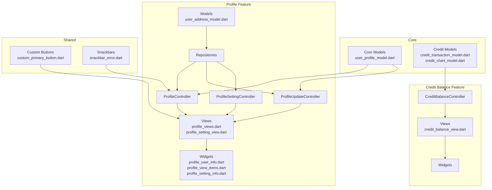

**Diagram sources**
- [user_profile_model.dart:1-72](file://lib/core/data/global_models/user_profile_model.dart#L1-L72)
- [user_address_model.dart:1-93](file://lib/features/profile/models/user_address_model.dart#L1-L93)
- [credit_transaction_model.dart:1-12](file://lib/features/credit_balance/models/credit_transaction_model.dart#L1-L12)
- [credit_chart_model.dart:1-7](file://lib/features/credit_balance/models/credit_chart_model.dart#L1-L7)
- [profile_controller.dart:1-32](file://lib/features/profile/controllers/profile_controller.dart#L1-L32)
- [profile_update_controller.dart:1-28](file://lib/features/profile/controllers/profile_update_controller.dart#L1-L28)
- [profile_setting_controller.dart:1-27](file://lib/features/profile/controllers/profile_setting_controller.dart#L1-L27)
- [credit_balance_controller.dart:1-8](file://lib/features/credit_balance/controller/credit_balance_controller.dart#L1-L8)
- [profile_views.dart](file://lib/features/profile/views/profile_views.dart)
- [profile_setting_view.dart](file://lib/features/profile/views/profile_setting_view.dart)
- [credit_balance_view.dart](file://lib/features/credit_balance/views/credit_balance_view.dart)
- [profile_user_info.dart](file://lib/features/profile/widgets/profile_view_widgets/profile_user_info.dart)
- [profile_view_items.dart](file://lib/features/profile/widgets/profile_view_widgets/profile_view_items.dart)
- [profile_setting_info.dart](file://lib/features/profile/widgets/profile_setting_widgets/profile_setting_info.dart)
- [custom_button.dart](file://lib/shared/widgets/custom_button/custom_primary_button.dart)
- [snackbar_error.dart](file://lib/shared/widgets/snackbars/error_snackbar.dart)

**Section sources**
- [pubspec.yaml:30-66](file://pubspec.yaml#L30-L66)

## Core Components
- User profile model: Defines the structure for user data including identifiers, contact info, and timestamps
- Address model: Encapsulates user address entries with location details and metadata
- Credit models: Transaction and chart data structures for credit tracking and visualization
- Profile controllers: Manage fetching, updating, and editing user profile data
- Credit balance controller: Manages selection and basic credit card data for top-ups
- Repositories: Encapsulate data access for profile and address operations
- Views and widgets: Present profile data, edit forms, notifications, and address management UI

**Section sources**
- [user_profile_model.dart:1-72](file://lib/core/data/global_models/user_profile_model.dart#L1-L72)
- [user_address_model.dart:1-93](file://lib/features/profile/models/user_address_model.dart#L1-L93)
- [credit_transaction_model.dart:1-12](file://lib/features/credit_balance/models/credit_transaction_model.dart#L1-L12)
- [credit_chart_model.dart:1-7](file://lib/features/credit_balance/models/credit_chart_model.dart#L1-L7)
- [profile_controller.dart:1-32](file://lib/features/profile/controllers/profile_controller.dart#L1-L32)
- [profile_update_controller.dart:1-28](file://lib/features/profile/controllers/profile_update_controller.dart#L1-L28)
- [profile_setting_controller.dart:1-27](file://lib/features/profile/controllers/profile_setting_controller.dart#L1-L27)
- [credit_balance_controller.dart:1-8](file://lib/features/credit_balance/controller/credit_balance_controller.dart#L1-L8)

## Architecture Overview
The system follows a layered architecture:
- Presentation layer: Views and widgets render UI and capture user actions
- Controller layer: GetX controllers orchestrate state, manage loading indicators, and coordinate repositories
- Repository layer: Encapsulate data operations and error handling
- Model layer: Immutable data structures for domain entities
- Shared utilities: Snackbars, buttons, and validators support cross-cutting concerns

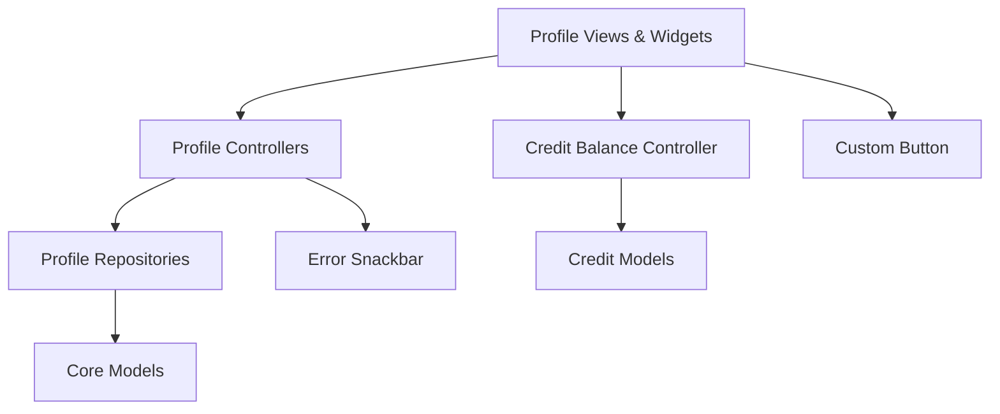

**Diagram sources**
- [profile_controller.dart:1-32](file://lib/features/profile/controllers/profile_controller.dart#L1-L32)
- [profile_update_controller.dart:1-28](file://lib/features/profile/controllers/profile_update_controller.dart#L1-L28)
- [profile_setting_controller.dart:1-27](file://lib/features/profile/controllers/profile_setting_controller.dart#L1-L27)
- [credit_balance_controller.dart:1-8](file://lib/features/credit_balance/controller/credit_balance_controller.dart#L1-L8)
- [user_profile_model.dart:1-72](file://lib/core/data/global_models/user_profile_model.dart#L1-L72)
- [user_address_model.dart:1-93](file://lib/features/profile/models/user_address_model.dart#L1-L93)
- [credit_transaction_model.dart:1-12](file://lib/features/credit_balance/models/credit_transaction_model.dart#L1-L12)
- [snackbar_error.dart](file://lib/shared/widgets/snackbars/error_snackbar.dart)

## Detailed Component Analysis

### Profile Data Models
UserProfileModel and nested Data encapsulate user profile information including identifiers, contact details, and lifecycle timestamps. The Address model supports multiple addresses per user with location fields and metadata.

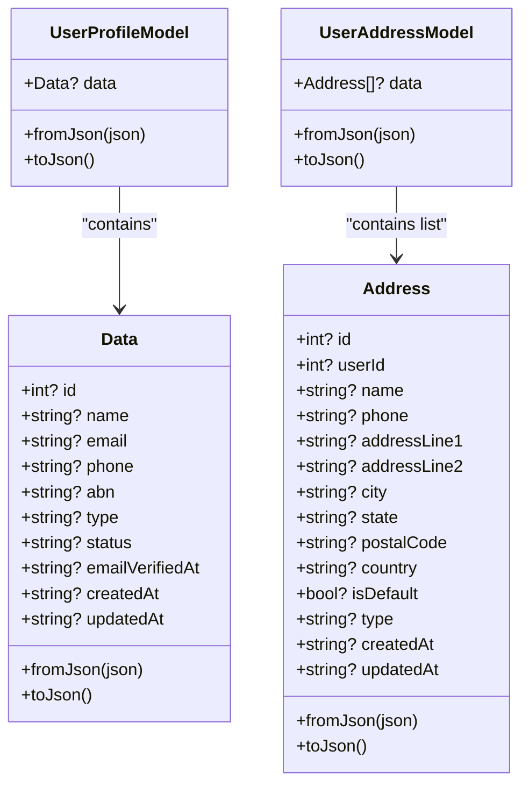

**Diagram sources**
- [user_profile_model.dart:1-72](file://lib/core/data/global_models/user_profile_model.dart#L1-L72)
- [user_address_model.dart:1-93](file://lib/features/profile/models/user_address_model.dart#L1-L93)

**Section sources**
- [user_profile_model.dart:1-72](file://lib/core/data/global_models/user_profile_model.dart#L1-L72)
- [user_address_model.dart:1-93](file://lib/features/profile/models/user_address_model.dart#L1-L93)

### Credit Models
CreditTransaction represents individual credit operations with title, date, and amount. CreditChartModel supports monthly aggregation for charts.

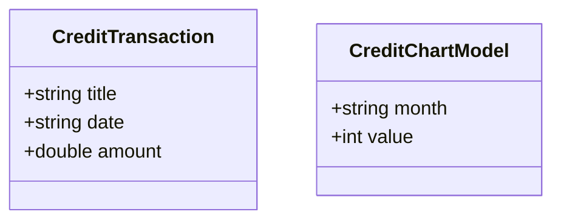

**Diagram sources**
- [credit_transaction_model.dart:1-12](file://lib/features/credit_balance/models/credit_transaction_model.dart#L1-L12)
- [credit_chart_model.dart:1-7](file://lib/features/credit_balance/models/credit_chart_model.dart#L1-L7)

**Section sources**
- [credit_transaction_model.dart:1-12](file://lib/features/credit_balance/models/credit_transaction_model.dart#L1-L12)
- [credit_chart_model.dart:1-7](file://lib/features/credit_balance/models/credit_chart_model.dart#L1-L7)

### Profile Controllers
ProfileController fetches user profile data via a repository and manages loading state and error reporting. ProfileUpdateController initializes form fields from the current profile and handles text editing. ProfileSettingController manages notification preferences.

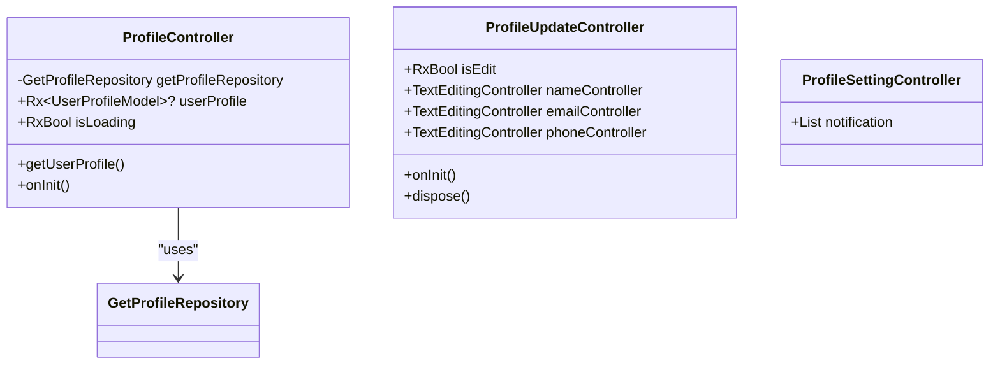

**Diagram sources**
- [profile_controller.dart:1-32](file://lib/features/profile/controllers/profile_controller.dart#L1-L32)
- [profile_update_controller.dart:1-28](file://lib/features/profile/controllers/profile_update_controller.dart#L1-L28)
- [profile_setting_controller.dart:1-27](file://lib/features/profile/controllers/profile_setting_controller.dart#L1-L27)

**Section sources**
- [profile_controller.dart:1-32](file://lib/features/profile/controllers/profile_controller.dart#L1-L32)
- [profile_update_controller.dart:1-28](file://lib/features/profile/controllers/profile_update_controller.dart#L1-L28)
- [profile_setting_controller.dart:1-27](file://lib/features/profile/controllers/profile_setting_controller.dart#L1-L27)

### Credit Balance Controller
CreditBalanceController maintains selected card index and card list for top-up selection. It provides reactive state for UI updates.

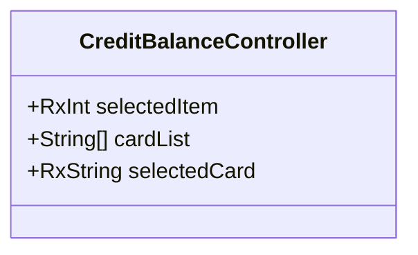

**Diagram sources**
- [credit_balance_controller.dart:1-8](file://lib/features/credit_balance/controller/credit_balance_controller.dart#L1-L8)

**Section sources**
- [credit_balance_controller.dart:1-8](file://lib/features/credit_balance/controller/credit_balance_controller.dart#L1-L8)

### Profile Repositories
Repositories encapsulate data access for profile retrieval and address management. They return results via a functional error-handling pattern, enabling controllers to handle success and failure uniformly.

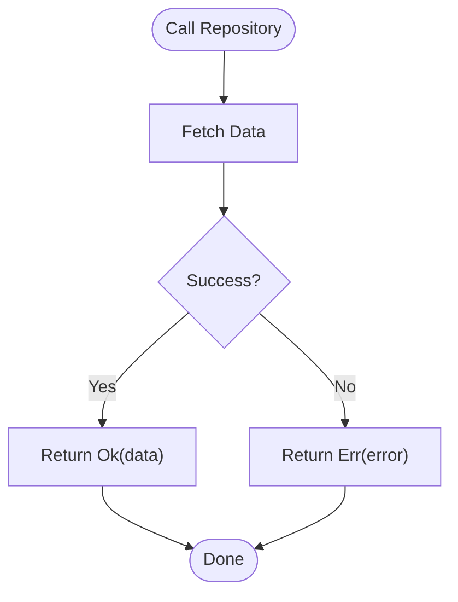

**Diagram sources**
- [get_profile_repo.dart](file://lib/features/profile/repositories/get_profile_repo.dart)
- [get_user_address_repo.dart](file://lib/features/profile/repositories/get_user_address_repo.dart)
- [add_address_repo.dart](file://lib/features/profile/repositories/add_address_repo.dart)
- [update_address_repo.dart](file://lib/features/profile/repositories/update_address_repo.dart)
- [delete_address_repo.dart](file://lib/features/profile/repositories/delete_address_repo.dart)

**Section sources**
- [get_profile_repo.dart](file://lib/features/profile/repositories/get_profile_repo.dart)
- [get_user_address_repo.dart](file://lib/features/profile/repositories/get_user_address_repo.dart)
- [add_address_repo.dart](file://lib/features/profile/repositories/add_address_repo.dart)
- [update_address_repo.dart](file://lib/features/profile/repositories/update_address_repo.dart)
- [delete_address_repo.dart](file://lib/features/profile/repositories/delete_address_repo.dart)

### Profile Views and Widgets
Profile views present user information and settings. Widgets include profile display components and setting panels for notifications and addresses. Add address dialog and fields support address management.

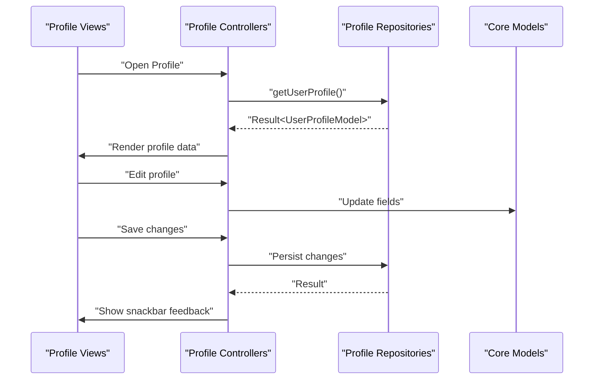

**Diagram sources**
- [profile_views.dart](file://lib/features/profile/views/profile_views.dart)
- [profile_setting_view.dart](file://lib/features/profile/views/profile_setting_view.dart)
- [profile_controller.dart:1-32](file://lib/features/profile/controllers/profile_controller.dart#L1-L32)
- [profile_update_controller.dart:1-28](file://lib/features/profile/controllers/profile_update_controller.dart#L1-L28)
- [get_profile_repo.dart](file://lib/features/profile/repositories/get_profile_repo.dart)
- [user_profile_model.dart:1-72](file://lib/core/data/global_models/user_profile_model.dart#L1-L72)

**Section sources**
- [profile_views.dart](file://lib/features/profile/views/profile_views.dart)
- [profile_setting_view.dart](file://lib/features/profile/views/profile_setting_view.dart)
- [profile_user_info.dart](file://lib/features/profile/widgets/profile_view_widgets/profile_user_info.dart)
- [profile_view_items.dart](file://lib/features/profile/widgets/profile_view_widgets/profile_view_items.dart)
- [profile_setting_info.dart](file://lib/features/profile/widgets/profile_setting_widgets/profile_setting_info.dart)
- [profile_setting_address_list.dart](file://lib/features/profile/widgets/profile_setting_widgets/profile_setting_address_list.dart)
- [profile_setting_address.dart](file://lib/features/profile/widgets/profile_setting_widgets/profile_setting_address.dart)
- [add_new_address_dialog.dart](file://lib/features/profile/widgets/profile_setting_widgets/add_new_address_dialog.dart)
- [add_new_address_dialog_fields.dart](file://lib/features/profile/widgets/profile_setting_widgets/add_new_address_dialog_fields.dart)

### Credit Balance Views and Widgets
Credit balance view integrates with the controller to display and manage credit-related data. Chart models support visualization of credit usage trends.

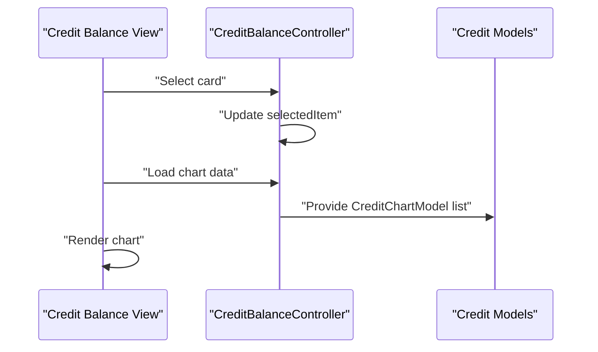

**Diagram sources**
- [credit_balance_view.dart](file://lib/features/credit_balance/views/credit_balance_view.dart)
- [credit_balance_controller.dart:1-8](file://lib/features/credit_balance/controller/credit_balance_controller.dart#L1-L8)
- [credit_chart_model.dart:1-7](file://lib/features/credit_balance/models/credit_chart_model.dart#L1-L7)

**Section sources**
- [credit_balance_view.dart](file://lib/features/credit_balance/views/credit_balance_view.dart)
- [credit_balance_controller.dart:1-8](file://lib/features/credit_balance/controller/credit_balance_controller.dart#L1-L8)
- [credit_chart_model.dart:1-7](file://lib/features/credit_balance/models/credit_chart_model.dart#L1-L7)

### Integration Between Profile Management and Credit System
The profile and credit systems are integrated at the UI level:
- Profile views display user information alongside credit balance controls
- Controllers coordinate data fetching and updates
- Shared widgets provide consistent UX for both profile and credit operations

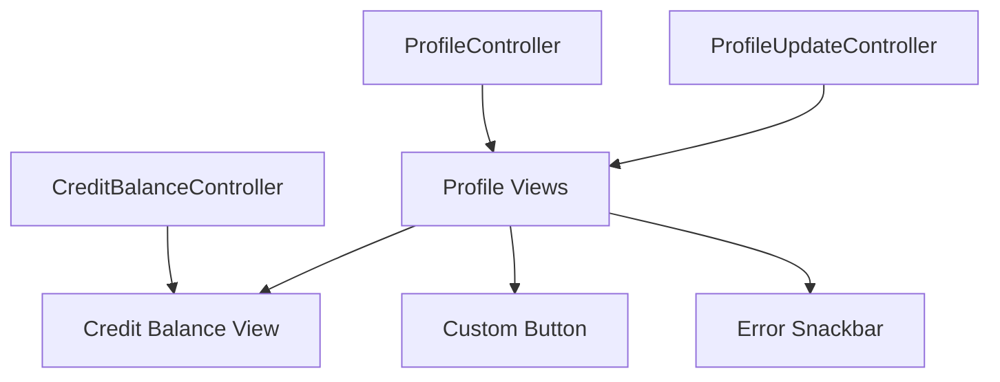

**Diagram sources**
- [profile_controller.dart:1-32](file://lib/features/profile/controllers/profile_controller.dart#L1-L32)
- [profile_update_controller.dart:1-28](file://lib/features/profile/controllers/profile_update_controller.dart#L1-L28)
- [credit_balance_controller.dart:1-8](file://lib/features/credit_balance/controller/credit_balance_controller.dart#L1-L8)
- [profile_views.dart](file://lib/features/profile/views/profile_views.dart)
- [credit_balance_view.dart](file://lib/features/credit_balance/views/credit_balance_view.dart)
- [custom_button.dart](file://lib/shared/widgets/custom_button/custom_primary_button.dart)
- [snackbar_error.dart](file://lib/shared/widgets/snackbars/error_snackbar.dart)

**Section sources**
- [profile_controller.dart:1-32](file://lib/features/profile/controllers/profile_controller.dart#L1-L32)
- [profile_update_controller.dart:1-28](file://lib/features/profile/controllers/profile_update_controller.dart#L1-L28)
- [credit_balance_controller.dart:1-8](file://lib/features/credit_balance/controller/credit_balance_controller.dart#L1-L8)
- [profile_views.dart](file://lib/features/profile/views/profile_views.dart)
- [credit_balance_view.dart](file://lib/features/credit_balance/views/credit_balance_view.dart)

## Dependency Analysis
External dependencies supporting the profile and credit systems include networking, state management, UI components, and Firebase services. These dependencies enable secure authentication, robust UI interactions, and reliable data operations.

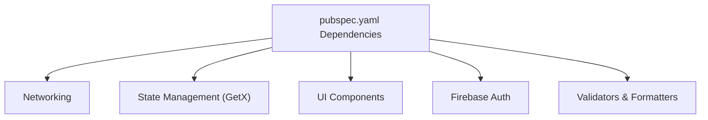

**Diagram sources**
- [pubspec.yaml:30-66](file://pubspec.yaml#L30-L66)

**Section sources**
- [pubspec.yaml:30-66](file://pubspec.yaml#L30-L66)

## Performance Considerations
- Reactive state: GetX controllers minimize rebuilds by exposing only necessary observables
- Lazy loading: Profile data is fetched on controller initialization to avoid blocking UI
- Efficient models: Flat data structures reduce serialization overhead
- Widget reuse: Shared components reduce duplication and improve maintainability

## Troubleshooting Guide
Common issues and resolutions:
- Profile fetch failures: Controllers use error snackbars to report backend or network errors
- Form field initialization: ProfileUpdateController sets initial values from the loaded profile
- Address management: Dialogs and lists provide structured interfaces for CRUD operations
- Credit selection: Controller maintains reactive selections for card-based top-ups

**Section sources**
- [profile_controller.dart:13-24](file://lib/features/profile/controllers/profile_controller.dart#L13-L24)
- [profile_update_controller.dart:15-17](file://lib/features/profile/controllers/profile_update_controller.dart#L15-L17)
- [snackbar_error.dart](file://lib/shared/widgets/snackbars/error_snackbar.dart)

## Conclusion
The User Profile Management system provides a modular, reactive foundation for user data handling and credit operations. With clear separation between presentation, controllers, repositories, and models, the system supports scalable enhancements while maintaining a consistent user experience. The integration of profile and credit features enables seamless management of user information and financial operations.