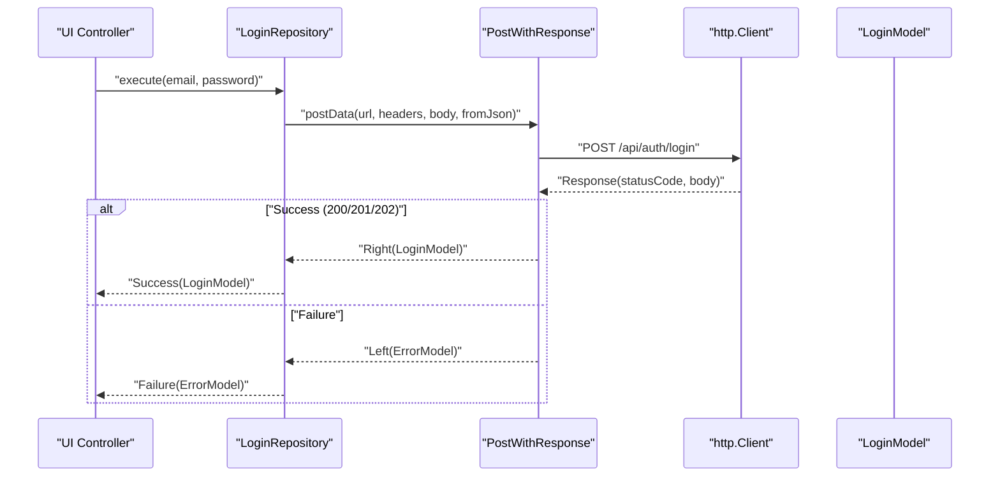
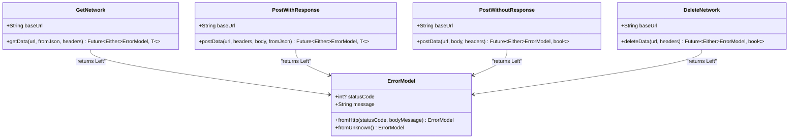
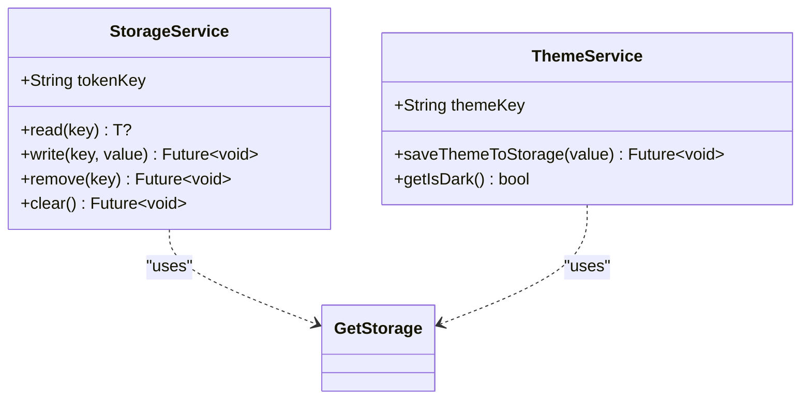
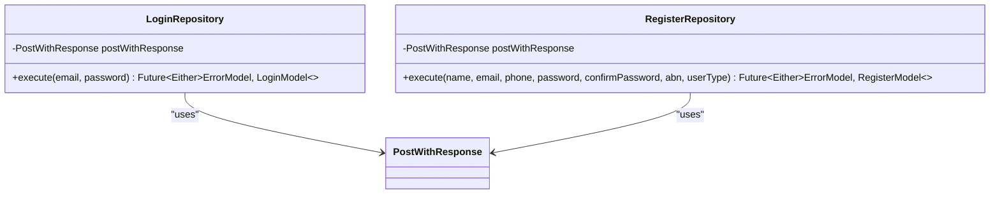
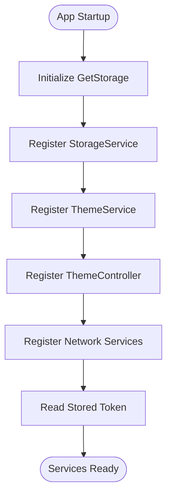
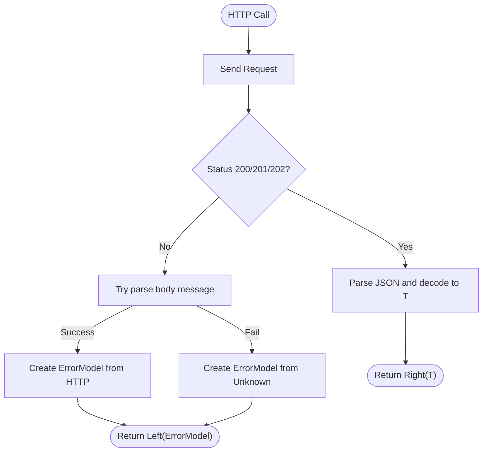
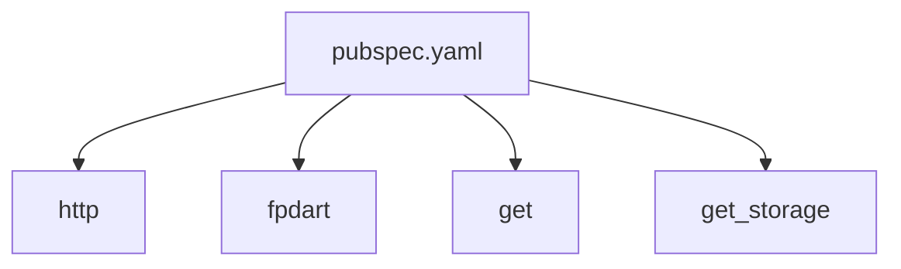

# Data Layer Architecture

<cite>
**Referenced Files in This Document**
- [pubspec.yaml](file://pubspec.yaml)
- [README.md](file://README.md)
- [networks_path.dart](file://lib/core/constant/networks_path.dart)
- [error_model.dart](file://lib/core/data/global_models/error_model.dart)
- [get_network.dart](file://lib/core/data/networks/get_network.dart)
- [post_with_response.dart](file://lib/core/data/networks/post_with_response.dart)
- [post_without_response.dart](file://lib/core/data/networks/post_without_response.dart)
- [delete_network.dart](file://lib/core/data/networks/delete_network.dart)
- [storage_service.dart](file://lib/core/data/local/storage_service.dart)
- [theme_service.dart](file://lib/core/data/local/theme_service.dart)
- [dependency_injection.dart](file://lib/core/di/dependency_injection.dart)
- [login_repo.dart](file://lib/features/auth/repositories/login_repo.dart)
- [register_repo.dart](file://lib/features/auth/repositories/register_repo.dart)
</cite>

## Table of Contents
1. [Introduction](#introduction)
2. [Project Structure](#project-structure)
3. [Core Components](#core-components)
4. [Architecture Overview](#architecture-overview)
5. [Detailed Component Analysis](#detailed-component-analysis)
6. [Dependency Analysis](#dependency-analysis)
7. [Performance Considerations](#performance-considerations)
8. [Security and Privacy Considerations](#security-and-privacy-considerations)
9. [Troubleshooting Guide](#troubleshooting-guide)
10. [Conclusion](#conclusion)

## Introduction
This document describes the data layer architecture for ZB-DEZINE’s Flutter application. It focuses on network services (HTTP request handling, API communication patterns, and error management), local storage (token management, preferences, and persistence), repository patterns, and the integration between network and storage layers. It also outlines offline-first strategies, synchronization, conflict resolution, performance optimization, and security/privacy considerations.

## Project Structure
The data layer is organized around:
- Constants for base URLs
- Global models for error representation
- Network service classes for GET, POST, and DELETE operations
- Local storage services for tokens and theme preferences
- Dependency injection for service provisioning
- Feature-level repositories implementing the repository pattern

```mermaid
graph TB
subgraph "Constants"
NL["NetworkLinks<br/>(baseUrl)"]
end
subgraph "Global Models"
EM["ErrorModel"]
end
subgraph "Network Services"
GN["GetNetwork"]
PWR["PostWithResponse"]
PNR["PostWithoutResponse"]
DN["DeleteNetwork"]
end
subgraph "Local Storage"
SS["StorageService<br/>(token, generic key-value)"]
TS["ThemeService<br/>(dark mode)"]
end
subgraph "DI"
DI["DependencyInjection"]
end
subgraph "Repositories"
LR["LoginRepository"]
RR["RegisterRepository"]
end
NL --> GN
NL --> PWR
NL --> PNR
NL --> DN
DI --> SS
DI --> TS
DI --> GN
DI --> PWR
DI --> PNR
DI --> DN
LR --> PWR
RR --> PWR
```

**Diagram sources**
- [networks_path.dart:1-3](file://lib/core/constant/networks_path.dart#L1-L3)
- [error_model.dart:1-15](file://lib/core/data/global_models/error_model.dart#L1-L15)
- [get_network.dart:1-41](file://lib/core/data/networks/get_network.dart#L1-L41)
- [post_with_response.dart:1-45](file://lib/core/data/networks/post_with_response.dart#L1-L45)
- [post_without_response.dart:1-47](file://lib/core/data/networks/post_without_response.dart#L1-L47)
- [delete_network.dart:1-41](file://lib/core/data/networks/delete_network.dart#L1-L41)
- [storage_service.dart:1-23](file://lib/core/data/local/storage_service.dart#L1-L23)
- [theme_service.dart:1-16](file://lib/core/data/local/theme_service.dart#L1-L16)
- [dependency_injection.dart:1-27](file://lib/core/di/dependency_injection.dart#L1-L27)
- [login_repo.dart:1-29](file://lib/features/auth/repositories/login_repo.dart#L1-L29)
- [register_repo.dart:1-39](file://lib/features/auth/repositories/register_repo.dart#L1-L39)

**Section sources**
- [pubspec.yaml:1-112](file://pubspec.yaml#L1-L112)
- [README.md:1-17](file://README.md#L1-L17)

## Core Components
- Network services encapsulate HTTP operations and return typed results via Either<ErrorModel, T>.
- ErrorModel provides a unified error representation for HTTP and unknown failures.
- Local storage services manage tokens and theme preferences using GetStorage.
- Dependency injection initializes storage and exposes network and storage services across the app.
- Repositories implement feature-specific data operations, delegating to network services and managing serialization.

**Section sources**
- [get_network.dart:8-40](file://lib/core/data/networks/get_network.dart#L8-L40)
- [post_with_response.dart:7-44](file://lib/core/data/networks/post_with_response.dart#L7-L44)
- [post_without_response.dart:9-46](file://lib/core/data/networks/post_without_response.dart#L9-L46)
- [delete_network.dart:8-40](file://lib/core/data/networks/delete_network.dart#L8-L40)
- [error_model.dart:1-15](file://lib/core/data/global_models/error_model.dart#L1-L15)
- [storage_service.dart:3-22](file://lib/core/data/local/storage_service.dart#L3-L22)
- [theme_service.dart:3-15](file://lib/core/data/local/theme_service.dart#L3-L15)
- [dependency_injection.dart:11-26](file://lib/core/di/dependency_injection.dart#L11-L26)
- [login_repo.dart:9-28](file://lib/features/auth/repositories/login_repo.dart#L9-L28)
- [register_repo.dart:9-38](file://lib/features/auth/repositories/register_repo.dart#L9-L38)

## Architecture Overview
The data layer follows a layered architecture:
- Presentation layer invokes repositories.
- Repository layer orchestrates network requests and models.
- Network services abstract HTTP calls and handle status codes and JSON parsing.
- Local storage services persist tokens and preferences.
- Dependency injection wires services and initializes storage.



**Diagram sources**
- [login_repo.dart:14-27](file://lib/features/auth/repositories/login_repo.dart#L14-L27)
- [post_with_response.dart:9-43](file://lib/core/data/networks/post_with_response.dart#L9-L43)
- [error_model.dart:1-15](file://lib/core/data/global_models/error_model.dart#L1-L15)

## Detailed Component Analysis

### Network Services
- GetNetwork: Performs GET requests, decodes JSON, and returns typed results or ErrorModel.
- PostWithResponse: Performs POST with a typed response decoder and robust error extraction.
- PostWithoutResponse: Performs POST without expecting a response payload; returns boolean success or ErrorModel.
- DeleteNetwork: Performs DELETE with success/error handling.

Key characteristics:
- Uses http.Client under the hood.
- Accepts a baseUrl from NetworkLinks and composes endpoint paths.
- Returns Either<ErrorModel, T> to unify success/failure handling.
- Extracts messages from server JSON bodies when available; otherwise uses a default unknown error.



**Diagram sources**
- [get_network.dart:8-40](file://lib/core/data/networks/get_network.dart#L8-L40)
- [post_with_response.dart:7-44](file://lib/core/data/networks/post_with_response.dart#L7-L44)
- [post_without_response.dart:9-46](file://lib/core/data/networks/post_without_response.dart#L9-L46)
- [delete_network.dart:8-40](file://lib/core/data/networks/delete_network.dart#L8-L40)
- [error_model.dart:1-15](file://lib/core/data/global_models/error_model.dart#L1-L15)

**Section sources**
- [get_network.dart:10-39](file://lib/core/data/networks/get_network.dart#L10-L39)
- [post_with_response.dart:9-43](file://lib/core/data/networks/post_with_response.dart#L9-L43)
- [post_without_response.dart:12-45](file://lib/core/data/networks/post_without_response.dart#L12-L45)
- [delete_network.dart:10-39](file://lib/core/data/networks/delete_network.dart#L10-L39)

### Local Storage and Preferences
- StorageService: Provides generic key/value persistence using GetStorage, including token management via a dedicated key.
- ThemeService: Persists and retrieves dark mode preference using GetStorage.



**Diagram sources**
- [storage_service.dart:3-22](file://lib/core/data/local/storage_service.dart#L3-L22)
- [theme_service.dart:3-15](file://lib/core/data/local/theme_service.dart#L3-L15)

**Section sources**
- [storage_service.dart:7-21](file://lib/core/data/local/storage_service.dart#L7-L21)
- [theme_service.dart:7-14](file://lib/core/data/local/theme_service.dart#L7-L14)

### Repository Pattern Implementation
- LoginRepository: Encapsulates login logic by calling PostWithResponse with appropriate headers and JSON body, decoding into LoginModel.
- RegisterRepository: Encapsulates registration logic similarly, building a JSON body and decoding into RegisterModel.



**Diagram sources**
- [login_repo.dart:9-28](file://lib/features/auth/repositories/login_repo.dart#L9-L28)
- [register_repo.dart:9-38](file://lib/features/auth/repositories/register_repo.dart#L9-L38)

**Section sources**
- [login_repo.dart:14-27](file://lib/features/auth/repositories/login_repo.dart#L14-L27)
- [register_repo.dart:23-37](file://lib/features/auth/repositories/register_repo.dart#L23-L37)

### Dependency Injection and Initialization
- DependencyInjection initializes GetStorage and registers StorageService, ThemeService, ThemeController, and network services as singletons.
- On startup, it reads the stored token to bootstrap authentication state.



**Diagram sources**
- [dependency_injection.dart:12-25](file://lib/core/di/dependency_injection.dart#L12-L25)

**Section sources**
- [dependency_injection.dart:12-25](file://lib/core/di/dependency_injection.dart#L12-L25)

### API Communication Patterns and Error Management
- All network services accept a baseUrl and compose endpoint paths.
- Responses with status codes 200/201/202 are treated as success; otherwise, the body is parsed for a message field, defaulting to an unknown error.
- ErrorModel captures HTTP status and message for consistent error handling across the app.



**Diagram sources**
- [get_network.dart:15-38](file://lib/core/data/networks/get_network.dart#L15-L38)
- [post_with_response.dart:15-42](file://lib/core/data/networks/post_with_response.dart#L15-L42)
- [post_without_response.dart:17-44](file://lib/core/data/networks/post_without_response.dart#L17-L44)
- [delete_network.dart:14-38](file://lib/core/data/networks/delete_network.dart#L14-L38)
- [error_model.dart:5-13](file://lib/core/data/global_models/error_model.dart#L5-L13)

**Section sources**
- [networks_path.dart:1-3](file://lib/core/constant/networks_path.dart#L1-L3)
- [error_model.dart:1-15](file://lib/core/data/global_models/error_model.dart#L1-L15)

### Offline-First and Synchronization Strategies
- Current implementation is online-first: repositories depend on network services and do not cache data locally.
- Recommended offline-first enhancements:
  - Introduce a lightweight local cache (e.g., Hive orsembler) for frequently accessed entities.
  - Implement optimistic updates in repositories for write operations, followed by reconciliation on sync.
  - Track last-sync timestamps per entity and resolve conflicts by last-modified-time or merge strategies.
  - Persist pending mutations with retry/backoff policies.

[No sources needed since this section provides general guidance]

### Conflict Resolution
- Use entity versioning or ETags where supported by the backend.
- Fallback to timestamp-based resolution: keep the latest update or merge deterministically.
- For user-initiated edits, surface conflicts to the UI with merge options.

[No sources needed since this section provides general guidance]

## Dependency Analysis
External dependencies relevant to the data layer:
- http: HTTP client for network operations
- fpdart: Functional programming primitives (Either)
- get: DI container and GetStorage initialization
- get_storage: Local key-value storage



**Diagram sources**
- [pubspec.yaml:44-46](file://pubspec.yaml#L44-L46)

**Section sources**
- [pubspec.yaml:44-46](file://pubspec.yaml#L44-L46)

## Performance Considerations
- Prefer streaming JSON parsing for large payloads.
- Reuse HttpClient instances via a singleton network manager.
- Implement request/response compression when supported by the backend.
- Cache small, frequently accessed data in memory with bounded size.
- Debounce or batch rapid-fire writes to reduce network churn.
- Use pagination and selective field fetching to minimize bandwidth.

[No sources needed since this section provides general guidance]

## Security and Privacy Considerations
- Store sensitive tokens securely using platform-specific secure storage (e.g., Android Keystore, iOS Keychain) instead of SharedPreferences-backed GetStorage.
- Enforce HTTPS-only endpoints and certificate pinning where applicable.
- Sanitize logs and avoid printing raw request/response bodies in production.
- Limit token scope and refresh tokens via short-lived access tokens.
- Apply input validation and sanitization on the client before sending data.
- Respect user privacy by minimizing data collection and enabling opt-out mechanisms.

[No sources needed since this section provides general guidance]

## Troubleshooting Guide
Common issues and resolutions:
- Unknown errors: Ensure ErrorModel.fromUnknown() is used when JSON parsing fails; verify server responses include a message field.
- Authentication failures: Confirm token retrieval from StorageService and presence of Authorization headers in requests.
- Network timeouts: Add retry logic with exponential backoff and circuit breaker behavior.
- JSON parsing errors: Validate fromJson decoders and handle optional fields gracefully.

**Section sources**
- [error_model.dart:11-13](file://lib/core/data/global_models/error_model.dart#L11-L13)
- [storage_service.dart:7-9](file://lib/core/data/local/storage_service.dart#L7-L9)
- [dependency_injection.dart:21-24](file://lib/core/di/dependency_injection.dart#L21-L24)

## Conclusion
ZB-DEZINE’s data layer centers on a clean separation of concerns: repositories orchestrate feature logic, network services encapsulate HTTP operations with robust error handling, and local storage persists tokens and preferences. While the current design is online-first, adopting offline-first strategies, caching, and conflict resolution will improve resilience and user experience. Strengthening security and performance practices will further enhance reliability and trust.