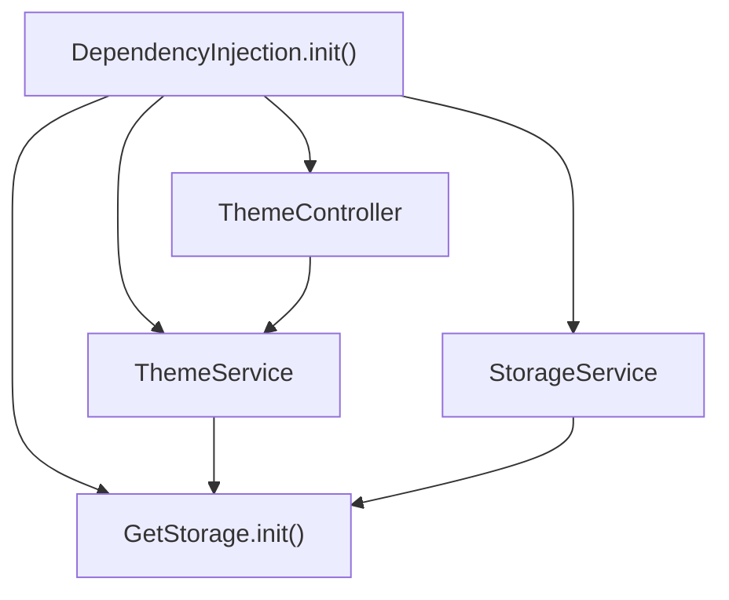
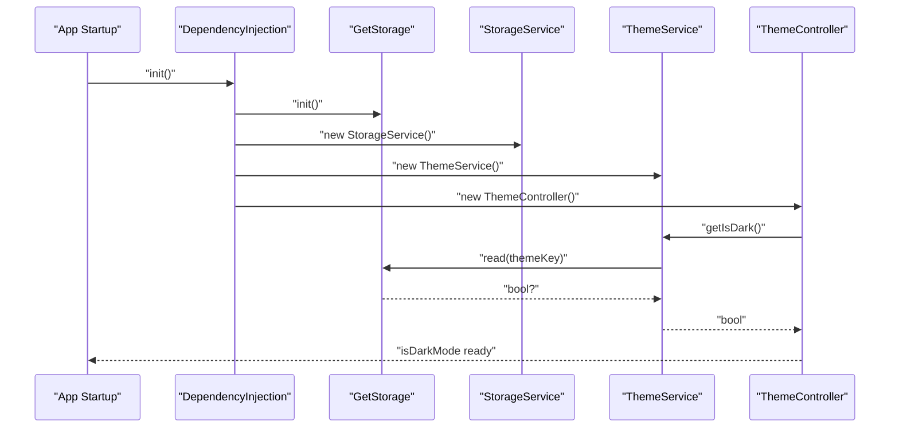
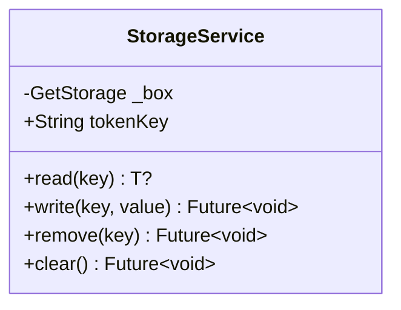
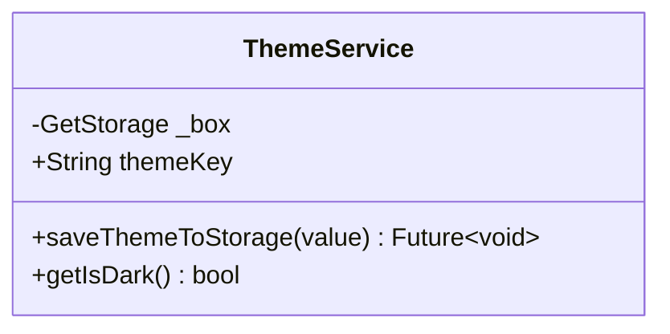
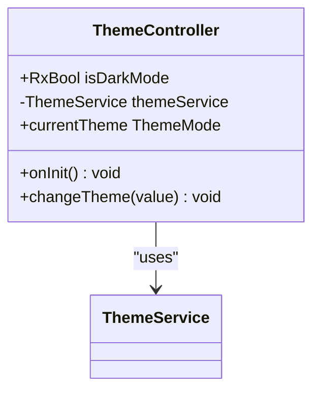
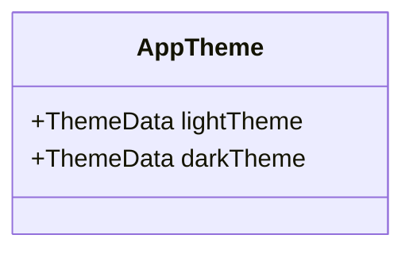
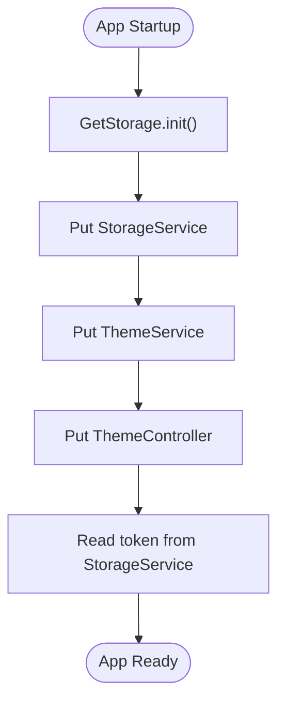
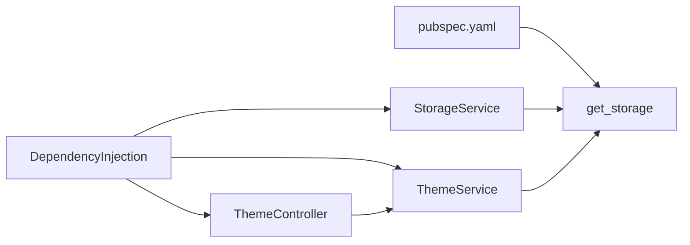

# Local Storage

<cite>
**Referenced Files in This Document**
- [storage_service.dart](file://lib/core/data/local/storage_service.dart)
- [theme_service.dart](file://lib/core/data/local/theme_service.dart)
- [dependency_injection.dart](file://lib/core/di/dependency_injection.dart)
- [app_theme.dart](file://lib/core/theme/app_theme.dart)
- [theme_controller.dart](file://lib/core/theme/theme_controller.dart)
- [pubspec.yaml](file://pubspec.yaml)
</cite>

## Table of Contents
1. [Introduction](#introduction)
2. [Project Structure](#project-structure)
3. [Core Components](#core-components)
4. [Architecture Overview](#architecture-overview)
5. [Detailed Component Analysis](#detailed-component-analysis)
6. [Dependency Analysis](#dependency-analysis)
7. [Performance Considerations](#performance-considerations)
8. [Security Considerations](#security-considerations)
9. [Troubleshooting Guide](#troubleshooting-guide)
10. [Conclusion](#conclusion)

## Introduction
This document provides comprehensive local storage documentation for ZB-DEZINE’s data persistence layer. It focuses on:
- StorageService for token management, user preferences, and application state persistence
- ThemeService for theme preference handling and dark/light mode persistence
- Integration with the get_storage package for key-value pair management and data serialization
- Practical patterns for secure token storage, preference retrieval, and data migration
- Lifecycle management, cleanup procedures, and data integrity validation
- Security considerations, encryption strategies, and backup/restore mechanisms
- Relationship between local storage and application state management, offline-first data handling, and cache invalidation strategies

## Project Structure
The local storage implementation centers around two primary services:
- StorageService: a generic key-value wrapper backed by get_storage
- ThemeService: a specialized service for theme preferences
These services are initialized and wired via dependency injection and consumed by ThemeController for reactive theme switching.

**Diagram sources**
- [dependency_injection.dart:11-26](file://lib/core/di/dependency_injection.dart#L11-L26)
- [storage_service.dart:3-22](file://lib/core/data/local/storage_service.dart#L3-L22)
- [theme_service.dart:3-15](file://lib/core/data/local/theme_service.dart#L3-L15)

**Section sources**
- [pubspec.yaml:46](file://pubspec.yaml#L46)
- [dependency_injection.dart:11-26](file://lib/core/di/dependency_injection.dart#L11-L26)

## Core Components
- StorageService
  - Provides generic read/write/remove/clear operations backed by get_storage
  - Exposes a tokenKey constant for secure token persistence
  - Supports typed reads via generics
- ThemeService
  - Persists theme preference (dark/light) using a dedicated themeKey
  - Reads persisted theme with a safe fallback to a default value
- ThemeController
  - Reactive controller that initializes theme state from storage
  - Updates storage when theme changes
  - Exposes currentTheme for UI consumption

**Section sources**
- [storage_service.dart:3-22](file://lib/core/data/local/storage_service.dart#L3-L22)
- [theme_service.dart:3-15](file://lib/core/data/local/theme_service.dart#L3-L15)
- [theme_controller.dart:5-22](file://lib/core/theme/theme_controller.dart#L5-L22)

## Architecture Overview
The local storage architecture integrates dependency injection, reactive controllers, and persistent key-value storage. Initialization ensures storage availability before application logic proceeds, and theme preferences are synchronized reactively.

**Diagram sources**
- [dependency_injection.dart:12-25](file://lib/core/di/dependency_injection.dart#L12-L25)
- [theme_controller.dart:9-13](file://lib/core/theme/theme_controller.dart#L9-L13)
- [theme_service.dart:11-14](file://lib/core/data/local/theme_service.dart#L11-L14)

## Detailed Component Analysis

### StorageService
StorageService encapsulates a GetStorage-backed key-value store with:
- Generic read<T> for typed retrieval
- Asynchronous write for persistence
- Removal and bulk erase capabilities
- A tokenKey constant for secure token storage

**Diagram sources**
- [storage_service.dart:3-22](file://lib/core/data/local/storage_service.dart#L3-L22)

**Section sources**
- [storage_service.dart:3-22](file://lib/core/data/local/storage_service.dart#L3-L22)

### ThemeService
ThemeService persists and retrieves theme preferences:
- Uses themeKey to store a boolean indicating dark mode
- Provides saveThemeToStorage and getIsDark with a sensible default

**Diagram sources**
- [theme_service.dart:3-15](file://lib/core/data/local/theme_service.dart#L3-L15)

**Section sources**
- [theme_service.dart:3-15](file://lib/core/data/local/theme_service.dart#L3-L15)

### ThemeController
ThemeController manages reactive theme state:
- Initializes from ThemeService
- Exposes isDarkMode as an observable
- Converts to ThemeMode for UI consumption
- Writes changes back to ThemeService

**Diagram sources**
- [theme_controller.dart:5-22](file://lib/core/theme/theme_controller.dart#L5-L22)
- [theme_service.dart:3-15](file://lib/core/data/local/theme_service.dart#L3-L15)

**Section sources**
- [theme_controller.dart:5-22](file://lib/core/theme/theme_controller.dart#L5-L22)

### AppTheme
AppTheme defines light and dark theme configurations for the application UI.

**Diagram sources**
- [app_theme.dart:4-22](file://lib/core/theme/app_theme.dart#L4-L22)

**Section sources**
- [app_theme.dart:4-22](file://lib/core/theme/app_theme.dart#L4-L22)

### Dependency Injection and Initialization
DependencyInjection ensures:
- GetStorage initialization
- Singleton registration of StorageService, ThemeService, ThemeController
- Early retrieval of token from storage during startup

**Diagram sources**
- [dependency_injection.dart:12-25](file://lib/core/di/dependency_injection.dart#L12-L25)

**Section sources**
- [dependency_injection.dart:12-25](file://lib/core/di/dependency_injection.dart#L12-L25)

## Dependency Analysis
- External dependency: get_storage is declared and used for persistent key-value storage
- Internal dependencies:
  - ThemeController depends on ThemeService
  - ThemeService depends on GetStorage
  - StorageService depends on GetStorage
  - DependencyInjection orchestrates initialization and wiring

**Diagram sources**
- [pubspec.yaml:46](file://pubspec.yaml#L46)
- [dependency_injection.dart:12-25](file://lib/core/di/dependency_injection.dart#L12-L25)

**Section sources**
- [pubspec.yaml:46](file://pubspec.yaml#L46)
- [dependency_injection.dart:12-25](file://lib/core/di/dependency_injection.dart#L12-L25)

## Performance Considerations
- Asynchronous writes: StorageService write and ThemeService saveThemeToStorage are asynchronous; batch related writes when possible to reduce IO overhead.
- Typed reads: Using generic read<T> avoids unnecessary conversions and improves type safety.
- Reactive updates: ThemeController minimizes redundant writes by updating storage only on user-driven changes.
- Initialization cost: GetStorage.init is performed once at startup; avoid repeated initialization.

[No sources needed since this section provides general guidance]

## Security Considerations
- Sensitive token storage: The tokenKey constant identifies the secure token location. Treat this key as sensitive and avoid logging or exposing it.
- Encryption strategy: Consider platform-specific secure storage alternatives (e.g., Android Keystore, iOS Keychain) for highly sensitive tokens. The current implementation uses get_storage, which stores data in the device’s native storage without built-in encryption.
- Data integrity validation: Implement checksums or signatures for critical preferences to detect tampering.
- Backup/restore: Encourage users to back up device storage where applicable. For sensitive data, prefer server-side backups with encryption and secure transfer protocols.
- Access control: Restrict access to storage keys and avoid storing tokens in logs or crash reports.

[No sources needed since this section provides general guidance]

## Troubleshooting Guide
- Storage not initialized: Ensure GetStorage.init is called before any read/write operations. DependencyInjection performs this during startup.
- Token retrieval issues: Verify the tokenKey exists and is readable. If absent, handle gracefully by falling back to empty string during initialization.
- Theme not persisting: Confirm themeKey is present and ThemeController.changeTheme is invoked after UI interactions.
- Migration handling: When introducing new keys, provide safe defaults in read operations and migrate existing data during app upgrades.
- Cleanup procedures: Use remove for individual keys and clear for complete reset scenarios. Validate cleanup by reinitializing and verifying empty state.

**Section sources**
- [dependency_injection.dart:12-25](file://lib/core/di/dependency_injection.dart#L12-L25)
- [storage_service.dart:7-21](file://lib/core/data/local/storage_service.dart#L7-L21)
- [theme_service.dart:7-14](file://lib/core/data/local/theme_service.dart#L7-L14)

## Conclusion
ZB-DEZINE’s local storage layer leverages get_storage for efficient key-value persistence, with StorageService and ThemeService providing focused APIs for tokens and theme preferences. DependencyInjection centralizes initialization and wiring, while ThemeController enables reactive theme management. For production-grade applications, consider enhancing security with platform-specific secure storage, implementing robust data integrity checks, and establishing clear migration and backup strategies.