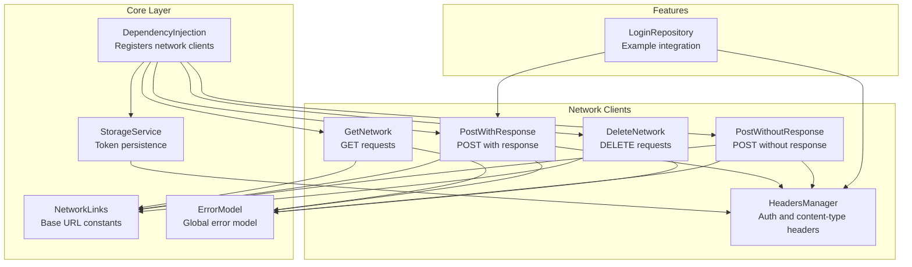
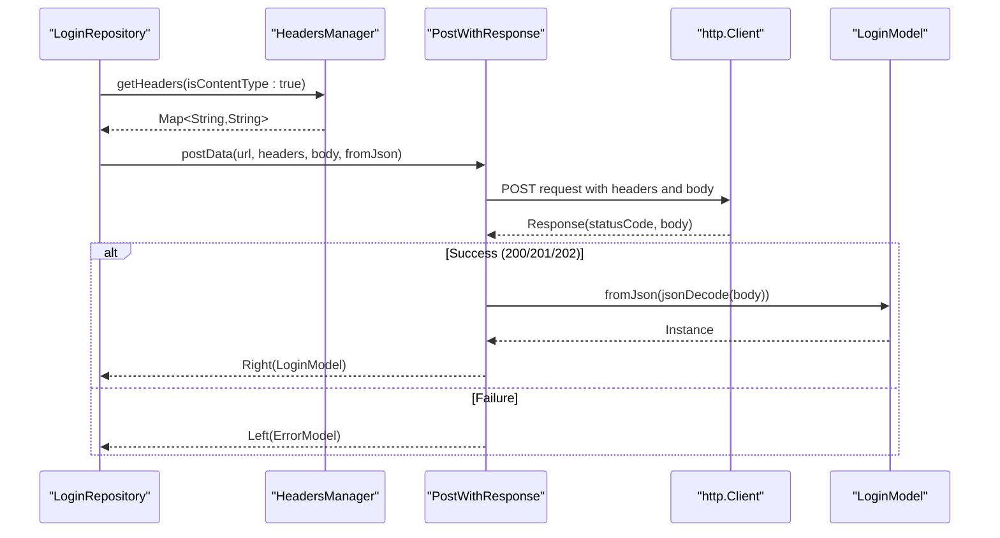
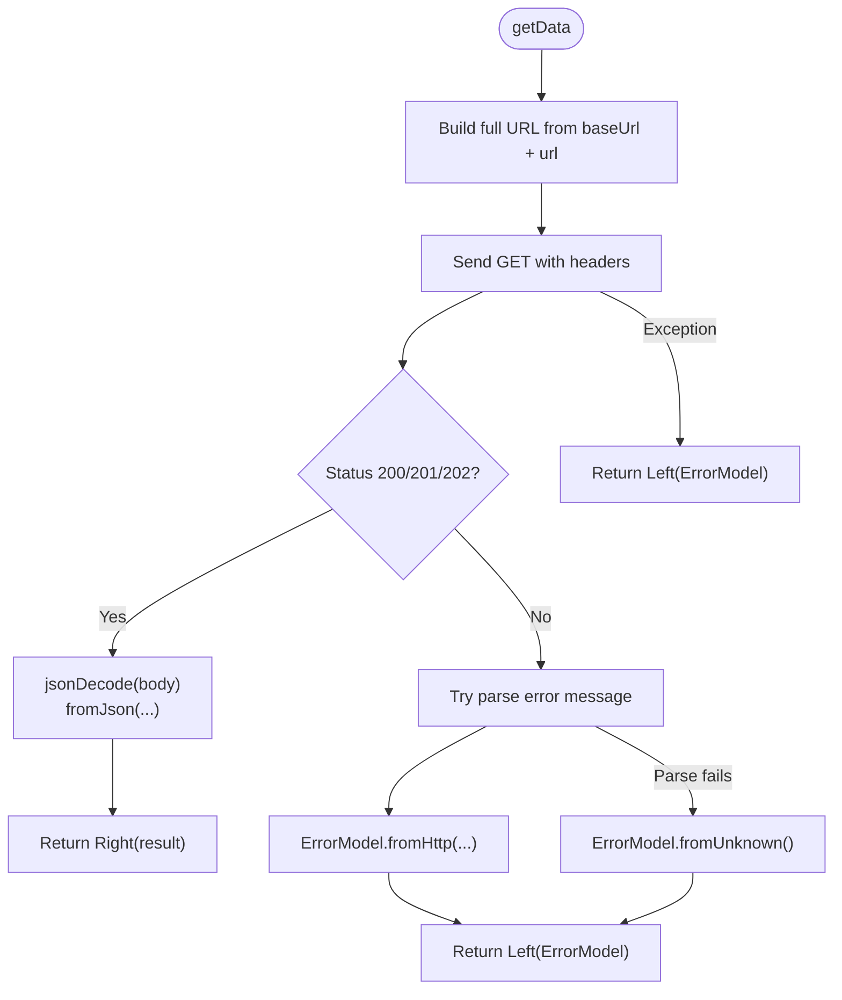
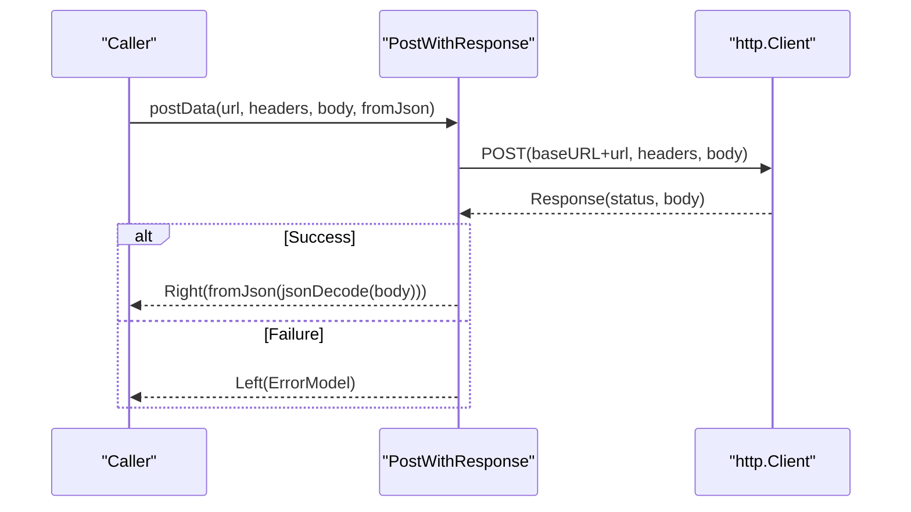
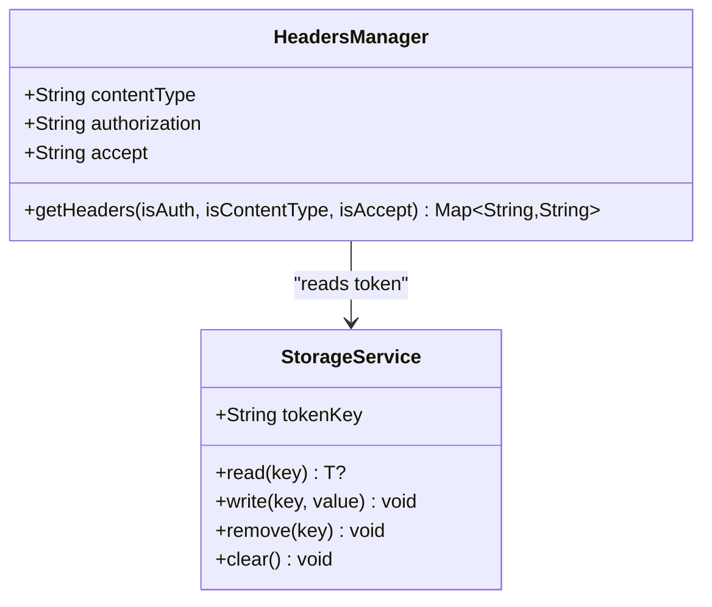
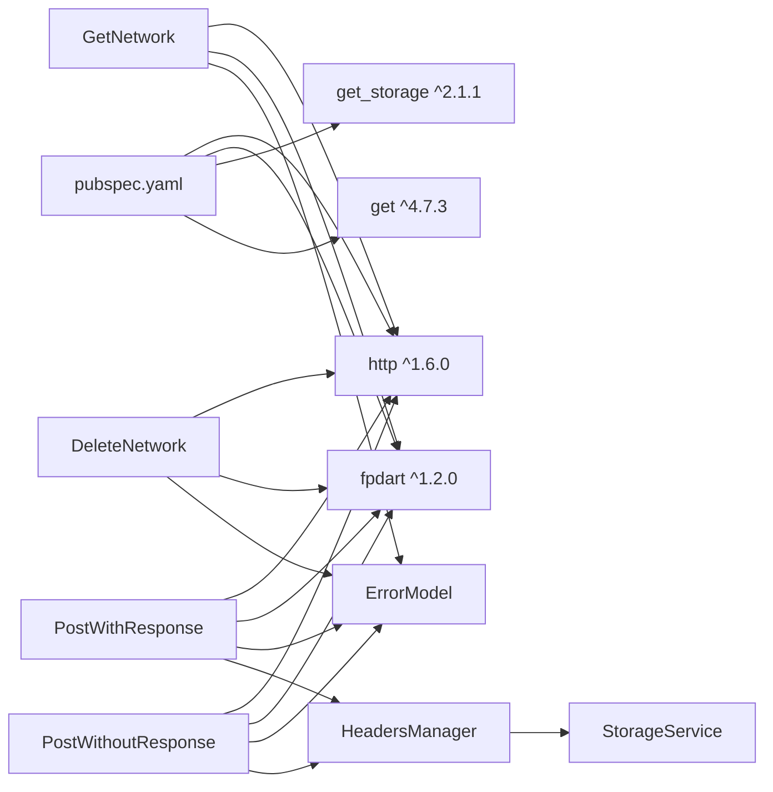

# Network Services

<cite>
**Referenced Files in This Document**
- [get_network.dart](file://lib/core/data/networks/get_network.dart)
- [post_with_response.dart](file://lib/core/data/networks/post_with_response.dart)
- [delete_network.dart](file://lib/core/data/networks/delete_network.dart)
- [post_without_response.dart](file://lib/core/data/networks/post_without_response.dart)
- [networks_path.dart](file://lib/core/constant/networks_path.dart)
- [headers_manager.dart](file://lib/core/data/networks/headers_manager.dart)
- [error_model.dart](file://lib/core/data/global_models/error_model.dart)
- [storage_service.dart](file://lib/core/data/local/storage_service.dart)
- [dependency_injection.dart](file://lib/core/di/dependency_injection.dart)
- [login_repo.dart](file://lib/features/auth/repositories/login_repo.dart)
- [pubspec.yaml](file://pubspec.yaml)
</cite>

## Table of Contents
1. [Introduction](#introduction)
2. [Project Structure](#project-structure)
3. [Core Components](#core-components)
4. [Architecture Overview](#architecture-overview)
5. [Detailed Component Analysis](#detailed-component-analysis)
6. [Dependency Analysis](#dependency-analysis)
7. [Performance Considerations](#performance-considerations)
8. [Troubleshooting Guide](#troubleshooting-guide)
9. [Security Considerations](#security-considerations)
10. [Conclusion](#conclusion)

## Introduction
This document provides comprehensive network services documentation for ZB-DEZINE's HTTP client implementation. It focuses on the GetNetwork class and its generic getData method for GET requests, the PostWithResponse implementation for POST requests with payload handling and status code management, the DeleteNetwork class for DELETE operations, and the centralized API endpoint constants via networks_path.dart. It also covers integration patterns, request/response handling, error management strategies using the Either type, JSON parsing patterns, authentication header implementation, and security considerations including SSL and connectivity monitoring.

## Project Structure
The network services are organized under lib/core/data/networks and lib/core/constant. The dependency injection layer registers network clients globally, and repositories orchestrate network calls with typed models and error handling.

**Diagram sources**
- [dependency_injection.dart:11-25](file://lib/core/di/dependency_injection.dart#L11-L25)
- [networks_path.dart:1-3](file://lib/core/constant/networks_path.dart#L1-L3)
- [get_network.dart:8-40](file://lib/core/data/networks/get_network.dart#L8-L40)
- [post_with_response.dart:7-44](file://lib/core/data/networks/post_with_response.dart#L7-L44)
- [post_without_response.dart:9-46](file://lib/core/data/networks/post_without_response.dart#L9-L46)
- [delete_network.dart:8-40](file://lib/core/data/networks/delete_network.dart#L8-L40)
- [headers_manager.dart:4-22](file://lib/core/data/networks/headers_manager.dart#L4-L22)
- [error_model.dart:1-15](file://lib/core/data/global_models/error_model.dart#L1-L15)
- [storage_service.dart:3-22](file://lib/core/data/local/storage_service.dart#L3-L22)
- [login_repo.dart:9-28](file://lib/features/auth/repositories/login_repo.dart#L9-L28)

**Section sources**
- [dependency_injection.dart:11-25](file://lib/core/di/dependency_injection.dart#L11-L25)
- [networks_path.dart:1-3](file://lib/core/constant/networks_path.dart#L1-L3)

## Core Components
- GetNetwork: Generic GET client returning Either<ErrorModel, T>. Handles 200/201/202 success codes and parses JSON via a provided fromJson function.
- PostWithResponse: Generic POST client returning Either<ErrorModel, T>. Sends JSON payload and parses response using fromJson.
- PostWithoutResponse: POST client that returns Either<ErrorModel, bool> for success/failure without parsing response body.
- DeleteNetwork: DELETE client returning Either<ErrorModel, bool>.
- NetworkLinks: Centralized base URL constant.
- HeadersManager: Builds headers with Content-Type, Accept, and Authorization (Bearer token).
- ErrorModel: Standardized error representation with HTTP-derived and unknown-error constructors.
- StorageService: Provides token persistence and retrieval for Authorization headers.
- DependencyInjection: Registers all network clients and services as singletons.

**Section sources**
- [get_network.dart:8-40](file://lib/core/data/networks/get_network.dart#L8-L40)
- [post_with_response.dart:7-44](file://lib/core/data/networks/post_with_response.dart#L7-L44)
- [post_without_response.dart:9-46](file://lib/core/data/networks/post_without_response.dart#L9-L46)
- [delete_network.dart:8-40](file://lib/core/data/networks/delete_network.dart#L8-L40)
- [networks_path.dart:1-3](file://lib/core/constant/networks_path.dart#L1-L3)
- [headers_manager.dart:4-22](file://lib/core/data/networks/headers_manager.dart#L4-L22)
- [error_model.dart:1-15](file://lib/core/data/global_models/error_model.dart#L1-L15)
- [storage_service.dart:3-22](file://lib/core/data/local/storage_service.dart#L3-L22)
- [dependency_injection.dart:11-25](file://lib/core/di/dependency_injection.dart#L11-L25)

## Architecture Overview
The network architecture follows a layered pattern:
- Constants define the base URL centrally.
- Network clients encapsulate HTTP operations and return typed results via Either.
- HeadersManager constructs request headers, including Authorization tokens.
- Repositories orchestrate network calls, passing typed models and fromJson parsers.
- DependencyInjection wires all components at startup.

**Diagram sources**
- [login_repo.dart:14-27](file://lib/features/auth/repositories/login_repo.dart#L14-L27)
- [headers_manager.dart:9-21](file://lib/core/data/networks/headers_manager.dart#L9-L21)
- [post_with_response.dart:9-43](file://lib/core/data/networks/post_with_response.dart#L9-L43)

## Detailed Component Analysis

### GetNetwork
- Purpose: Generic GET client with typed response parsing.
- Key behaviors:
  - Uses NetworkLinks.baseUrl + provided url.
  - Accepts custom headers.
  - Treats 200/201/202 as success; otherwise attempts to parse error message from response body.
  - Returns Either<ErrorModel, T> using fpdart.
- Error handling:
  - Parses HTTP error bodies with a message field.
  - Falls back to ErrorModel.fromUnknown on parsing failures.
- JSON parsing:
  - Uses jsonDecode(response.body) and delegates deserialization to fromJson.

**Diagram sources**
- [get_network.dart:10-39](file://lib/core/data/networks/get_network.dart#L10-L39)

**Section sources**
- [get_network.dart:8-40](file://lib/core/data/networks/get_network.dart#L8-L40)

### PostWithResponse
- Purpose: Generic POST client that returns typed results.
- Key behaviors:
  - Sends JSON payload via http.post with provided headers.
  - Success conditions mirror GET: 200/201/202.
  - Parses response body using fromJson.
- Error handling:
  - Attempts to extract message from response body; otherwise falls back to unknown error.

**Diagram sources**
- [post_with_response.dart:9-43](file://lib/core/data/networks/post_with_response.dart#L9-L43)

**Section sources**
- [post_with_response.dart:7-44](file://lib/core/data/networks/post_with_response.dart#L7-L44)

### PostWithoutResponse
- Purpose: POST client that does not parse response body; returns success/failure as boolean.
- Key behaviors:
  - Sends request with optional headers.
  - Treats 200/201/202 as success; otherwise returns Left(ErrorModel).

**Section sources**
- [post_without_response.dart:9-46](file://lib/core/data/networks/post_without_response.dart#L9-L46)

### DeleteNetwork
- Purpose: DELETE client returning Either<ErrorModel, bool>.
- Key behaviors:
  - Sends DELETE request with optional headers.
  - Success on 200/201/202; otherwise constructs ErrorModel from HTTP response.

**Section sources**
- [delete_network.dart:8-40](file://lib/core/data/networks/delete_network.dart#L8-L40)

### NetworkLinks (API Endpoint Management)
- Purpose: Centralized base URL for all endpoints.
- Usage: Concatenated with route-specific paths in network clients.

**Section sources**
- [networks_path.dart:1-3](file://lib/core/constant/networks_path.dart#L1-L3)

### HeadersManager (Authentication and Content-Type)
- Purpose: Builds standardized headers for requests.
- Features:
  - Content-Type: application/json (optional).
  - Accept: application/json (optional).
  - Authorization: Bearer token retrieved from StorageService via Get.find<StorageService>().

**Diagram sources**
- [headers_manager.dart:4-22](file://lib/core/data/networks/headers_manager.dart#L4-L22)
- [storage_service.dart:3-22](file://lib/core/data/local/storage_service.dart#L3-L22)

**Section sources**
- [headers_manager.dart:4-22](file://lib/core/data/networks/headers_manager.dart#L4-L22)
- [storage_service.dart:3-22](file://lib/core/data/local/storage_service.dart#L3-L22)

### ErrorModel (Functional Error Handling)
- Purpose: Unified error representation for network failures.
- Constructors:
  - fromHttp(statusCode, bodyMessage): Creates error from HTTP response.
  - fromUnknown(): Creates generic "Unknown Error".

**Section sources**
- [error_model.dart:1-15](file://lib/core/data/global_models/error_model.dart#L1-L15)

### DependencyInjection (Integration)
- Purpose: Initializes GetStorage and registers network clients and services as singletons.
- Behavior: Ensures StorageService and network clients are available application-wide.

**Section sources**
- [dependency_injection.dart:11-25](file://lib/core/di/dependency_injection.dart#L11-L25)

## Dependency Analysis
- External dependencies:
  - http: ^1.6.0 for HTTP operations.
  - fpdart: ^1.2.0 for Either monad-based error handling.
  - get_storage: ^2.1.1 for token persistence.
  - get: ^4.7.3 for dependency injection and reactive state.
- Internal dependencies:
  - Network clients depend on NetworkLinks and ErrorModel.
  - HeadersManager depends on StorageService.
  - Repositories depend on PostWithResponse and HeadersManager.

**Diagram sources**
- [pubspec.yaml:44-46](file://pubspec.yaml#L44-L46)
- [get_network.dart:3-6](file://lib/core/data/networks/get_network.dart#L3-L6)
- [post_with_response.dart:2-5](file://lib/core/data/networks/post_with_response.dart#L2-L5)
- [post_without_response.dart:4-7](file://lib/core/data/networks/post_without_response.dart#L4-L7)
- [delete_network.dart:3-6](file://lib/core/data/networks/delete_network.dart#L3-L6)
- [headers_manager.dart:1-2](file://lib/core/data/networks/headers_manager.dart#L1-L2)
- [storage_service.dart:1](file://lib/core/data/local/storage_service.dart#L1)

**Section sources**
- [pubspec.yaml:30-60](file://pubspec.yaml#L30-L60)

## Performance Considerations
- Timeout configuration: The http package default timeouts are used. For production, configure explicit connect/read/write timeouts per request to prevent UI blocking and improve reliability.
- Reuse client instances: Network clients are singletons via DependencyInjection, minimizing overhead.
- Payload size: Prefer compact JSON payloads and compress large data when supported by the server.
- Caching: Consider caching GET responses for frequently accessed resources to reduce network load.
- Retry/backoff: Implement retry policies for transient failures (e.g., 5xx, network timeouts) with exponential backoff.

## Troubleshooting Guide
Common issues and resolutions:
- Authentication failures:
  - Verify token exists in StorageService and is readable via HeadersManager.
  - Ensure Authorization header is included in requests.
- JSON parsing errors:
  - Confirm response body contains a message field for error responses.
  - Use ErrorModel.fromUnknown as fallback when parsing fails.
- Network exceptions:
  - Wrap network calls in try/catch and return Left(ErrorModel) consistently.
- Status code mismatches:
  - Only 200/201/202 are treated as success; handle other codes explicitly in UI.

**Section sources**
- [headers_manager.dart:9-21](file://lib/core/data/networks/headers_manager.dart#L9-L21)
- [error_model.dart:5-13](file://lib/core/data/global_models/error_model.dart#L5-L13)
- [get_network.dart:36-38](file://lib/core/data/networks/get_network.dart#L36-L38)
- [post_with_response.dart:40-42](file://lib/core/data/networks/post_with_response.dart#L40-L42)
- [post_without_response.dart:42-44](file://lib/core/data/networks/post_without_response.dart#L42-L44)
- [delete_network.dart:37](file://lib/core/data/networks/delete_network.dart#L37)

## Security Considerations
- SSL/TLS:
  - Use HTTPS endpoints (as configured by NetworkLinks). Ensure certificates are validated; avoid disabling SSL checks.
- Token handling:
  - Store tokens securely via StorageService and retrieve via HeadersManager.
  - Avoid logging sensitive tokens; sanitize logs.
- Request sanitization:
  - Validate and sanitize payloads before sending.
- Certificate pinning:
  - Consider implementing certificate pinning for enhanced protection against man-in-the-middle attacks.
- Connectivity monitoring:
  - Implement offline detection and prompt users when network is unavailable.
  - Show meaningful error messages for network failures.

## Conclusion
ZB-DEZINE’s network layer provides a clean, functional approach to HTTP operations using Either for error handling, centralized endpoint constants, and reusable headers. The integration with DependencyInjection ensures consistent availability across the app. By adding explicit timeouts, robust retry logic, and enhanced security measures, the network layer can be further hardened for production environments.