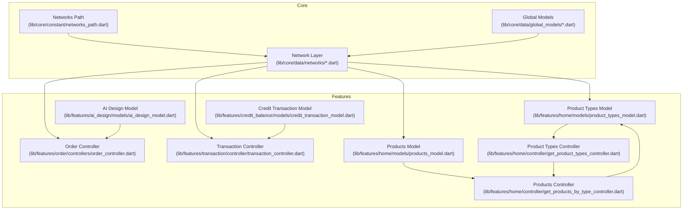
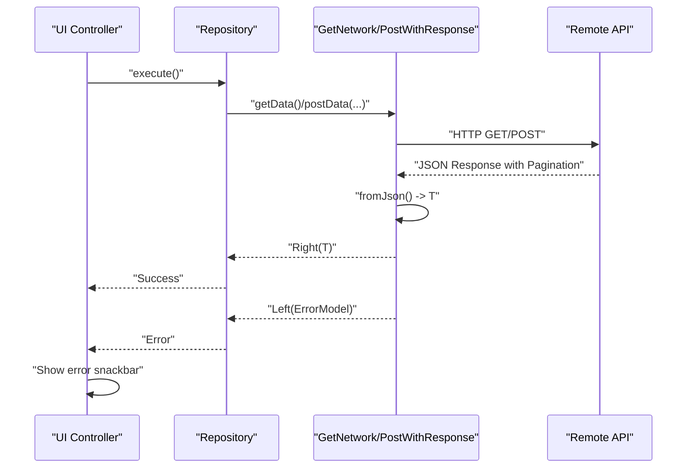
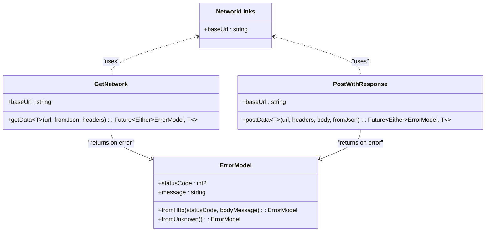
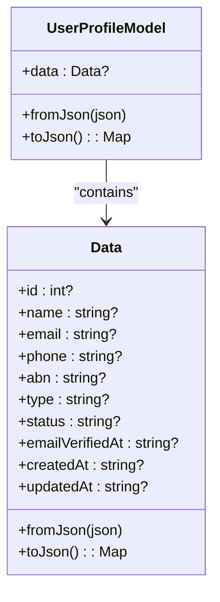
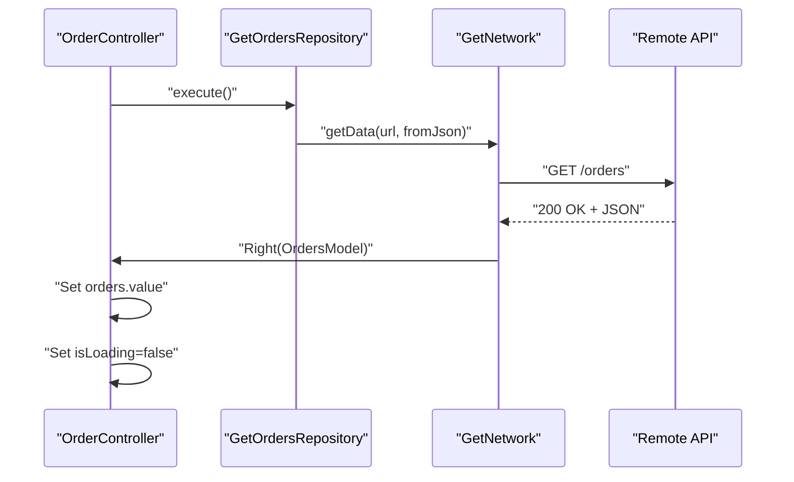
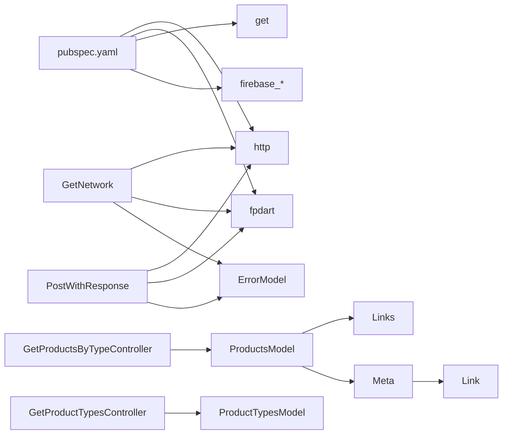

# Data Models and Schemas

<cite>
**Referenced Files in This Document**
- [README.md](file://README.md)
- [pubspec.yaml](file://pubspec.yaml)
- [networks_path.dart](file://lib/core/constant/networks_path.dart)
- [user_profile_model.dart](file://lib/core/data/global_models/user_profile_model.dart)
- [google_user_info_model.dart](file://lib/core/data/global_models/google_user_info_model.dart)
- [error_model.dart](file://lib/core/data/global_models/error_model.dart)
- [get_network.dart](file://lib/core/data/networks/get_network.dart)
- [post_with_response.dart](file://lib/core/data/networks/post_with_response.dart)
- [ai_design_model.dart](file://lib/features/ai_design/models/ai_design_model.dart)
- [credit_transaction_model.dart](file://lib/features/credit_balance/models/credit_transaction_model.dart)
- [order_controller.dart](file://lib/features/order/controllers/order_controller.dart)
- [transaction_controller.dart](file://lib/features/transaction/controller/transaction_controller.dart)
- [products_model.dart](file://lib/features/home/models/products_model.dart)
- [product_types_model.dart](file://lib/features/home/models/product_types_model.dart)
- [rooms_model.dart](file://lib/features/home/models/rooms_model.dart)
- [get_products_by_type_repo.dart](file://lib/features/home/repositories/get_products_by_type_repo.dart)
- [get_product_type_repo.dart](file://lib/features/home/repositories/get_product_type_repo.dart)
- [get_products_by_type_controller.dart](file://lib/features/home/controller/get_products_by_type_controller.dart)
- [get_product_types_controller.dart](file://lib/features/home/controller/get_product_types_controller.dart)
- [response.json](file://response.json)
</cite>

## Update Summary
**Changes Made**
- Updated Product Model section to reflect major restructuring from integer-based to num-based types
- Added comprehensive documentation for pagination support with Links and Meta classes
- Enhanced Product data documentation with dimension fields and measurement units
- Updated response schema documentation to reflect comprehensive data structure changes
- Added new section covering pagination patterns and API integration for product catalogs
- Updated controller documentation to include pagination-aware implementations

## Table of Contents
1. [Introduction](#introduction)
2. [Project Structure](#project-structure)
3. [Core Components](#core-components)
4. [Architecture Overview](#architecture-overview)
5. [Detailed Component Analysis](#detailed-component-analysis)
6. [Product Catalog Data Models](#product-catalog-data-models)
7. [Pagination Support](#pagination-support)
8. [Dependency Analysis](#dependency-analysis)
9. [Performance Considerations](#performance-considerations)
10. [Troubleshooting Guide](#troubleshooting-guide)
11. [Conclusion](#conclusion)
12. [Appendices](#appendices)

## Introduction
This document describes the data models and schemas used by the ZB-DEZINE application. It focuses on the core data structures for user profiles, AI design configurations, credit transactions, transaction records, and the comprehensive product catalog system with enhanced pagination support. The documentation covers the major restructuring from integer-based to num-based types, addition of dimension fields, and comprehensive pagination capabilities with Links and Meta classes.

## Project Structure
The project follows a layered architecture with enhanced product catalog support:
- Core layer: constants, global models, network utilities, and DI
- Features layer: feature-specific models, controllers, repositories, and views
- Shared layer: reusable UI widgets and utilities

**Diagram sources**
- [networks_path.dart:1-3](file://lib/core/constant/networks_path.dart#L1-L3)
- [user_profile_model.dart:1-72](file://lib/core/data/global_models/user_profile_model.dart#L1-L72)
- [google_user_info_model.dart:1-21](file://lib/core/data/global_models/google_user_info_model.dart#L1-L21)
- [error_model.dart:1-15](file://lib/core/data/global_models/error_model.dart#L1-L15)
- [get_network.dart:1-39](file://lib/core/data/networks/get_network.dart#L1-L39)
- [post_with_response.dart:1-45](file://lib/core/data/networks/post_with_response.dart#L1-L45)
- [order_controller.dart:1-41](file://lib/features/order/controllers/order_controller.dart#L1-L41)
- [transaction_controller.dart:1-66](file://lib/features/transaction/controller/transaction_controller.dart#L1-L66)
- [ai_design_model.dart:1-12](file://lib/features/ai_design/models/ai_design_model.dart#L1-L12)
- [credit_transaction_model.dart:1-12](file://lib/features/credit_balance/models/credit_transaction_model.dart#L1-L12)
- [products_model.dart:1-363](file://lib/features/home/models/products_model.dart#L1-L363)
- [product_types_model.dart:1-37](file://lib/features/home/models/product_types_model.dart#L1-L37)
- [get_products_by_type_controller.dart:1-27](file://lib/features/home/controller/get_products_by_type_controller.dart#L1-L27)
- [get_product_types_controller.dart:1-38](file://lib/features/home/controller/get_product_types_controller.dart#L1-L38)

**Section sources**
- [README.md:1-17](file://README.md#L1-L17)
- [pubspec.yaml:1-118](file://pubspec.yaml#L1-L118)

## Core Components
This section documents the primary data models and their roles in the system.

- User Profile Model
  - Purpose: Encapsulates user identity and metadata returned from backend APIs.
  - Fields:
    - id: integer identifier
    - name: string
    - email: string
    - phone: string
    - abn: string
    - type: string
    - status: string
    - emailVerifiedAt: string (ISO-like timestamp)
    - createdAt: string (ISO-like timestamp)
    - updatedAt: string (ISO-like timestamp)
  - Serialization: Implements fromJson and toJson for JSON conversion.
  - Validation: No explicit validation logic in model; validation is handled by dedicated validators in the shared layer.

- Google User Info Model
  - Purpose: Holds federated sign-in payload for Google authentication.
  - Fields:
    - name: string
    - email: string
    - avatarUrl: string
    - idToken: string
    - uid: string
  - Serialization: Immutable fields; intended for transport to authentication services.

- Error Model
  - Purpose: Standardized error representation for HTTP failures and unknown errors.
  - Fields:
    - statusCode: integer or null
    - message: string
  - Factories:
    - fromHttp: constructs from HTTP status and body message
    - fromUnknown: default fallback error

- AI Design Model
  - Purpose: Represents a generated AI design record.
  - Fields:
    - id: string
    - type: string
    - generateDate: string (date/time)

- Credit Transaction Model
  - Purpose: Represents a single credit balance transaction.
  - Fields:
    - title: string
    - date: string
    - amount: double (positive or negative)

- Transaction Controller
  - Purpose: Manages transaction list UI state and pagination.
  - Notable fields:
    - searchController: TextEditingController
    - expandedList: RxList<bool>
    - currentPage: RxInt
    - totalPages: int
    - transTableColumn: List<String>
    - transaction: List<TransactionModel> (hardcoded demo data)

- Order Controller
  - Purpose: Fetches and manages order data via repository pattern.
  - Notable fields:
    - searchController: TextEditingController
    - isSearch: RxBool
    - isShowInfo: RxBool
    - isLoading: RxBool
    - orders: Rxn<OrdersModel>
  - Behavior: Calls repository to fetch data and updates reactive state; displays error snackbar on failure.

**Section sources**
- [user_profile_model.dart:1-72](file://lib/core/data/global_models/user_profile_model.dart#L1-L72)
- [google_user_info_model.dart:1-21](file://lib/core/data/global_models/google_user_info_model.dart#L1-L21)
- [error_model.dart:1-15](file://lib/core/data/global_models/error_model.dart#L1-L15)
- [ai_design_model.dart:1-12](file://lib/features/ai_design/models/ai_design_model.dart#L1-L12)
- [credit_transaction_model.dart:1-12](file://lib/features/credit_balance/models/credit_transaction_model.dart#L1-L12)
- [transaction_controller.dart:1-66](file://lib/features/transaction/controller/transaction_controller.dart#L1-L66)
- [order_controller.dart:1-41](file://lib/features/order/controllers/order_controller.dart#L1-L41)

## Architecture Overview
The data flow relies on a network abstraction that performs HTTP requests and returns typed results using Either semantics (Right for success, Left for error). Controllers orchestrate data fetching and UI state updates with enhanced product catalog support including pagination.

**Diagram sources**
- [get_network.dart:1-39](file://lib/core/data/networks/get_network.dart#L1-L39)
- [post_with_response.dart:1-45](file://lib/core/data/networks/post_with_response.dart#L1-L45)
- [error_model.dart:1-15](file://lib/core/data/global_models/error_model.dart#L1-L15)
- [order_controller.dart:1-41](file://lib/features/order/controllers/order_controller.dart#L1-L41)
- [transaction_controller.dart:1-66](file://lib/features/transaction/controller/transaction_controller.dart#L1-L66)

## Detailed Component Analysis

### Network Layer and Data Serialization
- Base URL: Defined centrally and reused across network calls.
- Request/Response Pattern:
  - GET: Uses GetNetwork.getData<T>, returning Either<ErrorModel, T>.
  - POST: Uses PostWithResponse.postData<T>, returning Either<ErrorModel, T>.
- Serialization:
  - Successful responses are parsed via jsonDecode and mapped to T using a provided fromJson function.
  - Errors are captured with either HTTP body messages or a default Unknown Error.
- Headers Management:
  - Headers are passed into network calls; a dedicated headers manager exists in the core layer.

**Diagram sources**
- [networks_path.dart:1-3](file://lib/core/constant/networks_path.dart#L1-L3)
- [get_network.dart:1-39](file://lib/core/data/networks/get_network.dart#L1-L39)
- [post_with_response.dart:1-45](file://lib/core/data/networks/post_with_response.dart#L1-L45)
- [error_model.dart:1-15](file://lib/core/data/global_models/error_model.dart#L1-L15)

**Section sources**
- [networks_path.dart:1-3](file://lib/core/constant/networks_path.dart#L1-L3)
- [get_network.dart:1-39](file://lib/core/data/networks/get_network.dart#L1-L39)
- [post_with_response.dart:1-45](file://lib/core/data/networks/post_with_response.dart#L1-L45)
- [error_model.dart:1-15](file://lib/core/data/global_models/error_model.dart#L1-L15)

### User Profile Model
- Nested structure: Outer wrapper with a data field containing the user object.
- JSON mapping: fromJson/toJson handle nested data and field aliases (e.g., email_verified_at, created_at, updated_at).
- Usage: Typically returned by authentication or profile endpoints; consumed by controllers to hydrate UI.

**Diagram sources**
- [user_profile_model.dart:1-72](file://lib/core/data/global_models/user_profile_model.dart#L1-L72)

**Section sources**
- [user_profile_model.dart:1-72](file://lib/core/data/global_models/user_profile_model.dart#L1-L72)

### Google User Info Model
- Immutable fields designed for secure transport of federated identity claims.
- Used primarily during Google sign-in flows to pass user identity to backend services.

**Section sources**
- [google_user_info_model.dart:1-21](file://lib/core/data/global_models/google_user_info_model.dart#L1-L21)

### AI Design Model
- Lightweight DTO representing a generated AI design item.
- Typical usage: Populate lists in AI design views and pass to services for further processing.

**Section sources**
- [ai_design_model.dart:1-12](file://lib/features/ai_design/models/ai_design_model.dart#L1-L12)

### Credit Transaction Model
- Represents a single credit movement with title, date, and amount.
- Suitable for rendering in credit history UIs.

**Section sources**
- [credit_transaction_model.dart:1-12](file://lib/features/credit_balance/models/credit_transaction_model.dart#L1-L12)

### Controllers and Data Usage
- OrderController:
  - Fetches OrdersModel via repository.
  - Updates reactive state and shows error snackbar on failure.
- TransactionController:
  - Manages UI state for transaction list, pagination, and expansion.
  - Contains hardcoded demo data for demonstration purposes.

**Diagram sources**
- [order_controller.dart:1-41](file://lib/features/order/controllers/order_controller.dart#L1-L41)
- [get_network.dart:1-39](file://lib/core/data/networks/get_network.dart#L1-L39)

**Section sources**
- [order_controller.dart:1-41](file://lib/features/order/controllers/order_controller.dart#L1-L41)
- [transaction_controller.dart:1-66](file://lib/features/transaction/controller/transaction_controller.dart#L1-L66)

## Product Catalog Data Models

### Products Model with Num-Based Types
The product catalog system has undergone a major restructuring from integer-based to num-based types for enhanced precision in pricing and measurements.

- **ProductsModel Structure**:
  - data: List<Product> - Array of product items
  - links: Links? - Pagination links for navigation
  - meta: Meta? - Pagination metadata

- **Product Entity Enhancements**:
  - id: num (was int) - Unique product identifier
  - categoryId: num (was int) - Category association
  - price: num (was int/num) - Original product price
  - sellingPrice: num (was int/num) - Current selling price
  - discountAmount: num (was int) - Discount value
  - finalPrice: num (was int/num) - Final calculated price
  - dimensions: dynamic - Enhanced dimensional data

- **Category Entity**:
  - id: num (was int) - Category identifier
  - parentId: dynamic - Parent category reference
  - order: dynamic - Display ordering

- **FurnitureType Entity**:
  - id: num (was int) - Furniture type identifier

- **Room Entity**:
  - id: num (was int) - Room identifier

- **Media Entity**:
  - id: num (was int) - Media identifier
  - productId: num (was int) - Associated product
  - createdAt/updatedAt: DateTime - Timestamps

**Section sources**
- [products_model.dart:1-363](file://lib/features/home/models/products_model.dart#L1-L363)
- [response.json:1-1344](file://response.json#L1-L1344)

### Enhanced Dimension Fields
The product model now includes comprehensive dimension data with multiple measurement units:

- **Weight Measurements**:
  - weight: num - Raw weight value
  - weight_kg: num - Weight in kilograms

- **Dimension Measurements**:
  - length_cm: num - Length in centimeters
  - width_cm: num - Width in centimeters
  - height_cm: num - Height in centimeters

**Section sources**
- [products_model.dart:45:45](file://lib/features/home/models/products_model.dart#L45-L45)
- [response.json:19:25](file://response.json#L19-L25)

### Product Types Model
- **ProductTypesModel**:
  - data: List<ProductType> - Array of furniture types
  - Each ProductType contains id: num and name: string

**Section sources**
- [product_types_model.dart:1-37](file://lib/features/home/models/product_types_model.dart#L1-L37)

### Rooms Model
- **RoomsModel**:
  - data: List<Rooms>? - Optional array of room entities
  - Each Rooms entity contains id: num?, name: string?, imageUrl: string?

**Section sources**
- [rooms_model.dart:1-45](file://lib/features/home/models/rooms_model.dart#L1-L45)

## Pagination Support

### Links Class
The Links class provides navigation URLs for paginated responses:

- **Properties**:
  - first: String? - URL for first page
  - last: String? - URL for last page
  - prev: String? - URL for previous page
  - next: String? - URL for next page

**Section sources**
- [products_model.dart:276-297](file://lib/features/home/models/products_model.dart#L276-L297)

### Meta Class
The Meta class contains pagination metadata:

- **Properties**:
  - currentPage: int - Current page number
  - from: int - First item index
  - lastPage: int - Total number of pages
  - links: List<Link>? - Page navigation links
  - path: String - Base API path
  - perPage: int - Items per page
  - to: int - Last item index
  - total: int - Total items count

**Section sources**
- [products_model.dart:299-345](file://lib/features/home/models/products_model.dart#L299-L345)

### Link Class
Individual page navigation elements:

- **Properties**:
  - url: String? - Page URL
  - label: String - Display label
  - active: bool - Whether page is current

**Section sources**
- [products_model.dart:347-362](file://lib/features/home/models/products_model.dart#L347-L362)

### Repository Implementation
The product catalog uses enhanced repository pattern with pagination support:

- **GetProductsByTypeRepository**:
  - Executes GET requests with pagination parameters
  - Returns ProductsModel with Links and Meta
  - Supports furniture type filtering

- **GetProductTypeRepository**:
  - Fetches available furniture types
  - Returns ProductTypesModel

**Section sources**
- [get_products_by_type_repo.dart:1-22](file://lib/features/home/repositories/get_products_by_type_repo.dart#L1-L22)
- [get_product_type_repo.dart:1-20](file://lib/features/home/repositories/get_product_type_repo.dart#L1-L20)

### Controller Implementation
Controllers manage pagination state and data loading:

- **GetProductsByTypeController**:
  - Manages ProductsModel reactive state
  - Handles loading states
  - Processes pagination responses

- **GetProductTypesController**:
  - Manages ProductTypesModel reactive state
  - Auto-selects first product type
  - Triggers product loading

**Section sources**
- [get_products_by_type_controller.dart:1-27](file://lib/features/home/controller/get_products_by_type_controller.dart#L1-L27)
- [get_product_types_controller.dart:1-38](file://lib/features/home/controller/get_product_types_controller.dart#L1-L38)

## Dependency Analysis
- External libraries:
  - http: for HTTP requests
  - fpdart: for Either monad semantics
  - get: for reactive controllers and navigation
  - firebase_*: for authentication and identity
- Internal dependencies:
  - Network layer depends on NetworkLinks for base URL.
  - Controllers depend on repositories and models.
  - Models are decoupled and used across features.
  - Product models depend on enhanced pagination classes.

**Diagram sources**
- [pubspec.yaml:30-66](file://pubspec.yaml#L30-L66)
- [get_network.dart:1-39](file://lib/core/data/networks/get_network.dart#L1-L39)
- [post_with_response.dart:1-45](file://lib/core/data/networks/post_with_response.dart#L1-L45)
- [get_products_by_type_controller.dart:1-27](file://lib/features/home/controller/get_products_by_type_controller.dart#L1-L27)
- [get_product_types_controller.dart:1-38](file://lib/features/home/controller/get_product_types_controller.dart#L1-L38)
- [products_model.dart:276-362](file://lib/features/home/models/products_model.dart#L276-L362)

**Section sources**
- [pubspec.yaml:30-66](file://pubspec.yaml#L30-L66)

## Performance Considerations
- Network efficiency:
  - Centralize base URL to simplify endpoint construction and reduce duplication.
  - Reuse headers across requests to minimize overhead.
- Serialization:
  - Keep fromJson lightweight; avoid unnecessary transformations.
  - Use typed fields to prevent runtime parsing errors.
  - Enhanced num-based types provide better precision for pricing calculations.
- Reactive state:
  - Prefer Rx fields for minimal UI rebuilds; avoid frequent deep copies.
  - Pagination-aware controllers should implement proper loading state management.
- Caching:
  - Consider in-memory caching for frequently accessed lists (e.g., transactions).
  - Persist critical user data locally using get_storage for offline resilience.
  - Implement intelligent caching strategies for product catalogs with pagination.
- Pagination:
  - Use currentPage and totalPages to limit list rendering and improve scroll performance.
  - Implement lazy loading for large product catalogs.
  - Cache pagination metadata to reduce network requests.
- Data Precision:
  - Num-based types ensure accurate financial calculations.
  - Dimension fields with decimal precision support precise measurements.

## Troubleshooting Guide
- Error handling:
  - Network failures return Left(ErrorModel); controllers display user-friendly messages.
  - Use fromHttp to capture server-provided messages; fallback to fromUnknown for unexpected errors.
- Common issues:
  - JSON parsing errors: Ensure fromJson aligns with server response shape.
  - Authentication failures: Verify headers and tokens; check idToken and uid fields in GoogleUserInfoModel.
  - UI state inconsistencies: Confirm reactive updates occur after Either.fold completion.
  - Pagination errors: Verify Links and Meta classes match server response structure.
  - Type conversion errors: Ensure num-based fields handle both integer and decimal values correctly.
- Product catalog issues:
  - Dimension parsing: Verify dimensional data matches expected format.
  - Pagination navigation: Check that Links URLs are properly formatted.
  - Price calculations: Validate num-based pricing maintains accuracy across operations.

**Section sources**
- [error_model.dart:1-15](file://lib/core/data/global_models/error_model.dart#L1-L15)
- [get_network.dart:1-39](file://lib/core/data/networks/get_network.dart#L1-L39)
- [post_with_response.dart:1-45](file://lib/core/data/networks/post_with_response.dart#L1-L45)
- [order_controller.dart:1-41](file://lib/features/order/controllers/order_controller.dart#L1-L41)
- [transaction_controller.dart:1-66](file://lib/features/transaction/controller/transaction_controller.dart#L1-L66)

## Conclusion
The ZB-DEZINE application employs a clean separation of concerns with well-defined data models, a robust network layer using Either semantics, and reactive controllers. The major restructuring to num-based types enhances precision for pricing and measurements, while the addition of comprehensive pagination support with Links and Meta classes provides robust navigation for large product catalogs. The enhanced dimension fields support precise product specifications, and the improved data models are suitable for JSON serialization/deserialization with clear extension points for validation and transformation. The architecture supports scalable growth across features like AI design, orders, transactions, and the comprehensive product catalog system.

## Appendices
- API Integration Patterns:
  - GET: Use GetNetwork.getData with a fromJson function to parse responses.
  - POST: Use PostWithResponse.postData with headers and body; parse response via fromJson.
  - Pagination: ProductsModel automatically includes Links and Meta for seamless navigation.
- Request/Response Schemas:
  - User Profile: Wrapper with nested data object; fields include identifiers, contact info, and timestamps.
  - AI Design: Minimal DTO with id, type, and generation date.
  - Credit Transaction: Title, date, and numeric amount.
  - Product Catalog: Enhanced ProductsModel with num-based types, dimension fields, and pagination support.
- Data Lifecycle:
  - Fetch → Parse → Hydrate UI → Persist if needed → Invalidate cache on refresh.
  - Pagination: Load initial page → Handle navigation → Update reactive state.
- Security:
  - Transport sensitive fields securely; avoid logging raw payloads.
  - Validate inputs using shared validators before sending to APIs.
  - Enhanced type safety reduces risk of data corruption.
- Migration Approaches:
  - Introduce breaking changes behind feature flags; maintain backward-compatible fromJson for graceful degradation.
  - Num-based type migration requires careful testing of financial calculations.
  - Pagination implementation should maintain compatibility with existing UI components.
- Performance Optimization:
  - Implement pagination-aware loading strategies.
  - Use num-based types for precise financial calculations.
  - Leverage Links and Meta classes for efficient navigation.
  - Cache pagination metadata to reduce network overhead.