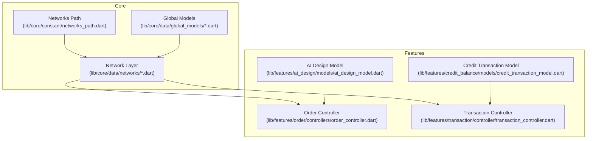
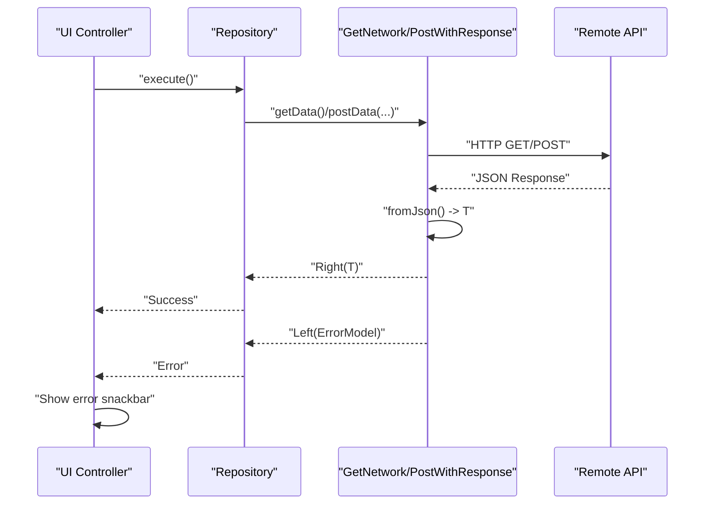
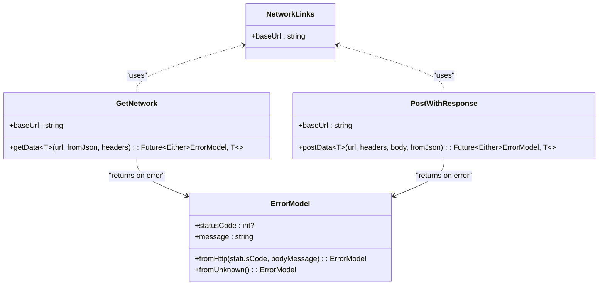
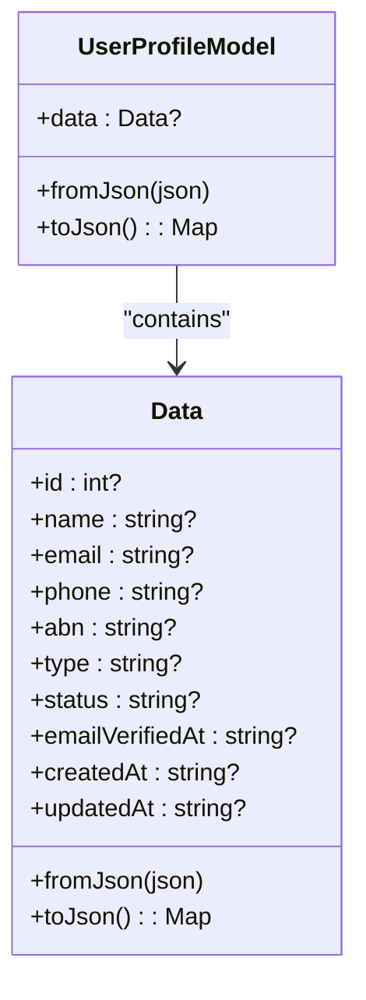
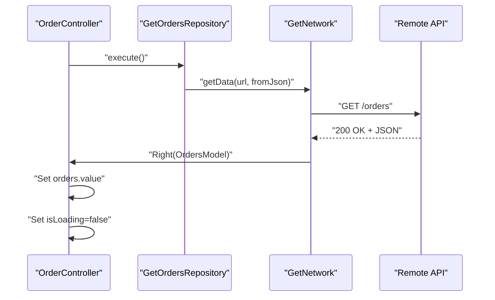
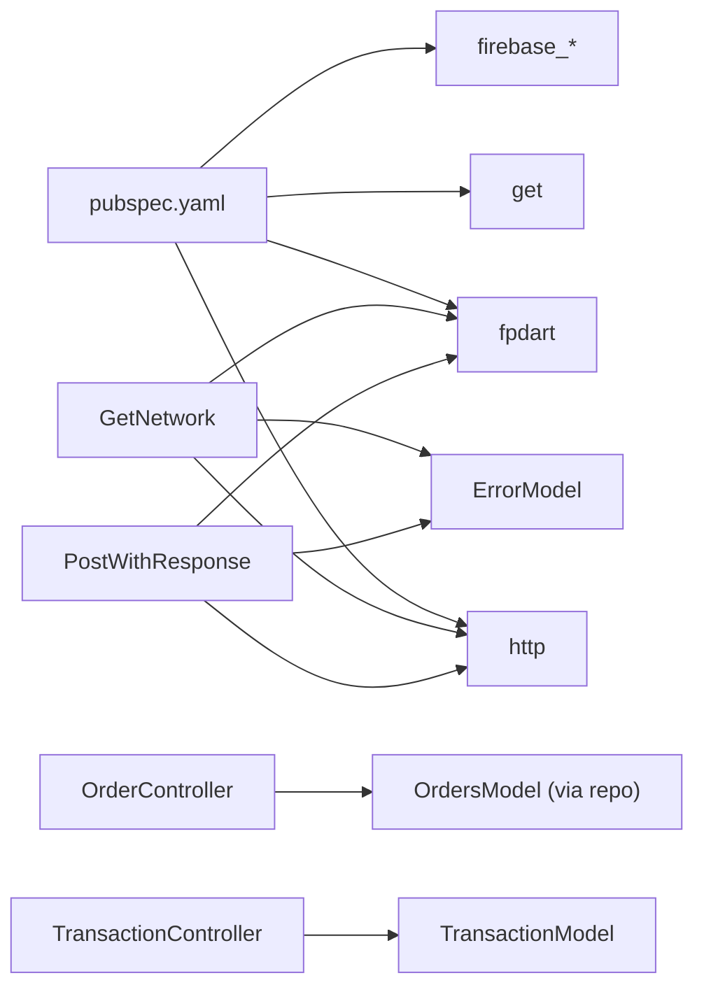

# Data Models and Schemas

<cite>
**Referenced Files in This Document**
- [README.md](file://README.md)
- [pubspec.yaml](file://pubspec.yaml)
- [networks_path.dart](file://lib/core/constant/networks_path.dart)
- [user_profile_model.dart](file://lib/core/data/global_models/user_profile_model.dart)
- [google_user_info_model.dart](file://lib/core/data/global_models/google_user_info_model.dart)
- [error_model.dart](file://lib/core/data/global_models/error_model.dart)
- [get_network.dart](file://lib/core/data/networks/get_network.dart)
- [post_with_response.dart](file://lib/core/data/networks/post_with_response.dart)
- [ai_design_model.dart](file://lib/features/ai_design/models/ai_design_model.dart)
- [credit_transaction_model.dart](file://lib/features/credit_balance/models/credit_transaction_model.dart)
- [order_controller.dart](file://lib/features/order/controllers/order_controller.dart)
- [transaction_controller.dart](file://lib/features/transaction/controller/transaction_controller.dart)
</cite>

## Table of Contents
1. [Introduction](#introduction)
2. [Project Structure](#project-structure)
3. [Core Components](#core-components)
4. [Architecture Overview](#architecture-overview)
5. [Detailed Component Analysis](#detailed-component-analysis)
6. [Dependency Analysis](#dependency-analysis)
7. [Performance Considerations](#performance-considerations)
8. [Troubleshooting Guide](#troubleshooting-guide)
9. [Conclusion](#conclusion)
10. [Appendices](#appendices)

## Introduction
This document describes the data models and schemas used by the ZB-DEZINE application. It focuses on the core data structures for user profiles, AI design configurations, credit transactions, and transaction records, along with the network layer that serializes and deserializes data, handles errors, and integrates with remote APIs. It also outlines API integration patterns, request/response schemas, and practical usage examples in controllers and services.

## Project Structure
The project follows a layered architecture:
- Core layer: constants, global models, network utilities, and DI
- Features layer: feature-specific models, controllers, repositories, and views
- Shared layer: reusable UI widgets and utilities

**Diagram sources**
- [networks_path.dart:1-3](file://lib/core/constant/networks_path.dart#L1-L3)
- [user_profile_model.dart:1-72](file://lib/core/data/global_models/user_profile_model.dart#L1-L72)
- [google_user_info_model.dart:1-21](file://lib/core/data/global_models/google_user_info_model.dart#L1-L21)
- [error_model.dart:1-15](file://lib/core/data/global_models/error_model.dart#L1-L15)
- [get_network.dart:1-39](file://lib/core/data/networks/get_network.dart#L1-L39)
- [post_with_response.dart:1-45](file://lib/core/data/networks/post_with_response.dart#L1-L45)
- [order_controller.dart:1-41](file://lib/features/order/controllers/order_controller.dart#L1-L41)
- [transaction_controller.dart:1-66](file://lib/features/transaction/controller/transaction_controller.dart#L1-L66)
- [ai_design_model.dart:1-12](file://lib/features/ai_design/models/ai_design_model.dart#L1-L12)
- [credit_transaction_model.dart:1-12](file://lib/features/credit_balance/models/credit_transaction_model.dart#L1-L12)

**Section sources**
- [README.md:1-17](file://README.md#L1-L17)
- [pubspec.yaml:1-118](file://pubspec.yaml#L1-L118)

## Core Components
This section documents the primary data models and their roles in the system.

- User Profile Model
  - Purpose: Encapsulates user identity and metadata returned from backend APIs.
  - Fields:
    - id: integer identifier
    - name: string
    - email: string
    - phone: string
    - abn: string
    - type: string
    - status: string
    - emailVerifiedAt: string (ISO-like timestamp)
    - createdAt: string (ISO-like timestamp)
    - updatedAt: string (ISO-like timestamp)
  - Serialization: Implements fromJson and toJson for JSON conversion.
  - Validation: No explicit validation logic in model; validation is handled by dedicated validators in the shared layer.

- Google User Info Model
  - Purpose: Holds federated sign-in payload for Google authentication.
  - Fields:
    - name: string
    - email: string
    - avatarUrl: string
    - idToken: string
    - uid: string
  - Serialization: Immutable fields; intended for transport to authentication services.

- Error Model
  - Purpose: Standardized error representation for HTTP failures and unknown errors.
  - Fields:
    - statusCode: integer or null
    - message: string
  - Factories:
    - fromHttp: constructs from HTTP status and body message
    - fromUnknown: default fallback error

- AI Design Model
  - Purpose: Represents a generated AI design record.
  - Fields:
    - id: string
    - type: string
    - generateDate: string (date/time)

- Credit Transaction Model
  - Purpose: Represents a single credit balance transaction.
  - Fields:
    - title: string
    - date: string
    - amount: double (positive or negative)

- Transaction Controller
  - Purpose: Manages transaction list UI state and pagination.
  - Notable fields:
    - searchController: TextEditingController
    - expandedList: RxList<bool>
    - currentPage: RxInt
    - totalPages: int
    - transTableColumn: List<String>
    - transaction: List<TransactionModel> (hardcoded demo data)

- Order Controller
  - Purpose: Fetches and manages order data via repository pattern.
  - Notable fields:
    - searchController: TextEditingController
    - isSearch: RxBool
    - isShowInfo: RxBool
    - isLoading: RxBool
    - orders: Rxn<OrdersModel>
  - Behavior: Calls repository to fetch data and updates reactive state; displays error snackbar on failure.

**Section sources**
- [user_profile_model.dart:1-72](file://lib/core/data/global_models/user_profile_model.dart#L1-L72)
- [google_user_info_model.dart:1-21](file://lib/core/data/global_models/google_user_info_model.dart#L1-L21)
- [error_model.dart:1-15](file://lib/core/data/global_models/error_model.dart#L1-L15)
- [ai_design_model.dart:1-12](file://lib/features/ai_design/models/ai_design_model.dart#L1-L12)
- [credit_transaction_model.dart:1-12](file://lib/features/credit_balance/models/credit_transaction_model.dart#L1-L12)
- [transaction_controller.dart:1-66](file://lib/features/transaction/controller/transaction_controller.dart#L1-L66)
- [order_controller.dart:1-41](file://lib/features/order/controllers/order_controller.dart#L1-L41)

## Architecture Overview
The data flow relies on a network abstraction that performs HTTP requests and returns typed results using Either semantics (Right for success, Left for error). Controllers orchestrate data fetching and UI state updates.

**Diagram sources**
- [get_network.dart:1-39](file://lib/core/data/networks/get_network.dart#L1-L39)
- [post_with_response.dart:1-45](file://lib/core/data/networks/post_with_response.dart#L1-L45)
- [error_model.dart:1-15](file://lib/core/data/global_models/error_model.dart#L1-L15)
- [order_controller.dart:1-41](file://lib/features/order/controllers/order_controller.dart#L1-L41)
- [transaction_controller.dart:1-66](file://lib/features/transaction/controller/transaction_controller.dart#L1-L66)

## Detailed Component Analysis

### Network Layer and Data Serialization
- Base URL: Defined centrally and reused across network calls.
- Request/Response Pattern:
  - GET: Uses GetNetwork.getData<T>, returning Either<ErrorModel, T>.
  - POST: Uses PostWithResponse.postData<T>, returning Either<ErrorModel, T>.
- Serialization:
  - Successful responses are parsed via jsonDecode and mapped to T using a provided fromJson function.
  - Errors are captured with either HTTP body messages or a default Unknown Error.
- Headers Management:
  - Headers are passed into network calls; a dedicated headers manager exists in the core layer.

**Diagram sources**
- [networks_path.dart:1-3](file://lib/core/constant/networks_path.dart#L1-L3)
- [get_network.dart:1-39](file://lib/core/data/networks/get_network.dart#L1-L39)
- [post_with_response.dart:1-45](file://lib/core/data/networks/post_with_response.dart#L1-L45)
- [error_model.dart:1-15](file://lib/core/data/global_models/error_model.dart#L1-L15)

**Section sources**
- [networks_path.dart:1-3](file://lib/core/constant/networks_path.dart#L1-L3)
- [get_network.dart:1-39](file://lib/core/data/networks/get_network.dart#L1-L39)
- [post_with_response.dart:1-45](file://lib/core/data/networks/post_with_response.dart#L1-L45)
- [error_model.dart:1-15](file://lib/core/data/global_models/error_model.dart#L1-L15)

### User Profile Model
- Nested structure: Outer wrapper with a data field containing the user object.
- JSON mapping: fromJson/toJson handle nested data and field aliases (e.g., email_verified_at, created_at, updated_at).
- Usage: Typically returned by authentication or profile endpoints; consumed by controllers to hydrate UI.

**Diagram sources**
- [user_profile_model.dart:1-72](file://lib/core/data/global_models/user_profile_model.dart#L1-L72)

**Section sources**
- [user_profile_model.dart:1-72](file://lib/core/data/global_models/user_profile_model.dart#L1-L72)

### Google User Info Model
- Immutable fields designed for secure transport of federated identity claims.
- Used primarily during Google sign-in flows to pass user identity to backend services.

**Section sources**
- [google_user_info_model.dart:1-21](file://lib/core/data/global_models/google_user_info_model.dart#L1-L21)

### AI Design Model
- Lightweight DTO representing a generated AI design item.
- Typical usage: Populate lists in AI design views and pass to services for further processing.

**Section sources**
- [ai_design_model.dart:1-12](file://lib/features/ai_design/models/ai_design_model.dart#L1-L12)

### Credit Transaction Model
- Represents a single credit movement with title, date, and amount.
- Suitable for rendering in credit history UIs.

**Section sources**
- [credit_transaction_model.dart:1-12](file://lib/features/credit_balance/models/credit_transaction_model.dart#L1-L12)

### Controllers and Data Usage
- OrderController:
  - Fetches OrdersModel via repository.
  - Updates reactive state and shows error snackbar on failure.
- TransactionController:
  - Manages UI state for transaction list, pagination, and expansion.
  - Contains hardcoded demo data for demonstration purposes.

**Diagram sources**
- [order_controller.dart:1-41](file://lib/features/order/controllers/order_controller.dart#L1-L41)
- [get_network.dart:1-39](file://lib/core/data/networks/get_network.dart#L1-L39)

**Section sources**
- [order_controller.dart:1-41](file://lib/features/order/controllers/order_controller.dart#L1-L41)
- [transaction_controller.dart:1-66](file://lib/features/transaction/controller/transaction_controller.dart#L1-L66)

## Dependency Analysis
- External libraries:
  - http: for HTTP requests
  - fpdart: for Either monad semantics
  - get: for reactive controllers and navigation
  - firebase_*: for authentication and identity
- Internal dependencies:
  - Network layer depends on NetworkLinks for base URL.
  - Controllers depend on repositories and models.
  - Models are decoupled and used across features.

**Diagram sources**
- [pubspec.yaml:30-66](file://pubspec.yaml#L30-L66)
- [get_network.dart:1-39](file://lib/core/data/networks/get_network.dart#L1-L39)
- [post_with_response.dart:1-45](file://lib/core/data/networks/post_with_response.dart#L1-L45)
- [order_controller.dart:1-41](file://lib/features/order/controllers/order_controller.dart#L1-L41)
- [transaction_controller.dart:1-66](file://lib/features/transaction/controller/transaction_controller.dart#L1-L66)

**Section sources**
- [pubspec.yaml:30-66](file://pubspec.yaml#L30-L66)

## Performance Considerations
- Network efficiency:
  - Centralize base URL to simplify endpoint construction and reduce duplication.
  - Reuse headers across requests to minimize overhead.
- Serialization:
  - Keep fromJson lightweight; avoid unnecessary transformations.
  - Use typed fields to prevent runtime parsing errors.
- Reactive state:
  - Prefer Rx fields for minimal UI rebuilds; avoid frequent deep copies.
- Caching:
  - Consider in-memory caching for frequently accessed lists (e.g., transactions).
  - Persist critical user data locally using get_storage for offline resilience.
- Pagination:
  - Use currentPage and totalPages to limit list rendering and improve scroll performance.

## Troubleshooting Guide
- Error handling:
  - Network failures return Left(ErrorModel); controllers display user-friendly messages.
  - Use fromHttp to capture server-provided messages; fallback to fromUnknown for unexpected errors.
- Common issues:
  - JSON parsing errors: Ensure fromJson aligns with server response shape.
  - Authentication failures: Verify headers and tokens; check idToken and uid fields in GoogleUserInfoModel.
  - UI state inconsistencies: Confirm reactive updates occur after Either.fold completion.

**Section sources**
- [error_model.dart:1-15](file://lib/core/data/global_models/error_model.dart#L1-L15)
- [get_network.dart:1-39](file://lib/core/data/networks/get_network.dart#L1-L39)
- [post_with_response.dart:1-45](file://lib/core/data/networks/post_with_response.dart#L1-L45)
- [order_controller.dart:1-41](file://lib/features/order/controllers/order_controller.dart#L1-L41)
- [transaction_controller.dart:1-66](file://lib/features/transaction/controller/transaction_controller.dart#L1-L66)

## Conclusion
The ZB-DEZINE application employs a clean separation of concerns with well-defined data models, a robust network layer using Either semantics, and reactive controllers. The models are straightforward and suitable for JSON serialization/deserialization, with clear extension points for validation and transformation. The architecture supports scalable growth across features like AI design, orders, and transactions.

## Appendices
- API Integration Patterns:
  - GET: Use GetNetwork.getData with a fromJson function to parse responses.
  - POST: Use PostWithResponse.postData with headers and body; parse response via fromJson.
- Request/Response Schemas:
  - User Profile: Wrapper with nested data object; fields include identifiers, contact info, and timestamps.
  - AI Design: Minimal DTO with id, type, and generation date.
  - Credit Transaction: Title, date, and numeric amount.
- Data Lifecycle:
  - Fetch → Parse → Hydrate UI → Persist if needed → Invalidate cache on refresh.
- Security:
  - Transport sensitive fields securely; avoid logging raw payloads.
  - Validate inputs using shared validators before sending to APIs.
- Migration Approaches:
  - Introduce breaking changes behind feature flags; maintain backward-compatible fromJson for graceful degradation.