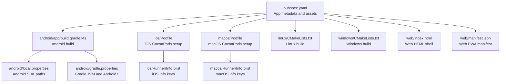
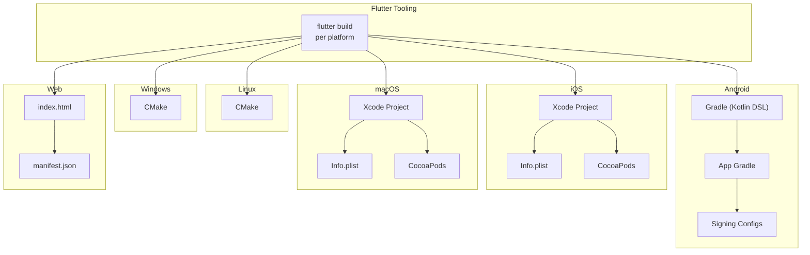
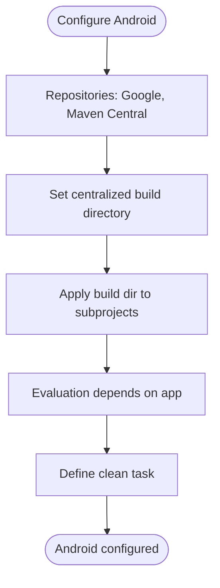
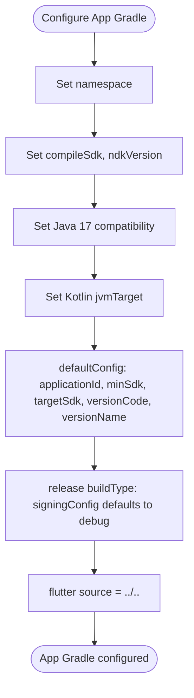
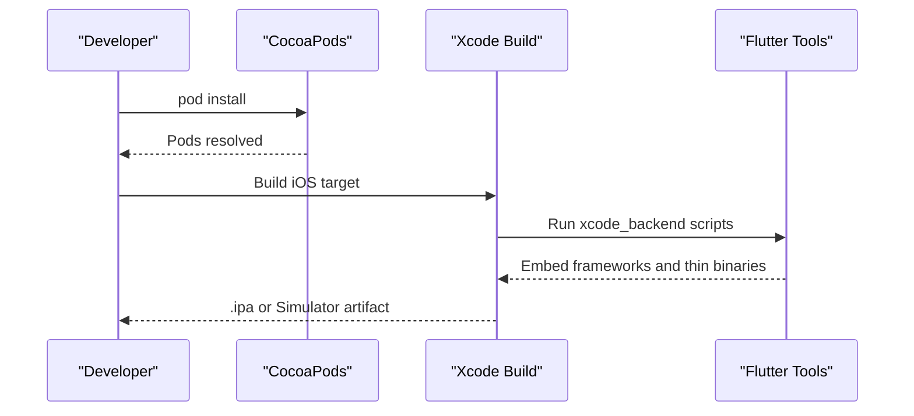
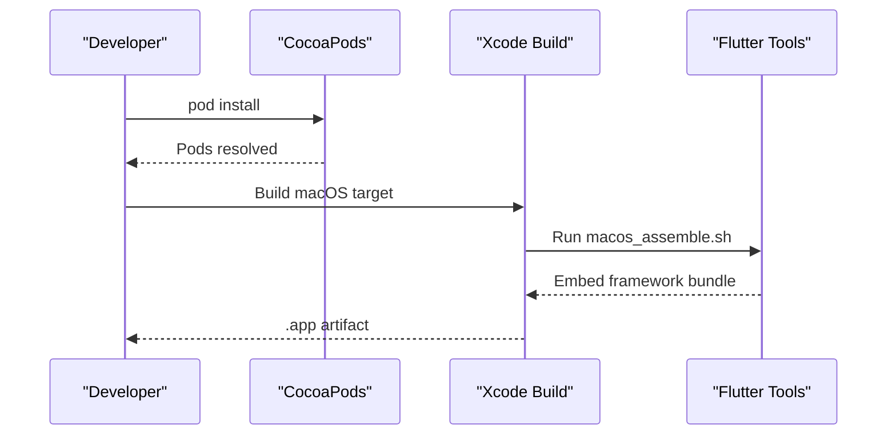
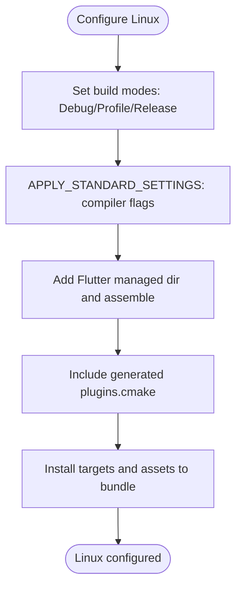
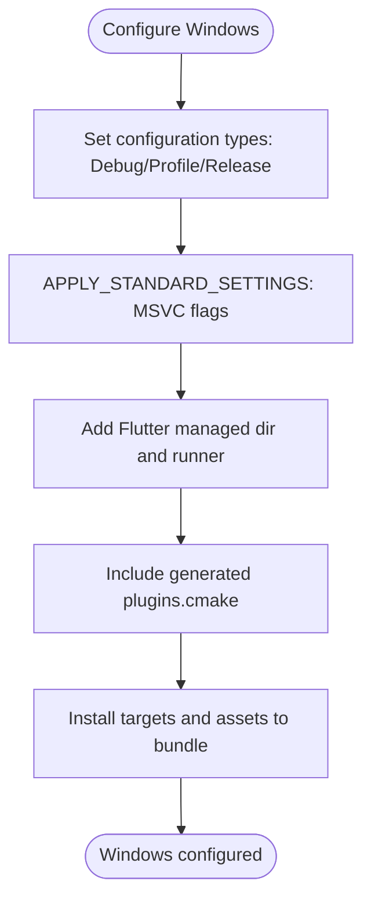
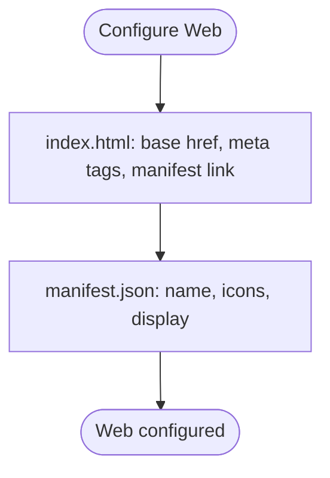
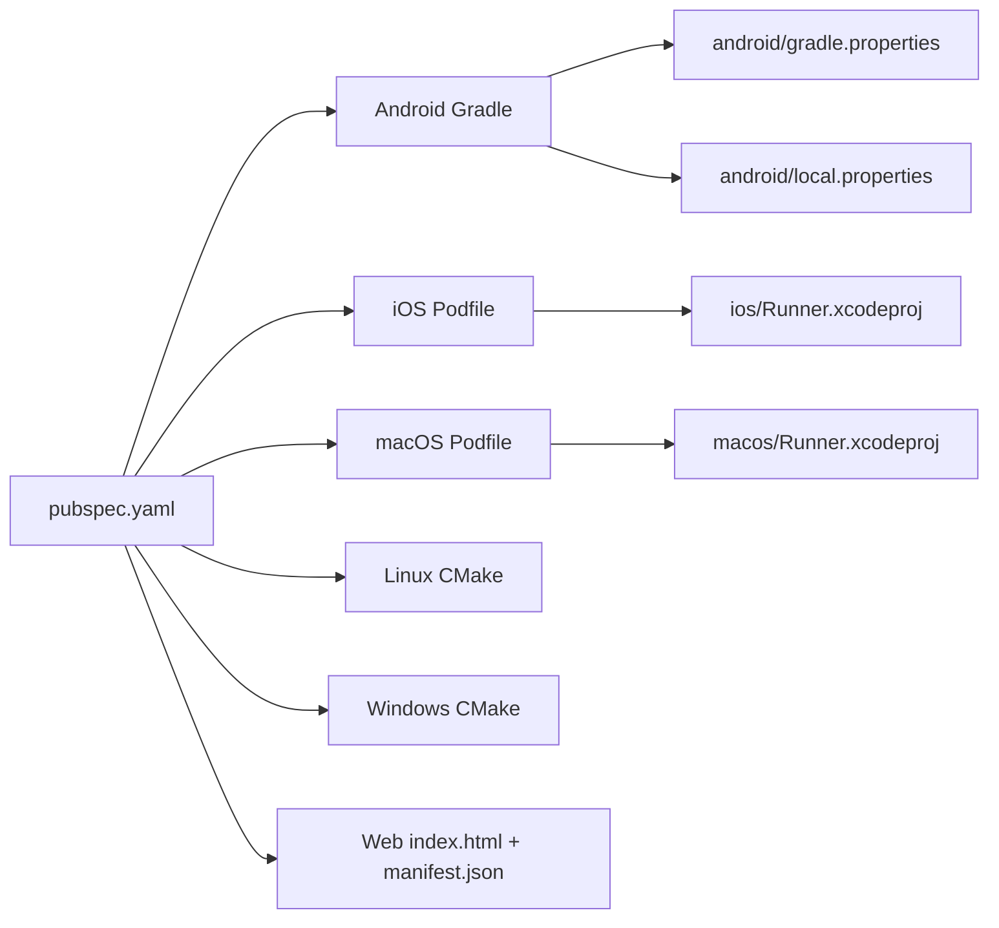

# Deployment and Build Configuration

<cite>
**Referenced Files in This Document**
- [pubspec.yaml](file://pubspec.yaml)
- [android/build.gradle.kts](file://android/build.gradle.kts)
- [android/app/build.gradle.kts](file://android/app/build.gradle.kts)
- [android/gradle.properties](file://android/gradle.properties)
- [android/local.properties](file://android/local.properties)
- [ios/Podfile](file://ios/Podfile)
- [ios/Runner.xcodeproj/project.pbxproj](file://ios/Runner.xcodeproj/project.pbxproj)
- [ios/Runner/Info.plist](file://ios/Runner/Info.plist)
- [macos/Podfile](file://macos/Podfile)
- [macos/Runner.xcodeproj/project.pbxproj](file://macos/Runner.xcodeproj/project.pbxproj)
- [macos/Runner/Info.plist](file://macos/Runner/Info.plist)
- [linux/CMakeLists.txt](file://linux/CMakeLists.txt)
- [windows/CMakeLists.txt](file://windows/CMakeLists.txt)
- [web/index.html](file://web/index.html)
- [web/manifest.json](file://web/manifest.json)
</cite>

## Table of Contents
1. [Introduction](#introduction)
2. [Project Structure](#project-structure)
3. [Core Components](#core-components)
4. [Architecture Overview](#architecture-overview)
5. [Detailed Component Analysis](#detailed-component-analysis)
6. [Dependency Analysis](#dependency-analysis)
7. [Performance Considerations](#performance-considerations)
8. [Troubleshooting Guide](#troubleshooting-guide)
9. [Conclusion](#conclusion)
10. [Appendices](#appendices)

## Introduction
This document provides comprehensive deployment and build configuration guidance for ZB-DEZINE across all supported platforms: Android, iOS, Web, Linux, macOS, and Windows. It explains platform-specific build configurations, release workflows, code signing and entitlements, distribution strategies, CI/CD integration points, automated testing hooks, and platform-specific optimizations. It also includes practical examples of build script references, release workflows, and troubleshooting steps for common deployment issues.

## Project Structure
ZB-DEZINE follows a standard Flutter monorepo layout with platform-specific build configurations under android/, ios/, linux/, macos/, web/, and windows/. The Flutter application entrypoint is lib/main.dart, and the application metadata and assets are configured via pubspec.yaml. Platform-specific packaging manifests and build scripts are provided per platform.

**Diagram sources**
- [pubspec.yaml:1-112](file://pubspec.yaml#L1-L112)
- [android/app/build.gradle.kts:1-45](file://android/app/build.gradle.kts#L1-L45)
- [android/local.properties:1-5](file://android/local.properties#L1-L5)
- [android/gradle.properties:1-3](file://android/gradle.properties#L1-L3)
- [ios/Podfile:1-44](file://ios/Podfile#L1-L44)
- [macos/Podfile:1-43](file://macos/Podfile#L1-L43)
- [linux/CMakeLists.txt:1-129](file://linux/CMakeLists.txt#L1-L129)
- [windows/CMakeLists.txt:1-109](file://windows/CMakeLists.txt#L1-L109)
- [web/index.html:1-39](file://web/index.html#L1-L39)
- [web/manifest.json:1-36](file://web/manifest.json#L1-L36)
- [ios/Runner/Info.plist:1-50](file://ios/Runner/Info.plist#L1-L50)
- [macos/Runner/Info.plist:1-33](file://macos/Runner/Info.plist#L1-L33)

**Section sources**
- [pubspec.yaml:1-112](file://pubspec.yaml#L1-L112)
- [android/app/build.gradle.kts:1-45](file://android/app/build.gradle.kts#L1-L45)
- [ios/Podfile:1-44](file://ios/Podfile#L1-L44)
- [macos/Podfile:1-43](file://macos/Podfile#L1-L43)
- [linux/CMakeLists.txt:1-129](file://linux/CMakeLists.txt#L1-L129)
- [windows/CMakeLists.txt:1-109](file://windows/CMakeLists.txt#L1-L109)
- [web/index.html:1-39](file://web/index.html#L1-L39)
- [web/manifest.json:1-36](file://web/manifest.json#L1-L36)
- [android/local.properties:1-5](file://android/local.properties#L1-L5)
- [android/gradle.properties:1-3](file://android/gradle.properties#L1-L3)
- [ios/Runner/Info.plist:1-50](file://ios/Runner/Info.plist#L1-L50)
- [macos/Runner/Info.plist:1-33](file://macos/Runner/Info.plist#L1-L33)

## Core Components
- Versioning and build metadata: Version and build number are defined in pubspec.yaml and propagate to platform-specific version fields during build.
- Asset bundling: Assets declared in pubspec.yaml are bundled into platform builds.
- Platform-specific packaging:
  - Android: Gradle-based build with applicationId, minSdk/targetSdk, and versionCode/versionName.
  - iOS: Xcode project with Info.plist keys and CocoaPods integration.
  - macOS: Xcode project with Info.plist keys and CocoaPods integration.
  - Linux/macOS/Windows: CMake-based Flutter packaging with install rules and asset copying.
  - Web: Static HTML shell and PWA manifest for browser distribution.

**Section sources**
- [pubspec.yaml:7-19](file://pubspec.yaml#L7-L19)
- [pubspec.yaml:82-86](file://pubspec.yaml#L82-L86)
- [android/app/build.gradle.kts:22-31](file://android/app/build.gradle.kts#L22-L31)
- [ios/Runner/Info.plist:19-24](file://ios/Runner/Info.plist#L19-L24)
- [macos/Runner/Info.plist:19-22](file://macos/Runner/Info.plist#L19-L22)
- [linux/CMakeLists.txt:78-129](file://linux/CMakeLists.txt#L78-L129)
- [windows/CMakeLists.txt:61-109](file://windows/CMakeLists.txt#L61-L109)
- [web/index.html:1-39](file://web/index.html#L1-L39)
- [web/manifest.json:1-36](file://web/manifest.json#L1-L36)

## Architecture Overview
The build and deployment architecture leverages Flutter’s platform embedding and toolchain:
- Flutter tooling generates platform-specific artifacts and integrates with native build systems.
- Android uses Gradle with Kotlin DSL; iOS/macOS use Xcode and CocoaPods; Linux/macOS/Windows use CMake.
- Assets and plugins are resolved via Flutter’s build pipeline and installed into platform bundles.

**Diagram sources**
- [android/app/build.gradle.kts:1-45](file://android/app/build.gradle.kts#L1-L45)
- [ios/Runner.xcodeproj/project.pbxproj:166-201](file://ios/Runner.xcodeproj/project.pbxproj#L166-L201)
- [ios/Runner/Info.plist:1-50](file://ios/Runner/Info.plist#L1-L50)
- [ios/Podfile:1-44](file://ios/Podfile#L1-L44)
- [macos/Runner.xcodeproj/project.pbxproj:225-271](file://macos/Runner.xcodeproj/project.pbxproj#L225-L271)
- [macos/Runner/Info.plist:1-33](file://macos/Runner/Info.plist#L1-L33)
- [macos/Podfile:1-43](file://macos/Podfile#L1-L43)
- [linux/CMakeLists.txt:1-129](file://linux/CMakeLists.txt#L1-L129)
- [windows/CMakeLists.txt:1-109](file://windows/CMakeLists.txt#L1-L109)
- [web/index.html:1-39](file://web/index.html#L1-L39)
- [web/manifest.json:1-36](file://web/manifest.json#L1-L36)

## Detailed Component Analysis

### Android Build Configuration
- Build system: Gradle Kotlin DSL with Android Gradle Plugin and Flutter Gradle Plugin.
- Java/Kotlin compatibility: Java 17 compatibility and Kotlin options configured.
- Versioning: versionCode and versionName sourced from Flutter environment.
- Signing: release build currently uses debug signing configuration; production requires a proper keystore.
- Build directory: centralized build directory configured at root.

**Diagram sources**
- [android/build.gradle.kts:1-25](file://android/build.gradle.kts#L1-L25)

**Diagram sources**
- [android/app/build.gradle.kts:8-44](file://android/app/build.gradle.kts#L8-L44)

**Section sources**
- [android/app/build.gradle.kts:1-45](file://android/app/build.gradle.kts#L1-L45)
- [android/build.gradle.kts:1-25](file://android/build.gradle.kts#L1-L25)
- [android/gradle.properties:1-3](file://android/gradle.properties#L1-L3)
- [android/local.properties:1-5](file://android/local.properties#L1-L5)

### iOS Build Configuration
- Xcode project: Targets include Runner and RunnerTests; build phases include Flutter assembly and thinning.
- Info.plist: Version fields mapped from Flutter build name and number; device orientation and app identifiers configured.
- CocoaPods: Podfile sets up iOS target and installs pods; post_install applies additional build settings.
- Build configurations: Debug, Release, and Profile with Swift optimization and bitcode disabled.

**Diagram sources**
- [ios/Podfile:1-44](file://ios/Podfile#L1-L44)
- [ios/Runner.xcodeproj/project.pbxproj:224-256](file://ios/Runner.xcodeproj/project.pbxproj#L224-L256)
- [ios/Runner/Info.plist:19-24](file://ios/Runner/Info.plist#L19-L24)

**Section sources**
- [ios/Runner.xcodeproj/project.pbxproj:166-201](file://ios/Runner.xcodeproj/project.pbxproj#L166-L201)
- [ios/Runner.xcodeproj/project.pbxproj:224-256](file://ios/Runner.xcodeproj/project.pbxproj#L224-L256)
- [ios/Runner/Info.plist:1-50](file://ios/Runner/Info.plist#L1-L50)
- [ios/Podfile:1-44](file://ios/Podfile#L1-L44)

### macOS Build Configuration
- Xcode project: Targets include Runner, RunnerTests, and Flutter Assemble; macOS-specific Info.plist keys and entitlements.
- CocoaPods: Podfile sets up macOS target and installs pods; post_install applies additional build settings.
- Build configurations: Debug, Release, and Profile with Swift optimization and code signing style.

**Diagram sources**
- [macos/Podfile:1-43](file://macos/Podfile#L1-L43)
- [macos/Runner.xcodeproj/project.pbxproj:293-332](file://macos/Runner.xcodeproj/project.pbxproj#L293-L332)
- [macos/Runner/Info.plist:19-22](file://macos/Runner/Info.plist#L19-L22)

**Section sources**
- [macos/Runner.xcodeproj/project.pbxproj:225-271](file://macos/Runner.xcodeproj/project.pbxproj#L225-L271)
- [macos/Runner.xcodeproj/project.pbxproj#L293-L332)
- [macos/Runner/Info.plist:1-33](file://macos/Runner/Info.plist#L1-L33)
- [macos/Podfile:1-43](file://macos/Podfile#L1-L43)

### Linux Build Configuration
- CMake: Standard Flutter Linux packaging with install rules for assets, ICU data, Flutter engine, and plugin libraries.
- Build modes: Debug, Profile, Release; AOT library installed for non-Debug builds.
- RPATH and relocation: Bundled libraries loaded from lib/ relative to binary.

**Diagram sources**
- [linux/CMakeLists.txt:29-47](file://linux/CMakeLists.txt#L29-L47)
- [linux/CMakeLists.txt:49-76](file://linux/CMakeLists.txt#L49-L76)
- [linux/CMakeLists.txt:78-129](file://linux/CMakeLists.txt#L78-L129)

**Section sources**
- [linux/CMakeLists.txt:1-129](file://linux/CMakeLists.txt#L1-L129)

### Windows Build Configuration
- CMake: Standard Flutter Windows packaging with install rules for assets, ICU data, Flutter engine, and plugin libraries.
- Build modes: Debug, Profile, Release; AOT library installed for Profile/Release.
- Installation: Executable and libraries installed alongside each other for in-place execution.

**Diagram sources**
- [windows/CMakeLists.txt:13-31](file://windows/CMakeLists.txt#L13-L31)
- [windows/CMakeLists.txt:40-46](file://windows/CMakeLists.txt#L40-L46)
- [windows/CMakeLists.txt:48-58](file://windows/CMakeLists.txt#L48-L58)
- [windows/CMakeLists.txt:61-109](file://windows/CMakeLists.txt#L61-L109)

**Section sources**
- [windows/CMakeLists.txt:1-109](file://windows/CMakeLists.txt#L1-L109)

### Web Build Configuration
- HTML shell: index.html includes base href placeholder and PWA-related meta tags.
- Manifest: web/manifest.json defines app identity, display mode, theme color, and icon sets.

**Diagram sources**
- [web/index.html:1-39](file://web/index.html#L1-L39)
- [web/manifest.json:1-36](file://web/manifest.json#L1-L36)

**Section sources**
- [web/index.html:1-39](file://web/index.html#L1-L39)
- [web/manifest.json:1-36](file://web/manifest.json#L1-L36)

## Dependency Analysis
- Flutter SDK version pinned in pubspec.yaml drives platform toolchains.
- Platform-specific build scripts depend on Flutter’s generated configs and tooling.
- Android Gradle centralizes build directories; iOS/macOS CocoaPods integrate plugins; Linux/macOS/Windows CMake installs assets and libraries.

**Diagram sources**
- [pubspec.yaml:21-23](file://pubspec.yaml#L21-L23)
- [android/build.gradle.kts:1-25](file://android/build.gradle.kts#L1-L25)
- [android/gradle.properties:1-3](file://android/gradle.properties#L1-L3)
- [android/local.properties:1-5](file://android/local.properties#L1-L5)
- [ios/Podfile:1-44](file://ios/Podfile#L1-L44)
- [ios/Runner.xcodeproj/project.pbxproj:166-201](file://ios/Runner.xcodeproj/project.pbxproj#L166-L201)
- [macos/Podfile:1-43](file://macos/Podfile#L1-L43)
- [macos/Runner.xcodeproj/project.pbxproj:225-271](file://macos/Runner.xcodeproj/project.pbxproj#L225-L271)
- [linux/CMakeLists.txt:1-129](file://linux/CMakeLists.txt#L1-L129)
- [windows/CMakeLists.txt:1-109](file://windows/CMakeLists.txt#L1-L109)
- [web/index.html:1-39](file://web/index.html#L1-L39)
- [web/manifest.json:1-36](file://web/manifest.json#L1-L36)

**Section sources**
- [pubspec.yaml:21-23](file://pubspec.yaml#L21-L23)
- [android/build.gradle.kts:1-25](file://android/build.gradle.kts#L1-L25)
- [android/gradle.properties:1-3](file://android/gradle.properties#L1-L3)
- [android/local.properties:1-5](file://android/local.properties#L1-L5)
- [ios/Podfile:1-44](file://ios/Podfile#L1-L44)
- [ios/Runner.xcodeproj/project.pbxproj:166-201](file://ios/Runner.xcodeproj/project.pbxproj#L166-L201)
- [macos/Podfile:1-43](file://macos/Podfile#L1-L43)
- [macos/Runner.xcodeproj/project.pbxproj:225-271](file://macos/Runner.xcodeproj/project.pbxproj#L225-L271)
- [linux/CMakeLists.txt:1-129](file://linux/CMakeLists.txt#L1-L129)
- [windows/CMakeLists.txt:1-109](file://windows/CMakeLists.txt#L1-L109)
- [web/index.html:1-39](file://web/index.html#L1-L39)
- [web/manifest.json:1-36](file://web/manifest.json#L1-L36)

## Performance Considerations
- Android
  - Java 17 compatibility improves performance; keep NDK and SDK aligned with Flutter requirements.
  - Centralized build directory reduces redundant builds across subprojects.
- iOS/macOS
  - Swift optimization level set to release-grade; ensure bitcode disabled for App Store submissions.
  - Use thinning and embed frameworks to reduce binary size.
- Linux/macOS/Windows
  - Enable Release/Profile builds to include AOT libraries and optimized compiler flags.
  - Ensure assets are bundled efficiently; avoid unnecessary native assets duplication.
- Web
  - Serve assets with compression and caching headers; ensure manifest icons are optimized.

[No sources needed since this section provides general guidance]

## Troubleshooting Guide
- Android release signing
  - Issue: Release build uses debug signing.
  - Resolution: Configure a keystore and update signingConfig for release in the app Gradle file.
  - Reference: [android/app/build.gradle.kts:33-39](file://android/app/build.gradle.kts#L33-L39)
- iOS CocoaPods missing
  - Issue: Generated.xcconfig missing or pod install fails.
  - Resolution: Run Flutter pub get; ensure FLUTTER_ROOT is present; rerun pod install.
  - References: [ios/Podfile:13-26](file://ios/Podfile#L13-L26), [ios/Runner.xcodeproj/project.pbxproj:224-256](file://ios/Runner.xcodeproj/project.pbxproj#L224-L256)
- macOS CocoaPods missing
  - Issue: Flutter-Generated.xcconfig missing or pod install fails.
  - Resolution: Run Flutter pub get; ensure FLUTTER_ROOT is present; rerun pod install.
  - References: [macos/Podfile:12-25](file://macos/Podfile#L12-L25), [macos/Runner.xcodeproj/project.pbxproj:293-332](file://macos/Runner.xcodeproj/project.pbxproj#L293-L332)
- Linux/macOS asset installation
  - Issue: Missing assets after build.
  - Resolution: Verify install rules for flutter_assets and native assets; ensure build directory is clean before install.
  - References: [linux/CMakeLists.txt:108-123](file://linux/CMakeLists.txt#L108-L123), [windows/CMakeLists.txt:90-103](file://windows/CMakeLists.txt#L90-L103)
- Web base href and manifest
  - Issue: Incorrect routing or PWA metadata.
  - Resolution: Pass --base-href during build; verify manifest.json entries.
  - References: [web/index.html](file://web/index.html#L17), [web/manifest.json:1-36](file://web/manifest.json#L1-L36)

**Section sources**
- [android/app/build.gradle.kts:33-39](file://android/app/build.gradle.kts#L33-L39)
- [ios/Podfile:13-26](file://ios/Podfile#L13-L26)
- [ios/Runner.xcodeproj/project.pbxproj:224-256](file://ios/Runner.xcodeproj/project.pbxproj#L224-L256)
- [macos/Podfile:12-25](file://macos/Podfile#L12-L25)
- [macos/Runner.xcodeproj/project.pbxproj:293-332](file://macos/Runner.xcodeproj/project.pbxproj#L293-L332)
- [linux/CMakeLists.txt:108-123](file://linux/CMakeLists.txt#L108-L123)
- [windows/CMakeLists.txt:90-103](file://windows/CMakeLists.txt#L90-L103)
- [web/index.html](file://web/index.html#L17)
- [web/manifest.json:1-36](file://web/manifest.json#L1-L36)

## Conclusion
ZB-DEZINE’s build system is structured around Flutter’s platform toolchains with minimal overrides. Android relies on Gradle with centralized build directories; iOS and macOS use Xcode and CocoaPods with Info.plist-driven versioning; Linux, Windows, and Web use CMake and static HTML shells. Production readiness requires configuring Android release signing, ensuring CocoaPods setup, and validating asset installation. The next steps involve implementing CI/CD pipelines, automated testing, and platform-specific distribution strategies.

[No sources needed since this section summarizes without analyzing specific files]

## Appendices

### Platform-Specific Build and Release Examples
- Android
  - Build command: flutter build apk --release
  - Notes: Configure keystore and signingConfig for production.
  - References: [android/app/build.gradle.kts:33-39](file://android/app/build.gradle.kts#L33-L39)
- iOS
  - Build command: flutter build ios --release --simulator (for simulator) or archive for device
  - Notes: Ensure provisioning profiles and signing identities are set; verify Info.plist keys.
  - References: [ios/Runner/Info.plist:19-24](file://ios/Runner/Info.plist#L19-L24), [ios/Podfile:1-44](file://ios/Podfile#L1-L44)
- macOS
  - Build command: flutter build macos --release
  - Notes: Confirm entitlements and signing settings; verify Info.plist keys.
  - References: [macos/Runner/Info.plist:19-22](file://macos/Runner/Info.plist#L19-L22), [macos/Podfile:1-43](file://macos/Podfile#L1-L43)
- Linux
  - Build command: flutter build linux --release
  - Notes: Validate install rules and asset bundling.
  - References: [linux/CMakeLists.txt:78-129](file://linux/CMakeLists.txt#L78-L129)
- Windows
  - Build command: flutter build windows --release
  - Notes: Validate install rules and AOT library inclusion.
  - References: [windows/CMakeLists.txt:61-109](file://windows/CMakeLists.txt#L61-L109)
- Web
  - Build command: flutter build web
  - Notes: Pass --base-href as needed; verify manifest and icons.
  - References: [web/index.html](file://web/index.html#L17), [web/manifest.json:1-36](file://web/manifest.json#L1-L36)

### CI/CD Pipeline Setup Guidance
- Trigger: On push to main branch and pull requests.
- Steps:
  - Cache dependencies (Gradle, CocoaPods, pub cache).
  - Install Flutter SDK and dependencies.
  - Run tests: flutter test.
  - Build per platform with appropriate flags.
  - Upload artifacts for release.
- Secrets:
  - Android keystore and passwords.
  - iOS/macOS signing certificates and provisioning profiles.
  - App Store Connect credentials (for Apple platforms).
- Distribution:
  - Android: Internal track or internal app sharing for testing; production via Play Console.
  - iOS/macOS: TestFlight for iOS; Mac App Store or direct distribution for macOS.
  - Web: Host on CDN or static hosting; ensure HTTPS and caching headers.
  - Linux/Windows: Package as appropriate (deb/rpm for Linux; installer for Windows).

[No sources needed since this section provides general guidance]