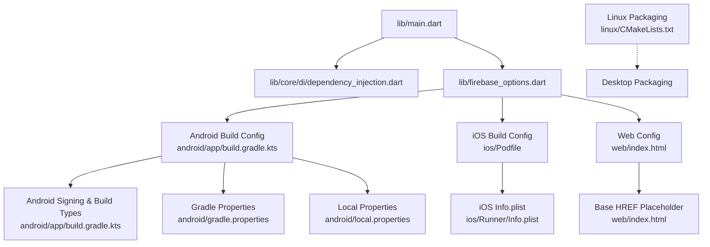
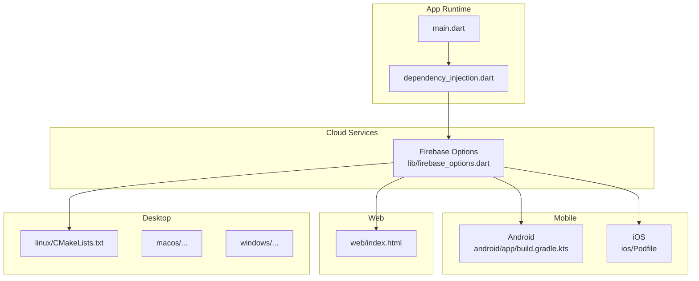
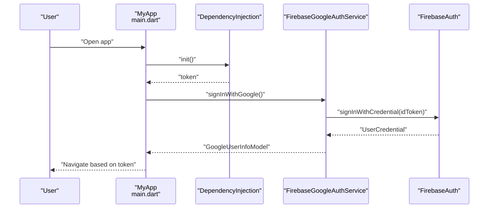
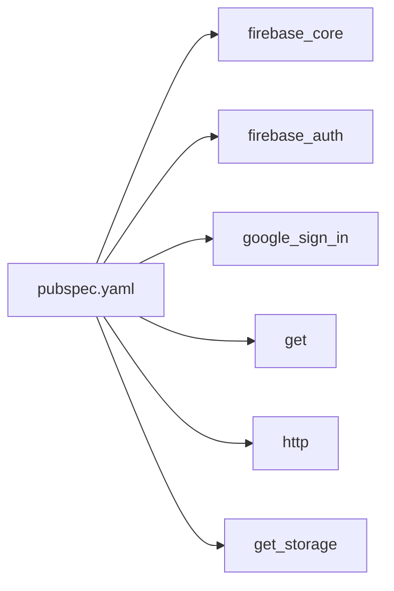

# Deployment and Production

<cite>
**Referenced Files in This Document**
- [pubspec.yaml](file://pubspec.yaml)
- [main.dart](file://lib/main.dart)
- [dependency_injection.dart](file://lib/core/di/dependency_injection.dart)
- [firebase_options.dart](file://lib/firebase_options.dart)
- [firebase_google_auth.dart](file://lib/core/services/firebase_google_auth.dart)
- [android/build.gradle.kts](file://android/build.gradle.kts)
- [android/app/build.gradle.kts](file://android/app/build.gradle.kts)
- [android/local.properties](file://android/local.properties)
- [android/gradle.properties](file://android/gradle.properties)
- [ios/Podfile](file://ios/Podfile)
- [ios/Runner/Info.plist](file://ios/Runner/Info.plist)
- [web/index.html](file://web/index/html)
- [linux/CMakeLists.txt](file://linux/CMakeLists.txt)
</cite>

## Table of Contents
1. [Introduction](#introduction)
2. [Project Structure](#project-structure)
3. [Core Components](#core-components)
4. [Architecture Overview](#architecture-overview)
5. [Detailed Component Analysis](#detailed-component-analysis)
6. [Dependency Analysis](#dependency-analysis)
7. [Performance Considerations](#performance-considerations)
8. [Troubleshooting Guide](#troubleshooting-guide)
9. [Conclusion](#conclusion)
10. [Appendices](#appendices)

## Introduction
This document provides comprehensive deployment and production guidance for the ZB-DEZINE Flutter application. It covers build configuration for Android (APK/AAB), iOS (App Store), web, and desktop platforms, environment variable management, configuration for development, staging, and production, CI/CD pipeline setup, Firebase authentication and database configuration, API endpoint management, third-party integrations, monitoring and analytics, performance optimization, security considerations, rollback procedures, update strategies, maintenance tasks, and common deployment issues with solutions.

## Project Structure
ZB-DEZINE is a Flutter application with platform-specific build configurations under android/, ios/, linux/, macos/, windows/, and web/. The application initializes dependency injection in main.dart and loads environment-dependent configuration via Firebase options. Platform-specific build scripts and configuration files define signing, SDK versions, and packaging behavior.

**Diagram sources**
- [main.dart:12-19](file://lib/main.dart#L12-L19)
- [dependency_injection.dart:11-25](file://lib/core/di/dependency_injection.dart#L11-L25)
- [firebase_options.dart:17-68](file://lib/firebase_options.dart#L17-L68)
- [android/app/build.gradle.kts:11-43](file://android/app/build.gradle.kts#L11-L43)
- [android/gradle.properties:1-3](file://android/gradle.properties#L1-L3)
- [android/local.properties:1-5](file://android/local.properties#L1-L5)
- [ios/Podfile:1-44](file://ios/Podfile#L1-L44)
- [ios/Runner/Info.plist:1-50](file://ios/Runner/Info.plist#L1-L50)
- [web/index.html:17](file://web/index.html#L17)
- [linux/CMakeLists.txt:1-129](file://linux/CMakeLists.txt#L1-L129)

**Section sources**
- [pubspec.yaml:1-118](file://pubspec.yaml#L1-L118)
- [main.dart:12-19](file://lib/main.dart#L12-L19)
- [dependency_injection.dart:11-25](file://lib/core/di/dependency_injection.dart#L11-L25)
- [firebase_options.dart:17-68](file://lib/firebase_options.dart#L17-L68)
- [android/app/build.gradle.kts:11-43](file://android/app/build.gradle.kts#L11-L43)
- [android/gradle.properties:1-3](file://android/gradle.properties#L1-L3)
- [android/local.properties:1-5](file://android/local.properties#L1-L5)
- [ios/Podfile:1-44](file://ios/Podfile#L1-L44)
- [ios/Runner/Info.plist:1-50](file://ios/Runner/Info.plist#L1-L50)
- [web/index.html:17](file://web/index.html#L17)
- [linux/CMakeLists.txt:1-129](file://linux/CMakeLists.txt#L1-L129)

## Core Components
- Application bootstrap and DI initialization occur in main.dart, which calls DependencyInjection.init() to prepare storage, theme, and network clients. This is the entry point for environment-dependent initialization.
- Firebase options are centralized in firebase_options.dart with platform-specific defaults. The current implementation throws for web and macOS/windows/linux, indicating platform support boundaries.
- Firebase Google authentication service is encapsulated in firebase_google_auth.dart, handling Google Sign-In and Firebase credential exchange.

Key responsibilities:
- main.dart: Initializes Flutter binding, dependency injection, and runs the app with dynamic initial route based on token presence.
- dependency_injection.dart: Sets up persistent services and returns a token string for runtime routing decisions.
- firebase_options.dart: Provides FirebaseOptions per platform and enforces platform support.
- firebase_google_auth.dart: Manages Google Sign-In flow and Firebase sign-in/out.

**Section sources**
- [main.dart:12-19](file://lib/main.dart#L12-L19)
- [dependency_injection.dart:11-25](file://lib/core/di/dependency_injection.dart#L11-L25)
- [firebase_options.dart:17-68](file://lib/firebase_options.dart#L17-L68)
- [firebase_google_auth.dart:6-68](file://lib/core/services/firebase_google_auth.dart#L6-L68)

## Architecture Overview
The production deployment architecture integrates Flutter’s multi-platform build system with platform-specific packaging and distribution channels. Firebase is configured for Android and iOS with explicit options. Web deployment uses a base href placeholder and PWA manifest. Desktop packaging leverages CMake-based runners.

**Diagram sources**
- [main.dart:12-19](file://lib/main.dart#L12-L19)
- [dependency_injection.dart:11-25](file://lib/core/di/dependency_injection.dart#L11-L25)
- [firebase_options.dart:17-68](file://lib/firebase_options.dart#L17-L68)
- [android/app/build.gradle.kts:11-43](file://android/app/build.gradle.kts#L11-L43)
- [ios/Podfile:1-44](file://ios/Podfile#L1-44)
- [web/index.html:17](file://web/index.html#L17)
- [linux/CMakeLists.txt:1-129](file://linux/CMakeLists.txt#L1-L129)

## Detailed Component Analysis

### Android Build Configuration (APK/AAB)
- Application ID and namespace are defined in android/app/build.gradle.kts. Ensure the applicationId matches the Firebase project configuration.
- Build types include release with a debug signing config. For production, replace with a proper keystore and signing block.
- Java/Kotlin compatibility is set to Java 17. Confirm NDK and SDK versions align with Flutter SDK constraints.
- Centralized Gradle build directory is configured in android/build.gradle.kts to a shared build folder.

Recommended production steps:
- Create and configure a keystore for release signing.
- Set up ProGuard/R8 rules for code shrinking and obfuscation.
- Configure versionCode and versionName according to semantic versioning.
- Use bundle (.aab) for Play Store distribution with internal testing tracks.

**Section sources**
- [android/app/build.gradle.kts:11-43](file://android/app/build.gradle.kts#L11-L43)
- [android/build.gradle.kts:8-17](file://android/build.gradle.kts#L8-L17)

### iOS Build Configuration (App Store)
- The Podfile sets up Flutter pods and disables CocoaPods analytics for build latency. Ensure pods are installed via flutter pub get and pod install.
- Info.plist defines bundle identifiers, display names, and supported orientations. Align CFBundleShortVersionString and CFBundleVersion with Flutter build flags.
- Use Xcode Archive and Export for App Store distribution. Configure signing and provisioning profiles in Xcode.

**Section sources**
- [ios/Podfile:1-44](file://ios/Podfile#L1-L44)
- [ios/Runner/Info.plist:19-24](file://ios/Runner/Info.plist#L19-L24)

### Web Deployment
- web/index.html includes a base href placeholder ($FLUTTER_BASE_HREF) intended to be replaced by the --base-href argument during build. Ensure the base tag is correctly set for CDN or subpath deployments.
- The manifest.json file resides under web/. Ensure it is present and properly configured for PWA features.

Production considerations:
- Build with --base-href for subpath deployments.
- Host on a CDN or static hosting provider with HTTPS enabled.
- Verify service worker and caching strategies for offline behavior.

**Section sources**
- [web/index.html:17](file://web/index.html#L17)

### Desktop Packaging (Linux/macOS/Windows)
- Linux packaging uses CMake with standard settings and install rules. The binary name and application ID are defined in linux/CMakeLists.txt.
- macOS and Windows folders indicate platform support. Use flutter build commands for each platform and package accordingly.

**Section sources**
- [linux/CMakeLists.txt:7-10](file://linux/CMakeLists.txt#L7-L10)

### Firebase Authentication and Configuration
- FirebaseOptions are provided for Android and iOS. The current implementation throws for web and other platforms, indicating missing configuration.
- Google Sign-In integration is handled by firebase_google_auth.dart, which obtains tokens and signs into Firebase.

Production steps:
- Generate and integrate platform-specific Firebase configuration files for all supported platforms.
- Configure OAuth client IDs for Google Sign-In in Firebase and Google Cloud Console.
- Secure API keys and service account credentials outside of source control.

**Diagram sources**
- [main.dart:12-19](file://lib/main.dart#L12-L19)
- [dependency_injection.dart:11-25](file://lib/core/di/dependency_injection.dart#L11-L25)
- [firebase_google_auth.dart:15-34](file://lib/core/services/firebase_google_auth.dart#L15-L34)

**Section sources**
- [firebase_options.dart:17-68](file://lib/firebase_options.dart#L17-L68)
- [firebase_google_auth.dart:6-68](file://lib/core/services/firebase_google_auth.dart#L6-L68)

### Environment Variables and Configuration Management
- Versioning: pubspec.yaml defines version and build metadata. Android/iOS map these to versionName/versionCode and CFBundleShortVersionString/CFBundleVersion respectively.
- Local overrides: android/local.properties sets Flutter SDK path and build modes. Use this to tailor local builds without committing secrets.
- Gradle JVM settings: android/gradle.properties configures memory and AndroidX usage.

Recommendations:
- Use environment-specific configuration files or build flavors for dev/staging/prod.
- Store secrets in secure secret managers or CI/CD variables, not in source.
- Keep versionName/versionCode aligned across platforms.

**Section sources**
- [pubspec.yaml:19](file://pubspec.yaml#L19)
- [android/local.properties:1-5](file://android/local.properties#L1-L5)
- [android/gradle.properties:1-3](file://android/gradle.properties#L1-L3)
- [ios/Runner/Info.plist:19-24](file://ios/Runner/Info.plist#L19-L24)

### CI/CD Pipeline Setup
High-level guidance:
- Build matrix: Android (APK/AAB), iOS (IPA), Web, Linux/macOS/Windows.
- Steps:
  - Cache dependencies (Flutter SDK, Gradle, Pods).
  - Install dependencies (flutter pub get, pod install).
  - Build artifacts (flutter build for each target).
  - Upload artifacts to artifact storage or distribution systems.
  - Deploy to stores or hosting providers.
- Secrets: Store Firebase options, Apple credentials, keystore passwords, and CDN tokens in CI/CD secure variables.

[No sources needed since this section provides general guidance]

### API Endpoint Management and Third-Party Integrations
- Network clients are registered via DependencyInjection.init(). Integrate API endpoints and third-party SDKs through these services.
- Ensure HTTPS endpoints and secure communication. Validate certificates and handle timeouts appropriately.

**Section sources**
- [dependency_injection.dart:17-20](file://lib/core/di/dependency_injection.dart#L17-L20)

### Monitoring and Analytics
- Recommended integrations: Firebase Analytics, Crashlytics, and performance monitoring.
- Instrument key user journeys and error boundaries. Track authentication events and feature usage.

[No sources needed since this section provides general guidance]

## Dependency Analysis
The application depends on Flutter SDK and several packages. Firebase-related dependencies are present for core and auth. Asset and font declarations are configured in pubspec.yaml.

**Diagram sources**
- [pubspec.yaml:30-66](file://pubspec.yaml#L30-L66)

**Section sources**
- [pubspec.yaml:30-66](file://pubspec.yaml#L30-L66)

## Performance Considerations
- Android:
  - Enable code shrinking and resource obfuscation.
  - Optimize draw calls and reduce unnecessary recompositions.
  - Profile with Android Studio and Flutter DevTools.
- iOS:
  - Minimize Objective-C bridging overhead.
  - Use efficient image assets and vector graphics.
- Web:
  - Lazy-load heavy assets and routes.
  - Optimize base href and caching headers.
- Desktop:
  - Use optimized CMake build types (Release).
  - Minimize plugin usage and native dependencies.

[No sources needed since this section provides general guidance]

## Troubleshooting Guide
Common deployment issues and resolutions:
- Android release signing failure:
  - Ensure a valid keystore exists and signingConfig points to it in release build type.
- iOS archive failures:
  - Verify provisioning profiles and signing certificates in Xcode Organizer.
- Web base href mismatch:
  - Rebuild with correct --base-href for subpath deployments.
- Firebase options not configured:
  - Generate and integrate platform-specific configuration files for web/macOS/windows/linux.
- Gradle memory issues:
  - Increase heap size in android/gradle.properties as needed.

**Section sources**
- [android/app/build.gradle.kts:36-42](file://android/app/build.gradle.kts#L36-L42)
- [ios/Podfile:1-44](file://ios/Podfile#L1-L44)
- [web/index.html:17](file://web/index.html#L17)
- [firebase_options.dart:17-68](file://lib/firebase_options.dart#L17-L68)
- [android/gradle.properties:1](file://android/gradle.properties#L1)

## Conclusion
ZB-DEZINE’s deployment relies on Flutter’s multi-platform toolchain with platform-specific build configurations. Production readiness requires configuring release signing for Android/iOS, integrating Firebase options for all supported platforms, setting up CI/CD with secure secrets, and optimizing performance across platforms. Follow the outlined procedures for environment management, monitoring, security, and rollback/update strategies to maintain a robust production deployment.

[No sources needed since this section summarizes without analyzing specific files]

## Appendices

### Rollback Procedures
- Android: Revert to the last known good APK/AAB and update Play Console internal track.
- iOS: Re-submit a previous build version to TestFlight or App Store Connect.
- Web: Roll back CDN deployment to the previous successful commit.
- Desktop: Replace binaries with the last working versions.

[No sources needed since this section provides general guidance]

### Update Strategies
- Increment versionCode/versionName for Android and CFBundleShortVersionString/CFBundleVersion for iOS.
- Use staged rollouts (internal testing, closed/beta, open) for gradual adoption.
- Communicate breaking changes and migration steps to users.

[No sources needed since this section provides general guidance]

### Maintenance Tasks
- Rotate keystore and signing credentials periodically.
- Review and update Firebase configuration files regularly.
- Monitor crash reports and analytics dashboards.
- Keep Flutter SDK and platform toolchains updated.

[No sources needed since this section provides general guidance]