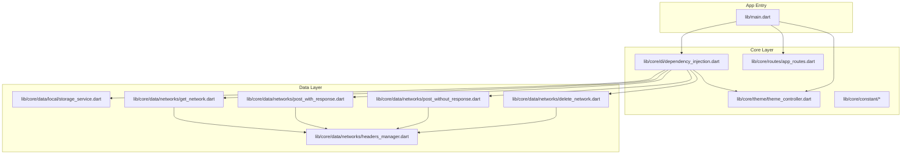
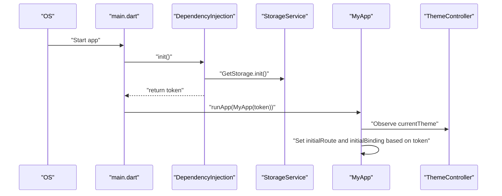
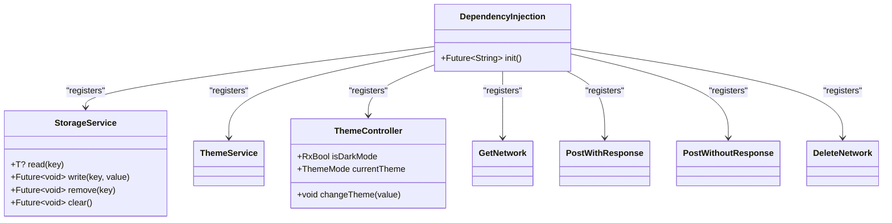
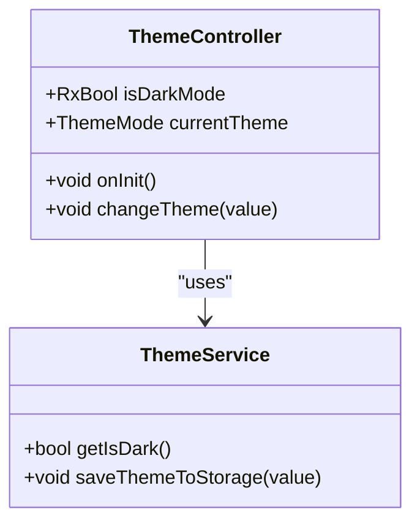
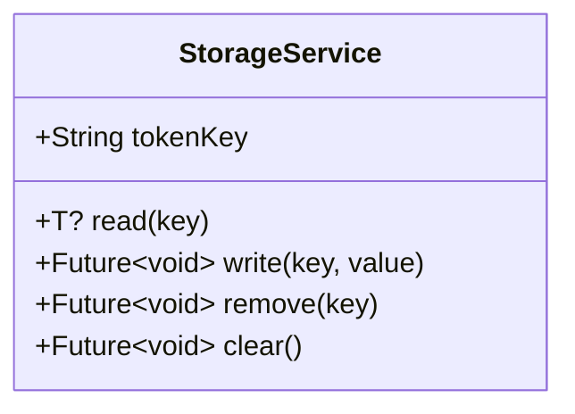
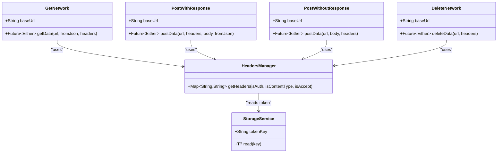
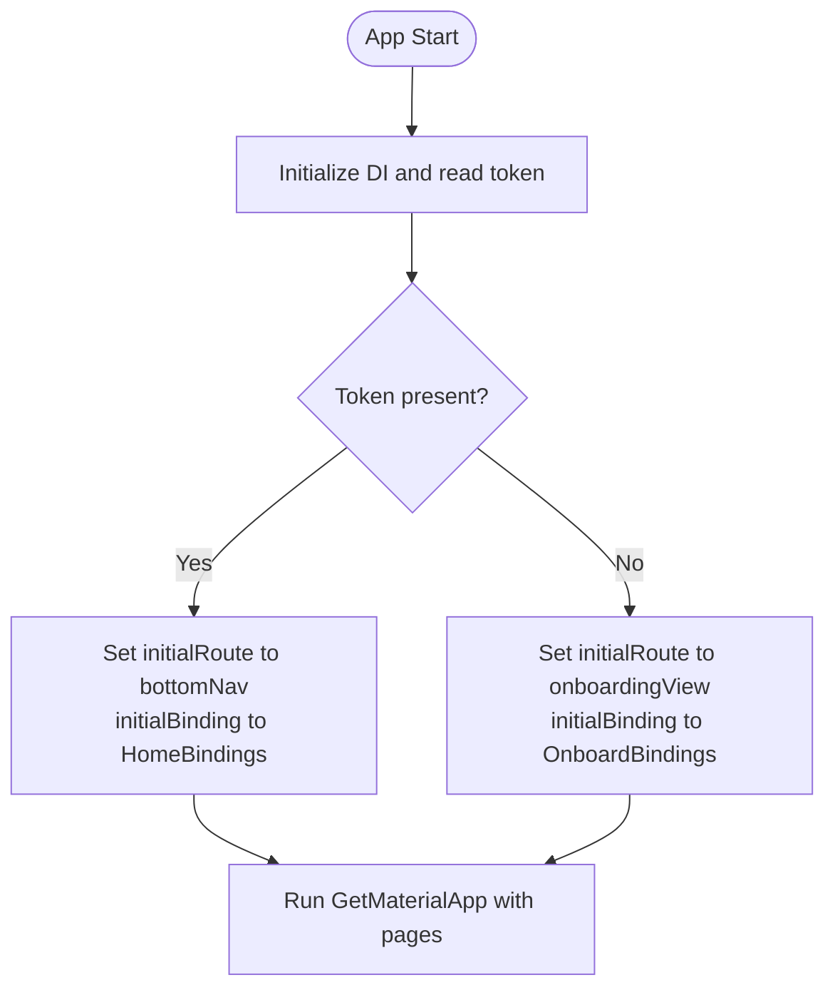
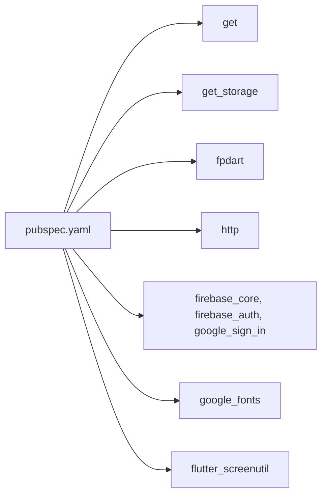

# Development Guidelines

<cite>
**Referenced Files in This Document**
- [pubspec.yaml](file://pubspec.yaml)
- [analysis_options.yaml](file://analysis_options.yaml)
- [README.md](file://README.md)
- [lib/main.dart](file://lib/main.dart)
- [lib/core/di/dependency_injection.dart](file://lib/core/di/dependency_injection.dart)
- [lib/core/routes/app_routes.dart](file://lib/core/routes/app_routes.dart)
- [lib/core/theme/theme_controller.dart](file://lib/core/theme/theme_controller.dart)
- [lib/core/data/local/storage_service.dart](file://lib/core/data/local/storage_service.dart)
- [lib/core/data/networks/get_network.dart](file://lib/core/data/networks/get_network.dart)
- [lib/core/data/networks/post_with_response.dart](file://lib/core/data/networks/post_with_response.dart)
- [lib/core/data/networks/post_without_response.dart](file://lib/core/data/networks/post_without_response.dart)
- [lib/core/data/networks/delete_network.dart](file://lib/core/data/networks/delete_network.dart)
- [lib/core/data/networks/headers_manager.dart](file://lib/core/data/networks/headers_manager.dart)
</cite>

## Table of Contents
1. [Introduction](#introduction)
2. [Project Structure](#project-structure)
3. [Core Components](#core-components)
4. [Architecture Overview](#architecture-overview)
5. [Detailed Component Analysis](#detailed-component-analysis)
6. [Dependency Analysis](#dependency-analysis)
7. [Performance Considerations](#performance-considerations)
8. [Testing Strategies](#testing-strategies)
9. [Debugging Approaches](#debugging-approaches)
10. [Adding New Features and Extending Functionality](#adding-new-features-and-extending-functionality)
11. [Code Review and Contribution Workflow](#code-review-and-contribution-workflow)
12. [Common Pitfalls and How to Avoid Them](#common-pitfalls-and-how-to-avoid-them)
13. [Conclusion](#conclusion)

## Introduction
This document provides comprehensive development guidelines for the ZB-DEZINE Flutter project. It consolidates code style standards, naming conventions, architectural best practices, and operational workflows used across the codebase. The guidelines emphasize consistent state management via GetX, robust dependency injection, structured routing, centralized network handling, and maintainable service abstractions. These practices ensure scalability, readability, and ease of maintenance as the project evolves.

## Project Structure
The project follows a layered, feature-centric structure:
- lib/core: Shared infrastructure, constants, DI, routes, themes, and data/network layers
- lib/features: Feature modules with bindings and views
- lib/shared: Cross-cutting utilities and reusable components
- Root assets: Images and icons
- Platform integrations: Android, iOS, Web, Linux, macOS, Windows under respective folders

**Diagram sources**
- [lib/main.dart:1-47](file://lib/main.dart#L1-L47)
- [lib/core/di/dependency_injection.dart:1-27](file://lib/core/di/dependency_injection.dart#L1-L27)
- [lib/core/routes/app_routes.dart:1-34](file://lib/core/routes/app_routes.dart#L1-L34)
- [lib/core/theme/theme_controller.dart:1-22](file://lib/core/theme/theme_controller.dart#L1-L22)
- [lib/core/data/local/storage_service.dart:1-23](file://lib/core/data/local/storage_service.dart#L1-L23)
- [lib/core/data/networks/get_network.dart:1-39](file://lib/core/data/networks/get_network.dart#L1-L39)
- [lib/core/data/networks/post_with_response.dart:1-45](file://lib/core/data/networks/post_with_response.dart#L1-L45)
- [lib/core/data/networks/post_without_response.dart:1-47](file://lib/core/data/networks/post_without_response.dart#L1-L47)
- [lib/core/data/networks/delete_network.dart:1-41](file://lib/core/data/networks/delete_network.dart#L1-L41)
- [lib/core/data/networks/headers_manager.dart:1-23](file://lib/core/data/networks/headers_manager.dart#L1-L23)

**Section sources**
- [lib/main.dart:1-47](file://lib/main.dart#L1-L47)
- [lib/core/di/dependency_injection.dart:1-27](file://lib/core/di/dependency_injection.dart#L1-L27)
- [lib/core/routes/app_routes.dart:1-34](file://lib/core/routes/app_routes.dart#L1-L34)

## Core Components
- Dependency Injection: Centralized initialization and registration of services and controllers using GetX. Services are marked permanent to persist across navigation.
- Routing: Centralized route constants and page registration for clean navigation.
- State Management: GetX controllers manage reactive state; ThemeController observes theme preferences and persists them.
- Local Storage: StorageService wraps GetStorage for typed reads/writes and clears.
- Networking: Dedicated network classes encapsulate HTTP operations with consistent error modeling via Either<ErrorModel, T>.
- Headers: HeadersManager centralizes header composition, including Authorization tokens resolved from storage.

Key conventions:
- Naming: PascalCase for classes, camelCase for methods and variables, UPPER_SNAKE_CASE for constants.
- File naming: Feature-related files use descriptive nouns (e.g., storage_service.dart).
- Layer separation: Clear boundaries between core, features, and shared layers.

**Section sources**
- [lib/core/di/dependency_injection.dart:1-27](file://lib/core/di/dependency_injection.dart#L1-L27)
- [lib/core/routes/app_routes.dart:1-34](file://lib/core/routes/app_routes.dart#L1-L34)
- [lib/core/theme/theme_controller.dart:1-22](file://lib/core/theme/theme_controller.dart#L1-L22)
- [lib/core/data/local/storage_service.dart:1-23](file://lib/core/data/local/storage_service.dart#L1-L23)
- [lib/core/data/networks/get_network.dart:1-39](file://lib/core/data/networks/get_network.dart#L1-L39)
- [lib/core/data/networks/post_with_response.dart:1-45](file://lib/core/data/networks/post_with_response.dart#L1-L45)
- [lib/core/data/networks/post_without_response.dart:1-47](file://lib/core/data/networks/post_without_response.dart#L1-L47)
- [lib/core/data/networks/delete_network.dart:1-41](file://lib/core/data/networks/delete_network.dart#L1-L41)
- [lib/core/data/networks/headers_manager.dart:1-23](file://lib/core/data/networks/headers_manager.dart#L1-L23)

## Architecture Overview
The app boots through main.dart, initializes DI, and sets up GetMaterialApp with reactive theme binding and route selection based on authentication state.

**Diagram sources**
- [lib/main.dart:12-19](file://lib/main.dart#L12-L19)
- [lib/core/di/dependency_injection.dart:12-25](file://lib/core/di/dependency_injection.dart#L12-L25)
- [lib/core/data/local/storage_service.dart:1-23](file://lib/core/data/local/storage_service.dart#L1-L23)
- [lib/core/theme/theme_controller.dart:20-22](file://lib/core/theme/theme_controller.dart#L20-L22)

## Detailed Component Analysis

### Dependency Injection
- Purpose: Initialize and register all singleton services and controllers with GetX.
- Pattern: Permanent bindings for long-lived services; retrieval via Get.find<T>().

**Diagram sources**
- [lib/core/di/dependency_injection.dart:11-26](file://lib/core/di/dependency_injection.dart#L11-L26)
- [lib/core/data/local/storage_service.dart:3-22](file://lib/core/data/local/storage_service.dart#L3-L22)
- [lib/core/theme/theme_controller.dart:5-22](file://lib/core/theme/theme_controller.dart#L5-L22)

**Section sources**
- [lib/core/di/dependency_injection.dart:1-27](file://lib/core/di/dependency_injection.dart#L1-L27)

### Theme and Reactive UI
- ThemeController stores a reactive boolean for dark mode and persists it via ThemeService.
- MyApp binds to ThemeController to switch light/dark themes reactively.

**Diagram sources**
- [lib/core/theme/theme_controller.dart:5-22](file://lib/core/theme/theme_controller.dart#L5-L22)

**Section sources**
- [lib/core/theme/theme_controller.dart:1-22](file://lib/core/theme/theme_controller.dart#L1-L22)

### Storage Service
- Provides typed storage operations using GetStorage.
- Encapsulates token key constant for consistent access.

**Diagram sources**
- [lib/core/data/local/storage_service.dart:3-22](file://lib/core/data/local/storage_service.dart#L3-L22)

**Section sources**
- [lib/core/data/local/storage_service.dart:1-23](file://lib/core/data/local/storage_service.dart#L1-L23)

### Network Layer
- GetNetwork: Generic GET requests returning Either<ErrorModel, T>.
- PostWithResponse: POST with JSON body and typed response parsing.
- PostWithoutResponse: POST without expecting a response payload.
- DeleteNetwork: DELETE requests with success/failure modeling.
- HeadersManager: Composes headers including Content-Type, Accept, and Authorization derived from StorageService.

**Diagram sources**
- [lib/core/data/networks/get_network.dart:8-38](file://lib/core/data/networks/get_network.dart#L8-L38)
- [lib/core/data/networks/post_with_response.dart:7-44](file://lib/core/data/networks/post_with_response.dart#L7-L44)
- [lib/core/data/networks/post_without_response.dart:9-46](file://lib/core/data/networks/post_without_response.dart#L9-L46)
- [lib/core/data/networks/delete_network.dart:8-40](file://lib/core/data/networks/delete_network.dart#L8-L40)
- [lib/core/data/networks/headers_manager.dart:4-22](file://lib/core/data/networks/headers_manager.dart#L4-L22)
- [lib/core/data/local/storage_service.dart:3-9](file://lib/core/data/local/storage_service.dart#L3-L9)

**Section sources**
- [lib/core/data/networks/get_network.dart:1-39](file://lib/core/data/networks/get_network.dart#L1-L39)
- [lib/core/data/networks/post_with_response.dart:1-45](file://lib/core/data/networks/post_with_response.dart#L1-L45)
- [lib/core/data/networks/post_without_response.dart:1-47](file://lib/core/data/networks/post_without_response.dart#L1-L47)
- [lib/core/data/networks/delete_network.dart:1-41](file://lib/core/data/networks/delete_network.dart#L1-L41)
- [lib/core/data/networks/headers_manager.dart:1-23](file://lib/core/data/networks/headers_manager.dart#L1-L23)

### Routing
- Route constants are centralized in AppRoutes for consistent navigation.
- Initial route and binding selection depend on token presence.

**Diagram sources**
- [lib/main.dart:12-19](file://lib/main.dart#L12-L19)
- [lib/core/routes/app_routes.dart:1-34](file://lib/core/routes/app_routes.dart#L1-L34)

**Section sources**
- [lib/core/routes/app_routes.dart:1-34](file://lib/core/routes/app_routes.dart#L1-L34)
- [lib/main.dart:36-40](file://lib/main.dart#L36-L40)

## Dependency Analysis
External dependencies are declared in pubspec.yaml. The project leverages:
- GetX for state management and dependency injection
- GetStorage for secure local storage
- fpdart for functional error modeling (Either)
- http for networking
- Firebase ecosystem for authentication and core services
- Google Fonts, screen utility, and UI widgets for UX

**Diagram sources**
- [pubspec.yaml:30-66](file://pubspec.yaml#L30-L66)

**Section sources**
- [pubspec.yaml:1-118](file://pubspec.yaml#L1-L118)

## Performance Considerations
- Prefer permanent bindings for frequently used services to avoid repeated instantiation.
- Use typed storage keys to prevent runtime casting overhead.
- Centralize headers to minimize duplication and reduce request overhead.
- Avoid unnecessary rebuilds by scoping reactive state to minimal controllers.
- Cache small immutable data in memory; persist larger data via GetStorage.
- Use Either modeling to short-circuit error handling early in network calls.

## Testing Strategies
- Unit tests: Focus on pure functions, controllers, and services. Mock external dependencies (HTTP, storage) using dependency injection.
- Widget tests: Test UI behavior with GetMaterialApp and reactive controllers.
- Integration tests: Verify navigation flows and state transitions across bindings.
- Linting and static analysis: Enforce style and safety rules via analysis_options.yaml.

Guidelines:
- Keep tests isolated and deterministic.
- Use test doubles for network calls and storage.
- Assert state changes via GetX observables.
- Validate route transitions and initial bindings.

**Section sources**
- [analysis_options.yaml:10-29](file://analysis_options.yaml#L10-L29)

## Debugging Approaches
- Use Get.find<T>() to locate registered instances during runtime.
- Leverage debugPrint strategically in network classes for visibility.
- Inspect reactive state via GetX observables and logs.
- Validate token presence and header composition using HeadersManager.
- Confirm DI initialization order and storage readiness before navigation.

**Section sources**
- [lib/core/di/dependency_injection.dart:12-25](file://lib/core/di/dependency_injection.dart#L12-L25)
- [lib/core/data/networks/get_network.dart:27-28](file://lib/core/data/networks/get_network.dart#L27-L28)
- [lib/core/data/networks/post_with_response.dart:27-28](file://lib/core/data/networks/post_with_response.dart#L27-L28)
- [lib/core/data/networks/post_without_response.dart:23-24](file://lib/core/data/networks/post_without_response.dart#L23-L24)
- [lib/core/data/networks/delete_network.dart:36-37](file://lib/core/data/networks/delete_network.dart#L36-L37)
- [lib/core/data/networks/headers_manager.dart:17-19](file://lib/core/data/networks/headers_manager.dart#L17-L19)

## Adding New Features and Extending Functionality
- Create a new feature module under lib/features/<feature_name>/ with:
  - Bindings for controllers and services
  - Views/components
  - Routes constants appended to AppRoutes
- Register new services in DependencyInjection.init() with permanent bindings.
- Add route entries in appRoutes list and initialRoute/initialBinding logic in main.dart.
- Implement network calls using existing network classes and wrap responses with Either.
- Persist state via StorageService and reactive controllers via GetX.
- Keep UI responsive by offloading heavy tasks to background threads and minimizing rebuild scopes.

## Code Review and Contribution Workflow
- Branching: Use feature branches per task; keep commits atomic and descriptive.
- Style: Adhere to Flutter lints; prefer single quotes, concise naming, and consistent formatting.
- Reviews: Require at least one reviewer; focus on correctness, performance, and maintainability.
- CI: Ensure flutter analyze and tests pass locally before opening PRs.
- Conventions: Follow established naming and layering patterns; avoid tight coupling between layers.

**Section sources**
- [analysis_options.yaml:10-29](file://analysis_options.yaml#L10-L29)

## Common Pitfalls and How to Avoid Them
- Avoid global mutable state: Use GetX controllers and DI to manage state centrally.
- Do not hardcode tokens: Always read from StorageService via HeadersManager.
- Excessive rebuilds: Scope reactive state to minimal controllers and avoid rebuilding entire screens unnecessarily.
- Ignoring errors: Always handle Either<ErrorModel, T> and surface user-friendly messages.
- Missing DI registration: Ensure new services are registered in DependencyInjection.init().
- Inconsistent headers: Centralize header creation in HeadersManager to avoid drift.
- Overusing print: Prefer debugPrint and structured logging for production builds.

## Conclusion
These guidelines establish a consistent foundation for building, testing, and maintaining ZB-DEZINE. By adhering to the layered architecture, GetX-driven state management, centralized DI, and robust networking patterns, contributors can deliver reliable features while preserving code quality and developer productivity.