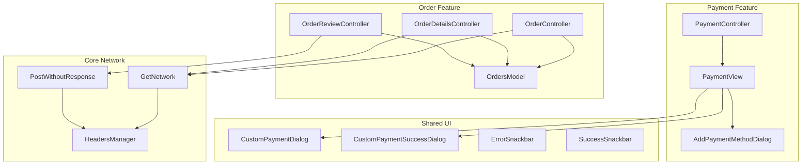
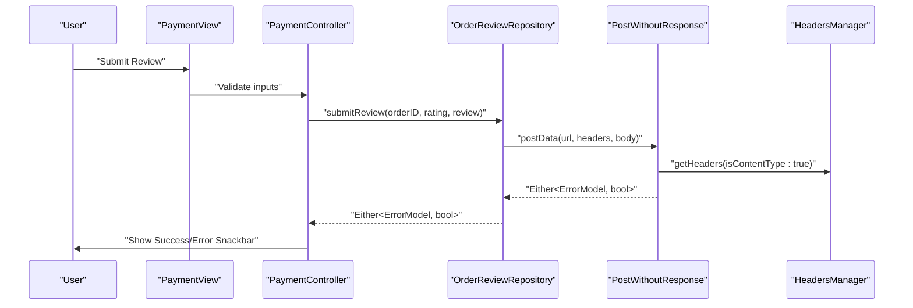
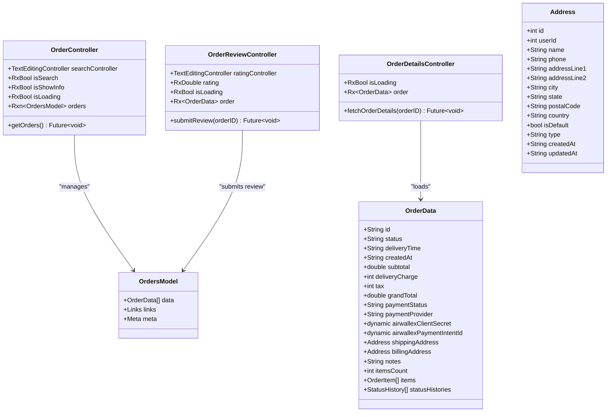
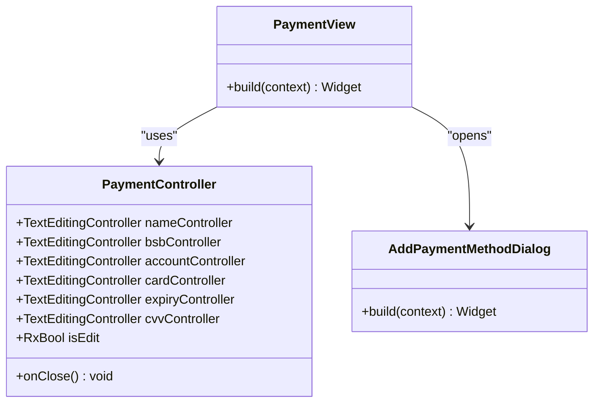
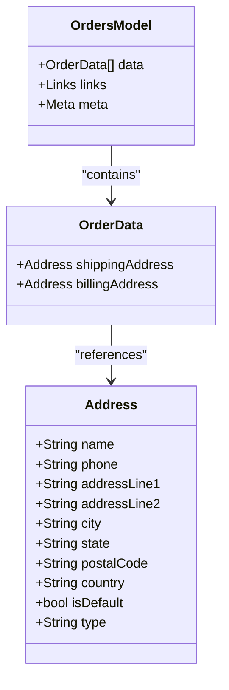
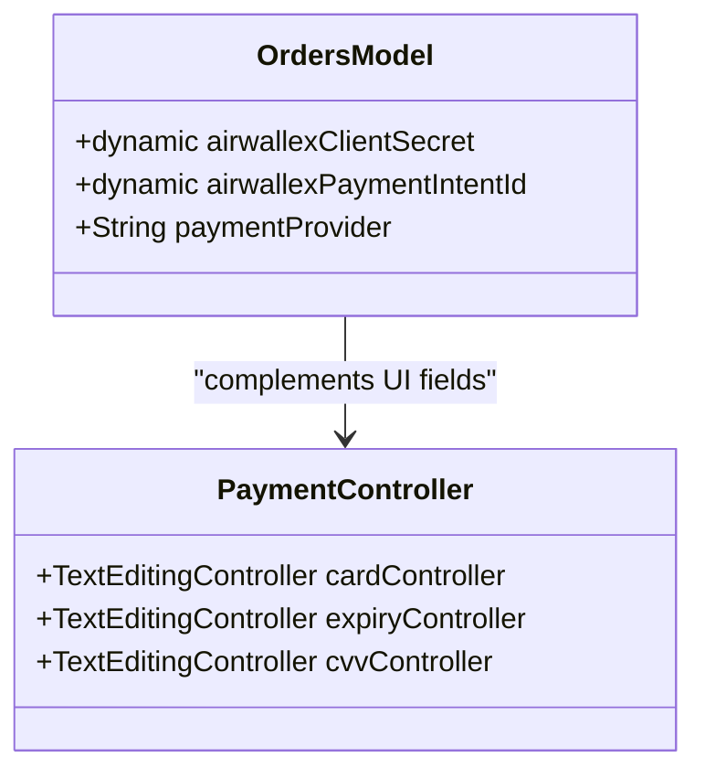
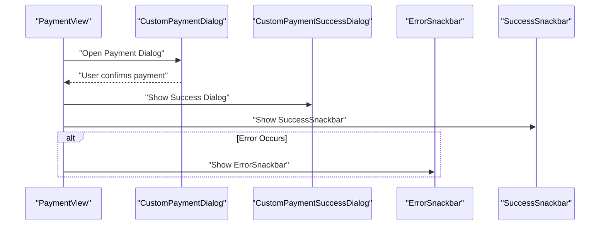
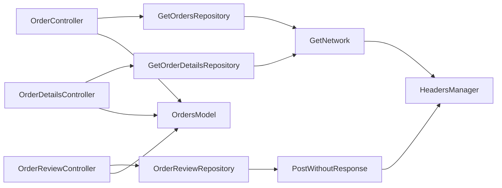

# Checkout Process

<cite>
**Referenced Files in This Document**
- [orders_model.dart](file://lib/features/order/models/orders_model.dart)
- [order_controller.dart](file://lib/features/order/controllers/order_controller.dart)
- [order_details_controller.dart](file://lib/features/order/controllers/order_details_controller.dart)
- [order_review_controller.dart](file://lib/features/order/controllers/order_review_controller.dart)
- [get_orders_repo.dart](file://lib/features/order/repositories/get_orders_repo.dart)
- [get_order_details_repo.dart](file://lib/features/order/repositories/get_order_details_repo.dart)
- [order_review_repo.dart](file://lib/features/order/repositories/order_review_repo.dart)
- [payment_controller.dart](file://lib/features/payment/controller/payment_controller.dart)
- [payment_view.dart](file://lib/features/payment/views/payment_view.dart)
- [add_payment_method_dialog.dart](file://lib/features/payment/widgets/add_payment_method_dialog.dart)
- [custom_payment_dialog.dart](file://lib/shared/widgets/custom_dialog/custom_payment_dialog.dart)
- [custom_payment_success_dialog.dart](file://lib/shared/widgets/custom_dialog/custom_payment_success_dialog.dart)
- [error_snackbar.dart](file://lib/shared/widgets/snackbars/error_snackbar.dart)
- [success_snackbar.dart](file://lib/shared/widgets/snackbars/success_snackbar.dart)
- [get_network.dart](file://lib/core/data/networks/get_network.dart)
- [post_without_response.dart](file://lib/core/data/networks/post_without_response.dart)
- [headers_manager.dart](file://lib/core/data/networks/headers_manager.dart)
- [response.json](file://response.json)
</cite>

## Table of Contents
1. [Introduction](#introduction)
2. [Project Structure](#project-structure)
3. [Core Components](#core-components)
4. [Architecture Overview](#architecture-overview)
5. [Detailed Component Analysis](#detailed-component-analysis)
6. [Dependency Analysis](#dependency-analysis)
7. [Performance Considerations](#performance-considerations)
8. [Troubleshooting Guide](#troubleshooting-guide)
9. [Conclusion](#conclusion)
10. [Appendices](#appendices)

## Introduction
This document provides comprehensive coverage of the checkout workflow and order processing system. It explains the checkout controller implementation, step-by-step checkout flow, and order validation. It also documents address management, payment method handling, and order confirmation processes. The guide details integrations with payment gateways, shipping calculations, and tax processing. Examples of checkout form validation, error handling, and user feedback mechanisms are included. Finally, it covers order creation, payment processing, order status management, security considerations, PCI compliance, payment data protection, and guidance for checkout optimization, conversion rate improvement, and customer experience enhancement.

## Project Structure
The checkout and order processing functionality is primarily implemented under the order and payment feature modules. Supporting infrastructure includes network utilities, headers management, and shared UI components for dialogs and snackbars.



**Diagram sources**
- [order_controller.dart:1-41](file://lib/features/order/controllers/order_controller.dart#L1-L41)
- [order_details_controller.dart:1-31](file://lib/features/order/controllers/order_details_controller.dart#L1-L31)
- [order_review_controller.dart:1-43](file://lib/features/order/controllers/order_review_controller.dart#L1-L43)
- [orders_model.dart:1-491](file://lib/features/order/models/orders_model.dart#L1-L491)
- [payment_controller.dart:1-23](file://lib/features/payment/controller/payment_controller.dart#L1-L23)
- [payment_view.dart](file://lib/features/payment/views/payment_view.dart)
- [add_payment_method_dialog.dart](file://lib/features/payment/widgets/add_payment_method_dialog.dart)
- [custom_payment_dialog.dart](file://lib/shared/widgets/custom_dialog/custom_payment_dialog.dart)
- [custom_payment_success_dialog.dart](file://lib/shared/widgets/custom_dialog/custom_payment_success_dialog.dart)
- [error_snackbar.dart](file://lib/shared/widgets/snackbars/error_snackbar.dart)
- [success_snackbar.dart](file://lib/shared/widgets/snackbars/success_snackbar.dart)
- [get_network.dart](file://lib/core/data/networks/get_network.dart)
- [post_without_response.dart](file://lib/core/data/networks/post_without_response.dart)
- [headers_manager.dart](file://lib/core/data/networks/headers_manager.dart)

**Section sources**
- [order_controller.dart:1-41](file://lib/features/order/controllers/order_controller.dart#L1-L41)
- [order_details_controller.dart:1-31](file://lib/features/order/controllers/order_details_controller.dart#L1-L31)
- [order_review_controller.dart:1-43](file://lib/features/order/controllers/order_review_controller.dart#L1-L43)
- [orders_model.dart:1-491](file://lib/features/order/models/orders_model.dart#L1-L491)
- [payment_controller.dart:1-23](file://lib/features/payment/controller/payment_controller.dart#L1-L23)

## Core Components
This section outlines the primary components involved in checkout and order processing, including controllers, models, repositories, and shared UI elements.

- OrderController: Fetches and manages the list of orders, handles loading states, and displays errors via snackbars.
- OrderDetailsController: Retrieves a specific order by ID and exposes loading and data states.
- OrderReviewController: Submits product reviews with validation and user feedback.
- OrdersModel: Comprehensive model for orders, addresses, items, status history, and payment metadata.
- PaymentController: Manages payment input fields and edit mode for payment methods.
- Shared UI: Dialogs and snackbars for payment confirmation and success notifications.

Key responsibilities:
- Data fetching and error handling through repositories and controllers.
- Model-driven UI rendering with reactive state updates.
- User feedback via snackbars and dialog prompts.

**Section sources**
- [order_controller.dart:1-41](file://lib/features/order/controllers/order_controller.dart#L1-L41)
- [order_details_controller.dart:1-31](file://lib/features/order/controllers/order_details_controller.dart#L1-L31)
- [order_review_controller.dart:1-43](file://lib/features/order/controllers/order_review_controller.dart#L1-L43)
- [orders_model.dart:1-491](file://lib/features/order/models/orders_model.dart#L1-L491)
- [payment_controller.dart:1-23](file://lib/features/payment/controller/payment_controller.dart#L1-L23)

## Architecture Overview
The checkout and order processing architecture follows a layered pattern:
- Presentation Layer: Views and controllers manage UI state and user interactions.
- Domain Layer: Controllers orchestrate business logic and coordinate with repositories.
- Data Layer: Repositories encapsulate network requests and model parsing.
- Infrastructure Layer: Network utilities and headers manager handle HTTP communication.



**Diagram sources**
- [payment_view.dart](file://lib/features/payment/views/payment_view.dart)
- [payment_controller.dart:1-23](file://lib/features/payment/controller/payment_controller.dart#L1-L23)
- [order_review_repo.dart:1-30](file://lib/features/order/repositories/order_review_repo.dart#L1-L30)
- [post_without_response.dart](file://lib/core/data/networks/post_without_response.dart)
- [headers_manager.dart](file://lib/core/data/networks/headers_manager.dart)

## Detailed Component Analysis

### Order Management System
The order management system consists of controllers and repositories that fetch order lists and individual order details, and a model that represents the order data structure.



**Diagram sources**
- [order_controller.dart:1-41](file://lib/features/order/controllers/order_controller.dart#L1-L41)
- [order_details_controller.dart:1-31](file://lib/features/order/controllers/order_details_controller.dart#L1-L31)
- [order_review_controller.dart:1-43](file://lib/features/order/controllers/order_review_controller.dart#L1-L43)
- [orders_model.dart:1-491](file://lib/features/order/models/orders_model.dart#L1-L491)

**Section sources**
- [order_controller.dart:1-41](file://lib/features/order/controllers/order_controller.dart#L1-L41)
- [order_details_controller.dart:1-31](file://lib/features/order/controllers/order_details_controller.dart#L1-L31)
- [order_review_controller.dart:1-43](file://lib/features/order/controllers/order_review_controller.dart#L1-L43)
- [orders_model.dart:1-491](file://lib/features/order/models/orders_model.dart#L1-L491)

### Payment Method Handling
Payment method handling is managed by the PaymentController and integrated with payment-related views and dialogs. The controller maintains input field controllers and edit mode state.



**Diagram sources**
- [payment_controller.dart:1-23](file://lib/features/payment/controller/payment_controller.dart#L1-L23)
- [payment_view.dart](file://lib/features/payment/views/payment_view.dart)
- [add_payment_method_dialog.dart](file://lib/features/payment/widgets/add_payment_method_dialog.dart)

**Section sources**
- [payment_controller.dart:1-23](file://lib/features/payment/controller/payment_controller.dart#L1-L23)

### Order Validation and Submission Flow
Order validation and submission involve client-side checks and server-side posting. The flow ensures that required fields are present and provides user feedback through snackbars.

```mermaid
flowchart TD
Start(["Start Review Submission"]) --> ValidateRating["Validate Rating > 0"]
ValidateRating --> RatingValid{"Rating Valid?"}
RatingValid --> |No| ShowRatingError["Show ErrorSnackbar: Rate a review"]
ShowRatingError --> End
RatingValid --> |Yes| ValidateReview["Validate Review Text Not Empty"]
ValidateReview --> ReviewValid{"Review Valid?"}
ReviewValid --> |No| ShowReviewError["Show ErrorSnackbar: Write a review"]
ShowReviewError --> End
ReviewValid --> |Yes| SetLoading["Set Loading True"]
SetLoading --> Submit["Call OrderReviewRepository.submitReview()"]
Submit --> HandleResponse{"Response Type"}
HandleResponse --> |Left(Error)| ShowServerError["Show ErrorSnackbar: error.message"]
HandleResponse --> |Right(Success)| Back["Get.back()"]
Back --> ShowSuccess["Show SuccessSnackbar: Review submitted successfully"]
ShowServerError --> End
ShowSuccess --> End(["End"])
```

**Diagram sources**
- [order_review_controller.dart:1-43](file://lib/features/order/controllers/order_review_controller.dart#L1-L43)
- [order_review_repo.dart:1-30](file://lib/features/order/repositories/order_review_repo.dart#L1-L30)
- [error_snackbar.dart](file://lib/shared/widgets/snackbars/error_snackbar.dart)
- [success_snackbar.dart](file://lib/shared/widgets/snackbars/success_snackbar.dart)

**Section sources**
- [order_review_controller.dart:1-43](file://lib/features/order/controllers/order_review_controller.dart#L1-L43)
- [order_review_repo.dart:1-30](file://lib/features/order/repositories/order_review_repo.dart#L1-L30)

### Address Management
Address management is represented within the OrdersModel with dedicated Address fields for shipping and billing. The model supports serialization and deserialization for network communication.



**Diagram sources**
- [orders_model.dart:1-491](file://lib/features/order/models/orders_model.dart#L1-L491)

**Section sources**
- [orders_model.dart:141-211](file://lib/features/order/models/orders_model.dart#L141-L211)

### Payment Gateway Integration
Payment gateway integration is indicated by fields in the OrdersModel related to payment intent and client secret. The PaymentController holds input fields for various payment methods, enabling the UI to collect necessary data.



**Diagram sources**
- [orders_model.dart:44-46](file://lib/features/order/models/orders_model.dart#L44-L46)
- [payment_controller.dart:1-23](file://lib/features/payment/controller/payment_controller.dart#L1-L23)

**Section sources**
- [orders_model.dart:44-46](file://lib/features/order/models/orders_model.dart#L44-L46)
- [payment_controller.dart:1-23](file://lib/features/payment/controller/payment_controller.dart#L1-L23)

### Order Confirmation and User Feedback
Order confirmation and user feedback are handled through shared dialog components and snackbars. The system provides success and error notifications to improve user experience.



**Diagram sources**
- [payment_view.dart](file://lib/features/payment/views/payment_view.dart)
- [custom_payment_dialog.dart](file://lib/shared/widgets/custom_dialog/custom_payment_dialog.dart)
- [custom_payment_success_dialog.dart](file://lib/shared/widgets/custom_dialog/custom_payment_success_dialog.dart)
- [error_snackbar.dart](file://lib/shared/widgets/snackbars/error_snackbar.dart)
- [success_snackbar.dart](file://lib/shared/widgets/snackbars/success_snackbar.dart)

**Section sources**
- [payment_view.dart](file://lib/features/payment/views/payment_view.dart)
- [custom_payment_dialog.dart](file://lib/shared/widgets/custom_dialog/custom_payment_dialog.dart)
- [custom_payment_success_dialog.dart](file://lib/shared/widgets/custom_dialog/custom_payment_success_dialog.dart)
- [error_snackbar.dart](file://lib/shared/widgets/snackbars/error_snackbar.dart)
- [success_snackbar.dart](file://lib/shared/widgets/snackbars/success_snackbar.dart)

## Dependency Analysis
The checkout and order processing system exhibits clear separation of concerns:
- Controllers depend on repositories for data access.
- Repositories depend on network utilities and headers manager.
- Models encapsulate data structures for serialization.
- Shared UI components provide reusable feedback mechanisms.



**Diagram sources**
- [order_controller.dart:1-41](file://lib/features/order/controllers/order_controller.dart#L1-L41)
- [order_details_controller.dart:1-31](file://lib/features/order/controllers/order_details_controller.dart#L1-L31)
- [order_review_controller.dart:1-43](file://lib/features/order/controllers/order_review_controller.dart#L1-L43)
- [get_orders_repo.dart:1-20](file://lib/features/order/repositories/get_orders_repo.dart#L1-L20)
- [get_order_details_repo.dart:1-23](file://lib/features/order/repositories/get_order_details_repo.dart#L1-L23)
- [order_review_repo.dart:1-30](file://lib/features/order/repositories/order_review_repo.dart#L1-L30)
- [get_network.dart](file://lib/core/data/networks/get_network.dart)
- [post_without_response.dart](file://lib/core/data/networks/post_without_response.dart)
- [headers_manager.dart](file://lib/core/data/networks/headers_manager.dart)
- [orders_model.dart:1-491](file://lib/features/order/models/orders_model.dart#L1-L491)

**Section sources**
- [get_orders_repo.dart:1-20](file://lib/features/order/repositories/get_orders_repo.dart#L1-L20)
- [get_order_details_repo.dart:1-23](file://lib/features/order/repositories/get_order_details_repo.dart#L1-L23)
- [order_review_repo.dart:1-30](file://lib/features/order/repositories/order_review_repo.dart#L1-L30)
- [get_network.dart](file://lib/core/data/networks/get_network.dart)
- [post_without_response.dart](file://lib/core/data/networks/post_without_response.dart)
- [headers_manager.dart](file://lib/core/data/networks/headers_manager.dart)

## Performance Considerations
- Minimize unnecessary re-renders by using reactive state (GetX) effectively.
- Debounce search inputs to reduce network calls during filtering.
- Cache frequently accessed order data locally to improve perceived performance.
- Optimize image loading for product thumbnails in order items.
- Use pagination and lazy loading for long order lists.
- Compress payloads and avoid redundant data transmission.

## Troubleshooting Guide
Common issues and resolutions:
- Network failures: Verify headers and authentication tokens via HeadersManager.
- Parsing errors: Ensure JSON keys match model expectations; check OrdersModel mappings.
- UI freezes: Confirm that loading states are toggled appropriately in controllers.
- Payment errors: Validate input fields using PaymentController and show appropriate snackbars.

**Section sources**
- [error_snackbar.dart](file://lib/shared/widgets/snackbars/error_snackbar.dart)
- [success_snackbar.dart](file://lib/shared/widgets/snackbars/success_snackbar.dart)
- [headers_manager.dart](file://lib/core/data/networks/headers_manager.dart)
- [orders_model.dart:1-491](file://lib/features/order/models/orders_model.dart#L1-L491)

## Conclusion
The checkout and order processing system leverages a clean layered architecture with reactive controllers, robust models, and reusable UI components. It supports order retrieval, detailed viewing, review submission, and payment method management. The system emphasizes user feedback through snackbars and dialogs, and integrates with payment gateways via model fields. Security and performance considerations are addressed through proper state management and network abstraction.

## Appendices
- Example network responses: See [response.json](file://response.json) for reference payload structures.
- Additional UI components: Review shared widgets for consistent UX patterns.