# E-commerce Platform

<cite>
**Referenced Files in This Document**
- [main.dart](file://lib/main.dart)
- [app_routes.dart](file://lib/core/routes/app_routes.dart)
- [routes.dart](file://lib/core/routes/routes.dart)
- [dependency_injection.dart](file://lib/core/di/dependency_injection.dart)
- [category_controller.dart](file://lib/features/category/controller/category_controller.dart)
- [home_controller.dart](file://lib/features/home/controller/home_controller.dart)
- [order_controller.dart](file://lib/features/order/controllers/order_controller.dart)
- [payment_controller.dart](file://lib/features/payment/controller/payment_controller.dart)
- [product_details_controller.dart](file://lib/features/product_details.dart/controller/product_details_controller.dart)
- [storage_service.dart](file://lib/core/data/local/storage_service.dart)
- [theme_controller.dart](file://lib/core/theme/theme_controller.dart)
- [pubspec.yaml](file://pubspec.yaml)
- [README.md](file://README.md)
</cite>

## Table of Contents
1. [Introduction](#introduction)
2. [Project Structure](#project-structure)
3. [Core Components](#core-components)
4. [Architecture Overview](#architecture-overview)
5. [Detailed Component Analysis](#detailed-component-analysis)
6. [Dependency Analysis](#dependency-analysis)
7. [Performance Considerations](#performance-considerations)
8. [Troubleshooting Guide](#troubleshooting-guide)
9. [Conclusion](#conclusion)
10. [Appendices](#appendices)

## Introduction
This document describes the e-commerce shopping functionality for ZB-DEZINE, focusing on the current implementation present in the repository. It covers product catalog management foundations, category organization, product browsing and search, shopping cart and checkout scaffolding, payment integration controls, product details presentation, and order processing workflows. It also outlines integration patterns with external systems, error handling mechanisms, and performance optimization strategies for large catalogs.

## Project Structure
The application follows a modular structure with feature-based directories under lib/features, a core module for infrastructure (routing, DI, networking, theming), and shared widgets and utilities. The entry point initializes dependency injection, sets up routing, and configures themes.

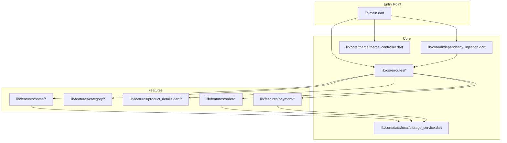

**Diagram sources**
- [main.dart:12-46](file://lib/main.dart#L12-L46)
- [dependency_injection.dart](file://lib/core/di/dependency_injection.dart)
- [app_routes.dart](file://lib/core/routes/app_routes.dart)
- [routes.dart](file://lib/core/routes/routes.dart)
- [theme_controller.dart](file://lib/core/theme/theme_controller.dart)
- [storage_service.dart](file://lib/core/data/local/storage_service.dart)

**Section sources**
- [main.dart:12-46](file://lib/main.dart#L12-L46)
- [pubspec.yaml:30-70](file://pubspec.yaml#L30-L70)

## Core Components
- Dependency Injection: Initializes and provides services across the app.
- Routing: Centralized route definitions and navigation setup.
- Theme Management: Global theme selection and switching.
- Local Storage: Persistent storage for tokens and preferences.
- Controllers: Feature controllers for Home, Category, Product Details, Orders, and Payments.

**Section sources**
- [dependency_injection.dart](file://lib/core/di/dependency_injection.dart)
- [app_routes.dart](file://lib/core/routes/app_routes.dart)
- [routes.dart](file://lib/core/routes/routes.dart)
- [theme_controller.dart](file://lib/core/theme/theme_controller.dart)
- [storage_service.dart](file://lib/core/data/local/storage_service.dart)
- [home_controller.dart:1-15](file://lib/features/home/controller/home_controller.dart#L1-L15)
- [category_controller.dart:1-5](file://lib/features/category/controller/category_controller.dart#L1-L5)
- [product_details_controller.dart:1-36](file://lib/features/product_details.dart/controller/product_details_controller.dart#L1-L36)
- [order_controller.dart:1-41](file://lib/features/order/controllers/order_controller.dart#L1-L41)
- [payment_controller.dart:1-23](file://lib/features/payment/controller/payment_controller.dart#L1-L23)

## Architecture Overview
The app uses a layered architecture:
- Presentation Layer: Feature views and controllers using GetX for state and navigation.
- Domain Layer: Feature controllers orchestrate UI logic and coordinate with repositories/services.
- Infrastructure Layer: Core modules handle routing, dependency injection, theming, and local storage.

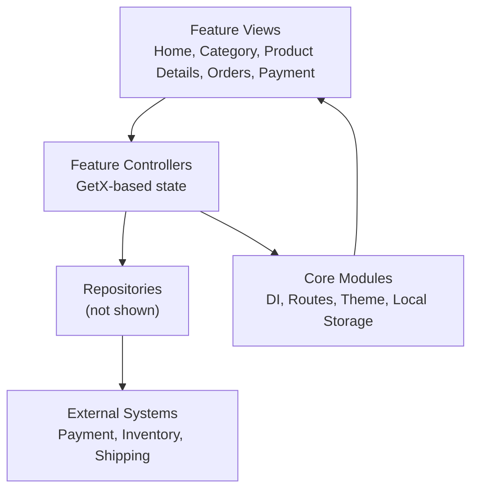

[No sources needed since this diagram shows conceptual architecture, not a direct code mapping]

## Detailed Component Analysis

### Product Catalog Management System
- Current state: Category feature exists but lacks product listings and catalog models.
- Recommended implementation pattern:
  - Define a product model with identifiers, pricing, inventory, and metadata.
  - Create a repository to fetch paginated product lists from backend APIs.
  - Implement a controller to manage filters (price range, category), sorting (price asc/desc, rating), and search queries.
  - Use caching and pagination to optimize performance for large catalogs.

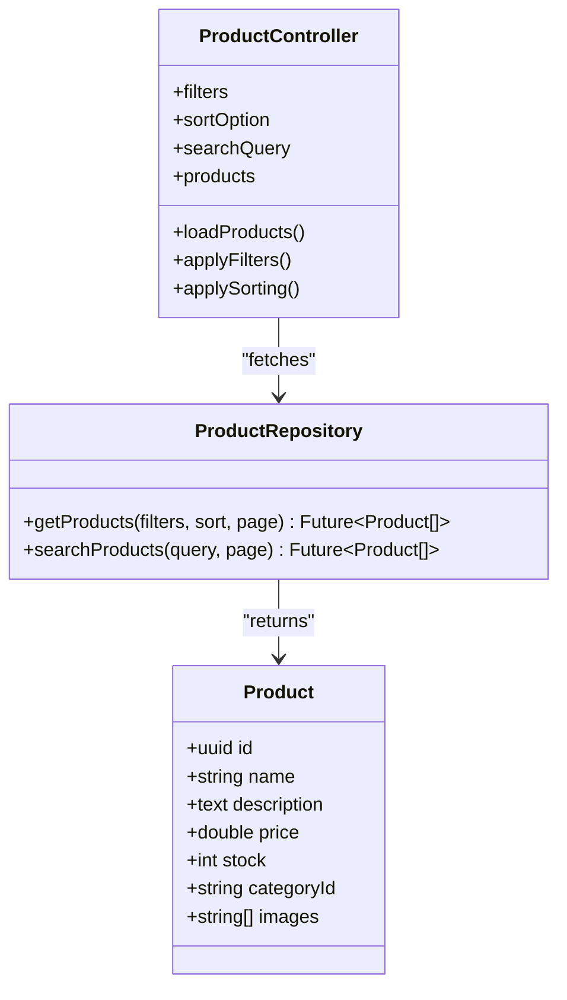

[No sources needed since this diagram shows conceptual implementation patterns]

### Category Organization
- Current state: CategoryController exists but is empty.
- Recommended implementation pattern:
  - Define a Category model with hierarchy support (parent-child).
  - Implement a CategoryRepository to load categories and nested structures.
  - Build a CategoryController to expose category lists and selected category context.

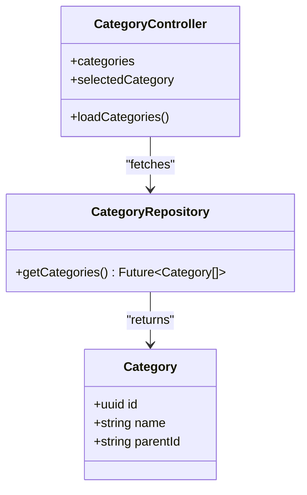

[No sources needed since this diagram shows conceptual implementation patterns]

### Product Browsing and Search
- Current state: HomeController exposes a search controller and carousel slider controller for product details.
- Recommended implementation pattern:
  - Integrate search with debouncing to reduce network calls.
  - Support filters (price, rating, availability) and sorting options.
  - Implement infinite scroll or pagination for product grids.

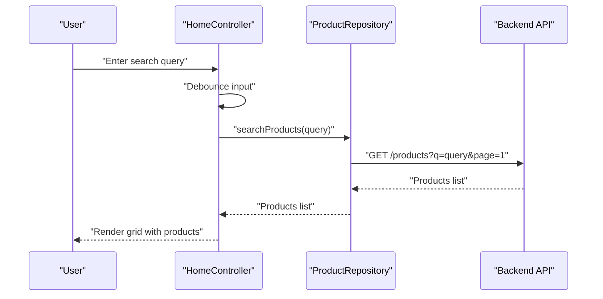

[No sources needed since this diagram shows conceptual workflow]

### Shopping Cart Functionality
- Current state: No cart-related files found in the repository.
- Recommended implementation pattern:
  - Define a CartItem model linking product ID, quantity, and selected options.
  - Implement a CartRepository to persist items locally and sync with backend.
  - Create a CartController to manage add/remove/update item quantities, totals, and coupons.

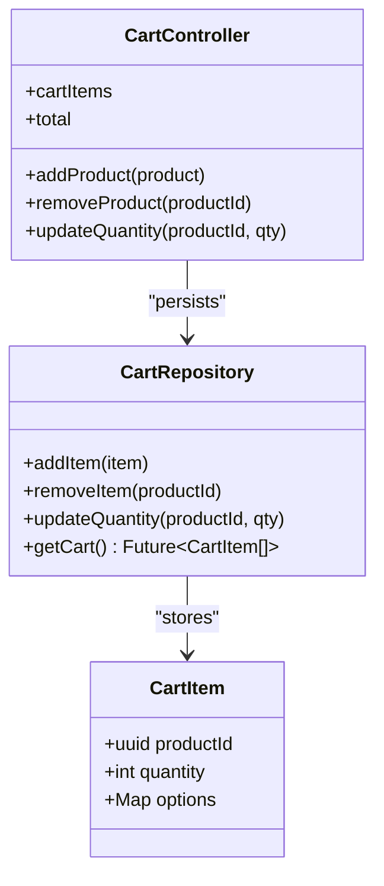

[No sources needed since this diagram shows conceptual implementation patterns]

### Checkout Process and Payment Integration
- Current state: PaymentController holds form fields for card details and edit mode.
- Recommended implementation pattern:
  - Use PaymentController to collect and validate payment details.
  - Integrate with a payment gateway SDK via a PaymentService.
  - Persist transactions and show success/failure dialogs.

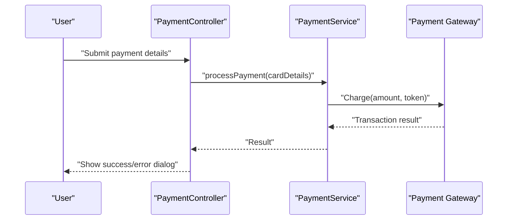

[No sources needed since this diagram shows conceptual workflow]

### Product Details View
- Current state: ProductDetailsController manages carousel navigation and placeholder images.
- Recommended implementation pattern:
  - Load product details via a ProductDetailsRepository.
  - Render images, descriptions, ratings, and add-to-cart actions.
  - Integrate AI preview toggle and related recommendations.

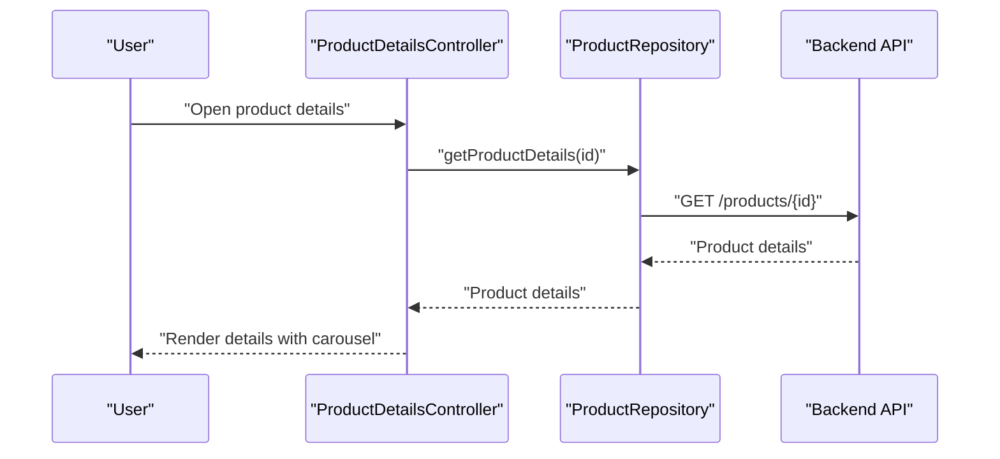

**Diagram sources**
- [product_details_controller.dart:1-36](file://lib/features/product_details.dart/controller/product_details_controller.dart#L1-L36)

**Section sources**
- [product_details_controller.dart:1-36](file://lib/features/product_details.dart/controller/product_details_controller.dart#L1-L36)

### Inventory Management and Pricing Systems
- Current state: No dedicated inventory or pricing models found.
- Recommended implementation pattern:
  - Track stock per product and variant.
  - Enforce availability during add-to-cart and checkout.
  - Apply dynamic pricing rules (promotions, bulk discounts).

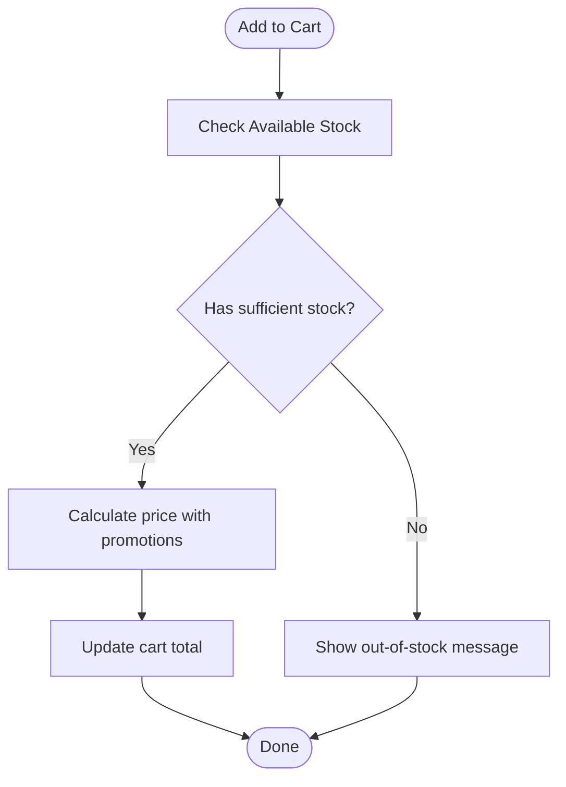

[No sources needed since this diagram shows conceptual workflow]

### Order Processing Workflows and Purchase History
- Current state: OrderController fetches orders and displays them with loading and error handling.
- Recommended implementation pattern:
  - Fetch orders via GetOrdersRepository.
  - Present order list with status, items, and actions (track, rate, reorder).
  - Provide search/filter within order history.

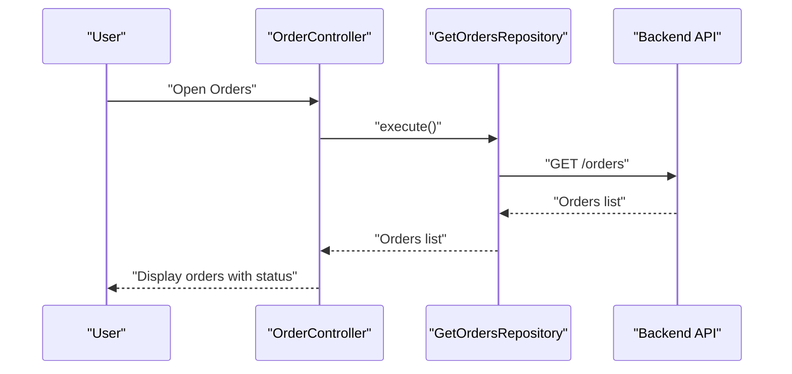

**Diagram sources**
- [order_controller.dart:16-27](file://lib/features/order/controllers/order_controller.dart#L16-L27)

**Section sources**
- [order_controller.dart:1-41](file://lib/features/order/controllers/order_controller.dart#L1-L41)

### Integration Patterns
- Payment Gateways: Use a service abstraction to integrate with Stripe/PayPal SDKs.
- Shipping Services: Integrate with shipping providers via APIs; cache rates and delivery estimates.
- Inventory Systems: Sync stock levels via webhooks or periodic polling.

[No sources needed since this section provides general guidance]

### Examples of Filtering, Sorting, and Recommendations
- Filtering: Price range, category, brand, rating.
- Sorting: Price low-high/high-low, newest, top-rated.
- Recommendations: Collaborative filtering or product affinity scoring.

[No sources needed since this section provides general guidance]

## Dependency Analysis
The project relies on Flutter and several community packages for UI, state management, networking, and utilities. Dependency Injection wires core services and routes the app.

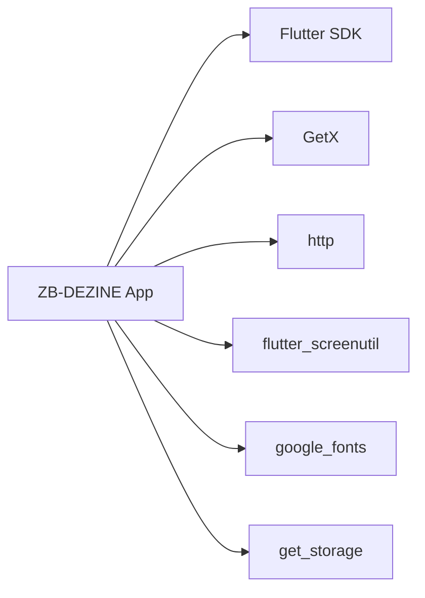

**Diagram sources**
- [pubspec.yaml:30-70](file://pubspec.yaml#L30-L70)

**Section sources**
- [pubspec.yaml:30-70](file://pubspec.yaml#L30-L70)

## Performance Considerations
- Lazy loading and pagination for product grids.
- Debounce search input to minimize network requests.
- Image caching and placeholders for product thumbnails.
- Local caching for frequently accessed data (categories, recent orders).
- Efficient state updates with reactive controllers.

[No sources needed since this section provides general guidance]

## Troubleshooting Guide
- Token initialization: Verify token retrieval in main and route accordingly.
- Route resolution: Ensure routes are registered and initial route matches token presence.
- Error handling: Use error snackbars for repository failures.
- Lifecycle: Dispose of controllers and text editing controllers properly.

**Section sources**
- [main.dart:12-46](file://lib/main.dart#L12-L46)
- [order_controller.dart:19-26](file://lib/features/order/controllers/order_controller.dart#L19-L26)
- [payment_controller.dart:13-21](file://lib/features/payment/controller/payment_controller.dart#L13-L21)

## Conclusion
ZB-DEZINE currently provides foundational modules for routing, dependency injection, theming, and local storage, along with feature controllers for Home, Category, Product Details, Orders, and Payments. The shopping cart, inventory, and advanced search/filtering are not yet implemented and represent the primary extension points for building a full e-commerce platform. By following the recommended patterns and leveraging the existing core infrastructure, teams can implement robust catalog management, checkout, and order workflows.

## Appendices
- Getting Started: Refer to the project’s README for Flutter setup and development guidance.

**Section sources**
- [README.md:1-17](file://README.md#L1-L17)