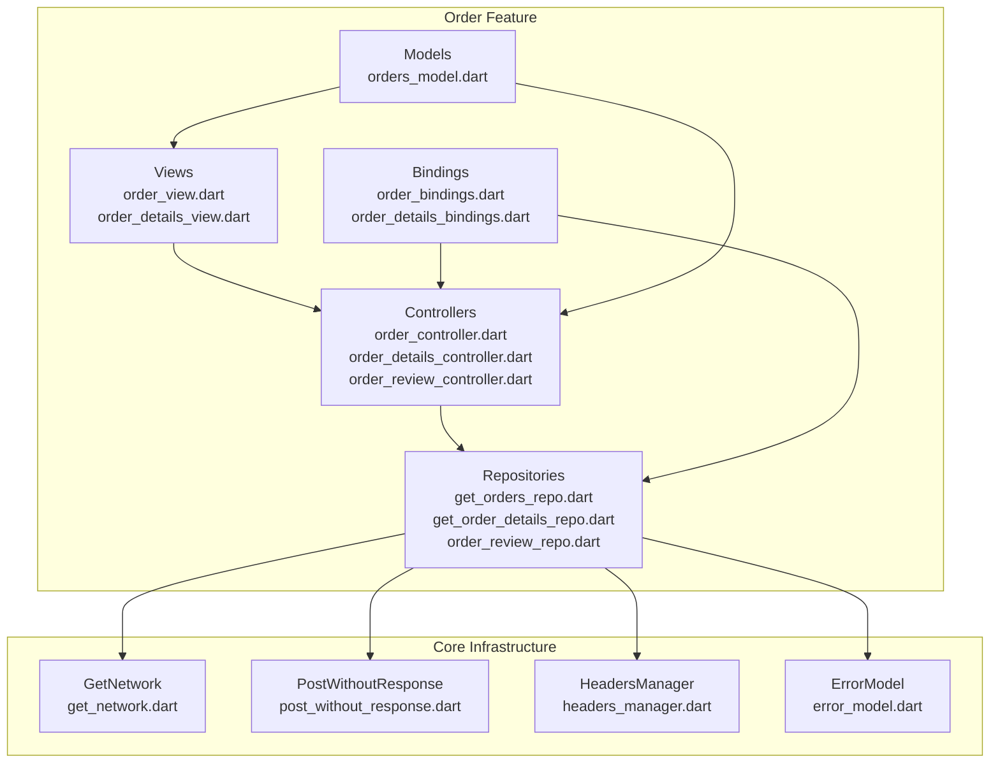
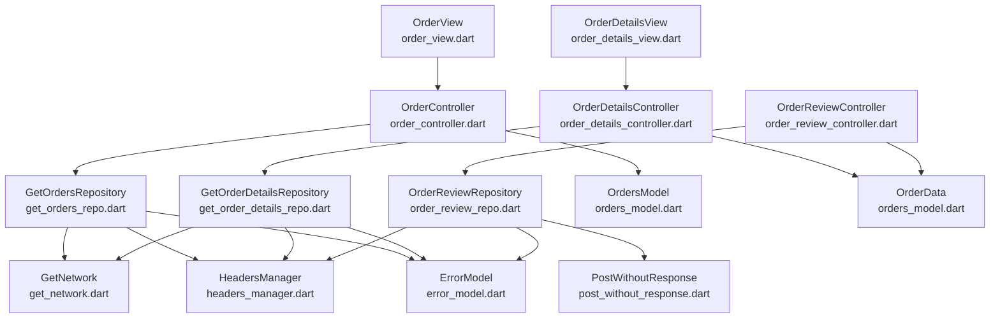
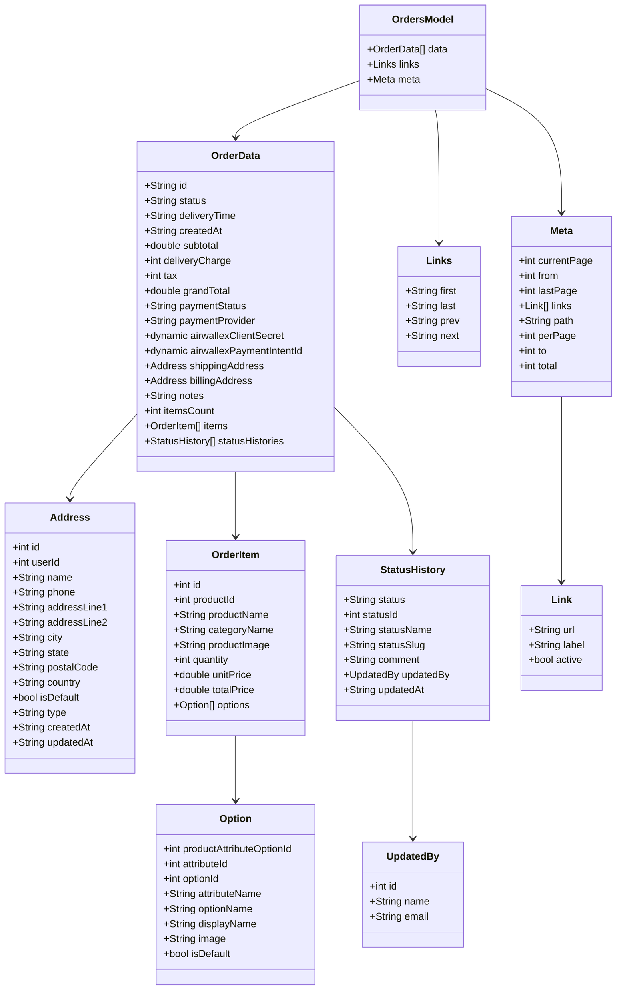
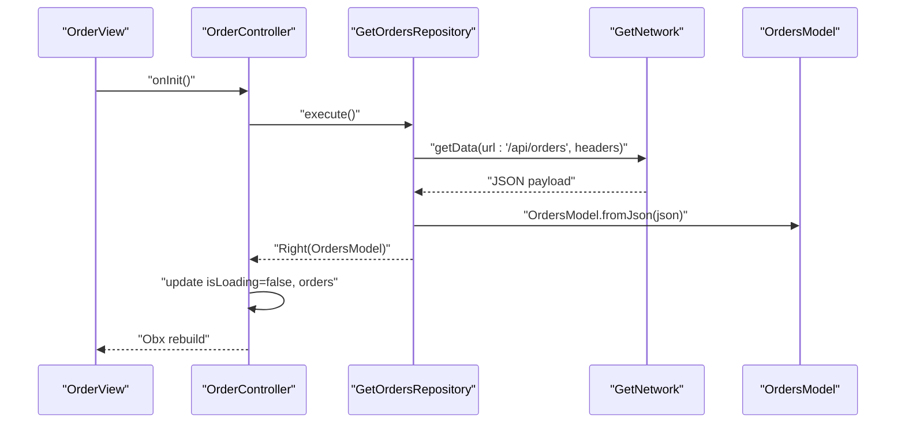
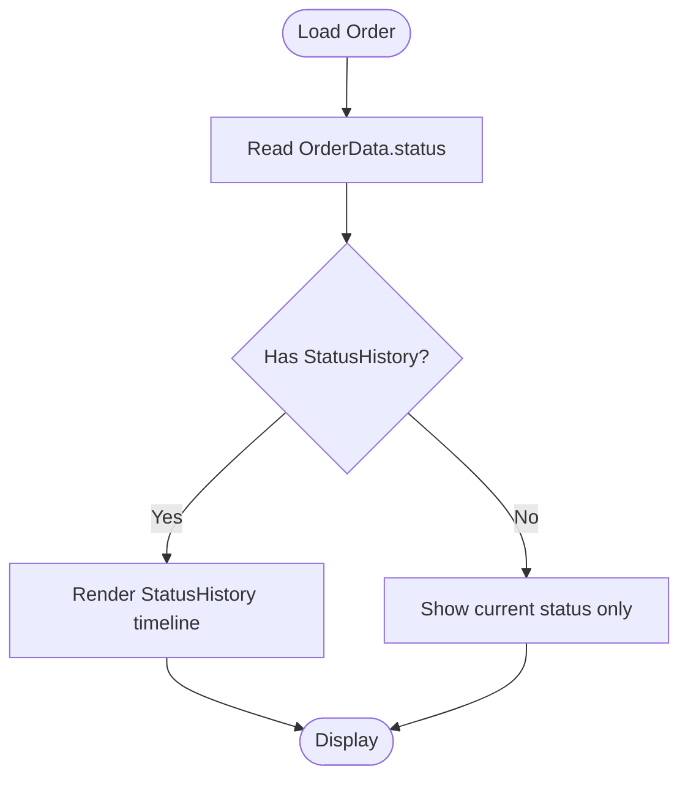
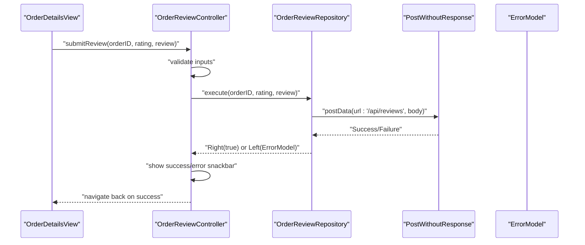
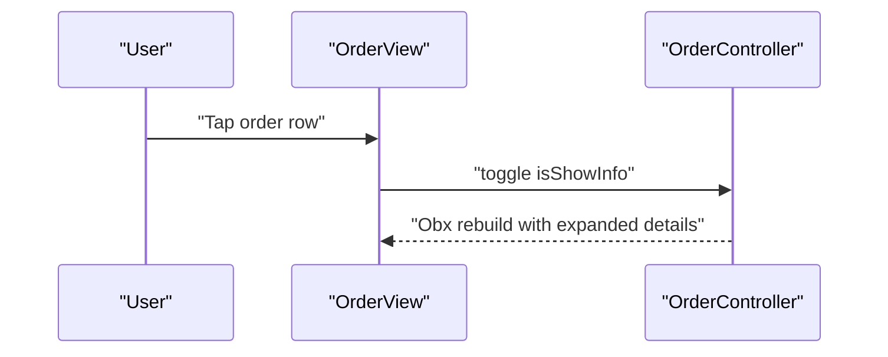
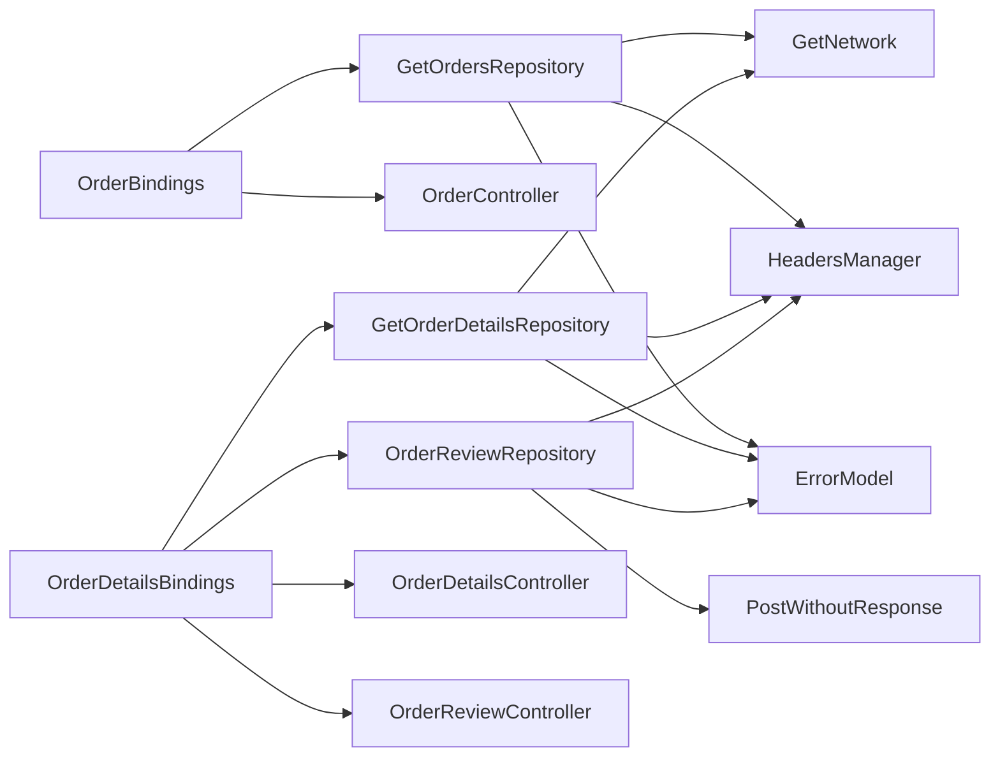

# Order Management

<cite>
**Referenced Files in This Document**
- [orders_model.dart](file://lib/features/order/models/orders_model.dart)
- [order_controller.dart](file://lib/features/order/controllers/order_controller.dart)
- [order_details_controller.dart](file://lib/features/order/controllers/order_details_controller.dart)
- [order_review_controller.dart](file://lib/features/order/controllers/order_review_controller.dart)
- [get_orders_repo.dart](file://lib/features/order/repositories/get_orders_repo.dart)
- [get_order_details_repo.dart](file://lib/features/order/repositories/get_order_details_repo.dart)
- [order_review_repo.dart](file://lib/features/order/repositories/order_review_repo.dart)
- [order_bindings.dart](file://lib/features/order/bindings/order_bindings.dart)
- [order_details_bindings.dart](file://lib/features/order/bindings/order_details_bindings.dart)
- [order_view.dart](file://lib/features/order/views/order_view.dart)
- [order_details_view.dart](file://lib/features/order/views/order_details_view.dart)
- [get_network.dart](file://lib/core/data/networks/get_network.dart)
- [post_without_response.dart](file://lib/core/data/networks/post_without_response.dart)
- [headers_manager.dart](file://lib/core/data/networks/headers_manager.dart)
- [error_model.dart](file://lib/core/data/global_models/error_model.dart)
</cite>

## Table of Contents
1. [Introduction](#introduction)
2. [Project Structure](#project-structure)
3. [Core Components](#core-components)
4. [Architecture Overview](#architecture-overview)
5. [Detailed Component Analysis](#detailed-component-analysis)
6. [Dependency Analysis](#dependency-analysis)
7. [Performance Considerations](#performance-considerations)
8. [Troubleshooting Guide](#troubleshooting-guide)
9. [Conclusion](#conclusion)
10. [Appendices](#appendices)

## Introduction
This document provides comprehensive documentation for the order management system. It covers order lifecycle management, order status tracking, order history functionality, order data models, order item management, and order state transitions. It also documents order retrieval, filtering, and pagination, along with examples of order status updates, customer notifications, and order modification processes. Guidance is included for order analytics, sales reporting, and order fulfillment integration, as well as integration points with inventory systems, shipping providers, and payment processors. Finally, it offers recommendations for order processing optimization, error handling, and customer service workflows.

## Project Structure
The order management feature is organized into distinct layers:
- Models define the data structures for orders, items, addresses, status history, and pagination metadata.
- Controllers manage UI state and orchestrate data fetching and user actions.
- Repositories encapsulate network requests and data transformations.
- Views render order lists and details, and integrate with controllers.
- Bindings configure dependency injection for controllers and repositories.

**Diagram sources**
- [orders_model.dart:1-491](file://lib/features/order/models/orders_model.dart#L1-L491)
- [order_controller.dart:1-41](file://lib/features/order/controllers/order_controller.dart#L1-L41)
- [order_details_controller.dart:1-31](file://lib/features/order/controllers/order_details_controller.dart#L1-L31)
- [order_review_controller.dart:1-43](file://lib/features/order/controllers/order_review_controller.dart#L1-L43)
- [get_orders_repo.dart:1-20](file://lib/features/order/repositories/get_orders_repo.dart#L1-L20)
- [get_order_details_repo.dart:1-23](file://lib/features/order/repositories/get_order_details_repo.dart#L1-L23)
- [order_review_repo.dart:1-30](file://lib/features/order/repositories/order_review_repo.dart#L1-L30)
- [order_view.dart:1-100](file://lib/features/order/views/order_view.dart#L1-L100)
- [order_details_view.dart:1-61](file://lib/features/order/views/order_details_view.dart#L1-L61)
- [order_bindings.dart:1-12](file://lib/features/order/bindings/order_bindings.dart#L1-L12)
- [order_details_bindings.dart:1-18](file://lib/features/order/bindings/order_details_bindings.dart#L1-L18)
- [get_network.dart](file://lib/core/data/networks/get_network.dart)
- [post_without_response.dart](file://lib/core/data/networks/post_without_response.dart)
- [headers_manager.dart](file://lib/core/data/networks/headers_manager.dart)
- [error_model.dart](file://lib/core/data/global_models/error_model.dart)

**Section sources**
- [order_bindings.dart:1-12](file://lib/features/order/bindings/order_bindings.dart#L1-L12)
- [order_details_bindings.dart:1-18](file://lib/features/order/bindings/order_details_bindings.dart#L1-L18)

## Core Components
This section outlines the primary components involved in order management, focusing on data models, controllers, repositories, and views.

- Data Models
  - OrdersModel: Top-level container for orders list with pagination metadata and links.
  - OrderData: Individual order entity including identifiers, pricing, addresses, items, status histories, and payment metadata.
  - Address: Shipping and billing address representation.
  - OrderItem: Product line item with options and pricing.
  - Option: Attribute-option pairs for items.
  - StatusHistory: Historical status entries with timestamps and updated-by information.
  - Pagination Models: Links and Meta for pagination and navigation.

- Controllers
  - OrderController: Fetches and manages the list of orders, handles loading states, and exposes search-related UI state.
  - OrderDetailsController: Loads a single order by ID and manages loading state.
  - OrderReviewController: Submits product reviews for orders with validation and feedback.

- Repositories
  - GetOrdersRepository: Retrieves paginated orders via GET endpoint.
  - GetOrderDetailsRepository: Retrieves a single order by ID via GET endpoint.
  - OrderReviewRepository: Posts a review for an order via POST endpoint.

- Views
  - OrderView: Renders a list of orders with expandable details, status, and action buttons.
  - OrderDetailsView: Displays detailed order information and status timeline.

**Section sources**
- [orders_model.dart:1-491](file://lib/features/order/models/orders_model.dart#L1-L491)
- [order_controller.dart:1-41](file://lib/features/order/controllers/order_controller.dart#L1-L41)
- [order_details_controller.dart:1-31](file://lib/features/order/controllers/order_details_controller.dart#L1-L31)
- [order_review_controller.dart:1-43](file://lib/features/order/controllers/order_review_controller.dart#L1-L43)
- [get_orders_repo.dart:1-20](file://lib/features/order/repositories/get_orders_repo.dart#L1-L20)
- [get_order_details_repo.dart:1-23](file://lib/features/order/repositories/get_order_details_repo.dart#L1-L23)
- [order_review_repo.dart:1-30](file://lib/features/order/repositories/order_review_repo.dart#L1-L30)
- [order_view.dart:1-100](file://lib/features/order/views/order_view.dart#L1-L100)
- [order_details_view.dart:1-61](file://lib/features/order/views/order_details_view.dart#L1-L61)

## Architecture Overview
The order management system follows a layered architecture:
- Presentation Layer: Views and controllers handle UI rendering and user interactions.
- Domain Layer: Models represent domain entities and their relationships.
- Data Layer: Repositories encapsulate network operations and data mapping.
- Infrastructure Layer: Network clients, headers manager, and error model support cross-cutting concerns.

**Diagram sources**
- [order_view.dart:1-100](file://lib/features/order/views/order_view.dart#L1-L100)
- [order_details_view.dart:1-61](file://lib/features/order/views/order_details_view.dart#L1-L61)
- [order_controller.dart:1-41](file://lib/features/order/controllers/order_controller.dart#L1-L41)
- [order_details_controller.dart:1-31](file://lib/features/order/controllers/order_details_controller.dart#L1-L31)
- [order_review_controller.dart:1-43](file://lib/features/order/controllers/order_review_controller.dart#L1-L43)
- [get_orders_repo.dart:1-20](file://lib/features/order/repositories/get_orders_repo.dart#L1-L20)
- [get_order_details_repo.dart:1-23](file://lib/features/order/repositories/get_order_details_repo.dart#L1-L23)
- [order_review_repo.dart:1-30](file://lib/features/order/repositories/order_review_repo.dart#L1-L30)
- [orders_model.dart:1-491](file://lib/features/order/models/orders_model.dart#L1-L491)
- [get_network.dart](file://lib/core/data/networks/get_network.dart)
- [post_without_response.dart](file://lib/core/data/networks/post_without_response.dart)
- [headers_manager.dart](file://lib/core/data/networks/headers_manager.dart)
- [error_model.dart](file://lib/core/data/global_models/error_model.dart)

## Detailed Component Analysis

### Data Models: Order Lifecycle and State Tracking
The order data model supports lifecycle tracking through:
- OrderData: Contains current status, creation timestamp, pricing breakdown, payment metadata, and shipping/billing addresses.
- StatusHistory: Records historical status transitions with comments and timestamps.
- Pagination Models (Links, Meta): Enable filtered and paginated retrieval of orders.

**Diagram sources**
- [orders_model.dart:1-491](file://lib/features/order/models/orders_model.dart#L1-L491)

**Section sources**
- [orders_model.dart:1-491](file://lib/features/order/models/orders_model.dart#L1-L491)

### Order Retrieval, Filtering, and Pagination
Order retrieval is implemented via repositories that call network clients:
- GetOrdersRepository: Fetches paginated orders using GET with headers and maps JSON to OrdersModel.
- GetOrderDetailsRepository: Fetches a single order by ID using GET and maps nested JSON to OrderData.
- Pagination metadata (Meta, Links) enables client-side navigation and filtering.

**Diagram sources**
- [order_view.dart:1-100](file://lib/features/order/views/order_view.dart#L1-L100)
- [order_controller.dart:1-41](file://lib/features/order/controllers/order_controller.dart#L1-L41)
- [get_orders_repo.dart:1-20](file://lib/features/order/repositories/get_orders_repo.dart#L1-L20)
- [get_network.dart](file://lib/core/data/networks/get_network.dart)
- [orders_model.dart:1-491](file://lib/features/order/models/orders_model.dart#L1-L491)

**Section sources**
- [get_orders_repo.dart:1-20](file://lib/features/order/repositories/get_orders_repo.dart#L1-L20)
- [get_order_details_repo.dart:1-23](file://lib/features/order/repositories/get_order_details_repo.dart#L1-L23)
- [orders_model.dart:420-491](file://lib/features/order/models/orders_model.dart#L420-L491)

### Order Status Tracking and History
Order status tracking is supported by:
- OrderData.status: Current order status.
- StatusHistory: Ordered list of status transitions with timestamps and optional comments.
- UI rendering in OrderView and OrderDetailsView displays status and item details.

**Diagram sources**
- [orders_model.dart:325-371](file://lib/features/order/models/orders_model.dart#L325-L371)
- [order_view.dart:1-100](file://lib/features/order/views/order_view.dart#L1-L100)
- [order_details_view.dart:1-61](file://lib/features/order/views/order_details_view.dart#L1-L61)

**Section sources**
- [orders_model.dart:325-371](file://lib/features/order/models/orders_model.dart#L325-L371)

### Order Modification and Reviews
Review submission is handled by:
- OrderReviewController: Validates rating and review content, toggles loading state, and shows feedback.
- OrderReviewRepository: Posts review data to the backend with proper headers.

**Diagram sources**
- [order_review_controller.dart:1-43](file://lib/features/order/controllers/order_review_controller.dart#L1-L43)
- [order_review_repo.dart:1-30](file://lib/features/order/repositories/order_review_repo.dart#L1-L30)
- [post_without_response.dart](file://lib/core/data/networks/post_without_response.dart)
- [error_model.dart](file://lib/core/data/global_models/error_model.dart)

**Section sources**
- [order_review_controller.dart:1-43](file://lib/features/order/controllers/order_review_controller.dart#L1-L43)
- [order_review_repo.dart:1-30](file://lib/features/order/repositories/order_review_repo.dart#L1-L30)

### Customer Notifications and UI Interactions
- OrderView: Toggles expanded order details, renders items and status, and provides action buttons.
- OrderDetailsView: Displays order details and status timeline.
- Error and success snackbars provide user feedback during operations.

**Diagram sources**
- [order_view.dart:1-100](file://lib/features/order/views/order_view.dart#L1-L100)
- [order_controller.dart:1-41](file://lib/features/order/controllers/order_controller.dart#L1-L41)

**Section sources**
- [order_view.dart:1-100](file://lib/features/order/views/order_view.dart#L1-L100)
- [order_details_view.dart:1-61](file://lib/features/order/views/order_details_view.dart#L1-L61)

### Order Analytics, Sales Reporting, and Fulfillment Integration
- Pricing and totals: subtotal, deliveryCharge, tax, and grandTotal enable financial reporting.
- Payment metadata: paymentStatus, paymentProvider, and payment intent identifiers support reconciliation.
- StatusHistory provides audit trails for fulfillment tracking.
- Integration points:
  - Inventory systems: OrderItem.productId and options inform stock adjustments.
  - Shipping providers: Address and deliveryTime support shipping workflows.
  - Payment processors: Payment metadata integrates with payment gateways.

[No sources needed since this section provides conceptual guidance]

### Order Processing Optimization
- Minimize unnecessary re-renders by leveraging reactive state (GetX).
- Cache frequently accessed order lists and details to reduce network calls.
- Paginate and filter efficiently using server-provided Links and Meta.
- Validate inputs early in controllers to avoid redundant network requests.

[No sources needed since this section provides general guidance]

## Dependency Analysis
The order feature relies on a clean separation of concerns with dependency injection configured via bindings.

**Diagram sources**
- [order_bindings.dart:1-12](file://lib/features/order/bindings/order_bindings.dart#L1-L12)
- [order_details_bindings.dart:1-18](file://lib/features/order/bindings/order_details_bindings.dart#L1-L18)
- [get_orders_repo.dart:1-20](file://lib/features/order/repositories/get_orders_repo.dart#L1-L20)
- [get_order_details_repo.dart:1-23](file://lib/features/order/repositories/get_order_details_repo.dart#L1-L23)
- [order_review_repo.dart:1-30](file://lib/features/order/repositories/order_review_repo.dart#L1-L30)
- [get_network.dart](file://lib/core/data/networks/get_network.dart)
- [post_without_response.dart](file://lib/core/data/networks/post_without_response.dart)
- [headers_manager.dart](file://lib/core/data/networks/headers_manager.dart)
- [error_model.dart](file://lib/core/data/global_models/error_model.dart)

**Section sources**
- [order_bindings.dart:1-12](file://lib/features/order/bindings/order_bindings.dart#L1-L12)
- [order_details_bindings.dart:1-18](file://lib/features/order/bindings/order_details_bindings.dart#L1-L18)

## Performance Considerations
- Reactive state management: Use reactive variables to minimize UI rebuilds.
- Pagination: Utilize Links and Meta to implement efficient pagination and reduce payload sizes.
- Network caching: Cache order lists and details to improve perceived performance.
- Input validation: Validate early in controllers to prevent unnecessary network calls.
- Image optimization: Lazy-load product images in order item widgets to reduce bandwidth.

[No sources needed since this section provides general guidance]

## Troubleshooting Guide
Common issues and resolutions:
- Empty or stale order lists: Verify network connectivity and headers. Confirm pagination parameters and retry logic.
- Error snackbars: Inspect ErrorModel messages returned by repositories for actionable insights.
- Review submission failures: Ensure rating and review content are valid before submission.
- Loading states: Ensure isLoading is toggled appropriately in controllers after network responses.

**Section sources**
- [order_controller.dart:1-41](file://lib/features/order/controllers/order_controller.dart#L1-L41)
- [order_details_controller.dart:1-31](file://lib/features/order/controllers/order_details_controller.dart#L1-L31)
- [order_review_controller.dart:1-43](file://lib/features/order/controllers/order_review_controller.dart#L1-L43)
- [error_model.dart](file://lib/core/data/global_models/error_model.dart)

## Conclusion
The order management system provides a robust foundation for order lifecycle handling, status tracking, and customer-facing interactions. Its modular design with clear separation between models, controllers, repositories, and views enables maintainability and scalability. By leveraging pagination, reactive state, and structured error handling, the system supports efficient order processing and reporting workflows while integrating with external systems for payments, shipping, and inventory.

[No sources needed since this section summarizes without analyzing specific files]

## Appendices

### API Endpoints and Payloads
- GET /api/orders
  - Purpose: Retrieve paginated orders.
  - Response: OrdersModel with data, links, and meta.
- GET /api/orders/{id}
  - Purpose: Retrieve a single order by ID.
  - Response: OrderData wrapped under a data field.
- POST /api/reviews
  - Purpose: Submit a product review for an order.
  - Body: order_id, rating, title, review.

**Section sources**
- [get_orders_repo.dart:1-20](file://lib/features/order/repositories/get_orders_repo.dart#L1-L20)
- [get_order_details_repo.dart:1-23](file://lib/features/order/repositories/get_order_details_repo.dart#L1-L23)
- [order_review_repo.dart:1-30](file://lib/features/order/repositories/order_review_repo.dart#L1-L30)