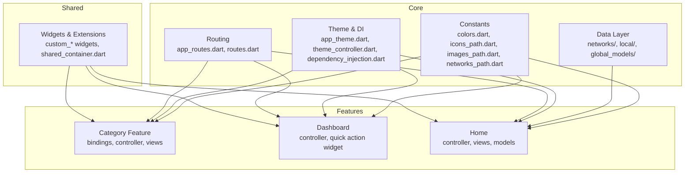
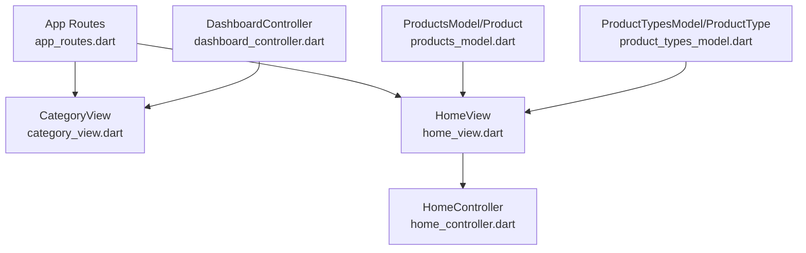
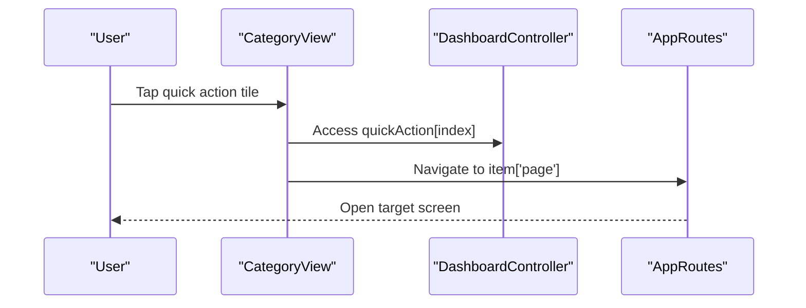
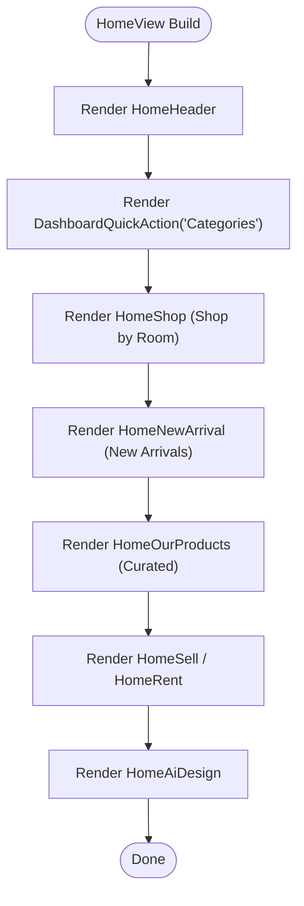
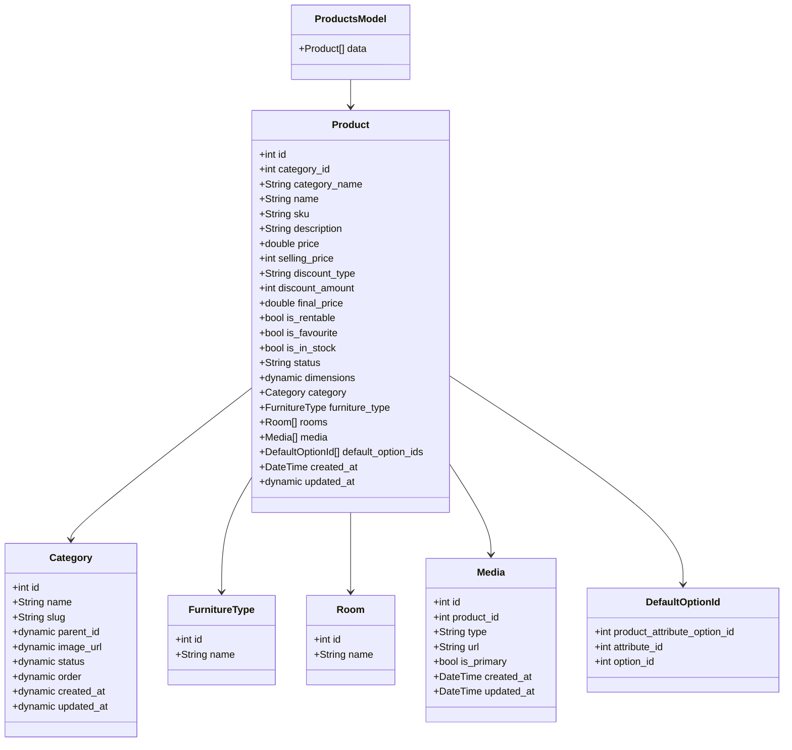
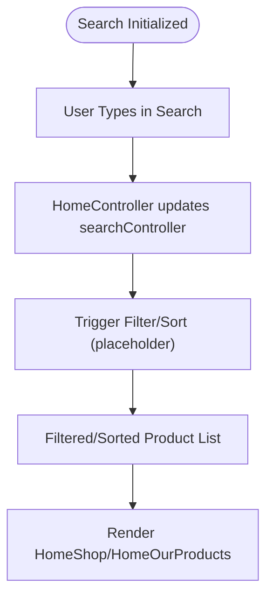
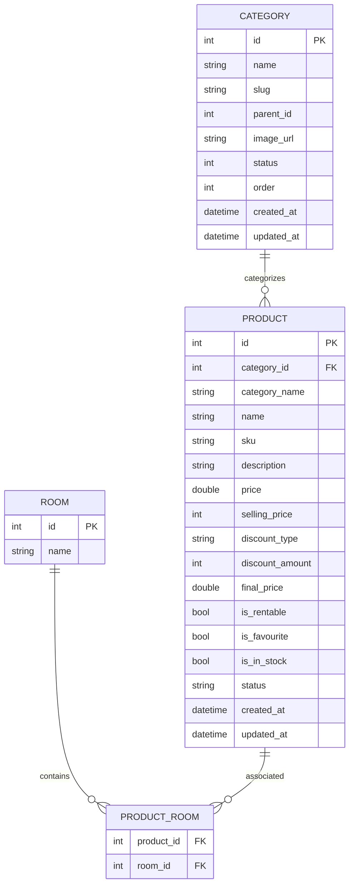
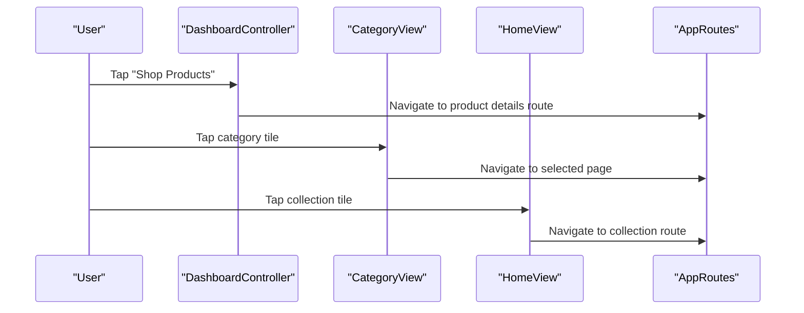
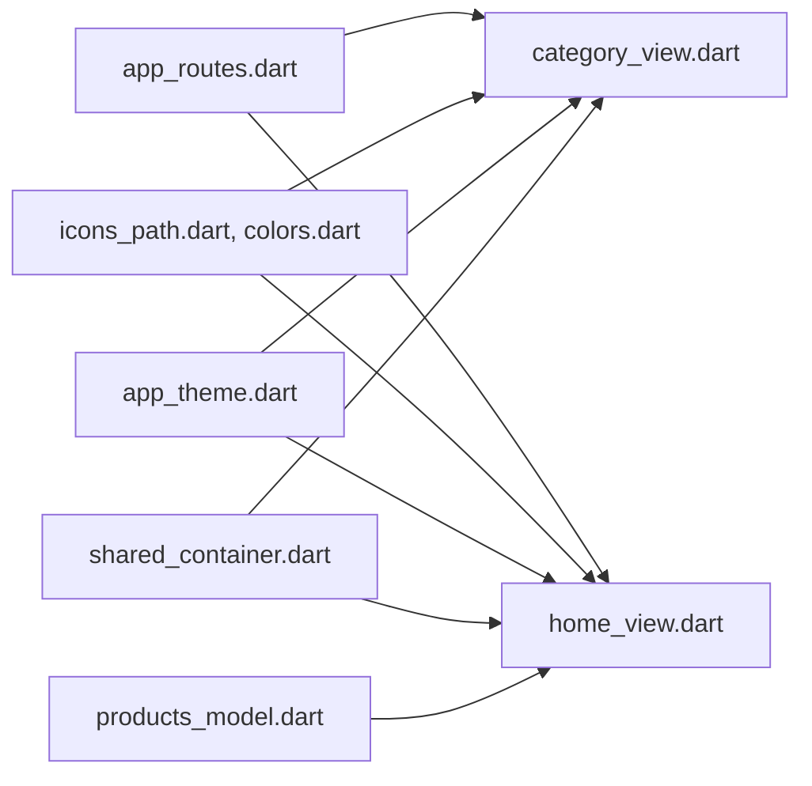

# Product Catalog Management

<cite>
**Referenced Files in This Document**
- [pubspec.yaml](file://pubspec.yaml)
- [README.md](file://README.md)
- [lib/main.dart](file://lib/main.dart)
- [lib/core/constant/colors.dart](file://lib/core/constant/colors.dart)
- [lib/core/constant/icons_path.dart](file://lib/core/constant/icons_path.dart)
- [lib/core/constant/images_path.dart](file://lib/core/constant/images_path.dart)
- [lib/core/constant/networks_path.dart](file://lib/core/constant/networks_path.dart)
- [lib/core/data/global_models/error_model.dart](file://lib/core/data/global_models/error_model.dart)
- [lib/core/data/global_models/user_profile_model.dart](file://lib/core/data/global_models/user_profile_model.dart)
- [lib/core/data/local/storage_service.dart](file://lib/core/data/local/storage_service.dart)
- [lib/core/data/local/theme_service.dart](file://lib/core/data/local/theme_service.dart)
- [lib/core/data/networks/get_network.dart](file://lib/core/data/networks/get_network.dart)
- [lib/core/data/networks/post_with_response.dart](file://lib/core/data/networks/post_with_response.dart)
- [lib/core/data/networks/post_without_response.dart](file://lib/core/data/networks/post_without_response.dart)
- [lib/core/data/networks/delete_network.dart](file://lib/core/data/networks/delete_network.dart)
- [lib/core/data/networks/headers_manager.dart](file://lib/core/data/networks/headers_manager.dart)
- [lib/core/di/dependency_injection.dart](file://lib/core/di/dependency_injection.dart)
- [lib/core/routes/app_routes.dart](file://lib/core/routes/app_routes.dart)
- [lib/core/routes/routes.dart](file://lib/core/routes/routes.dart)
- [lib/core/theme/app_theme.dart](file://lib/core/theme/app_theme.dart)
- [lib/core/theme/theme_controller.dart](file://lib/core/theme/theme_controller.dart)
- [lib/core/utils/date_picker.dart](file://lib/core/utils/date_picker.dart)
- [lib/core/utils/image_picker.dart](file://lib/core/utils/image_picker.dart)
- [lib/features/category/bindings/category_bindings.dart](file://lib/features/category/bindings/category_bindings.dart)
- [lib/features/category/controller/category_controller.dart](file://lib/features/category/controller/category_controller.dart)
- [lib/features/category/views/category_view.dart](file://lib/features/category/views/category_view.dart)
- [lib/features/dashboard/controller/dashboard_controller.dart](file://lib/features/dashboard/controller/dashboard_controller.dart)
- [lib/features/dashboard/widgets/dashboard_widget/dashboard_quick_action.dart](file://lib/features/dashboard/widgets/dashboard_widget/dashboard_quick_action.dart)
- [lib/features/home/controller/home_controller.dart](file://lib/features/home/controller/home_controller.dart)
- [lib/features/home/models/products_model.dart](file://lib/features/home/models/products_model.dart)
- [lib/features/home/models/product_types_model.dart](file://lib/features/home/models/product_types_model.dart)
- [lib/features/home/views/home_view.dart](file://lib/features/home/views/home_view.dart)
- [lib/shared/extensions/extractors/estimate_delivery_extractor.dart](file://lib/shared/extensions/extractors/estimate_delivery_extractor.dart)
- [lib/shared/extensions/formatters/date_formatter.dart](file://lib/shared/extensions/formatters/date_formatter.dart)
- [lib/shared/extensions/validators/abn_validator.dart](file://lib/shared/extensions/validators/abn_validator.dart)
- [lib/shared/extensions/validators/confirm_password_validator.dart](file://lib/shared/extensions/validators/confirm_password_validator.dart)
- [lib/shared/extensions/validators/email_validator.dart](file://lib/shared/extensions/validators/email_validator.dart)
- [lib/shared/extensions/validators/name_validator.dart](file://lib/shared/extensions/validators/name_validator.dart)
- [lib/shared/extensions/validators/password_validator.dart](file://lib/shared/extensions/validators/password_validator.dart)
- [lib/shared/extensions/validators/phone_validator.dart](file://lib/shared/extensions/validators/phone_validator.dart)
- [lib/shared/widgets/custom_button/custom_primary_button.dart](file://lib/shared/widgets/custom_button/custom_primary_button.dart)
- [lib/shared/widgets/custom_button/custom_radio_button.dart](file://lib/shared/widgets/custom_button/custom_radio_button.dart)
- [lib/shared/widgets/custom_button/custom_secondary_button.dart](file://lib/shared/widgets/custom_button/custom_secondary_button.dart)
- [lib/shared/widgets/custom_button/custom_switch_button.dart](file://lib/shared/widgets/custom_button/custom_switch_button.dart)
- [lib/shared/widgets/custom_dialog/custom_payment_dialog.dart](file://lib/shared/widgets/custom_dialog/custom_payment_dialog.dart)
- [lib/shared/widgets/custom_dialog/custom_payment_dialog_method.dart](file://lib/shared/widgets/custom_dialog/custom_payment_dialog_method.dart)
- [lib/shared/widgets/custom_dialog/custom_payment_success_dialog.dart](file://lib/shared/widgets/custom_dialog/custom_payment_success_dialog.dart)
- [lib/shared/widgets/custom_dialog/custom_rating_dialog.dart](file://lib/shared/widgets/custom_dialog/custom_rating_dialog.dart)
- [lib/shared/widgets/custom_dialog/custom_reject_dialog.dart](file://lib/shared/widgets/custom_dialog/custom_reject_dialog.dart)
- [lib/shared/widgets/custom_pagination/custom_pagination.dart](file://lib/shared/widgets/custom_pagination/custom_pagination.dart)
- [lib/shared/widgets/custom_pagination/custom_pagination_button.dart](file://lib/shared/widgets/custom_pagination/custom_pagination_button.dart)
- [lib/shared/widgets/custom_pagination/custom_pagination_dot.dart](file://lib/shared/widgets/custom_pagination/custom_pagination_dot.dart)
- [lib/shared/widgets/custom_pagination/custom_pagination_number.dart](file://lib/shared/widgets/custom_pagination/custom_pagination_number.dart)
- [lib/shared/widgets/custom_rating/custom_rating_builder.dart](file://lib/shared/widgets/custom_rating/custom_rating_builder.dart)
- [lib/shared/widgets/custom_table/custom_table.dart](file://lib/shared/widgets/custom_table/custom_table.dart)
- [lib/shared/widgets/custom_table/custom_table_action_button.dart](file://lib/shared/widgets/custom_table/custom_table_action_button.dart)
- [lib/shared/widgets/custom_table/custom_table_expanded.dart](file://lib/shared/widgets/custom_table/custom_table_expanded.dart)
- [lib/shared/widgets/custom_table/custom_table_filter.dart](file://lib/shared/widgets/custom_table/custom_table_filter.dart)
- [lib/shared/widgets/custom_table/custom_table_header.dart](file://lib/shared/widgets/custom_table/custom_table_header.dart)
- [lib/shared/widgets/custom_table/custom_table_row.dart](file://lib/shared/widgets/custom_table/custom_table_row.dart)
- [lib/shared/widgets/custom_table/custom_table_status.dart](file://lib/shared/widgets/custom_table/custom_table_status.dart)
- [lib/shared/widgets/custom_table/custom_table_view_button.dart](file://lib/shared/widgets/custom_table/custom_table_view_button.dart)
- [lib/shared/widgets/custom_text/custom_primary_text.dart](file://lib/shared/widgets/custom_text/custom_primary_text.dart)
- [lib/shared/widgets/custom_timeline/custom_payment_timeline.dart](file://lib/shared/widgets/custom_timeline/custom_payment_timeline.dart)
- [lib/shared/widgets/flow_widgets/flow_header.dart](file://lib/shared/widgets/flow_widgets/flow_header.dart)
- [lib/shared/widgets/flow_widgets/flow_page_count.dart](file://lib/shared/widgets/flow_widgets/flow_page_count.dart)
- [lib/shared/widgets/flow_widgets/flow_step_count.dart](file://lib/shared/widgets/flow_widgets/flow_step_count.dart)
- [lib/shared/widgets/snackbars/error_snackbar.dart](file://lib/shared/widgets/snackbars/error_snackbar.dart)
- [lib/shared/widgets/snackbars/success_snackbar.dart](file://lib/shared/widgets/snackbars/success_snackbar.dart)
- [lib/shared/widgets/action_button.dart](file://lib/shared/widgets/action_button.dart)
- [lib/shared/widgets/custom_appbar.dart](file://lib/shared/widgets/custom_appbar.dart)
- [lib/shared/widgets/custom_container.dart](file://lib/shared/widgets/custom_container.dart)
- [lib/shared/widgets/custom_divider.dart](file://lib/shared/widgets/custom_divider.dart)
- [lib/shared/widgets/details_row_model.dart](file://lib/shared/widgets/details_row_model.dart)
- [lib/shared/widgets/shared_container.dart](file://lib/shared/widgets/shared_container.dart)
</cite>

## Table of Contents
1. [Introduction](#introduction)
2. [Project Structure](#project-structure)
3. [Core Components](#core-components)
4. [Architecture Overview](#architecture-overview)
5. [Detailed Component Analysis](#detailed-component-analysis)
6. [Dependency Analysis](#dependency-analysis)
7. [Performance Considerations](#performance-considerations)
8. [Troubleshooting Guide](#troubleshooting-guide)
9. [Conclusion](#conclusion)
10. [Appendices](#appendices)

## Introduction
This document describes the product catalog management system for the ZB-DEZINE Flutter application. It focuses on the category organization structure, product listing mechanisms, browsing interfaces, filtering and sorting capabilities, search functionality, product data models, inventory and pricing systems, and navigation patterns. It also outlines performance optimization strategies and user engagement features such as favorites and recommendations.

## Project Structure
The project follows a modular structure with feature-based organization under lib/features, shared UI components under lib/shared, and core infrastructure under lib/core. The catalog functionality spans the category feature, dashboard quick actions, home screen widgets, and product data models.

**Diagram sources**
- [lib/core/constant/colors.dart](file://lib/core/constant/colors.dart)
- [lib/core/constant/icons_path.dart](file://lib/core/constant/icons_path.dart)
- [lib/core/constant/images_path.dart](file://lib/core/constant/images_path.dart)
- [lib/core/constant/networks_path.dart](file://lib/core/constant/networks_path.dart)
- [lib/core/data/networks/get_network.dart](file://lib/core/data/networks/get_network.dart)
- [lib/core/data/networks/post_with_response.dart](file://lib/core/data/networks/post_with_response.dart)
- [lib/core/data/networks/post_without_response.dart](file://lib/core/data/networks/post_without_response.dart)
- [lib/core/data/networks/delete_network.dart](file://lib/core/data/networks/delete_network.dart)
- [lib/core/data/networks/headers_manager.dart](file://lib/core/data/networks/headers_manager.dart)
- [lib/core/theme/app_theme.dart](file://lib/core/theme/app_theme.dart)
- [lib/core/theme/theme_controller.dart](file://lib/core/theme/theme_controller.dart)
- [lib/core/di/dependency_injection.dart](file://lib/core/di/dependency_injection.dart)
- [lib/core/routes/app_routes.dart](file://lib/core/routes/app_routes.dart)
- [lib/core/routes/routes.dart](file://lib/core/routes/routes.dart)
- [lib/features/category/bindings/category_bindings.dart](file://lib/features/category/bindings/category_bindings.dart)
- [lib/features/category/controller/category_controller.dart](file://lib/features/category/controller/category_controller.dart)
- [lib/features/category/views/category_view.dart](file://lib/features/category/views/category_view.dart)
- [lib/features/dashboard/controller/dashboard_controller.dart](file://lib/features/dashboard/controller/dashboard_controller.dart)
- [lib/features/dashboard/widgets/dashboard_widget/dashboard_quick_action.dart](file://lib/features/dashboard/widgets/dashboard_widget/dashboard_quick_action.dart)
- [lib/features/home/controller/home_controller.dart](file://lib/features/home/controller/home_controller.dart)
- [lib/features/home/models/products_model.dart](file://lib/features/home/models/products_model.dart)
- [lib/features/home/models/product_types_model.dart](file://lib/features/home/models/product_types_model.dart)
- [lib/features/home/views/home_view.dart](file://lib/features/home/views/home_view.dart)
- [lib/shared/widgets/shared_container.dart](file://lib/shared/widgets/shared_container.dart)

**Section sources**
- [pubspec.yaml:30-60](file://pubspec.yaml#L30-L60)
- [README.md:1-17](file://README.md#L1-L17)

## Core Components
- Category Feature: Provides category browsing UI and navigation via quick actions.
- Dashboard Quick Actions: Centralized navigation to Shop Products, Sell Furniture, Rent Products, and Design My Room.
- Home Screen Widgets: Organizes product discovery by room, new arrivals, and curated collections.
- Product Data Models: Defines product, category, furniture type, room, media, and default option structures.
- Network Layer: Encapsulates GET/POST/DELETE requests and headers management for API communication.
- Local Storage and Theme: Handles persistence and theming across the catalog experience.

**Section sources**
- [lib/features/category/bindings/category_bindings.dart:1-10](file://lib/features/category/bindings/category_bindings.dart#L1-L10)
- [lib/features/category/controller/category_controller.dart:1-5](file://lib/features/category/controller/category_controller.dart#L1-L5)
- [lib/features/category/views/category_view.dart:1-100](file://lib/features/category/views/category_view.dart#L1-L100)
- [lib/features/dashboard/controller/dashboard_controller.dart:1-64](file://lib/features/dashboard/controller/dashboard_controller.dart#L1-L64)
- [lib/features/dashboard/widgets/dashboard_widget/dashboard_quick_action.dart:14-81](file://lib/features/dashboard/widgets/dashboard_widget/dashboard_quick_action.dart#L14-L81)
- [lib/features/home/models/products_model.dart:1-267](file://lib/features/home/models/products_model.dart#L1-L267)
- [lib/features/home/models/product_types_model.dart:1-37](file://lib/features/home/models/product_types_model.dart#L1-L37)
- [lib/features/home/views/home_view.dart:1-76](file://lib/features/home/views/home_view.dart#L1-L76)
- [lib/core/data/networks/get_network.dart](file://lib/core/data/networks/get_network.dart)
- [lib/core/data/networks/post_with_response.dart](file://lib/core/data/networks/post_with_response.dart)
- [lib/core/data/networks/post_without_response.dart](file://lib/core/data/networks/post_without_response.dart)
- [lib/core/data/networks/delete_network.dart](file://lib/core/data/networks/delete_network.dart)
- [lib/core/data/networks/headers_manager.dart](file://lib/core/data/networks/headers_manager.dart)
- [lib/core/data/local/storage_service.dart](file://lib/core/data/local/storage_service.dart)
- [lib/core/theme/app_theme.dart](file://lib/core/theme/app_theme.dart)

## Architecture Overview
The catalog architecture integrates UI components with reactive controllers and a structured data model. Navigation is centralized via routes and quick actions, while product listings leverage models that encapsulate category, media, and pricing information.

**Diagram sources**
- [lib/core/routes/app_routes.dart](file://lib/core/routes/app_routes.dart)
- [lib/features/dashboard/controller/dashboard_controller.dart:1-64](file://lib/features/dashboard/controller/dashboard_controller.dart#L1-L64)
- [lib/features/category/views/category_view.dart:1-100](file://lib/features/category/views/category_view.dart#L1-L100)
- [lib/features/home/views/home_view.dart:1-76](file://lib/features/home/views/home_view.dart#L1-L76)
- [lib/features/home/controller/home_controller.dart:1-15](file://lib/features/home/controller/home_controller.dart#L1-L15)
- [lib/features/home/models/products_model.dart:1-267](file://lib/features/home/models/products_model.dart#L1-L267)
- [lib/features/home/models/product_types_model.dart:1-37](file://lib/features/home/models/product_types_model.dart#L1-L37)

## Detailed Component Analysis

### Category Organization and Browsing Interfaces
- Category View renders quick actions from the dashboard controller and navigates to product details or flows based on route configuration.
- The category feature is registered via dependency injection and controlled by a lightweight controller.

**Diagram sources**
- [lib/features/category/views/category_view.dart:27-34](file://lib/features/category/views/category_view.dart#L27-L34)
- [lib/features/dashboard/controller/dashboard_controller.dart:9-34](file://lib/features/dashboard/controller/dashboard_controller.dart#L9-L34)
- [lib/core/routes/app_routes.dart](file://lib/core/routes/app_routes.dart)

**Section sources**
- [lib/features/category/views/category_view.dart:1-100](file://lib/features/category/views/category_view.dart#L1-L100)
- [lib/features/category/bindings/category_bindings.dart:1-10](file://lib/features/category/bindings/category_bindings.dart#L1-L10)
- [lib/features/category/controller/category_controller.dart:1-5](file://lib/features/category/controller/category_controller.dart#L1-L5)
- [lib/features/dashboard/controller/dashboard_controller.dart:1-64](file://lib/features/dashboard/controller/dashboard_controller.dart#L1-L64)

### Product Listing Mechanisms and Home Screen Widgets
- HomeView composes multiple widgets to present categorized product discovery, including shop by room, new arrivals, curated collections, and special offers.
- Controllers manage UI state and search input for product discovery.

**Diagram sources**
- [lib/features/home/views/home_view.dart:15-76](file://lib/features/home/views/home_view.dart#L15-L76)
- [lib/features/dashboard/widgets/dashboard_widget/dashboard_quick_action.dart:14-81](file://lib/features/dashboard/widgets/dashboard_widget/dashboard_quick_action.dart#L14-L81)

**Section sources**
- [lib/features/home/views/home_view.dart:1-76](file://lib/features/home/views/home_view.dart#L1-L76)
- [lib/features/home/controller/home_controller.dart:1-15](file://lib/features/home/controller/home_controller.dart#L1-L15)
- [lib/features/dashboard/widgets/dashboard_widget/dashboard_quick_action.dart:14-81](file://lib/features/dashboard/widgets/dashboard_widget/dashboard_quick_action.dart#L14-L81)

### Product Data Models and Inventory/Pricing Systems
- Product model encapsulates identifiers, pricing, stock status, category, furniture type, rooms, media, and default options.
- Pricing fields include original price, selling price, discount type/amount, and final price.
- Category model supports hierarchical parent-child relationships via optional parent ID and slug.
- Media model stores product images and primary image flags.
- Default option IDs connect product variants to attribute-option combinations.

**Diagram sources**
- [lib/features/home/models/products_model.dart:9-267](file://lib/features/home/models/products_model.dart#L9-L267)

**Section sources**
- [lib/features/home/models/products_model.dart:1-267](file://lib/features/home/models/products_model.dart#L1-L267)

### Filtering, Sorting, and Search Functionality
- Search input is managed by the home controller’s text editing controller.
- Filtering and sorting are not implemented in the current codebase; placeholder logic exists in the home view for future enhancement.
- Recommendations and favorites are represented by boolean flags in the product model.

**Diagram sources**
- [lib/features/home/controller/home_controller.dart:1-15](file://lib/features/home/controller/home_controller.dart#L1-L15)
- [lib/features/home/views/home_view.dart:1-76](file://lib/features/home/views/home_view.dart#L1-L76)

**Section sources**
- [lib/features/home/controller/home_controller.dart:1-15](file://lib/features/home/controller/home_controller.dart#L1-L15)
- [lib/features/home/views/home_view.dart:1-76](file://lib/features/home/views/home_view.dart#L1-L76)

### Category Hierarchies and Product Categorization Logic
- Categories support hierarchical organization via optional parent ID and slug fields.
- Product categorization is explicit via category ID and name, enabling accurate filtering and grouping.
- Room associations enable room-specific product discovery.

**Diagram sources**
- [lib/features/home/models/products_model.dart:131-201](file://lib/features/home/models/products_model.dart#L131-L201)

**Section sources**
- [lib/features/home/models/products_model.dart:131-201](file://lib/features/home/models/products_model.dart#L131-L201)

### Catalog Navigation Patterns
- Quick actions in the dashboard route users to Shop Products, Sell Furniture, Rent Products, and Design My Room.
- Category view tiles trigger navigation to configured routes.
- Home screen widgets provide contextual navigation to product collections.

**Diagram sources**
- [lib/features/dashboard/controller/dashboard_controller.dart:9-34](file://lib/features/dashboard/controller/dashboard_controller.dart#L9-L34)
- [lib/features/category/views/category_view.dart:32-34](file://lib/features/category/views/category_view.dart#L32-L34)
- [lib/features/home/views/home_view.dart:48-67](file://lib/features/home/views/home_view.dart#L48-L67)
- [lib/core/routes/app_routes.dart](file://lib/core/routes/app_routes.dart)

**Section sources**
- [lib/features/dashboard/controller/dashboard_controller.dart:1-64](file://lib/features/dashboard/controller/dashboard_controller.dart#L1-L64)
- [lib/features/category/views/category_view.dart:1-100](file://lib/features/category/views/category_view.dart#L1-L100)
- [lib/features/home/views/home_view.dart:1-76](file://lib/features/home/views/home_view.dart#L1-L76)

### Product Attributes Management
- Default option IDs connect product variants to attribute-option pairs, enabling variant selection and filtering.
- Media management supports primary image selection and multiple product images.

**Section sources**
- [lib/features/home/models/products_model.dart:243-267](file://lib/features/home/models/products_model.dart#L243-L267)
- [lib/features/home/models/products_model.dart:203-241](file://lib/features/home/models/products_model.dart#L203-L241)

### Catalog Performance Optimization
- Use lazy loading and virtualization for large product lists.
- Cache frequently accessed product metadata and images.
- Debounce search input to reduce network calls.
- Paginate product listings and defer heavy computations off the UI thread.

[No sources needed since this section provides general guidance]

### Recommendation Systems and User Engagement Features
- Favorites flag enables personalized collections.
- Recommendations can be implemented via collaborative filtering or content-based approaches using product attributes and user interactions.

**Section sources**
- [lib/features/home/models/products_model.dart:35-37](file://lib/features/home/models/products_model.dart#L35-L37)

## Dependency Analysis
The catalog feature depends on routing, theming, constants, and shared widgets. Controllers depend on reactive state management, and models depend on JSON serialization.

**Diagram sources**
- [lib/core/routes/app_routes.dart](file://lib/core/routes/app_routes.dart)
- [lib/core/constant/icons_path.dart](file://lib/core/constant/icons_path.dart)
- [lib/core/constant/colors.dart](file://lib/core/constant/colors.dart)
- [lib/core/theme/app_theme.dart](file://lib/core/theme/app_theme.dart)
- [lib/shared/widgets/shared_container.dart](file://lib/shared/widgets/shared_container.dart)
- [lib/features/home/models/products_model.dart:1-267](file://lib/features/home/models/products_model.dart#L1-L267)
- [lib/features/category/views/category_view.dart:1-100](file://lib/features/category/views/category_view.dart#L1-L100)
- [lib/features/home/views/home_view.dart:1-76](file://lib/features/home/views/home_view.dart#L1-L76)

**Section sources**
- [lib/core/routes/app_routes.dart](file://lib/core/routes/app_routes.dart)
- [lib/core/constant/icons_path.dart](file://lib/core/constant/icons_path.dart)
- [lib/core/constant/colors.dart](file://lib/core/constant/colors.dart)
- [lib/core/theme/app_theme.dart](file://lib/core/theme/app_theme.dart)
- [lib/shared/widgets/shared_container.dart](file://lib/shared/widgets/shared_container.dart)
- [lib/features/home/models/products_model.dart:1-267](file://lib/features/home/models/products_model.dart#L1-L267)
- [lib/features/category/views/category_view.dart:1-100](file://lib/features/category/views/category_view.dart#L1-L100)
- [lib/features/home/views/home_view.dart:1-76](file://lib/features/home/views/home_view.dart#L1-L76)

## Performance Considerations
- Virtualize long lists and defer image decoding.
- Implement pagination and incremental loading.
- Cache API responses and invalidate selectively.
- Minimize rebuilds by scoping reactive state to necessary widgets.

[No sources needed since this section provides general guidance]

## Troubleshooting Guide
- Network failures: Inspect headers manager and network request wrappers for consistent headers and error handling.
- Serialization errors: Verify JSON keys match model factories and handle optional fields gracefully.
- Navigation issues: Confirm route names and bindings are correctly registered.

**Section sources**
- [lib/core/data/networks/headers_manager.dart](file://lib/core/data/networks/headers_manager.dart)
- [lib/core/data/networks/get_network.dart](file://lib/core/data/networks/get_network.dart)
- [lib/core/data/networks/post_with_response.dart](file://lib/core/data/networks/post_with_response.dart)
- [lib/core/data/networks/post_without_response.dart](file://lib/core/data/networks/post_without_response.dart)
- [lib/core/data/networks/delete_network.dart](file://lib/core/data/networks/delete_network.dart)
- [lib/core/data/global_models/error_model.dart](file://lib/core/data/global_models/error_model.dart)

## Conclusion
The ZB-DEZINE catalog system leverages a modular architecture with reactive controllers, structured data models, and reusable UI components. While navigation and product presentation are well-defined, filtering, sorting, and advanced recommendation features require extension. The existing models and routes provide a solid foundation for implementing robust search, filtering, and personalization capabilities.

## Appendices
- Asset and dependency declarations are defined in the project configuration.

**Section sources**
- [pubspec.yaml:30-60](file://pubspec.yaml#L30-L60)