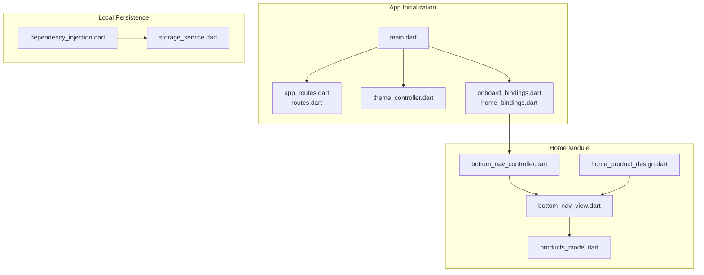
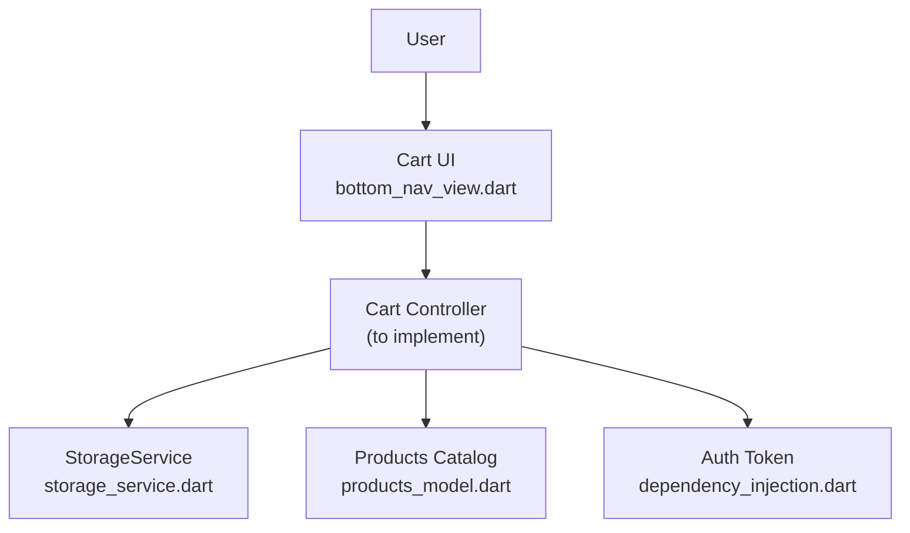
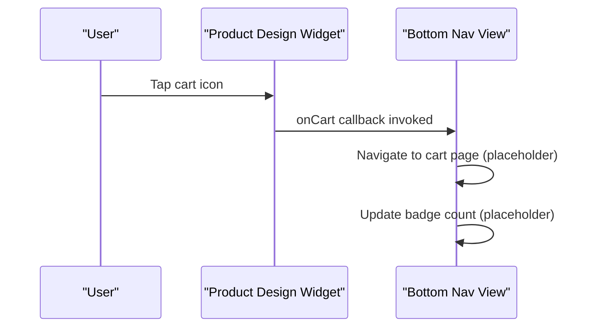
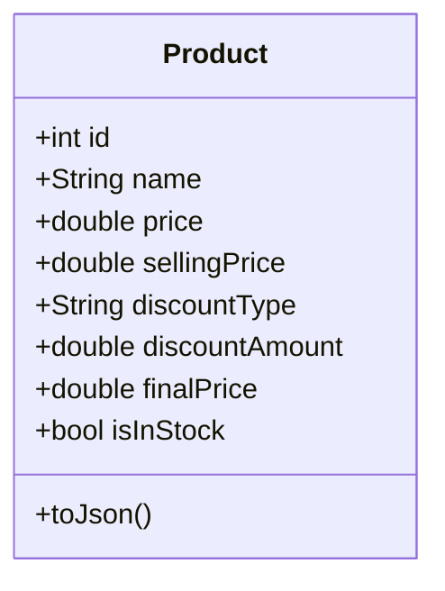
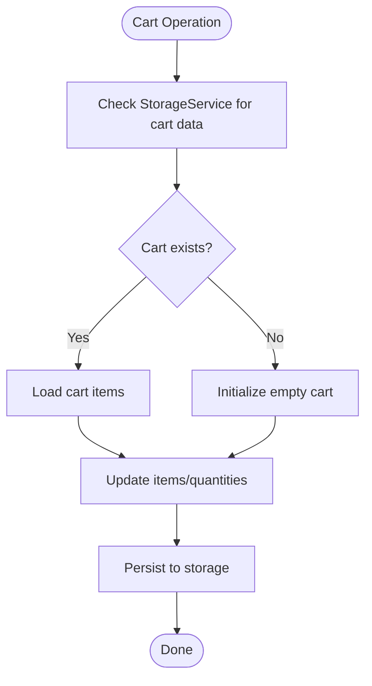
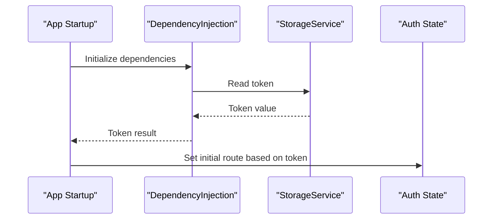
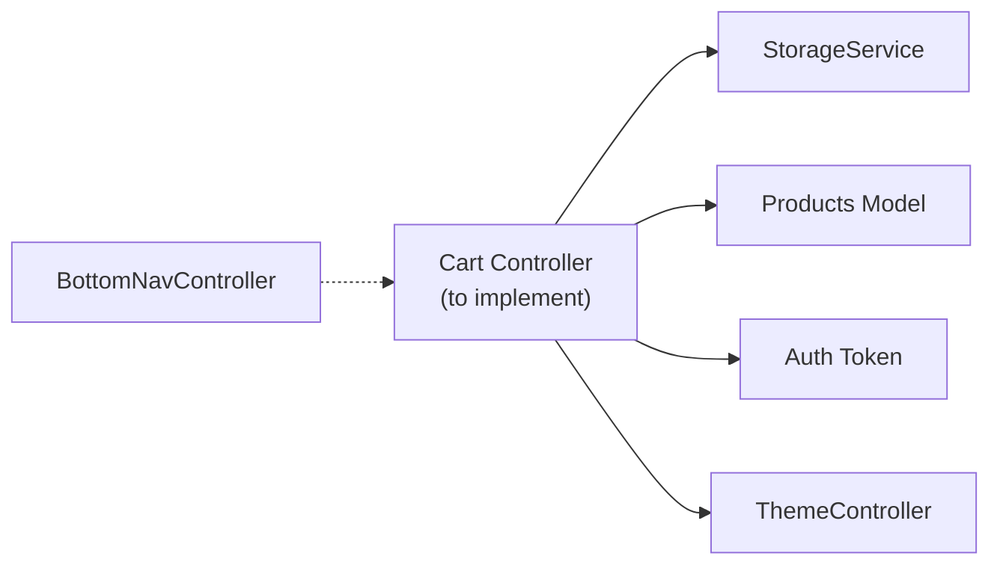

# Shopping Cart System

<cite>
**Referenced Files in This Document**
- [main.dart](file://lib/main.dart)
- [dependency_injection.dart](file://lib/core/di/dependency_injection.dart)
- [storage_service.dart](file://lib/core/data/local/storage_service.dart)
- [bottom_nav_view.dart](file://lib/features/home/views/bottom_nav_view.dart)
- [bottom_nav_controller.dart](file://lib/features/home/controller/bottom_nav_controller.dart)
- [home_product_design.dart](file://lib/features/home/widgets/home_widgets/home_product_design.dart)
- [products_model.dart](file://lib/features/home/models/products_model.dart)
- [app_routes.dart](file://lib/core/routes/app_routes.dart)
- [routes.dart](file://lib/core/routes/routes.dart)
- [theme_controller.dart](file://lib/core/theme/theme_controller.dart)
- [onboard_bindings.dart](file://lib/features/auth/bindings/onboard_bindings.dart)
- [home_bindings.dart](file://lib/features/home/bindings/home_bindings.dart)
</cite>

## Table of Contents
1. [Introduction](#introduction)
2. [Project Structure](#project-structure)
3. [Core Components](#core-components)
4. [Architecture Overview](#architecture-overview)
5. [Detailed Component Analysis](#detailed-component-analysis)
6. [Dependency Analysis](#dependency-analysis)
7. [Performance Considerations](#performance-considerations)
8. [Troubleshooting Guide](#troubleshooting-guide)
9. [Conclusion](#conclusion)

## Introduction
This document describes the shopping cart functionality for the ZB DEZIGN Flutter application. Based on the current codebase, the cart system is not fully implemented. The project includes UI elements indicating a cart (navigation badge and product buttons), a persistent storage service for tokens, and product models with pricing fields. However, there is no dedicated cart controller, cart data model, or cart-specific persistence logic. This document outlines what is present, what is missing, and provides implementation guidance for building a complete cart system that integrates with product catalogs, user authentication, and local storage.

## Project Structure
The cart-related elements are distributed across several areas:
- Application bootstrap and routing initialize the app and set up DI and routes.
- Local storage service provides token persistence via GetStorage.
- Home module exposes UI hooks for cart actions and displays a cart badge in the bottom navigation.
- Product models define pricing and stock fields that would feed cart calculations.
- Theme and bindings connect UI, routing, and controllers.

**Diagram sources**
- [main.dart:12-46](file://lib/main.dart#L12-L46)
- [app_routes.dart](file://lib/core/routes/app_routes.dart)
- [routes.dart](file://lib/core/routes/routes.dart)
- [theme_controller.dart](file://lib/core/theme/theme_controller.dart)
- [onboard_bindings.dart](file://lib/features/auth/bindings/onboard_bindings.dart)
- [home_bindings.dart](file://lib/features/home/bindings/home_bindings.dart)
- [dependency_injection.dart:11-26](file://lib/core/di/dependency_injection.dart#L11-L26)
- [storage_service.dart:1-23](file://lib/core/data/local/storage_service.dart#L1-L23)
- [bottom_nav_view.dart:11-256](file://lib/features/home/views/bottom_nav_view.dart#L11-L256)
- [bottom_nav_controller.dart:1-17](file://lib/features/home/controller/bottom_nav_controller.dart#L1-L17)
- [home_product_design.dart:1-92](file://lib/features/home/widgets/home_widgets/home_product_design.dart#L1-L92)
- [products_model.dart:102-152](file://lib/features/home/models/products_model.dart#L102-L152)

**Section sources**
- [main.dart:12-46](file://lib/main.dart#L12-L46)
- [dependency_injection.dart:11-26](file://lib/core/di/dependency_injection.dart#L11-L26)
- [storage_service.dart:1-23](file://lib/core/data/local/storage_service.dart#L1-L23)
- [bottom_nav_view.dart:11-256](file://lib/features/home/views/bottom_nav_view.dart#L11-L256)
- [bottom_nav_controller.dart:1-17](file://lib/features/home/controller/bottom_nav_controller.dart#L1-L17)
- [home_product_design.dart:1-92](file://lib/features/home/widgets/home_widgets/home_product_design.dart#L1-L92)
- [products_model.dart:102-152](file://lib/features/home/models/products_model.dart#L102-L152)

## Core Components
- Local storage service: Provides token persistence and can be extended for cart data.
- Bottom navigation: Contains a cart tab with a badge indicating item count.
- Product design widget: Exposes an onCart callback for adding items to the cart.
- Product models: Include pricing, discounts, and stock fields suitable for cart validation and calculations.
- Routing and bindings: Establish the app lifecycle and controller wiring.

What is missing for a complete cart system:
- A cart controller with observables for items, totals, and persistence.
- A cart data model with item identity, quantity, and derived totals.
- Inventory checks against product stock and cart updates.
- Price calculation logic including discounts and taxes.
- Session/user synchronization for guest vs. logged-in users.
- Cart cleanup and expiration policies.

**Section sources**
- [storage_service.dart:1-23](file://lib/core/data/local/storage_service.dart#L1-L23)
- [bottom_nav_view.dart:63-68](file://lib/features/home/views/bottom_nav_view.dart#L63-L68)
- [home_product_design.dart:10-17](file://lib/features/home/widgets/home_widgets/home_product_design.dart#L10-L17)
- [products_model.dart:102-152](file://lib/features/home/models/products_model.dart#L102-L152)
- [dependency_injection.dart:11-26](file://lib/core/di/dependency_injection.dart#L11-L26)

## Architecture Overview
The cart system should integrate with:
- Product catalog: Read pricing and stock from product models.
- Authentication: Sync cart per user session/token.
- Local storage: Persist cart items and totals.
- UI: Reflect item counts, totals, and cart actions.

**Diagram sources**
- [bottom_nav_view.dart:63-68](file://lib/features/home/views/bottom_nav_view.dart#L63-L68)
- [storage_service.dart:1-23](file://lib/core/data/local/storage_service.dart#L1-L23)
- [products_model.dart:102-152](file://lib/features/home/models/products_model.dart#L102-L152)
- [dependency_injection.dart:21-24](file://lib/core/di/dependency_injection.dart#L21-L24)

## Detailed Component Analysis

### Current Navigation and UI Hooks
- Bottom navigation includes a cart tab with a badge. The badge currently shows a hardcoded count and navigates to a dashboard page.
- Product design widget exposes an onCart callback, enabling product-to-cart interactions.

**Diagram sources**
- [home_product_design.dart:42-47](file://lib/features/home/widgets/home_widgets/home_product_design.dart#L42-L47)
- [bottom_nav_view.dart:169-219](file://lib/features/home/views/bottom_nav_view.dart#L169-L219)

**Section sources**
- [bottom_nav_view.dart:63-68](file://lib/features/home/views/bottom_nav_view.dart#L63-L68)
- [bottom_nav_view.dart:169-219](file://lib/features/home/views/bottom_nav_view.dart#L169-L219)
- [home_product_design.dart:10-17](file://lib/features/home/widgets/home_widgets/home_product_design.dart#L10-L17)

### Product Models and Pricing
- Products include fields for base price, selling price, discount type/amount, and stock availability.
- These fields are suitable for calculating item totals and validating inventory during cart operations.

**Diagram sources**
- [products_model.dart:102-128](file://lib/features/home/models/products_model.dart#L102-L128)

**Section sources**
- [products_model.dart:102-152](file://lib/features/home/models/products_model.dart#L102-L152)

### Local Storage Integration
- The storage service wraps GetStorage and supports read/write/remove/clear operations.
- It stores the auth token under a dedicated key and can be extended for cart data.

**Diagram sources**
- [storage_service.dart:1-23](file://lib/core/data/local/storage_service.dart#L1-L23)

**Section sources**
- [storage_service.dart:1-23](file://lib/core/data/local/storage_service.dart#L1-L23)

### Authentication and Session Management
- The app initializes dependencies and reads a token from storage to decide the initial route.
- Cart synchronization should align with user sessions: merge guest cart with user cart upon login and persist per user.

**Diagram sources**
- [main.dart:12-19](file://lib/main.dart#L12-L19)
- [dependency_injection.dart:11-26](file://lib/core/di/dependency_injection.dart#L11-L26)

**Section sources**
- [main.dart:12-19](file://lib/main.dart#L12-L19)
- [dependency_injection.dart:21-24](file://lib/core/di/dependency_injection.dart#L21-L24)

## Dependency Analysis
- The cart controller will depend on:
  - StorageService for persistence.
  - Product models for pricing and inventory.
  - Auth token for user session awareness.
  - Theme controller for UI consistency.
- Bottom navigation controller currently manages page indices and does not handle cart state.

**Diagram sources**
- [bottom_nav_controller.dart:1-17](file://lib/features/home/controller/bottom_nav_controller.dart#L1-L17)
- [storage_service.dart:1-23](file://lib/core/data/local/storage_service.dart#L1-L23)
- [products_model.dart:102-152](file://lib/features/home/models/products_model.dart#L102-L152)
- [dependency_injection.dart:21-24](file://lib/core/di/dependency_injection.dart#L21-L24)
- [theme_controller.dart](file://lib/core/theme/theme_controller.dart)

**Section sources**
- [bottom_nav_controller.dart:1-17](file://lib/features/home/controller/bottom_nav_controller.dart#L1-L17)
- [dependency_injection.dart:11-26](file://lib/core/di/dependency_injection.dart#L11-L26)

## Performance Considerations
- Use reactive controllers (GetX) for minimal rebuilds and efficient cart updates.
- Debounce cart updates when typing quantities to avoid excessive writes.
- Persist cart changes asynchronously to prevent UI jank.
- Cache frequently accessed product data to reduce network calls.
- Limit cart item list rendering to visible items and virtualize long lists.
- Clear expired or abandoned carts periodically to manage storage footprint.

## Troubleshooting Guide
Common issues and resolutions:
- Cart badge shows incorrect count: Verify the cart controller updates the badge binding and navigation page index.
- Items not persisting: Confirm StorageService keys and serialization of cart items.
- Inventory mismatch after purchase: Ensure stock updates occur server-side and cart recalculations reflect new stock.
- Duplicate items on login: Implement merge logic that combines guest and user carts, preferring newer data.

## Conclusion
The ZB DEZIGN app currently provides UI hooks and infrastructure for a cart system but lacks a dedicated cart controller and persistence logic. By implementing a cart controller that leverages the existing storage service, product models, and authentication flow, you can deliver robust cart operations including add/remove/update, validation against inventory, and synchronized user cart experiences. The provided diagrams and references offer a clear blueprint for integrating cart functionality into the existing architecture.