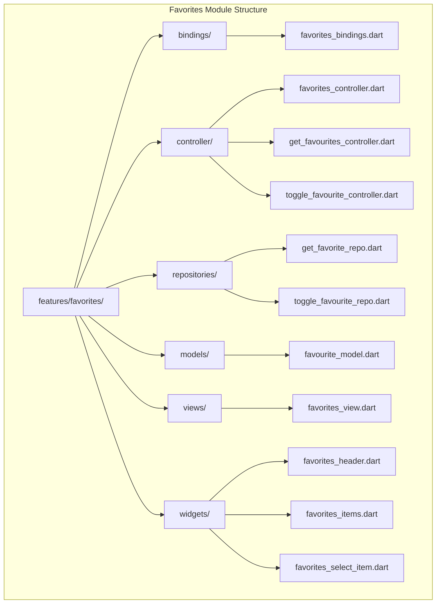
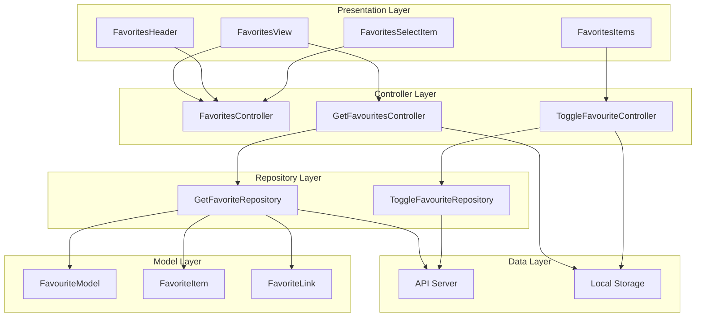
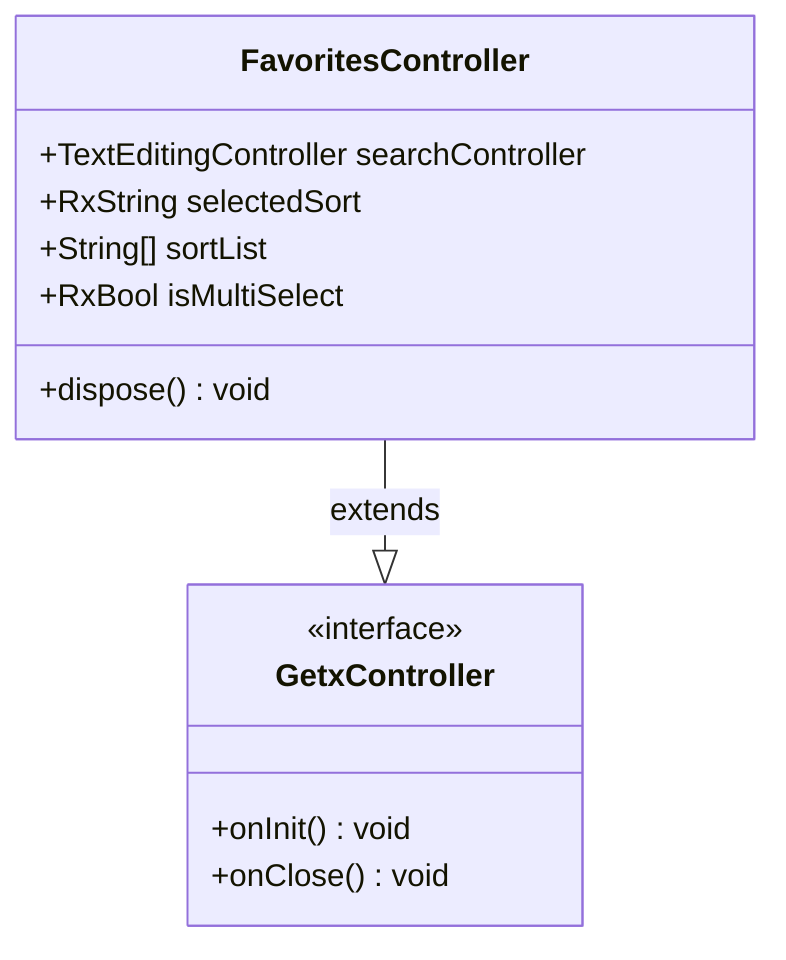
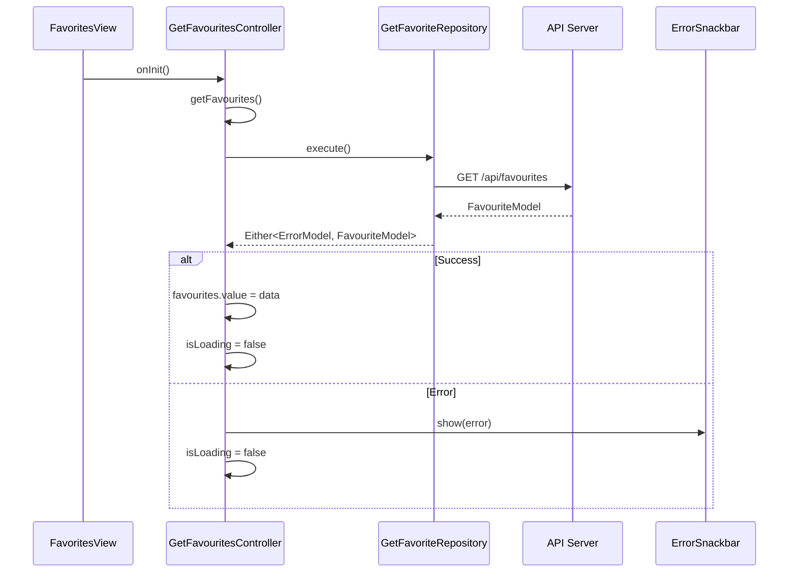
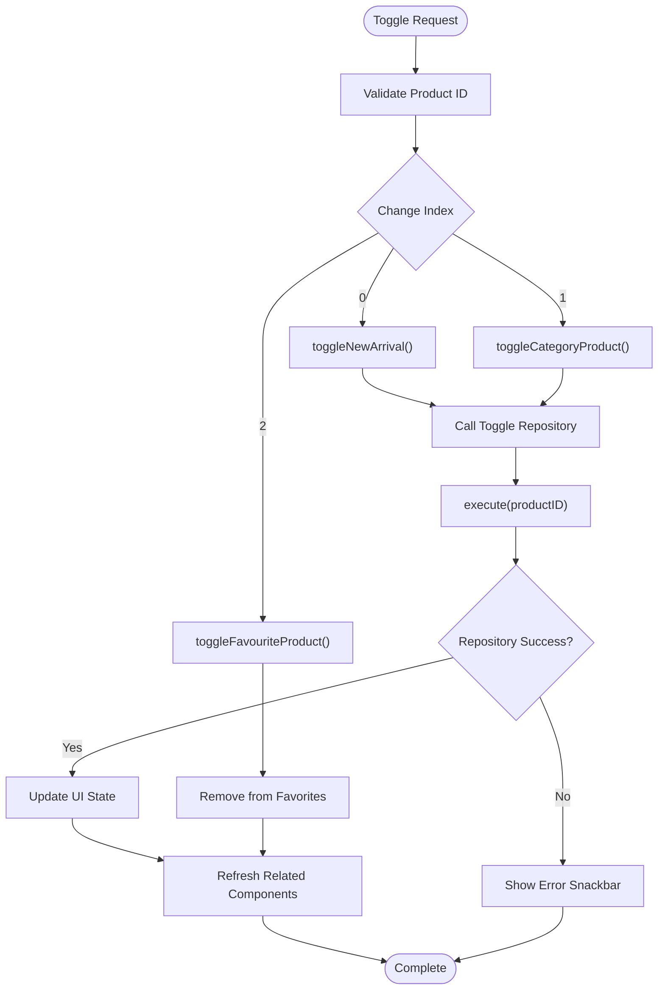
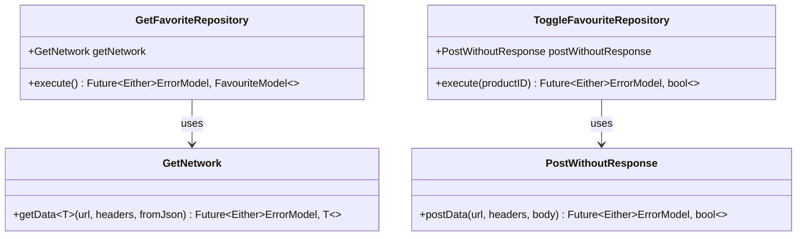
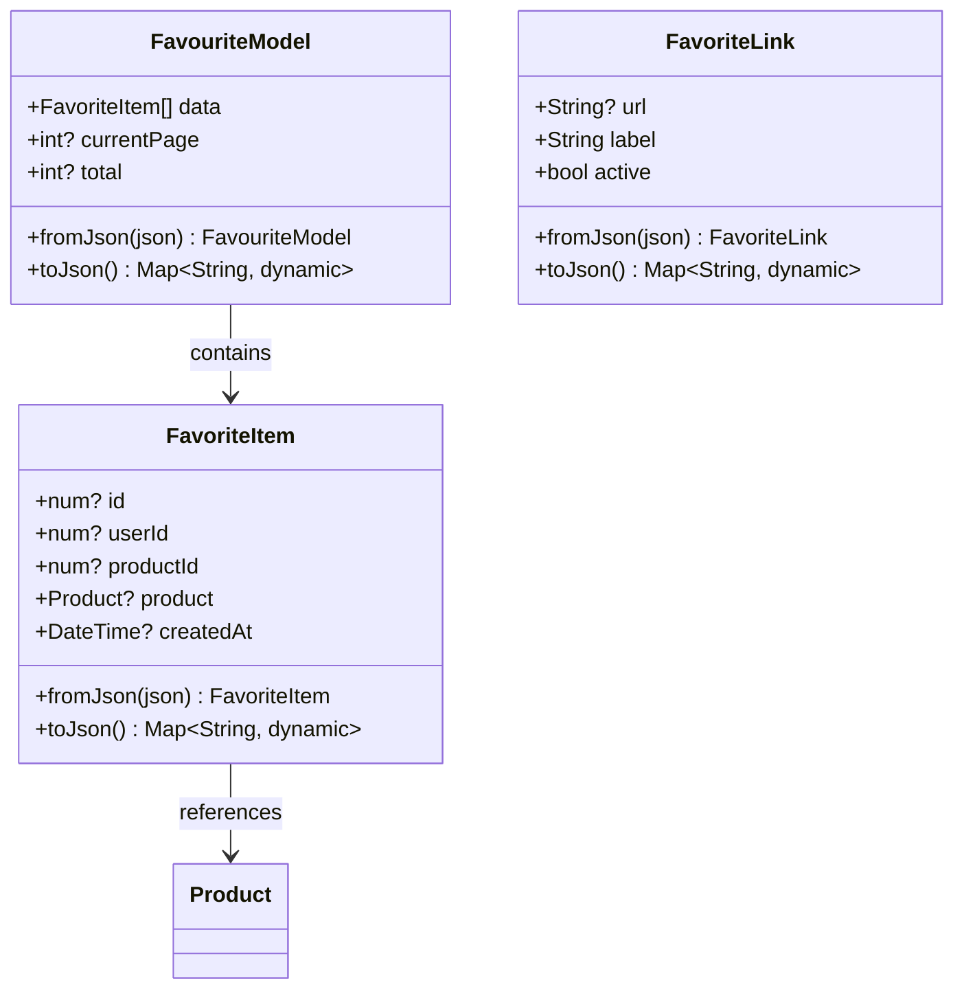
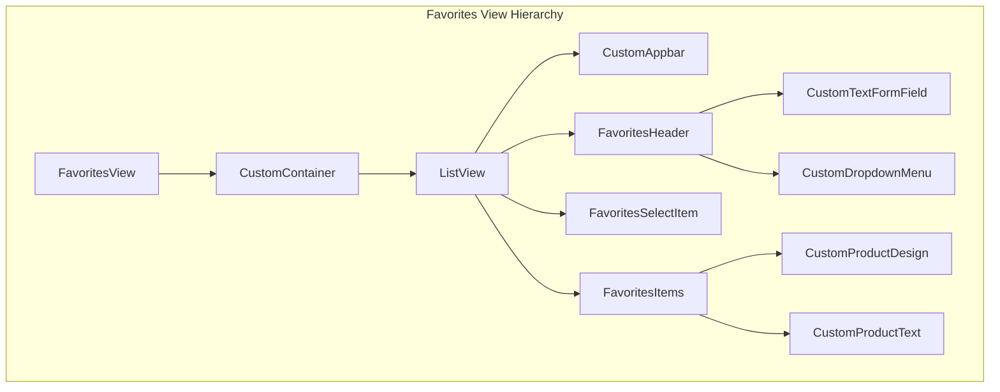
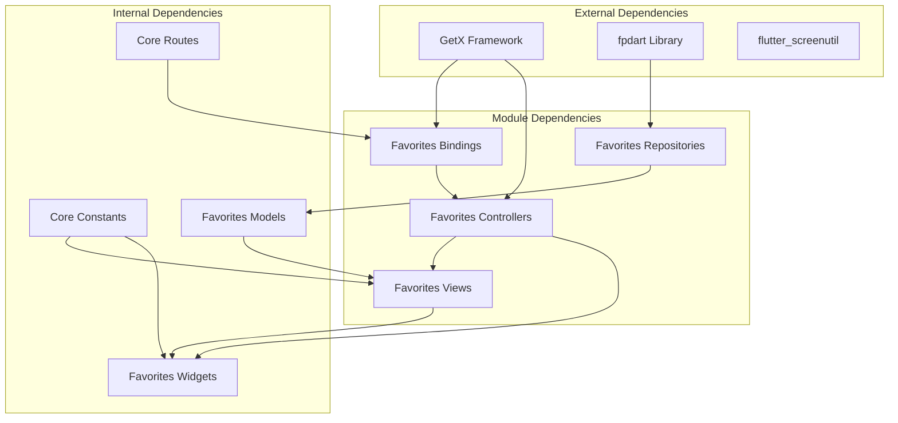

# Favorites Module

<cite>
**Referenced Files in This Document**
- [main.dart](file://lib/main.dart)
- [app_routes.dart](file://lib/core/routes/app_routes.dart)
- [routes.dart](file://lib/core/routes/routes.dart)
- [icons_path.dart](file://lib/core/constant/icons_path.dart)
- [favorites_bindings.dart](file://lib/features/favorites/bindings/favorites_bindings.dart)
- [favorites_controller.dart](file://lib/features/favorites/controller/favorites_controller.dart)
- [get_favourites_controller.dart](file://lib/features/favorites/controller/get_favourites_controller.dart)
- [toggle_favourite_controller.dart](file://lib/features/favorites/controller/toggle_favourite_controller.dart)
- [get_favorite_repo.dart](file://lib/features/favorites/repositories/get_favorite_repo.dart)
- [toggle_favourite_repo.dart](file://lib/features/favorites/repositories/toggle_favourite_repo.dart)
- [favourite_model.dart](file://lib/features/favorites/models/favourite_model.dart)
- [favorites_view.dart](file://lib/features/favorites/views/favorites_view.dart)
- [favorites_header.dart](file://lib/features/favorites/widgets/favorites_header.dart)
- [favorites_items.dart](file://lib/features/favorites/widgets/favorites_items.dart)
- [favorites_select_item.dart](file://lib/features/favorites/widgets/favorites_select_item.dart)
</cite>

## Table of Contents
1. [Introduction](#introduction)
2. [Project Structure](#project-structure)
3. [Core Components](#core-components)
4. [Architecture Overview](#architecture-overview)
5. [Detailed Component Analysis](#detailed-component-analysis)
6. [Dependency Analysis](#dependency-analysis)
7. [Performance Considerations](#performance-considerations)
8. [Troubleshooting Guide](#troubleshooting-guide)
9. [Conclusion](#conclusion)

## Introduction
The Favorites Module is a core feature of the ZB DEZIGN application that enables users to manage their favorite products. This module provides functionality for viewing saved items, searching and sorting favorites, toggling favorite status, and managing multiple selections. Built with Flutter and the GetX state management framework, the module follows clean architecture principles with clear separation between presentation, business logic, and data layers.

The module integrates seamlessly with the application's routing system and leverages reactive programming patterns to provide real-time updates when favorite items are modified across different parts of the application.

## Project Structure
The Favorites Module is organized within the `lib/features/favorites/` directory structure, following a feature-based organization pattern that promotes maintainability and scalability.

**Diagram sources**
- [favorites_bindings.dart:1-16](file://lib/features/favorites/bindings/favorites_bindings.dart#L1-L16)
- [favorites_controller.dart:1-22](file://lib/features/favorites/controller/favorites_controller.dart#L1-L22)
- [get_favourites_controller.dart:1-32](file://lib/features/favorites/controller/get_favourites_controller.dart#L1-L32)

**Section sources**
- [favorites_bindings.dart:1-16](file://lib/features/favorites/bindings/favorites_bindings.dart#L1-L16)
- [favorites_controller.dart:1-22](file://lib/features/favorites/controller/favorites_controller.dart#L1-L22)
- [get_favourites_controller.dart:1-32](file://lib/features/favorites/controller/get_favourites_controller.dart#L1-L32)

## Core Components
The Favorites Module consists of several interconnected components that work together to provide comprehensive favorite management functionality:

### Controllers
- **FavoritesController**: Manages UI state including search functionality and sorting options
- **GetFavouritesController**: Handles fetching and displaying favorite products from the API
- **ToggleFavouriteController**: Manages the toggle operation for adding/removing favorites

### Repositories
- **GetFavoriteRepository**: Handles API communication for retrieving favorite products
- **ToggleFavouriteRepository**: Manages API calls for toggling favorite status

### Models
- **FavouriteModel**: Comprehensive model for favorite products with pagination support
- **FavoriteItem**: Individual favorite item representation
- **FavoriteLink**: Pagination link structure

### Views and Widgets
- **FavoritesView**: Main view containing the favorites interface
- **FavoritesHeader**: Search and sorting functionality
- **FavoritesItems**: Grid display of favorite products
- **FavoritesSelectItem**: Multi-select and bulk action capabilities

**Section sources**
- [favorites_controller.dart:1-22](file://lib/features/favorites/controller/favorites_controller.dart#L1-L22)
- [get_favourites_controller.dart:1-32](file://lib/features/favorites/controller/get_favourites_controller.dart#L1-L32)
- [toggle_favourite_controller.dart:1-70](file://lib/features/favorites/controller/toggle_favourite_controller.dart#L1-L70)
- [favourite_model.dart:1-144](file://lib/features/favorites/models/favourite_model.dart#L1-L144)

## Architecture Overview
The Favorites Module follows a layered architecture pattern with clear separation of concerns and reactive state management.

**Diagram sources**
- [favorites_view.dart:1-54](file://lib/features/favorites/views/favorites_view.dart#L1-L54)
- [get_favourites_controller.dart:1-32](file://lib/features/favorites/controller/get_favourites_controller.dart#L1-L32)
- [toggle_favourite_controller.dart:1-70](file://lib/features/favorites/controller/toggle_favourite_controller.dart#L1-L70)
- [get_favorite_repo.dart:1-20](file://lib/features/favorites/repositories/get_favorite_repo.dart#L1-L20)
- [toggle_favourite_repo.dart:1-21](file://lib/features/favorites/repositories/toggle_favourite_repo.dart#L1-L21)

The architecture implements the following design patterns:
- **MVVM Pattern**: Clean separation between views, controllers, and models
- **Repository Pattern**: Abstraction of data access logic
- **Observer Pattern**: Reactive state management using GetX
- **Factory Pattern**: Model creation from JSON responses

**Section sources**
- [favorites_view.dart:1-54](file://lib/features/favorites/views/favorites_view.dart#L1-L54)
- [get_favourites_controller.dart:1-32](file://lib/features/favorites/controller/get_favourites_controller.dart#L1-L32)
- [favourite_model.dart:1-144](file://lib/features/favorites/models/favourite_model.dart#L1-L144)

## Detailed Component Analysis

### FavoritesController Analysis
The FavoritesController manages the user interface state for the favorites functionality, providing search capabilities and sorting options.

**Diagram sources**
- [favorites_controller.dart:1-22](file://lib/features/favorites/controller/favorites_controller.dart#L1-L22)

Key features include:
- **Search Functionality**: Text editing controller for product search
- **Sorting Options**: Predefined sort categories (Popular, New Arrivals, Best Selling, Price ranges)
- **Multi-Select Mode**: Toggle for bulk operations
- **Resource Management**: Proper disposal of controllers

**Section sources**
- [favorites_controller.dart:1-22](file://lib/features/favorites/controller/favorites_controller.dart#L1-L22)

### GetFavouritesController Analysis
Handles the retrieval and management of favorite products from the backend API.

**Diagram sources**
- [get_favourites_controller.dart:13-24](file://lib/features/favorites/controller/get_favourites_controller.dart#L13-L24)
- [get_favorite_repo.dart:11-18](file://lib/features/favorites/repositories/get_favorite_repo.dart#L11-L18)

**Section sources**
- [get_favourites_controller.dart:1-32](file://lib/features/favorites/controller/get_favourites_controller.dart#L1-L32)
- [get_favorite_repo.dart:1-20](file://lib/features/favorites/repositories/get_favorite_repo.dart#L1-L20)

### ToggleFavouriteController Analysis
Manages the toggle operation for adding or removing products from favorites, with cross-component synchronization.

**Diagram sources**
- [toggle_favourite_controller.dart:13-32](file://lib/features/favorites/controller/toggle_favourite_controller.dart#L13-L32)
- [toggle_favourite_controller.dart:56-68](file://lib/features/favorites/controller/toggle_favourite_controller.dart#L56-L68)

**Section sources**
- [toggle_favourite_controller.dart:1-70](file://lib/features/favorites/controller/toggle_favourite_controller.dart#L1-L70)

### Repository Layer Analysis
The repository layer abstracts data access logic and handles API communication.

**Diagram sources**
- [get_favorite_repo.dart:7-19](file://lib/features/favorites/repositories/get_favorite_repo.dart#L7-L19)
- [toggle_favourite_repo.dart:8-20](file://lib/features/favorites/repositories/toggle_favourite_repo.dart#L8-L20)

**Section sources**
- [get_favorite_repo.dart:1-20](file://lib/features/favorites/repositories/get_favorite_repo.dart#L1-L20)
- [toggle_favourite_repo.dart:1-21](file://lib/features/favorites/repositories/toggle_favourite_repo.dart#L1-L21)

### Model Layer Analysis
The model layer defines the data structures for favorite products and related entities.

**Diagram sources**
- [favourite_model.dart:3-77](file://lib/features/favorites/models/favourite_model.dart#L3-L77)
- [favourite_model.dart:79-123](file://lib/features/favorites/models/favourite_model.dart#L79-L123)
- [favourite_model.dart:125-143](file://lib/features/favorites/models/favourite_model.dart#L125-L143)

**Section sources**
- [favourite_model.dart:1-144](file://lib/features/favorites/models/favourite_model.dart#L1-L144)

### View Components Analysis
The view components provide the user interface for the favorites functionality.

**Diagram sources**
- [favorites_view.dart:14-53](file://lib/features/favorites/views/favorites_view.dart#L14-L53)
- [favorites_header.dart:11-67](file://lib/features/favorites/widgets/favorites_header.dart#L11-L67)
- [favorites_items.dart:11-54](file://lib/features/favorites/widgets/favorites_items.dart#L11-L54)

**Section sources**
- [favorites_view.dart:1-54](file://lib/features/favorites/views/favorites_view.dart#L1-L54)
- [favorites_header.dart:1-68](file://lib/features/favorites/widgets/favorites_header.dart#L1-L68)
- [favorites_items.dart:1-55](file://lib/features/favorites/widgets/favorites_items.dart#L1-L55)
- [favorites_select_item.dart:1-94](file://lib/features/favorites/widgets/favorites_select_item.dart#L1-L94)

## Dependency Analysis
The Favorites Module has well-defined dependencies that promote loose coupling and testability.

**Diagram sources**
- [favorites_bindings.dart:1-16](file://lib/features/favorites/bindings/favorites_bindings.dart#L1-L16)
- [routes.dart:30-31](file://lib/core/routes/routes.dart#L30-L31)
- [icons_path.dart:21-22](file://lib/core/constant/icons_path.dart#L21-L22)

**Section sources**
- [favorites_bindings.dart:1-16](file://lib/features/favorites/bindings/favorites_bindings.dart#L1-L16)
- [routes.dart:30-31](file://lib/core/routes/routes.dart#L30-L31)
- [icons_path.dart:1-142](file://lib/core/constant/icons_path.dart#L1-L142)

## Performance Considerations
The Favorites Module implements several performance optimization strategies:

### Reactive State Management
- **Selective Updates**: Uses GetX's reactive system to update only affected widgets
- **Lazy Loading**: Services are loaded on-demand through lazy initialization
- **Memory Management**: Proper disposal of controllers and text editing controllers

### Network Optimization
- **Efficient API Calls**: Single endpoint for fetching favorites with pagination support
- **Minimal Data Transfer**: Repository layer handles JSON parsing efficiently
- **Error Handling**: Comprehensive error handling prevents UI crashes

### UI Performance
- **GridView Implementation**: Efficient grid layout for product display
- **Asset Management**: Optimized asset loading for favorite icons
- **Conditional Rendering**: Loading states prevent unnecessary re-renders

## Troubleshooting Guide

### Common Issues and Solutions

**Issue: Favorites not loading**
- Verify API endpoint connectivity
- Check authentication token validity
- Ensure proper error handling implementation

**Issue: Toggle functionality not working**
- Confirm product ID parameter is valid
- Verify network connectivity for toggle requests
- Check repository implementation

**Issue: UI not updating after changes**
- Ensure reactive controllers are properly disposed
- Verify GetX dependency injection setup
- Check for proper state variable observables

**Section sources**
- [get_favourites_controller.dart:16-23](file://lib/features/favorites/controller/get_favourites_controller.dart#L16-L23)
- [toggle_favourite_controller.dart:29-31](file://lib/features/favorites/controller/toggle_favourite_controller.dart#L29-L31)

### Error Handling Patterns
The module implements comprehensive error handling through the ErrorSnackbar component, providing users with meaningful feedback for various failure scenarios including network errors, invalid responses, and service unavailability.

## Conclusion
The Favorites Module represents a well-architected solution for favorite product management in the ZB DEZIGN application. Its clean separation of concerns, reactive state management, and comprehensive feature set make it a robust foundation for user engagement. The module's design promotes maintainability, scalability, and provides an excellent user experience through efficient UI updates and responsive interactions.

Key strengths include:
- **Clean Architecture**: Clear separation between layers promotes maintainability
- **Reactive Programming**: Efficient state management with automatic UI updates
- **Comprehensive Features**: Full CRUD operations for favorite management
- **Performance Optimization**: Efficient data loading and UI rendering
- **Error Resilience**: Robust error handling and user feedback mechanisms

The module serves as an excellent example of modern Flutter development practices and provides a solid foundation for future enhancements and feature additions.