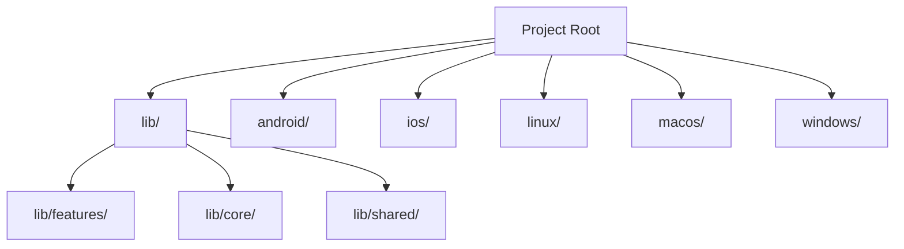
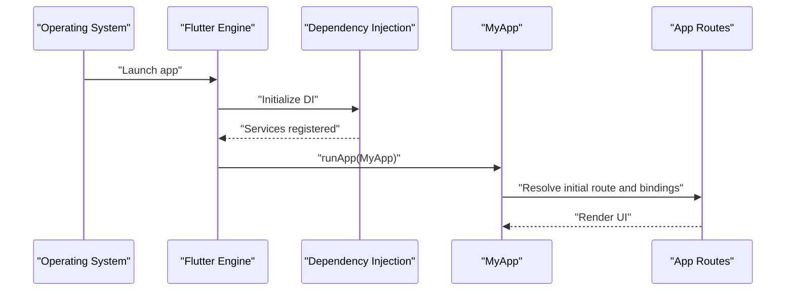
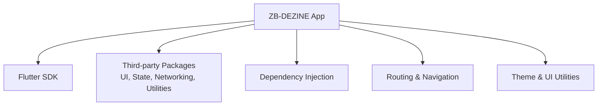

# Getting Started

<cite>
**Referenced Files in This Document**
- [pubspec.yaml](file://pubspec.yaml)
- [README.md](file://README.md)
- [lib/main.dart](file://lib/main.dart)
- [android/app/src/main/kotlin/com/example/zb_dezign/MainActivity.kt](file://android/app/src/main/kotlin/com/example/zb_dezign/MainActivity.kt)
- [ios/Runner/AppDelegate.swift](file://ios/Runner/AppDelegate.swift)
- [android/local.properties](file://android/local.properties)
- [ios/Podfile](file://ios/Podfile)
- [analysis_options.yaml](file://analysis_options.yaml)
- [test/widget_test.dart](file://test/widget_test.dart)
- [android/app/build.gradle.kts](file://android/app/build.gradle.kts)
- [android/build.gradle.kts](file://android/build.gradle.kts)
- [android/gradle.properties](file://android/gradle.properties)
- [android/gradlew.bat](file://android/gradlew.bat)
</cite>

## Table of Contents
1. [Introduction](#introduction)
2. [Project Structure](#project-structure)
3. [Core Components](#core-components)
4. [Architecture Overview](#architecture-overview)
5. [Detailed Component Analysis](#detailed-component-analysis)
6. [Dependency Analysis](#dependency-analysis)
7. [Performance Considerations](#performance-considerations)
8. [Troubleshooting Guide](#troubleshooting-guide)
9. [Conclusion](#conclusion)
10. [Appendices](#appendices)

## Introduction
This guide helps you set up and run the ZB-DEZINE Flutter project locally. It covers prerequisites, environment setup for Android Studio and VS Code, installing dependencies, running the app on emulators and physical devices, debugging and testing, and resolving common setup issues.

## Project Structure
ZB-DEZINE is a Flutter application with platform integration for Android and iOS, plus support for desktop platforms (Linux, macOS, Windows). The project follows a modular structure under lib/, organized by features and shared/core modules. Platform-specific code resides under android/, ios/, linux/, macos/, and windows/.

**Section sources**
- [lib/main.dart:12-47](file://lib/main.dart#L12-L47)

## Core Components
- Entry point: The app initializes Flutter binding, sets up dependency injection, and runs the app with routing and theming.
- Routing and DI: The app uses a dependency injection module and route definitions to manage navigation and state.
- Theming: Light and dark themes are configured and controlled via a theme controller.

Key entry points and initialization:
- Application bootstrap and DI initialization occur in the main entry point.
- Theme and routing are wired through the app’s theme controller and route definitions.

**Section sources**
- [lib/main.dart:12-47](file://lib/main.dart#L12-L47)

## Architecture Overview
The app initializes the Flutter engine, sets up dependency injection, and boots the UI with theme-aware routing. The UI uses a screen utility for responsive layouts and a reactive state management library for UI updates.

**Diagram sources**
- [lib/main.dart:12-47](file://lib/main.dart#L12-L47)

**Section sources**
- [lib/main.dart:12-47](file://lib/main.dart#L12-L47)

## Detailed Component Analysis

### Prerequisites and Environment Setup
- Flutter SDK: The project requires a specific Dart SDK version declared in pubspec.yaml.
- Android Studio/VS Code: Install Android Studio or VS Code with Flutter/Dart extensions.
- Android: JDK 17 compatibility is configured in Gradle; Android SDK paths are defined in local.properties.
- iOS: Xcode and CocoaPods are required; the Podfile coordinates Flutter pods.

Verification steps:
- Confirm Flutter SDK version alignment with the environment constraint.
- Ensure Android Studio recognizes the Android SDK path and JDK 17.
- Ensure Xcode and CocoaPods are installed for iOS builds.

**Section sources**
- [pubspec.yaml:21-23](file://pubspec.yaml#L21-L23)
- [android/gradle.properties:1-3](file://android/gradle.properties#L1-L3)
- [android/local.properties:1-5](file://android/local.properties#L1-L5)
- [ios/Podfile:1-44](file://ios/Podfile#L1-L44)

### Installing Dependencies
- Install dependencies via pubspec.yaml:
  - Run the standard Flutter dependency installation command.
  - For iOS, run CocoaPods setup after fetching dependencies.
- Verify:
  - No dependency conflicts.
  - Pods installed successfully for iOS.

**Section sources**
- [pubspec.yaml:30-71](file://pubspec.yaml#L30-L71)
- [ios/Podfile:26-37](file://ios/Podfile#L26-L37)

### Running the App Locally
- Android:
  - Connect an Android device or start an emulator.
  - Run the Flutter application in debug mode.
- iOS:
  - Connect an iOS device or start an iOS simulator.
  - Ensure CocoaPods are installed and run the app from Xcode or Flutter CLI.
- Desktop:
  - Linux/macOS/Windows are supported; run with the respective Flutter desktop commands.

Quick commands:
- Flutter run (default platform)
- flutter run -d <device-id> (select device/emulator)
- flutter run --release (release mode)

**Section sources**
- [lib/main.dart:12-19](file://lib/main.dart#L12-L19)
- [android/app/build.gradle.kts:8-44](file://android/app/build.gradle.kts#L8-L44)
- [ios/Podfile:30-37](file://ios/Podfile#L30-L37)

### Platform-Specific Configuration

#### Android
- Application ID and SDK versions are defined in Gradle.
- Java 17 compatibility is enforced for compilation and Kotlin options.
- Signing config defaults to debug for quick local runs.

Recommended checks:
- Ensure the Android SDK path in local.properties is correct.
- Confirm Gradle sync succeeds and no missing dependencies.

**Section sources**
- [android/app/build.gradle.kts:8-44](file://android/app/build.gradle.kts#L8-L44)
- [android/gradle.properties:1-3](file://android/gradle.properties#L1-L3)
- [android/local.properties:1-5](file://android/local.properties#L1-L5)

#### iOS
- The Podfile integrates Flutter pods and sets up iOS targets.
- Ensure CocoaPods is installed and run pod install from the ios/ directory.
- The AppDelegate registers plugins during app launch.

**Section sources**
- [ios/Podfile:13-37](file://ios/Podfile#L13-L37)
- [ios/Runner/AppDelegate.swift:1-14](file://ios/Runner/AppDelegate.swift#L1-L14)

### Development Workflow
- Hot reload: Use the Flutter dev tooling to apply code changes instantly during development.
- Debugging:
  - Android Studio: Attach a debugger to the running process.
  - VS Code: Use the Flutter extension to start and debug.
- Testing:
  - Unit and widget tests are supported by the test package.
  - The existing widget test demonstrates a basic smoke test pattern.

**Section sources**
- [test/widget_test.dart:13-31](file://test/widget_test.dart#L13-L31)
- [analysis_options.yaml:8-29](file://analysis_options.yaml#L8-L29)

### Quick Start Examples
- Run on Android emulator or device:
  - flutter run
- Run on iOS simulator or device:
  - flutter run (after CocoaPods setup)
- Run on desktop:
  - flutter run -d linux (or macos/windows)

**Section sources**
- [lib/main.dart:12-19](file://lib/main.dart#L12-L19)

## Dependency Analysis
The project declares Flutter SDK and a wide range of third-party packages for UI, networking, state management, and utilities. The dependency graph focuses on the core runtime and plugin integrations.

**Diagram sources**
- [pubspec.yaml:30-71](file://pubspec.yaml#L30-L71)
- [lib/main.dart:12-47](file://lib/main.dart#L12-L47)

**Section sources**
- [pubspec.yaml:30-71](file://pubspec.yaml#L30-L71)
- [lib/main.dart:12-47](file://lib/main.dart#L12-L47)

## Performance Considerations
- Keep dependencies updated and aligned with Flutter releases.
- Use release builds for performance profiling and benchmarking.
- Minimize heavy computations on the UI thread; leverage asynchronous operations and caching where appropriate.

[No sources needed since this section provides general guidance]

## Troubleshooting Guide
Common setup issues and resolutions:

- Dart SDK version mismatch
  - Symptom: Flutter doctor reports incompatible Dart SDK.
  - Resolution: Align your Flutter SDK with the version constraint in pubspec.yaml.

- Android SDK path not found
  - Symptom: Gradle cannot locate the Android SDK.
  - Resolution: Update the sdk.dir path in android/local.properties to your Android SDK location.

- CocoaPods not installed (iOS)
  - Symptom: iOS build fails due to missing pods.
  - Resolution: Install CocoaPods and run pod install from the ios/ directory.

- Java/Kotlin compatibility
  - Symptom: Compilation errors related to Java version.
  - Resolution: Ensure JDK 17 is installed and selected; confirm Gradle and Kotlin options align.

- Flutter doctor warnings
  - Symptom: Doctor shows unmet requirements.
  - Resolution: Install missing tools (Android Studio/Xcode, emulators/simulators) and accept licenses.

**Section sources**
- [pubspec.yaml:21-23](file://pubspec.yaml#L21-L23)
- [android/local.properties:1-5](file://android/local.properties#L1-L5)
- [ios/Podfile:13-26](file://ios/Podfile#L13-L26)
- [android/gradle.properties:1-3](file://android/gradle.properties#L1-L3)
- [android/gradlew.bat:27-46](file://android/gradlew.bat#L27-L46)

## Conclusion
You now have the essentials to install dependencies, configure Android and iOS environments, run the app locally, and develop with hot reload and debugging. Use the troubleshooting section to resolve common setup issues quickly.

[No sources needed since this section summarizes without analyzing specific files]

## Appendices

### Appendix A: Flutter and Dart Versions
- Dart SDK requirement is defined in the project configuration.

**Section sources**
- [pubspec.yaml:21-23](file://pubspec.yaml#L21-L23)

### Appendix B: Android Build Configuration Highlights
- Java 17 compatibility and Flutter integration via Gradle.
- Default debug signing configuration for local development.

**Section sources**
- [android/app/build.gradle.kts:13-20](file://android/app/build.gradle.kts#L13-L20)
- [android/app/build.gradle.kts:33-39](file://android/app/build.gradle.kts#L33-L39)

### Appendix C: iOS Podfile Highlights
- Flutter pod setup and iOS target configuration.
- Post-install build settings application.

**Section sources**
- [ios/Podfile:26-43](file://ios/Podfile#L26-L43)