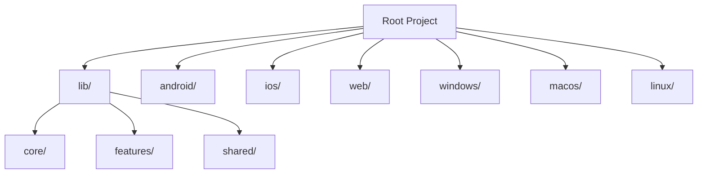
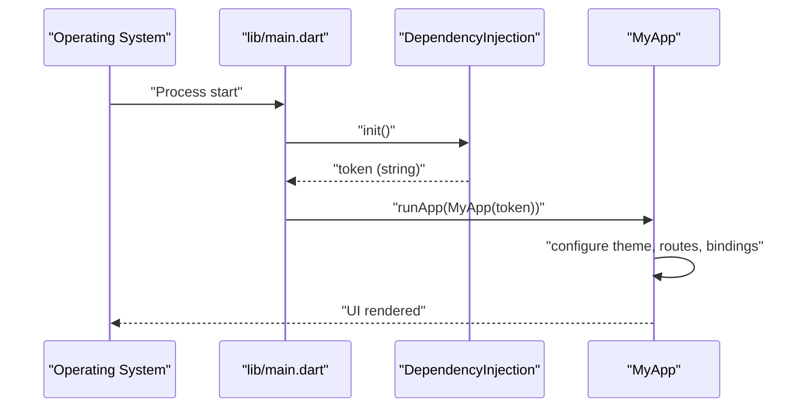
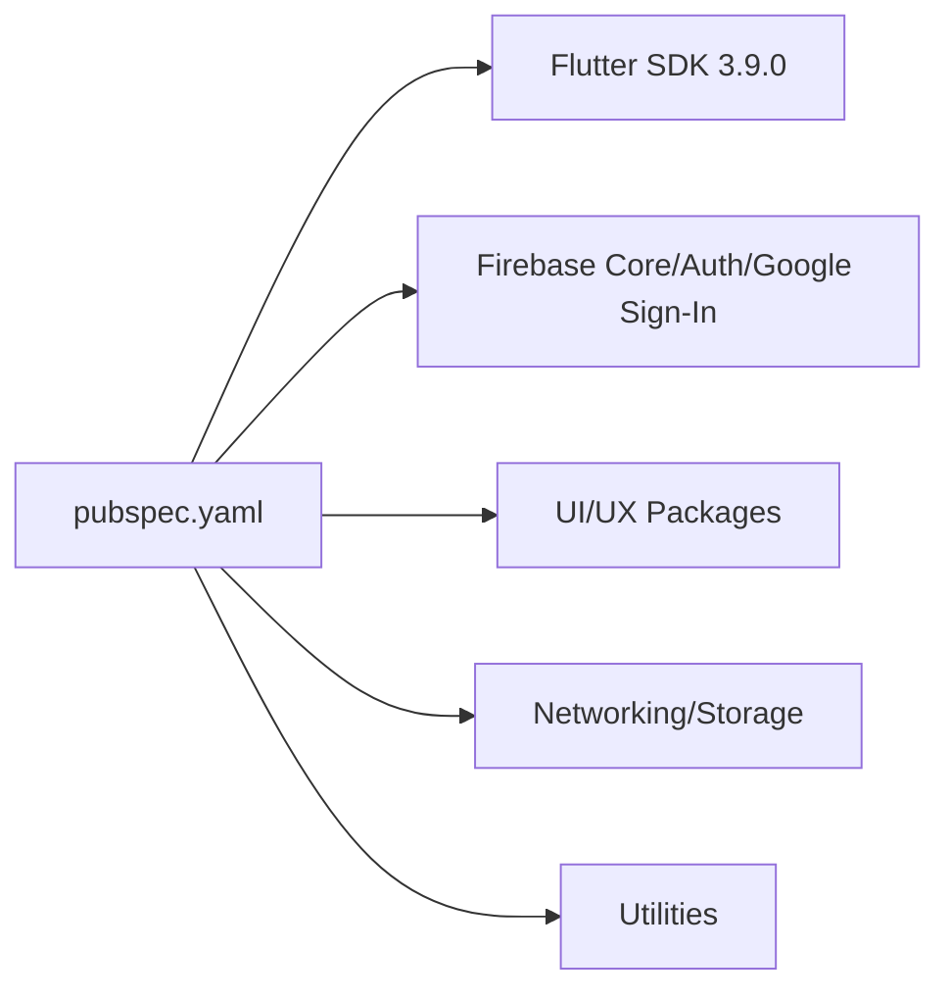

# Getting Started

<cite>
**Referenced Files in This Document**
- [pubspec.yaml](file://pubspec.yaml)
- [README.md](file://README.md)
- [lib/main.dart](file://lib/main.dart)
- [lib/core/di/dependency_injection.dart](file://lib/core/di/dependency_injection.dart)
- [android/app/src/main/kotlin/zbdezign/com/au/MainActivity.kt](file://android/app/src/main/kotlin/zbdezign/com/au/MainActivity.kt)
- [ios/Runner/AppDelegate.swift](file://ios/Runner/AppDelegate.swift)
- [macos/Runner/AppDelegate.swift](file://macos/Runner/AppDelegate.swift)
- [windows/flutter/generated_plugin_registrant.cc](file://windows/flutter/generated_plugin_registrant.cc)
- [linux/CMakeLists.txt](file://linux/CMakeLists.txt)
- [web/index.html](file://web/index.html)
</cite>

## Table of Contents
1. [Introduction](#introduction)
2. [Project Structure](#project-structure)
3. [Core Components](#core-components)
4. [Architecture Overview](#architecture-overview)
5. [Detailed Component Analysis](#detailed-component-analysis)
6. [Dependency Analysis](#dependency-analysis)
7. [Performance Considerations](#performance-considerations)
8. [Troubleshooting Guide](#troubleshooting-guide)
9. [Conclusion](#conclusion)
10. [Appendices](#appendices)

## Introduction
This guide helps you set up the ZB-DEZINE Flutter project locally, configure development tools, and run the app across Android, iOS, Web, Windows, macOS, and Linux. It covers prerequisites, cloning, dependency installation, platform-specific setup, environment configuration, and first-run steps. The project uses Flutter SDK 3.9.0 and integrates Firebase for authentication and core services.

## Project Structure
ZB-DEZINE follows a standard Flutter layout with platform-specific folders and a modular Dart codebase. Key areas:
- lib: Dart application code, organized into core, features, and shared modules
- android, ios, macos, windows, linux: Platform-specific native integrations
- web: Web assets and HTML bootstrap
- pubspec.yaml: Dependencies, assets, and Flutter metadata

**Section sources**
- [README.md:1-17](file://README.md#L1-L17)
- [pubspec.yaml:1-118](file://pubspec.yaml#L1-L118)

## Core Components
- Entry point: The app starts in lib/main.dart, initializes dependency injection, and boots the app shell.
- Dependency Injection: Initializes storage, theme services, network clients, and reads a token from persistent storage to decide initial routes.
- Platform Entrypoints:
  - Android: MainActivity.kt
  - iOS/macOS: AppDelegate.swift
  - Windows/Linux: Generated plugin registration indicates native plugin wiring

What to expect on first run:
- Dependency injection initializes services and reads a token from storage.
- The app conditionally sets the initial route based on whether a token exists.

**Section sources**
- [lib/main.dart:12-47](file://lib/main.dart#L12-L47)
- [lib/core/di/dependency_injection.dart:11-26](file://lib/core/di/dependency_injection.dart#L11-L26)

## Architecture Overview
High-level runtime flow:
- main.dart initializes Flutter binding, runs dependency injection, and launches MyApp.
- MyApp configures screen utilities, theme controller, and routing based on token presence.
- DependencyInjection wires storage, theme, and network services.

**Diagram sources**
- [lib/main.dart:12-47](file://lib/main.dart#L12-L47)
- [lib/core/di/dependency_injection.dart:11-26](file://lib/core/di/dependency_injection.dart#L11-L26)

**Section sources**
- [lib/main.dart:12-47](file://lib/main.dart#L12-L47)
- [lib/core/di/dependency_injection.dart:11-26](file://lib/core/di/dependency_injection.dart#L11-L26)

## Detailed Component Analysis

### Prerequisites
- Flutter SDK: Version constraint requires Flutter SDK 3.9.0.
- Dart SDK: Matches Flutter’s Dart SDK requirement.
- IDE: Recommended to use Android Studio or VS Code with Flutter/Dart plugins.
- Platform SDKs:
  - Android: Android SDK, Gradle wrapper configured
  - iOS: Xcode and CocoaPods
  - Web: No extra tooling required beyond Flutter
  - Windows/macOS/Linux: Desktop support enabled via platform folders

Install Flutter and set up your environment per official instructions, then verify with:
- flutter doctor

**Section sources**
- [pubspec.yaml:21-23](file://pubspec.yaml#L21-L23)

### Step-by-Step Setup

1) Clone the repository
- Use git clone <repository-url> and navigate into the project directory.

2) Install dependencies
- Run flutter pub get to fetch Dart dependencies defined in pubspec.yaml.

3) Configure platform targets
- Android: Open android/ in Android Studio or run flutter devices to detect AVD/physical device.
- iOS: Open ios/Runner.xcworkspace in Xcode; ensure pods are installed (flutter pub get then pod install if needed).
- Web: Run flutter run -d chrome to launch in a browser.
- Windows/macOS/Linux: Ensure desktop toolchain is active; run flutter devices to confirm.

4) First run
- Run flutter run from the project root to launch on the selected device/emulator.

Notes:
- The project declares Firebase dependencies and uses generated plugin registration on Windows, indicating Firebase plugins are wired during build.

**Section sources**
- [pubspec.yaml:61-66](file://pubspec.yaml#L61-L66)
- [windows/flutter/generated_plugin_registrant.cc:13-20](file://windows/flutter/generated_plugin_registrant.cc#L13-L20)

### Platform-Specific Setup

- Android
  - MainActivity.kt is the primary activity entrypoint.
  - Ensure Android SDK and emulator/device are available.
  - Build variants are supported via Gradle; flutter build apk or flutter build appbundle for release.

- iOS
  - AppDelegate.swift registers plugins and handles app lifecycle.
  - Use Xcode workspace under ios/Runner.xcworkspace.
  - Install pods if prompted after flutter pub get.

- Web
  - web/index.html bootstraps the Flutter web app.
  - Run flutter run -d chrome or flutter build web for production.

- Windows
  - Generated plugin registration includes Firebase plugins.
  - Use flutter build windows or flutter run -d windows.

- macOS
  - AppDelegate.swift manages macOS lifecycle.
  - Use flutter build macos or flutter run -d macos.

- Linux
  - CMakeLists.txt configures the Linux desktop build.
  - Use flutter build linux or flutter run -d linux.

**Section sources**
- [android/app/src/main/kotlin/zbdezign/com/au/MainActivity.kt:1-6](file://android/app/src/main/kotlin/zbdezign/com/au/MainActivity.kt#L1-L6)
- [ios/Runner/AppDelegate.swift:1-14](file://ios/Runner/AppDelegate.swift#L1-L14)
- [macos/Runner/AppDelegate.swift:1-14](file://macos/Runner/AppDelegate.swift#L1-L14)
- [windows/flutter/generated_plugin_registrant.cc:13-20](file://windows/flutter/generated_plugin_registrant.cc#L13-L20)
- [linux/CMakeLists.txt:1-129](file://linux/CMakeLists.txt#L1-L129)
- [web/index.html:1-39](file://web/index.html#L1-L39)

### Initial Configuration and Environment Variables
- Assets: Images and icons are declared in pubspec.yaml under flutter.assets.
- Theme and routing: MyApp configures theme, dark/light modes, and initial route based on token availability.
- Token-driven routing: DependencyInjection reads a token from storage to choose onboarding or home routes.

Environment variables:
- The project does not define explicit environment variables in the provided files. If you require environment-specific configuration, consider adding a .env file and loading it via a configuration package, then initializing it early in main.dart before runApp.

**Section sources**
- [pubspec.yaml:88-92](file://pubspec.yaml#L88-L92)
- [lib/main.dart:21-47](file://lib/main.dart#L21-L47)
- [lib/core/di/dependency_injection.dart:11-26](file://lib/core/di/dependency_injection.dart#L11-L26)

### Essential Commands
- flutter pub get: Install dependencies
- flutter run: Launch on default device/emulator
- flutter run -d chrome: Launch Web
- flutter build apk / flutter build appbundle: Android release
- flutter build ios --release: iOS release
- flutter build web: Web release
- flutter build windows / flutter build macos / flutter build linux: Desktop releases

[No sources needed since this section lists general commands]

## Dependency Analysis
The project relies on Flutter SDK 3.9.0 and a curated set of Dart packages. Notable categories:
- UI and UX: get, flutter_screenutil, google_fonts, glassmorphism, animate_do
- Networking: http, cached_network_image, image_picker
- State and navigation: get, get_storage
- Charts and UI helpers: fl_chart, badges, timeline_tile, convex_bottom_bar
- Internationalization: intl, table_calendar
- Authentication and Firebase: firebase_core, firebase_auth, google_sign_in
- Utilities: fpdart, flutter_typeahead, flutter_otp_text_field, intl_phone_field

**Diagram sources**
- [pubspec.yaml:30-66](file://pubspec.yaml#L30-L66)

**Section sources**
- [pubspec.yaml:30-66](file://pubspec.yaml#L30-L66)

## Performance Considerations
- Keep dependencies updated regularly using flutter pub upgrade.
- Use flutter build modes appropriately (Profile/Release) for performance testing.
- Optimize asset sizes and leverage caching for network images.
- Minimize heavy computations on the UI thread; delegate to background isolates when needed.

[No sources needed since this section provides general guidance]

## Troubleshooting Guide
Common issues and resolutions:
- Flutter doctor reports missing platform tooling
  - Install Android Studio/Xcode, Android SDK/NDK, CocoaPods, and desktop toolchains as needed.
- Firebase-related errors on desktop
  - Ensure Firebase initialization is handled gracefully; desktop Firebase plugins are registered via generated plugin registration.
- iOS pods failures
  - Run flutter pub get followed by pod install in ios/ and reopen ios/Runner.xcworkspace.
- Android build failures
  - Verify Gradle and Android SDK paths; sync Gradle wrapper and accept licenses.
- Web build issues
  - Confirm web is enabled and index.html is present; rebuild with flutter build web.

**Section sources**
- [windows/flutter/generated_plugin_registrant.cc:13-20](file://windows/flutter/generated_plugin_registrant.cc#L13-L20)
- [web/index.html:1-39](file://web/index.html#L1-L39)

## Conclusion
You now have the essentials to clone, configure, and run ZB-DEZINE across multiple platforms. Start with flutter pub get and flutter run, then expand into platform-specific workflows. For advanced setups, integrate environment variables and tailor routing and theme logic as needed.

[No sources needed since this section summarizes without analyzing specific files]

## Appendices

### Appendix A: Quick Start Checklist
- Install Flutter SDK 3.9.0
- Install platform toolchains (Android/iOS/Web/Desktop)
- flutter pub get
- flutter run

[No sources needed since this section provides general guidance]