# Data Models

<cite>
**Referenced Files in This Document**
- [error_model.dart](file://lib/core/data/global_models/error_model.dart)
- [user_profile_model.dart](file://lib/core/data/global_models/user_profile_model.dart)
- [get_network.dart](file://lib/core/data/networks/get_network.dart)
- [post_with_response.dart](file://lib/core/data/networks/post_with_response.dart)
- [storage_service.dart](file://lib/core/data/local/storage_service.dart)
- [rental_details_model.dart](file://lib/features/rental/models/rental_details_model.dart)
- [rentals_model.dart](file://lib/features/rental/models/rentals_model.dart)
- [products_model.dart](file://lib/features/home/models/products_model.dart)
- [orders_model.dart](file://lib/features/order/models/orders_model.dart)
- [login_model.dart](file://lib/features/auth/models/login_model.dart)
- [register_model.dart](file://lib/features/auth/models/register_model.dart)
- [ai_design_model.dart](file://lib/features/ai_design/models/ai_design_model.dart)
</cite>

## Table of Contents
1. [Introduction](#introduction)
2. [Project Structure](#project-structure)
3. [Core Components](#core-components)
4. [Architecture Overview](#architecture-overview)
5. [Detailed Component Analysis](#detailed-component-analysis)
6. [Dependency Analysis](#dependency-analysis)
7. [Performance Considerations](#performance-considerations)
8. [Troubleshooting Guide](#troubleshooting-guide)
9. [Conclusion](#conclusion)
10. [Appendices](#appendices)

## Introduction
This document describes ZB-DEZINE’s data models and schemas, focusing on:
- Error model structure, error codes/messages, and handling patterns
- User profile model with fields, validation rules, and serialization methods
- Model inheritance patterns, field types, and relationships between models
- Examples of model instantiation, JSON serialization/deserialization, and validation workflows
- Model lifecycle, immutability patterns, and best practices for data manipulation
- Model versioning, backward compatibility, and migration strategies

## Project Structure
The data modeling layer is organized around:
- Global models under core for cross-cutting concerns (error model, user profile)
- Feature-specific models grouped by feature folders (e.g., rental, home, order, auth)
- Networking utilities that deserialize responses into typed models
- Local storage service for persistence of tokens and keys

```mermaid
graph TB
subgraph "Core"
EM["ErrorModel<br/>lib/core/data/global_models/error_model.dart"]
UP["UserProfileModel/Data<br/>lib/core/data/global_models/user_profile_model.dart"]
ST["StorageService<br/>lib/core/data/local/storage_service.dart"]
end
subgraph "Networking"
GN["GetNetwork.getData<br/>lib/core/data/networks/get_network.dart"]
PWR["PostWithResponse.postData<br/>lib/core/data/networks/post_with_response.dart"]
end
subgraph "Features"
RDM["RentalDetailsModel<br/>lib/features/rental/models/rental_details_model.dart"]
RM["RentalsModel/RentalData<br/>lib/features/rental/models/rentals_model.dart"]
PM["ProductsModel/Product<br/>lib/features/home/models/products_model.dart"]
OM["OrdersModel/OrderData<br/>lib/features/order/models/orders_model.dart"]
LGM["LoginModel/User<br/>lib/features/auth/models/login_model.dart"]
REGM["RegisterModel/User<br/>lib/features/auth/models/register_model.dart"]
ADM["AiDesignModel<br/>lib/features/ai_design/models/ai_design_model.dart"]
end
GN --> EM
PWR --> EM
RDM --> EM
RM --> EM
PM --> EM
OM --> EM
LGM --> EM
REGM --> EM
ADM --> EM
ST --> EM
```

**Diagram sources**
- [error_model.dart:1-15](file://lib/core/data/global_models/error_model.dart#L1-L15)
- [user_profile_model.dart:1-72](file://lib/core/data/global_models/user_profile_model.dart#L1-L72)
- [get_network.dart:1-41](file://lib/core/data/networks/get_network.dart#L1-L41)
- [post_with_response.dart:1-45](file://lib/core/data/networks/post_with_response.dart#L1-L45)
- [storage_service.dart:1-23](file://lib/core/data/local/storage_service.dart#L1-L23)
- [rental_details_model.dart:1-581](file://lib/features/rental/models/rental_details_model.dart#L1-L581)
- [rentals_model.dart:1-108](file://lib/features/rental/models/rentals_model.dart#L1-L108)
- [products_model.dart:1-300](file://lib/features/home/models/products_model.dart#L1-L300)
- [orders_model.dart:1-400](file://lib/features/order/models/orders_model.dart#L1-L400)
- [login_model.dart:1-100](file://lib/features/auth/models/login_model.dart#L1-L100)
- [register_model.dart:1-100](file://lib/features/auth/models/register_model.dart#L1-L100)
- [ai_design_model.dart:1-12](file://lib/features/ai_design/models/ai_design_model.dart#L1-L12)

**Section sources**
- [error_model.dart:1-15](file://lib/core/data/global_models/error_model.dart#L1-L15)
- [user_profile_model.dart:1-72](file://lib/core/data/global_models/user_profile_model.dart#L1-L72)
- [get_network.dart:1-41](file://lib/core/data/networks/get_network.dart#L1-L41)
- [post_with_response.dart:1-45](file://lib/core/data/networks/post_with_response.dart#L1-L45)
- [storage_service.dart:1-23](file://lib/core/data/local/storage_service.dart#L1-L23)
- [rental_details_model.dart:1-581](file://lib/features/rental/models/rental_details_model.dart#L1-L581)
- [rentals_model.dart:1-108](file://lib/features/rental/models/rentals_model.dart#L1-L108)
- [products_model.dart:1-300](file://lib/features/home/models/products_model.dart#L1-L300)
- [orders_model.dart:1-400](file://lib/features/order/models/orders_model.dart#L1-L400)
- [login_model.dart:1-100](file://lib/features/auth/models/login_model.dart#L1-L100)
- [register_model.dart:1-100](file://lib/features/auth/models/register_model.dart#L1-L100)
- [ai_design_model.dart:1-12](file://lib/features/ai_design/models/ai_design_model.dart#L1-L12)

## Core Components
This section documents the foundational models and their roles.

- ErrorModel
  - Purpose: Encapsulates HTTP error responses and unknown errors
  - Fields: statusCode (nullable Int), message (String)
  - Factories:
    - fromHttp(statusCode, bodyMessage): constructs from HTTP response
    - fromUnknown(): constructs a default “Unknown Error” with status 500
  - Usage: Returned via Either<ErrorModel, T> from networking utilities

- UserProfileModel and Data
  - Purpose: Represents user profile payload returned by backend
  - UserProfileModel
    - Fields: data (Data?)
    - Serialization: toJson()/fromJson() with nested Data serialization
  - Data
    - Fields: id, name, email, phone, abn, type, status, emailVerifiedAt, createdAt, updatedAt
    - Serialization: toJson()/fromJson() mapping snake_case to camelCase and vice versa

- StorageService
  - Purpose: Provides simple key-value persistence using GetStorage
  - Methods: read<T>(key), write(key, value), remove(key), clear()

**Section sources**
- [error_model.dart:1-15](file://lib/core/data/global_models/error_model.dart#L1-L15)
- [user_profile_model.dart:1-72](file://lib/core/data/global_models/user_profile_model.dart#L1-L72)
- [storage_service.dart:1-23](file://lib/core/data/local/storage_service.dart#L1-L23)

## Architecture Overview
The data flow follows a predictable pattern:
- Networking layer performs HTTP requests and deserializes into typed models
- On success, Right(model) is returned
- On failure, Left(ErrorModel) is returned
- UI and business logic handle Either outcomes accordingly

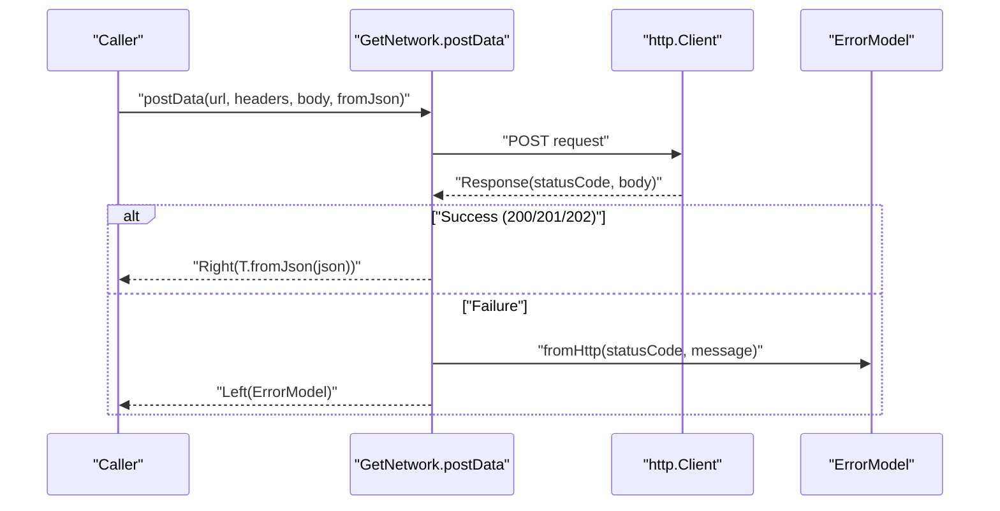

**Diagram sources**
- [post_with_response.dart:1-45](file://lib/core/data/networks/post_with_response.dart#L1-L45)
- [error_model.dart:1-15](file://lib/core/data/global_models/error_model.dart#L1-L15)

**Section sources**
- [get_network.dart:1-41](file://lib/core/data/networks/get_network.dart#L1-L41)
- [post_with_response.dart:1-45](file://lib/core/data/networks/post_with_response.dart#L1-L45)

## Detailed Component Analysis

### Error Model
- Structure
  - statusCode: nullable integer representing HTTP status
  - message: human-readable error message
- Factories
  - fromHttp(statusCode, bodyMessage): maps HTTP status and message
  - fromUnknown(): default fallback error
- Handling Pattern
  - Networking utilities wrap results in Either<ErrorModel, T>
  - UI checks Left for error rendering and Right for success handling

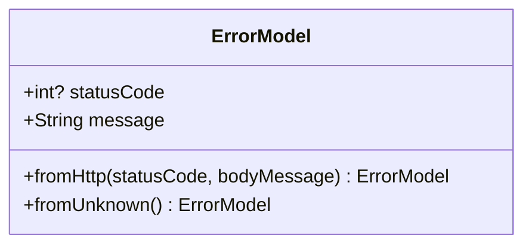

**Diagram sources**
- [error_model.dart:1-15](file://lib/core/data/global_models/error_model.dart#L1-L15)

**Section sources**
- [error_model.dart:1-15](file://lib/core/data/global_models/error_model.dart#L1-L15)
- [get_network.dart:25-38](file://lib/core/data/networks/get_network.dart#L25-L38)
- [post_with_response.dart:29-42](file://lib/core/data/networks/post_with_response.dart#L29-L42)

### User Profile Model
- Structure
  - UserProfileModel: top-level wrapper with optional Data
  - Data: user attributes including identifiers, contact info, metadata
- Serialization
  - toJson()/fromJson() convert between JSON and model instances
  - Field mapping handles snake_case vs camelCase differences
- Validation Rules
  - No explicit validation logic in model; validation typically occurs at input boundaries (e.g., forms) and/or server-side
- Lifecycle
  - Typically instantiated via fromJson() after network fetch
  - Serialized to JSON for persistence or API updates

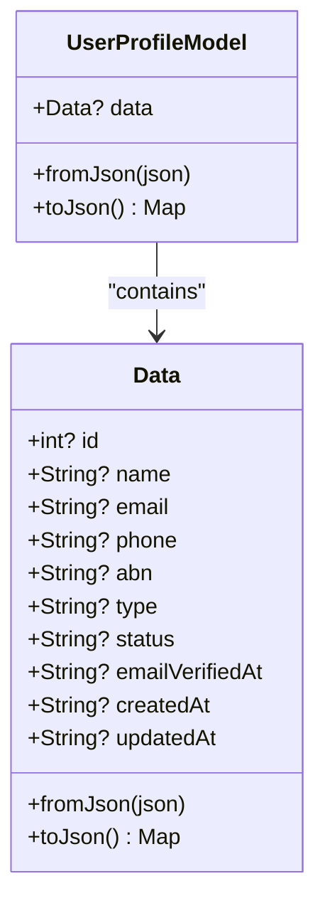

**Diagram sources**
- [user_profile_model.dart:1-72](file://lib/core/data/global_models/user_profile_model.dart#L1-L72)

**Section sources**
- [user_profile_model.dart:1-72](file://lib/core/data/global_models/user_profile_model.dart#L1-L72)

### Networking Utilities and Error Handling
- GetNetwork.getData<T>
  - Accepts a fromJson factory and returns Either<ErrorModel, T>
  - Success: parses JSON and returns Right(model)
  - Failure: constructs ErrorModel from HTTP body or falls back to Unknown
- PostWithResponse.postData<T>
  - Same pattern for POST requests
- Best Practices
  - Always handle Either on the caller side
  - Log/print only for diagnostics; surface user-friendly messages

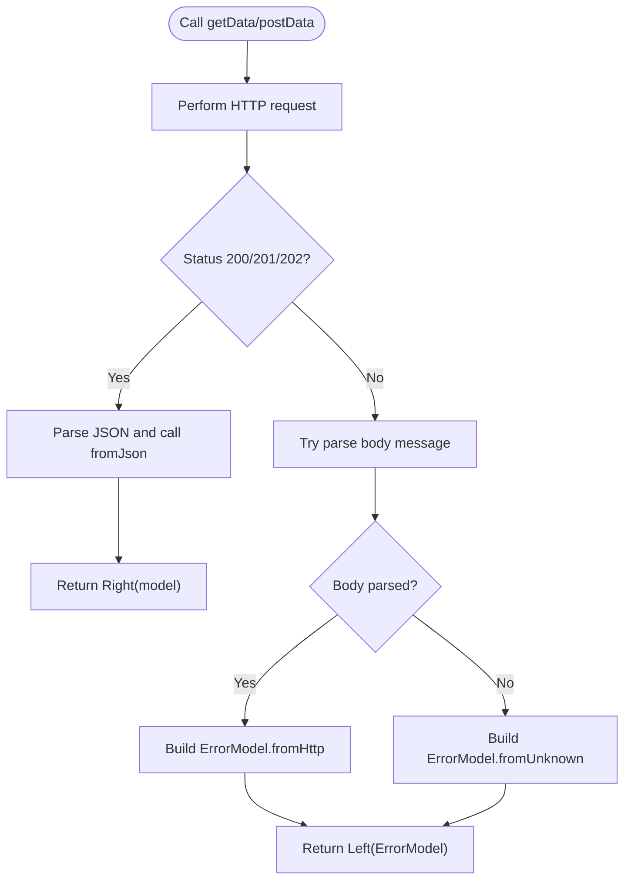

**Diagram sources**
- [get_network.dart:14-39](file://lib/core/data/networks/get_network.dart#L14-L39)
- [post_with_response.dart:14-43](file://lib/core/data/networks/post_with_response.dart#L14-L43)
- [error_model.dart:5-13](file://lib/core/data/global_models/error_model.dart#L5-L13)

**Section sources**
- [get_network.dart:1-41](file://lib/core/data/networks/get_network.dart#L1-L41)
- [post_with_response.dart:1-45](file://lib/core/data/networks/post_with_response.dart#L1-L45)

### Feature Models: Inheritance, Composition, and Relationships

#### RentalDetailsModel and Nested Types
- Composition over inheritance: RentalDetailsModel composes multiple nested models (BusinessInfo, SpaceBreakdown, Room, RoomDimension, FurnitureSelection/FurnitureItem, ApplianceSelection/ApplianceItem, RentalTerms/InstallmentSchedule, RentalTerm, DeliverySetup/AccessDetails, AdditionalNotes)
- Null-safety: All nested fields are optional; fromJson() guards against missing keys
- Serialization: toJson() serializes only non-null nested structures

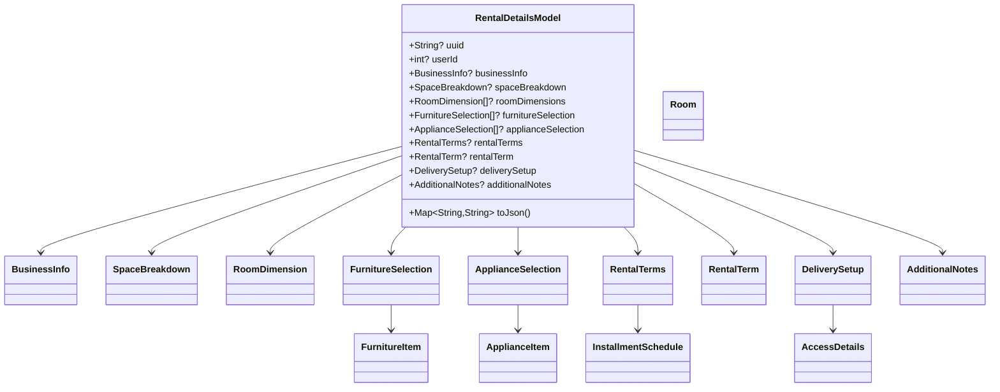

**Diagram sources**
- [rental_details_model.dart:1-581](file://lib/features/rental/models/rental_details_model.dart#L1-L581)

**Section sources**
- [rental_details_model.dart:1-581](file://lib/features/rental/models/rental_details_model.dart#L1-L581)

#### RentalsModel and RentalData
- Structure: RentalsModel wraps a list of RentalData plus pagination metadata
- Serialization: toJson() serializes nested lists and objects when present

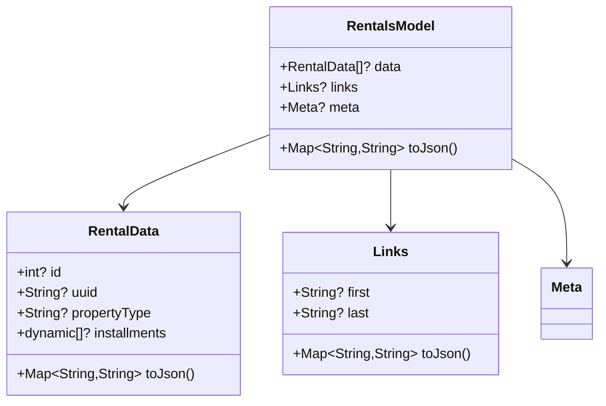

**Diagram sources**
- [rentals_model.dart:1-108](file://lib/features/rental/models/rentals_model.dart#L1-L108)

**Section sources**
- [rentals_model.dart:1-108](file://lib/features/rental/models/rentals_model.dart#L1-L108)

#### ProductsModel and Product
- Structure: ProductsModel contains a list of Product entries; Product composes nested types (Category, FurnitureType, Room, Media, DefaultOptionId)
- Serialization: toJson() serializes nested collections and objects
- Notes: Some numeric fields are cast to double during parsing; ensure consumers handle numeric types consistently

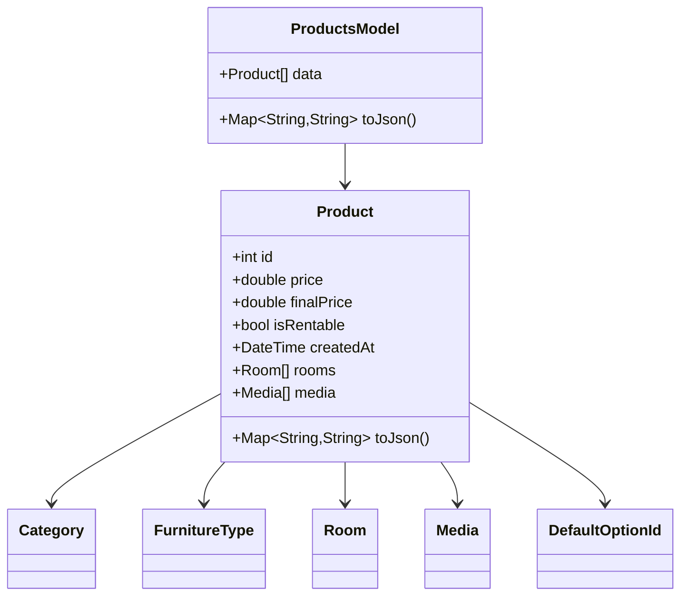

**Diagram sources**
- [products_model.dart:1-300](file://lib/features/home/models/products_model.dart#L1-L300)

**Section sources**
- [products_model.dart:1-300](file://lib/features/home/models/products_model.dart#L1-L300)

#### OrdersModel and OrderData
- Structure: OrdersModel contains a list of OrderData; OrderData composes Address, OrderItem, Option, and StatusHistory
- Serialization: toJson() serializes nested structures and lists

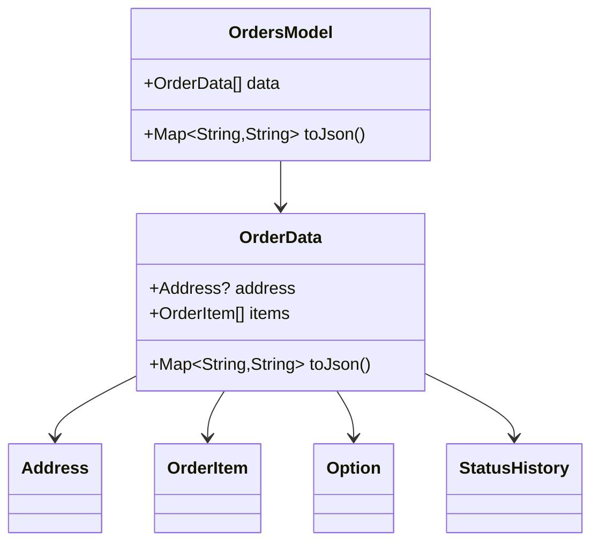

**Diagram sources**
- [orders_model.dart:1-400](file://lib/features/order/models/orders_model.dart#L1-L400)

**Section sources**
- [orders_model.dart:1-400](file://lib/features/order/models/orders_model.dart#L1-L400)

#### Authentication Models
- LoginModel and RegisterModel both define nested User structures and fromJson factories
- Typical usage: instantiate from JSON received from auth endpoints; serialize to send credentials

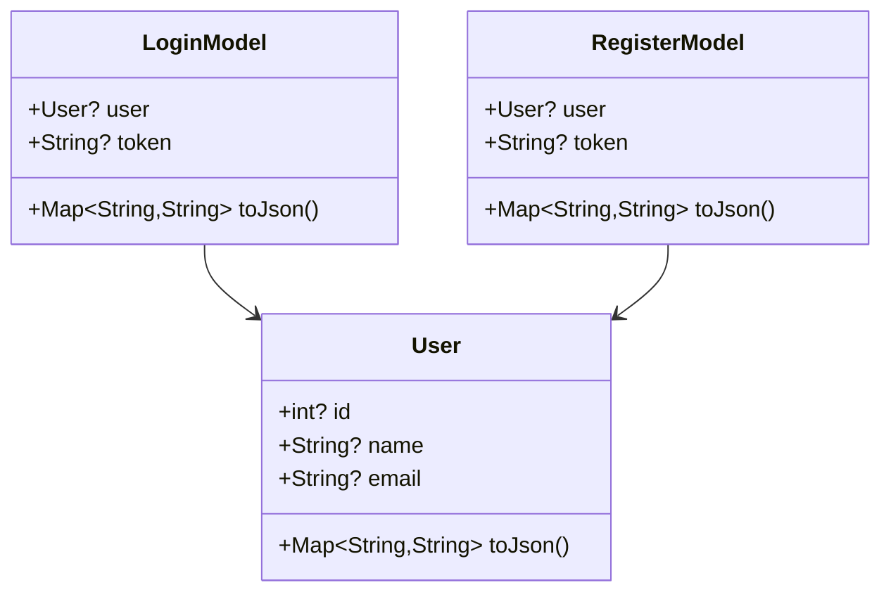

**Diagram sources**
- [login_model.dart:1-100](file://lib/features/auth/models/login_model.dart#L1-L100)
- [register_model.dart:1-100](file://lib/features/auth/models/register_model.dart#L1-L100)

**Section sources**
- [login_model.dart:1-100](file://lib/features/auth/models/login_model.dart#L1-L100)
- [register_model.dart:1-100](file://lib/features/auth/models/register_model.dart#L1-L100)

#### AI Design Model
- Structure: AiDesignModel holds immutable identifiers and timestamps
- Typical usage: lightweight DTO for design generation records

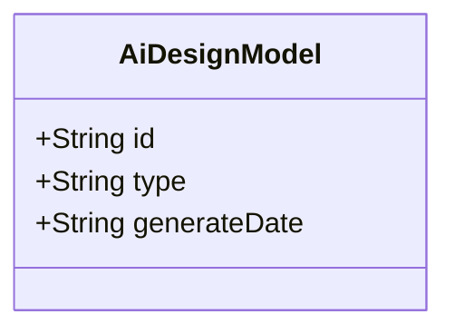

**Diagram sources**
- [ai_design_model.dart:1-12](file://lib/features/ai_design/models/ai_design_model.dart#L1-L12)

**Section sources**
- [ai_design_model.dart:1-12](file://lib/features/ai_design/models/ai_design_model.dart#L1-L12)

### Model Instantiation, Serialization, and Validation Workflows

- Instantiation
  - fromJson(Map<String, dynamic>): construct models from API responses
  - toJson(): serialize models back to JSON for persistence or API requests
- Validation
  - No explicit validation logic in models; rely on:
    - Front-end form validation
    - Backend validation and error responses
    - Type-safe parsing (e.g., numeric casting in ProductsModel)
- Example Patterns
  - Networking: GetNetwork.getData<T>(url, fromJson: T.fromJson)
  - Storage: StorageService.write(key: "token", value: model.token)

**Section sources**
- [user_profile_model.dart:6-16](file://lib/core/data/global_models/user_profile_model.dart#L6-L16)
- [rental_details_model.dart:56-154](file://lib/features/rental/models/rental_details_model.dart#L56-L154)
- [products_model.dart:74-100](file://lib/features/home/models/products_model.dart#L74-L100)
- [get_network.dart:10-20](file://lib/core/data/networks/get_network.dart#L10-L20)
- [storage_service.dart:11-13](file://lib/core/data/local/storage_service.dart#L11-L13)

### Model Lifecycle, Immutability, and Best Practices
- Immutability
  - Many models (e.g., AiDesignModel) are immutable by design (final fields)
  - For mutable models, treat as immutable outside of controlled scopes
- Lifecycle
  - Fetch -> Deserialize -> Validate -> Persist/Display -> Update -> Serialize
- Best Practices
  - Always guard against nulls in fromJson()
  - Keep serialization consistent (snake_case/camelCase mapping)
  - Centralize error handling via ErrorModel and Either
  - Use StorageService for tokens and small primitives

**Section sources**
- [ai_design_model.dart:1-12](file://lib/features/ai_design/models/ai_design_model.dart#L1-L12)
- [error_model.dart:1-15](file://lib/core/data/global_models/error_model.dart#L1-L15)
- [storage_service.dart:1-23](file://lib/core/data/local/storage_service.dart#L1-L23)

### Versioning, Backward Compatibility, and Migration Strategies
- Versioning
  - No explicit version fields observed in models
  - Consider adding a version field to models requiring migrations
- Backward Compatibility
  - fromJson() should safely ignore unknown keys and default missing fields
  - Use nullable fields and optional lists to accommodate evolving APIs
- Migration Strategies
  - Introduce a version discriminator in JSON payloads
  - Maintain multiple fromJson variants per version
  - Provide a migration layer that transforms older structures into current models

[No sources needed since this section provides general guidance]

## Dependency Analysis
- Coupling
  - Networking utilities depend on ErrorModel and accept a fromJson factory
  - Feature models depend on each other through composition (e.g., RentalDetailsModel depends on nested types)
- Cohesion
  - Models are cohesive per feature domain (rental, home, order, auth)
- External Dependencies
  - http, fpdart, get_storage

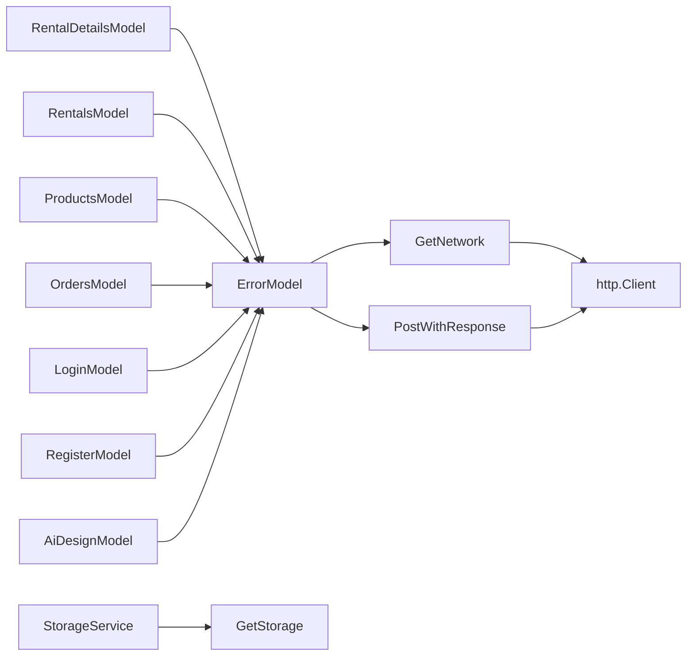

**Diagram sources**
- [get_network.dart:1-41](file://lib/core/data/networks/get_network.dart#L1-L41)
- [post_with_response.dart:1-45](file://lib/core/data/networks/post_with_response.dart#L1-L45)
- [error_model.dart:1-15](file://lib/core/data/global_models/error_model.dart#L1-L15)
- [storage_service.dart:1-23](file://lib/core/data/local/storage_service.dart#L1-L23)
- [rental_details_model.dart:1-581](file://lib/features/rental/models/rental_details_model.dart#L1-L581)
- [rentals_model.dart:1-108](file://lib/features/rental/models/rentals_model.dart#L1-L108)
- [products_model.dart:1-300](file://lib/features/home/models/products_model.dart#L1-L300)
- [orders_model.dart:1-400](file://lib/features/order/models/orders_model.dart#L1-L400)
- [login_model.dart:1-100](file://lib/features/auth/models/login_model.dart#L1-L100)
- [register_model.dart:1-100](file://lib/features/auth/models/register_model.dart#L1-L100)
- [ai_design_model.dart:1-12](file://lib/features/ai_design/models/ai_design_model.dart#L1-L12)

**Section sources**
- [get_network.dart:1-41](file://lib/core/data/networks/get_network.dart#L1-L41)
- [post_with_response.dart:1-45](file://lib/core/data/networks/post_with_response.dart#L1-L45)
- [error_model.dart:1-15](file://lib/core/data/global_models/error_model.dart#L1-L15)
- [storage_service.dart:1-23](file://lib/core/data/local/storage_service.dart#L1-L23)
- [rental_details_model.dart:1-581](file://lib/features/rental/models/rental_details_model.dart#L1-L581)
- [rentals_model.dart:1-108](file://lib/features/rental/models/rentals_model.dart#L1-L108)
- [products_model.dart:1-300](file://lib/features/home/models/products_model.dart#L1-L300)
- [orders_model.dart:1-400](file://lib/features/order/models/orders_model.dart#L1-L400)
- [login_model.dart:1-100](file://lib/features/auth/models/login_model.dart#L1-L100)
- [register_model.dart:1-100](file://lib/features/auth/models/register_model.dart#L1-L100)
- [ai_design_model.dart:1-12](file://lib/features/ai_design/models/ai_design_model.dart#L1-L12)

## Performance Considerations
- Prefer immutable models for thread safety and easier caching
- Avoid deep cloning; reuse nested models when possible
- Minimize JSON parsing overhead by batching requests and reusing parsed structures
- Use lazy initialization for heavy nested structures

[No sources needed since this section provides general guidance]

## Troubleshooting Guide
- ErrorModel.fromHttp
  - Construct errors from HTTP responses; ensure body contains a message field
- ErrorModel.fromUnknown
  - Fallback for unparsable bodies or unexpected exceptions
- Networking failures
  - Inspect statusCode and message
  - Verify base URL and endpoint correctness
- Serialization issues
  - Confirm field name mappings (snake_case vs camelCase)
  - Ensure nested lists and objects are not null when serializing

**Section sources**
- [error_model.dart:5-13](file://lib/core/data/global_models/error_model.dart#L5-L13)
- [get_network.dart:25-38](file://lib/core/data/networks/get_network.dart#L25-L38)
- [post_with_response.dart:29-42](file://lib/core/data/networks/post_with_response.dart#L29-L42)

## Conclusion
ZB-DEZINE’s data models emphasize composability, null-safety, and clear separation of concerns. The global ErrorModel and StorageService provide consistent error handling and persistence. Feature models demonstrate robust serialization patterns and nested composition. Adopting explicit versioning and migration strategies will further strengthen long-term maintainability and backward compatibility.

[No sources needed since this section summarizes without analyzing specific files]

## Appendices
- Example usage patterns
  - Instantiate a model from JSON: model = MyModel.fromJson(json)
  - Serialize a model to JSON: json = model.toJson()
  - Handle network responses: either.fold(onError, onSuccess)
  - Persist tokens: StorageService.write(key: "token", value: token)

[No sources needed since this section provides general guidance]