# Global Models and Utilities

<cite>
**Referenced Files in This Document**
- [main.dart](file://lib/main.dart)
- [pubspec.yaml](file://pubspec.yaml)
- [error_model.dart](file://lib/core/data/global_models/error_model.dart)
- [user_profile_model.dart](file://lib/core/data/global_models/user_profile_model.dart)
- [storage_service.dart](file://lib/core/data/local/storage_service.dart)
- [theme_service.dart](file://lib/core/data/local/theme_service.dart)
- [app_theme.dart](file://lib/core/theme/app_theme.dart)
- [theme_controller.dart](file://lib/core/theme/theme_controller.dart)
- [get_network.dart](file://lib/core/data/networks/get_network.dart)
- [post_with_response.dart](file://lib/core/data/networks/post_with_response.dart)
- [post_without_response.dart](file://lib/core/data/networks/post_without_response.dart)
- [delete_network.dart](file://lib/core/data/networks/delete_network.dart)
- [headers_manager.dart](file://lib/core/data/networks/headers_manager.dart)
- [date_picker.dart](file://lib/core/utils/date_picker.dart)
- [image_picker.dart](file://lib/core/utils/image_picker.dart)
- [custom_primary_button.dart](file://lib/shared/widgets/custom_button/custom_primary_button.dart)
- [custom_secondary_button.dart](file://lib/shared/widgets/custom_button/custom_secondary_button.dart)
- [custom_radio_button.dart](file://lib/shared/widgets/custom_button/custom_radio_button.dart)
- [custom_switch_button.dart](file://lib/shared/widgets/custom_button/custom_switch_button.dart)
- [custom_text_form_field.dart](file://lib/shared/widgets/custom_form_field/custom_text_form_field.dart)
- [custom_date_fields.dart](file://lib/shared/widgets/custom_form_field/custom_date_fields.dart)
- [custom_phone_field.dart](file://lib/shared/widgets/custom_form_field/custom_phone_field.dart)
- [custom_dropdown_menu.dart](file://lib/shared/widgets/custom_dropdown/custom_dropdown_menu.dart)
- [dropdown_input_decoration.dart](file://lib/shared/widgets/custom_dropdown/dropdown_input_decoration.dart)
- [dropdown_menu_item.dart](file://lib/shared/widgets/custom_dropdown/dropdown_menu_item.dart)
- [custom_payment_dropdown.dart](file://lib/shared/widgets/custom_dropdown/custom_payment_dropdown/custom_payment_dropdown.dart)
- [custom_payment_dropdown_item.dart](file://lib/shared/widgets/custom_dropdown/custom_payment_dropdown/custom_payment_dropdown_item.dart)
- [custom_rating_builder.dart](file://lib/shared/widgets/custom_rating/custom_rating_builder.dart)
- [custom_table.dart](file://lib/shared/widgets/custom_table/custom_table.dart)
- [custom_table_header.dart](file://lib/shared/widgets/custom_table/custom_table_header.dart)
- [custom_table_row.dart](file://lib/shared/widgets/custom_table/custom_table_row.dart)
- [custom_table_status.dart](file://lib/shared/widgets/custom_table/custom_table_status.dart)
- [custom_table_view_button.dart](file://lib/shared/widgets/custom_table/custom_table_view_button.dart)
- [custom_primary_text.dart](file://lib/shared/widgets/custom_text/custom_primary_text.dart)
- [custom_span_text.dart](file://lib/shared/widgets/custom_text/custom_span_text.dart)
- [custom_white_text.dart](file://lib/shared/widgets/custom_text/custom_white_text.dart)
- [custom_appbar.dart](file://lib/shared/widgets/custom_appbar.dart)
- [custom_container.dart](file://lib/shared/widgets/custom_container.dart)
- [shared_container.dart](file://lib/shared/widgets/shared_container.dart)
- [details_row_model.dart](file://lib/shared/widgets/details_row_model.dart)
- [custom_loadings/button_loading.dart](file://lib/shared/widgets/custom_loadings/button_loading.dart)
- [custom_pagination.dart](file://lib/shared/widgets/custom_pagination/custom_pagination.dart)
- [custom_pagination_button.dart](file://lib/shared/widgets/custom_pagination/custom_pagination_button.dart)
- [custom_pagination_dot.dart](file://lib/shared/widgets/custom_pagination/custom_pagination_dot.dart)
- [custom_pagination_number.dart](file://lib/shared/widgets/custom_pagination/custom_pagination_number.dart)
- [custom_rating_dialog.dart](file://lib/shared/widgets/custom_dialog/custom_rating_dialog.dart)
- [custom_reject_dialog.dart](file://lib/shared/widgets/custom_dialog/custom_reject_dialog.dart)
- [custom_payment_dialog.dart](file://lib/shared/widgets/custom_dialog/custom_payment_dialog.dart)
- [custom_payment_dialog_method.dart](file://lib/shared/widgets/custom_dialog/custom_payment_dialog_method.dart)
- [custom_payment_success_dialog.dart](file://lib/shared/widgets/custom_dialog/custom_payment_success_dialog.dart)
- [custom_drawer.dart](file://lib/shared/widgets/custom_drawer/custom_drawer.dart)
- [custom_drawer_controller.dart](file://lib/shared/widgets/custom_drawer/custom_drawer_controller.dart)
- [custom_timeline.dart](file://lib/shared/widgets/custom_timeline/custom_payment_timeline.dart)
- [error_snackbar.dart](file://lib/shared/widgets/snackbars/error_snackbar.dart)
- [success_snackbar.dart](file://lib/shared/widgets/snackbars/success_snackbar.dart)
- [estimate_delivery_extractor.dart](file://lib/shared/extensions/extractors/estimate_delivery_extractor.dart)
- [date_formatter.dart](file://lib/shared/extensions/formatters/date_formatter.dart)
- [abn_validator.dart](file://lib/shared/extensions/validators/abn_validator.dart)
- [confirm_password_validator.dart](file://lib/shared/extensions/validators/confirm_password_validator.dart)
- [email_validator.dart](file://lib/shared/extensions/validators/email_validator.dart)
- [name_validator.dart](file://lib/shared/extensions/validators/name_validator.dart)
- [password_validator.dart](file://lib/shared/extensions/validators/password_validator.dart)
- [phone_validator.dart](file://lib/shared/extensions/validators/phone_validator.dart)
</cite>

## Table of Contents
1. [Introduction](#introduction)
2. [Project Structure](#project-structure)
3. [Core Components](#core-components)
4. [Architecture Overview](#architecture-overview)
5. [Detailed Component Analysis](#detailed-component-analysis)
6. [Dependency Analysis](#dependency-analysis)
7. [Performance Considerations](#performance-considerations)
8. [Troubleshooting Guide](#troubleshooting-guide)
9. [Conclusion](#conclusion)
10. [Appendices](#appendices)

## Introduction
This document describes ZB-DEZINE’s global models and utility components that underpin the application’s data handling, networking, persistence, theming, and shared UI. It focuses on:
- Common data structures: error models, user profile models, and API response schemas
- Shared widget library and reusable component patterns
- Helper functions and utility extensions for data transformation, formatting, and validation
- Design system implementation and consistency guidelines
- Practical usage examples, integration patterns, and maintenance strategies

## Project Structure
The project follows a layered architecture with a dedicated core module for cross-cutting concerns and a shared module for reusable UI and utilities. The entry point initializes dependency injection, theme, and routing.

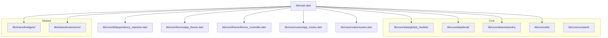

**Diagram sources**
- [main.dart:12-46](file://lib/main.dart#L12-L46)
- [app_theme.dart:1-23](file://lib/core/theme/app_theme.dart#L1-L23)
- [theme_controller.dart:1-22](file://lib/core/theme/theme_controller.dart#L1-L22)

**Section sources**
- [main.dart:12-46](file://lib/main.dart#L12-L46)
- [pubspec.yaml:30-60](file://pubspec.yaml#L30-L60)

## Core Components
This section documents the foundational models and utilities used across the app.

- Error Model
  - Purpose: Standardized representation of server-side and unknown errors.
  - Factories: fromHttp(statusCode, bodyMessage), fromUnknown().
  - Usage: Returned via Either<ErrorModel, T> from network utilities.

- User Profile Model
  - Purpose: Deserializes user profile payloads with nested Data object.
  - Serialization: fromJson(), toJson() for both top-level and nested Data.

- Local Storage Service
  - Purpose: Encapsulates token and arbitrary key-value persistence using GetStorage.
  - Methods: read(key), write(key, value), remove(key), clear().

- Theme Service and Theme Controller
  - Purpose: Persist and toggle theme mode; integrates with GetX for reactive UI updates.
  - Methods: saveThemeToStorage(value), getIsDark(), changeTheme(value), currentTheme getter.

- Network Utilities
  - GetNetwork.getData<T>: GET requests returning typed data or ErrorModel.
  - PostWithResponse.postData<T>: POST with JSON response deserialization.
  - PostWithoutResponse.postData: POST without response payload.
  - DeleteNetwork.deleteData: DELETE requests.
  - HeadersManager.getHeaders: Builds Authorization, Content-Type, Accept headers with optional auth token.

- Utilities
  - Date Picker utility and Image Picker utility for consistent UI behaviors.

**Section sources**
- [error_model.dart:1-15](file://lib/core/data/global_models/error_model.dart#L1-L15)
- [user_profile_model.dart:1-72](file://lib/core/data/global_models/user_profile_model.dart#L1-L72)
- [storage_service.dart:1-23](file://lib/core/data/local/storage_service.dart#L1-L23)
- [theme_service.dart:1-16](file://lib/core/data/local/theme_service.dart#L1-L16)
- [theme_controller.dart:1-22](file://lib/core/theme/theme_controller.dart#L1-L22)
- [get_network.dart:1-41](file://lib/core/data/networks/get_network.dart#L1-L41)
- [post_with_response.dart:1-45](file://lib/core/data/networks/post_with_response.dart#L1-L45)
- [post_without_response.dart:1-47](file://lib/core/data/networks/post_without_response.dart#L1-L47)
- [delete_network.dart:1-41](file://lib/core/data/networks/delete_network.dart#L1-L41)
- [headers_manager.dart:1-23](file://lib/core/data/networks/headers_manager.dart#L1-L23)
- [date_picker.dart](file://lib/core/utils/date_picker.dart)
- [image_picker.dart](file://lib/core/utils/image_picker.dart)

## Architecture Overview
The global utilities integrate with the dependency injection container and theme system to provide a cohesive foundation for features.

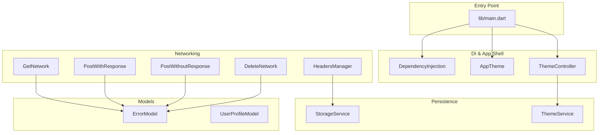

**Diagram sources**
- [main.dart:12-46](file://lib/main.dart#L12-L46)
- [headers_manager.dart:9-21](file://lib/core/data/networks/headers_manager.dart#L9-L21)
- [storage_service.dart:4-4](file://lib/core/data/local/storage_service.dart#L4-L4)
- [theme_service.dart:3-3](file://lib/core/data/local/theme_service.dart#L3-L3)
- [get_network.dart:10-39](file://lib/core/data/networks/get_network.dart#L10-L39)
- [post_with_response.dart:9-44](file://lib/core/data/networks/post_with_response.dart#L9-L44)
- [post_without_response.dart:12-46](file://lib/core/data/networks/post_without_response.dart#L12-L46)
- [delete_network.dart:10-39](file://lib/core/data/networks/delete_network.dart#L10-L39)
- [error_model.dart:1-15](file://lib/core/data/global_models/error_model.dart#L1-L15)
- [user_profile_model.dart:1-72](file://lib/core/data/global_models/user_profile_model.dart#L1-L72)

## Detailed Component Analysis

### Error Model
- Purpose: Centralized error representation for network failures and unknown conditions.
- Factories:
  - fromHttp(statusCode, bodyMessage): Creates error from HTTP response.
  - fromUnknown(): Creates default “Unknown Error” with 500 status.
- Integration: Returned as Left in Either<ErrorModel, T> from network utilities.

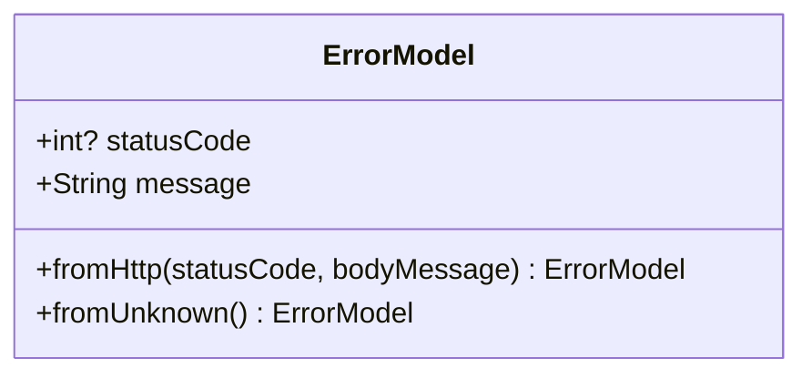

**Diagram sources**
- [error_model.dart:1-15](file://lib/core/data/global_models/error_model.dart#L1-L15)

**Section sources**
- [error_model.dart:1-15](file://lib/core/data/global_models/error_model.dart#L1-L15)

### User Profile Model
- Purpose: Deserialize user profile payloads with nested Data object.
- Features:
  - fromJson(json): Constructs model from JSON map.
  - toJson(): Serializes model to JSON map.
  - Nested Data class mirrors server fields and includes underscore_cased keys.

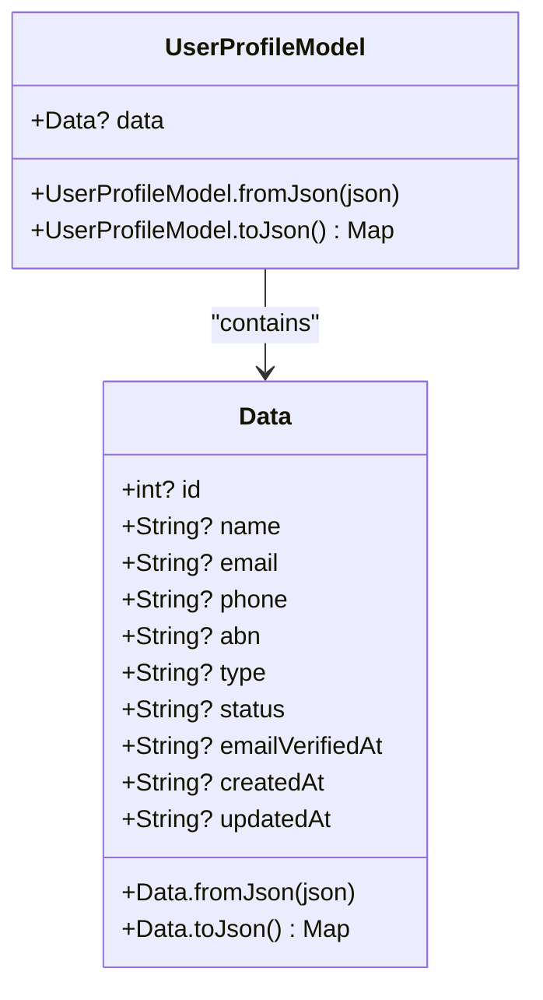

**Diagram sources**
- [user_profile_model.dart:1-72](file://lib/core/data/global_models/user_profile_model.dart#L1-L72)

**Section sources**
- [user_profile_model.dart:1-72](file://lib/core/data/global_models/user_profile_model.dart#L1-L72)

### Local Storage Service
- Purpose: Provide a unified interface for persisting tokens and other values.
- Methods:
  - read<T>(key): Retrieve typed value.
  - write(key, value): Store value asynchronously.
  - remove(key): Remove key.
  - clear(): Erase all stored entries.

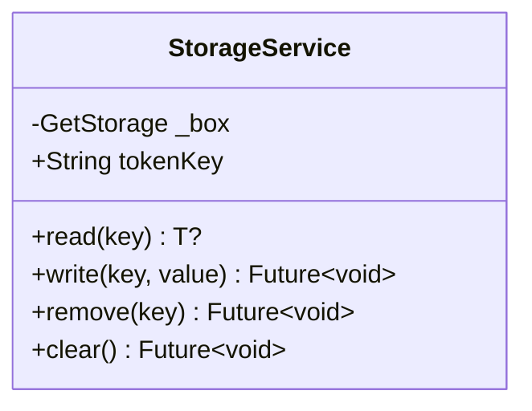

**Diagram sources**
- [storage_service.dart:1-23](file://lib/core/data/local/storage_service.dart#L1-L23)

**Section sources**
- [storage_service.dart:1-23](file://lib/core/data/local/storage_service.dart#L1-L23)

### Theme Service and Theme Controller
- ThemeService: Persists theme preference and reads it back.
- ThemeController: Reactive controller that observes theme changes and persists toggles.

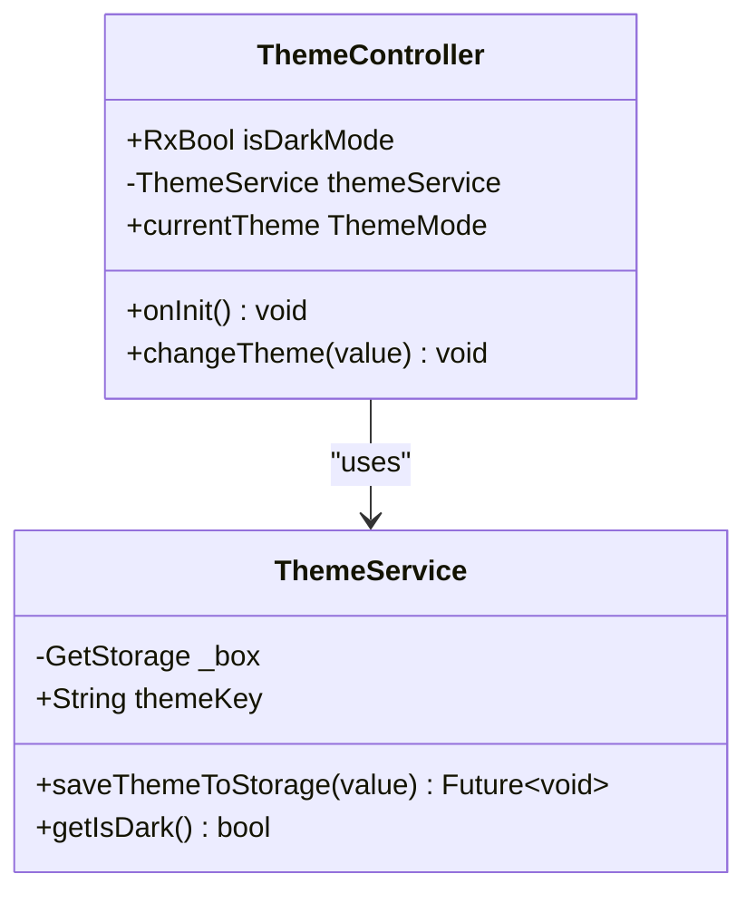

**Diagram sources**
- [theme_service.dart:1-16](file://lib/core/data/local/theme_service.dart#L1-L16)
- [theme_controller.dart:1-22](file://lib/core/theme/theme_controller.dart#L1-L22)

**Section sources**
- [theme_service.dart:1-16](file://lib/core/data/local/theme_service.dart#L1-L16)
- [theme_controller.dart:1-22](file://lib/core/theme/theme_controller.dart#L1-L22)

### Network Utilities
- GetNetwork.getData<T>: Performs GET, checks 2xx statuses, decodes JSON, and returns typed data or ErrorModel.
- PostWithResponse.postData<T>: Performs POST with JSON body, decodes response, and returns typed data or ErrorModel.
- PostWithoutResponse.postData: Performs POST without expecting a response body; returns success or ErrorModel.
- DeleteNetwork.deleteData: Performs DELETE; returns success or ErrorModel.
- HeadersManager.getHeaders: Builds headers map with optional Authorization token, Content-Type, and Accept.

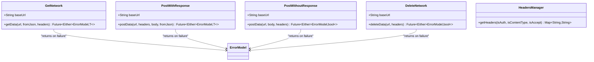

**Diagram sources**
- [get_network.dart:1-41](file://lib/core/data/networks/get_network.dart#L1-L41)
- [post_with_response.dart:1-45](file://lib/core/data/networks/post_with_response.dart#L1-L45)
- [post_without_response.dart:1-47](file://lib/core/data/networks/post_without_response.dart#L1-L47)
- [delete_network.dart:1-41](file://lib/core/data/networks/delete_network.dart#L1-L41)
- [headers_manager.dart:1-23](file://lib/core/data/networks/headers_manager.dart#L1-L23)
- [error_model.dart:1-15](file://lib/core/data/global_models/error_model.dart#L1-L15)

**Section sources**
- [get_network.dart:1-41](file://lib/core/data/networks/get_network.dart#L1-L41)
- [post_with_response.dart:1-45](file://lib/core/data/networks/post_with_response.dart#L1-L45)
- [post_without_response.dart:1-47](file://lib/core/data/networks/post_without_response.dart#L1-L47)
- [delete_network.dart:1-41](file://lib/core/data/networks/delete_network.dart#L1-L41)
- [headers_manager.dart:1-23](file://lib/core/data/networks/headers_manager.dart#L1-L23)

### Shared Widget Library
The shared widgets module provides reusable UI components organized by functional categories:

- Buttons
  - custom_primary_button.dart
  - custom_secondary_button.dart
  - custom_radio_button.dart
  - custom_switch_button.dart

- Form Fields
  - custom_text_form_field.dart
  - custom_date_fields.dart
  - custom_phone_field.dart

- Dropdowns
  - custom_dropdown_menu.dart
  - dropdown_input_decoration.dart
  - dropdown_menu_item.dart
  - custom_payment_dropdown.dart
  - custom_payment_dropdown_item.dart

- Rating, Pagination, Text, Containers, Loadings, Dialogs, Drawer, Timeline, Snackbars
  - Custom builders and helpers for consistent UX.

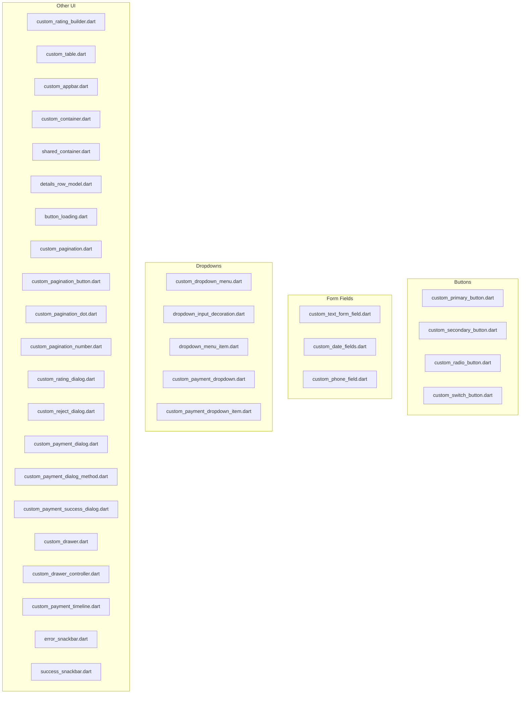

**Diagram sources**
- [custom_primary_button.dart](file://lib/shared/widgets/custom_button/custom_primary_button.dart)
- [custom_secondary_button.dart](file://lib/shared/widgets/custom_button/custom_secondary_button.dart)
- [custom_radio_button.dart](file://lib/shared/widgets/custom_button/custom_radio_button.dart)
- [custom_switch_button.dart](file://lib/shared/widgets/custom_button/custom_switch_button.dart)
- [custom_text_form_field.dart](file://lib/shared/widgets/custom_form_field/custom_text_form_field.dart)
- [custom_date_fields.dart](file://lib/shared/widgets/custom_form_field/custom_date_fields.dart)
- [custom_phone_field.dart](file://lib/shared/widgets/custom_form_field/custom_phone_field.dart)
- [custom_dropdown_menu.dart](file://lib/shared/widgets/custom_dropdown/custom_dropdown_menu.dart)
- [dropdown_input_decoration.dart](file://lib/shared/widgets/custom_dropdown/dropdown_input_decoration.dart)
- [dropdown_menu_item.dart](file://lib/shared/widgets/custom_dropdown/dropdown_menu_item.dart)
- [custom_payment_dropdown.dart](file://lib/shared/widgets/custom_dropdown/custom_payment_dropdown/custom_payment_dropdown.dart)
- [custom_payment_dropdown_item.dart](file://lib/shared/widgets/custom_dropdown/custom_payment_dropdown/custom_payment_dropdown_item.dart)
- [custom_rating_builder.dart](file://lib/shared/widgets/custom_rating/custom_rating_builder.dart)
- [custom_table.dart](file://lib/shared/widgets/custom_table/custom_table.dart)
- [custom_table_header.dart](file://lib/shared/widgets/custom_table/custom_table_header.dart)
- [custom_table_row.dart](file://lib/shared/widgets/custom_table/custom_table_row.dart)
- [custom_table_status.dart](file://lib/shared/widgets/custom_table/custom_table_status.dart)
- [custom_table_view_button.dart](file://lib/shared/widgets/custom_table/custom_table_view_button.dart)
- [custom_primary_text.dart](file://lib/shared/widgets/custom_text/custom_primary_text.dart)
- [custom_span_text.dart](file://lib/shared/widgets/custom_text/custom_span_text.dart)
- [custom_white_text.dart](file://lib/shared/widgets/custom_text/custom_white_text.dart)
- [custom_appbar.dart](file://lib/shared/widgets/custom_appbar.dart)
- [custom_container.dart](file://lib/shared/widgets/custom_container.dart)
- [shared_container.dart](file://lib/shared/widgets/shared_container.dart)
- [details_row_model.dart](file://lib/shared/widgets/details_row_model.dart)
- [custom_loadings/button_loading.dart](file://lib/shared/widgets/custom_loadings/button_loading.dart)
- [custom_pagination.dart](file://lib/shared/widgets/custom_pagination/custom_pagination.dart)
- [custom_pagination_button.dart](file://lib/shared/widgets/custom_pagination/custom_pagination_button.dart)
- [custom_pagination_dot.dart](file://lib/shared/widgets/custom_pagination/custom_pagination_dot.dart)
- [custom_pagination_number.dart](file://lib/shared/widgets/custom_pagination/custom_pagination_number.dart)
- [custom_rating_dialog.dart](file://lib/shared/widgets/custom_dialog/custom_rating_dialog.dart)
- [custom_reject_dialog.dart](file://lib/shared/widgets/custom_dialog/custom_reject_dialog.dart)
- [custom_payment_dialog.dart](file://lib/shared/widgets/custom_dialog/custom_payment_dialog.dart)
- [custom_payment_dialog_method.dart](file://lib/shared/widgets/custom_dialog/custom_payment_dialog_method.dart)
- [custom_payment_success_dialog.dart](file://lib/shared/widgets/custom_dialog/custom_payment_success_dialog.dart)
- [custom_drawer.dart](file://lib/shared/widgets/custom_drawer/custom_drawer.dart)
- [custom_drawer_controller.dart](file://lib/shared/widgets/custom_drawer/custom_drawer_controller.dart)
- [custom_timeline.dart](file://lib/shared/widgets/custom_timeline/custom_payment_timeline.dart)
- [error_snackbar.dart](file://lib/shared/widgets/snackbars/error_snackbar.dart)
- [success_snackbar.dart](file://lib/shared/widgets/snackbars/success_snackbar.dart)

### Utility Extensions
- Extractors
  - estimate_delivery_extractor.dart: Provides delivery estimation logic.
- Formatters
  - date_formatter.dart: Formats dates consistently across the app.
- Validators
  - abn_validator.dart, confirm_password_validator.dart, email_validator.dart, name_validator.dart, password_validator.dart, phone_validator.dart: Encapsulate validation rules for forms.

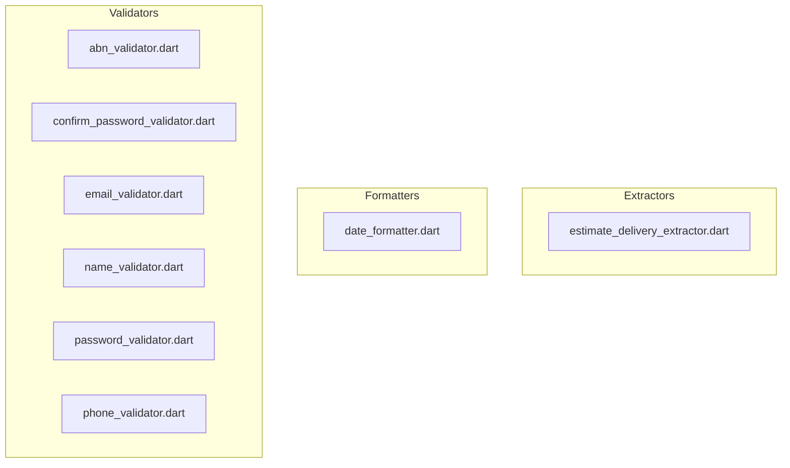

**Diagram sources**
- [estimate_delivery_extractor.dart](file://lib/shared/extensions/extractors/estimate_delivery_extractor.dart)
- [date_formatter.dart](file://lib/shared/extensions/formatters/date_formatter.dart)
- [abn_validator.dart](file://lib/shared/extensions/validators/abn_validator.dart)
- [confirm_password_validator.dart](file://lib/shared/extensions/validators/confirm_password_validator.dart)
- [email_validator.dart](file://lib/shared/extensions/validators/email_validator.dart)
- [name_validator.dart](file://lib/shared/extensions/validators/name_validator.dart)
- [password_validator.dart](file://lib/shared/extensions/validators/password_validator.dart)
- [phone_validator.dart](file://lib/shared/extensions/validators/phone_validator.dart)

## Dependency Analysis
This section maps how global utilities depend on each other and external libraries.

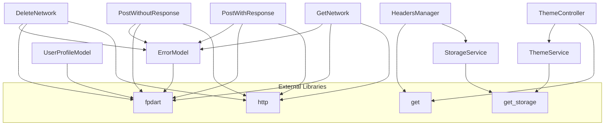

**Diagram sources**
- [pubspec.yaml:30-60](file://pubspec.yaml#L30-L60)
- [error_model.dart:1-15](file://lib/core/data/global_models/error_model.dart#L1-L15)
- [user_profile_model.dart:1-72](file://lib/core/data/global_models/user_profile_model.dart#L1-L72)
- [storage_service.dart:1-23](file://lib/core/data/local/storage_service.dart#L1-L23)
- [theme_service.dart:1-16](file://lib/core/data/local/theme_service.dart#L1-L16)
- [theme_controller.dart:1-22](file://lib/core/theme/theme_controller.dart#L1-L22)
- [headers_manager.dart:1-23](file://lib/core/data/networks/headers_manager.dart#L1-L23)
- [get_network.dart:1-41](file://lib/core/data/networks/get_network.dart#L1-L41)
- [post_with_response.dart:1-45](file://lib/core/data/networks/post_with_response.dart#L1-L45)
- [post_without_response.dart:1-47](file://lib/core/data/networks/post_without_response.dart#L1-L47)
- [delete_network.dart:1-41](file://lib/core/data/networks/delete_network.dart#L1-L41)

**Section sources**
- [pubspec.yaml:30-60](file://pubspec.yaml#L30-L60)

## Performance Considerations
- Network Responses
  - Prefer typed deserialization via fromJson to minimize runtime errors and parsing overhead.
  - Use Either<ErrorModel, T> to short-circuit error handling early and avoid unnecessary downstream processing.
- Storage
  - Batch writes when possible; avoid frequent synchronous writes in hot paths.
  - Use clear() sparingly; prefer targeted removals for better cache locality.
- Theming
  - Keep theme toggling off the UI thread; ThemeController already uses reactive state.
- Widgets
  - Reuse shared widgets to reduce rebuild scope and maintain consistency.
  - Avoid heavy computations inside build methods; precompute where feasible.

## Troubleshooting Guide
- Unknown Errors
  - When JSON parsing fails or server returns unexpected structure, ErrorModel.fromUnknown() provides a fallback with a default status code and message.
- Network Failures
  - Inspect response.statusCode and response.body; headers are built via HeadersManager.getHeaders to ensure Authorization is present when required.
- Theme Persistence
  - If theme does not persist, verify ThemeService.saveThemeToStorage and ThemeController.changeTheme are invoked and ThemeService.getIsDark returns expected values.
- Storage Access
  - Ensure StorageService.read(key) is called after initialization; dependency injection must be set up before accessing storage.

**Section sources**
- [error_model.dart:11-13](file://lib/core/data/global_models/error_model.dart#L11-L13)
- [headers_manager.dart:9-21](file://lib/core/data/networks/headers_manager.dart#L9-L21)
- [theme_controller.dart:15-18](file://lib/core/theme/theme_controller.dart#L15-L18)
- [theme_service.dart:7-14](file://lib/core/data/local/theme_service.dart#L7-L14)
- [storage_service.dart:7-21](file://lib/core/data/local/storage_service.dart#L7-L21)

## Conclusion
ZB-DEZINE’s global models and utilities establish a robust, reusable foundation for data handling, networking, persistence, theming, and UI. By adhering to consistent patterns—typed models, standardized error handling, centralized storage, and shared widgets—the application maintains scalability, readability, and ease of maintenance.

## Appendices

### API Workflow Example (GET Request)
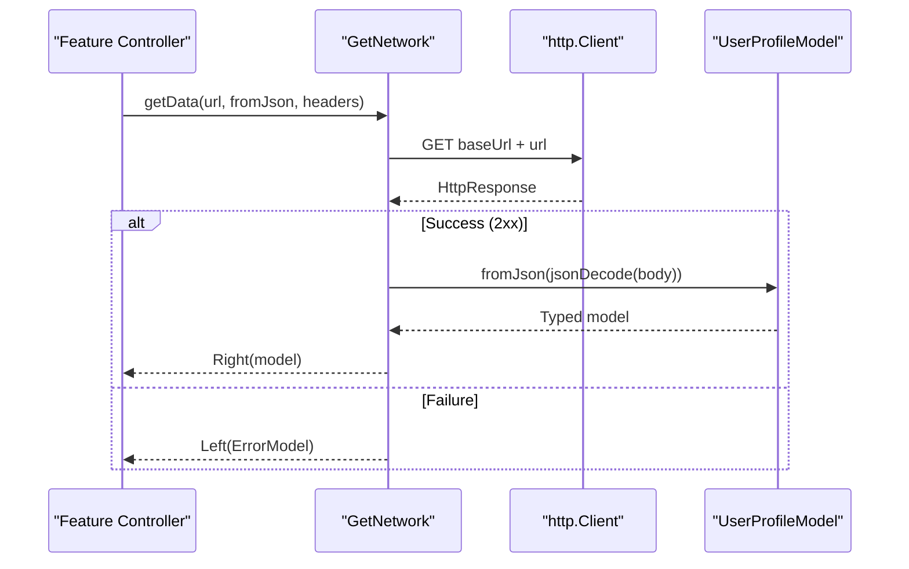

**Diagram sources**
- [get_network.dart:10-39](file://lib/core/data/networks/get_network.dart#L10-L39)
- [user_profile_model.dart:6-16](file://lib/core/data/global_models/user_profile_model.dart#L6-L16)
- [error_model.dart:1-15](file://lib/core/data/global_models/error_model.dart#L1-L15)

### Usage Examples (by reference)
- Error Model
  - [error_model.dart:5-13](file://lib/core/data/global_models/error_model.dart#L5-L13)
- User Profile Model
  - [user_profile_model.dart:6-16](file://lib/core/data/global_models/user_profile_model.dart#L6-L16)
- Storage Service
  - [storage_service.dart:7-21](file://lib/core/data/local/storage_service.dart#L7-L21)
- Theme Service and Controller
  - [theme_service.dart:7-14](file://lib/core/data/local/theme_service.dart#L7-L14), [theme_controller.dart:15-22](file://lib/core/theme/theme_controller.dart#L15-L22)
- Network Utilities
  - [get_network.dart:10-39](file://lib/core/data/networks/get_network.dart#L10-L39)
  - [post_with_response.dart:9-44](file://lib/core/data/networks/post_with_response.dart#L9-L44)
  - [post_without_response.dart:12-46](file://lib/core/data/networks/post_without_response.dart#L12-L46)
  - [delete_network.dart:10-39](file://lib/core/data/networks/delete_network.dart#L10-L39)
- Headers Manager
  - [headers_manager.dart:9-21](file://lib/core/data/networks/headers_manager.dart#L9-L21)
- Shared Widgets
  - [custom_primary_button.dart](file://lib/shared/widgets/custom_button/custom_primary_button.dart)
  - [custom_text_form_field.dart](file://lib/shared/widgets/custom_form_field/custom_text_form_field.dart)
  - [custom_dropdown_menu.dart](file://lib/shared/widgets/custom_dropdown/custom_dropdown_menu.dart)
  - [custom_table.dart](file://lib/shared/widgets/custom_table/custom_table.dart)
  - [custom_rating_builder.dart](file://lib/shared/widgets/custom_rating/custom_rating_builder.dart)
  - [custom_pagination.dart](file://lib/shared/widgets/custom_pagination/custom_pagination.dart)
  - [custom_loadings/button_loading.dart](file://lib/shared/widgets/custom_loadings/button_loading.dart)
  - [custom_drawer.dart](file://lib/shared/widgets/custom_drawer/custom_drawer.dart)
  - [custom_timeline.dart](file://lib/shared/widgets/custom_timeline/custom_payment_timeline.dart)
  - [error_snackbar.dart](file://lib/shared/widgets/snackbars/error_snackbar.dart)
  - [success_snackbar.dart](file://lib/shared/widgets/snackbars/success_snackbar.dart)
- Extensions
  - [date_formatter.dart](file://lib/shared/extensions/formatters/date_formatter.dart)
  - [email_validator.dart](file://lib/shared/extensions/validators/email_validator.dart)
  - [phone_validator.dart](file://lib/shared/extensions/validators/phone_validator.dart)
  - [estimate_delivery_extractor.dart](file://lib/shared/extensions/extractors/estimate_delivery_extractor.dart)