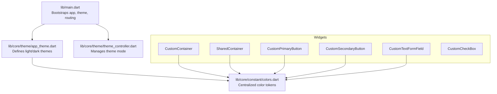
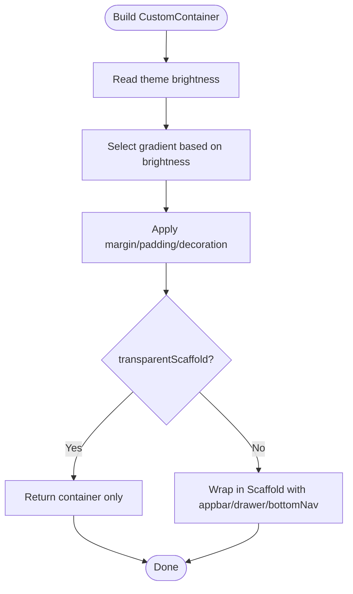
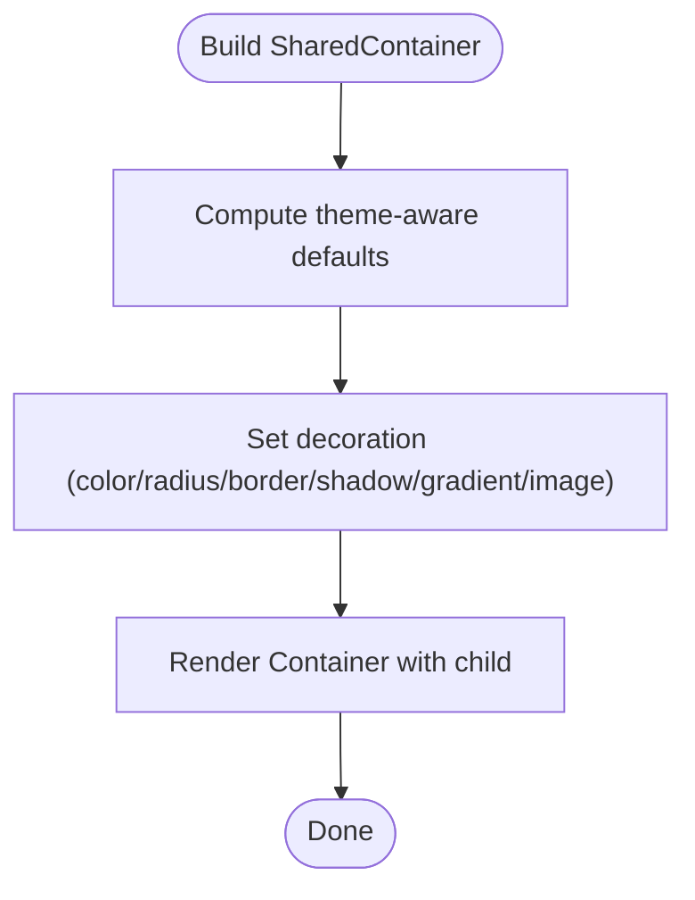
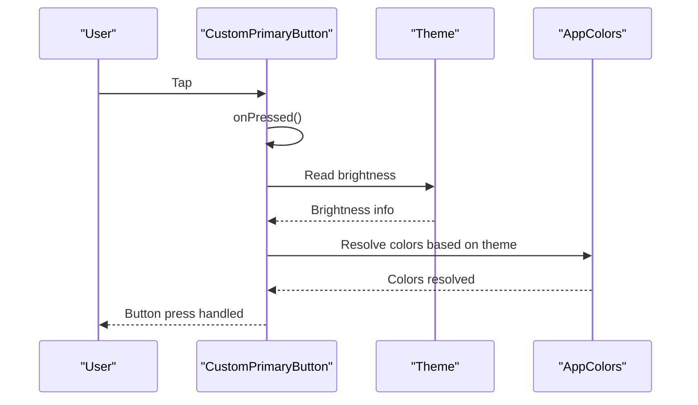
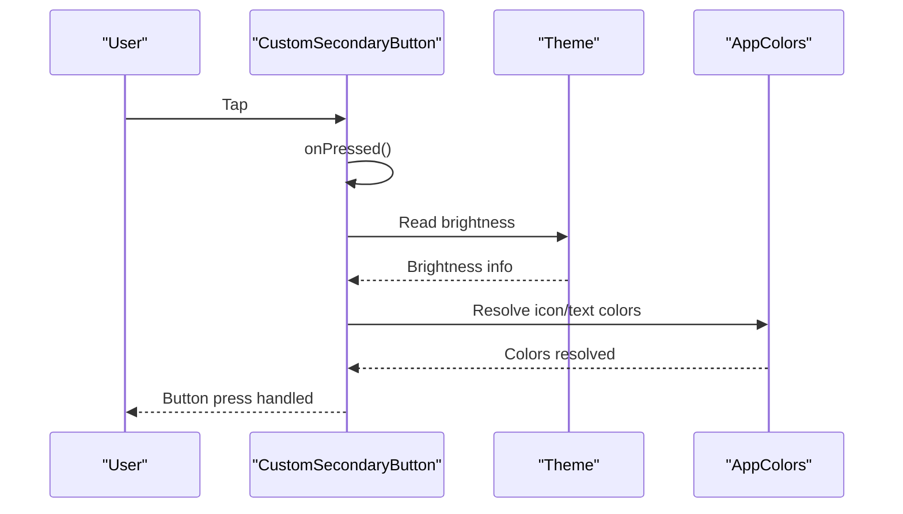
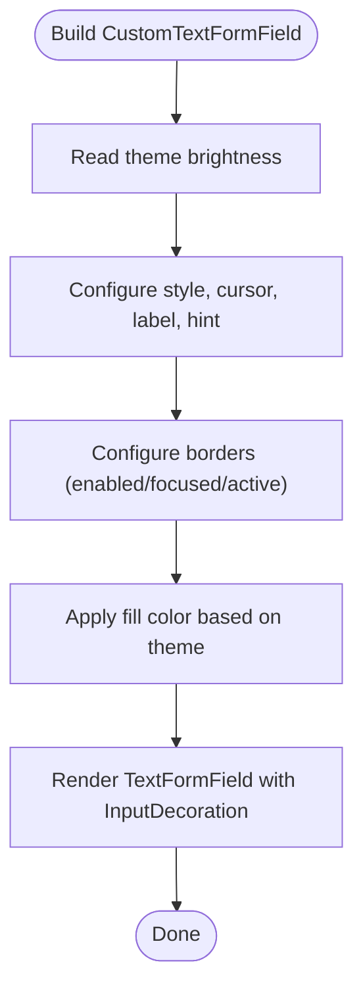
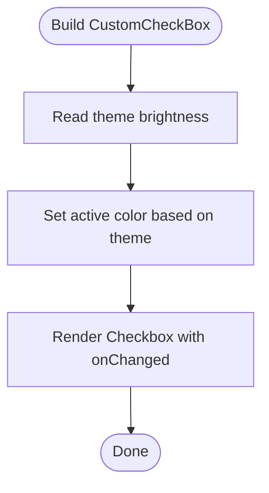
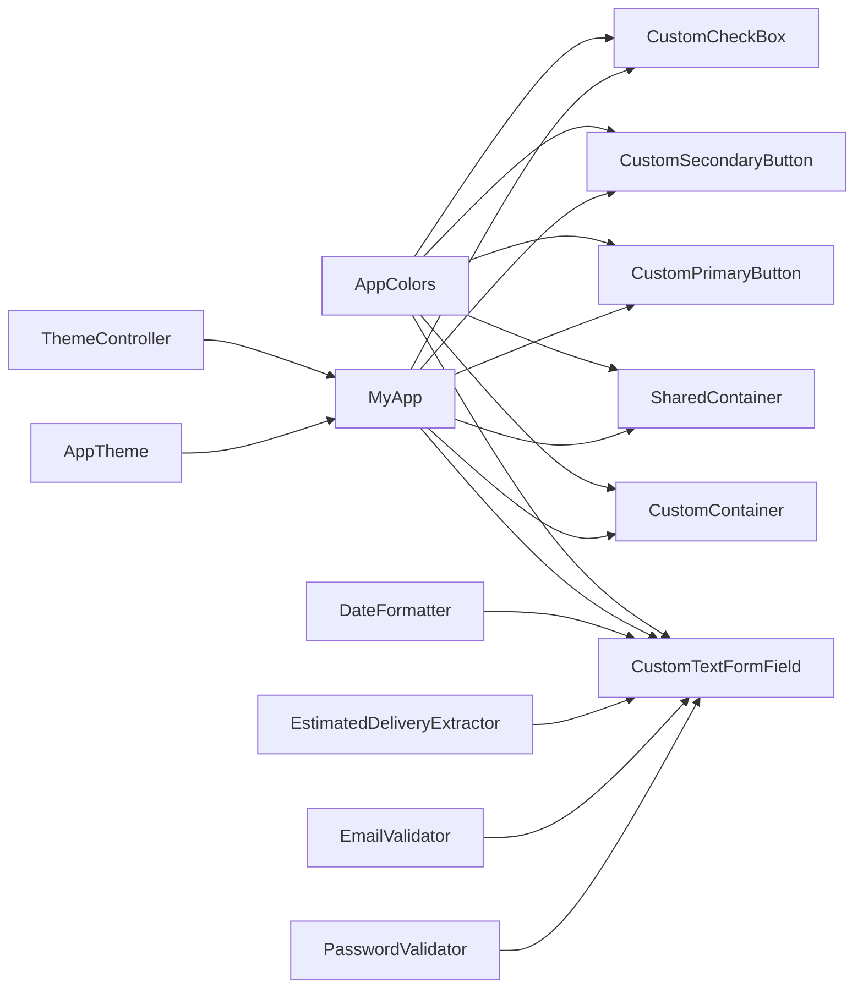

# Shared Components

<cite>
**Referenced Files in This Document**
- [lib/main.dart](file://lib/main.dart)
- [pubspec.yaml](file://pubspec.yaml)
- [lib/core/theme/app_theme.dart](file://lib/core/theme/app_theme.dart)
- [lib/core/theme/theme_controller.dart](file://lib/core/theme/theme_controller.dart)
- [lib/core/constant/colors.dart](file://lib/core/constant/colors.dart)
- [lib/shared/widgets/custom_container.dart](file://lib/shared/widgets/custom_container.dart)
- [lib/shared/widgets/shared_container.dart](file://lib/shared/widgets/shared_container.dart)
- [lib/shared/widgets/custom_button/custom_primary_button.dart](file://lib/shared/widgets/custom_button/custom_primary_button.dart)
- [lib/shared/widgets/custom_button/custom_secondary_button.dart](file://lib/shared/widgets/custom_button/custom_secondary_button.dart)
- [lib/shared/widgets/custom_form_field/custom_text_form_field.dart](file://lib/shared/widgets/custom_form_field/custom_text_form_field.dart)
- [lib/shared/widgets/custom_check_box.dart](file://lib/shared/widgets/custom_check_box.dart)
- [lib/shared/extensions/formatters/date_formatter.dart](file://lib/shared/extensions/formatters/date_formatter.dart)
- [lib/shared/extensions/extractors/estimate_delivery_extractor.dart](file://lib/shared/extensions/extractors/estimate_delivery_extractor.dart)
- [lib/shared/extensions/validators/email_validator.dart](file://lib/shared/extensions/validators/email_validator.dart)
- [lib/shared/extensions/validators/password_validator.dart](file://lib/shared/extensions/validators/password_validator.dart)
</cite>

## Table of Contents
1. [Introduction](#introduction)
2. [Project Structure](#project-structure)
3. [Core Components](#core-components)
4. [Architecture Overview](#architecture-overview)
5. [Detailed Component Analysis](#detailed-component-analysis)
6. [Dependency Analysis](#dependency-analysis)
7. [Performance Considerations](#performance-considerations)
8. [Troubleshooting Guide](#troubleshooting-guide)
9. [Conclusion](#conclusion)
10. [Appendices](#appendices)

## Introduction
This document describes ZB-DEZINE’s shared widget library and utility components. It focuses on reusable UI components such as buttons, input fields, checkboxes, containers, and layout scaffolding, along with utility extensions for data formatting, extraction, and validation. It also covers styling consistency via the central theme and color palette, responsive design patterns using screen utility helpers, and guidance for composition, performance, and accessibility.

## Project Structure
The shared components live under the shared directory, organized by feature families (buttons, forms, dialogs, pagination, tables, etc.). Styling and theming are centralized in the core theme and color modules. The app bootstraps with a responsive design system and integrates a theme controller for light/dark mode switching.

```mermaid
graph TB
subgraph "App Bootstrap"
M["lib/main.dart"]
P["pubspec.yaml"]
end
subgraph "Core Styling"
AT["lib/core/theme/app_theme.dart"]
TC["lib/core/theme/theme_controller.dart"]
AC["lib/core/constant/colors.dart"]
end
subgraph "Shared Widgets"
CC["lib/shared/widgets/custom_container.dart"]
SC["lib/shared/widgets/shared_container.dart"]
CPB["lib/shared/widgets/custom_button/custom_primary_button.dart"]
CSB["lib/shared/widgets/custom_button/custom_secondary_button.dart"]
CTFF["lib/shared/widgets/custom_form_field/custom_text_form_field.dart"]
CBC["lib/shared/widgets/custom_check_box.dart"]
end
subgraph "Extensions"
DF["lib/shared/extensions/formatters/date_formatter.dart"]
EDE["lib/shared/extensions/extractors/estimate_delivery_extractor.dart"]
EV["lib/shared/extensions/validators/email_validator.dart"]
PV["lib/shared/extensions/validators/password_validator.dart"]
end
M --> AT
M --> TC
AT --> AC
CC --> AC
SC --> AC
CPB --> AC
CSB --> AC
CTFF --> AC
CTFF --> DF
EDE --> DF
EV --> CTFF
PV --> CTFF
```

**Diagram sources**
- [lib/main.dart:12-46](file://lib/main.dart#L12-L46)
- [lib/core/theme/app_theme.dart:4-22](file://lib/core/theme/app_theme.dart#L4-L22)
- [lib/core/theme/theme_controller.dart:5-21](file://lib/core/theme/theme_controller.dart#L5-L21)
- [lib/core/constant/colors.dart:3-116](file://lib/core/constant/colors.dart#L3-L116)
- [lib/shared/widgets/custom_container.dart:5-57](file://lib/shared/widgets/custom_container.dart#L5-L57)
- [lib/shared/widgets/shared_container.dart:5-56](file://lib/shared/widgets/shared_container.dart#L5-L56)
- [lib/shared/widgets/custom_button/custom_primary_button.dart:6-73](file://lib/shared/widgets/custom_button/custom_primary_button.dart#L6-L73)
- [lib/shared/widgets/custom_button/custom_secondary_button.dart:6-87](file://lib/shared/widgets/custom_button/custom_secondary_button.dart#L6-L87)
- [lib/shared/widgets/custom_form_field/custom_text_form_field.dart:7-190](file://lib/shared/widgets/custom_form_field/custom_text_form_field.dart#L7-L190)
- [lib/shared/widgets/custom_check_box.dart:4-28](file://lib/shared/widgets/custom_check_box.dart#L4-L28)
- [lib/shared/extensions/formatters/date_formatter.dart:3-53](file://lib/shared/extensions/formatters/date_formatter.dart#L3-L53)
- [lib/shared/extensions/extractors/estimate_delivery_extractor.dart:5-38](file://lib/shared/extensions/extractors/estimate_delivery_extractor.dart#L5-L38)
- [lib/shared/extensions/validators/email_validator.dart:1-14](file://lib/shared/extensions/validators/email_validator.dart#L1-L14)
- [lib/shared/extensions/validators/password_validator.dart:1-11](file://lib/shared/extensions/validators/password_validator.dart#L1-L11)

**Section sources**
- [lib/main.dart:12-46](file://lib/main.dart#L12-L46)
- [pubspec.yaml:30-60](file://pubspec.yaml#L30-L60)

## Core Components
This section documents the primary reusable components and their capabilities.

- CustomContainer
  - Purpose: A flexible scaffold wrapper that applies responsive sizing, safe areas, and themed backgrounds. Supports optional appbar, drawer, and bottom navigation.
  - Key props: child, gradient, appbar, padding, margin, drawer, bottomNav, transparentScaffold.
  - Behavior: Chooses dark/light gradient based on theme brightness; optionally renders as a plain container when transparentScaffold is true.
  - Usage pattern: Wrap page content with a container that fills the viewport and apply consistent padding/margins.

- SharedContainer
  - Purpose: A versatile container with rounded corners, borders, shadows, gradients, and optional background image.
  - Key props: child, padding, margin, radius, border, color, boxShadow, height, width, gradient, image.
  - Behavior: Applies theme-aware defaults for color and radius; supports gradient or solid fill but not both simultaneously.

- CustomPrimaryButton
  - Purpose: Prominent call-to-action button with text or custom child content.
  - Key props: height, width, text, fontSize, onPressed, backgroundColor, textColor, borderRadius, boxDecoration, child, fontWeight, padding, border, boxShadow.
  - Behavior: Uses theme-aware colors and typography; centers text or displays custom child; applies rounded corners and optional shadow.

- CustomSecondaryButton
  - Purpose: Secondary action button with icon and label.
  - Key props: height, width, iconHeight, iconWidth, text, icon, fontSize, onPressed, backgroundColor, textColor, iconColor, radius, boxDecoration, child, fontWeight, padding, border, boxShadow.
  - Behavior: Displays an icon and label in a row with compact spacing; applies theme-aware colors and typography.

- CustomTextFormField
  - Purpose: Styled text input with extensive customization for labels, hints, icons, validation, and appearance.
  - Key props: hintText, suffixIcon, prefixIcon, obscureText, keyboardType, textColor, cursorColor, labelColor, fontSize, labelFontSize, fontWeight, controller, textDirection, width, labelText, errorText, validator, onChanged, readOnly, padding, margin, validation, isFilled, border, floatingLabelBehavior, fillColor, maxLength, maxLines, hintDirection, isAlignLabelWithHint, fontHeight, cursorHeight, isDense, focusNode, borderRadius, borderWidth, borderColor, labelFontWeight.
  - Behavior: Integrates Google Fonts, theme-aware colors, and Material input decoration with dense controls and customizable borders.

- CustomCheckBox
  - Purpose: A compact checkbox with theme-aware active color.
  - Key props: isChecked, onChange, color.
  - Behavior: Uses visual density compact and toggles selection state via callback.

**Section sources**
- [lib/shared/widgets/custom_container.dart:5-57](file://lib/shared/widgets/custom_container.dart#L5-L57)
- [lib/shared/widgets/shared_container.dart:5-56](file://lib/shared/widgets/shared_container.dart#L5-L56)
- [lib/shared/widgets/custom_button/custom_primary_button.dart:6-73](file://lib/shared/widgets/custom_button/custom_primary_button.dart#L6-L73)
- [lib/shared/widgets/custom_button/custom_secondary_button.dart:6-87](file://lib/shared/widgets/custom_button/custom_secondary_button.dart#L6-L87)
- [lib/shared/widgets/custom_form_field/custom_text_form_field.dart:7-190](file://lib/shared/widgets/custom_form_field/custom_text_form_field.dart#L7-L190)
- [lib/shared/widgets/custom_check_box.dart:4-28](file://lib/shared/widgets/custom_check_box.dart#L4-L28)

## Architecture Overview
The shared components rely on a consistent theme and color system. The app initializes responsive units and theme mode, then components consume theme brightness and color tokens to render appropriate visuals.

**Diagram sources**
- [lib/main.dart:21-46](file://lib/main.dart#L21-L46)
- [lib/core/theme/theme_controller.dart:5-21](file://lib/core/theme/theme_controller.dart#L5-L21)
- [lib/core/theme/app_theme.dart:4-22](file://lib/core/theme/app_theme.dart#L4-L22)
- [lib/core/constant/colors.dart:3-116](file://lib/core/constant/colors.dart#L3-L116)
- [lib/shared/widgets/custom_container.dart:28-42](file://lib/shared/widgets/custom_container.dart#L28-L42)
- [lib/shared/widgets/shared_container.dart:34-52](file://lib/shared/widgets/shared_container.dart#L34-L52)
- [lib/shared/widgets/custom_button/custom_primary_button.dart:39-69](file://lib/shared/widgets/custom_button/custom_primary_button.dart#L39-L69)
- [lib/shared/widgets/custom_button/custom_secondary_button.dart:48-84](file://lib/shared/widgets/custom_button/custom_secondary_button.dart#L48-L84)
- [lib/shared/widgets/custom_form_field/custom_text_form_field.dart:95-187](file://lib/shared/widgets/custom_form_field/custom_text_form_field.dart#L95-L187)
- [lib/shared/widgets/custom_check_box.dart:17-26](file://lib/shared/widgets/custom_check_box.dart#L17-L26)

## Detailed Component Analysis

### CustomContainer
- Props: child, gradient, appbar, padding, margin, drawer, bottomNav, transparentScaffold.
- Behavior: Computes gradient based on theme brightness; wraps content in SafeArea; optionally returns a plain container when transparentScaffold is true.
- Composition: Intended to wrap page-level content; can host appbar, drawer, and bottom navigation.

**Diagram sources**
- [lib/shared/widgets/custom_container.dart:28-55](file://lib/shared/widgets/custom_container.dart#L28-L55)

**Section sources**
- [lib/shared/widgets/custom_container.dart:5-57](file://lib/shared/widgets/custom_container.dart#L5-L57)

### SharedContainer
- Props: child, padding, margin, radius, border, color, boxShadow, height, width, gradient, image.
- Behavior: Applies theme-aware defaults; supports either gradient or color, not both; rounds corners and applies shadows.

**Diagram sources**
- [lib/shared/widgets/shared_container.dart:34-54](file://lib/shared/widgets/shared_container.dart#L34-L54)

**Section sources**
- [lib/shared/widgets/shared_container.dart:5-56](file://lib/shared/widgets/shared_container.dart#L5-L56)

### CustomPrimaryButton
- Props: height, width, text, fontSize, onPressed, backgroundColor, textColor, borderRadius, boxDecoration, child, fontWeight, padding, border, boxShadow.
- Behavior: Uses theme-aware colors and typography; centers text or displays custom child; applies rounded corners and optional shadow.

**Diagram sources**
- [lib/shared/widgets/custom_button/custom_primary_button.dart:39-69](file://lib/shared/widgets/custom_button/custom_primary_button.dart#L39-L69)

**Section sources**
- [lib/shared/widgets/custom_button/custom_primary_button.dart:6-73](file://lib/shared/widgets/custom_button/custom_primary_button.dart#L6-L73)

### CustomSecondaryButton
- Props: height, width, iconHeight, iconWidth, text, icon, fontSize, onPressed, backgroundColor, textColor, iconColor, radius, boxDecoration, child, fontWeight, padding, border, boxShadow.
- Behavior: Renders icon and label in a row with compact spacing; applies theme-aware colors and typography.

**Diagram sources**
- [lib/shared/widgets/custom_button/custom_secondary_button.dart:48-84](file://lib/shared/widgets/custom_button/custom_secondary_button.dart#L48-L84)

**Section sources**
- [lib/shared/widgets/custom_button/custom_secondary_button.dart:6-87](file://lib/shared/widgets/custom_button/custom_secondary_button.dart#L6-L87)

### CustomTextFormField
- Props: extensive support for hints, labels, icons, validation, keyboard type, cursor, borders, colors, and layout.
- Behavior: Integrates Google Fonts, theme-aware colors, and Material input decoration; supports dense layout and customizable borders.

**Diagram sources**
- [lib/shared/widgets/custom_form_field/custom_text_form_field.dart:95-187](file://lib/shared/widgets/custom_form_field/custom_text_form_field.dart#L95-L187)

**Section sources**
- [lib/shared/widgets/custom_form_field/custom_text_form_field.dart:7-190](file://lib/shared/widgets/custom_form_field/custom_text_form_field.dart#L7-L190)

### CustomCheckBox
- Props: isChecked, onChange, color.
- Behavior: Uses theme-aware active color and compact visual density.

**Diagram sources**
- [lib/shared/widgets/custom_check_box.dart:17-26](file://lib/shared/widgets/custom_check_box.dart#L17-L26)

**Section sources**
- [lib/shared/widgets/custom_check_box.dart:4-28](file://lib/shared/widgets/custom_check_box.dart#L4-L28)

## Dependency Analysis
The shared components depend on:
- Theme brightness to choose colors and gradients.
- Color tokens for consistent theming.
- Responsive utilities for scalable sizes.
- Validation and formatting extensions for data handling.

**Diagram sources**
- [lib/core/constant/colors.dart:3-116](file://lib/core/constant/colors.dart#L3-L116)
- [lib/shared/widgets/custom_container.dart:28-42](file://lib/shared/widgets/custom_container.dart#L28-L42)
- [lib/shared/widgets/shared_container.dart:34-52](file://lib/shared/widgets/shared_container.dart#L34-L52)
- [lib/shared/widgets/custom_button/custom_primary_button.dart:39-69](file://lib/shared/widgets/custom_button/custom_primary_button.dart#L39-L69)
- [lib/shared/widgets/custom_button/custom_secondary_button.dart:48-84](file://lib/shared/widgets/custom_button/custom_secondary_button.dart#L48-L84)
- [lib/shared/widgets/custom_form_field/custom_text_form_field.dart:95-187](file://lib/shared/widgets/custom_form_field/custom_text_form_field.dart#L95-L187)
- [lib/shared/widgets/custom_check_box.dart:17-26](file://lib/shared/widgets/custom_check_box.dart#L17-L26)
- [lib/core/theme/theme_controller.dart:5-21](file://lib/core/theme/theme_controller.dart#L5-L21)
- [lib/core/theme/app_theme.dart:4-22](file://lib/core/theme/app_theme.dart#L4-L22)
- [lib/main.dart:21-46](file://lib/main.dart#L21-L46)
- [lib/shared/extensions/formatters/date_formatter.dart:3-53](file://lib/shared/extensions/formatters/date_formatter.dart#L3-L53)
- [lib/shared/extensions/extractors/estimate_delivery_extractor.dart:5-38](file://lib/shared/extensions/extractors/estimate_delivery_extractor.dart#L5-L38)
- [lib/shared/extensions/validators/email_validator.dart:1-14](file://lib/shared/extensions/validators/email_validator.dart#L1-L14)
- [lib/shared/extensions/validators/password_validator.dart:1-11](file://lib/shared/extensions/validators/password_validator.dart#L1-L11)

**Section sources**
- [lib/main.dart:21-46](file://lib/main.dart#L21-L46)
- [lib/core/theme/app_theme.dart:4-22](file://lib/core/theme/app_theme.dart#L4-L22)
- [lib/core/theme/theme_controller.dart:5-21](file://lib/core/theme/theme_controller.dart#L5-L21)
- [lib/core/constant/colors.dart:3-116](file://lib/core/constant/colors.dart#L3-L116)

## Performance Considerations
- Prefer lightweight widgets: Use SharedContainer for simple boxes and avoid unnecessary nested widgets inside buttons.
- Minimize recompositions: Keep props stable; avoid passing closures as arguments unless necessary.
- Use responsive units: Leverage screen utility helpers for scalable sizes to reduce manual calculations.
- Lazy loading: For lists and tables, defer heavy operations until data is available.
- Avoid deep nesting: Flatten layouts where possible to improve rendering performance.
- Theme-aware defaults: Rely on theme-driven colors and gradients to reduce per-widget overrides.

## Troubleshooting Guide
- Buttons not responding:
  - Ensure onPressed is provided and not null.
  - Verify gesture targets have sufficient hit area via padding and sizing props.
- Form fields not validating:
  - Confirm validator returns null for valid input and a non-empty string for invalid input.
  - Check autovalidateMode and controller bindings.
- Incorrect colors in dark mode:
  - Verify theme brightness is correctly detected and color tokens are applied conditionally.
- Date formatting errors:
  - DateFormatter gracefully falls back to the original string on parse failure; inspect input format and handle exceptions accordingly.
- Delivery estimation issues:
  - EstimateDeliveryExtractor parses delivery_time and createdAt; ensure inputs are valid ISO date and “X-Y Days” format.

**Section sources**
- [lib/shared/widgets/custom_button/custom_primary_button.dart:39-69](file://lib/shared/widgets/custom_button/custom_primary_button.dart#L39-L69)
- [lib/shared/widgets/custom_button/custom_secondary_button.dart:48-84](file://lib/shared/widgets/custom_button/custom_secondary_button.dart#L48-L84)
- [lib/shared/widgets/custom_form_field/custom_text_form_field.dart:95-187](file://lib/shared/widgets/custom_form_field/custom_text_form_field.dart#L95-L187)
- [lib/shared/extensions/formatters/date_formatter.dart:6-16](file://lib/shared/extensions/formatters/date_formatter.dart#L6-L16)
- [lib/shared/extensions/extractors/estimate_delivery_extractor.dart:6-37](file://lib/shared/extensions/extractors/estimate_delivery_extractor.dart#L6-L37)

## Conclusion
ZB-DEZINE’s shared component library provides a cohesive, theme-aware foundation for building consistent UIs. By leveraging centralized colors, responsive sizing, and robust validation/formatting utilities, teams can compose reliable screens quickly while maintaining design continuity and performance.

## Appendices

### Usage Examples (by reference)
- Primary button integration pattern:
  - Reference: [lib/shared/widgets/custom_button/custom_primary_button.dart:21-35](file://lib/shared/widgets/custom_button/custom_primary_button.dart#L21-L35)
- Secondary button with icon:
  - Reference: [lib/shared/widgets/custom_button/custom_secondary_button.dart:25-44](file://lib/shared/widgets/custom_button/custom_secondary_button.dart#L25-L44)
- Text form field with validation:
  - Reference: [lib/shared/widgets/custom_form_field/custom_text_form_field.dart:49-91](file://lib/shared/widgets/custom_form_field/custom_text_form_field.dart#L49-L91)
- Checkbox usage:
  - Reference: [lib/shared/widgets/custom_check_box.dart:8-13](file://lib/shared/widgets/custom_check_box.dart#L8-L13)
- Container wrappers:
  - Reference: [lib/shared/widgets/custom_container.dart:14-24](file://lib/shared/widgets/custom_container.dart#L14-L24)
  - Reference: [lib/shared/widgets/shared_container.dart:17-30](file://lib/shared/widgets/shared_container.dart#L17-L30)

### Accessibility Considerations
- Touch targets: Ensure buttons and form fields meet minimum touch target sizes.
- Contrast: Use theme-aware colors to maintain sufficient contrast in light/dark modes.
- Focus: Provide focus nodes and visible focus indicators for form fields.
- Labels: Always supply meaningful labels and hints for assistive technologies.
- Readable text: Use appropriate font weights and sizes; avoid relying solely on color to convey meaning.