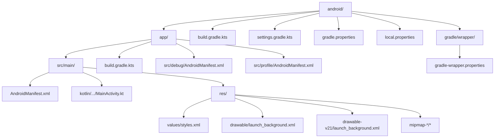
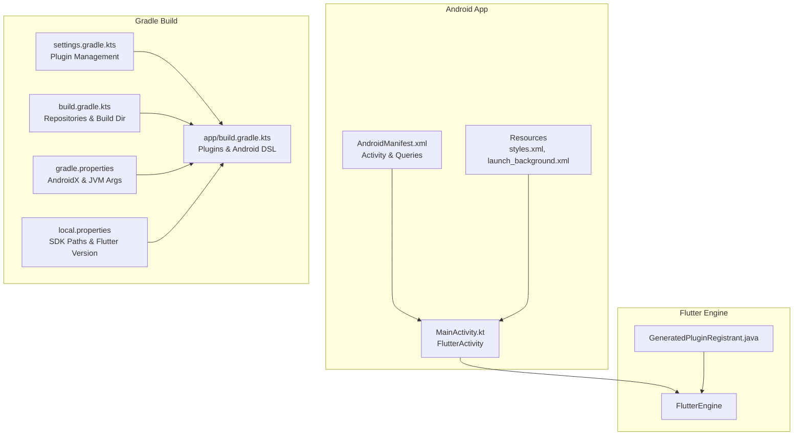
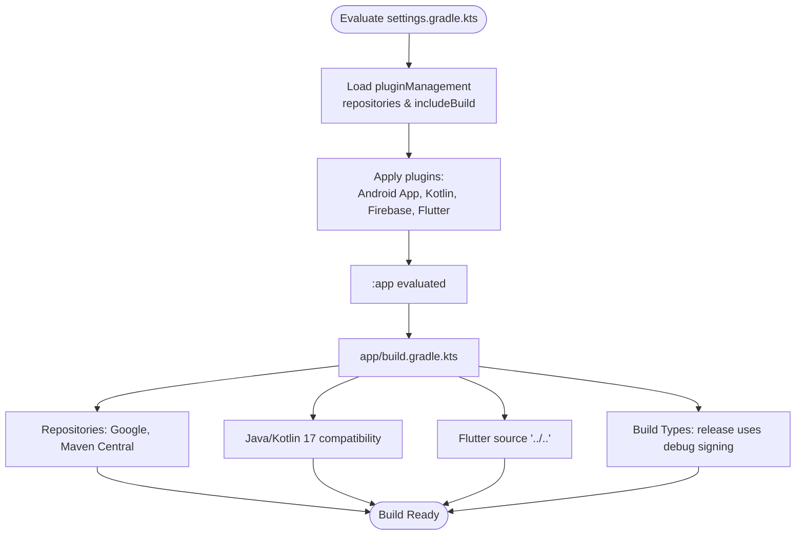
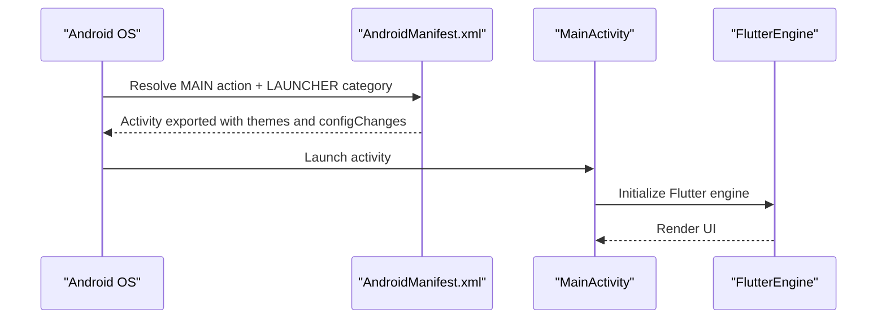
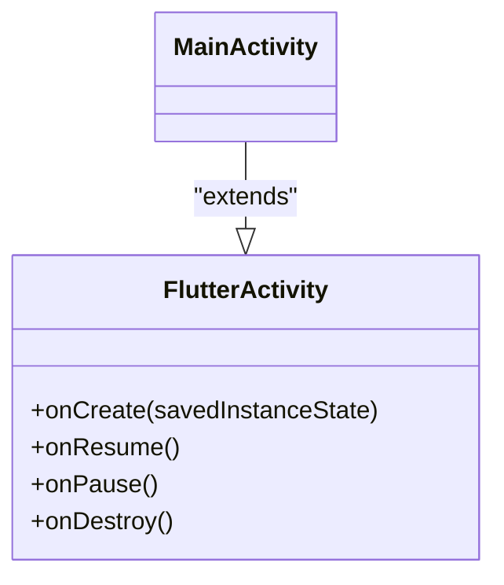
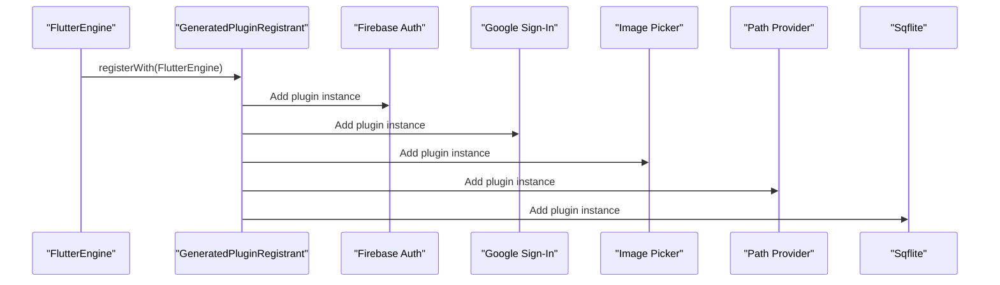
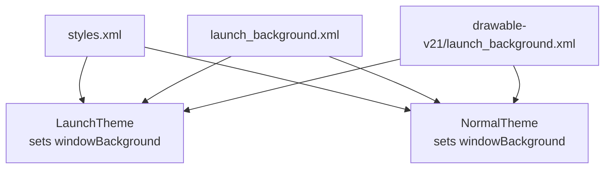
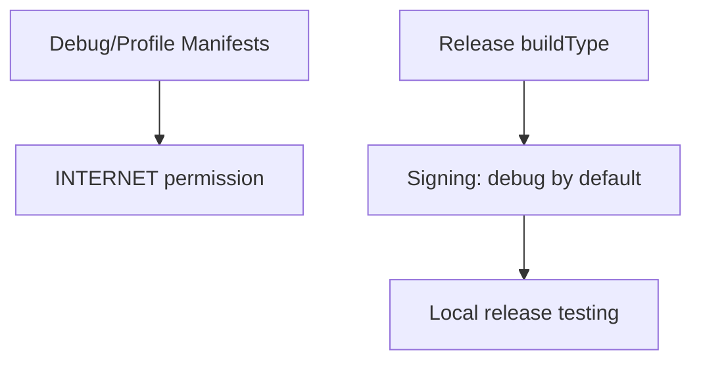
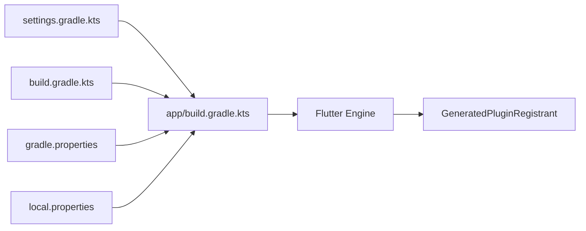

# Android Implementation

<cite>
**Referenced Files in This Document**
- [android/app/build.gradle.kts](file://android/app/build.gradle.kts)
- [android/build.gradle.kts](file://android/build.gradle.kts)
- [android/settings.gradle.kts](file://android/settings.gradle.kts)
- [android/gradle.properties](file://android/gradle.properties)
- [android/local.properties](file://android/local.properties)
- [android/gradle/wrapper/gradle-wrapper.properties](file://android/gradle/wrapper/gradle-wrapper.properties)
- [android/app/src/main/AndroidManifest.xml](file://android/app/src/main/AndroidManifest.xml)
- [android/app/src/debug/AndroidManifest.xml](file://android/app/src/debug/AndroidManifest.xml)
- [android/app/src/profile/AndroidManifest.xml](file://android/app/src/profile/AndroidManifest.xml)
- [android/app/src/main/kotlin/zbdezign/com/au/MainActivity.kt](file://android/app/src/main/kotlin/zbdezign/com/au/MainActivity.kt)
- [android/app/src/main/java/io/flutter/plugins/GeneratedPluginRegistrant.java](file://android/app/src/main/java/io/flutter/plugins/GeneratedPluginRegistrant.java)
- [android/app/src/main/res/values/styles.xml](file://android/app/src/main/res/values/styles.xml)
- [android/app/src/main/res/drawable/launch_background.xml](file://android/app/src/main/res/drawable/launch_background.xml)
- [pubspec.yaml](file://pubspec.yaml)
- [android/.gitignore](file://android/.gitignore)
</cite>

## Table of Contents
1. [Introduction](#introduction)
2. [Project Structure](#project-structure)
3. [Core Components](#core-components)
4. [Architecture Overview](#architecture-overview)
5. [Detailed Component Analysis](#detailed-component-analysis)
6. [Dependency Analysis](#dependency-analysis)
7. [Performance Considerations](#performance-considerations)
8. [Troubleshooting Guide](#troubleshooting-guide)
9. [Conclusion](#conclusion)
10. [Appendices](#appendices)

## Introduction
This document explains the Android implementation for ZB-DEZINE, focusing on Gradle build configuration, Kotlin MainActivity, Android manifest setup, resource management, build variants, signing, and Flutter-Android integration. It also covers Android-specific features such as permissions, intent handling, platform integrations, and deployment considerations. Guidance is provided for troubleshooting, performance optimization, and compatibility across Android versions.

## Project Structure
The Android module resides under the android/ directory and follows a standard Flutter-generated layout:
- Root Gradle configuration: top-level Gradle/Kotlin DSL scripts define repositories, build directory relocation, and plugin management.
- App module: Android app module configuration, build logic, and Android resources.
- Manifests: main application manifest and flavor-specific manifests for debug and profile builds.
- Kotlin source: minimal MainActivity extending FlutterActivity.
- Resources: themes, launch background, and density-specific drawables.
- Wrapper: Gradle wrapper distribution configuration.

**Diagram sources**
- [android/app/build.gradle.kts:1-48](file://android/app/build.gradle.kts#L1-L48)
- [android/build.gradle.kts:1-25](file://android/build.gradle.kts#L1-L25)
- [android/settings.gradle.kts:1-30](file://android/settings.gradle.kts#L1-L30)
- [android/gradle/wrapper/gradle-wrapper.properties:1-6](file://android/gradle/wrapper/gradle-wrapper.properties#L1-L6)
- [android/app/src/main/AndroidManifest.xml:1-46](file://android/app/src/main/AndroidManifest.xml#L1-L46)
- [android/app/src/main/kotlin/zbdezign/com/au/MainActivity.kt:1-6](file://android/app/src/main/kotlin/zbdezign/com/au/MainActivity.kt#L1-L6)
- [android/app/src/main/res/values/styles.xml:1-19](file://android/app/src/main/res/values/styles.xml#L1-L19)
- [android/app/src/main/res/drawable/launch_background.xml:1-13](file://android/app/src/main/res/drawable/launch_background.xml#L1-L13)
- [android/app/src/debug/AndroidManifest.xml:1-8](file://android/app/src/debug/AndroidManifest.xml#L1-L8)
- [android/app/src/profile/AndroidManifest.xml:1-8](file://android/app/src/profile/AndroidManifest.xml#L1-L8)

**Section sources**
- [android/app/build.gradle.kts:1-48](file://android/app/build.gradle.kts#L1-L48)
- [android/build.gradle.kts:1-25](file://android/build.gradle.kts#L1-L25)
- [android/settings.gradle.kts:1-30](file://android/settings.gradle.kts#L1-L30)
- [android/gradle/wrapper/gradle-wrapper.properties:1-6](file://android/gradle/wrapper/gradle-wrapper.properties#L1-L6)

## Core Components
- Gradle build setup: Plugins, repositories, compile/target SDK, Java 17 compatibility, and Flutter integration via the Flutter Gradle Plugin.
- Build variants and signing: Debug signing used for release builds to enable local testing; production signing should be configured separately.
- Android manifest: Activity declaration, hardware acceleration, configuration changes, intent filters, and queries for text processing.
- MainActivity: Minimal Kotlin subclass of FlutterActivity.
- Resource management: Themes, launch background, and density-specific resources.
- Plugin registration: Generated plugin registrant registers Flutter plugins at runtime.

**Section sources**
- [android/app/build.gradle.kts:1-48](file://android/app/build.gradle.kts#L1-L48)
- [android/app/src/main/AndroidManifest.xml:1-46](file://android/app/src/main/AndroidManifest.xml#L1-L46)
- [android/app/src/main/kotlin/zbdezign/com/au/MainActivity.kt:1-6](file://android/app/src/main/kotlin/zbdezign/com/au/MainActivity.kt#L1-L6)
- [android/app/src/main/res/values/styles.xml:1-19](file://android/app/src/main/res/values/styles.xml#L1-L19)
- [android/app/src/main/res/drawable/launch_background.xml:1-13](file://android/app/src/main/res/drawable/launch_background.xml#L1-L13)
- [android/app/src/main/java/io/flutter/plugins/GeneratedPluginRegistrant.java:1-60](file://android/app/src/main/java/io/flutter/plugins/GeneratedPluginRegistrant.java#L1-L60)

## Architecture Overview
The Android app integrates with Flutter through the Flutter embedding. The MainActivity extends FlutterActivity and delegates lifecycle and rendering to the Flutter engine. Plugins are registered at startup via GeneratedPluginRegistrant. The Gradle configuration ties into Flutter’s toolchain and Google Services for Firebase.

**Diagram sources**
- [android/app/src/main/kotlin/zbdezign/com/au/MainActivity.kt:1-6](file://android/app/src/main/kotlin/zbdezign/com/au/MainActivity.kt#L1-L6)
- [android/app/src/main/AndroidManifest.xml:1-46](file://android/app/src/main/AndroidManifest.xml#L1-L46)
- [android/app/src/main/res/values/styles.xml:1-19](file://android/app/src/main/res/values/styles.xml#L1-L19)
- [android/app/src/main/res/drawable/launch_background.xml:1-13](file://android/app/src/main/res/drawable/launch_background.xml#L1-L13)
- [android/app/src/main/java/io/flutter/plugins/GeneratedPluginRegistrant.java:1-60](file://android/app/src/main/java/io/flutter/plugins/GeneratedPluginRegistrant.java#L1-L60)
- [android/settings.gradle.kts:1-30](file://android/settings.gradle.kts#L1-L30)
- [android/app/build.gradle.kts:1-48](file://android/app/build.gradle.kts#L1-L48)
- [android/build.gradle.kts:1-25](file://android/build.gradle.kts#L1-L25)
- [android/gradle.properties:1-3](file://android/gradle.properties#L1-L3)
- [android/local.properties:1-5](file://android/local.properties#L1-L5)

## Detailed Component Analysis

### Gradle Build Configuration
- Plugins: Android Application, Kotlin Android, Google Services for Firebase, and the Flutter Gradle Plugin.
- Repositories: Google and Maven Central configured at the root level.
- Build directory: Relocated to a shared build directory outside the android/ tree.
- Java/Kotlin: Compile and target Java compatibility set to 17; Kotlin jvmTarget aligned to 17.
- Flutter integration: Flutter SDK source set to the project root; versionCode and versionName sourced from Flutter configuration.
- Build types: Release uses debug signing by default; configure a release signingConfig for production.

**Diagram sources**
- [android/settings.gradle.kts:1-30](file://android/settings.gradle.kts#L1-L30)
- [android/app/build.gradle.kts:1-48](file://android/app/build.gradle.kts#L1-L48)

**Section sources**
- [android/app/build.gradle.kts:1-48](file://android/app/build.gradle.kts#L1-L48)
- [android/build.gradle.kts:1-25](file://android/build.gradle.kts#L1-L25)
- [android/settings.gradle.kts:1-30](file://android/settings.gradle.kts#L1-L30)
- [android/gradle.properties:1-3](file://android/gradle.properties#L1-L3)
- [android/local.properties:1-5](file://android/local.properties#L1-L5)

### Android Manifest Configuration
- Activity: MainActivity exported, singleTop launch mode, hardware acceleration enabled, soft input resize behavior, and extensive configChanges coverage.
- Themes: LaunchTheme sets the initial window background; NormalTheme applies post-initialization.
- Flutter embedding metadata: Embedding version declared for compatibility.
- Queries: Declares intent for text processing to support text selection actions.

**Diagram sources**
- [android/app/src/main/AndroidManifest.xml:1-46](file://android/app/src/main/AndroidManifest.xml#L1-L46)

**Section sources**
- [android/app/src/main/AndroidManifest.xml:1-46](file://android/app/src/main/AndroidManifest.xml#L1-L46)
- [android/app/src/debug/AndroidManifest.xml:1-8](file://android/app/src/debug/AndroidManifest.xml#L1-L8)
- [android/app/src/profile/AndroidManifest.xml:1-8](file://android/app/src/profile/AndroidManifest.xml#L1-L8)

### MainActivity Implementation
- MainActivity is a minimal Kotlin class extending FlutterActivity.
- No overrides or customizations are present; Flutter handles lifecycle and rendering.

**Diagram sources**
- [android/app/src/main/kotlin/zbdezign/com/au/MainActivity.kt:1-6](file://android/app/src/main/kotlin/zbdezign/com/au/MainActivity.kt#L1-L6)

**Section sources**
- [android/app/src/main/kotlin/zbdezign/com/au/MainActivity.kt:1-6](file://android/app/src/main/kotlin/zbdezign/com/au/MainActivity.kt#L1-L6)

### Flutter-Android Bridge and Plugin Registration
- GeneratedPluginRegistrant registers plugins at engine startup, including Firebase, Google Sign-In, Image Picker, Path Provider, Sqflite, and others.
- This ensures Android platform integrations are available to Flutter code.

**Diagram sources**
- [android/app/src/main/java/io/flutter/plugins/GeneratedPluginRegistrant.java:1-60](file://android/app/src/main/java/io/flutter/plugins/GeneratedPluginRegistrant.java#L1-L60)

**Section sources**
- [android/app/src/main/java/io/flutter/plugins/GeneratedPluginRegistrant.java:1-60](file://android/app/src/main/java/io/flutter/plugins/GeneratedPluginRegistrant.java#L1-L60)

### Resource Management and UI Adaptations
- Styles: LaunchTheme and NormalTheme define initial and ongoing window backgrounds.
- Launch background: Layer-list drawable with a base color and placeholder for a logo.
- Density-specific drawables: Separate launch_background.xml under drawable-v21 for API 21+ behavior.

**Diagram sources**
- [android/app/src/main/res/values/styles.xml:1-19](file://android/app/src/main/res/values/styles.xml#L1-L19)
- [android/app/src/main/res/drawable/launch_background.xml:1-13](file://android/app/src/main/res/drawable/launch_background.xml#L1-L13)

**Section sources**
- [android/app/src/main/res/values/styles.xml:1-19](file://android/app/src/main/res/values/styles.xml#L1-L19)
- [android/app/src/main/res/drawable/launch_background.xml:1-13](file://android/app/src/main/res/drawable/launch_background.xml#L1-L13)

### Build Variants and Signing
- Variants: Debug and Profile are supported via flavor manifests that declare INTERNET permission for development.
- Release signing: Currently uses debug signing to enable local release builds; replace with a proper release signingConfig for production.

**Diagram sources**
- [android/app/src/debug/AndroidManifest.xml:1-8](file://android/app/src/debug/AndroidManifest.xml#L1-L8)
- [android/app/src/profile/AndroidManifest.xml:1-8](file://android/app/src/profile/AndroidManifest.xml#L1-L8)
- [android/app/build.gradle.kts:36-42](file://android/app/build.gradle.kts#L36-L42)

**Section sources**
- [android/app/src/debug/AndroidManifest.xml:1-8](file://android/app/src/debug/AndroidManifest.xml#L1-L8)
- [android/app/src/profile/AndroidManifest.xml:1-8](file://android/app/src/profile/AndroidManifest.xml#L1-L8)
- [android/app/build.gradle.kts:36-42](file://android/app/build.gradle.kts#L36-L42)

### Android-Specific Features and Platform Integrations
- Permissions: INTERNET permission declared in debug/profile manifests for development communication.
- Intent handling: Activity intent filter supports MAIN/LAUNCHER; queries section declares PROCESS_TEXT action for text selection.
- Platform integrations: Firebase, Google Sign-In, Image Picker, Path Provider, and database plugin registrations handled by GeneratedPluginRegistrant.

**Section sources**
- [android/app/src/main/AndroidManifest.xml:1-46](file://android/app/src/main/AndroidManifest.xml#L1-L46)
- [android/app/src/main/java/io/flutter/plugins/GeneratedPluginRegistrant.java:1-60](file://android/app/src/main/java/io/flutter/plugins/GeneratedPluginRegistrant.java#L1-L60)

### Asset Management and Flutter Integration
- Flutter assets: Images and icons are declared in pubspec.yaml under the flutter assets section.
- Android resources: Drawable and values resources are separate from Flutter assets and managed via Android resource folders.

**Section sources**
- [pubspec.yaml:88-118](file://pubspec.yaml#L88-L118)
- [android/app/src/main/res/values/styles.xml:1-19](file://android/app/src/main/res/values/styles.xml#L1-L19)
- [android/app/src/main/res/drawable/launch_background.xml:1-13](file://android/app/src/main/res/drawable/launch_background.xml#L1-L13)

## Dependency Analysis
- Gradle dependencies: Root repositories and plugin versions are centralized; app module depends on Flutter toolchain and Google Services.
- Plugin registration: GeneratedPluginRegistrant aggregates platform plugins; ensure plugin versions align with Gradle-managed versions.
- Version alignment: Flutter versionCode/versionName are propagated to Android; ensure local.properties matches intended build modes.

**Diagram sources**
- [android/settings.gradle.kts:1-30](file://android/settings.gradle.kts#L1-L30)
- [android/app/build.gradle.kts:1-48](file://android/app/build.gradle.kts#L1-L48)
- [android/build.gradle.kts:1-25](file://android/build.gradle.kts#L1-L25)
- [android/gradle.properties:1-3](file://android/gradle.properties#L1-L3)
- [android/local.properties:1-5](file://android/local.properties#L1-L5)
- [android/app/src/main/java/io/flutter/plugins/GeneratedPluginRegistrant.java:1-60](file://android/app/src/main/java/io/flutter/plugins/GeneratedPluginRegistrant.java#L1-L60)

**Section sources**
- [android/app/build.gradle.kts:1-48](file://android/app/build.gradle.kts#L1-L48)
- [android/app/src/main/java/io/flutter/plugins/GeneratedPluginRegistrant.java:1-60](file://android/app/src/main/java/io/flutter/plugins/GeneratedPluginRegistrant.java#L1-L60)

## Performance Considerations
- Java/Kotlin 17: Using modern JVM targets can improve performance; ensure device compatibility.
- Hardware acceleration: Enabled in the manifest; keep enabled for smooth UI rendering.
- Build cache and memory: Gradle JVM args configured for larger heap and metaspace; adjust as needed for CI or developer machines.
- Resource density: Provide appropriately sized drawables to avoid scaling overhead.

[No sources needed since this section provides general guidance]

## Troubleshooting Guide
- Missing keystore or signing failures: The repository includes a gitignore pattern to protect keystores; configure a release signingConfig in the app module for production builds.
- Plugin registration errors: Verify GeneratedPluginRegistrant includes required plugins and that plugin versions are compatible with Gradle-managed versions.
- Internet permission issues: Confirm debug/profile manifests include INTERNET permission for development; remove or restrict as needed for production.
- Build directory conflicts: The root Gradle script relocates build directories; ensure no stale artifacts remain if switching environments.
- Flutter version mismatch: Ensure local.properties versionCode/versionName align with pubspec.yaml and Flutter build commands.

**Section sources**
- [android/.gitignore:10-14](file://android/.gitignore#L10-L14)
- [android/app/src/main/java/io/flutter/plugins/GeneratedPluginRegistrant.java:1-60](file://android/app/src/main/java/io/flutter/plugins/GeneratedPluginRegistrant.java#L1-L60)
- [android/app/src/debug/AndroidManifest.xml:1-8](file://android/app/src/debug/AndroidManifest.xml#L1-L8)
- [android/app/src/profile/AndroidManifest.xml:1-8](file://android/app/src/profile/AndroidManifest.xml#L1-L8)
- [android/build.gradle.kts:8-17](file://android/build.gradle.kts#L8-L17)
- [android/local.properties:4-5](file://android/local.properties#L4-L5)

## Conclusion
ZB-DEZINE’s Android implementation leverages Flutter’s Android embedding with a minimal MainActivity and a generated plugin registry. The Gradle configuration integrates with Flutter tooling and Google Services, while the manifest defines essential activity behavior and platform integrations. For production, configure dedicated signing, review permissions, and optimize resources for performance and compatibility across Android versions.

[No sources needed since this section summarizes without analyzing specific files]

## Appendices
- Deployment checklist:
  - Configure release signingConfig in the app module.
  - Review and minimize permissions for production.
  - Validate resource density and theme consistency.
  - Align plugin versions with Gradle-managed versions.
  - Confirm build directory relocation does not interfere with CI caching.

[No sources needed since this section provides general guidance]