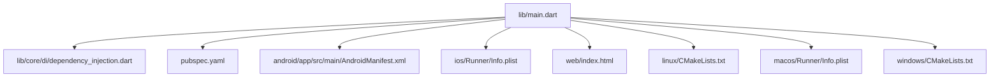
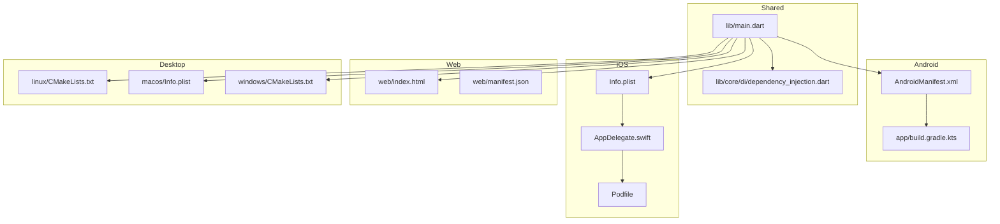
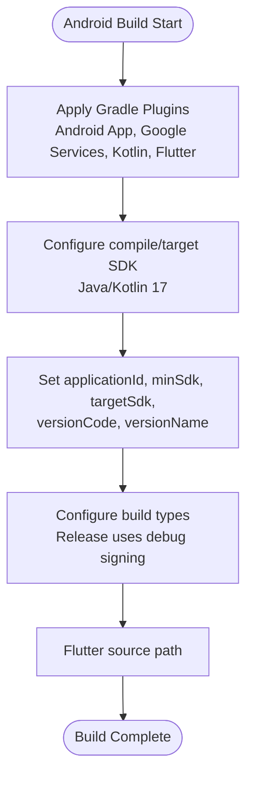
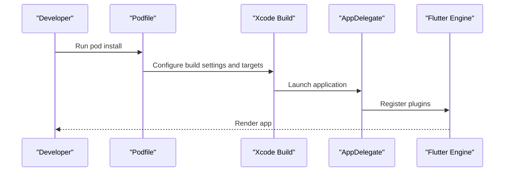
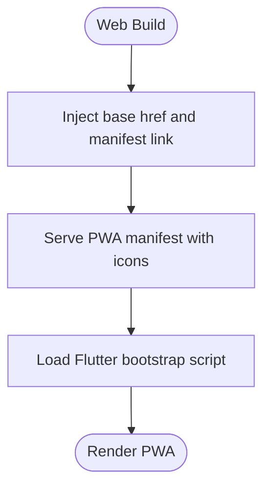
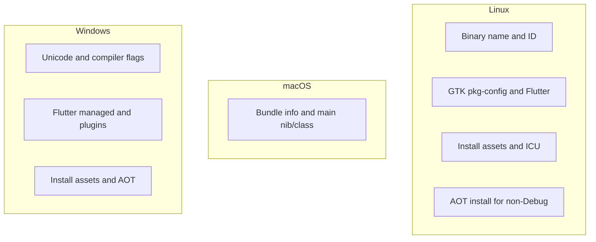
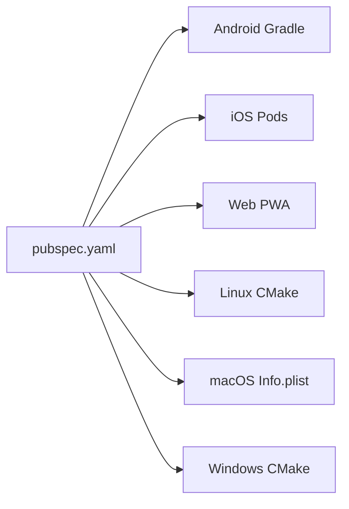

# Platform-Specific Implementation

<cite>
**Referenced Files in This Document**
- [pubspec.yaml](file://pubspec.yaml)
- [lib/main.dart](file://lib/main.dart)
- [lib/core/di/dependency_injection.dart](file://lib/core/di/dependency_injection.dart)
- [android/app/src/main/AndroidManifest.xml](file://android/app/src/main/AndroidManifest.xml)
- [android/app/build.gradle.kts](file://android/app/build.gradle.kts)
- [android/build.gradle.kts](file://android/build.gradle.kts)
- [android/app/src/main/res/values/styles.xml](file://android/app/src/main/res/values/styles.xml)
- [ios/Runner/Info.plist](file://ios/Runner/Info.plist)
- [ios/Runner/AppDelegate.swift](file://ios/Runner/AppDelegate.swift)
- [ios/Podfile](file://ios/Podfile)
- [web/index.html](file://web/index.html)
- [web/manifest.json](file://web/manifest.json)
- [linux/CMakeLists.txt](file://linux/CMakeLists.txt)
- [macos/Runner/Info.plist](file://macos/Runner/Info.plist)
- [windows/CMakeLists.txt](file://windows/CMakeLists.txt)
</cite>

## Table of Contents
1. [Introduction](#introduction)
2. [Project Structure](#project-structure)
3. [Core Components](#core-components)
4. [Architecture Overview](#architecture-overview)
5. [Detailed Component Analysis](#detailed-component-analysis)
6. [Dependency Analysis](#dependency-analysis)
7. [Performance Considerations](#performance-considerations)
8. [Troubleshooting Guide](#troubleshooting-guide)
9. [Conclusion](#conclusion)
10. [Appendices](#appendices)

## Introduction
This document explains the platform-specific implementation of ZB-DEZINE across Android, iOS, Web, Windows, macOS, and Linux. It covers build configurations, permissions, integrations, deployment settings, and platform-specific optimizations. It also highlights shared code patterns and cross-platform considerations derived from the repository’s configuration files.

## Project Structure
ZB-DEZINE follows a standard Flutter monorepo layout with platform-specific folders under android/, ios/, linux/, macos/, windows/, and web/. The application bootstraps in lib/main.dart and initializes dependency injection via lib/core/di/dependency_injection.dart. Platform-specific build and packaging logic is defined in each platform’s dedicated configuration files.

**Diagram sources**
- [lib/main.dart:12-19](file://lib/main.dart#L12-L19)
- [lib/core/di/dependency_injection.dart:11-26](file://lib/core/di/dependency_injection.dart#L11-L26)
- [pubspec.yaml:82-118](file://pubspec.yaml#L82-L118)
- [android/app/src/main/AndroidManifest.xml:1-46](file://android/app/src/main/AndroidManifest.xml#L1-L46)
- [ios/Runner/Info.plist:1-50](file://ios/Runner/Info.plist#L1-L50)
- [web/index.html:1-39](file://web/index.html#L1-L39)
- [linux/CMakeLists.txt:1-129](file://linux/CMakeLists.txt#L1-L129)
- [macos/Runner/Info.plist:1-33](file://macos/Runner/Info.plist#L1-L33)
- [windows/CMakeLists.txt:1-109](file://windows/CMakeLists.txt#L1-L109)

**Section sources**
- [lib/main.dart:12-19](file://lib/main.dart#L12-L19)
- [pubspec.yaml:82-118](file://pubspec.yaml#L82-L118)

## Core Components
- Application bootstrap and routing are initialized in lib/main.dart. The app reads a token from persistent storage during startup and selects the initial route accordingly.
- Dependency injection is centralized in lib/core/di/dependency_injection.dart, registering storage, theme, and network services. This pattern is reused across platforms to maintain consistent behavior.

Key behaviors:
- Token retrieval and conditional routing based on presence of a stored token.
- Global theme initialization using ScreenUtil and GetMaterialApp.
- Shared service registration for storage, theme, and HTTP networking.

**Section sources**
- [lib/main.dart:12-19](file://lib/main.dart#L12-L19)
- [lib/main.dart:21-46](file://lib/main.dart#L21-L46)
- [lib/core/di/dependency_injection.dart:11-26](file://lib/core/di/dependency_injection.dart#L11-L26)

## Architecture Overview
The runtime architecture is consistent across platforms, with platform-specific build and packaging steps. The Flutter engine renders UI, while platform channels and native integrations are configured per platform.

**Diagram sources**
- [lib/main.dart:12-19](file://lib/main.dart#L12-L19)
- [lib/core/di/dependency_injection.dart:11-26](file://lib/core/di/dependency_injection.dart#L11-L26)
- [android/app/src/main/AndroidManifest.xml:1-46](file://android/app/src/main/AndroidManifest.xml#L1-L46)
- [android/app/build.gradle.kts:1-48](file://android/app/build.gradle.kts#L1-L48)
- [ios/Runner/Info.plist:1-50](file://ios/Runner/Info.plist#L1-L50)
- [ios/Runner/AppDelegate.swift:1-14](file://ios/Runner/AppDelegate.swift#L1-L14)
- [ios/Podfile:1-44](file://ios/Podfile#L1-L44)
- [web/index.html:1-39](file://web/index.html#L1-L39)
- [web/manifest.json:1-36](file://web/manifest.json#L1-L36)
- [linux/CMakeLists.txt:1-129](file://linux/CMakeLists.txt#L1-L129)
- [macos/Runner/Info.plist:1-33](file://macos/Runner/Info.plist#L1-L33)
- [windows/CMakeLists.txt:1-109](file://windows/CMakeLists.txt#L1-L109)

## Detailed Component Analysis

### Android Implementation
- Build configuration
  - Application module build script applies Android application, Google Services, Kotlin, and Flutter Gradle plugins. It sets compile/target SDK versions via Flutter SDK defaults, Java/Kotlin JVM target to 17, and uses the Flutter-sourced applicationId, minSdk, targetSdk, versionCode, and versionName.
  - Top-level Gradle config centralizes build output and evaluation dependencies on the app module.
- Manifest and permissions
  - Declares the main activity, export status, launch theme, hardware acceleration, orientation and UI mode config changes, and intent queries for text processing.
  - Includes Flutter embedding metadata.
- Theming
  - Defines light launch and normal themes for the activity window background.
- Deployment settings
  - Release signing config references the debug keystore for development builds.

**Diagram sources**
- [android/app/build.gradle.kts:1-48](file://android/app/build.gradle.kts#L1-L48)
- [android/build.gradle.kts:1-25](file://android/build.gradle.kts#L1-L25)

**Section sources**
- [android/app/build.gradle.kts:11-43](file://android/app/build.gradle.kts#L11-L43)
- [android/app/src/main/AndroidManifest.xml:6-33](file://android/app/src/main/AndroidManifest.xml#L6-L33)
- [android/app/src/main/res/values/styles.xml:3-17](file://android/app/src/main/res/values/styles.xml#L3-L17)
- [android/build.gradle.kts:8-20](file://android/build.gradle.kts#L8-L20)

### iOS Implementation
- Build configuration
  - Podfile configures CocoaPods, locates Flutter root, installs iOS pods, and applies additional build settings for the target.
- App metadata and capabilities
  - Info.plist defines bundle identifiers, display names, supported orientations (including iPad), and enables indirect input events and minimum frame duration on iPhone.
- App lifecycle
  - AppDelegate registers plugins and defers to the Flutter app delegate.
- Deployment settings
  - Platform targeting and pod installation are handled by the Podfile.

**Diagram sources**
- [ios/Podfile:28-43](file://ios/Podfile#L28-L43)
- [ios/Runner/AppDelegate.swift:4-13](file://ios/Runner/AppDelegate.swift#L4-L13)
- [ios/Runner/Info.plist:25-47](file://ios/Runner/Info.plist#L25-L47)

**Section sources**
- [ios/Podfile:1-44](file://ios/Podfile#L1-L44)
- [ios/Runner/Info.plist:19-47](file://ios/Runner/Info.plist#L19-L47)
- [ios/Runner/AppDelegate.swift:1-14](file://ios/Runner/AppDelegate.swift#L1-L14)

### Web Implementation
- Progressive Web App support
  - index.html includes a base href placeholder for deployment paths, Apple touch icon meta tags for iOS mobile web apps, favicon, and a manifest link.
  - manifest.json defines standalone display, theme/background colors, orientation, and multiple icon sizes including maskable variants.
- Browser compatibility and deployment
  - Uses Flutter’s web bootstrap script and PWA manifest integration for offline caching and installability.

**Diagram sources**
- [web/index.html:17-36](file://web/index.html#L17-L36)
- [web/manifest.json:1-36](file://web/manifest.json#L1-L36)

**Section sources**
- [web/index.html:19-36](file://web/index.html#L19-L36)
- [web/manifest.json:1-36](file://web/manifest.json#L1-L36)

### Desktop Implementations
- Linux
  - CMake defines binary name, application ID, standard compiler settings, Flutter managed directory, GTK system dependencies, and installation of assets and ICU data. It supports Debug/Profile/Release modes and installs AOT libraries for non-Debug builds.
- macOS
  - Info.plist defines bundle identifiers, display name, minimum system version, and main nib/class entries for the app.
- Windows
  - CMake defines binary name, Unicode definitions, standard compiler settings, Flutter managed directory, and installation of assets, ICU data, and AOT libraries for Profile/Release. It supports in-place installation for Visual Studio builds.

**Diagram sources**
- [linux/CMakeLists.txt:7-129](file://linux/CMakeLists.txt#L7-L129)
- [macos/Runner/Info.plist:19-31](file://macos/Runner/Info.plist#L19-L31)
- [windows/CMakeLists.txt:7-109](file://windows/CMakeLists.txt#L7-L109)

**Section sources**
- [linux/CMakeLists.txt:1-129](file://linux/CMakeLists.txt#L1-L129)
- [macos/Runner/Info.plist:1-33](file://macos/Runner/Info.plist#L1-L33)
- [windows/CMakeLists.txt:1-109](file://windows/CMakeLists.txt#L1-L109)

## Dependency Analysis
- Shared dependencies and assets
  - pubspec.yaml declares Flutter SDK, UI and utility packages, and Firebase-related packages. It also defines assets and fonts for the app.
- Platform-specific build-time dependencies
  - Android integrates Google Services plugin and Kotlin.
  - iOS uses CocoaPods and Flutter pod helper.
  - Web relies on PWA manifest and bootstrap script.
  - Desktop platforms rely on CMake and system libraries (GTK on Linux).

**Diagram sources**
- [pubspec.yaml:30-66](file://pubspec.yaml#L30-L66)
- [pubspec.yaml:88-118](file://pubspec.yaml#L88-L118)
- [android/app/build.gradle.kts:1-9](file://android/app/build.gradle.kts#L1-L9)
- [ios/Podfile:28-36](file://ios/Podfile#L28-L36)
- [web/index.html:32-36](file://web/index.html#L32-L36)
- [linux/CMakeLists.txt:50-51](file://linux/CMakeLists.txt#L50-L51)
- [windows/CMakeLists.txt:49-50](file://windows/CMakeLists.txt#L49-L50)

**Section sources**
- [pubspec.yaml:30-66](file://pubspec.yaml#L30-L66)
- [pubspec.yaml:88-118](file://pubspec.yaml#L88-L118)
- [android/app/build.gradle.kts:1-9](file://android/app/build.gradle.kts#L1-L9)
- [ios/Podfile:28-36](file://ios/Podfile#L28-L36)
- [web/index.html:32-36](file://web/index.html#L32-L36)
- [linux/CMakeLists.txt:50-51](file://linux/CMakeLists.txt#L50-L51)
- [windows/CMakeLists.txt:49-50](file://windows/CMakeLists.txt#L49-L50)

## Performance Considerations
- Android
  - Hardware acceleration enabled for smoother rendering.
  - ConfigChanges include orientation and UI mode to reduce restarts during rotation.
- iOS
  - Minimum frame duration disabled on iPhone to allow higher refresh rates where supported.
  - Indirect input events enabled for advanced input handling.
- Web
  - PWA manifest and bootstrap script enable fast loading and offline readiness.
- Desktop
  - Compiler flags and AOT library installation for optimized runtime performance on Linux and Windows.
  - Linux uses RPATH to load bundled libraries efficiently.

**Section sources**
- [android/app/src/main/AndroidManifest.xml:13-14](file://android/app/src/main/AndroidManifest.xml#L13-L14)
- [android/app/src/main/AndroidManifest.xml:12](file://android/app/src/main/AndroidManifest.xml#L12)
- [ios/Runner/Info.plist:44-47](file://ios/Runner/Info.plist#L44-L47)
- [web/index.html:36](file://web/index.html#L36)
- [linux/CMakeLists.txt:44-46](file://linux/CMakeLists.txt#L44-L46)
- [windows/CMakeLists.txt:42-44](file://windows/CMakeLists.txt#L42-L44)

## Troubleshooting Guide
- Android
  - If release builds fail, verify signing configuration and ensure keystore availability.
  - If the app does not launch, confirm the MAIN action and LAUNCHER category are present in the manifest.
- iOS
  - If pods fail to install, ensure Flutter root is correctly detected and run the Flutter pod setup helper.
  - If the app does not render, check plugin registration in AppDelegate.
- Web
  - If PWA icons or manifest are missing, verify manifest.json paths and icons array.
  - If base href causes routing issues, rebuild with the correct base-href argument.
- Desktop
  - If Linux fails to link GTK, ensure pkg-config and GTK development packages are installed.
  - If Windows AOT libraries are missing, confirm Profile/Release builds include the AOT artifact.

**Section sources**
- [android/app/build.gradle.kts:36-42](file://android/app/build.gradle.kts#L36-L42)
- [android/app/src/main/AndroidManifest.xml:23-26](file://android/app/src/main/AndroidManifest.xml#L23-L26)
- [ios/Podfile:13-26](file://ios/Podfile#L13-L26)
- [ios/Runner/AppDelegate.swift:10](file://ios/Runner/AppDelegate.swift#L10)
- [web/manifest.json:11-34](file://web/manifest.json#L11-L34)
- [linux/CMakeLists.txt:54-56](file://linux/CMakeLists.txt#L54-L56)
- [windows/CMakeLists.txt:105-108](file://windows/CMakeLists.txt#L105-L108)

## Conclusion
ZB-DEZINE’s platform-specific implementations leverage Flutter’s unified codebase with targeted build and packaging configurations per platform. Android focuses on SDK alignment and signing, iOS emphasizes CocoaPods and plugin registration, Web targets PWA readiness, and Desktop platforms optimize for native environments using CMake and system libraries. Shared dependency injection and asset management ensure consistent behavior across platforms.

## Appendices
- Versioning and build metadata
  - pubspec.yaml documents versioning semantics for Android (versionName/versionCode), iOS (CFBundleShortVersionString/CFBundleVersion), and Windows (product and file version parts with build suffix).
- Asset and font configuration
  - pubspec.yaml lists image and icon assets and outlines font inclusion from packages.

**Section sources**
- [pubspec.yaml:12-19](file://pubspec.yaml#L12-L19)
- [pubspec.yaml:88-118](file://pubspec.yaml#L88-L118)