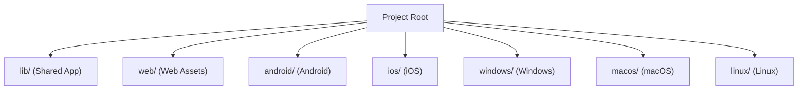
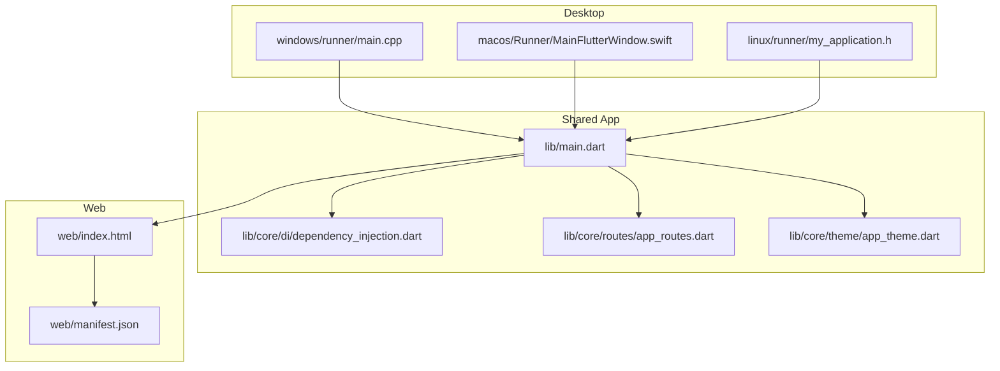
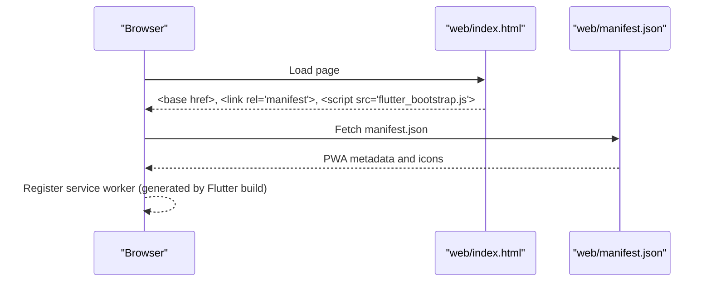
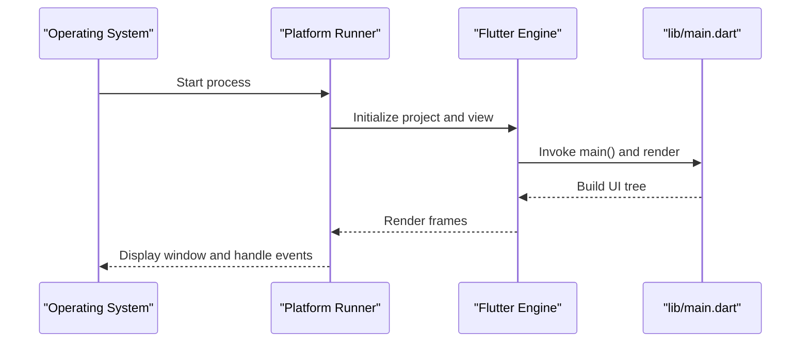
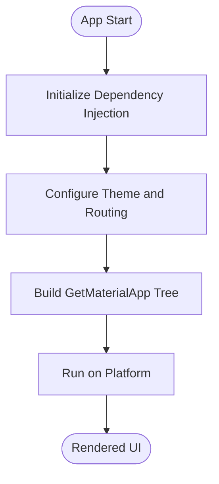
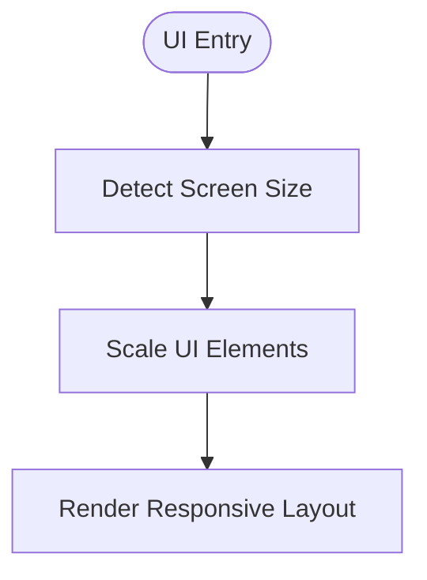
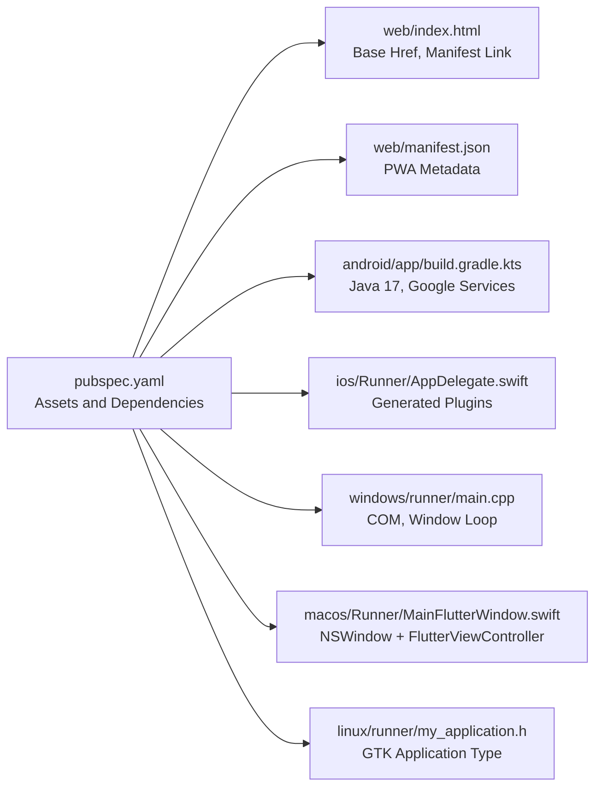
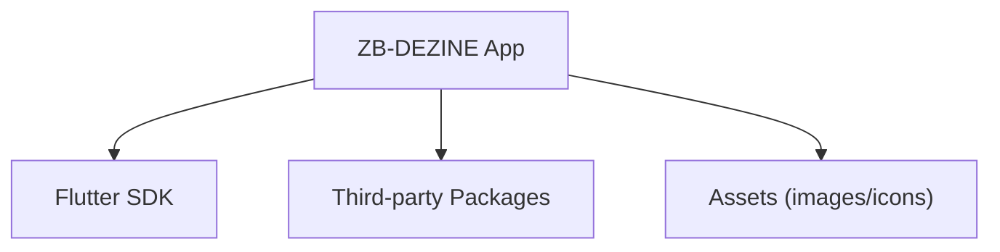

# Web and Desktop Support

<cite>
**Referenced Files in This Document**
- [pubspec.yaml](file://pubspec.yaml)
- [web/manifest.json](file://web/manifest.json)
- [web/index.html](file://web/index.html)
- [lib/main.dart](file://lib/main.dart)
- [lib/core/di/dependency_injection.dart](file://lib/core/di/dependency_injection.dart)
- [lib/core/routes/app_routes.dart](file://lib/core/routes/app_routes.dart)
- [lib/core/theme/app_theme.dart](file://lib/core/theme/app_theme.dart)
- [linux/runner/my_application.h](file://linux/runner/my_application.h)
- [macos/Runner/MainFlutterWindow.swift](file://macos/Runner/MainFlutterWindow.swift)
- [windows/runner/main.cpp](file://windows/runner/main.cpp)
- [android/app/build.gradle.kts](file://android/app/build.gradle.kts)
- [ios/Runner/AppDelegate.swift](file://ios/Runner/AppDelegate.swift)
- [README.md](file://README.md)
</cite>

## Table of Contents
1. [Introduction](#introduction)
2. [Project Structure](#project-structure)
3. [Core Components](#core-components)
4. [Architecture Overview](#architecture-overview)
5. [Detailed Component Analysis](#detailed-component-analysis)
6. [Dependency Analysis](#dependency-analysis)
7. [Performance Considerations](#performance-considerations)
8. [Troubleshooting Guide](#troubleshooting-guide)
9. [Conclusion](#conclusion)
10. [Appendices](#appendices)

## Introduction
This document explains how ZB-DEZINE supports web and desktop platforms using Flutter’s cross-platform capabilities. It covers Progressive Web App (PWA) configuration for web deployment, desktop implementations for Windows, macOS, and Linux, shared Flutter web/desktop architecture, platform detection mechanisms, responsive design considerations, build configurations, asset management, deployment pipelines, platform-specific limitations, performance optimizations, and troubleshooting guidance.

## Project Structure
ZB-DEZINE organizes platform-specific code under dedicated folders and centralizes shared application logic in lib. The web assets reside under web/, while desktop targets are configured under windows/, macos/, and linux/. The pubspec.yaml defines Flutter assets and dependencies used across platforms.

**Section sources**
- [pubspec.yaml:82-118](file://pubspec.yaml#L82-L118)
- [web/index.html:1-39](file://web/index.html#L1-L39)
- [android/app/build.gradle.kts:1-48](file://android/app/build.gradle.kts#L1-L48)
- [ios/Runner/AppDelegate.swift:1-14](file://ios/Runner/AppDelegate.swift#L1-L14)
- [windows/runner/main.cpp:1-44](file://windows/runner/main.cpp#L1-L44)
- [macos/Runner/MainFlutterWindow.swift:1-16](file://macos/Runner/MainFlutterWindow.swift#L1-L16)
- [linux/runner/my_application.h:1-22](file://linux/runner/my_application.h#L1-L22)

## Core Components
- Application bootstrap initializes platform services and routing via dependency injection and routes.
- Theme and design system are centralized for consistent light/dark modes across platforms.
- Asset declarations define images and icons used by web and desktop builds.

Key implementation references:
- Application entry and routing: [lib/main.dart:12-47](file://lib/main.dart#L12-L47)
- Dependency initialization: [lib/core/di/dependency_injection.dart:11-26](file://lib/core/di/dependency_injection.dart#L11-L26)
- Route constants: [lib/core/routes/app_routes.dart:1-34](file://lib/core/routes/app_routes.dart#L1-L34)
- Theme definitions: [lib/core/theme/app_theme.dart:4-23](file://lib/core/theme/app_theme.dart#L4-L23)
- Asset declarations: [pubspec.yaml:88-114](file://pubspec.yaml#L88-L114)

**Section sources**
- [lib/main.dart:12-47](file://lib/main.dart#L12-L47)
- [lib/core/di/dependency_injection.dart:11-26](file://lib/core/di/dependency_injection.dart#L11-L26)
- [lib/core/routes/app_routes.dart:1-34](file://lib/core/routes/app_routes.dart#L1-L34)
- [lib/core/theme/app_theme.dart:4-23](file://lib/core/theme/app_theme.dart#L4-L23)
- [pubspec.yaml:88-114](file://pubspec.yaml#L88-L114)

## Architecture Overview
The app uses a shared Flutter architecture with platform-specific runners and assets. Web deployment leverages Flutter Web with PWA features enabled via manifest.json and index.html. Desktop targets use native platform toolchains with minimal platform-specific code.

**Diagram sources**
- [lib/main.dart:12-47](file://lib/main.dart#L12-L47)
- [lib/core/di/dependency_injection.dart:11-26](file://lib/core/di/dependency_injection.dart#L11-L26)
- [lib/core/routes/app_routes.dart:1-34](file://lib/core/routes/app_routes.dart#L1-L34)
- [lib/core/theme/app_theme.dart:4-23](file://lib/core/theme/app_theme.dart#L4-L23)
- [web/index.html:1-39](file://web/index.html#L1-L39)
- [web/manifest.json:1-36](file://web/manifest.json#L1-L36)
- [windows/runner/main.cpp:1-44](file://windows/runner/main.cpp#L1-L44)
- [macos/Runner/MainFlutterWindow.swift:1-16](file://macos/Runner/MainFlutterWindow.swift#L1-L16)
- [linux/runner/my_application.h:1-22](file://linux/runner/my_application.h#L1-L22)

## Detailed Component Analysis

### Web Deployment (PWA)
- PWA configuration is defined in web/manifest.json with name, short_name, display, background_color, theme_color, orientation, and icon sets including maskable variants.
- web/index.html sets base href, meta tags for iOS and favicon, and links to manifest.json and the Flutter bootstrap script.
- Flutter Web uses the standard Flutter Web pipeline; PWA installability depends on a valid manifest and service worker generation during production builds.

**Diagram sources**
- [web/index.html:17-36](file://web/index.html#L17-L36)
- [web/manifest.json:1-36](file://web/manifest.json#L1-L36)

**Section sources**
- [web/manifest.json:1-36](file://web/manifest.json#L1-L36)
- [web/index.html:1-39](file://web/index.html#L1-L39)

### Desktop Implementations (Windows, macOS, Linux)
- Windows: Entry point initializes COM, creates a Flutter window with a default size, and runs the message loop. Platform channels and plugins are supported via the Flutter engine.
- macOS: MainFlutterWindow integrates a FlutterViewController into the NSWindow lifecycle and registers generated plugins.
- Linux: GTK-based application header declares the application type and provides a constructor for a Flutter-based app.

**Diagram sources**
- [windows/runner/main.cpp:8-43](file://windows/runner/main.cpp#L8-L43)
- [macos/Runner/MainFlutterWindow.swift:4-14](file://macos/Runner/MainFlutterWindow.swift#L4-L14)
- [linux/runner/my_application.h:6-19](file://linux/runner/my_application.h#L6-L19)
- [lib/main.dart:12-47](file://lib/main.dart#L12-L47)

**Section sources**
- [windows/runner/main.cpp:1-44](file://windows/runner/main.cpp#L1-L44)
- [macos/Runner/MainFlutterWindow.swift:1-16](file://macos/Runner/MainFlutterWindow.swift#L1-L16)
- [linux/runner/my_application.h:1-22](file://linux/runner/my_application.h#L1-L22)

### Shared Flutter Web/Desktop Architecture
- lib/main.dart bootstraps the app, initializes dependency injection, and configures routing and theming. This code is reused across web and desktop builds.
- Dependency injection wires storage, theme services, network clients, and controllers, enabling consistent behavior across platforms.
- Route constants define navigation structure used by both web and desktop.

**Diagram sources**
- [lib/main.dart:12-47](file://lib/main.dart#L12-L47)
- [lib/core/di/dependency_injection.dart:11-26](file://lib/core/di/dependency_injection.dart#L11-L26)
- [lib/core/routes/app_routes.dart:1-34](file://lib/core/routes/app_routes.dart#L1-L34)

**Section sources**
- [lib/main.dart:12-47](file://lib/main.dart#L12-L47)
- [lib/core/di/dependency_injection.dart:11-26](file://lib/core/di/dependency_injection.dart#L11-L26)
- [lib/core/routes/app_routes.dart:1-34](file://lib/core/routes/app_routes.dart#L1-L34)

### Responsive Design and Platform Detection
- ScreenUtil is initialized in lib/main.dart with a design size, enabling responsive layouts across devices.
- Platform-specific behaviors can be introduced via platform channels or conditional logic in widgets; however, the current code does not include explicit platform checks.

**Diagram sources**
- [lib/main.dart:26-28](file://lib/main.dart#L26-L28)

**Section sources**
- [lib/main.dart:26-28](file://lib/main.dart#L26-L28)

### Build Configurations and Asset Management
- Assets are declared in pubspec.yaml under the flutter assets section, including images and icons used by web and desktop builds.
- Android build uses the Flutter Gradle plugin and Google Services plugin, with Java 17 compatibility and application ID set.
- iOS uses the FlutterAppDelegate and registers generated plugins.
- Desktop targets rely on platform toolchains and CMake-based runners.

**Diagram sources**
- [pubspec.yaml:88-114](file://pubspec.yaml#L88-L114)
- [android/app/build.gradle.kts:1-48](file://android/app/build.gradle.kts#L1-L48)
- [ios/Runner/AppDelegate.swift:1-14](file://ios/Runner/AppDelegate.swift#L1-L14)
- [web/index.html:17-36](file://web/index.html#L17-L36)
- [web/manifest.json:1-36](file://web/manifest.json#L1-L36)
- [windows/runner/main.cpp:8-43](file://windows/runner/main.cpp#L8-L43)
- [macos/Runner/MainFlutterWindow.swift:4-14](file://macos/Runner/MainFlutterWindow.swift#L4-L14)
- [linux/runner/my_application.h:6-19](file://linux/runner/my_application.h#L6-L19)

**Section sources**
- [pubspec.yaml:88-114](file://pubspec.yaml#L88-L114)
- [android/app/build.gradle.kts:1-48](file://android/app/build.gradle.kts#L1-L48)
- [ios/Runner/AppDelegate.swift:1-14](file://ios/Runner/AppDelegate.swift#L1-L14)
- [web/index.html:17-36](file://web/index.html#L17-L36)
- [web/manifest.json:1-36](file://web/manifest.json#L1-L36)
- [windows/runner/main.cpp:1-44](file://windows/runner/main.cpp#L1-L44)
- [macos/Runner/MainFlutterWindow.swift:1-16](file://macos/Runner/MainFlutterWindow.swift#L1-L16)
- [linux/runner/my_application.h:1-22](file://linux/runner/my_application.h#L1-L22)

## Dependency Analysis
- The app declares Flutter SDK and numerous third-party packages for UI, state management, networking, and platform integrations.
- Firebase-related packages are included, indicating potential cloud features; ensure platform-specific Firebase setup is configured per platform.
- Asset dependencies are centralized in pubspec.yaml, ensuring consistent availability across web and desktop.

**Diagram sources**
- [pubspec.yaml:30-66](file://pubspec.yaml#L30-L66)
- [pubspec.yaml:88-114](file://pubspec.yaml#L88-L114)

**Section sources**
- [pubspec.yaml:30-66](file://pubspec.yaml#L30-L66)
- [pubspec.yaml:88-114](file://pubspec.yaml#L88-L114)

## Performance Considerations
- Use Flutter Web’s production builds to enable service worker generation and optimized JavaScript bundles.
- Minimize heavy assets and leverage caching strategies for web resources.
- On desktop, ensure efficient rendering and avoid unnecessary rebuilds by structuring state management with dependency injection and reactive controllers.
- Keep platform-specific runners lean; defer heavy logic to shared libraries.

[No sources needed since this section provides general guidance]

## Troubleshooting Guide
- Web PWA not installing:
  - Verify web/manifest.json fields and icon paths.
  - Confirm web/index.html includes the manifest link tag and base href.
  - Ensure production build generates a service worker.
  - References: [web/manifest.json:1-36](file://web/manifest.json#L1-L36), [web/index.html:17-36](file://web/index.html#L17-L36)
- Web assets not loading:
  - Confirm asset paths in pubspec.yaml match usage in code.
  - Reference: [pubspec.yaml:88-114](file://pubspec.yaml#L88-L114)
- Android build failures:
  - Check Java version compatibility and Google Services plugin configuration.
  - Reference: [android/app/build.gradle.kts:16-23](file://android/app/build.gradle.kts#L16-L23), [android/app/build.gradle.kts:4-8](file://android/app/build.gradle.kts#L4-L8)
- iOS plugin registration:
  - Ensure GeneratedPluginRegistrant is registered in AppDelegate.
  - Reference: [ios/Runner/AppDelegate.swift:10](file://ios/Runner/AppDelegate.swift#L10)
- Windows window creation issues:
  - Validate window creation parameters and COM initialization.
  - Reference: [windows/runner/main.cpp:20-33](file://windows/runner/main.cpp#L20-L33)
- macOS window integration:
  - Confirm FlutterViewController is attached to the content controller.
  - Reference: [macos/Runner/MainFlutterWindow.swift:4-14](file://macos/Runner/MainFlutterWindow.swift#L4-L14)
- Linux application type:
  - Ensure GTK application type is correctly declared.
  - Reference: [linux/runner/my_application.h:6-19](file://linux/runner/my_application.h#L6-L19)
- App startup and routing:
  - Validate dependency injection initialization and route constants.
  - References: [lib/main.dart:12-19](file://lib/main.dart#L12-L19), [lib/core/di/dependency_injection.dart:11-26](file://lib/core/di/dependency_injection.dart#L11-L26), [lib/core/routes/app_routes.dart:1-34](file://lib/core/routes/app_routes.dart#L1-L34)

**Section sources**
- [web/manifest.json:1-36](file://web/manifest.json#L1-L36)
- [web/index.html:17-36](file://web/index.html#L17-L36)
- [pubspec.yaml:88-114](file://pubspec.yaml#L88-L114)
- [android/app/build.gradle.kts:16-23](file://android/app/build.gradle.kts#L16-L23)
- [android/app/build.gradle.kts:4-8](file://android/app/build.gradle.kts#L4-L8)
- [ios/Runner/AppDelegate.swift:10](file://ios/Runner/AppDelegate.swift#L10)
- [windows/runner/main.cpp:20-33](file://windows/runner/main.cpp#L20-L33)
- [macos/Runner/MainFlutterWindow.swift:4-14](file://macos/Runner/MainFlutterWindow.swift#L4-L14)
- [linux/runner/my_application.h:6-19](file://linux/runner/my_application.h#L6-L19)
- [lib/main.dart:12-19](file://lib/main.dart#L12-L19)
- [lib/core/di/dependency_injection.dart:11-26](file://lib/core/di/dependency_injection.dart#L11-L26)
- [lib/core/routes/app_routes.dart:1-34](file://lib/core/routes/app_routes.dart#L1-L34)

## Conclusion
ZB-DEZINE leverages Flutter’s unified codebase to deliver consistent experiences across web and desktop. Web deployment relies on a PWA manifest and index.html configuration, while desktop targets integrate with native platform toolchains. Centralized dependency injection, routing, and theming enable maintainable cross-platform development. For robust deployments, ensure proper asset management, platform-specific build configurations, and platform-specific troubleshooting steps are followed.

[No sources needed since this section summarizes without analyzing specific files]

## Appendices
- Getting started guide for Flutter development is available in the repository README.
- References: [README.md:1-17](file://README.md#L1-L17)

**Section sources**
- [README.md:1-17](file://README.md#L1-L17)