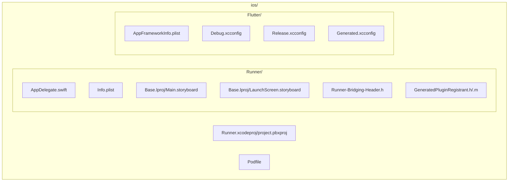
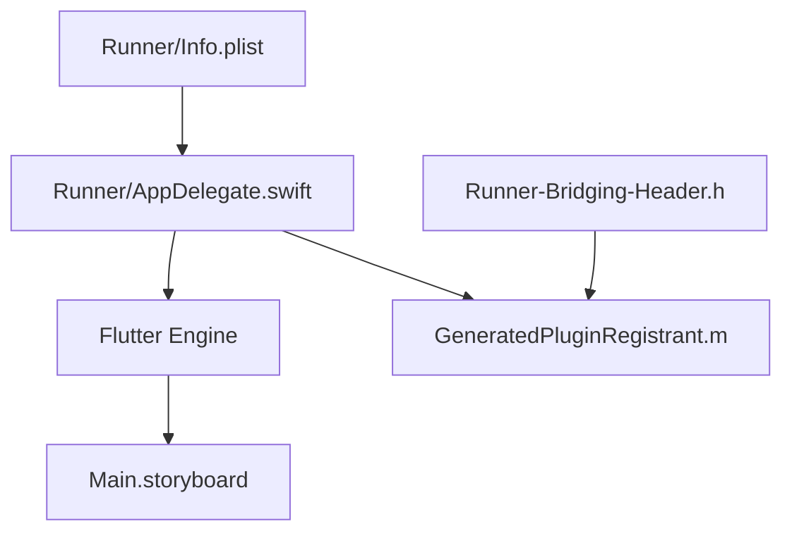
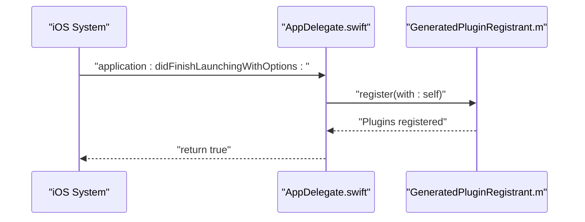
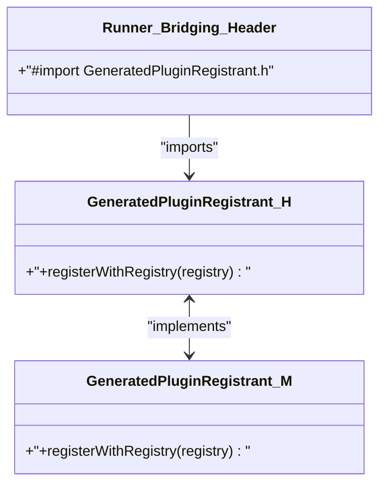
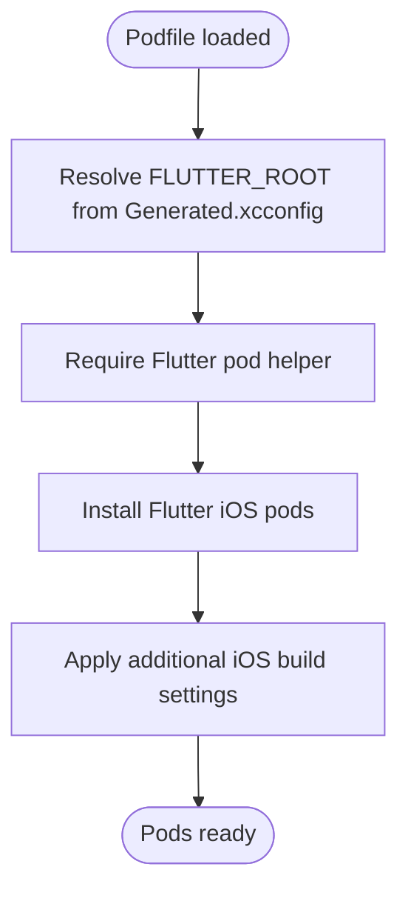
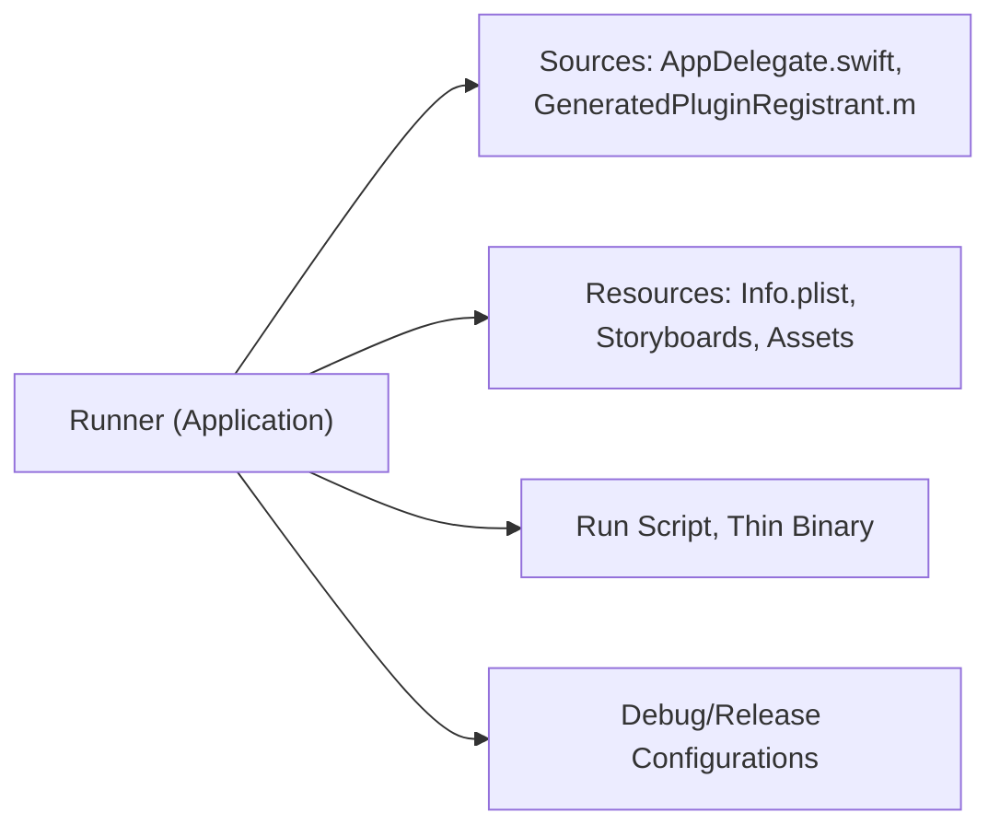
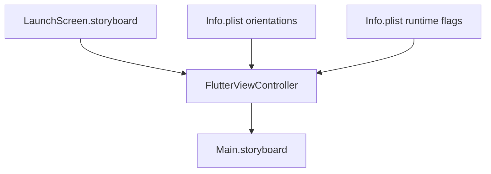
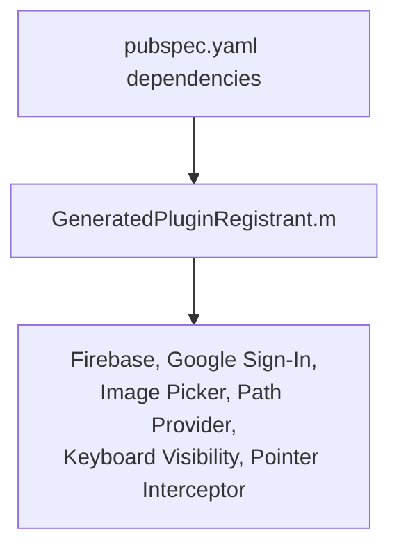
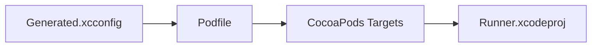

# iOS Implementation

<cite>
**Referenced Files in This Document**
- [AppDelegate.swift](file://ios/Runner/AppDelegate.swift)
- [Info.plist](file://ios/Runner/Info.plist)
- [Podfile](file://ios/Podfile)
- [project.pbxproj](file://ios/Runner.xcodeproj/project.pbxproj)
- [AppFrameworkInfo.plist](file://ios/Flutter/AppFrameworkInfo.plist)
- [Debug.xcconfig](file://ios/Flutter/Debug.xcconfig)
- [Release.xcconfig](file://ios/Flutter/Release.xcconfig)
- [Generated.xcconfig](file://ios/Flutter/Generated.xcconfig)
- [Main.storyboard](file://ios/Runner/Base.lproj/Main.storyboard)
- [LaunchScreen.storyboard](file://ios/Runner/Base.lproj/LaunchScreen.storyboard)
- [Runner-Bridging-Header.h](file://ios/Runner/Runner-Bridging-Header.h)
- [GeneratedPluginRegistrant.h](file://ios/Runner/GeneratedPluginRegistrant.h)
- [GeneratedPluginRegistrant.m](file://ios/Runner/GeneratedPluginRegistrant.m)
- [pubspec.yaml](file://pubspec.yaml)
</cite>

## Table of Contents
1. [Introduction](#introduction)
2. [Project Structure](#project-structure)
3. [Core Components](#core-components)
4. [Architecture Overview](#architecture-overview)
5. [Detailed Component Analysis](#detailed-component-analysis)
6. [Dependency Analysis](#dependency-analysis)
7. [Performance Considerations](#performance-considerations)
8. [Troubleshooting Guide](#troubleshooting-guide)
9. [Conclusion](#conclusion)
10. [Appendices](#appendices)

## Introduction
This document provides a comprehensive iOS implementation guide for ZB-DEZINE, focusing on Xcode project setup, Swift AppDelegate configuration, Info.plist settings, CocoaPods integration, entitlements and capabilities, and App Store deployment preparation. It also covers iOS project structure, build settings, provisioning profiles, code signing, the Flutter-iOS bridge, iOS-specific UI adaptations, platform integrations, and troubleshooting techniques.

## Project Structure
The iOS implementation resides under the ios/ directory and follows a standard Flutter-generated Xcode project layout:
- Runner: Application target containing AppDelegate, Info.plist, storyboards, assets, and bridging header.
- Flutter: Flutter framework configuration and generated settings.
- Pods: CocoaPods-managed third-party dependencies.
- RunnerTests: Unit test target.

**Diagram sources**
- [project.pbxproj:147-166](file://ios/Runner.xcodeproj/project.pbxproj#L147-L166)
- [Podfile:1-44](file://ios/Podfile#L1-44)
- [AppFrameworkInfo.plist:1-27](file://ios/Flutter/AppFrameworkInfo.plist#L1-L27)

**Section sources**
- [project.pbxproj:147-166](file://ios/Runner.xcodeproj/project.pbxproj#L147-L166)
- [Podfile:1-44](file://ios/Podfile#L1-44)

## Core Components
This section documents the iOS-specific configuration and implementation essentials for ZB-DEZINE.

- AppDelegate.swift
  - Extends the Flutter application lifecycle to register plugins during startup.
  - Registers generated plugins with the Flutter engine.
  - Entry point for iOS application launch sequence.

- Info.plist
  - Defines bundle identifiers, display names, supported orientations, launch storyboard, and runtime attributes.
  - Enables indirect input events and minimum frame duration adjustments for smoother animations.

- Podfile
  - Configures CocoaPods integration for iOS, including platform targeting and post-install hooks.
  - Uses Flutter’s helper to install iOS pods and applies additional build settings.

- Build Settings and Configurations
  - Debug.xcconfig and Release.xcconfig include generated settings and Pods configurations.
  - Generated.xcconfig defines Flutter build metadata and simulator/simulator architectures exclusion.

- Storyboards
  - Main.storyboard hosts the FlutterViewController.
  - LaunchScreen.storyboard provides the launch screen visuals.

- Bridging Header and Plugin Registration
  - Runner-Bridging-Header.h imports GeneratedPluginRegistrant.h.
  - GeneratedPluginRegistrant.m registers platform plugins used by the app.

**Section sources**
- [AppDelegate.swift:1-14](file://ios/Runner/AppDelegate.swift#L1-L14)
- [Info.plist:1-50](file://ios/Runner/Info.plist#L1-L50)
- [Podfile:1-44](file://ios/Podfile#L1-44)
- [Debug.xcconfig:1-3](file://ios/Flutter/Debug.xcconfig#L1-L3)
- [Release.xcconfig:1-3](file://ios/Flutter/Release.xcconfig#L1-L3)
- [Generated.xcconfig:1-15](file://ios/Flutter/Generated.xcconfig#L1-L15)
- [Main.storyboard:1-27](file://ios/Runner/Base.lproj/Main.storyboard#L1-L27)
- [LaunchScreen.storyboard:1-38](file://ios/Runner/Base.lproj/LaunchScreen.storyboard#L1-L38)
- [Runner-Bridging-Header.h:1-2](file://ios/Runner/Runner-Bridging-Header.h#L1-L2)
- [GeneratedPluginRegistrant.h:1-20](file://ios/Runner/GeneratedPluginRegistrant.h#L1-L20)
- [GeneratedPluginRegistrant.m:1-71](file://ios/Runner/GeneratedPluginRegistrant.m#L1-L71)

## Architecture Overview
The iOS application integrates Flutter via a native host (Runner) and a bridging mechanism. The AppDelegate initializes the Flutter engine and registers plugins. The storyboard defines the initial UI, and the bridging header connects Objective-C plugin registration to Swift.

**Diagram sources**
- [AppDelegate.swift:1-14](file://ios/Runner/AppDelegate.swift#L1-L14)
- [GeneratedPluginRegistrant.m:57-68](file://ios/Runner/GeneratedPluginRegistrant.m#L57-L68)
- [Runner-Bridging-Header.h:1-2](file://ios/Runner/Runner-Bridging-Header.h#L1-L2)
- [Main.storyboard:1-27](file://ios/Runner/Base.lproj/Main.storyboard#L1-L27)
- [Info.plist:1-50](file://ios/Runner/Info.plist#L1-L50)

## Detailed Component Analysis

### AppDelegate Implementation
The AppDelegate configures the application lifecycle and plugin registration. It overrides the launch method to register plugins with the Flutter engine before delegating to the superclass.

**Diagram sources**
- [AppDelegate.swift:6-12](file://ios/Runner/AppDelegate.swift#L6-L12)
- [GeneratedPluginRegistrant.m:59-68](file://ios/Runner/GeneratedPluginRegistrant.m#L59-L68)

**Section sources**
- [AppDelegate.swift:1-14](file://ios/Runner/AppDelegate.swift#L1-L14)
- [GeneratedPluginRegistrant.m:57-68](file://ios/Runner/GeneratedPluginRegistrant.m#L57-L68)

### Flutter-iOS Bridge Setup
The bridge is established via the bridging header, which imports the generated plugin registrant. The registrant dynamically imports and registers platform plugins.

**Diagram sources**
- [Runner-Bridging-Header.h:1-2](file://ios/Runner/Runner-Bridging-Header.h#L1-L2)
- [GeneratedPluginRegistrant.h:14-16](file://ios/Runner/GeneratedPluginRegistrant.h#L14-L16)
- [GeneratedPluginRegistrant.m:57-68](file://ios/Runner/GeneratedPluginRegistrant.m#L57-L68)

**Section sources**
- [Runner-Bridging-Header.h:1-2](file://ios/Runner/Runner-Bridging-Header.h#L1-L2)
- [GeneratedPluginRegistrant.h:1-20](file://ios/Runner/GeneratedPluginRegistrant.h#L1-L20)
- [GeneratedPluginRegistrant.m:1-71](file://ios/Runner/GeneratedPluginRegistrant.m#L1-L71)

### CocoaPods Integration (Podfile)
The Podfile configures platform targeting, project configuration, and Flutter pod installation. It includes a post-install hook to apply additional iOS build settings.

**Diagram sources**
- [Podfile:13-26](file://ios/Podfile#L13-L26)
- [Podfile:30-37](file://ios/Podfile#L30-L37)
- [Podfile:39-43](file://ios/Podfile#L39-L43)

**Section sources**
- [Podfile:1-44](file://ios/Podfile#L1-L44)

### iOS Project Structure and Build Settings
The Xcode project file defines targets, build phases, and build configurations. Key aspects:
- Runner target includes AppDelegate, storyboards, assets, and plugin registration.
- Build configurations set deployment target, Swift version, bridging header, and bundle identifiers.
- Run scripts integrate Flutter build and embed/thin steps.

**Diagram sources**
- [project.pbxproj:147-166](file://ios/Runner.xcodeproj/project.pbxproj#L147-L166)
- [project.pbxproj:245-259](file://ios/Runner.xcodeproj/project.pbxproj#L245-L259)
- [project.pbxproj:310-382](file://ios/Runner.xcodeproj/project.pbxproj#L310-L382)
- [project.pbxproj:430-540](file://ios/Runner.xcodeproj/project.pbxproj#L430-L540)

**Section sources**
- [project.pbxproj:147-166](file://ios/Runner.xcodeproj/project.pbxproj#L147-L166)
- [project.pbxproj:245-259](file://ios/Runner.xcodeproj/project.pbxproj#L245-L259)
- [project.pbxproj:310-382](file://ios/Runner.xcodeproj/project.pbxproj#L310-L382)
- [project.pbxproj:430-540](file://ios/Runner.xcodeproj/project.pbxproj#L430-L540)

### iOS-Specific UI Adaptations
- Storyboards define the initial view controller and launch screen.
- Info.plist supports multiple interface orientations for iPhone and iPad.
- Indirect input events and minimum frame duration toggles improve responsiveness.

**Diagram sources**
- [LaunchScreen.storyboard:1-38](file://ios/Runner/Base.lproj/LaunchScreen.storyboard#L1-L38)
- [Main.storyboard:1-27](file://ios/Runner/Base.lproj/Main.storyboard#L1-L27)
- [Info.plist:31-47](file://ios/Runner/Info.plist#L31-L47)

**Section sources**
- [LaunchScreen.storyboard:1-38](file://ios/Runner/Base.lproj/LaunchScreen.storyboard#L1-L38)
- [Main.storyboard:1-27](file://ios/Runner/Base.lproj/Main.storyboard#L1-L27)
- [Info.plist:31-47](file://ios/Runner/Info.plist#L31-L47)

### iOS-Specific Features and Platform Integrations
- Firebase and Google Sign-In: Included in pubspec dependencies; plugins are registered via GeneratedPluginRegistrant.
- Image Picker and Path Provider: Registered through the generated plugin registry.
- Keyboard Visibility and Pointer Interceptor: Integrated via the plugin registrar.

**Diagram sources**
- [pubspec.yaml:61-66](file://pubspec.yaml#L61-L66)
- [GeneratedPluginRegistrant.m:9-55](file://ios/Runner/GeneratedPluginRegistrant.m#L9-L55)

**Section sources**
- [pubspec.yaml:61-66](file://pubspec.yaml#L61-L66)
- [GeneratedPluginRegistrant.m:57-68](file://ios/Runner/GeneratedPluginRegistrant.m#L57-L68)

## Dependency Analysis
The iOS build depends on Flutter’s generated settings and CocoaPods-managed plugins. The Podfile coordinates with Flutter’s helper to install iOS pods and applies additional build settings post-install.

**Diagram sources**
- [Generated.xcconfig:1-15](file://ios/Flutter/Generated.xcconfig#L1-L15)
- [Podfile:13-26](file://ios/Podfile#L13-L26)
- [Podfile:30-37](file://ios/Podfile#L30-L37)
- [project.pbxproj:169-203](file://ios/Runner.xcodeproj/project.pbxproj#L169-L203)

**Section sources**
- [Generated.xcconfig:1-15](file://ios/Flutter/Generated.xcconfig#L1-L15)
- [Podfile:13-26](file://ios/Podfile#L13-L26)
- [Podfile:30-37](file://ios/Podfile#L30-L37)
- [project.pbxproj:169-203](file://ios/Runner.xcodeproj/project.pbxproj#L169-L203)

## Performance Considerations
- Deployment target and device family are configured in build settings to support iPhone and iPad.
- Swift compilation mode and optimization levels differ between Debug and Release configurations.
- Bitcode is disabled, and runpath search paths are set for embedded frameworks.
- Simulator architectures are excluded to reduce build size and improve performance.

[No sources needed since this section provides general guidance]

## Troubleshooting Guide
Common iOS-related issues and resolutions:
- Missing Generated.xcconfig or FLUTTER_ROOT: Ensure flutter pub get is executed to regenerate Flutter build settings.
- CocoaPods installation failures: Verify platform targeting and post-install hooks in the Podfile.
- Plugin registration errors: Confirm GeneratedPluginRegistrant imports and registrations match pubspec dependencies.
- Build script failures: Validate Run Script and Thin Binary phases in the Xcode project.
- Code signing and provisioning: Configure automatic signing or manual profiles/certificates in Xcode project settings.

**Section sources**
- [Podfile:13-26](file://ios/Podfile#L13-L26)
- [Podfile:39-43](file://ios/Podfile#L39-L43)
- [GeneratedPluginRegistrant.h:1-20](file://ios/Runner/GeneratedPluginRegistrant.h#L1-L20)
- [GeneratedPluginRegistrant.m:57-68](file://ios/Runner/GeneratedPluginRegistrant.m#L57-L68)
- [project.pbxproj:245-259](file://ios/Runner.xcodeproj/project.pbxproj#L245-L259)
- [project.pbxproj:310-382](file://ios/Runner.xcodeproj/project.pbxproj#L310-L382)

## Conclusion
ZB-DEZINE’s iOS implementation leverages Flutter’s native host architecture with a minimal AppDelegate, robust plugin registration via GeneratedPluginRegistrant, and CocoaPods-managed dependencies. The project’s Info.plist, storyboards, and build settings align with modern iOS development practices, enabling smooth integration of platform features and preparation for App Store deployment.

[No sources needed since this section summarizes without analyzing specific files]

## Appendices

### iOS-Specific Configuration Checklist
- Info.plist keys: Bundle identifiers, display names, supported orientations, launch storyboard, and runtime flags.
- Podfile: Platform targeting, Flutter pod helper inclusion, and post-install build settings.
- Build settings: Deployment target, Swift version, bridging header, bundle identifiers, and runpath search paths.
- Entitlements and Capabilities: Add required entitlements and capabilities in Xcode (e.g., push notifications, iCloud).
- Provisioning Profiles and Code Signing: Configure signing certificates and provisioning profiles for Debug/Release.
- App Store Deployment: Archive, validate, and upload via Xcode Organizer; ensure compliance with App Store review guidelines.

[No sources needed since this section provides general guidance]