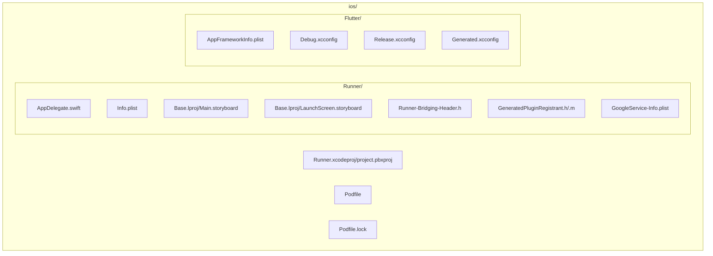
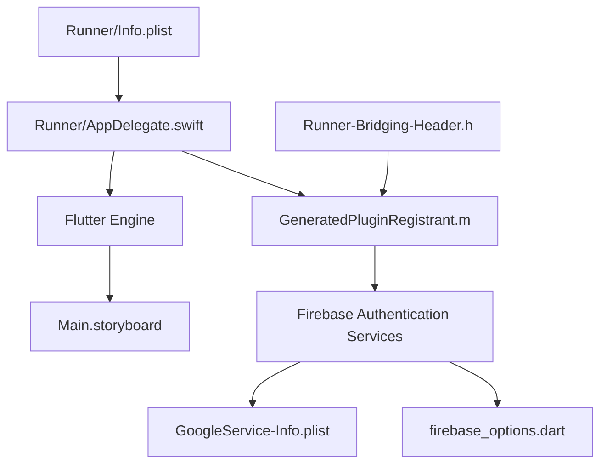
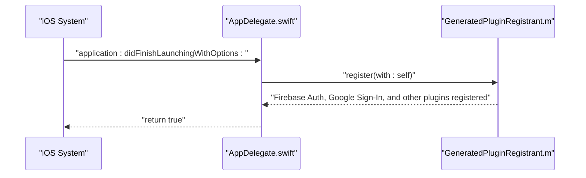
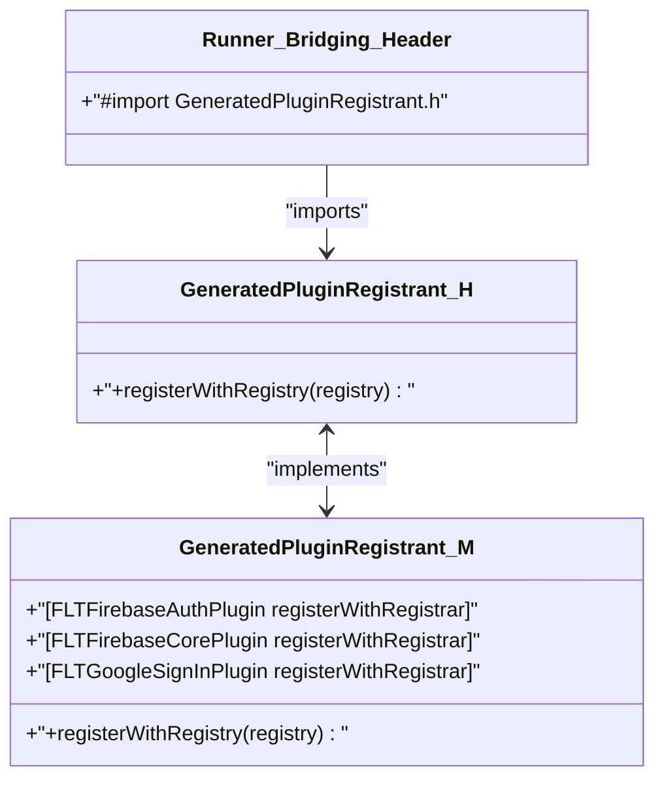
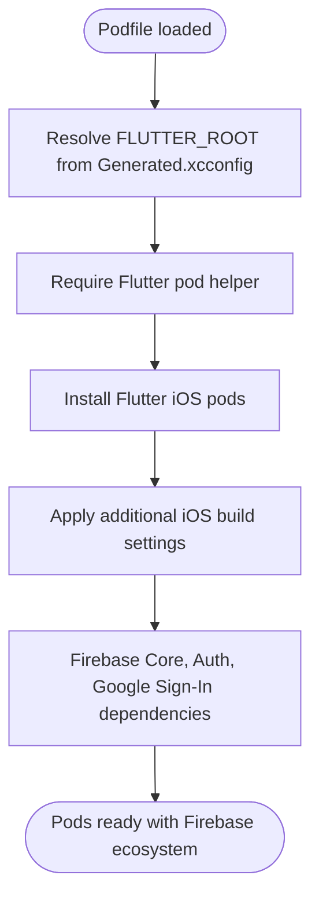
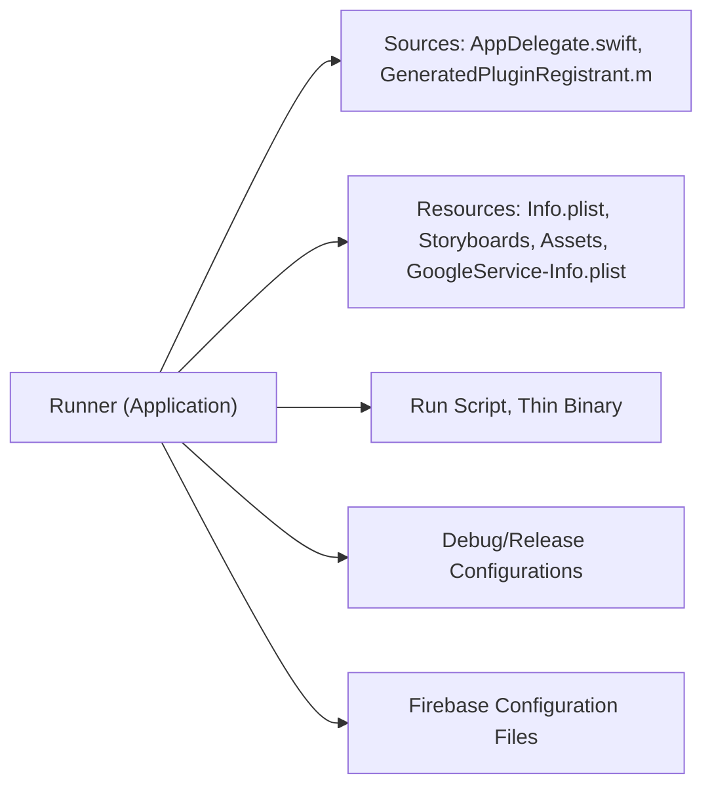
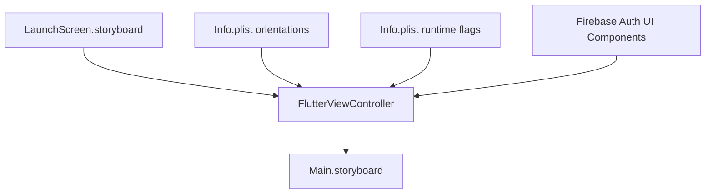
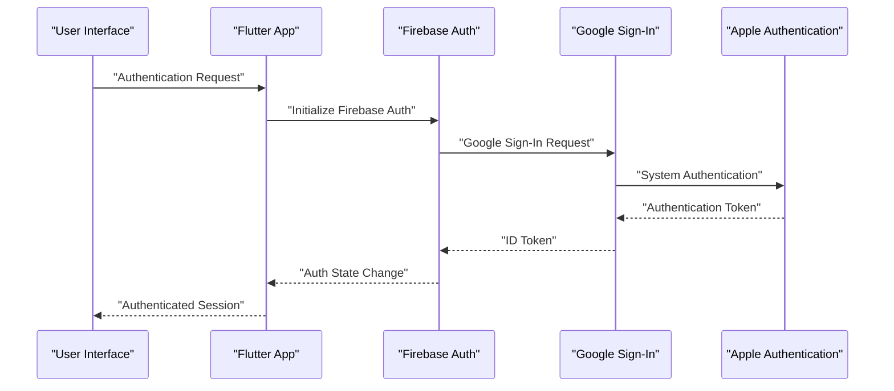
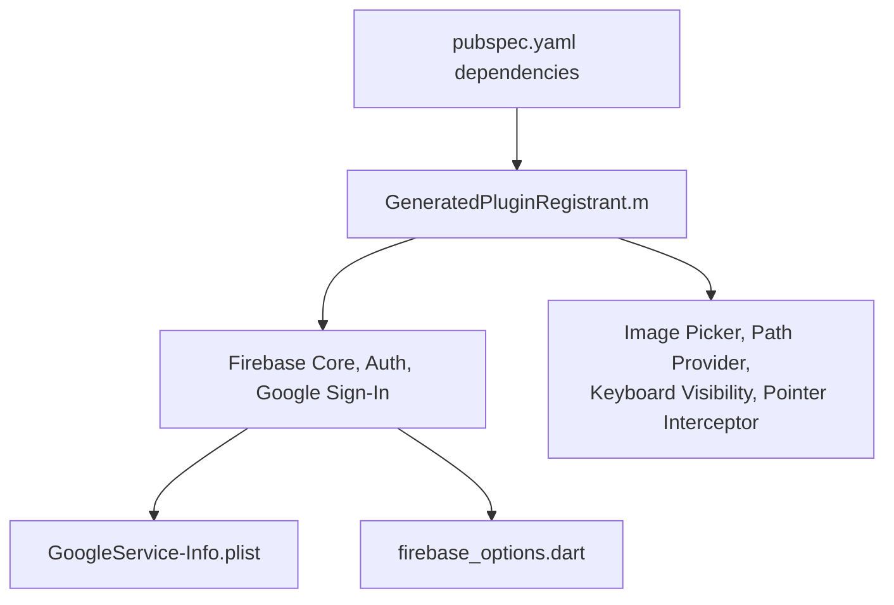
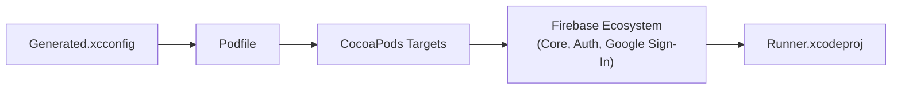

# iOS Implementation

<cite>
**Referenced Files in This Document**
- [AppDelegate.swift](file://ios/Runner/AppDelegate.swift)
- [Info.plist](file://ios/Runner/Info.plist)
- [Podfile](file://ios/Podfile)
- [Podfile.lock](file://ios/Podfile.lock)
- [project.pbxproj](file://ios/Runner.xcodeproj/project.pbxproj)
- [AppFrameworkInfo.plist](file://ios/Flutter/AppFrameworkInfo.plist)
- [Debug.xcconfig](file://ios/Flutter/Debug.xcconfig)
- [Release.xcconfig](file://ios/Flutter/Release.xcconfig)
- [Generated.xcconfig](file://ios/Flutter/Generated.xcconfig)
- [Main.storyboard](file://ios/Runner/Base.lproj/Main.storyboard)
- [LaunchScreen.storyboard](file://ios/Runner/Base.lproj/LaunchScreen.storyboard)
- [Runner-Bridging-Header.h](file://ios/Runner/Runner-Bridging-Header.h)
- [GeneratedPluginRegistrant.h](file://ios/Runner/GeneratedPluginRegistrant.h)
- [GeneratedPluginRegistrant.m](file://ios/Runner/GeneratedPluginRegistrant.m)
- [GoogleService-Info.plist](file://ios/Runner/GoogleService-Info.plist)
- [firebase_options.dart](file://lib/firebase_options.dart)
- [pubspec.yaml](file://pubspec.yaml)
</cite>

## Update Summary
**Changes Made**
- Added comprehensive Firebase authentication support documentation
- Updated CocoaPods integration section with Firebase Core, Firebase Auth, and Google Sign-In dependencies
- Added Firebase configuration files and initialization process
- Enhanced iOS-specific features section with Firebase authentication capabilities
- Updated dependency analysis to include Firebase ecosystem

## Table of Contents
1. [Introduction](#introduction)
2. [Project Structure](#project-structure)
3. [Core Components](#core-components)
4. [Architecture Overview](#architecture-overview)
5. [Detailed Component Analysis](#detailed-component-analysis)
6. [Firebase Authentication Integration](#firebase-authentication-integration)
7. [Dependency Analysis](#dependency-analysis)
8. [Performance Considerations](#performance-considerations)
9. [Troubleshooting Guide](#troubleshooting-guide)
10. [Conclusion](#conclusion)
11. [Appendices](#appendices)

## Introduction
This document provides a comprehensive iOS implementation guide for ZB-DEZINE, focusing on Xcode project setup, Swift AppDelegate configuration, Info.plist settings, CocoaPods integration, entitlements and capabilities, and App Store deployment preparation. The implementation now includes comprehensive Firebase authentication support with Firebase Core, Firebase Auth, and Google Sign-In integration. It also covers iOS project structure, build settings, provisioning profiles, code signing, the Flutter-iOS bridge, iOS-specific UI adaptations, platform integrations, and troubleshooting techniques.

## Project Structure
The iOS implementation resides under the ios/ directory and follows a standard Flutter-generated Xcode project layout:
- Runner: Application target containing AppDelegate, Info.plist, storyboards, assets, bridging header, and Firebase configuration files.
- Flutter: Flutter framework configuration and generated settings.
- Pods: CocoaPods-managed third-party dependencies including Firebase ecosystem.
- RunnerTests: Unit test target.

**Diagram sources**
- [project.pbxproj:147-166](file://ios/Runner.xcodeproj/project.pbxproj#L147-L166)
- [Podfile:1-44](file://ios/Podfile#L1-44)
- [Podfile.lock:1-180](file://ios/Podfile.lock#L1-L180)
- [AppFrameworkInfo.plist:1-27](file://ios/Flutter/AppFrameworkInfo.plist#L1-L27)

**Section sources**
- [project.pbxproj:147-166](file://ios/Runner.xcodeproj/project.pbxproj#L147-L166)
- [Podfile:1-44](file://ios/Podfile#L1-44)
- [Podfile.lock:1-180](file://ios/Podfile.lock#L1-L180)

## Core Components
This section documents the iOS-specific configuration and implementation essentials for ZB-DEZINE, including the new Firebase authentication infrastructure.

- AppDelegate.swift
  - Extends the Flutter application lifecycle to register plugins during startup.
  - Registers generated plugins with the Flutter engine, including Firebase authentication.
  - Entry point for iOS application launch sequence.

- Info.plist
  - Defines bundle identifiers, display names, supported orientations, launch storyboard, and runtime attributes.
  - Enables indirect input events and minimum frame duration adjustments for smoother animations.

- Podfile and Podfile.lock
  - Configures CocoaPods integration for iOS, including platform targeting and post-install hooks.
  - Manages Firebase ecosystem dependencies including Firebase Core, Firebase Auth, and Google Sign-In.
  - Uses Flutter's helper to install iOS pods and applies additional build settings.

- Build Settings and Configurations
  - Debug.xcconfig and Release.xcconfig include generated settings and Pods configurations.
  - Generated.xcconfig defines Flutter build metadata and simulator/simulator architectures exclusion.

- Storyboards
  - Main.storyboard hosts the FlutterViewController.
  - LaunchScreen.storyboard provides the launch screen visuals.

- Firebase Configuration
  - GoogleService-Info.plist contains Firebase project configuration for iOS.
  - firebase_options.dart provides platform-specific Firebase options with iOS client ID and bundle ID.

- Bridging Header and Plugin Registration
  - Runner-Bridging-Header.h imports GeneratedPluginRegistrant.h.
  - GeneratedPluginRegistrant.m registers platform plugins including Firebase authentication, Google Sign-In, and other services.

**Section sources**
- [AppDelegate.swift:1-14](file://ios/Runner/AppDelegate.swift#L1-L14)
- [Info.plist:1-50](file://ios/Runner/Info.plist#L1-L50)
- [Podfile:1-44](file://ios/Podfile#L1-44)
- [Podfile.lock:1-180](file://ios/Podfile.lock#L1-L180)
- [Debug.xcconfig:1-3](file://ios/Flutter/Debug.xcconfig#L1-L3)
- [Release.xcconfig:1-3](file://ios/Flutter/Release.xcconfig#L1-L3)
- [Generated.xcconfig:1-15](file://ios/Flutter/Generated.xcconfig#L1-L15)
- [Main.storyboard:1-27](file://ios/Runner/Base.lproj/Main.storyboard#L1-L27)
- [LaunchScreen.storyboard:1-38](file://ios/Runner/Base.lproj/LaunchScreen.storyboard#L1-L38)
- [Runner-Bridging-Header.h:1-2](file://ios/Runner/Runner-Bridging-Header.h#L1-L2)
- [GeneratedPluginRegistrant.h:1-20](file://ios/Runner/GeneratedPluginRegistrant.h#L1-L20)
- [GeneratedPluginRegistrant.m:1-71](file://ios/Runner/GeneratedPluginRegistrant.m#L1-L71)
- [GoogleService-Info.plist:1-34](file://ios/Runner/GoogleService-Info.plist#L1-L34)
- [firebase_options.dart:1-70](file://lib/firebase_options.dart#L1-L70)

## Architecture Overview
The iOS application integrates Flutter via a native host (Runner) and a bridging mechanism. The AppDelegate initializes the Flutter engine and registers plugins, including Firebase authentication services. The storyboard defines the initial UI, and the bridging header connects Objective-C plugin registration to Swift. Firebase configuration files provide the necessary credentials for authentication and cloud services.

**Diagram sources**
- [AppDelegate.swift:1-14](file://ios/Runner/AppDelegate.swift#L1-L14)
- [GeneratedPluginRegistrant.m:57-68](file://ios/Runner/GeneratedPluginRegistrant.m#L57-L68)
- [Runner-Bridging-Header.h:1-2](file://ios/Runner/Runner-Bridging-Header.h#L1-L2)
- [Main.storyboard:1-27](file://ios/Runner/Base.lproj/Main.storyboard#L1-L27)
- [Info.plist:1-50](file://ios/Runner/Info.plist#L1-L50)
- [GoogleService-Info.plist:1-34](file://ios/Runner/GoogleService-Info.plist#L1-L34)
- [firebase_options.dart:17-68](file://lib/firebase_options.dart#L17-L68)

## Detailed Component Analysis

### AppDelegate Implementation
The AppDelegate configures the application lifecycle and plugin registration. It overrides the launch method to register plugins with the Flutter engine before delegating to the superclass. The Firebase authentication plugins are automatically registered through the GeneratedPluginRegistrant.

**Diagram sources**
- [AppDelegate.swift:6-12](file://ios/Runner/AppDelegate.swift#L6-L12)
- [GeneratedPluginRegistrant.m:59-68](file://ios/Runner/GeneratedPluginRegistrant.m#L59-L68)

**Section sources**
- [AppDelegate.swift:1-14](file://ios/Runner/AppDelegate.swift#L1-L14)
- [GeneratedPluginRegistrant.m:57-68](file://ios/Runner/GeneratedPluginRegistrant.m#L57-L68)

### Flutter-iOS Bridge Setup
The bridge is established via the bridging header, which imports the generated plugin registrant. The registrant dynamically imports and registers platform plugins including Firebase authentication services. The Firebase plugins are automatically included in the registration process.

**Diagram sources**
- [Runner-Bridging-Header.h:1-2](file://ios/Runner/Runner-Bridging-Header.h#L1-L2)
- [GeneratedPluginRegistrant.h:14-16](file://ios/Runner/GeneratedPluginRegistrant.h#L14-L16)
- [GeneratedPluginRegistrant.m:57-68](file://ios/Runner/GeneratedPluginRegistrant.m#L57-L68)

**Section sources**
- [Runner-Bridging-Header.h:1-2](file://ios/Runner/Runner-Bridging-Header.h#L1-L2)
- [GeneratedPluginRegistrant.h:1-20](file://ios/Runner/GeneratedPluginRegistrant.h#L1-L20)
- [GeneratedPluginRegistrant.m:1-71](file://ios/Runner/GeneratedPluginRegistrant.m#L1-L71)

### CocoaPods Integration (Podfile and Podfile.lock)
The Podfile configures platform targeting, project configuration, and Flutter pod installation. The Podfile.lock contains comprehensive Firebase ecosystem dependencies including Firebase Core, Firebase Auth, Google Sign-In, and their interdependencies. It includes a post-install hook to apply additional iOS build settings.

**Diagram sources**
- [Podfile:13-26](file://ios/Podfile#L13-L26)
- [Podfile:30-37](file://ios/Podfile#L30-L37)
- [Podfile:39-43](file://ios/Podfile#L39-L43)
- [Podfile.lock:12-51](file://ios/Podfile.lock#L12-L51)

**Section sources**
- [Podfile:1-44](file://ios/Podfile#L1-44)
- [Podfile.lock:1-180](file://ios/Podfile.lock#L1-L180)

### iOS Project Structure and Build Settings
The Xcode project file defines targets, build phases, and build configurations. Key aspects:
- Runner target includes AppDelegate, storyboards, assets, plugin registration, and Firebase configuration files.
- Build configurations set deployment target, Swift version, bridging header, and bundle identifiers.
- Run scripts integrate Flutter build and embed/thin steps.
- Firebase configuration files are properly integrated into the project structure.

**Diagram sources**
- [project.pbxproj:147-166](file://ios/Runner.xcodeproj/project.pbxproj#L147-L166)
- [project.pbxproj:245-259](file://ios/Runner.xcodeproj/project.pbxproj#L245-L259)
- [project.pbxproj:310-382](file://ios/Runner.xcodeproj/project.pbxproj#L310-L382)
- [project.pbxproj:430-540](file://ios/Runner.xcodeproj/project.pbxproj#L430-L540)

**Section sources**
- [project.pbxproj:147-166](file://ios/Runner.xcodeproj/project.pbxproj#L147-L166)
- [project.pbxproj:245-259](file://ios/Runner.xcodeproj/project.pbxproj#L245-L259)
- [project.pbxproj:310-382](file://ios/Runner.xcodeproj/project.pbxproj#L310-L382)
- [project.pbxproj:430-540](file://ios/Runner.xcodeproj/project.pbxproj#L430-L540)

### iOS-Specific UI Adaptations
- Storyboards define the initial view controller and launch screen.
- Info.plist supports multiple interface orientations for iPhone and iPad.
- Indirect input events and minimum frame duration toggles improve responsiveness.
- Firebase authentication UI components integrate seamlessly with existing Flutter UI.

**Diagram sources**
- [LaunchScreen.storyboard:1-38](file://ios/Runner/Base.lproj/LaunchScreen.storyboard#L1-L38)
- [Main.storyboard:1-27](file://ios/Runner/Base.lproj/Main.storyboard#L1-L27)
- [Info.plist:31-47](file://ios/Runner/Info.plist#L31-L47)

**Section sources**
- [LaunchScreen.storyboard:1-38](file://ios/Runner/Base.lproj/LaunchScreen.storyboard#L1-L38)
- [Main.storyboard:1-27](file://ios/Runner/Base.lproj/Main.storyboard#L1-L27)
- [Info.plist:31-47](file://ios/Runner/Info.plist#L31-L47)

## Firebase Authentication Integration

### Firebase Configuration Setup
The iOS implementation includes comprehensive Firebase authentication support through multiple configuration files and dependencies:

- **GoogleService-Info.plist**: Contains Firebase project configuration including client IDs, API keys, and bundle identifiers for iOS authentication.
- **firebase_options.dart**: Provides platform-specific Firebase options with iOS client ID and bundle ID for programmatic initialization.
- **Podfile.lock Dependencies**: Includes Firebase Core (11.15.0), Firebase Auth (11.15.0), Google Sign-In (8.0.0), and their interdependent libraries.

### Authentication Flow Architecture
The Firebase authentication system integrates seamlessly with the Flutter application through the following architecture:

**Diagram sources**
- [GoogleService-Info.plist:5-32](file://ios/Runner/GoogleService-Info.plist#L5-L32)
- [firebase_options.dart:60-68](file://lib/firebase_options.dart#L60-L68)
- [Podfile.lock:12-51](file://ios/Podfile.lock#L12-L51)

### Plugin Registration for Firebase Services
The GeneratedPluginRegistrant automatically handles Firebase service registration through conditional imports and dynamic linking:

- **Firebase Core**: Provides foundational Firebase services and initialization.
- **Firebase Authentication**: Handles user authentication, sign-in methods, and auth state management.
- **Google Sign-In**: Integrates Google authentication flows with iOS system authentication.

**Section sources**
- [GoogleService-Info.plist:1-34](file://ios/Runner/GoogleService-Info.plist#L1-L34)
- [firebase_options.dart:1-70](file://lib/firebase_options.dart#L1-L70)
- [Podfile.lock:12-51](file://ios/Podfile.lock#L12-L51)
- [GeneratedPluginRegistrant.m:9-19](file://ios/Runner/GeneratedPluginRegistrant.m#L9-L19)
- [GeneratedPluginRegistrant.m:27-31](file://ios/Runner/GeneratedPluginRegistrant.m#L27-L31)

### iOS-Specific Features and Platform Integrations
- **Firebase Authentication**: Comprehensive authentication support with email/password, Google Sign-In, and other providers.
- **Google Sign-In**: Native iOS integration with system authentication flows and credential management.
- **Image Picker and Path Provider**: Registered through the generated plugin registry for media handling.
- **Keyboard Visibility and Pointer Interceptor**: Integrated via the plugin registrar for enhanced UI interactions.

**Diagram sources**
- [pubspec.yaml:61-66](file://pubspec.yaml#L61-L66)
- [GeneratedPluginRegistrant.m:9-55](file://ios/Runner/GeneratedPluginRegistrant.m#L9-L55)
- [GoogleService-Info.plist:1-34](file://ios/Runner/GoogleService-Info.plist#L1-L34)
- [firebase_options.dart:1-70](file://lib/firebase_options.dart#L1-L70)

**Section sources**
- [pubspec.yaml:61-66](file://pubspec.yaml#L61-L66)
- [GeneratedPluginRegistrant.m:57-68](file://ios/Runner/GeneratedPluginRegistrant.m#L57-L68)

## Dependency Analysis
The iOS build depends on Flutter's generated settings and CocoaPods-managed plugins, including the comprehensive Firebase ecosystem. The Podfile coordinates with Flutter's helper to install iOS pods and applies additional build settings post-install. The Podfile.lock now includes Firebase Core, Firebase Auth, Google Sign-In, and their extensive dependency tree.

**Diagram sources**
- [Generated.xcconfig:1-15](file://ios/Flutter/Generated.xcconfig#L1-L15)
- [Podfile:13-26](file://ios/Podfile#L13-L26)
- [Podfile:30-37](file://ios/Podfile#L30-L37)
- [Podfile.lock:12-51](file://ios/Podfile.lock#L12-L51)
- [project.pbxproj:169-203](file://ios/Runner.xcodeproj/project.pbxproj#L169-L203)

**Section sources**
- [Generated.xcconfig:1-15](file://ios/Flutter/Generated.xcconfig#L1-L15)
- [Podfile:13-26](file://ios/Podfile#L13-L26)
- [Podfile:30-37](file://ios/Podfile#L30-L37)
- [Podfile.lock:1-180](file://ios/Podfile.lock#L1-L180)
- [project.pbxproj:169-203](file://ios/Runner.xcodeproj/project.pbxproj#L169-L203)

## Performance Considerations
- Deployment target and device family are configured in build settings to support iPhone and iPad.
- Swift compilation mode and optimization levels differ between Debug and Release configurations.
- Bitcode is disabled, and runpath search paths are set for embedded frameworks.
- Simulator architectures are excluded to reduce build size and improve performance.
- Firebase authentication services are optimized for minimal memory footprint and efficient network usage.
- Google Sign-In integration leverages system authentication for improved performance and security.

## Troubleshooting Guide
Common iOS-related issues and resolutions:
- Missing Generated.xcconfig or FLUTTER_ROOT: Ensure flutter pub get is executed to regenerate Flutter build settings.
- CocoaPods installation failures: Verify platform targeting and post-install hooks in the Podfile. Check Podfile.lock for Firebase dependency conflicts.
- Plugin registration errors: Confirm GeneratedPluginRegistrant imports and registrations match pubspec dependencies, especially Firebase authentication plugins.
- Firebase initialization failures: Verify GoogleService-Info.plist contains correct iOS configuration and firebase_options.dart has proper iOS client ID.
- Build script failures: Validate Run Script and Thin Binary phases in the Xcode project.
- Code signing and provisioning: Configure automatic signing or manual profiles/certificates in Xcode project settings.
- Firebase authentication issues: Ensure GoogleService-Info.plist and firebase_options.dart are properly configured and included in the Xcode project.

**Section sources**
- [Podfile:13-26](file://ios/Podfile#L13-L26)
- [Podfile:39-43](file://ios/Podfile#L39-L43)
- [GeneratedPluginRegistrant.h:1-20](file://ios/Runner/GeneratedPluginRegistrant.h#L1-L20)
- [GeneratedPluginRegistrant.m:57-68](file://ios/Runner/GeneratedPluginRegistrant.m#L57-L68)
- [GoogleService-Info.plist:1-34](file://ios/Runner/GoogleService-Info.plist#L1-L34)
- [firebase_options.dart:1-70](file://lib/firebase_options.dart#L1-L70)
- [project.pbxproj:245-259](file://ios/Runner.xcodeproj/project.pbxproj#L245-L259)
- [project.pbxproj:310-382](file://ios/Runner.xcodeproj/project.pbxproj#L310-L382)

## Conclusion
ZB-DEZINE's iOS implementation leverages Flutter's native host architecture with a minimal AppDelegate, robust plugin registration via GeneratedPluginRegistrant, and comprehensive CocoaPods-managed dependencies including the Firebase authentication ecosystem. The project's Info.plist, storyboards, and build settings align with modern iOS development practices, enabling seamless integration of Firebase authentication services, Google Sign-In, and preparation for App Store deployment. The addition of Firebase authentication support provides enterprise-grade user authentication capabilities with minimal code changes.

## Appendices

### iOS-Specific Configuration Checklist
- Info.plist keys: Bundle identifiers, display names, supported orientations, launch storyboard, and runtime flags.
- Podfile: Platform targeting, Flutter pod helper inclusion, and post-install build settings.
- Build settings: Deployment target, Swift version, bridging header, bundle identifiers, and runpath search paths.
- Firebase Configuration: GoogleService-Info.plist and firebase_options.dart with iOS-specific settings.
- Entitlements and Capabilities: Add required entitlements and capabilities in Xcode (e.g., push notifications, iCloud).
- Provisioning Profiles and Code Signing: Configure signing certificates and provisioning profiles for Debug/Release.
- App Store Deployment: Archive, validate, and upload via Xcode Organizer; ensure compliance with App Store review guidelines.

### Firebase Authentication Setup Checklist
- Verify GoogleService-Info.plist contains correct iOS client ID and bundle identifier.
- Ensure firebase_options.dart includes iOS-specific client ID and bundle ID.
- Confirm Podfile.lock includes Firebase Core, Firebase Auth, and Google Sign-In dependencies.
- Test Firebase authentication flows in development environment.
- Configure Firebase project settings for iOS app integration.
- Implement proper error handling for authentication failures.
- Set up Firebase Analytics and Crashlytics for monitoring authentication events.