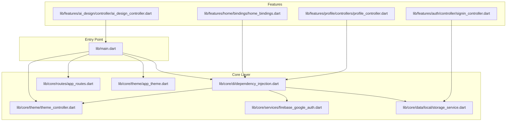
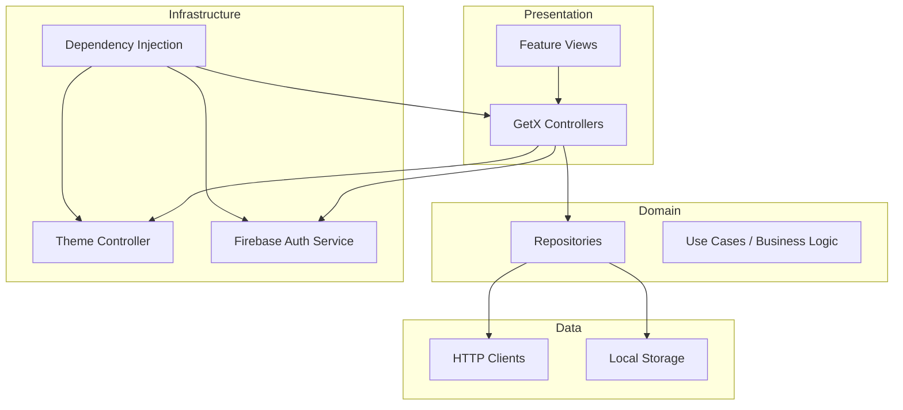
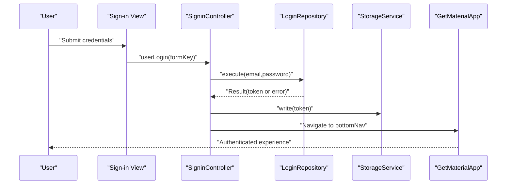
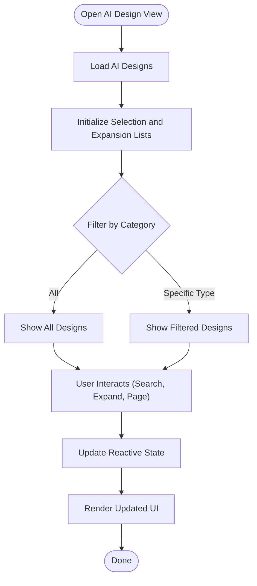
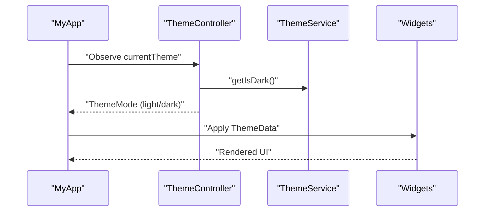
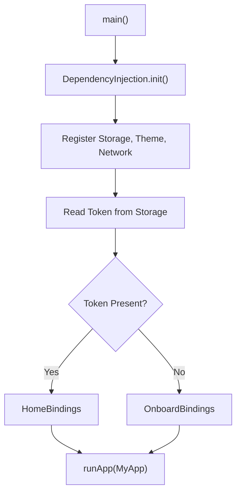

# Project Overview

<cite>
**Referenced Files in This Document**
- [pubspec.yaml](file://pubspec.yaml)
- [README.md](file://README.md)
- [lib/main.dart](file://lib/main.dart)
- [lib/core/di/dependency_injection.dart](file://lib/core/di/dependency_injection.dart)
- [lib/core/routes/app_routes.dart](file://lib/core/routes/app_routes.dart)
- [lib/core/theme/app_theme.dart](file://lib/core/theme/app_theme.dart)
- [lib/core/theme/theme_controller.dart](file://lib/core/theme/theme_controller.dart)
- [lib/core/services/firebase_google_auth.dart](file://lib/core/services/firebase_google_auth.dart)
- [lib/core/data/local/storage_service.dart](file://lib/core/data/local/storage_service.dart)
- [lib/features/auth/controller/signin_controller.dart](file://lib/features/auth/controller/signin_controller.dart)
- [lib/features/ai_design/controller/ai_design_controller.dart](file://lib/features/ai_design/controller/ai_design_controller.dart)
- [lib/features/home/bindings/home_bindings.dart](file://lib/features/home/bindings/home_bindings.dart)
- [lib/features/profile/controllers/profile_controller.dart](file://lib/features/profile/controllers/profile_controller.dart)
</cite>

## Table of Contents
1. [Introduction](#introduction)
2. [Project Structure](#project-structure)
3. [Core Components](#core-components)
4. [Architecture Overview](#architecture-overview)
5. [Detailed Component Analysis](#detailed-component-analysis)
6. [Dependency Analysis](#dependency-analysis)
7. [Performance Considerations](#performance-considerations)
8. [Troubleshooting Guide](#troubleshooting-guide)
9. [Conclusion](#conclusion)

## Introduction
ZB-DEZINE is a multi-functional Flutter-based mobile application designed to bring together creative design services, e-commerce capabilities, and robust user management under a unified platform. It integrates AI-powered design features alongside traditional commerce workflows, enabling users to discover, customize, and purchase design-related products and services. The application targets both end-users seeking design solutions and service providers offering design and rental services, with a focus on modern UI/UX, scalability, and cross-platform deployment.

Key goals:
- Provide a seamless onboarding and authentication experience.
- Enable AI-driven design generation and management.
- Support e-commerce workflows including browsing, purchasing, payments, and order tracking.
- Deliver a responsive, adaptive interface with light/dark themes.
- Offer scalable user management and profile administration.

## Project Structure
The project follows a modular, layered architecture with feature-based organization:
- Root entrypoint initializes dependency injection, routing, theming, and screen responsiveness.
- Core module encapsulates DI, routing constants, theming, services, data utilities, and shared helpers.
- Features module organizes distinct functional areas such as authentication, AI design, home/dashboard, profile, orders, payments, rentals, and more.
- Shared module provides reusable UI widgets, validators, formatters, and common components.

**Diagram sources**
- [lib/main.dart:12-46](file://lib/main.dart#L12-L46)
- [lib/core/di/dependency_injection.dart:11-26](file://lib/core/di/dependency_injection.dart#L11-L26)
- [lib/core/routes/app_routes.dart:1-34](file://lib/core/routes/app_routes.dart#L1-L34)
- [lib/core/theme/app_theme.dart:4-22](file://lib/core/theme/app_theme.dart#L4-L22)
- [lib/core/theme/theme_controller.dart:5-22](file://lib/core/theme/theme_controller.dart#L5-L22)
- [lib/core/services/firebase_google_auth.dart:6-69](file://lib/core/services/firebase_google_auth.dart#L6-L69)
- [lib/core/data/local/storage_service.dart:3-22](file://lib/core/data/local/storage_service.dart#L3-L22)
- [lib/features/auth/controller/signin_controller.dart:9-51](file://lib/features/auth/controller/signin_controller.dart#L9-L51)
- [lib/features/ai_design/controller/ai_design_controller.dart:5-70](file://lib/features/ai_design/controller/ai_design_controller.dart#L5-L70)
- [lib/features/home/bindings/home_bindings.dart:13-34](file://lib/features/home/bindings/home_bindings.dart#L13-L34)
- [lib/features/profile/controllers/profile_controller.dart:6-31](file://lib/features/profile/controllers/profile_controller.dart#L6-L31)

**Section sources**
- [lib/main.dart:12-46](file://lib/main.dart#L12-L46)
- [lib/core/di/dependency_injection.dart:11-26](file://lib/core/di/dependency_injection.dart#L11-L26)
- [lib/core/routes/app_routes.dart:1-34](file://lib/core/routes/app_routes.dart#L1-L34)
- [lib/core/theme/app_theme.dart:4-22](file://lib/core/theme/app_theme.dart#L4-L22)
- [lib/core/theme/theme_controller.dart:5-22](file://lib/core/theme/theme_controller.dart#L5-L22)
- [lib/core/services/firebase_google_auth.dart:6-69](file://lib/core/services/firebase_google_auth.dart#L6-L69)
- [lib/core/data/local/storage_service.dart:3-22](file://lib/core/data/local/storage_service.dart#L3-L22)
- [lib/features/auth/controller/signin_controller.dart:9-51](file://lib/features/auth/controller/signin_controller.dart#L9-L51)
- [lib/features/ai_design/controller/ai_design_controller.dart:5-70](file://lib/features/ai_design/controller/ai_design_controller.dart#L5-L70)
- [lib/features/home/bindings/home_bindings.dart:13-34](file://lib/features/home/bindings/home_bindings.dart#L13-L34)
- [lib/features/profile/controllers/profile_controller.dart:6-31](file://lib/features/profile/controllers/profile_controller.dart#L6-L31)

## Core Components
- Authentication and user management:
  - Firebase Google authentication service supports sign-in and sign-out flows.
  - Local storage service persists tokens and preferences.
  - Sign-in controller orchestrates form validation, repository execution, and navigation after successful login.
- AI design services:
  - AI design controller manages categories, filtering, pagination, and expandable rows for design items.
- Theming and responsiveness:
  - App theme defines Material 3-based light and dark themes.
  - Theme controller toggles and persists theme preference.
  - ScreenUtil initialization ensures consistent UI scaling across devices.
- Routing:
  - Centralized route constants define named routes for onboarding, authentication, AI design, e-commerce, and profile screens.
- Dependency injection:
  - Dependency injection bootstraps storage, theme services, network utilities, and exposes token state to initialize app behavior.

**Section sources**
- [lib/core/services/firebase_google_auth.dart:6-69](file://lib/core/services/firebase_google_auth.dart#L6-L69)
- [lib/core/data/local/storage_service.dart:3-22](file://lib/core/data/local/storage_service.dart#L3-L22)
- [lib/features/auth/controller/signin_controller.dart:9-51](file://lib/features/auth/controller/signin_controller.dart#L9-L51)
- [lib/features/ai_design/controller/ai_design_controller.dart:5-70](file://lib/features/ai_design/controller/ai_design_controller.dart#L5-L70)
- [lib/core/theme/app_theme.dart:4-22](file://lib/core/theme/app_theme.dart#L4-L22)
- [lib/core/theme/theme_controller.dart:5-22](file://lib/core/theme/theme_controller.dart#L5-L22)
- [lib/main.dart:26-44](file://lib/main.dart#L26-L44)
- [lib/core/routes/app_routes.dart:1-34](file://lib/core/routes/app_routes.dart#L1-L34)
- [lib/core/di/dependency_injection.dart:11-26](file://lib/core/di/dependency_injection.dart#L11-L26)

## Architecture Overview
ZB-DEZINE adopts a layered MVVM-style architecture with GetX for state management and navigation:
- Presentation layer: Views and controllers manage UI state and user interactions.
- Domain layer: Controllers coordinate business logic and orchestrate repositories.
- Data layer: Repositories encapsulate network and persistence concerns.
- Infrastructure layer: Dependency injection wires services, storage, and theme management.

[No sources needed since this diagram shows conceptual architecture, not a direct code mapping]

## Detailed Component Analysis

### Authentication and User Management
The authentication flow integrates Firebase Google sign-in and local token storage. After successful sign-in, the token is persisted and used to decide initial route and bindings.

**Diagram sources**
- [lib/features/auth/controller/signin_controller.dart:17-36](file://lib/features/auth/controller/signin_controller.dart#L17-L36)
- [lib/core/data/local/storage_service.dart:11-13](file://lib/core/data/local/storage_service.dart#L11-L13)
- [lib/main.dart:36-40](file://lib/main.dart#L36-L40)

**Section sources**
- [lib/core/services/firebase_google_auth.dart:15-58](file://lib/core/services/firebase_google_auth.dart#L15-L58)
- [lib/core/data/local/storage_service.dart:3-22](file://lib/core/data/local/storage_service.dart#L3-L22)
- [lib/features/auth/controller/signin_controller.dart:9-51](file://lib/features/auth/controller/signin_controller.dart#L9-L51)
- [lib/main.dart:12-19](file://lib/main.dart#L12-L19)

### AI Design Services
The AI design feature provides categorized filtering, search, pagination, and expandable item lists. The controller maintains reactive state for selection, expansion, and page navigation.

**Diagram sources**
- [lib/features/ai_design/controller/ai_design_controller.dart:5-70](file://lib/features/ai_design/controller/ai_design_controller.dart#L5-L70)

**Section sources**
- [lib/features/ai_design/controller/ai_design_controller.dart:5-70](file://lib/features/ai_design/controller/ai_design_controller.dart#L5-L70)

### Theming and Responsive Design
The app initializes ScreenUtil for responsive layouts and uses a ThemeController to toggle between light and dark modes, persisting the preference via ThemeService.

**Diagram sources**
- [lib/main.dart:26-44](file://lib/main.dart#L26-L44)
- [lib/core/theme/theme_controller.dart:5-22](file://lib/core/theme/theme_controller.dart#L5-L22)
- [lib/core/theme/app_theme.dart:4-22](file://lib/core/theme/app_theme.dart#L4-L22)

**Section sources**
- [lib/main.dart:26-44](file://lib/main.dart#L26-L44)
- [lib/core/theme/theme_controller.dart:5-22](file://lib/core/theme/theme_controller.dart#L5-L22)
- [lib/core/theme/app_theme.dart:4-22](file://lib/core/theme/app_theme.dart#L4-L22)

### Dependency Injection and Initialization
The application initializes GetX storage, registers services, and reads the stored token to determine the initial binding and route.

**Diagram sources**
- [lib/main.dart:12-19](file://lib/main.dart#L12-L19)
- [lib/core/di/dependency_injection.dart:12-25](file://lib/core/di/dependency_injection.dart#L12-L25)

**Section sources**
- [lib/main.dart:12-19](file://lib/main.dart#L12-L19)
- [lib/core/di/dependency_injection.dart:11-26](file://lib/core/di/dependency_injection.dart#L11-L26)

## Dependency Analysis
The project leverages a curated set of Flutter and Dart packages to implement UI, state management, networking, and cloud services. The dependency graph highlights core libraries and their roles.

```mermaid
graph TB
FlutterSDK["Flutter SDK"]
GetX["GetX"]
ScreenUtil["flutter_screenutil"]
Firebase["Firebase Core/Auth"]
GetStorage["get_storage"]
GoogleFonts["google_fonts"]
Glassmorphism["glassmorphism"]
SpinKit["flutter_spinkit"]
Badges["badges"]
TypeAhead["flutter_typeahead"]
Http["http"]
Fpdart["fpdart"]
OtpField["flutter_otp_text_field"]
PhoneField["intl_phone_field"]
Chart["fl_chart"]
ImagePicker["image_picker"]
CachedImage["cached_network_image"]
Carousel["carousel_slider"]
FlutterSDK --> GetX
FlutterSDK --> ScreenUtil
FlutterSDK --> Firebase
FlutterSDK --> GetStorage
FlutterSDK --> GoogleFonts
FlutterSDK --> Glassmorphism
FlutterSDK --> SpinKit
FlutterSDK --> Badges
FlutterSDK --> TypeAhead
FlutterSDK --> Http
FlutterSDK --> Fpdart
FlutterSDK --> OtpField
FlutterSDK --> PhoneField
FlutterSDK --> Chart
FlutterSDK --> ImagePicker
FlutterSDK --> CachedImage
FlutterSDK --> Carousel
```

**Diagram sources**
- [pubspec.yaml:30-66](file://pubspec.yaml#L30-L66)

**Section sources**
- [pubspec.yaml:30-66](file://pubspec.yaml#L30-L66)

## Performance Considerations
- Reactive state with GetX reduces boilerplate and improves UI responsiveness.
- ScreenUtil ensures consistent layout scaling across device sizes.
- Lazy loading of controllers via Get.lazyPut minimizes startup overhead.
- Network utilities are injected for testability and reduced coupling.
- Consider caching frequently accessed data and deferring heavy computations off the UI thread.

[No sources needed since this section provides general guidance]

## Troubleshooting Guide
Common issues and resolutions:
- Authentication failures:
  - Verify Firebase configuration and Google Sign-In setup.
  - Check error logs from Firebase authentication exceptions.
- Navigation and bindings:
  - Ensure route constants match named routes and initial bindings align with token presence.
- Theme switching:
  - Confirm ThemeController updates and ThemeService persistence are functioning.
- Storage operations:
  - Validate keys and types used with StorageService.

**Section sources**
- [lib/core/services/firebase_google_auth.dart:51-57](file://lib/core/services/firebase_google_auth.dart#L51-L57)
- [lib/core/routes/app_routes.dart:1-34](file://lib/core/routes/app_routes.dart#L1-L34)
- [lib/core/theme/theme_controller.dart:15-18](file://lib/core/theme/theme_controller.dart#L15-L18)
- [lib/core/data/local/storage_service.dart:7-21](file://lib/core/data/local/storage_service.dart#L7-L21)

## Conclusion
ZB-DEZINE demonstrates a well-structured Flutter application that combines modern UI/UX, AI-driven design capabilities, and e-commerce workflows. Its MVVM architecture with GetX promotes clean separation of concerns, while Firebase and local storage enable secure user management. The responsive design and theme system ensure a consistent experience across devices. This foundation provides a solid platform for further feature development and scalability.