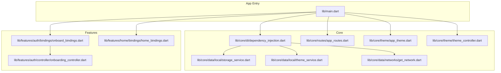
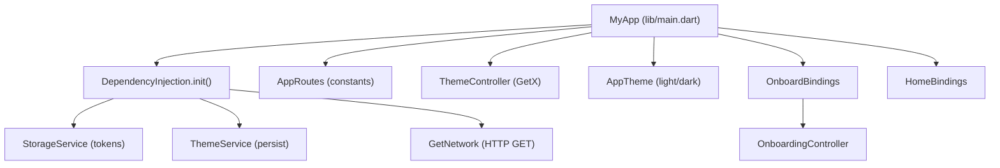
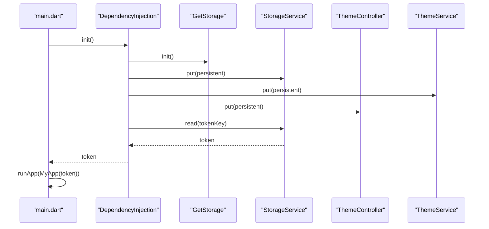
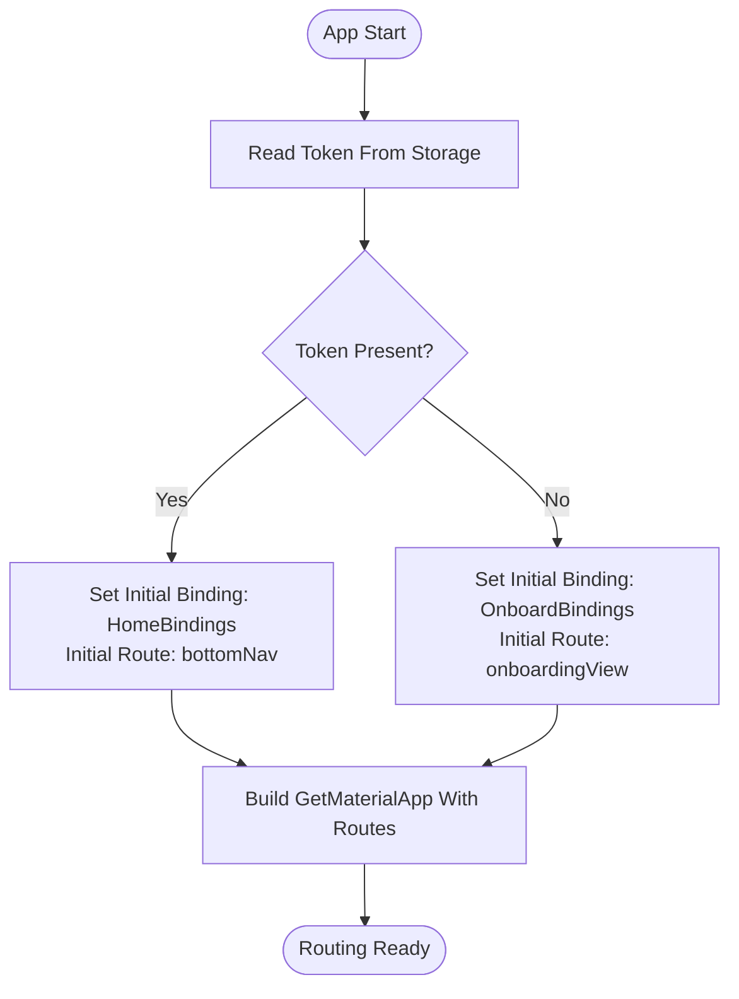
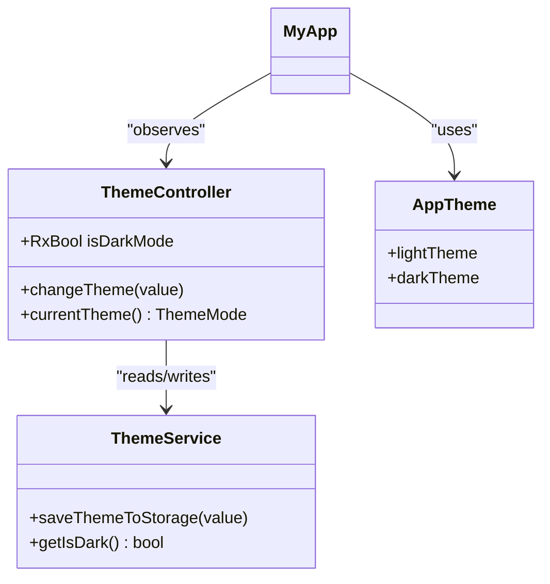
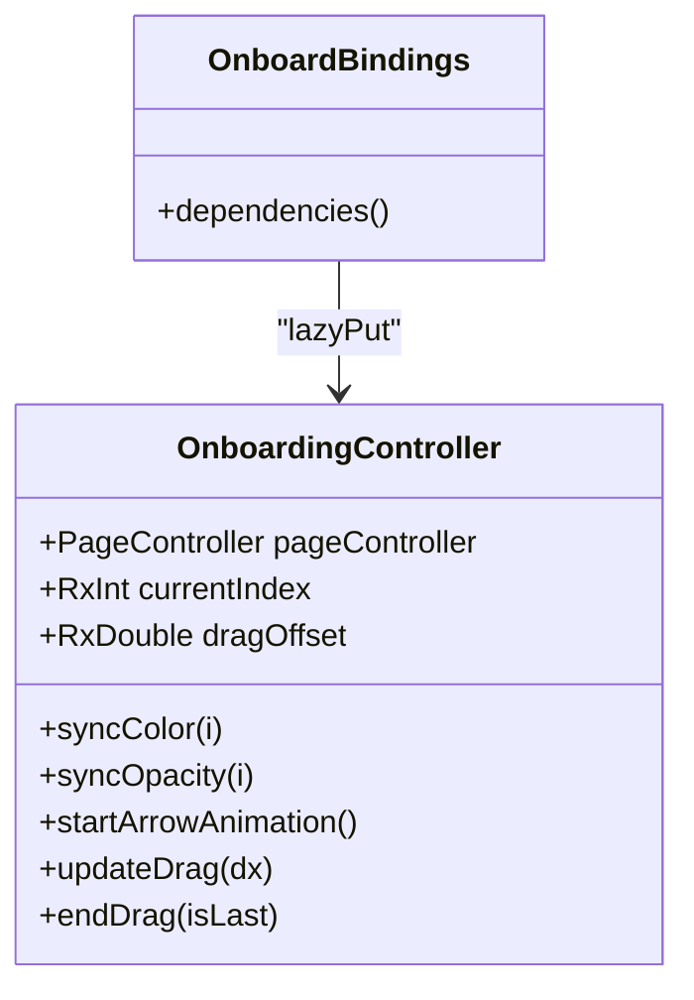
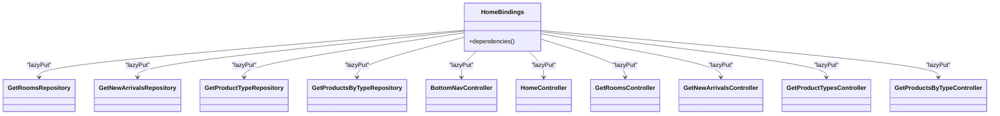
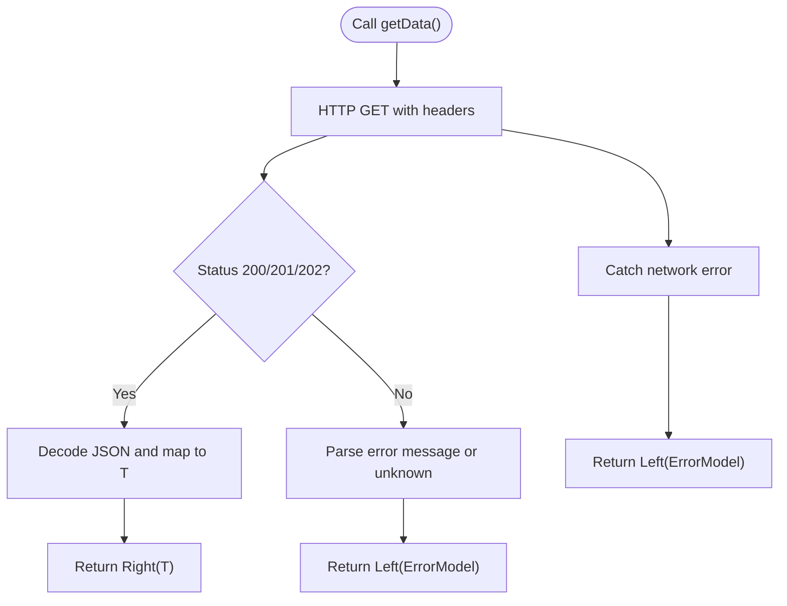
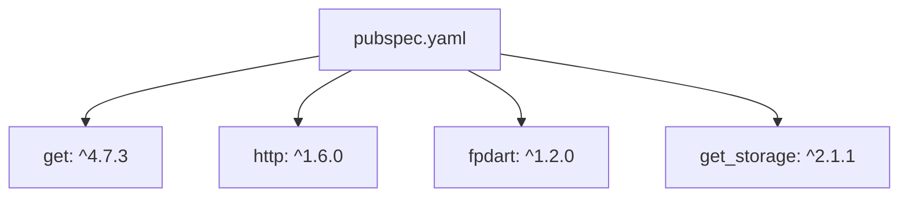

# Architecture Overview

<cite>
**Referenced Files in This Document**
- [lib/main.dart](file://lib/main.dart)
- [pubspec.yaml](file://pubspec.yaml)
- [lib/core/di/dependency_injection.dart](file://lib/core/di/dependency_injection.dart)
- [lib/core/routes/app_routes.dart](file://lib/core/routes/app_routes.dart)
- [lib/core/routes/routes.dart](file://lib/core/routes/routes.dart)
- [lib/core/theme/app_theme.dart](file://lib/core/theme/app_theme.dart)
- [lib/core/theme/theme_controller.dart](file://lib/core/theme/theme_controller.dart)
- [lib/core/data/local/storage_service.dart](file://lib/core/data/local/storage_service.dart)
- [lib/core/data/local/theme_service.dart](file://lib/core/data/local/theme_service.dart)
- [lib/core/data/networks/get_network.dart](file://lib/core/data/networks/get_network.dart)
- [lib/features/auth/bindings/onboard_bindings.dart](file://lib/features/auth/bindings/onboard_bindings.dart)
- [lib/features/auth/controller/onboarding_controller.dart](file://lib/features/auth/controller/onboarding_controller.dart)
- [lib/features/home/bindings/home_bindings.dart](file://lib/features/home/bindings/home_bindings.dart)
</cite>

## Table of Contents
1. [Introduction](#introduction)
2. [Project Structure](#project-structure)
3. [Core Components](#core-components)
4. [Architecture Overview](#architecture-overview)
5. [Detailed Component Analysis](#detailed-component-analysis)
6. [Dependency Analysis](#dependency-analysis)
7. [Performance Considerations](#performance-considerations)
8. [Troubleshooting Guide](#troubleshooting-guide)
9. [Conclusion](#conclusion)
10. [Appendices](#appendices)

## Introduction
This document describes the architectural design of ZB-DEZINE’s modular MVVM application built with Flutter and GetX. The system follows a layered, feature-driven structure with clear separation of concerns across core infrastructure, feature modules, and shared components. It leverages GetX for dependency injection, routing, state management, and reactive UI updates. The architecture emphasizes modularity, scalability, and maintainability by isolating features behind dedicated controllers, bindings, repositories, and models, while centralizing cross-cutting concerns such as DI, routing, theming, and networking.

## Project Structure
The project is organized into three primary areas:
- Core: Shared infrastructure for dependency injection, routing, theming, networking, and utilities.
- Features: Feature modules (e.g., auth, home, ai_design, profile, orders) each containing bindings, controllers, models, repositories, views, and widgets.
- Shared: Reusable UI widgets, extensions, and formatters used across features.

**Diagram sources**
- [lib/main.dart:12-46](file://lib/main.dart#L12-L46)
- [lib/core/di/dependency_injection.dart:12-25](file://lib/core/di/dependency_injection.dart#L12-L25)
- [lib/core/routes/app_routes.dart:1-34](file://lib/core/routes/app_routes.dart#L1-L34)
- [lib/core/theme/app_theme.dart:4-22](file://lib/core/theme/app_theme.dart#L4-L22)
- [lib/core/theme/theme_controller.dart:5-22](file://lib/core/theme/theme_controller.dart#L5-L22)
- [lib/core/data/local/storage_service.dart:3-22](file://lib/core/data/local/storage_service.dart#L3-L22)
- [lib/core/data/local/theme_service.dart:3-15](file://lib/core/data/local/theme_service.dart#L3-L15)
- [lib/core/data/networks/get_network.dart:8-40](file://lib/core/data/networks/get_network.dart#L8-L40)
- [lib/features/auth/bindings/onboard_bindings.dart:4-9](file://lib/features/auth/bindings/onboard_bindings.dart#L4-L9)
- [lib/features/home/bindings/home_bindings.dart:13-34](file://lib/features/home/bindings/home_bindings.dart#L13-L34)
- [lib/features/auth/controller/onboarding_controller.dart:7-124](file://lib/features/auth/controller/onboarding_controller.dart#L7-L124)

**Section sources**
- [lib/main.dart:12-46](file://lib/main.dart#L12-L46)
- [pubspec.yaml:30-60](file://pubspec.yaml#L30-L60)

## Core Components
- Dependency Injection (GetX): Centralized initialization of services and controllers via a single DI entry point. Services include storage, theme service, network clients, and controllers are lazy-loaded per feature binding.
- Routing: Named route constants define navigation targets; initial route selection depends on authentication state resolved during DI.
- Theming: Static theme definitions and a reactive ThemeController manage theme mode and persist preferences.
- Networking: A typed network client encapsulates HTTP GET requests and returns Either-based results for robust error handling.
- Local Storage: Typed storage wrapper for tokens and theme preferences.

**Section sources**
- [lib/core/di/dependency_injection.dart:12-25](file://lib/core/di/dependency_injection.dart#L12-L25)
- [lib/core/routes/app_routes.dart:1-34](file://lib/core/routes/app_routes.dart#L1-L34)
- [lib/core/theme/app_theme.dart:4-22](file://lib/core/theme/app_theme.dart#L4-L22)
- [lib/core/theme/theme_controller.dart:5-22](file://lib/core/theme/theme_controller.dart#L5-L22)
- [lib/core/data/networks/get_network.dart:8-40](file://lib/core/data/networks/get_network.dart#L8-L40)
- [lib/core/data/local/storage_service.dart:3-22](file://lib/core/data/local/storage_service.dart#L3-L22)
- [lib/core/data/local/theme_service.dart:3-15](file://lib/core/data/local/theme_service.dart#L3-L15)

## Architecture Overview
The system follows MVVM with GetX:
- Model: Data models and repositories encapsulate domain data and persistence.
- View: Feature views render UI and bind to controller state.
- ViewModel: Controllers expose reactive state and orchestrate business logic.
- Dependency Injection: Bindings wire repositories and controllers lazily.
- Routing: Route constants and initial route selection drive navigation.
- State Management: GetX controllers and observables manage UI state reactively.

**Diagram sources**
- [lib/main.dart:21-46](file://lib/main.dart#L21-L46)
- [lib/core/di/dependency_injection.dart:12-25](file://lib/core/di/dependency_injection.dart#L12-L25)
- [lib/core/routes/app_routes.dart:1-34](file://lib/core/routes/app_routes.dart#L1-L34)
- [lib/core/theme/theme_controller.dart:5-22](file://lib/core/theme/theme_controller.dart#L5-L22)
- [lib/core/theme/app_theme.dart:4-22](file://lib/core/theme/app_theme.dart#L4-L22)
- [lib/core/data/local/storage_service.dart:3-22](file://lib/core/data/local/storage_service.dart#L3-L22)
- [lib/core/data/local/theme_service.dart:3-15](file://lib/core/data/local/theme_service.dart#L3-L15)
- [lib/core/data/networks/get_network.dart:8-40](file://lib/core/data/networks/get_network.dart#L8-L40)
- [lib/features/auth/bindings/onboard_bindings.dart:4-9](file://lib/features/auth/bindings/onboard_bindings.dart#L4-L9)
- [lib/features/auth/controller/onboarding_controller.dart:7-124](file://lib/features/auth/controller/onboarding_controller.dart#L7-L124)

## Detailed Component Analysis

### Dependency Injection and Initialization
- The app initializes GetStorage, registers persistent services (storage, theme service, theme controller), and network clients.
- A token is read from storage to decide initial route and binding.
- Controllers are lazy-instantiated per feature via bindings.

**Diagram sources**
- [lib/main.dart:12-19](file://lib/main.dart#L12-L19)
- [lib/core/di/dependency_injection.dart:12-25](file://lib/core/di/dependency_injection.dart#L12-L25)
- [lib/core/data/local/storage_service.dart:7-21](file://lib/core/data/local/storage_service.dart#L7-L21)

**Section sources**
- [lib/main.dart:12-19](file://lib/main.dart#L12-L19)
- [lib/core/di/dependency_injection.dart:12-25](file://lib/core/di/dependency_injection.dart#L12-L25)

### Routing and Navigation
- Route constants define named destinations.
- Initial route and binding are selected based on token presence.
- Pages are supplied via a centralized routes registry.

**Diagram sources**
- [lib/main.dart:36-40](file://lib/main.dart#L36-L40)
- [lib/core/routes/app_routes.dart:1-34](file://lib/core/routes/app_routes.dart#L1-L34)
- [lib/features/auth/bindings/onboard_bindings.dart:4-9](file://lib/features/auth/bindings/onboard_bindings.dart#L4-L9)

**Section sources**
- [lib/main.dart:36-40](file://lib/main.dart#L36-L40)
- [lib/core/routes/app_routes.dart:1-34](file://lib/core/routes/app_routes.dart#L1-L34)

### Theming and Theme Persistence
- ThemeController observes theme preference and persists it to storage.
- AppTheme defines light and dark themes; GetMaterialApp reads current theme from ThemeController.

**Diagram sources**
- [lib/core/theme/theme_controller.dart:5-22](file://lib/core/theme/theme_controller.dart#L5-L22)
- [lib/core/theme/app_theme.dart:4-22](file://lib/core/theme/app_theme.dart#L4-L22)
- [lib/core/data/local/theme_service.dart:3-15](file://lib/core/data/local/theme_service.dart#L3-L15)
- [lib/main.dart:29-42](file://lib/main.dart#L29-L42)

**Section sources**
- [lib/core/theme/theme_controller.dart:5-22](file://lib/core/theme/theme_controller.dart#L5-L22)
- [lib/core/theme/app_theme.dart:4-22](file://lib/core/theme/app_theme.dart#L4-L22)
- [lib/core/data/local/theme_service.dart:3-15](file://lib/core/data/local/theme_service.dart#L3-L15)
- [lib/main.dart:29-42](file://lib/main.dart#L29-L42)

### MVVM with GetX: Onboarding Feature
- Binding wires the OnboardingController lazily.
- Controller holds reactive state (page index, drag offset, active arrow) and orchestrates animations and gestures.
- Views consume controller state reactively via GetBuilder/Obx.

**Diagram sources**
- [lib/features/auth/bindings/onboard_bindings.dart:4-9](file://lib/features/auth/bindings/onboard_bindings.dart#L4-L9)
- [lib/features/auth/controller/onboarding_controller.dart:7-124](file://lib/features/auth/controller/onboarding_controller.dart#L7-L124)

**Section sources**
- [lib/features/auth/bindings/onboard_bindings.dart:4-9](file://lib/features/auth/bindings/onboard_bindings.dart#L4-L9)
- [lib/features/auth/controller/onboarding_controller.dart:7-124](file://lib/features/auth/controller/onboarding_controller.dart#L7-L124)

### MVVM with GetX: Home Feature
- HomeBindings wires repositories and controllers for rooms, new arrivals, product types, and products by type.
- Controllers depend on injected repositories and network client.

**Diagram sources**
- [lib/features/home/bindings/home_bindings.dart:13-34](file://lib/features/home/bindings/home_bindings.dart#L13-L34)

**Section sources**
- [lib/features/home/bindings/home_bindings.dart:13-34](file://lib/features/home/bindings/home_bindings.dart#L13-L34)

### Networking Layer
- GetNetwork encapsulates HTTP GET requests, decodes JSON, and returns Either<ErrorModel, T>.
- Used by repositories to fetch typed data.

**Diagram sources**
- [lib/core/data/networks/get_network.dart:10-39](file://lib/core/data/networks/get_network.dart#L10-L39)

**Section sources**
- [lib/core/data/networks/get_network.dart:8-40](file://lib/core/data/networks/get_network.dart#L8-L40)

## Dependency Analysis
- External libraries: GetX, GetStorage, http, fpdart, google_fonts, and others declared in pubspec.
- Internal dependencies: Core infrastructure is injected at startup and consumed by features via GetX bindings.
- Coupling: Features depend on repositories and controllers via GetX resolution, minimizing compile-time coupling.

**Diagram sources**
- [pubspec.yaml:30-60](file://pubspec.yaml#L30-L60)

**Section sources**
- [pubspec.yaml:30-60](file://pubspec.yaml#L30-L60)

## Performance Considerations
- Lazy loading: Get.lazyPut defers instantiation until controllers are accessed, reducing startup overhead.
- Reactive updates: GetX observables minimize rebuild scopes and improve UI responsiveness.
- Network efficiency: Typed network client with Either-based error handling reduces runtime exceptions and improves reliability.
- Persistence: GetStorage avoids synchronous disk IO on hot paths; theme and token reads are lightweight.

## Troubleshooting Guide
- Authentication flow: If initial route does not match expectations, verify token retrieval and initial binding selection logic.
- Theme switching: If theme does not persist, check ThemeService storage key and ThemeController changeTheme invocation.
- Network failures: Inspect GetNetwork error mapping and ensure proper fromJson functions in repositories.
- Dependency resolution: If a controller is not found, confirm its lazy registration in the appropriate Binding.

**Section sources**
- [lib/main.dart:36-40](file://lib/main.dart#L36-L40)
- [lib/core/theme/theme_controller.dart:15-18](file://lib/core/theme/theme_controller.dart#L15-L18)
- [lib/core/data/local/theme_service.dart:7-14](file://lib/core/data/local/theme_service.dart#L7-L14)
- [lib/core/data/networks/get_network.dart:14-39](file://lib/core/data/networks/get_network.dart#L14-L39)

## Conclusion
ZB-DEZINE employs a clean, modular MVVM architecture powered by GetX. The design separates concerns across core infrastructure, feature modules, and shared components, enabling independent development and clear module boundaries. Dependency injection, routing, theming, and networking are centralized, while feature controllers remain cohesive and testable. This structure scales with additional features and maintains readability and performance.

## Appendices
- Design Principles: Separation of concerns, inversion of control via GetX, reactive UI, typed error handling, and persistence abstraction.
- Scalability: New features integrate via Bindings and controllers; repositories encapsulate data access; shared widgets reduce duplication.
- Maintainability: Centralized DI and routing, consistent MVVM patterns, and typed models simplify refactoring and testing.