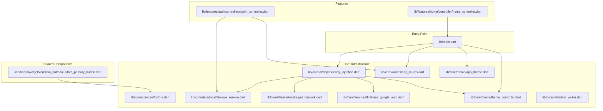
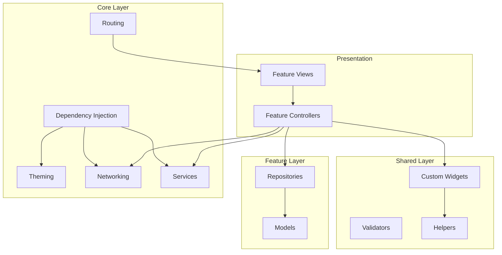
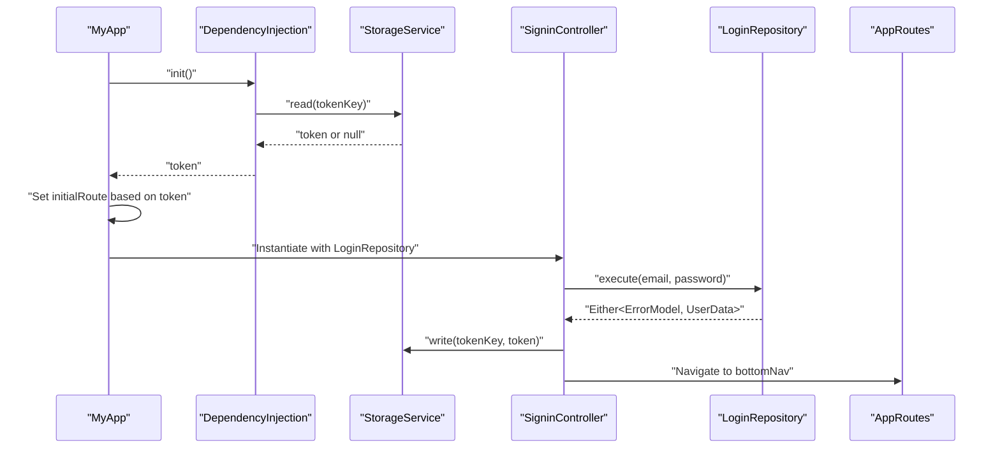
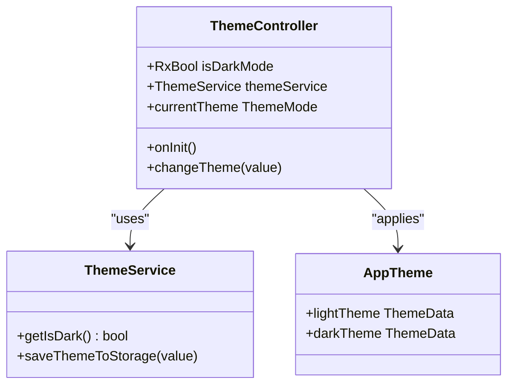
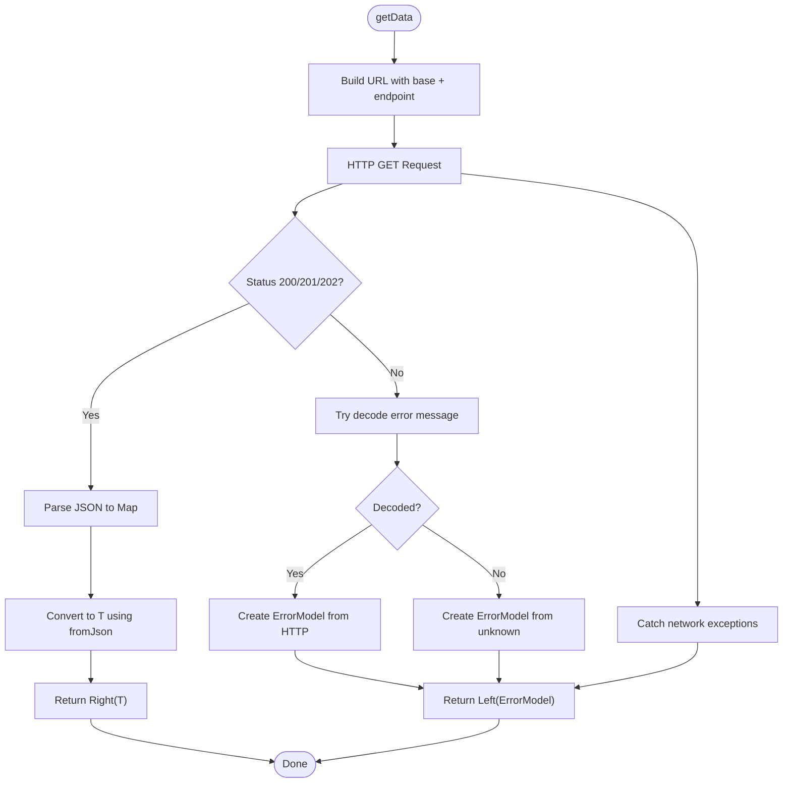
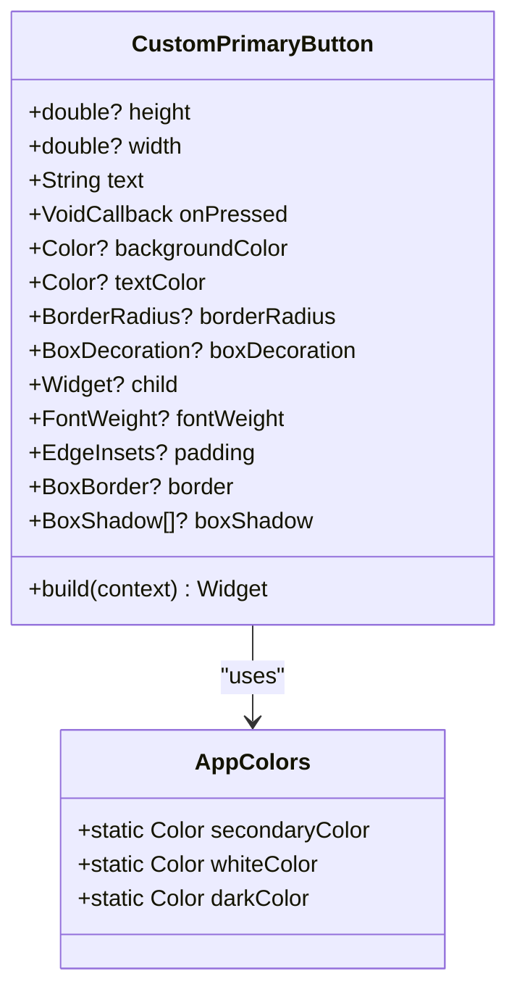
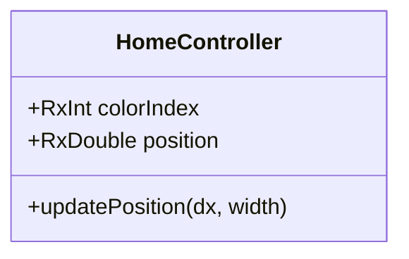

# Comprehensive Project Analysis Report

<cite>
**Referenced Files in This Document**
- [pubspec.yaml](file://pubspec.yaml)
- [README.md](file://README.md)
- [lib/main.dart](file://lib/main.dart)
- [lib/core/di/dependency_injection.dart](file://lib/core/di/dependency_injection.dart)
- [lib/core/routes/app_routes.dart](file://lib/core/routes/app_routes.dart)
- [lib/core/theme/app_theme.dart](file://lib/core/theme/app_theme.dart)
- [lib/core/theme/theme_controller.dart](file://lib/core/theme/theme_controller.dart)
- [lib/core/data/local/storage_service.dart](file://lib/core/data/local/storage_service.dart)
- [lib/core/data/networks/get_network.dart](file://lib/core/data/networks/get_network.dart)
- [lib/core/services/firebase_google_auth.dart](file://lib/core/services/firebase_google_auth.dart)
- [lib/core/constant/colors.dart](file://lib/core/constant/colors.dart)
- [lib/core/utils/date_picker.dart](file://lib/core/utils/date_picker.dart)
- [lib/shared/widgets/custom_button/custom_primary_button.dart](file://lib/shared/widgets/custom_button/custom_primary_button.dart)
- [lib/features/auth/controller/signin_controller.dart](file://lib/features/auth/controller/signin_controller.dart)
- [lib/features/home/controller/home_controller.dart](file://lib/features/home/controller/home_controller.dart)
</cite>

## Table of Contents
1. [Introduction](#introduction)
2. [Project Structure](#project-structure)
3. [Core Components](#core-components)
4. [Architecture Overview](#architecture-overview)
5. [Detailed Component Analysis](#detailed-component-analysis)
6. [Dependency Analysis](#dependency-analysis)
7. [Performance Considerations](#performance-considerations)
8. [Troubleshooting Guide](#troubleshooting-guide)
9. [Conclusion](#conclusion)

## Introduction
This document presents a comprehensive analysis of the ZB-DEZINE Flutter project, focusing on its architecture, design patterns, and implementation strategies. The project follows a modular structure with clear separation of concerns across core infrastructure, feature modules, and shared components. It leverages dependency injection via GetX, Firebase for authentication, and a well-defined theming system. The analysis covers initialization flows, routing, state management, networking, authentication, and UI component design.

## Project Structure
The project is organized into platform-specific configurations (Android, iOS, Web, Linux, macOS, Windows), feature-based modules under `lib/features`, shared reusable components under `lib/shared`, and core infrastructure under `lib/core`. The application entry point initializes dependencies, sets up theming, and configures navigation based on authentication state.

**Diagram sources**
- [lib/main.dart:12-46](file://lib/main.dart#L12-L46)
- [lib/core/di/dependency_injection.dart:14-31](file://lib/core/di/dependency_injection.dart#L14-L31)
- [lib/core/routes/app_routes.dart:1-35](file://lib/core/routes/app_routes.dart#L1-L35)
- [lib/core/theme/app_theme.dart:4-23](file://lib/core/theme/app_theme.dart#L4-L23)
- [lib/core/theme/theme_controller.dart:5-22](file://lib/core/theme/theme_controller.dart#L5-L22)
- [lib/core/data/local/storage_service.dart:3-24](file://lib/core/data/local/storage_service.dart#L3-L24)
- [lib/core/data/networks/get_network.dart:9-42](file://lib/core/data/networks/get_network.dart#L9-L42)
- [lib/core/services/firebase_google_auth.dart:6-84](file://lib/core/services/firebase_google_auth.dart#L6-L84)
- [lib/core/constant/colors.dart:3-119](file://lib/core/constant/colors.dart#L3-L119)
- [lib/core/utils/date_picker.dart:3-36](file://lib/core/utils/date_picker.dart#L3-L36)
- [lib/features/auth/controller/signin_controller.dart:9-52](file://lib/features/auth/controller/signin_controller.dart#L9-L52)
- [lib/features/home/controller/home_controller.dart:3-12](file://lib/features/home/controller/home_controller.dart#L3-L12)
- [lib/shared/widgets/custom_button/custom_primary_button.dart:6-74](file://lib/shared/widgets/custom_button/custom_primary_button.dart#L6-L74)

**Section sources**
- [pubspec.yaml:1-119](file://pubspec.yaml#L1-L119)
- [README.md:1-17](file://README.md#L1-L17)
- [lib/main.dart:12-46](file://lib/main.dart#L12-L46)

## Core Components
This section outlines the foundational components that drive the application's behavior and appearance.

- Dependency Injection: Centralized initialization of Firebase, GetStorage, network clients, and services using GetX. It also retrieves the stored authentication token to determine the initial route.
- Routing: Static route constants define named routes for onboarding, authentication, navigation, and feature screens.
- Theming: Separate light and dark themes with theme mode controlled by a reactive controller that persists user preference.
- Local Storage: Typed storage service for tokens and other keys using GetStorage.
- Networking: Generic GET client returning Either<ErrorModel, T> with standardized error handling.
- Authentication: Firebase Google sign-in service with token retrieval and sign-out capabilities.
- UI Constants: Centralized color palette and gradients for consistent theming.
- Utilities: Date picker helper that respects theme brightness.

**Section sources**
- [lib/core/di/dependency_injection.dart:14-31](file://lib/core/di/dependency_injection.dart#L14-L31)
- [lib/core/routes/app_routes.dart:1-35](file://lib/core/routes/app_routes.dart#L1-L35)
- [lib/core/theme/app_theme.dart:4-23](file://lib/core/theme/app_theme.dart#L4-L23)
- [lib/core/theme/theme_controller.dart:5-22](file://lib/core/theme/theme_controller.dart#L5-L22)
- [lib/core/data/local/storage_service.dart:3-24](file://lib/core/data/local/storage_service.dart#L3-L24)
- [lib/core/data/networks/get_network.dart:9-42](file://lib/core/data/networks/get_network.dart#L9-L42)
- [lib/core/services/firebase_google_auth.dart:6-84](file://lib/core/services/firebase_google_auth.dart#L6-L84)
- [lib/core/constant/colors.dart:3-119](file://lib/core/constant/colors.dart#L3-L119)
- [lib/core/utils/date_picker.dart:3-36](file://lib/core/utils/date_picker.dart#L3-L36)

## Architecture Overview
The application follows a layered architecture:
- Presentation Layer: Widgets and controllers manage UI state and user interactions.
- Feature Layer: Feature-specific controllers, views, and repositories encapsulate business logic.
- Shared Layer: Reusable UI components, validators, and helpers.
- Core Layer: Dependency injection, routing, theming, networking, and services.
- Platform Layer: Platform-specific configurations and build scripts.

**Diagram sources**
- [lib/main.dart:21-46](file://lib/main.dart#L21-L46)
- [lib/core/di/dependency_injection.dart:14-31](file://lib/core/di/dependency_injection.dart#L14-L31)
- [lib/core/routes/app_routes.dart:1-35](file://lib/core/routes/app_routes.dart#L1-L35)
- [lib/core/theme/app_theme.dart:4-23](file://lib/core/theme/app_theme.dart#L4-L23)
- [lib/core/data/networks/get_network.dart:9-42](file://lib/core/data/networks/get_network.dart#L9-L42)
- [lib/core/services/firebase_google_auth.dart:6-84](file://lib/core/services/firebase_google_auth.dart#L6-L84)

## Detailed Component Analysis

### Authentication Flow
The authentication flow demonstrates reactive state management, dependency injection, and navigation based on authentication status.

**Diagram sources**
- [lib/main.dart:12-46](file://lib/main.dart#L12-L46)
- [lib/core/di/dependency_injection.dart:14-31](file://lib/core/di/dependency_injection.dart#L14-L31)
- [lib/core/data/local/storage_service.dart:8-22](file://lib/core/data/local/storage_service.dart#L8-L22)
- [lib/features/auth/controller/signin_controller.dart:17-36](file://lib/features/auth/controller/signin_controller.dart#L17-L36)

**Section sources**
- [lib/features/auth/controller/signin_controller.dart:9-52](file://lib/features/auth/controller/signin_controller.dart#L9-L52)
- [lib/core/data/local/storage_service.dart:3-24](file://lib/core/data/local/storage_service.dart#L3-L24)

### Theming and Theme Persistence
The theming system uses a reactive controller to manage theme mode and persist user preferences.

**Diagram sources**
- [lib/core/theme/theme_controller.dart:5-22](file://lib/core/theme/theme_controller.dart#L5-L22)
- [lib/core/theme/app_theme.dart:4-23](file://lib/core/theme/app_theme.dart#L4-L23)

**Section sources**
- [lib/core/theme/theme_controller.dart:5-22](file://lib/core/theme/theme_controller.dart#L5-L22)
- [lib/core/theme/app_theme.dart:4-23](file://lib/core/theme/app_theme.dart#L4-L23)

### Networking and Error Handling
The GET networking client provides a standardized interface for fetching data and handling errors.

**Diagram sources**
- [lib/core/data/networks/get_network.dart:11-40](file://lib/core/data/networks/get_network.dart#L11-L40)

**Section sources**
- [lib/core/data/networks/get_network.dart:9-42](file://lib/core/data/networks/get_network.dart#L9-L42)

### UI Component Design: Custom Button
The custom primary button adapts to theme brightness and supports flexible styling.

**Diagram sources**
- [lib/shared/widgets/custom_button/custom_primary_button.dart:6-74](file://lib/shared/widgets/custom_button/custom_primary_button.dart#L6-L74)
- [lib/core/constant/colors.dart:3-119](file://lib/core/constant/colors.dart#L3-L119)

**Section sources**
- [lib/shared/widgets/custom_button/custom_primary_button.dart:6-74](file://lib/shared/widgets/custom_button/custom_primary_button.dart#L6-L74)
- [lib/core/constant/colors.dart:3-119](file://lib/core/constant/colors.dart#L3-L119)

### Home Controller State Management
The home controller manages reactive state for UI animations and interactions.

**Diagram sources**
- [lib/features/home/controller/home_controller.dart:3-12](file://lib/features/home/controller/home_controller.dart#L3-L12)

**Section sources**
- [lib/features/home/controller/home_controller.dart:3-12](file://lib/features/home/controller/home_controller.dart#L3-L12)

## Dependency Analysis
The project relies on a curated set of Flutter and Firebase packages, with GetX powering dependency injection and state management. The dependency graph highlights key external integrations and internal coupling.

```mermaid
graph TB
subgraph "Application"
Main["lib/main.dart"]
DI["lib/core/di/dependency_injection.dart"]
AuthCtrl["lib/features/auth/controller/signin_controller.dart"]
end
subgraph "GetX Ecosystem"
Get["GetX"]
GetStorage["GetStorage"]
end
subgraph "Firebase"
FirebaseCore["firebase_core"]
FirebaseAuth["firebase_auth"]
GoogleSignIn["google_sign_in"]
end
subgraph "UI & UX"
Material["material"]
ScreenUtil["flutter_screenutil"]
GoogleFonts["google_fonts"]
Glassmorphism["glassmorphism"]
end
subgraph "Networking"
Http["http"]
FPDart["fpdart"]
end
subgraph "Utilities"
IntlPhoneField["intl_phone_field"]
ImagePicker["image_picker"]
CachedNetworkImage["cached_network_image"]
CarouselSlider["carousel_slider"]
end
Main --> Get
DI --> Get
DI --> GetStorage
AuthCtrl --> Get
AuthCtrl --> FirebaseCore
AuthCtrl --> FirebaseAuth
AuthCtrl --> GoogleSignIn
Main --> Material
Main --> ScreenUtil
Main --> GoogleFonts
DI --> Http
DI --> FPDart
AuthCtrl --> IntlPhoneField
AuthCtrl --> ImagePicker
AuthCtrl --> CachedNetworkImage
AuthCtrl --> CarouselSlider
```

**Diagram sources**
- [pubspec.yaml:30-67](file://pubspec.yaml#L30-L67)
- [lib/main.dart:1-11](file://lib/main.dart#L1-L11)
- [lib/core/di/dependency_injection.dart:1-11](file://lib/core/di/dependency_injection.dart#L1-L11)
- [lib/features/auth/controller/signin_controller.dart:1-8](file://lib/features/auth/controller/signin_controller.dart#L1-L8)

**Section sources**
- [pubspec.yaml:30-67](file://pubspec.yaml#L30-L67)

## Performance Considerations
- Reactive State Management: Using GetX reduces boilerplate and improves performance by minimizing rebuild scopes.
- Lazy Initialization: Firebase and GetStorage are initialized once during startup to avoid repeated overhead.
- Network Efficiency: The GET client consolidates error handling and parsing, reducing redundant code and potential memory leaks.
- Asset Loading: Cached network image and image picker optimize media loading performance.
- Theming Responsiveness: ThemeController updates only when theme preference changes, avoiding unnecessary UI rebuilds.

## Troubleshooting Guide
Common issues and resolutions:
- Authentication Failures: Verify Firebase configuration and ensure Google Sign-In is enabled. Check token retrieval and storage mechanisms.
- Navigation Issues: Confirm route constants match navigation calls and initial route logic based on token presence.
- Theme Persistence: Ensure ThemeController initializes ThemeService and that save/load operations succeed.
- Network Errors: Inspect status codes and error model creation; handle unknown errors gracefully.
- UI Rendering: Validate theme brightness detection and color usage in custom widgets.

**Section sources**
- [lib/core/services/firebase_google_auth.dart:15-63](file://lib/core/services/firebase_google_auth.dart#L15-L63)
- [lib/core/data/networks/get_network.dart:16-40](file://lib/core/data/networks/get_network.dart#L16-L40)
- [lib/core/theme/theme_controller.dart:9-18](file://lib/core/theme/theme_controller.dart#L9-L18)
- [lib/shared/widgets/custom_button/custom_primary_button.dart:39-69](file://lib/shared/widgets/custom_button/custom_primary_button.dart#L39-L69)

## Conclusion
ZB-DEZINE demonstrates a well-structured Flutter application with clear architectural boundaries. The use of GetX for dependency injection and state management, Firebase for authentication, and a centralized theming system contributes to maintainability and scalability. The modular feature organization and shared component library promote code reuse and consistency. The analysis reveals robust patterns for authentication flows, networking, theming, and UI composition, providing a solid foundation for future enhancements.