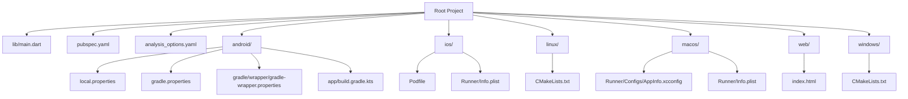
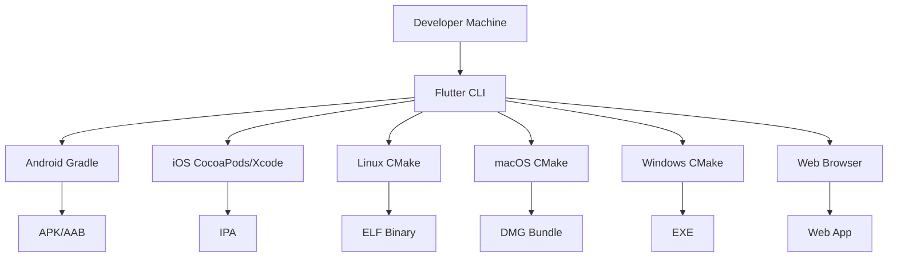
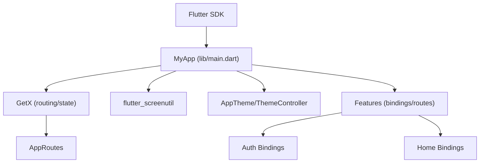

# Development Environment Setup

<cite>
**Referenced Files in This Document**
- [pubspec.yaml](file://pubspec.yaml)
- [analysis_options.yaml](file://analysis_options.yaml)
- [README.md](file://README.md)
- [android/local.properties](file://android/local.properties)
- [android/gradle.properties](file://android/gradle.properties)
- [android/gradle/wrapper/gradle-wrapper.properties](file://android/gradle/wrapper/gradle-wrapper.properties)
- [android/app/build.gradle.kts](file://android/app/build.gradle.kts)
- [ios/Podfile](file://ios/Podfile)
- [ios/Runner/Info.plist](file://ios/Runner/Info.plist)
- [ios/Runner.xcodeproj/project.pbxproj](file://ios/Runner.xcodeproj/project.pbxproj)
- [macos/Runner/Configs/AppInfo.xcconfig](file://macos/Runner/Configs/AppInfo.xcconfig)
- [macos/Runner/Info.plist](file://macos/Runner/Info.plist)
- [linux/CMakeLists.txt](file://linux/CMakeLists.txt)
- [windows/CMakeLists.txt](file://windows/CMakeLists.txt)
- [web/index.html](file://web/index.html)
- [lib/main.dart](file://lib/main.dart)
</cite>

## Table of Contents
1. [Introduction](#introduction)
2. [Project Structure](#project-structure)
3. [Core Components](#core-components)
4. [Architecture Overview](#architecture-overview)
5. [Detailed Component Analysis](#detailed-component-analysis)
6. [Dependency Analysis](#dependency-analysis)
7. [Performance Considerations](#performance-considerations)
8. [Troubleshooting Guide](#troubleshooting-guide)
9. [Conclusion](#conclusion)
10. [Appendices](#appendices)

## Introduction
This document provides a comprehensive guide to setting up the development environment for ZB-DEZINE across Android, iOS, web, Linux, macOS, and Windows platforms. It covers Flutter SDK configuration, platform-specific build tools, environment variables, certificates and signing, IDE setup, debugging, hot reload, continuous integration, automated testing, deployment preparation, and common issues. The goal is to enable developers to quickly bootstrap a working environment and collaborate effectively.

## Project Structure
ZB-DEZINE follows a standard Flutter monorepo layout with platform-specific folders under android/, ios/, linux/, macos/, web/, and windows/. The Flutter SDK and toolchain are configured via pubspec.yaml, analysis_options.yaml, and platform-specific build files. The application entry point is lib/main.dart.

**Diagram sources**
- [lib/main.dart:1-47](file://lib/main.dart#L1-L47)
- [pubspec.yaml:1-112](file://pubspec.yaml#L1-L112)
- [analysis_options.yaml:1-29](file://analysis_options.yaml#L1-L29)
- [android/local.properties:1-5](file://android/local.properties#L1-L5)
- [android/gradle.properties:1-3](file://android/gradle.properties#L1-L3)
- [android/gradle/wrapper/gradle-wrapper.properties:1-6](file://android/gradle/wrapper/gradle-wrapper.properties#L1-L6)
- [android/app/build.gradle.kts:1-45](file://android/app/build.gradle.kts#L1-L45)
- [ios/Podfile:1-44](file://ios/Podfile#L1-L44)
- [ios/Runner/Info.plist:1-50](file://ios/Runner/Info.plist#L1-L50)
- [linux/CMakeLists.txt:1-129](file://linux/CMakeLists.txt#L1-L129)
- [macos/Runner/Configs/AppInfo.xcconfig:1-15](file://macos/Runner/Configs/AppInfo.xcconfig#L1-L15)
- [macos/Runner/Info.plist:1-33](file://macos/Runner/Info.plist#L1-L33)
- [web/index.html:1-39](file://web/index.html#L1-L39)
- [windows/CMakeLists.txt:1-109](file://windows/CMakeLists.txt#L1-L109)

**Section sources**
- [README.md:1-17](file://README.md#L1-L17)
- [pubspec.yaml:1-112](file://pubspec.yaml#L1-L112)
- [analysis_options.yaml:1-29](file://analysis_options.yaml#L1-L29)
- [lib/main.dart:1-47](file://lib/main.dart#L1-L47)

## Core Components
- Flutter SDK and toolchain: Defined in pubspec.yaml and enforced by analysis_options.yaml.
- Android build: Gradle wrapper, Gradle properties, and Android app Gradle configuration.
- iOS build: CocoaPods integration via Podfile and Xcode project configuration.
- Desktop and Web: Linux/macOS via CMake and Windows via CMake; web via index.html manifest and base href.
- Application entry point: lib/main.dart initializes dependency injection and routes.

Key configuration highlights:
- Flutter SDK constraint and versioning metadata are defined in pubspec.yaml.
- Lint rules are inherited from flutter_lints in analysis_options.yaml.
- Platform binaries and identifiers are defined in platform-specific configuration files.

**Section sources**
- [pubspec.yaml:21-23](file://pubspec.yaml#L21-L23)
- [analysis_options.yaml:8-10](file://analysis_options.yaml#L8-L10)
- [lib/main.dart:12-19](file://lib/main.dart#L12-L19)

## Architecture Overview
The development environment integrates Flutter’s cross-platform toolchain with platform-specific build systems. The diagram below shows how the Flutter tooling coordinates with Gradle (Android), CocoaPods/Xcode (iOS/macOS), CMake (Linux/Windows), and the browser (Web).

[No sources needed since this diagram shows conceptual workflow, not actual code structure]

## Detailed Component Analysis

### Android Development Environment
- Gradle Wrapper and Properties
  - Gradle distribution is pinned via android/gradle/wrapper/gradle-wrapper.properties.
  - JVM and AndroidX settings are configured in android/gradle.properties.
  - Android SDK path and Flutter SDK path are defined in android/local.properties.
- Android App Gradle
  - Android namespace, compile/target SDK, Java/Kotlin compatibility, and default versioning are set in android/app/build.gradle.kts.
  - Release signing defaults to debug configuration; production requires proper keystore configuration.
- Environment Variables and Versioning
  - Version name and code are sourced from android/local.properties and passed to Flutter build via flutter.versionName and flutter.versionCode.

Recommended steps:
- Install Android Studio and Android SDK.
- Set sdk.dir and flutter.sdk in android/local.properties to absolute paths.
- Ensure Gradle wrapper distribution matches the project’s expectation.
- Configure JDK 17 for Java/Kotlin compatibility as per build.gradle.kts.

**Section sources**
- [android/gradle/wrapper/gradle-wrapper.properties:1-6](file://android/gradle/wrapper/gradle-wrapper.properties#L1-L6)
- [android/gradle.properties:1-3](file://android/gradle.properties#L1-L3)
- [android/local.properties:1-5](file://android/local.properties#L1-L5)
- [android/app/build.gradle.kts:8-44](file://android/app/build.gradle.kts#L8-L44)

### iOS/macOS Development Environment
- CocoaPods and Xcode
  - CocoaPods integration is defined in ios/Podfile, including platform targeting and plugin setup.
  - Xcode project settings and build configurations are defined in ios/Runner.xcodeproj/project.pbxproj.
- iOS Bundle and Info
  - iOS bundle identifiers and versioning are defined in ios/Runner/Info.plist.
- macOS Bundle and Configs
  - macOS bundle identifiers and copyright are defined in macos/Runner/Configs/AppInfo.xcconfig and macos/Runner/Info.plist.
- Code Signing and Certificates
  - Xcode build settings indicate CODE_SIGN_IDENTITY is set to “iPhone Developer” for iOS targets.
  - For production builds, configure a valid Apple Developer Team, provisioning profiles, and signing certificates.

Recommended steps:
- Install Xcode and ensure Command Line Tools are available.
- Run pod install from ios/ to generate Pods and integrate plugins.
- Configure signing in Xcode for Debug/Release/Profile schemes.
- Ensure macOS deployment target and entitlements align with macos/Runner/Configs/AppInfo.xcconfig.

**Section sources**
- [ios/Podfile:1-44](file://ios/Podfile#L1-L44)
- [ios/Runner.xcodeproj/project.pbxproj:306-536](file://ios/Runner.xcodeproj/project.pbxproj#L306-L536)
- [ios/Runner/Info.plist:19-24](file://ios/Runner/Info.plist#L19-L24)
- [macos/Runner/Configs/AppInfo.xcconfig:8-14](file://macos/Runner/Configs/AppInfo.xcconfig#L8-L14)
- [macos/Runner/Info.plist:19-22](file://macos/Runner/Info.plist#L19-L22)

### Linux Development Environment
- CMake Configuration
  - Linux build settings, binary name, application ID, and installation paths are defined in linux/CMakeLists.txt.
- GTK and Plugins
  - The project links against GTK via pkg-config and includes Flutter plugin rules.

Recommended steps:
- Install GTK development libraries and CMake.
- Build using CMake; the project supports Debug, Profile, and Release modes.
- Ensure runtime RPATH is set correctly for bundled libraries.

**Section sources**
- [linux/CMakeLists.txt:1-129](file://linux/CMakeLists.txt#L1-L129)

### macOS Development Environment
- CMake and Xcode Integration
  - macOS uses CMake for building; bundle identifiers and copyright are centralized in macos/Runner/Configs/AppInfo.xcconfig and macos/Runner/Info.plist.
- Entitlements and Deployment Target
  - Review macos/Runner/Info.plist for minimum OS version and entitlements.

Recommended steps:
- Install Xcode and ensure Command Line Tools are available.
- Build via CMake; optionally open the Xcode workspace for debugging.
- Verify entitlements and signing in Xcode if distributing outside the build system.

**Section sources**
- [macos/Runner/Configs/AppInfo.xcconfig:8-14](file://macos/Runner/Configs/AppInfo.xcconfig#L8-L14)
- [macos/Runner/Info.plist:23-24](file://macos/Runner/Info.plist#L23-L24)

### Windows Development Environment
- CMake Configuration
  - Windows build settings, binary name, and installation paths are defined in windows/CMakeLists.txt.
- Compiler and Linker
  - Uses C++17 and sets Unicode preprocessor definitions.

Recommended steps:
- Install Visual Studio with C++ support and CMake.
- Build using CMake; the project supports Debug, Profile, and Release modes.
- Ensure ICU data and plugin libraries are installed alongside the executable.

**Section sources**
- [windows/CMakeLists.txt:1-109](file://windows/CMakeLists.txt#L1-L109)

### Web Development Environment
- Web Entry Point
  - The web app is served from web/index.html, which includes a base href placeholder and manifest link.
- Base Href and Manifest
  - Use the --base-href flag during build to set the base path; ensure manifest.json is present.

Recommended steps:
- Use Chrome/Chromium for development and debugging.
- Serve the web build locally and verify the manifest and icons.
- Test responsive behavior and PWA features.

**Section sources**
- [web/index.html:17-33](file://web/index.html#L17-L33)

### Flutter SDK and Tooling
- SDK Constraint and Dependencies
  - Flutter SDK version is constrained in pubspec.yaml; dependencies and dev_dependencies are declared there.
- Linting
  - Lint rules are inherited from flutter_lints in analysis_options.yaml.

Recommended steps:
- Install the Flutter SDK matching the version constraint.
- Run flutter pub get to resolve dependencies.
- Keep dependencies updated and address lint warnings.

**Section sources**
- [pubspec.yaml:21-23](file://pubspec.yaml#L21-L23)
- [pubspec.yaml:30-70](file://pubspec.yaml#L30-L70)
- [analysis_options.yaml:8-10](file://analysis_options.yaml#L8-L10)

### Application Entry Point and DI Initialization
- Entry Point
  - lib/main.dart initializes WidgetsFlutterBinding, runs DependencyInjection.init(), and starts the app with GetX routing and themes.
- Routing and Bindings
  - Initial route and bindings depend on whether a token exists.

Recommended steps:
- Ensure DependencyInjection.init() completes successfully before runApp.
- Verify theme controller and route bindings are initialized.

**Section sources**
- [lib/main.dart:12-19](file://lib/main.dart#L12-L19)
- [lib/main.dart:21-46](file://lib/main.dart#L21-L46)

## Dependency Analysis
The project relies on Flutter SDK and a curated set of Dart packages. The dependency graph below reflects the primary relationships among the Flutter SDK, core UI packages, and third-party libraries.

**Diagram sources**
- [lib/main.dart:12-19](file://lib/main.dart#L12-L19)
- [lib/main.dart:21-46](file://lib/main.dart#L21-L46)
- [pubspec.yaml:30-70](file://pubspec.yaml#L30-L70)

**Section sources**
- [pubspec.yaml:30-70](file://pubspec.yaml#L30-L70)
- [lib/main.dart:12-19](file://lib/main.dart#L12-L19)

## Performance Considerations
- Android Gradle Memory Settings
  - android/gradle.properties configures JVM heap and metaspace sizes; adjust for larger projects or CI environments.
- CMake Build Modes
  - Linux/macOS/Windows CMakeLists.txt define Debug, Profile, and Release modes; use Release for production builds.
- Flutter Asset Bundling
  - Ensure assets are organized efficiently; avoid oversized images and redundant assets.

[No sources needed since this section provides general guidance]

## Troubleshooting Guide
Common issues and resolutions:
- Android SDK Path Not Found
  - Ensure sdk.dir in android/local.properties points to a valid Android SDK installation.
- Gradle Wrapper Mismatch
  - Verify android/gradle/wrapper/gradle-wrapper.properties distribution URL matches your environment.
- iOS CocoaPods Issues
  - Run pod install from ios/ and ensure Xcode is selected as the default toolchain.
- iOS Signing Failures
  - Confirm CODE_SIGN_IDENTITY and provisioning profiles are configured in Xcode for the target scheme.
- Linux GTK Linking Errors
  - Install GTK development packages and rerun CMake generation.
- macOS Entitlements and Deployment Target
  - Align macos/Runner/Info.plist deployment target with your development environment.
- Windows ICU and Plugin Libraries
  - Ensure ICU data and plugin libraries are installed alongside the executable during packaging.
- Flutter Dependency Resolution
  - Run flutter pub get and flutter pub upgrade as needed; review analysis_options.yaml for lint violations.

**Section sources**
- [android/local.properties:1-5](file://android/local.properties#L1-L5)
- [android/gradle/wrapper/gradle-wrapper.properties:1-6](file://android/gradle/wrapper/gradle-wrapper.properties#L1-L6)
- [ios/Podfile:1-44](file://ios/Podfile#L1-L44)
- [ios/Runner.xcodeproj/project.pbxproj:335-355](file://ios/Runner.xcodeproj/project.pbxproj#L335-L355)
- [linux/CMakeLists.txt:54-56](file://linux/CMakeLists.txt#L54-L56)
- [macos/Runner/Info.plist:23-24](file://macos/Runner/Info.plist#L23-L24)
- [windows/CMakeLists.txt:49-50](file://windows/CMakeLists.txt#L49-L50)
- [analysis_options.yaml:8-10](file://analysis_options.yaml#L8-L10)

## Conclusion
By aligning Flutter tooling with platform-specific build systems—Gradle for Android, CocoaPods/Xcode for iOS/macOS, CMake for Linux/Windows, and the browser for Web—you can establish a robust development environment for ZB-DEZINE. Follow the platform-specific steps, configure signing and certificates, and leverage the provided configuration files to streamline setup and collaboration.

[No sources needed since this section summarizes without analyzing specific files]

## Appendices

### IDE Setup Recommendations
- Android Studio
  - Install Android Studio, Android SDK, and Flutter/Dart plugins.
  - Open the android/ folder in Android Studio for Android development.
- Xcode
  - Install Xcode and open ios/Runner.xcworkspace for iOS/macOS development.
- VS Code
  - Install Flutter and Dart extensions; use integrated terminal for flutter commands.
- IntelliJ/Android Studio
  - Use for cross-platform development; enable Flutter and Dart plugins.

[No sources needed since this section provides general guidance]

### Debugging and Hot Reload
- Android
  - Connect a device or start an emulator; run flutter devices to select a target.
  - Use flutter run for hot reload; attach debugger from IDE.
- iOS
  - Connect an iOS device or start Simulator; run flutter devices and flutter run.
  - Use Xcode for native debugging if needed.
- Web
  - Run flutter run -d chrome for Chrome debugging; use browser DevTools.
- Linux/macOS/Windows
  - Use flutter run for desktop; attach debugger from IDE.

[No sources needed since this section provides general guidance]

### Continuous Integration and Automated Testing
- CI Pipeline Outline
  - Install Flutter SDK matching pubspec.yaml.
  - Run flutter pub get and flutter analyze.
  - Run unit/integration tests with flutter test.
  - Build platform-specific artifacts:
    - Android: flutter build apk --release or flutter build appbundle.
    - iOS: flutter build ios --release --simulator (for simulator) or --configuration Release (for device).
    - Web: flutter build web.
    - Linux/macOS/Windows: flutter build <platform> --release.
- Secrets Management
  - Store signing credentials and API keys in CI secrets; inject via environment variables or secure files.
- Caching
  - Cache .pub-cache and build outputs to speed up CI jobs.

[No sources needed since this section provides general guidance]

### Deployment Preparation
- Android
  - Prepare keystore, configure signingConfig for release, and generate signed APK/AAB.
- iOS
  - Configure App Store Connect, provisioning profiles, and export method (App Store, Ad-Hoc, Enterprise).
- Web
  - Host built assets on a static host or CDN; verify manifest and service worker behavior.
- Desktop
  - Package binaries with appropriate installers; sign and notarize macOS if distributing outside the Mac App Store.

[No sources needed since this section provides general guidance]

### Setting Up Multiple Development Environments
- Local Environments
  - Each developer should maintain independent android/local.properties pointing to their SDK paths.
  - Use version control for shared configs (e.g., pubspec.yaml, analysis_options.yaml) while keeping platform-specific paths out of version control.
- Team Collaboration
  - Establish a shared CI configuration and standardized Flutter version.
  - Document environment variables and secrets handling.
  - Use feature branches and pull requests to coordinate changes to platform configurations.

[No sources needed since this section provides general guidance]