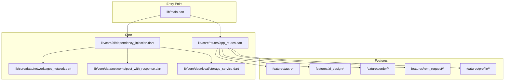
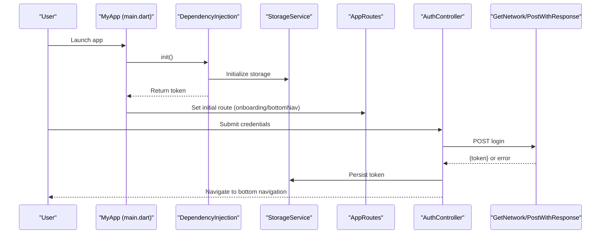
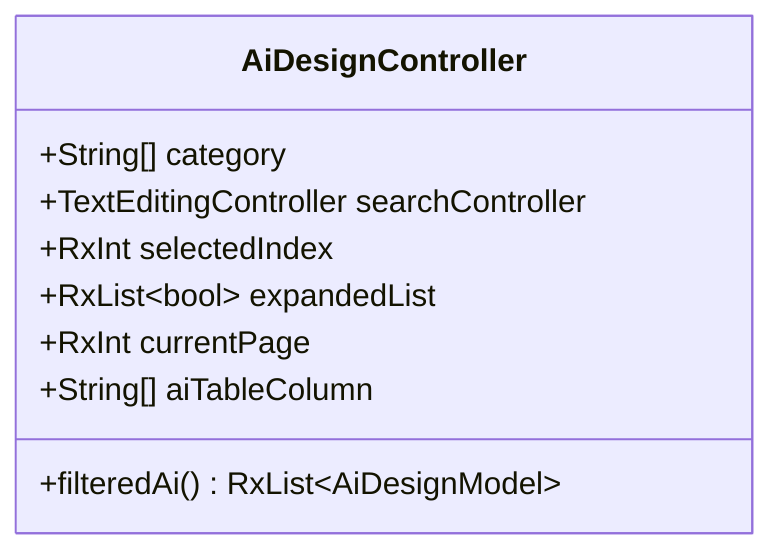
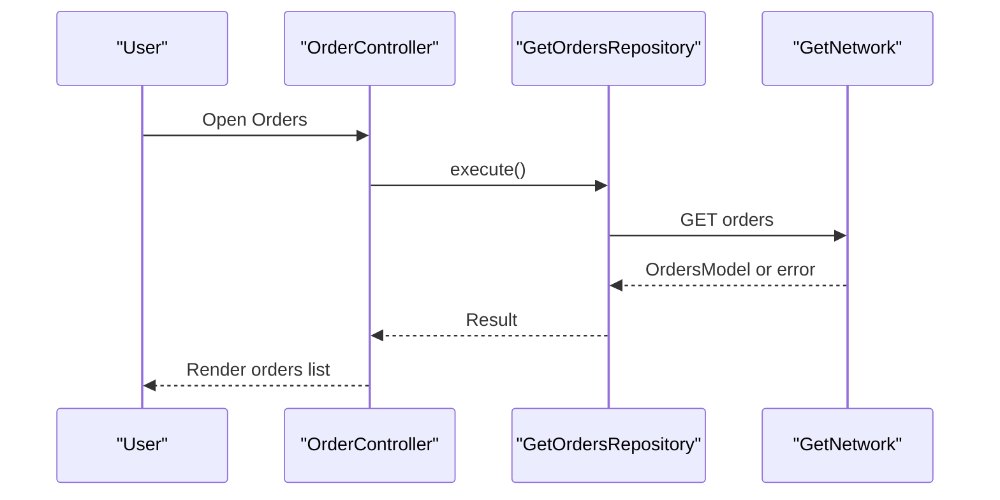
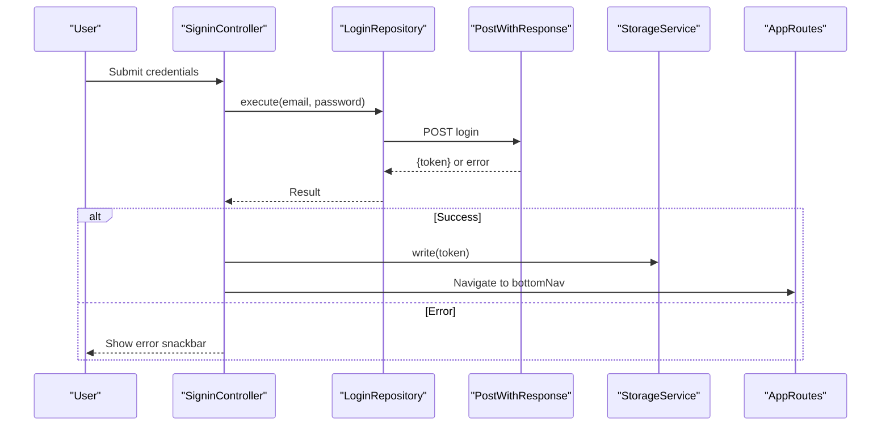
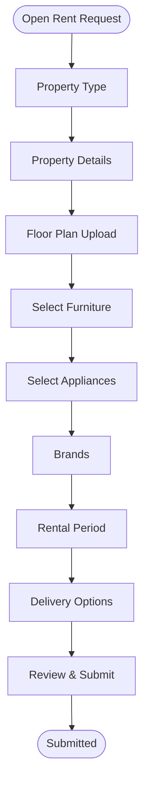

# Feature Highlights

<cite>
**Referenced Files in This Document**
- [main.dart](file://lib/main.dart)
- [dependency_injection.dart](file://lib/core/di/dependency_injection.dart)
- [app_routes.dart](file://lib/core/routes/app_routes.dart)
- [get_network.dart](file://lib/core/data/networks/get_network.dart)
- [post_with_response.dart](file://lib/core/data/networks/post_with_response.dart)
- [storage_service.dart](file://lib/core/data/local/storage_service.dart)
- [signin_controller.dart](file://lib/features/auth/controller/signin_controller.dart)
- [ai_design_controller.dart](file://lib/features/ai_design/controller/ai_design_controller.dart)
- [rent_request_controller.dart](file://lib/features/rent_request/controller/rent_request_controller.dart)
- [order_controller.dart](file://lib/features/order/controllers/order_controller.dart)
- [profile_controller.dart](file://lib/features/profile/controllers/profile_controller.dart)
- [pubspec.yaml](file://pubspec.yaml)
- [README.md](file://README.md)
</cite>

## Table of Contents
1. [Introduction](#introduction)
2. [Project Structure](#project-structure)
3. [Core Components](#core-components)
4. [Architecture Overview](#architecture-overview)
5. [Detailed Feature Highlights](#detailed-feature-highlights)
6. [Integration and User Experience](#integration-and-user-experience)
7. [Performance Considerations](#performance-considerations)
8. [Troubleshooting Guide](#troubleshooting-guide)
9. [Conclusion](#conclusion)

## Introduction
ZB-DEZINE is a modern Flutter-based platform positioned at the intersection of AI-powered interior design and home furnishing commerce. It enables users to discover, customize, and purchase stylish furniture and décor items, while offering advanced AI tools for visualizing designs and managing transactions. The platform targets both individual homeowners seeking inspiration and professionals in the design and retail sectors.

Key positioning pillars:
- AI-driven design visualization and placement
- E-commerce marketplace for curated home furnishings
- Seamless user authentication and profile management
- Rental request workflow for commercial and residential property setups
- Transaction and order lifecycle management
- Credit balance and payment orchestration
- Support and administrative dashboards for operational excellence

## Project Structure
The application follows a modular, feature-centric architecture with clear separation of concerns:
- Core layer: DI, routing, networking, storage, theming, and constants
- Features layer: domain-specific modules (authentication, AI design, marketplace, orders, rentals, payments, profiles, transactions, support)
- Shared layer: reusable UI widgets, validators, and helpers

**Diagram sources**
- [main.dart:12-46](file://lib/main.dart#L12-L46)
- [dependency_injection.dart:11-26](file://lib/core/di/dependency_injection.dart#L11-L26)
- [app_routes.dart:1-34](file://lib/core/routes/app_routes.dart#L1-L34)
- [get_network.dart:8-40](file://lib/core/data/networks/get_network.dart#L8-L40)
- [post_with_response.dart:7-44](file://lib/core/data/networks/post_with_response.dart#L7-L44)
- [storage_service.dart:3-22](file://lib/core/data/local/storage_service.dart#L3-L22)

**Section sources**
- [main.dart:12-46](file://lib/main.dart#L12-L46)
- [pubspec.yaml:30-112](file://pubspec.yaml#L30-L112)

## Core Components
- Dependency Injection: Centralized initialization of storage, theme, and network clients; exposes token retrieval for route gating.
- Routing: Named routes define navigation across onboarding, authentication, marketplace, AI design, orders, rentals, payments, and admin screens.
- Networking: Generic GET and POST handlers encapsulate HTTP calls and error modeling.
- Local Storage: Token persistence for session management and offline-first UX.
- Controllers: Feature controllers orchestrate UI state, form handling, and repository interactions.

**Section sources**
- [dependency_injection.dart:11-26](file://lib/core/di/dependency_injection.dart#L11-L26)
- [app_routes.dart:1-34](file://lib/core/routes/app_routes.dart#L1-L34)
- [get_network.dart:8-40](file://lib/core/data/networks/get_network.dart#L8-L40)
- [post_with_response.dart:7-44](file://lib/core/data/networks/post_with_response.dart#L7-L44)
- [storage_service.dart:3-22](file://lib/core/data/local/storage_service.dart#L3-L22)

## Architecture Overview
The platform uses a layered architecture:
- Presentation: GetX-based controllers and views per feature
- Domain: Feature-specific controllers manage state and orchestrate repositories
- Data: Repositories call network clients; responses are parsed via fromJson factories
- Infrastructure: DI initializes services; storage persists tokens; routing governs navigation

**Diagram sources**
- [main.dart:12-46](file://lib/main.dart#L12-L46)
- [dependency_injection.dart:11-26](file://lib/core/di/dependency_injection.dart#L11-L26)
- [storage_service.dart:3-22](file://lib/core/data/local/storage_service.dart#L3-L22)
- [app_routes.dart:1-34](file://lib/core/routes/app_routes.dart#L1-L34)
- [signin_controller.dart:17-36](file://lib/features/auth/controller/signin_controller.dart#L17-L36)
- [get_network.dart:10-39](file://lib/core/data/networks/get_network.dart#L10-L39)
- [post_with_response.dart:9-43](file://lib/core/data/networks/post_with_response.dart#L9-L43)

## Detailed Feature Highlights

### AI-Powered Interior Design Tools
Purpose:
- Enable users to generate and manage AI-assisted design assets (product placement and interior design).
Target users:
- Homeowners, designers, and retailers needing visualizations.
Key benefits:
- One-click filtering by generation type.
- Pagination and expandable rows for detailed actions.
- Search and categorization for efficient discovery.

**Diagram sources**
- [ai_design_controller.dart:5-70](file://lib/features/ai_design/controller/ai_design_controller.dart#L5-L70)

**Section sources**
- [ai_design_controller.dart:5-70](file://lib/features/ai_design/controller/ai_design_controller.dart#L5-L70)

### E-commerce Marketplace Functionality
Purpose:
- Browse, search, and purchase products with integrated order management.
Target users:
- Consumers and buyers seeking home furnishings.
Key benefits:
- Centralized order retrieval with loading and error handling.
- Search-enabled filtering and info toggles.
- Seamless integration with payment and transaction flows.

**Diagram sources**
- [order_controller.dart:7-40](file://lib/features/order/controllers/order_controller.dart#L7-L40)
- [get_network.dart:10-39](file://lib/core/data/networks/get_network.dart#L10-L39)

**Section sources**
- [order_controller.dart:7-40](file://lib/features/order/controllers/order_controller.dart#L7-L40)

### User Authentication and Management
Purpose:
- Secure sign-in, sign-up, OTP verification, and session persistence.
Target users:
- New and existing users requiring account access.
Key benefits:
- Token-based session management.
- Snackbars for success/error feedback.
- Route-based gating for onboarding vs. main app.

**Diagram sources**
- [signin_controller.dart:9-51](file://lib/features/auth/controller/signin_controller.dart#L9-L51)
- [post_with_response.dart:9-43](file://lib/core/data/networks/post_with_response.dart#L9-L43)
- [storage_service.dart:7-21](file://lib/core/data/local/storage_service.dart#L7-L21)
- [app_routes.dart:1-34](file://lib/core/routes/app_routes.dart#L1-L34)

**Section sources**
- [signin_controller.dart:9-51](file://lib/features/auth/controller/signin_controller.dart#L9-L51)
- [storage_service.dart:3-22](file://lib/core/data/local/storage_service.dart#L3-L22)

### Rental System
Purpose:
- Streamlined multi-step rental request process for property and equipment needs.
Target users:
- Businesses and individuals arranging temporary furnishings or appliances.
Key benefits:
- Step-by-step guided flow (property type, details, floor plan, furniture, appliances, brands, period, delivery, review).
- Form validation and scroll management for long forms.

**Diagram sources**
- [rent_request_controller.dart:14-46](file://lib/features/rent_request/controller/rent_request_controller.dart#L14-L46)

**Section sources**
- [rent_request_controller.dart:14-46](file://lib/features/rent_request/controller/rent_request_controller.dart#L14-L46)

### Transaction Management
Purpose:
- Track and manage financial transactions, balances, and payment history.
Target users:
- Buyers, sellers, and administrators monitoring commerce activity.
Key benefits:
- Dedicated transaction and credit balance views for visibility.
- Integration with payment and order modules for end-to-end traceability.

[No sources needed since this section describes conceptual integration without analyzing specific files]

### Administrative Features
Purpose:
- Dashboard and support tools for operational oversight.
Target users:
- Platform administrators and support agents.
Key benefits:
- Centralized access to analytics, notifications, and support workflows.

[No sources needed since this section describes conceptual integration without analyzing specific files]

## Integration and User Experience
- Navigation and gating: The app initializes DI, reads the stored token, and sets the initial route accordingly. Onboarding is shown when no token exists; otherwise, the bottom navigation is presented.
- State management: GetX controllers coordinate UI state, form submissions, and repository calls across features.
- Data flow: Controllers call repositories, which use network clients to fetch or submit data. Responses are parsed and surfaced to the UI with loading and error states.
- Theming and responsiveness: ScreenUtil and theme controllers ensure consistent appearance and layout scaling.

**Diagram sources**
- [main.dart:12-46](file://lib/main.dart#L12-L46)
- [dependency_injection.dart:11-26](file://lib/core/di/dependency_injection.dart#L11-L26)
- [storage_service.dart:3-22](file://lib/core/data/local/storage_service.dart#L3-L22)
- [app_routes.dart:1-34](file://lib/core/routes/app_routes.dart#L1-L34)

**Section sources**
- [main.dart:12-46](file://lib/main.dart#L12-L46)
- [dependency_injection.dart:11-26](file://lib/core/di/dependency_injection.dart#L11-L26)
- [storage_service.dart:3-22](file://lib/core/data/local/storage_service.dart#L3-L22)
- [app_routes.dart:1-34](file://lib/core/routes/app_routes.dart#L1-L34)

## Performance Considerations
- Use pagination and lazy loading for lists (e.g., AI generations and orders) to reduce memory footprint.
- Debounce search inputs to minimize unnecessary network calls.
- Cache frequently accessed models locally to improve perceived performance.
- Optimize image rendering with placeholders and compressed assets.

[No sources needed since this section provides general guidance]

## Troubleshooting Guide
Common issues and resolutions:
- Authentication failures: Verify token persistence and re-authenticate. Check network client responses and error messages.
- Order retrieval errors: Confirm repository execution and network connectivity; inspect error snackbars for details.
- UI state inconsistencies: Ensure controllers properly dispose of TextEditingControllers and reset form states.

**Section sources**
- [signin_controller.dart:25-34](file://lib/features/auth/controller/signin_controller.dart#L25-L34)
- [order_controller.dart:19-26](file://lib/features/order/controllers/order_controller.dart#L19-L26)

## Conclusion
ZB-DEZINE combines cutting-edge AI design tools with a robust e-commerce and rental ecosystem, supported by secure authentication, streamlined order and transaction management, and administrative dashboards. Its modular architecture, centralized DI, and consistent use of controllers and repositories enable scalable feature development and a cohesive user experience across platforms.

[No sources needed since this section summarizes without analyzing specific files]