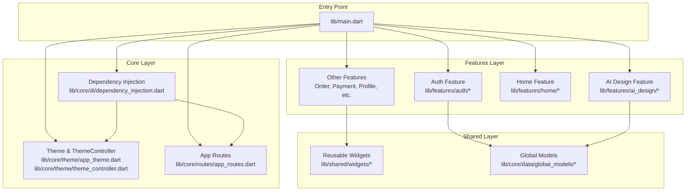
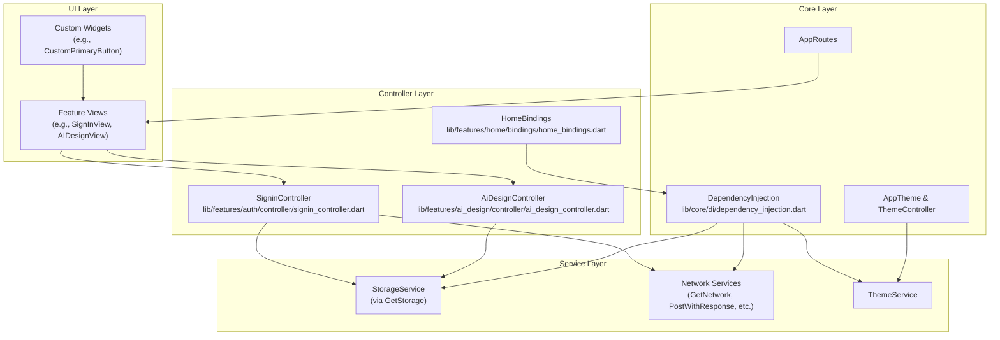
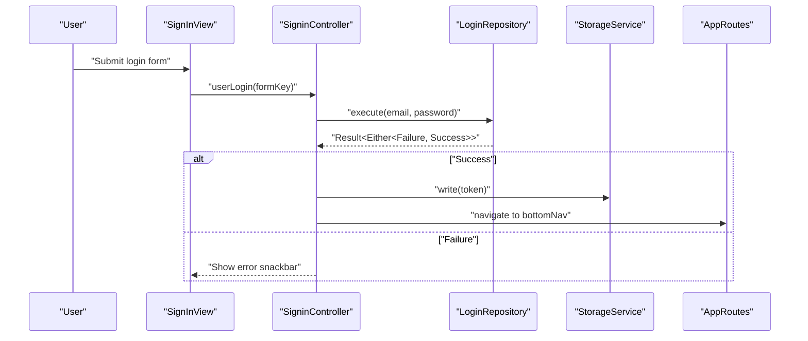
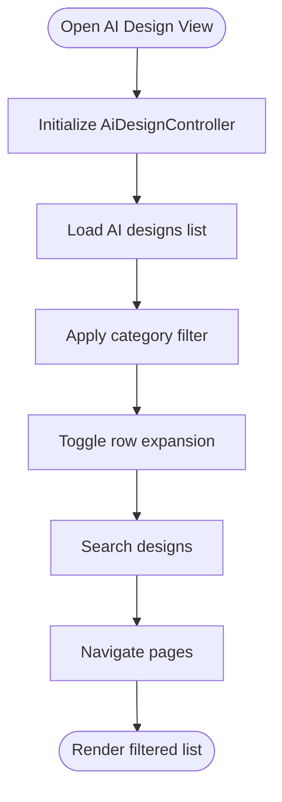
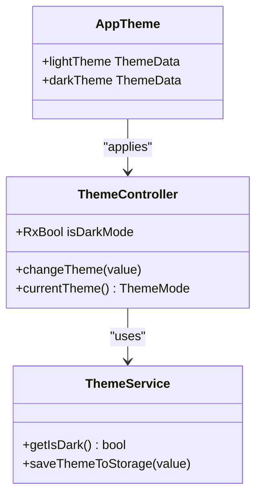
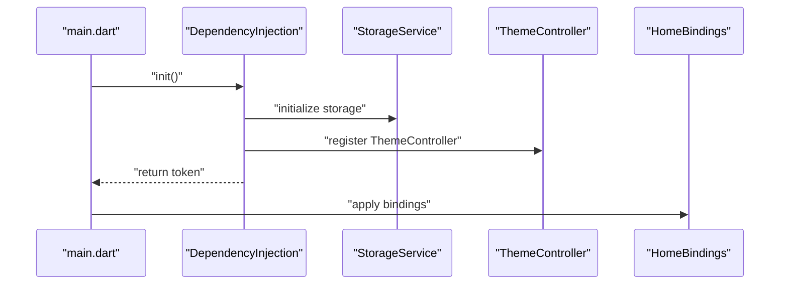
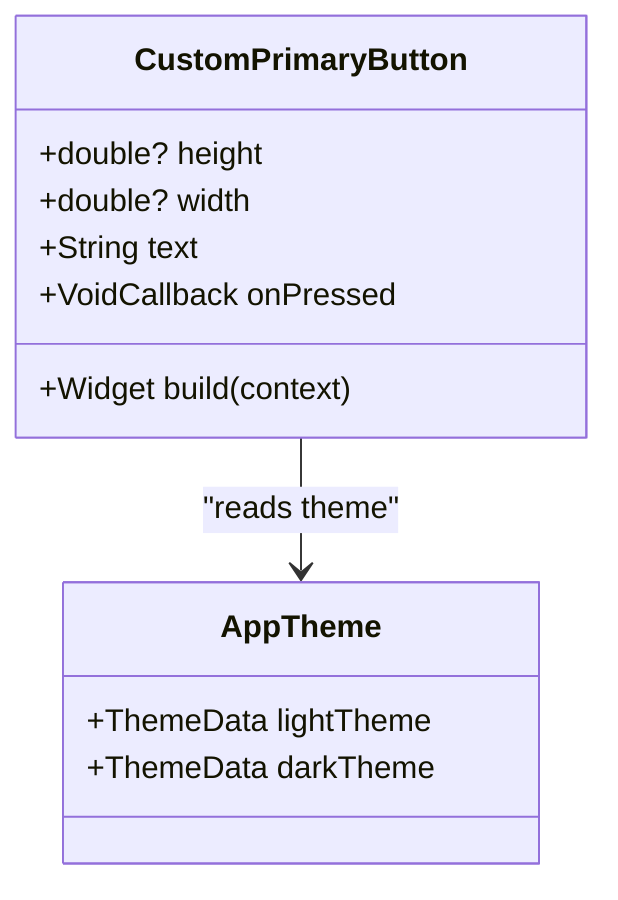
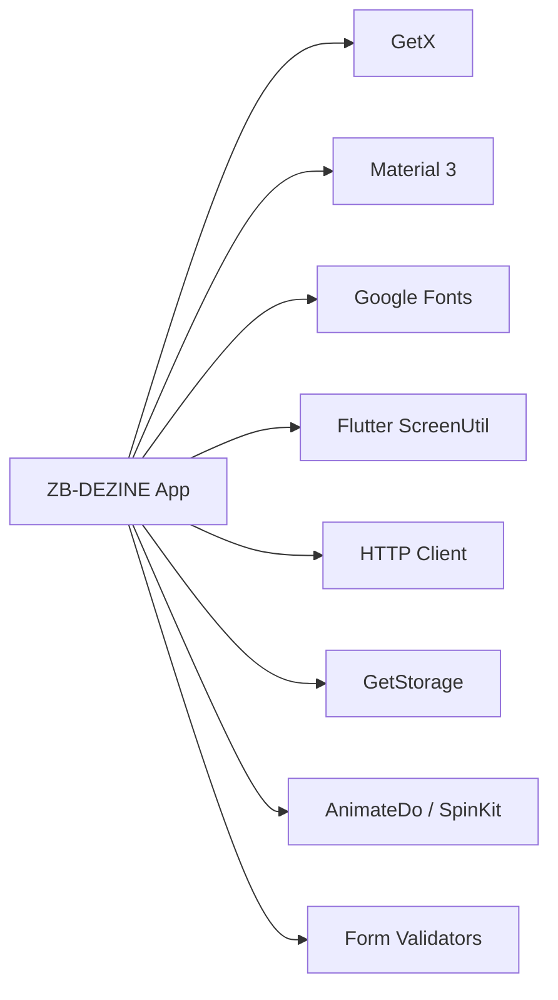

# Project Overview

<cite>
**Referenced Files in This Document**
- [README.md](file://README.md)
- [pubspec.yaml](file://pubspec.yaml)
- [lib/main.dart](file://lib/main.dart)
- [lib/core/di/dependency_injection.dart](file://lib/core/di/dependency_injection.dart)
- [lib/core/theme/app_theme.dart](file://lib/core/theme/app_theme.dart)
- [lib/core/theme/theme_controller.dart](file://lib/core/theme/theme_controller.dart)
- [lib/core/routes/app_routes.dart](file://lib/core/routes/app_routes.dart)
- [lib/features/home/bindings/home_bindings.dart](file://lib/features/home/bindings/home_bindings.dart)
- [lib/features/auth/controller/signin_controller.dart](file://lib/features/auth/controller/signin_controller.dart)
- [lib/features/ai_design/controller/ai_design_controller.dart](file://lib/features/ai_design/controller/ai_design_controller.dart)
- [lib/shared/widgets/custom_button/custom_primary_button.dart](file://lib/shared/widgets/custom_button/custom_primary_button.dart)
- [lib/core/data/global_models/user_profile_model.dart](file://lib/core/data/global_models/user_profile_model.dart)
</cite>

## Table of Contents
1. [Introduction](#introduction)
2. [Project Structure](#project-structure)
3. [Core Components](#core-components)
4. [Architecture Overview](#architecture-overview)
5. [Detailed Component Analysis](#detailed-component-analysis)
6. [Dependency Analysis](#dependency-analysis)
7. [Performance Considerations](#performance-considerations)
8. [Troubleshooting Guide](#troubleshooting-guide)
9. [Conclusion](#conclusion)

## Introduction
ZB-DEZINE is a multi-faceted Flutter-based e-commerce and AI design platform designed to empower users to create, manage, and monetize creative assets. The platform combines modern UI/UX with intelligent automation to deliver a seamless experience for both consumers and creators. Its core value proposition lies in bridging creativity and commerce through AI-powered design tools, streamlined user management, and integrated business operations.

Key positioning highlights:
- AI-first design tools for rapid generation and iteration of marketing and interior design assets.
- E-commerce capabilities enabling users to buy, sell, and manage transactions within the same ecosystem.
- Unified user management with onboarding, authentication, and profile operations.
- Business-focused features such as credit balances, orders, notifications, and support.

Target audience:
- Designers and marketers seeking quick, high-quality visuals for campaigns.
- Small to medium enterprises (SMEs) and freelancers who need cost-effective design solutions.
- Consumers looking for personalized and curated design assets.

## Project Structure
The project follows a modular, layered architecture with clear separation of concerns:
- Core: foundational services, routing, theming, dependency injection, and shared utilities.
- Features: feature-specific modules (authentication, AI design, e-commerce, payments, etc.) organized by domain.
- Shared: reusable UI widgets, extensions, and common models.

**Diagram sources**
- [lib/main.dart:12-46](file://lib/main.dart#L12-L46)
- [lib/core/di/dependency_injection.dart:11-26](file://lib/core/di/dependency_injection.dart#L11-L26)
- [lib/core/theme/app_theme.dart:4-22](file://lib/core/theme/app_theme.dart#L4-L22)
- [lib/core/theme/theme_controller.dart:5-21](file://lib/core/theme/theme_controller.dart#L5-L21)
- [lib/core/routes/app_routes.dart:1-33](file://lib/core/routes/app_routes.dart#L1-L33)

**Section sources**
- [lib/main.dart:12-46](file://lib/main.dart#L12-L46)
- [lib/core/di/dependency_injection.dart:11-26](file://lib/core/di/dependency_injection.dart#L11-L26)
- [lib/core/routes/app_routes.dart:1-33](file://lib/core/routes/app_routes.dart#L1-L33)

## Core Components
- Flutter SDK: The foundation of the cross-platform application.
- GetX: State management and dependency injection framework driving reactive UI updates and modular bindings.
- Material Design 3: Modern theming and UI components ensuring consistent design language across platforms.

Technology stack highlights:
- State Management: GetX controllers and reactive variables for efficient UI updates.
- Routing: Centralized route constants and navigation via named routes.
- Theming: Material 3-based themes with a dedicated ThemeController for light/dark mode switching.
- Dependency Injection: Centralized initialization and lazy loading of services and repositories.

Practical examples of platform capabilities:
- AI-powered design generation and filtering within the AI Design feature.
- User authentication and session persistence with token-based login.
- Modular feature bindings enabling scalable growth and maintainability.

**Section sources**
- [pubspec.yaml:30-70](file://pubspec.yaml#L30-L70)
- [lib/core/theme/app_theme.dart:4-22](file://lib/core/theme/app_theme.dart#L4-L22)
- [lib/core/theme/theme_controller.dart:5-21](file://lib/core/theme/theme_controller.dart#L5-L21)
- [lib/features/ai_design/controller/ai_design_controller.dart:5-70](file://lib/features/ai_design/controller/ai_design_controller.dart#L5-L70)
- [lib/features/auth/controller/signin_controller.dart:9-51](file://lib/features/auth/controller/signin_controller.dart#L9-L51)

## Architecture Overview
The application adopts a modular MVVM-style architecture with GetX controllers:
- Model: Data models and repositories encapsulate business data and network operations.
- View: Feature-specific screens and widgets built with Flutter and Material 3.
- ViewModel/Controller: GetX controllers orchestrate state, handle UI logic, and coordinate with repositories/services.

**Diagram sources**
- [lib/features/auth/controller/signin_controller.dart:9-51](file://lib/features/auth/controller/signin_controller.dart#L9-L51)
- [lib/features/ai_design/controller/ai_design_controller.dart:5-70](file://lib/features/ai_design/controller/ai_design_controller.dart#L5-L70)
- [lib/features/home/bindings/home_bindings.dart:13-34](file://lib/features/home/bindings/home_bindings.dart#L13-L34)
- [lib/core/di/dependency_injection.dart:11-26](file://lib/core/di/dependency_injection.dart#L11-L26)
- [lib/core/theme/app_theme.dart:4-22](file://lib/core/theme/app_theme.dart#L4-L22)
- [lib/core/theme/theme_controller.dart:5-21](file://lib/core/theme/theme_controller.dart#L5-L21)
- [lib/core/routes/app_routes.dart:1-33](file://lib/core/routes/app_routes.dart#L1-L33)
- [lib/shared/widgets/custom_button/custom_primary_button.dart:6-73](file://lib/shared/widgets/custom_button/custom_primary_button.dart#L6-L73)

## Detailed Component Analysis

### Authentication Flow (MVVM with GetX)
The authentication flow demonstrates the MVVM pattern with GetX controllers managing state and coordinating with repositories and storage.

**Diagram sources**
- [lib/features/auth/controller/signin_controller.dart:17-36](file://lib/features/auth/controller/signin_controller.dart#L17-L36)
- [lib/core/routes/app_routes.dart:15-15](file://lib/core/routes/app_routes.dart#L15-L15)

**Section sources**
- [lib/features/auth/controller/signin_controller.dart:9-51](file://lib/features/auth/controller/signin_controller.dart#L9-L51)

### AI Design Feature (Filtering and Pagination)
The AI Design feature showcases reactive state handling and UI updates driven by GetX controllers.

**Diagram sources**
- [lib/features/ai_design/controller/ai_design_controller.dart:5-70](file://lib/features/ai_design/controller/ai_design_controller.dart#L5-L70)

**Section sources**
- [lib/features/ai_design/controller/ai_design_controller.dart:5-70](file://lib/features/ai_design/controller/ai_design_controller.dart#L5-L70)

### Theming and Dark Mode (Reactive UI)
The ThemeController integrates with Material 3 theming to provide a responsive light/dark mode experience.

**Diagram sources**
- [lib/core/theme/theme_controller.dart:5-21](file://lib/core/theme/theme_controller.dart#L5-L21)
- [lib/core/theme/app_theme.dart:4-22](file://lib/core/theme/app_theme.dart#L4-L22)

**Section sources**
- [lib/core/theme/theme_controller.dart:5-21](file://lib/core/theme/theme_controller.dart#L5-L21)
- [lib/core/theme/app_theme.dart:4-22](file://lib/core/theme/app_theme.dart#L4-L22)

### Dependency Injection and Feature Bindings
Dependency Injection centralizes service initialization and enables modular feature bindings.

**Diagram sources**
- [lib/main.dart:12-19](file://lib/main.dart#L12-L19)
- [lib/core/di/dependency_injection.dart:12-25](file://lib/core/di/dependency_injection.dart#L12-L25)
- [lib/features/home/bindings/home_bindings.dart:13-34](file://lib/features/home/bindings/home_bindings.dart#L13-L34)

**Section sources**
- [lib/main.dart:12-19](file://lib/main.dart#L12-L19)
- [lib/core/di/dependency_injection.dart:11-26](file://lib/core/di/dependency_injection.dart#L11-L26)
- [lib/features/home/bindings/home_bindings.dart:13-34](file://lib/features/home/bindings/home_bindings.dart#L13-L34)

### Reusable UI Components
Custom widgets demonstrate consistent theming and responsive design using Flutter and ScreenUtil.

**Diagram sources**
- [lib/shared/widgets/custom_button/custom_primary_button.dart:6-73](file://lib/shared/widgets/custom_button/custom_primary_button.dart#L6-L73)
- [lib/core/theme/app_theme.dart:4-22](file://lib/core/theme/app_theme.dart#L4-L22)

**Section sources**
- [lib/shared/widgets/custom_button/custom_primary_button.dart:6-73](file://lib/shared/widgets/custom_button/custom_primary_button.dart#L6-L73)

## Dependency Analysis
The project leverages a curated set of Flutter and Dart packages to enable robust functionality:
- State Management: GetX for reactive controllers and dependency injection.
- Networking: HTTP client integration with custom network wrappers.
- UI Enhancements: Material Design 3, Google Fonts, and screen adaptation via Flutter ScreenUtil.
- Utilities: GetStorage for secure token persistence, animations, and form helpers.

**Diagram sources**
- [pubspec.yaml:30-70](file://pubspec.yaml#L30-L70)

**Section sources**
- [pubspec.yaml:30-70](file://pubspec.yaml#L30-L70)

## Performance Considerations
- Reactive UI updates: Use GetX controllers judiciously to avoid unnecessary rebuilds; leverage reactive variables for targeted updates.
- Lazy loading: Apply Get.lazyPut for feature-specific dependencies to minimize startup overhead.
- Network efficiency: Implement pagination and caching strategies for large datasets (e.g., AI designs, products).
- Asset optimization: Compress images and use vector assets where appropriate to reduce bundle size.

## Troubleshooting Guide
Common areas to inspect:
- Authentication failures: Verify token persistence and repository responses in the SigninController.
- Theme inconsistencies: Confirm ThemeController state and ThemeService storage values.
- Navigation issues: Ensure route constants match named routes and initial bindings are applied correctly.
- Dependency resolution: Confirm that all services are registered via DependencyInjection before use.

**Section sources**
- [lib/features/auth/controller/signin_controller.dart:17-36](file://lib/features/auth/controller/signin_controller.dart#L17-L36)
- [lib/core/theme/theme_controller.dart:9-18](file://lib/core/theme/theme_controller.dart#L9-L18)
- [lib/core/routes/app_routes.dart:1-33](file://lib/core/routes/app_routes.dart#L1-L33)
- [lib/core/di/dependency_injection.dart:12-25](file://lib/core/di/dependency_injection.dart#L12-L25)

## Conclusion
ZB-DEZINE positions itself as a modern, scalable Flutter platform combining AI-driven design tools with comprehensive e-commerce and business operations. Its modular MVVM architecture, powered by GetX, ensures maintainable and testable code while delivering a polished Material 3 experience. By focusing on user-centric workflows and robust backend integrations, the platform serves designers, marketers, and SMEs seeking an efficient, all-in-one solution for creative and commercial success.