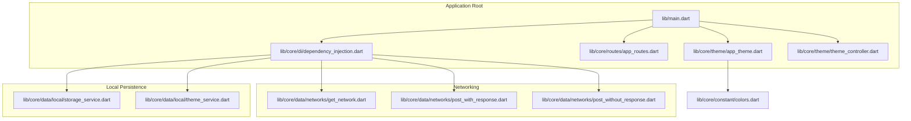
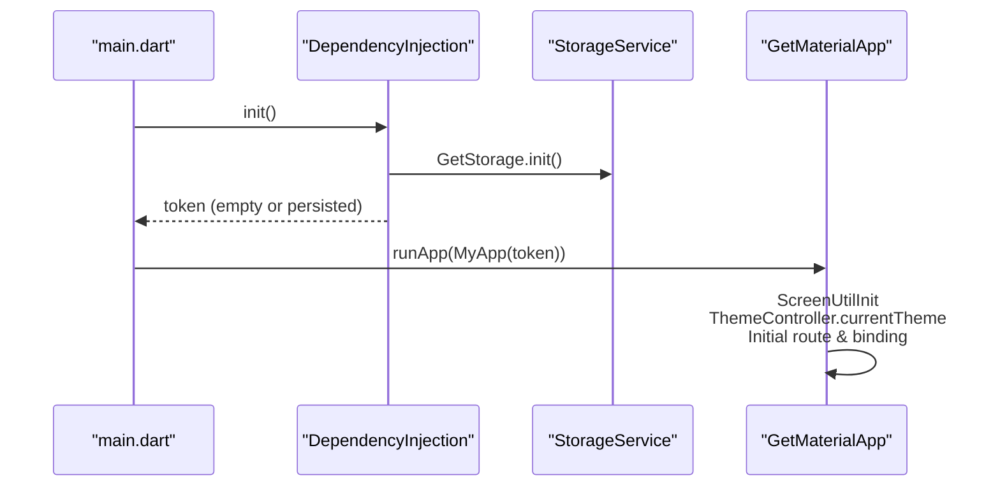
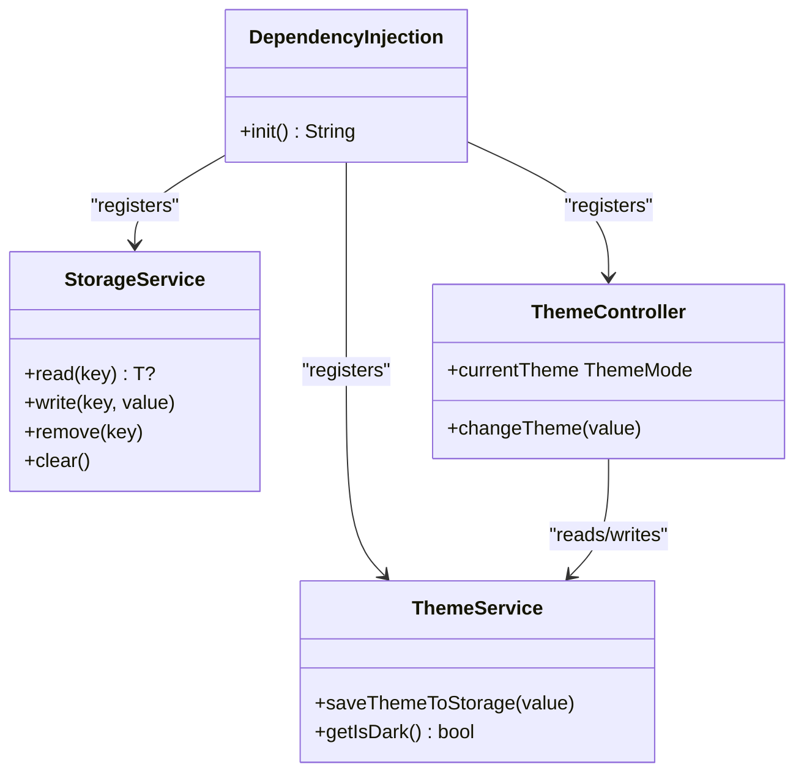
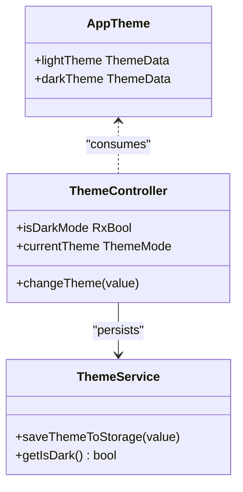
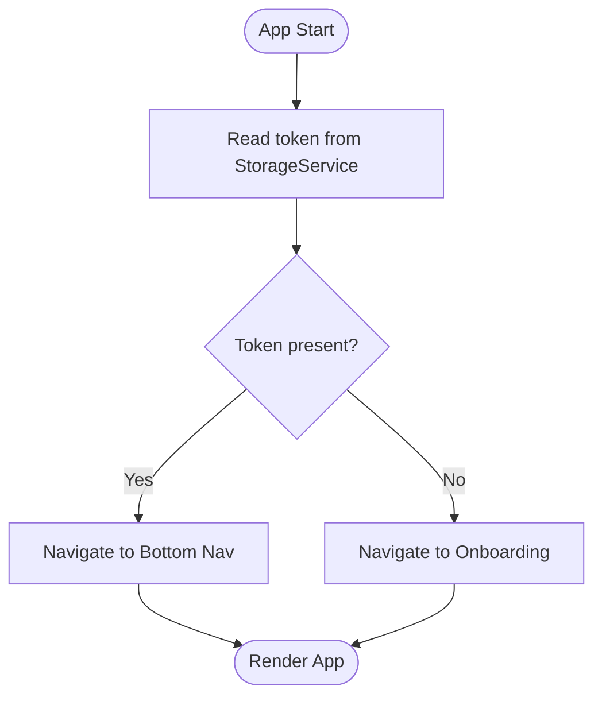
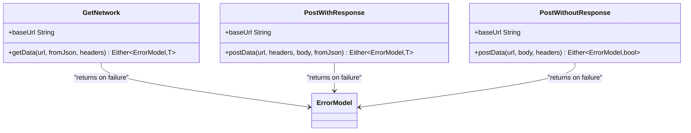
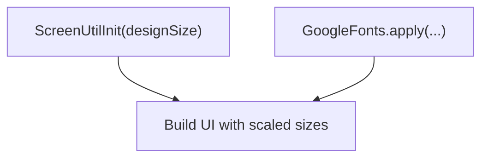
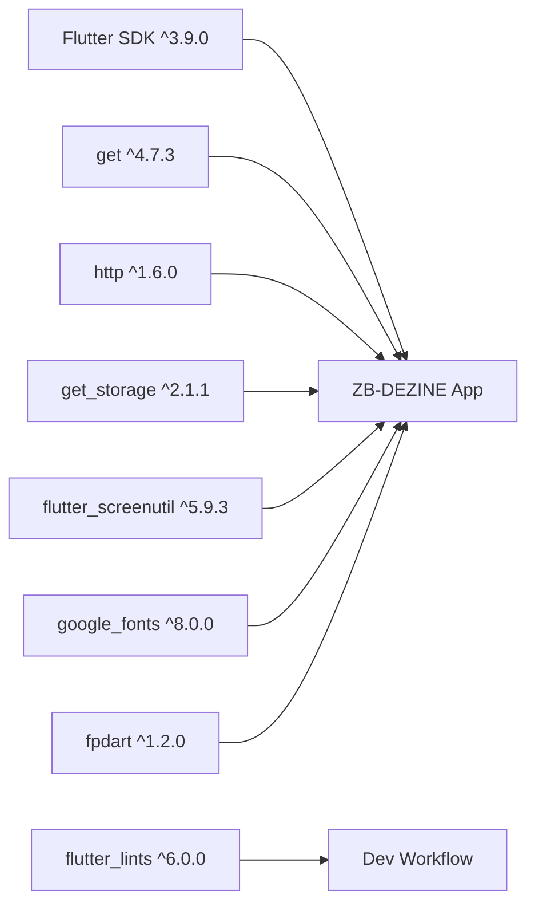

# Technology Stack

<cite>
**Referenced Files in This Document**
- [pubspec.yaml](file://pubspec.yaml)
- [analysis_options.yaml](file://analysis_options.yaml)
- [README.md](file://README.md)
- [lib/main.dart](file://lib/main.dart)
- [lib/core/di/dependency_injection.dart](file://lib/core/di/dependency_injection.dart)
- [lib/core/theme/app_theme.dart](file://lib/core/theme/app_theme.dart)
- [lib/core/theme/theme_controller.dart](file://lib/core/theme/theme_controller.dart)
- [lib/core/routes/app_routes.dart](file://lib/core/routes/app_routes.dart)
- [lib/core/data/local/storage_service.dart](file://lib/core/data/local/storage_service.dart)
- [lib/core/data/networks/get_network.dart](file://lib/core/data/networks/get_network.dart)
- [lib/core/data/networks/post_with_response.dart](file://lib/core/data/networks/post_with_response.dart)
- [lib/core/data/networks/post_without_response.dart](file://lib/core/data/networks/post_without_response.dart)
- [lib/core/data/local/theme_service.dart](file://lib/core/data/local/theme_service.dart)
- [lib/core/constant/colors.dart](file://lib/core/constant/colors.dart)
- [pubspec.lock](file://pubspec.lock)
</cite>

## Table of Contents
1. [Introduction](#introduction)
2. [Project Structure](#project-structure)
3. [Core Components](#core-components)
4. [Architecture Overview](#architecture-overview)
5. [Detailed Component Analysis](#detailed-component-analysis)
6. [Dependency Analysis](#dependency-analysis)
7. [Performance Considerations](#performance-considerations)
8. [Troubleshooting Guide](#troubleshooting-guide)
9. [Conclusion](#conclusion)
10. [Appendices](#appendices)

## Introduction
This document describes the technology stack used in ZB-DEZINE, focusing on Flutter SDK, Dart language, and Material Design 3 (Material You). It also documents key dependencies such as GetX for state management and dependency injection, http for networking, get_storage for local persistence, and utility packages like flutter_screenutil and google_fonts. The development tooling and code quality standards are defined via analysis_options.yaml. Version compatibility, upgrade paths, and rationale for technology choices are provided to guide maintenance and updates.

## Project Structure
The project follows a conventional Flutter layout with feature-based separation under lib/, organized into core, features, and shared folders. The application bootstraps through lib/main.dart, initializes dependency injection, and wires routing, theming, and screen scaling.

**Diagram sources**
- [lib/main.dart:12-47](file://lib/main.dart#L12-L47)
- [lib/core/di/dependency_injection.dart:11-26](file://lib/core/di/dependency_injection.dart#L11-L26)
- [lib/core/routes/app_routes.dart:1-34](file://lib/core/routes/app_routes.dart#L1-L34)
- [lib/core/theme/app_theme.dart:4-22](file://lib/core/theme/app_theme.dart#L4-L22)
- [lib/core/theme/theme_controller.dart:5-22](file://lib/core/theme/theme_controller.dart#L5-L22)
- [lib/core/data/local/storage_service.dart:3-22](file://lib/core/data/local/storage_service.dart#L3-L22)
- [lib/core/data/local/theme_service.dart:3-15](file://lib/core/data/local/theme_service.dart#L3-L15)
- [lib/core/data/networks/get_network.dart:8-40](file://lib/core/data/networks/get_network.dart#L8-L40)
- [lib/core/data/networks/post_with_response.dart:7-44](file://lib/core/data/networks/post_with_response.dart#L7-L44)
- [lib/core/data/networks/post_without_response.dart:9-46](file://lib/core/data/networks/post_without_response.dart#L9-L46)
- [lib/core/constant/colors.dart:3-116](file://lib/core/constant/colors.dart#L3-L116)

**Section sources**
- [lib/main.dart:12-47](file://lib/main.dart#L12-L47)
- [pubspec.yaml:21-80](file://pubspec.yaml#L21-L80)

## Core Components
- Flutter SDK and Dart
  - Flutter SDK constraint: ^3.9.0
  - Dart SDK used by Flutter; aligns with Flutter channel stability
- UI Framework and Design
  - Material Design 3 enabled via uses-material-design: true
  - ThemeData configured with useMaterial3: true and dark theme variants
- State Management and DI
  - GetX (get): dependency injection and reactive state management
  - GetStorage (get_storage): lightweight key-value storage
- Networking
  - http: HTTP client for GET/POST requests
  - fpdart: functional programming primitives (Either for error modeling)
- Utilities
  - flutter_screenutil: responsive UI scaling
  - google_fonts: Google Fonts integration
- Routing
  - GetMaterialApp with named routes and bindings for onboarding/home flows

**Section sources**
- [pubspec.yaml:21-80](file://pubspec.yaml#L21-L80)
- [lib/core/theme/app_theme.dart:4-22](file://lib/core/theme/app_theme.dart#L4-L22)
- [lib/core/di/dependency_injection.dart:11-26](file://lib/core/di/dependency_injection.dart#L11-L26)
- [lib/core/data/networks/get_network.dart:8-40](file://lib/core/data/networks/get_network.dart#L8-L40)
- [lib/core/data/networks/post_with_response.dart:7-44](file://lib/core/data/networks/post_with_response.dart#L7-L44)
- [lib/core/data/networks/post_without_response.dart:9-46](file://lib/core/data/networks/post_without_response.dart#L9-L46)
- [lib/main.dart:26-44](file://lib/main.dart#L26-L44)

## Architecture Overview
The app initializes dependency injection in main(), reads a token from persistent storage, and sets up GetMaterialApp with Material 3 themes. Routing is handled via named routes and bindings. Network calls return Either<ErrorModel, T> for robust error handling, and theme preferences are persisted and reactive.

**Diagram sources**
- [lib/main.dart:12-19](file://lib/main.dart#L12-L19)
- [lib/core/di/dependency_injection.dart:12-25](file://lib/core/di/dependency_injection.dart#L12-L25)
- [lib/core/data/local/storage_service.dart:7-21](file://lib/core/data/local/storage_service.dart#L7-L21)

**Section sources**
- [lib/main.dart:12-47](file://lib/main.dart#L12-L47)
- [lib/core/di/dependency_injection.dart:11-26](file://lib/core/di/dependency_injection.dart#L11-L26)

## Detailed Component Analysis

### Dependency Injection and Local Persistence
- Purpose: Centralized initialization of services and storage, exposing them globally via GetX.
- Key behaviors:
  - Initialize GetStorage
  - Register StorageService, ThemeService, ThemeController, and network clients as singletons
  - Read token from storage to decide initial route and binding

**Diagram sources**
- [lib/core/di/dependency_injection.dart:11-26](file://lib/core/di/dependency_injection.dart#L11-L26)
- [lib/core/data/local/storage_service.dart:3-22](file://lib/core/data/local/storage_service.dart#L3-L22)
- [lib/core/data/local/theme_service.dart:3-15](file://lib/core/data/local/theme_service.dart#L3-L15)
- [lib/core/theme/theme_controller.dart:5-22](file://lib/core/theme/theme_controller.dart#L5-L22)

**Section sources**
- [lib/core/di/dependency_injection.dart:11-26](file://lib/core/di/dependency_injection.dart#L11-L26)
- [lib/core/data/local/storage_service.dart:3-22](file://lib/core/data/local/storage_service.dart#L3-L22)
- [lib/core/data/local/theme_service.dart:3-15](file://lib/core/data/local/theme_service.dart#L3-L15)
- [lib/core/theme/theme_controller.dart:5-22](file://lib/core/theme/theme_controller.dart#L5-L22)

### Theming and Material Design 3
- Uses Material 3 (Material You) with ThemeData.useMaterial3 enabled.
- Provides light and dark themes with color schemes and app bar configuration.
- Reactive theme switching via ThemeController observing a boolean flag stored via ThemeService.

**Diagram sources**
- [lib/core/theme/app_theme.dart:4-22](file://lib/core/theme/app_theme.dart#L4-L22)
- [lib/core/theme/theme_controller.dart:5-22](file://lib/core/theme/theme_controller.dart#L5-L22)
- [lib/core/data/local/theme_service.dart:3-15](file://lib/core/data/local/theme_service.dart#L3-L15)

**Section sources**
- [lib/core/theme/app_theme.dart:4-22](file://lib/core/theme/app_theme.dart#L4-L22)
- [lib/core/theme/theme_controller.dart:5-22](file://lib/core/theme/theme_controller.dart#L5-L22)
- [lib/core/data/local/theme_service.dart:3-15](file://lib/core/data/local/theme_service.dart#L3-L15)

### Routing and Navigation
- Named routes defined centrally for clarity and maintainability.
- Initial route and binding determined by presence of token from storage.

**Diagram sources**
- [lib/core/routes/app_routes.dart:1-34](file://lib/core/routes/app_routes.dart#L1-L34)
- [lib/core/data/local/storage_service.dart:5](file://lib/core/data/local/storage_service.dart#L5)
- [lib/main.dart:36-40](file://lib/main.dart#L36-L40)

**Section sources**
- [lib/core/routes/app_routes.dart:1-34](file://lib/core/routes/app_routes.dart#L1-L34)
- [lib/main.dart:36-40](file://lib/main.dart#L36-L40)

### Networking Layer
- Functional error modeling using Either<ErrorModel, T>.
- Shared base URL via NetworkLinks (referenced constants).
- Reusable GET and POST handlers with consistent status code checks and JSON parsing.

**Diagram sources**
- [lib/core/data/networks/get_network.dart:8-40](file://lib/core/data/networks/get_network.dart#L8-L40)
- [lib/core/data/networks/post_with_response.dart:7-44](file://lib/core/data/networks/post_with_response.dart#L7-L44)
- [lib/core/data/networks/post_without_response.dart:9-46](file://lib/core/data/networks/post_without_response.dart#L9-L46)

**Section sources**
- [lib/core/data/networks/get_network.dart:8-40](file://lib/core/data/networks/get_network.dart#L8-L40)
- [lib/core/data/networks/post_with_response.dart:7-44](file://lib/core/data/networks/post_with_response.dart#L7-L44)
- [lib/core/data/networks/post_without_response.dart:9-46](file://lib/core/data/networks/post_without_response.dart#L9-L46)

### Responsive UI and Typography
- flutter_screenutil: ScreenUtilInit configured with a design size to scale UI elements across devices.
- google_fonts: Integrated for typography consistency.

**Diagram sources**
- [lib/main.dart:26-28](file://lib/main.dart#L26-L28)

**Section sources**
- [lib/main.dart:26-28](file://lib/main.dart#L26-L28)

## Dependency Analysis
- Core runtime dependencies (selected):
  - get: ^4.7.3 (GetX DI/state)
  - http: ^1.6.0 (HTTP client)
  - get_storage: ^2.1.1 (local storage)
  - flutter_screenutil: ^5.9.3 (responsive UI)
  - google_fonts: ^8.0.0 (typography)
  - fpdart: ^1.2.0 (functional primitives)
- Dev dependencies:
  - flutter_lints: ^6.0.0 (recommended lints)
- Environment:
  - Flutter SDK: ^3.9.0
  - Material Design: enabled via uses-material-design: true

**Diagram sources**
- [pubspec.yaml:30-70](file://pubspec.yaml#L30-L70)
- [pubspec.lock:347-386](file://pubspec.lock#L347-L386)

**Section sources**
- [pubspec.yaml:30-70](file://pubspec.yaml#L30-L70)
- [pubspec.lock:347-386](file://pubspec.lock#L347-L386)

## Performance Considerations
- Use Material 3 with appropriate color schemes to reduce layout thrashing during theme switches.
- Prefer lightweight storage via get_storage for small keys (token, theme) to minimize IO overhead.
- Network calls should reuse HttpClient instances and handle timeouts; consider caching for repeated GET requests.
- Keep widget trees shallow and leverage reactive state (GetX) to avoid unnecessary rebuilds.
- Use flutter_screenutil to prevent expensive per-pixel calculations by scaling from a fixed design size.

## Troubleshooting Guide
- Dependency resolution failures:
  - Run flutter pub get after updating pubspec.yaml.
  - Use flutter pub outdated to inspect available upgrades.
- Lint violations:
  - analysis_options.yaml includes flutter_lints/flutter.yaml; customize rules in analysis_options.yaml as needed.
- Theme not persisting:
  - Verify ThemeService writes to storage and ThemeController reads the value on initialization.
- Network errors:
  - Inspect Either error handling paths in network classes; ensure proper JSON parsing and status code handling.
- Responsive UI inconsistencies:
  - Confirm ScreenUtilInit design size matches assets and mockups.

**Section sources**
- [analysis_options.yaml:8-29](file://analysis_options.yaml#L8-L29)
- [lib/core/data/local/theme_service.dart:7-14](file://lib/core/data/local/theme_service.dart#L7-L14)
- [lib/core/theme/theme_controller.dart:9-13](file://lib/core/theme/theme_controller.dart#L9-L13)
- [lib/core/data/networks/get_network.dart:14-39](file://lib/core/data/networks/get_network.dart#L14-L39)
- [lib/core/data/networks/post_with_response.dart:14-43](file://lib/core/data/networks/post_with_response.dart#L14-L43)
- [lib/core/data/networks/post_without_response.dart:16-45](file://lib/core/data/networks/post_without_response.dart#L16-L45)
- [lib/main.dart:26-28](file://lib/main.dart#L26-L28)

## Conclusion
ZB-DEZINE leverages Flutter SDK 3.9.0 with Dart, Material Design 3, and a pragmatic set of packages for state management, persistence, networking, and UI utilities. The architecture emphasizes centralized dependency injection, reactive theming, and functional error modeling in networking. Adhering to the established patterns and code quality standards will facilitate maintainability and smooth upgrades.

## Appendices

### Version Compatibility and Upgrade Paths
- Flutter SDK: ^3.9.0
  - Align Dart SDK with Flutter’s pinned Dart version; update Flutter SDK first, then run flutter pub upgrade.
- GetX (get): ^4.7.3
  - Check release notes for breaking changes; prefer incremental updates and test DI and state flows.
- http: ^1.6.0
  - No major version changes anticipated; keep aligned with Dart ecosystem.
- get_storage: ^2.1.1
  - Lightweight; verify migration notes if upgrading major versions.
- flutter_screenutil: ^5.9.3
  - Major version increments may change APIs; test responsive layouts after updates.
- google_fonts: ^8.0.0
  - Major version updates may require font loading adjustments; validate typography rendering.
- fpdart: ^1.2.0
  - Functional programming utilities; review Either usage patterns if upgrading.

**Section sources**
- [pubspec.yaml:21-46](file://pubspec.yaml#L21-L46)
- [pubspec.lock:347-386](file://pubspec.lock#L347-L386)

### Development Tools and Code Quality Standards
- IDE configuration:
  - Flutter and Dart plugins provide integrated linting and hot reload.
- Code quality:
  - analysis_options.yaml includes flutter_lints/flutter.yaml; customize rules in analysis_options.yaml.
  - Use single quotes or double quotes consistently as configured.

**Section sources**
- [analysis_options.yaml:8-29](file://analysis_options.yaml#L8-L29)
- [README.md:5-16](file://README.md#L5-L16)