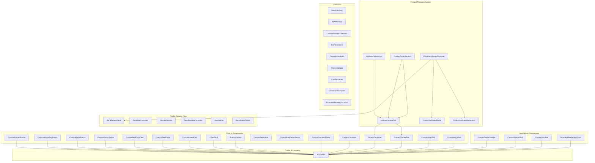
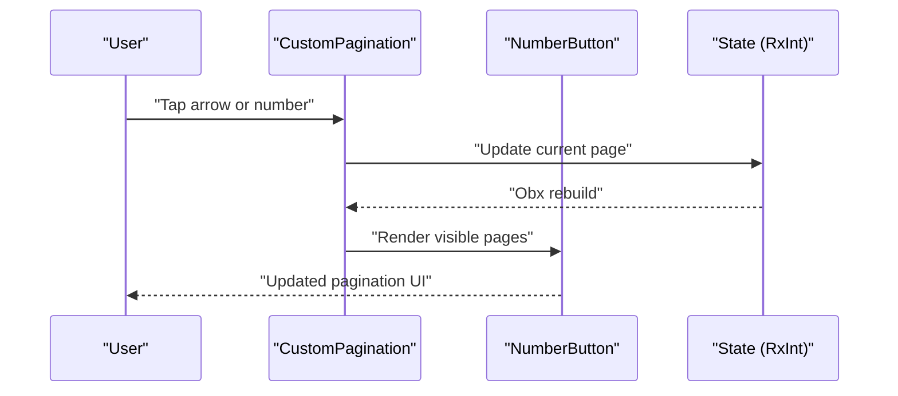
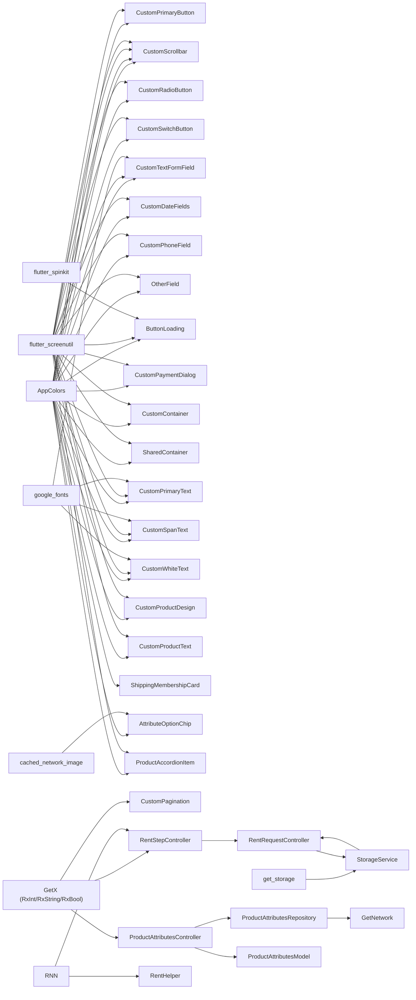

# Shared Components and Utilities

<cite>
**Referenced Files in This Document**
- [main.dart](file://lib/main.dart)
- [pubspec.yaml](file://pubspec.yaml)
- [colors.dart](file://lib/core/constant/colors.dart)
- [custom_primary_button.dart](file://lib/shared/widgets/custom_button/custom_primary_button.dart)
- [custom_secondary_button.dart](file://lib/shared/widgets/custom_button/custom_secondary_button.dart)
- [custom_radio_button.dart](file://lib/shared/widgets/custom_button/custom_radio_button.dart)
- [custom_switch_button.dart](file://lib/shared/widgets/custom_button/custom_switch_button.dart)
- [custom_text_form_field.dart](file://lib/shared/widgets/custom_form_field/custom_text_form_field.dart)
- [custom_date_fields.dart](file://lib/shared/widgets/custom_form_field/custom_date_fields.dart)
- [custom_phone_field.dart](file://lib/shared/widgets/custom_form_field/custom_phone_field.dart)
- [other_field.dart](file://lib/shared/widgets/custom_form_field/other_field.dart)
- [button_loading.dart](file://lib/shared/widgets/custom_loadings/button_loading.dart)
- [custom_pagination.dart](file://lib/shared/widgets/custom_pagination/custom_pagination.dart)
- [custom_pagination_button.dart](file://lib/shared/widgets/custom_pagination/custom_pagination_button.dart)
- [custom_pagination_dot.dart](file://lib/shared/widgets/custom_pagination/custom_pagination_dot.dart)
- [custom_pagination_number.dart](file://lib/shared/widgets/custom_pagination/custom_pagination_number.dart)
- [custom_payment_dialog.dart](file://lib/shared/widgets/custom_dialog/custom_payment_dialog.dart)
- [custom_payment_dialog_method.dart](file://lib/shared/widgets/custom_dialog/custom_payment_dialog_method.dart)
- [custom_payment_success_dialog.dart](file://lib/shared/widgets/custom_dialog/custom_payment_success_dialog.dart)
- [custom_rating_dialog.dart](file://lib/shared/widgets/custom_dialog/custom_rating_dialog.dart)
- [custom_reject_dialog.dart](file://lib/shared/widgets/custom_dialog/custom_reject_dialog.dart)
- [custom_appbar.dart](file://lib/shared/widgets/custom_appbar.dart)
- [custom_banner.dart](file://lib/shared/widgets/custom_banner.dart)
- [custom_check_box.dart](file://lib/shared/widgets/custom_check_box.dart)
- [custom_container.dart](file://lib/shared/widgets/custom_container.dart)
- [custom_divider.dart](file://lib/shared/widgets/custom_divider.dart)
- [custom_product_design.dart](file://lib/shared/widgets/custom_product_design.dart)
- [custom_product_text.dart](file://lib/shared/widgets/custom_product_text.dart)
- [custom_scrollbar.dart](file://lib/shared/widgets/custom_scrollbar.dart)
- [shipping_membership_card.dart](file://lib/shared/widgets/shipping_membership_card.dart)
- [shared_container.dart](file://lib/shared/widgets/shared_container.dart)
- [custom_primary_text.dart](file://lib/shared/widgets/custom_text/custom_primary_text.dart)
- [custom_span_text.dart](file://lib/shared/widgets/custom_text/custom_span_text.dart)
- [custom_white_text.dart](file://lib/shared/widgets/custom_text/custom_white_text.dart)
- [attribute_option_chip.dart](file://lib/features/product_details.dart/widgets/product_furniture_customized_widgets/attribute_option_chip.dart)
- [attribute_options_list.dart](file://lib/features/product_details.dart/widgets/product_furniture_customized_widgets/attribute_options_list.dart)
- [product_accordion_item.dart](file://lib/features/product_details.dart/widgets/product_furniture_customized_widgets/product_accordion_item.dart)
- [products_attributes_controller.dart](file://lib/features/product_details.dart/controller/products_attributes_controller.dart)
- [product_attributes_model.dart](file://lib/features/product_details.dart/models/product_attributes_model.dart)
- [product_attributes_repo.dart](file://lib/features/product_details.dart/repositories/product_attributes_repo.dart)
- [email_validator.dart](file://lib/shared/extensions/validators/email_validator.dart)
- [abn_validator.dart](file://lib/shared/extensions/validators/abn_validator.dart)
- [confirm_password_validator.dart](file://lib/shared/extensions/validators/confirm_password_validator.dart)
- [name_validator.dart](file://lib/shared/extensions/validators/name_validator.dart)
- [password_validator.dart](file://lib/shared/extensions/validators/password_validator.dart)
- [phone_validator.dart](file://lib/shared/extensions/validators/phone_validator.dart)
- [date_formatter.dart](file://lib/shared/extensions/formatters/date_formatter.dart)
- [dimension_formatter.dart](file://lib/shared/extensions/formatters/dimension_formatter.dart)
- [estimate_delivery_extractor.dart](file://lib/shared/extensions/extractors/estimate_delivery_extractor.dart)
- [rent_request_next.dart](file://lib/features/rent_request/widgets/rent_request_view_widgets/rent_request_next.dart)
- [rent_step_controller.dart](file://lib/features/rent_request/controllers/rent_step_controller.dart)
- [storage_service.dart](file://lib/core/data/local/storage_service.dart)
- [rent_request_controller.dart](file://lib/features/rent_request/controllers/rent_request_controller.dart)
- [step_zero_repo.dart](file://lib/features/rent_request/repositories/step_zero_repo.dart)
- [rent_helper.dart](file://lib/features/rent_request/widgets/rent_helper.dart)
- [rent_submit_dialog.dart](file://lib/features/rent_request/widgets/rent_submit_dialog.dart)
</cite>

## Update Summary
**Changes Made**
- Added documentation for four new reusable UI components: CustomProductDesign, CustomProductText, CustomScrollbar, and ShippingMembershipCard
- Integrated these components into the existing component architecture with theme-aware styling
- Enhanced product display and shopping experience with specialized components for product design visualization and membership benefits
- Added comprehensive dependency analysis for the new UI components
- Updated component composition patterns to include these new specialized components

## Table of Contents
1. [Introduction](#introduction)
2. [Project Structure](#project-structure)
3. [Core Components](#core-components)
4. [Architecture Overview](#architecture-overview)
5. [Detailed Component Analysis](#detailed-component-analysis)
6. [Product Attributes System](#product-attributes-system)
7. [New Specialized Components](#new-specialized-components)
8. [Dependency Analysis](#dependency-analysis)
9. [Performance Considerations](#performance-considerations)
10. [Troubleshooting Guide](#troubleshooting-guide)
11. [Conclusion](#conclusion)
12. [Appendices](#appendices)

## Introduction
This document describes the shared components and utility systems in ZB-DEZINE. It focuses on reusable UI components such as custom buttons, form fields, dialogs, loading indicators, pagination, and specialized components for product display and membership benefits. It also covers validation and formatting utilities, helper extensions, and extension methods. The guide explains component architecture, prop interfaces, event handling, customization options, composition patterns, accessibility considerations, responsive design, and guidelines for extending existing components and building new shared utilities.

**Updated** Enhanced with comprehensive documentation for four new specialized UI components: CustomProductDesign for product visualization, CustomProductText for product information display, CustomScrollbar for enhanced scrolling experience, and ShippingMembershipCard for membership promotion. These components significantly expand the application's capability to showcase products and communicate membership benefits.

## Project Structure
The shared components live under the shared directory, organized by feature families:
- widgets/custom_button: Primary and secondary buttons with theming and typography.
- widgets/custom_form_field: Reusable form fields with extensive customization.
- widgets/custom_loadings: Loading indicators tailored for actions.
- widgets/custom_pagination: Pagination controls with dynamic page rendering.
- widgets/custom_dialog: Payment and feedback dialogs.
- widgets/custom_text: Primary text component with theme-aware typography.
- widgets/custom_product_design: Product visualization component.
- widgets/custom_product_text: Product information display component.
- widgets/custom_scrollbar: Enhanced scrollbar component.
- widgets/shipping_membership_card: Membership promotion component.
- features/product_details: Product customization system with attributes and options.
- features/rent_request: Complete rental request flow with step navigation and async operations.
- extensions/validators: Validation helpers for common inputs.
- extensions/formatters: Formatting helpers for dates and relative time.
- extensions/extractors: Domain-specific extractors for order-related data.



**Diagram sources**
- [custom_primary_button.dart:1-74](file://lib/shared/widgets/custom_button/custom_primary_button.dart#L1-L74)
- [custom_secondary_button.dart:1-88](file://lib/shared/widgets/custom_button/custom_secondary_button.dart#L1-L88)
- [custom_radio_button.dart:1-60](file://lib/shared/widgets/custom_button/custom_radio_button.dart#L1-L60)
- [custom_switch_button.dart:1-60](file://lib/shared/widgets/custom_button/custom_switch_button.dart#L1-L60)
- [custom_text_form_field.dart:1-191](file://lib/shared/widgets/custom_form_field/custom_text_form_field.dart#L1-L191)
- [custom_date_fields.dart:1-120](file://lib/shared/widgets/custom_form_field/custom_date_fields.dart#L1-L120)
- [custom_phone_field.dart:1-120](file://lib/shared/widgets/custom_form_field/custom_phone_field.dart#L1-L120)
- [other_field.dart:1-120](file://lib/shared/widgets/custom_form_field/other_field.dart#L1-L120)
- [button_loading.dart:1-36](file://lib/shared/widgets/custom_loadings/button_loading.dart#L1-L36)
- [custom_pagination.dart:1-87](file://lib/shared/widgets/custom_pagination/custom_pagination.dart#L1-L87)
- [custom_pagination_button.dart:1-60](file://lib/shared/widgets/custom_pagination/custom_pagination_button.dart#L1-L60)
- [custom_payment_dialog.dart:1-94](file://lib/shared/widgets/custom_dialog/custom_payment_dialog.dart#L1-L94)
- [custom_container.dart:1-49](file://lib/shared/widgets/custom_container.dart#L1-L49)
- [shared_container.dart:1-57](file://lib/shared/widgets/shared_container.dart#L1-L57)
- [custom_primary_text.dart:1-43](file://lib/shared/widgets/custom_text/custom_primary_text.dart#L1-L43)
- [custom_span_text.dart:1-43](file://lib/shared/widgets/custom_text/custom_span_text.dart#L1-L43)
- [custom_white_text.dart:1-43](file://lib/shared/widgets/custom_text/custom_white_text.dart#L1-L43)
- [custom_product_design.dart:1-104](file://lib/shared/widgets/custom_product_design.dart#L1-L104)
- [custom_product_text.dart:1-90](file://lib/shared/widgets/custom_product_text.dart#L1-L90)
- [custom_scrollbar.dart:1-30](file://lib/shared/widgets/custom_scrollbar.dart#L1-L30)
- [shipping_membership_card.dart:1-82](file://lib/shared/widgets/shipping_membership_card.dart#L1-L82)
- [attribute_option_chip.dart:1-73](file://lib/features/product_details.dart/widgets/product_furniture_customized_widgets/attribute_option_chip.dart#L1-L73)
- [attribute_options_list.dart:1-33](file://lib/features/product_details.dart/widgets/product_furniture_customized_widgets/attribute_options_list.dart#L1-L33)
- [product_accordion_item.dart:1-123](file://lib/features/product_details.dart/widgets/product_furniture_customized_widgets/product_accordion_item.dart#L1-L123)
- [products_attributes_controller.dart:1-41](file://lib/features/product_details.dart/controller/products_attributes_controller.dart#L1-L41)
- [product_attributes_model.dart:1-101](file://lib/features/product_details.dart/models/product_attributes_model.dart#L1-L101)
- [product_attributes_repo.dart:1-22](file://lib/features/product_details.dart/repositories/product_attributes_repo.dart#L1-L22)
- [email_validator.dart:1-14](file://lib/shared/extensions/validators/email_validator.dart#L1-L14)
- [abn_validator.dart:1-14](file://lib/shared/extensions/validators/abn_validator.dart#L1-L14)
- [confirm_password_validator.dart:1-14](file://lib/shared/extensions/validators/confirm_password_validator.dart#L1-L14)
- [name_validator.dart:1-14](file://lib/shared/extensions/validators/name_validator.dart#L1-L14)
- [password_validator.dart:1-14](file://lib/shared/extensions/validators/password_validator.dart#L1-L14)
- [phone_validator.dart:1-14](file://lib/shared/extensions/validators/phone_validator.dart#L1-L14)
- [date_formatter.dart:1-54](file://lib/shared/extensions/formatters/date_formatter.dart#L1-L54)
- [dimension_formatter.dart:1-54](file://lib/shared/extensions/formatters/dimension_formatter.dart#L1-L54)
- [estimate_delivery_extractor.dart:1-39](file://lib/shared/extensions/extractors/estimate_delivery_extractor.dart#L1-L39)
- [colors.dart:1-117](file://lib/core/constant/colors.dart#L1-L117)
- [rent_request_next.dart:1-61](file://lib/features/rent_request/widgets/rent_request_view_widgets/rent_request_next.dart#L1-L61)
- [rent_step_controller.dart:1-96](file://lib/features/rent_request/controllers/rent_step_controller.dart#L1-L96)
- [storage_service.dart:1-24](file://lib/core/data/local/storage_service.dart#L1-L24)
- [rent_request_controller.dart:1-68](file://lib/features/rent_request/controllers/rent_request_controller.dart#L1-L68)
- [rent_helper.dart:1-41](file://lib/features/rent_request/widgets/rent_helper.dart#L1-L41)
- [rent_submit_dialog.dart:1-66](file://lib/features/rent_request/widgets/rent_submit_dialog.dart#L1-L66)

**Section sources**
- [main.dart:1-47](file://lib/main.dart#L1-L47)
- [pubspec.yaml:30-66](file://pubspec.yaml#L30-L66)

## Core Components
This section summarizes the reusable UI components and their primary responsibilities.

- CustomPrimaryButton
  - Purpose: Prominent call-to-action with theming and typography.
  - Key props: size, colors, border radius, padding, shadow, child widget, font weight.
  - Behavior: Uses theme brightness to select appropriate colors; supports custom decoration or defaults to brand colors.

- CustomSecondaryButton
  - Purpose: Secondary actions with icon and label.
  - Key props: icon asset, sizes, colors, border radius, padding, shadow.
  - Behavior: Renders icon and text in a row; applies theme-aware tinting.

- CustomRadioButton
  - Purpose: Radio button selection with custom styling.
  - Key props: value, groupValue, onChanged, activeColor, inactiveColor, fillColor.
  - Behavior: Theme-aware radio button with custom visual styling.

- CustomSwitchButton
  - Purpose: Toggle switch with custom styling.
  - Key props: isOn, onChanged, activeColor, inactiveColor, thumbColor.
  - Behavior: Smooth animated toggle with theme-aware colors.

- CustomTextFormField
  - Purpose: Consistent, theme-aware form field with extensive customization.
  - Key props: controller, hints, label, prefix/suffix icons, obscure text, keyboard type, validation, styling, borders, fill color.
  - Behavior: Applies theme-aware colors and typography; integrates with Google Fonts.

- CustomDateFields
  - Purpose: Date input fields with calendar picker integration.
  - Key props: controller, label, validator, initialDate, firstDate, lastDate.
  - Behavior: Date selection with validation and theme-aware styling.

- CustomPhoneField
  - Purpose: Phone number input with country code support.
  - Key props: controller, label, validator, initialCountryCode.
  - Behavior: Phone number formatting and validation.

- OtherField
  - Purpose: Generic form field with flexible configuration.
  - Key props: controller, label, validator, keyboardType, inputFormatters.
  - Behavior: Customizable form field for various input types.

- ButtonLoading
  - Purpose: Loading indicator for actions.
  - Key props: padding, color, size.
  - Behavior: Centers a spinner with theme-aware color.

- CustomPagination
  - Purpose: Page navigation with dynamic page range and navigation arrows.
  - Key props: current page (Rx), total pages.
  - Behavior: Renders numbered pages and ellipses; updates reactive current page.

- CustomPaginationButton
  - Purpose: Individual pagination control button.
  - Key props: onPressed, isSelected, child.
  - Behavior: Theme-aware button with selection state styling.

- CustomPaginationDot
  - Purpose: Dot indicator for pagination.
  - Key props: isActive.
  - Behavior: Small dot indicator with theme-aware colors.

- CustomPaginationNumber
  - Purpose: Numbered pagination button.
  - Key props: number, onPressed, isSelected.
  - Behavior: Numeric button with selection highlighting.

- CustomPaymentDialog
  - Purpose: Payment selection dialog with amount and method list.
  - Key props: icon, title, subtitle, button text, card list, selected card (Rx), selection callback.
  - Behavior: Dialog with shadow and theme-aware background; composes payment method component.

- CustomContainer
  - Purpose: Scaffold wrapper with customizable layout and gradients.
  - Key props: child, gradient, appbar, padding, margin, drawer, bottomNav.
  - Behavior: Full-screen scaffold with theme-aware gradient backgrounds.

- SharedContainer
  - Purpose: Universal container for consistent styling and layout.
  - Key props: child, padding, margin, radius, border, color, boxShadow, height, width, gradient, image.
  - Behavior: Theme-aware container with flexible styling options and responsive sizing.

- CustomPrimaryText
  - Purpose: Primary text component with Google Fonts integration and theme-aware colors.
  - Key props: text, fontSize, fontWeight, color, textAlign, textOverflow, shadow, decoration, maxLine.
  - Behavior: Responsive typography with Montserrat font family and automatic theme adaptation.

- CustomSpanText
  - Purpose: Text component with styled spans and custom styling.
  - Key props: text, spans, fontSize, fontWeight, color, textAlign.
  - Behavior: Rich text with customizable spans and theme-aware colors.

- CustomWhiteText
  - Purpose: White text component for dark theme contexts.
  - Key props: text, fontSize, fontWeight, textAlign, textOverflow, maxLine.
  - Behavior: High contrast white text for dark theme backgrounds.

**Updated** Added four new specialized components for enhanced product display and user experience.

- CustomProductDesign
  - Purpose: Product visualization component with favorite functionality and promotional badges.
  - Key props: onFavorite (VoidCallback), icon (String?), color (Color?).
  - Behavior: Card-style product display with overlay favorite button, promotional badge, and tap-to-view functionality.

- CustomProductText
  - Purpose: Product information display with color swatches and pricing.
  - Key props: color (List<Color>), title (String), price (String).
  - Behavior: Product title with color circle swatches, plus count for extra colors, and price display.

- CustomScrollbar
  - Purpose: Enhanced scrollbar with theme-aware styling and smooth animations.
  - Key props: scrollController (ScrollController), child (Widget).
  - Behavior: Custom raw scrollbar with gradient track and animated thumb visibility.

- ShippingMembershipCard
  - Purpose: Membership promotion card with gradient background and call-to-action.
  - Key props: None (const).
  - Behavior: Promotional card highlighting free shipping benefits and membership pricing.

**Section sources**
- [custom_primary_button.dart:6-74](file://lib/shared/widgets/custom_button/custom_primary_button.dart#L6-L74)
- [custom_secondary_button.dart:6-88](file://lib/shared/widgets/custom_button/custom_secondary_button.dart#L6-L88)
- [custom_radio_button.dart:6-60](file://lib/shared/widgets/custom_button/custom_radio_button.dart#L6-L60)
- [custom_switch_button.dart:6-60](file://lib/shared/widgets/custom_button/custom_switch_button.dart#L6-L60)
- [custom_text_form_field.dart:7-191](file://lib/shared/widgets/custom_form_field/custom_text_form_field.dart#L7-L191)
- [custom_date_fields.dart:6-120](file://lib/shared/widgets/custom_form_field/custom_date_fields.dart#L6-L120)
- [custom_phone_field.dart:6-120](file://lib/shared/widgets/custom_form_field/custom_phone_field.dart#L6-L120)
- [other_field.dart:6-120](file://lib/shared/widgets/custom_form_field/other_field.dart#L6-L120)
- [button_loading.dart:6-36](file://lib/shared/widgets/custom_loadings/button_loading.dart#L6-L36)
- [custom_pagination.dart:7-87](file://lib/shared/widgets/custom_pagination/custom_pagination.dart#L7-L87)
- [custom_pagination_button.dart:6-60](file://lib/shared/widgets/custom_pagination/custom_pagination_button.dart#L6-L60)
- [custom_pagination_dot.dart:6-60](file://lib/shared/widgets/custom_pagination/custom_pagination_dot.dart#L6-L60)
- [custom_pagination_number.dart:6-60](file://lib/shared/widgets/custom_pagination/custom_pagination_number.dart#L6-L60)
- [custom_payment_dialog.dart:9-94](file://lib/shared/widgets/custom_dialog/custom_payment_dialog.dart#L9-L94)
- [custom_container.dart:5-49](file://lib/shared/widgets/custom_container.dart#L5-L49)
- [shared_container.dart:5-57](file://lib/shared/widgets/shared_container.dart#L5-L57)
- [custom_primary_text.dart:8-43](file://lib/shared/widgets/custom_text/custom_primary_text.dart#L8-L43)
- [custom_span_text.dart:8-43](file://lib/shared/widgets/custom_text/custom_span_text.dart#L8-L43)
- [custom_white_text.dart:8-43](file://lib/shared/widgets/custom_text/custom_white_text.dart#L8-L43)
- [custom_product_design.dart:11-104](file://lib/shared/widgets/custom_product_design.dart#L11-L104)
- [custom_product_text.dart:7-90](file://lib/shared/widgets/custom_product_text.dart#L7-L90)
- [custom_scrollbar.dart:5-30](file://lib/shared/widgets/custom_scrollbar.dart#L5-L30)
- [shipping_membership_card.dart:7-82](file://lib/shared/widgets/shipping_membership_card.dart#L7-L82)

## Architecture Overview
The shared components follow a consistent pattern:
- Props-first design: All customization is exposed via constructor parameters.
- Theme-aware rendering: Components check brightness and apply appropriate colors from AppColors.
- Composition: Components often wrap smaller shared text widgets or reuse common styling logic.
- Reactive updates: Pagination uses GetX reactive integers for current page.
- Async operation support: Enhanced with loading states and error handling for network operations.

**Updated** The architecture now includes four new specialized components that extend the system's capabilities for product display, user interaction, and membership promotion. These components maintain consistency with the existing theme-aware approach while adding new functionality for enhanced user experience.

```mermaid
classDiagram
class CustomPrimaryButton {
+double? height
+double? width
+String text
+VoidCallback onPressed
+Color? backgroundColor
+Color? textColor
+BorderRadius? borderRadius
+BoxDecoration? boxDecoration
+Widget? child
+FontWeight? fontWeight
+EdgeInsets? padding
+BoxBorder? border
+BoxShadow[]? boxShadow
}
class CustomSecondaryButton {
+double? height
+double? width
+double? iconHeight
+double? iconWidth
+String text
+String icon
+VoidCallback onPressed
+Color? backgroundColor
+Color? textColor
+Color? iconColor
+double? radius
+BoxDecoration? boxDecoration
+Widget? child
+FontWeight? fontWeight
+EdgeInsets? padding
+BoxBorder? border
+BoxShadow[]? boxShadow
}
class CustomRadioButton {
+bool value
+bool groupValue
+ValueChanged~bool~ onChanged
+Color? activeColor
+Color? inactiveColor
+Color? fillColor
}
class CustomSwitchButton {
+bool isOn
+ValueChanged~bool~ onChanged
+Color? activeColor
+Color? inactiveColor
+Color? thumbColor
}
class CustomTextFormField {
+TextEditingController controller
+String? hintText
+Widget? hintTextWidget
+String? labelText
+Widget? labelTextWidget
+bool? obscureText
+TextInputType? keyboardType
+Color? textColor
+Color? cursorColor
+Color? labelColor
+double? fontSize
+double? labelFontSize
+FontWeight? fontWeight
+String? Function(String?)? validator
+ValueChanged~String~? onChanged
+bool? readOnly
+EdgeInsetsGeometry? padding
+EdgeInsetsGeometry? margin
+AutovalidateMode? validation
+bool? isFilled
+BorderSide? border
+FloatingLabelBehavior? floatingLabelBehavior
+Color? fillColor
+int? maxLength
+int? maxLines
+TextDirection? hintDirection
+bool? isAlignLabelWithHint
+double? fontHeight
+double? cursorHeight
+bool? isDense
+FocusNode? focusNode
+double? borderRadius
+double? borderWidth
+Color? borderColor
+FontWeight? labelFontWeight
}
class CustomDateFields {
+TextEditingController controller
+String label
+String Function(String)? validator
+DateTime? initialDate
+DateTime? firstDate
+DateTime? lastDate
}
class CustomPhoneField {
+TextEditingController controller
+String label
+String Function(String)? validator
+String initialCountryCode
}
class OtherField {
+TextEditingController controller
+String label
+String Function(String)? validator
+TextInputType? keyboardType
+TextInputFormatter[]? inputFormatters
}
class ButtonLoading {
+double? verticalPadding
+double? horizontalPadding
+Color? loadingColor
+double? loadingSize
}
class CustomPagination {
+RxInt currentPage
+int totalPage
}
class CustomPaginationButton {
+VoidCallback onPressed
+bool isSelected
+Widget child
}
class CustomPaginationDot {
+bool isActive
}
class CustomPaginationNumber {
+int number
+VoidCallback onPressed
+bool isSelected
}
class CustomPaymentDialog {
+String? icon
+String? title
+String? sub
+String? buttonText
+String[] cardList
+RxString selectedCard
+void Function(String?) onSelect
}
class CustomContainer {
+Widget child
+Gradient? gradient
+PreferredSizeWidget? appbar
+EdgeInsets? padding
+EdgeInsets? margin
+Widget? drawer
+Widget? bottomNav
}
class SharedContainer {
+Widget? child
+EdgeInsets? padding
+EdgeInsets? margin
+double? radius
+BoxBorder? border
+Color? color
+BoxShadow[]? boxShadow
+double? height
+double? width
+LinearGradient? gradient
+DecorationImage? image
}
class CustomPrimaryText {
+String text
+double? fontSize
+FontWeight? fontWeight
+Color? color
+TextAlign? textAlign
+TextOverflow? textOverflow
+Shadow[]? shadow
+TextDecoration? decoration
+int? maxLine
}
class CustomSpanText {
+String text
+TextSpan[] spans
+double? fontSize
+FontWeight? fontWeight
+Color? color
+TextAlign? textAlign
}
class CustomWhiteText {
+String text
+double? fontSize
+FontWeight? fontWeight
+TextAlign? textAlign
+TextOverflow? textOverflow
+int? maxLine
}
class CustomProductDesign {
+VoidCallback onFavorite
+String? icon
+Color? color
+build() Widget
}
class CustomProductText {
+Color[] color
+String title
+String price
+build() Widget
}
class CustomScrollbar {
+ScrollController scrollController
+Widget child
+build() Widget
}
class ShippingMembershipCard {
+build() Widget
}
class AttributeOptionChip {
+int attributeIndex
+int optionIndex
+AttributeOption option
+build() Widget
}
class AttributeOptionsList {
+int attributeIndex
+build() Widget
}
class ProductAccordionItem {
+int index
+build() Widget
}
class ProductAttributesController {
+ProductAttributesRepository productAttributesRepository
+Rxn~ProductAttributesModel~ productsAttributes
+RxBool isLoading
+RxList~bool~ isOpen
+getProductsAttributes() Future~void~
+togglExpand() void
}
class ProductAttributesModel {
+ProductAttribute[] data
}
class ProductAttribute {
+num productAttributeId
+num attributeId
+String name
+AttributeOption[] options
}
class AttributeOption {
+num productAttributeOptionId
+num optionId
+String name
+dynamic image
+String productImage
+num price
+num stock
+bool isDefault
}
class ProductAttributesRepository {
+GetNetwork getNetwork
+execute() Future~Either~
}
CustomPrimaryButton --> AppColors : "uses"
CustomSecondaryButton --> AppColors : "uses"
CustomRadioButton --> AppColors : "uses"
CustomSwitchButton --> AppColors : "uses"
CustomTextFormField --> AppColors : "uses"
CustomDateFields --> AppColors : "uses"
CustomPhoneField --> AppColors : "uses"
OtherField --> AppColors : "uses"
ButtonLoading --> AppColors : "uses"
CustomPaymentDialog --> AppColors : "uses"
CustomContainer --> AppColors : "uses"
CustomProductDesign --> AppColors : "uses"
CustomProductText --> AppColors : "uses"
CustomScrollbar --> AppColors : "uses"
ShippingMembershipCard --> AppColors : "uses"
SharedContainer --> AppColors : "uses"
CustomPrimaryText --> AppColors : "uses"
CustomSpanText --> AppColors : "uses"
CustomWhiteText --> AppColors : "uses"
AttributeOptionChip --> SharedContainer : "uses"
AttributeOptionChip --> CustomPrimaryText : "uses"
AttributeOptionsList --> AttributeOptionChip : "composes"
ProductAccordionItem --> AttributeOptionsList : "composes"
ProductAttributesController --> ProductAttributesRepository : "uses"
ProductAttributesController --> ProductAttributesModel : "manages"
ProductAttributesRepository --> ProductAttributesModel : "fetches"
```



**Diagram sources**
- [custom_primary_button.dart:6-74](file://lib/shared/widgets/custom_button/custom_primary_button.dart#L6-L74)
- [custom_secondary_button.dart:6-88](file://lib/shared/widgets/custom_button/custom_secondary_button.dart#L6-L88)
- [custom_radio_button.dart:6-60](file://lib/shared/widgets/custom_button/custom_radio_button.dart#L6-L60)
- [custom_switch_button.dart:6-60](file://lib/shared/widgets/custom_button/custom_switch_button.dart#L6-L60)
- [custom_text_form_field.dart:7-191](file://lib/shared/widgets/custom_form_field/custom_text_form_field.dart#L7-L191)
- [custom_date_fields.dart:6-120](file://lib/shared/widgets/custom_form_field/custom_date_fields.dart#L6-L120)
- [custom_phone_field.dart:6-120](file://lib/shared/widgets/custom_form_field/custom_phone_field.dart#L6-L120)
- [other_field.dart:6-120](file://lib/shared/widgets/custom_form_field/other_field.dart#L6-L120)
- [button_loading.dart:6-36](file://lib/shared/widgets/custom_loadings/button_loading.dart#L6-L36)
- [custom_pagination.dart:7-87](file://lib/shared/widgets/custom_pagination/custom_pagination.dart#L7-L87)
- [custom_pagination_button.dart:6-60](file://lib/shared/widgets/custom_pagination/custom_pagination_button.dart#L6-L60)
- [custom_pagination_dot.dart:6-60](file://lib/shared/widgets/custom_pagination/custom_pagination_dot.dart#L6-L60)
- [custom_pagination_number.dart:6-60](file://lib/shared/widgets/custom_pagination/custom_pagination_number.dart#L6-L60)
- [custom_payment_dialog.dart:9-94](file://lib/shared/widgets/custom_dialog/custom_payment_dialog.dart#L9-L94)
- [custom_container.dart:5-49](file://lib/shared/widgets/custom_container.dart#L5-L49)
- [shared_container.dart:5-57](file://lib/shared/widgets/shared_container.dart#L5-L57)
- [custom_primary_text.dart:8-43](file://lib/shared/widgets/custom_text/custom_primary_text.dart#L8-L43)
- [custom_span_text.dart:8-43](file://lib/shared/widgets/custom_text/custom_span_text.dart#L8-L43)
- [custom_white_text.dart:8-43](file://lib/shared/widgets/custom_text/custom_white_text.dart#L8-L43)
- [custom_product_design.dart:11-104](file://lib/shared/widgets/custom_product_design.dart#L11-L104)
- [custom_product_text.dart:7-90](file://lib/shared/widgets/custom_product_text.dart#L7-L90)
- [custom_scrollbar.dart:5-30](file://lib/shared/widgets/custom_scrollbar.dart#L5-L30)
- [shipping_membership_card.dart:7-82](file://lib/shared/widgets/shipping_membership_card.dart#L7-L82)
- [attribute_option_chip.dart:9-73](file://lib/features/product_details.dart/widgets/product_furniture_customized_widgets/attribute_option_chip.dart#L9-L73)
- [attribute_options_list.dart:7-33](file://lib/features/product_details.dart/widgets/product_furniture_customized_widgets/attribute_options_list.dart#L7-L33)
- [product_accordion_item.dart:11-123](file://lib/features/product_details.dart/widgets/product_furniture_customized_widgets/product_accordion_item.dart#L11-L123)
- [products_attributes_controller.dart:6-41](file://lib/features/product_details.dart/controller/products_attributes_controller.dart#L6-L41)
- [product_attributes_model.dart:9-101](file://lib/features/product_details.dart/models/product_attributes_model.dart#L9-L101)
- [product_attributes_repo.dart:7-22](file://lib/features/product_details.dart/repositories/product_attributes_repo.dart#L7-L22)
- [colors.dart:3-117](file://lib/core/constant/colors.dart#L3-L117)

## Detailed Component Analysis

### CustomPrimaryButton
- Props interface
  - Size and layout: height, width, padding.
  - Theming: backgroundColor, textColor, borderRadius, border, boxShadow.
  - Typography: fontSize, fontWeight.
  - Interaction: onPressed, child override.
- Event handling
  - Tap gesture triggers onPressed callback.
- Customization
  - Supports custom child widget to render complex layouts inside the button.
  - Falls back to a centered text label using a shared text widget.
- Accessibility and responsiveness
  - Uses screen-aware units for sizing and padding.
  - Respects theme brightness for color selection.

Usage example pattern
- Integrate with a controller's onPressed handler and pass theme-aware colors.

**Section sources**
- [custom_primary_button.dart:6-74](file://lib/shared/widgets/custom_button/custom_primary_button.dart#L6-L74)
- [colors.dart:3-117](file://lib/core/constant/colors.dart#L3-L117)

### CustomSecondaryButton
- Props interface
  - Icon and text: icon asset path, text, iconHeight, iconWidth.
  - Layout and styling: height, width, backgroundColor, textColor, iconColor, radius, padding, border, boxShadow.
- Behavior
  - Composes an icon and text in a centered row.
  - Applies theme-aware tinting to icon and text.
- Accessibility and responsiveness
  - Uses screen-aware units for sizing and spacing.

Usage example pattern
- Use for secondary actions like "Sign in with provider" with an associated icon asset.

**Section sources**
- [custom_secondary_button.dart:6-88](file://lib/shared/widgets/custom_button/custom_secondary_button.dart#L6-L88)
- [colors.dart:3-117](file://lib/core/constant/colors.dart#L3-L117)

### CustomRadioButton
- Props interface
  - Selection state: value, groupValue, onChanged.
  - Visual styling: activeColor, inactiveColor, fillColor.
- Behavior
  - Custom radio button with theme-aware active/inactive states.
  - Smooth transition between states with animated color changes.
- Accessibility and responsiveness
  - Proper focus handling and touch target sizing.

Usage example pattern
- Use for option selection in forms and settings screens.

**Section sources**
- [custom_radio_button.dart:6-60](file://lib/shared/widgets/custom_button/custom_radio_button.dart#L6-L60)
- [colors.dart:3-117](file://lib/core/constant/colors.dart#L3-L117)

### CustomSwitchButton
- Props interface
  - Toggle state: isOn, onChanged.
  - Visual styling: activeColor, inactiveColor, thumbColor.
- Behavior
  - Animated toggle switch with smooth thumb movement.
  - Theme-aware colors for both active and inactive states.
- Accessibility and responsiveness
  - Proper haptic feedback and visual state indication.

Usage example pattern
- Use for enabling/disabling features and preferences.

**Section sources**
- [custom_switch_button.dart:6-60](file://lib/shared/widgets/custom_button/custom_switch_button.dart#L6-L60)
- [colors.dart:3-117](file://lib/core/constant/colors.dart#L3-L117)

### CustomTextFormField
- Props interface
  - Content: controller, maxLines, maxLength, readOnly, onChanged.
  - Hints and labels: hintText, labelText, hintTextWidget, labelTextWidget.
  - Validation: validator, validation mode, errorText.
  - Styling: textColor, fontSize, fontWeight, labelColor, labelFontSize, labelFontWeight.
  - Borders and fills: border, borderRadius, borderWidth, borderColor, isFilled, fillColor, floatingLabelBehavior, isAlignLabelWithHint.
  - Focus and cursor: focusNode, cursorColor, cursorHeight, isDense.
- Behavior
  - Applies theme-aware colors and typography.
  - Integrates with Google Fonts and a consistent label/text widget.
- Accessibility and responsiveness
  - Supports text direction, dense layout, and cursor customization.

Usage example pattern
- Wrap with a form and pass a validator from the extensions module.

**Section sources**
- [custom_text_form_field.dart:7-191](file://lib/shared/widgets/custom_form_field/custom_text_form_field.dart#L7-L191)
- [colors.dart:3-117](file://lib/core/constant/colors.dart#L3-L117)

### CustomDateFields
- Props interface
  - Date selection: controller, label, validator.
  - Date range: initialDate, firstDate, lastDate.
- Behavior
  - Date picker integration with validation.
  - Theme-aware styling with calendar icon.
- Accessibility and responsiveness
  - Proper date format handling and validation feedback.

Usage example pattern
- Use for birth dates, appointment scheduling, and deadline inputs.

**Section sources**
- [custom_date_fields.dart:6-120](file://lib/shared/widgets/custom_form_field/custom_date_fields.dart#L6-L120)
- [colors.dart:3-117](file://lib/core/constant/colors.dart#L3-L117)

### CustomPhoneField
- Props interface
  - Phone input: controller, label, validator.
  - Country code: initialCountryCode.
- Behavior
  - Phone number formatting and validation.
  - Country code detection and formatting.
- Accessibility and responsiveness
  - Proper input masking and validation feedback.

Usage example pattern
- Use for user registration and contact information forms.

**Section sources**
- [custom_phone_field.dart:6-120](file://lib/shared/widgets/custom_form_field/custom_phone_field.dart#L6-L120)
- [colors.dart:3-117](file://lib/core/constant/colors.dart#L3-L117)

### OtherField
- Props interface
  - Generic field: controller, label, validator.
  - Input configuration: keyboardType, inputFormatters.
- Behavior
  - Flexible form field for various input types.
  - Customizable input formatting and validation.
- Accessibility and responsiveness
  - Proper input type handling and validation feedback.

Usage example pattern
- Use for custom input types not covered by other specialized fields.

**Section sources**
- [other_field.dart:6-120](file://lib/shared/widgets/custom_form_field/other_field.dart#L6-L120)
- [colors.dart:3-117](file://lib/core/constant/colors.dart#L3-L117)

### ButtonLoading
- Props interface
  - Spacing: verticalPadding, horizontalPadding.
  - Visual: loadingColor, loadingSize.
- Behavior
  - Renders a spinner with theme-aware color and centering.
- Accessibility and responsiveness
  - Uses screen-aware units for size and padding.

Usage example pattern
- Display during async operations; hide when not busy.

**Section sources**
- [button_loading.dart:6-36](file://lib/shared/widgets/custom_loadings/button_loading.dart#L6-L36)
- [colors.dart:3-117](file://lib/core/constant/colors.dart#L3-L117)

### CustomPagination
- Props interface
  - Reactive: currentPage (RxInt), totalPage (int).
- Behavior
  - Dynamically renders page numbers around the current page.
  - Shows ellipses when not all pages are visible.
  - Provides left/right navigation arrows with disabled states.
- Reactive updates
  - Uses Obx to rebuild when current page changes.



**Diagram sources**
- [custom_pagination.dart:7-87](file://lib/shared/widgets/custom_pagination/custom_pagination.dart#L7-L87)

**Section sources**
- [custom_pagination.dart:7-87](file://lib/shared/widgets/custom_pagination/custom_pagination.dart#L7-L87)

### CustomPaginationButton
- Props interface
  - Interaction: onPressed, isSelected.
  - Content: child widget.
- Behavior
  - Theme-aware button with selection state styling.
  - Visual indication of current page with different styling.

**Section sources**
- [custom_pagination_button.dart:6-60](file://lib/shared/widgets/custom_pagination/custom_pagination_button.dart#L6-L60)

### CustomPaginationDot
- Props interface
  - State: isActive (bool).
- Behavior
  - Small dot indicator showing page position.
  - Theme-aware colors for active and inactive states.

**Section sources**
- [custom_pagination_dot.dart:6-60](file://lib/shared/widgets/custom_pagination/custom_pagination_dot.dart#L6-L60)

### CustomPaginationNumber
- Props interface
  - Navigation: number, onPressed, isSelected.
- Behavior
  - Numeric button with selection highlighting.
  - Theme-aware styling for current page indication.

**Section sources**
- [custom_pagination_number.dart:6-60](file://lib/shared/widgets/custom_pagination/custom_pagination_number.dart#L6-L60)

### CustomPaymentDialog
- Props interface
  - Presentation: icon, title, sub, buttonText.
  - Data: cardList (List<String>), selectedCard (RxString), onSelect (callback).
- Behavior
  - Dialog with theme-aware background and shadow.
  - Displays amount and delegates payment method selection to a composed component.
- Accessibility and responsiveness
  - Full-width dialog with centered content; uses screen-aware units.

Usage example pattern
- Open via Get.dialog and update selected card via the provided callback.

**Section sources**
- [custom_payment_dialog.dart:9-94](file://lib/shared/widgets/custom_dialog/custom_payment_dialog.dart#L9-L94)
- [colors.dart:3-117](file://lib/core/constant/colors.dart#L3-L117)

### CustomContainer
- Props interface
  - Layout: child (Widget), gradient (Gradient?).
  - Scaffold configuration: appbar, drawer, bottomNav.
  - Spacing: padding (EdgeInsets?), margin (EdgeInsets?).
- Behavior
  - Full-screen scaffold wrapper with customizable layout.
  - Theme-aware gradient backgrounds for both light and dark modes.
  - Supports app bar, drawer, and bottom navigation integration.
- Accessibility and responsiveness
  - Full viewport coverage with safe area handling.

Usage example pattern
- Use as a wrapper for complete screen layouts with custom gradients.

**Section sources**
- [custom_container.dart:5-49](file://lib/shared/widgets/custom_container.dart#L5-L49)
- [colors.dart:3-117](file://lib/core/constant/colors.dart#L3-L117)

### SharedContainer
- Props interface
  - Content: child (Widget?).
  - Spacing: padding (EdgeInsets?), margin (EdgeInsets?).
  - Sizing: height (double?), width (double?).
  - Styling: radius (double?), border (BoxBorder?), color (Color?).
  - Effects: boxShadow (List<BoxShadow>?), gradient (LinearGradient?), image (DecorationImage?).
- Behavior
  - Theme-aware container with automatic color selection based on brightness.
  - Flexible layout with responsive sizing using Flutter_ScreenUtil.
  - Supports both solid colors and gradient backgrounds.
- Accessibility and responsiveness
  - Uses screen-aware units for consistent sizing across devices.
  - Respects theme brightness for color adaptation.

Usage example pattern
- Use as a base container for cards, chips, and interactive elements.

**Section sources**
- [shared_container.dart:5-57](file://lib/shared/widgets/shared_container.dart#L5-L57)
- [colors.dart:3-117](file://lib/core/constant/colors.dart#L3-L117)

### CustomPrimaryText
- Props interface
  - Text content: text (String), fontSize (double?), fontWeight (FontWeight?).
  - Styling: color (Color?), textAlign (TextAlign?), textOverflow (TextOverflow?).
  - Effects: shadow (List<Shadow>?), decoration (TextDecoration?), maxLine (int?).
- Behavior
  - Google Fonts integration with Montserrat font family.
  - Automatic theme adaptation based on brightness detection.
  - Responsive typography using Flutter_ScreenUtil scaling.
- Accessibility and responsiveness
  - Supports text overflow handling and maximum line constraints.
  - Automatic color adjustment for light/dark themes.

Usage example pattern
- Use for consistent typography across the application with theme-aware colors.

**Section sources**
- [custom_primary_text.dart:8-43](file://lib/shared/widgets/custom_text/custom_primary_text.dart#L8-L43)
- [colors.dart:3-117](file://lib/core/constant/colors.dart#L3-L117)

### CustomSpanText
- Props interface
  - Text content: text (String), spans (List<TextSpan>).
  - Styling: fontSize (double?), fontWeight (FontWeight?), color (Color?), textAlign (TextAlign?).
- Behavior
  - Rich text with customizable spans and inline styling.
  - Theme-aware color application to text spans.
- Accessibility and responsiveness
  - Proper text scaling and overflow handling.

Usage example pattern
- Use for formatted text with mixed styling and colors.

**Section sources**
- [custom_span_text.dart:8-43](file://lib/shared/widgets/custom_text/custom_span_text.dart#L8-L43)
- [colors.dart:3-117](file://lib/core/constant/colors.dart#L3-L117)

### CustomWhiteText
- Props interface
  - Text content: text (String), fontSize (double?), fontWeight (FontWeight?).
  - Styling: textAlign (TextAlign?), textOverflow (TextOverflow?), maxLine (int?).
- Behavior
  - High contrast white text for dark theme contexts.
  - Automatic theme adaptation for optimal readability.
- Accessibility and responsiveness
  - Ensures proper contrast ratios for accessibility compliance.

Usage example pattern
- Use for text on dark backgrounds and promotional cards.

**Section sources**
- [custom_white_text.dart:8-43](file://lib/shared/widgets/custom_text/custom_white_text.dart#L8-L43)
- [colors.dart:3-117](file://lib/core/constant/colors.dart#L3-L117)

### CustomProductDesign
**Updated** New specialized component for product visualization.

- Props interface
  - Interaction: onFavorite (VoidCallback), icon (String?), color (Color?).
- Behavior
  - Card-style product display with theme-aware styling.
  - Overlay favorite button with customizable icon and color.
  - Promotional badge ("New Arrival") with theme-aware colors.
  - Tap-to-view functionality with navigation to product details.
  - Image asset display with BoxFit.fill and circular clipping.
- Visual Elements
  - Fixed dimensions: 196.w x 200.h with 12.r padding.
  - Favorite button: 28.w x 28.h with 6.r radius, positioned at top-right.
  - Promotional badge: 20.r radius container with "New Arrival" text.
  - Product image: 136.w x 120.h with circular border radius.
- Integration
  - Uses SharedContainer for badge styling.
  - Integrates CustomPrimaryText for promotional text.
  - Implements Get routing for product details navigation.
- Accessibility and responsiveness
  - Uses screen-aware units (w/h/r) for consistent sizing.
  - Theme-aware color selection for both light and dark modes.

Usage example pattern
- Use in product grids, featured products, and promotional sections.
- Implement favorite functionality with callback handling.

**Section sources**
- [custom_product_design.dart:11-104](file://lib/shared/widgets/custom_product_design.dart#L11-L104)
- [shared_container.dart:5-57](file://lib/shared/widgets/shared_container.dart#L5-L57)
- [custom_primary_text.dart:8-43](file://lib/shared/widgets/custom_text/custom_primary_text.dart#L8-L43)

### CustomProductText
**Updated** New specialized component for product information display.

- Props interface
  - Product data: color (List<Color>), title (String), price (String).
- Behavior
  - Product title with theme-aware color based on brightness.
  - Dynamic color swatch display with positioning and stacking.
  - Plus count display for extra colors beyond the third swatch.
  - Price display with theme-aware color and font sizing.
  - Flexible layout with title and color swatches on the same line.
- Visual Elements
  - Title text: 12.sp font size with 500 fontWeight.
  - Color swatches: 12.w x 12.w circles with 1.r border.
  - Plus count: "+N" text for extra colors beyond 3.
  - Price text: 12.sp font size with 500 fontWeight.
- Integration Logic
  - Uses List.generate for dynamic swatch creation.
  - Implements Positioned for precise swatch placement.
  - Supports up to 3 visible swatches with overflow indication.
- Accessibility and responsiveness
  - Uses screen-aware units for consistent sizing.
  - Theme-aware color selection for optimal readability.
  - Proper spacing with 8.w horizontal gap between title and swatches.

Usage example pattern
- Use alongside CustomProductDesign in product listings.
- Display product information in cart items and order summaries.

**Section sources**
- [custom_product_text.dart:7-90](file://lib/shared/widgets/custom_product_text.dart#L7-L90)

### CustomScrollbar
**Updated** New specialized component for enhanced scrolling experience.

- Props interface
  - Scrolling: scrollController (ScrollController), child (Widget).
- Behavior
  - Custom raw scrollbar with theme-aware styling.
  - Gradient track with animated visibility states.
  - Smooth thumb movement with rounded corners.
  - Responsive thickness and radius based on screen density.
- Visual Elements
  - Track: gradient from labelColor to buttonBorderColor in light mode.
  - Thumb: theme-aware color with 12.r radius and 3.83.w thickness.
  - Rounded corners: 8.r radius for smooth appearance.
- Integration
  - Wraps any scrollable content with enhanced scrollbar.
  - Maintains native scroll behavior while adding visual enhancement.
- Accessibility and responsiveness
  - Uses screen-aware units for consistent sizing across devices.
  - Animated visibility for better user experience.
  - Proper touch target sizing for thumb interaction.

Usage example pattern
- Use with ListView, GridView, and other scrollable widgets.
- Enhance user experience in long content lists and product catalogs.

**Section sources**
- [custom_scrollbar.dart:5-30](file://lib/shared/widgets/custom_scrollbar.dart#L5-L30)

### ShippingMembershipCard
**Updated** New specialized component for membership promotion.

- Props interface
  - Presentation: None (const).
- Behavior
  - Gradient background card with theme-aware colors.
  - Promotional content highlighting free shipping benefits.
  - Membership pricing information display.
  - Call-to-action with arrow icon.
  - Shadow effect for depth and visual appeal.
- Visual Elements
  - Gradient: From labelColor to light blue in light mode.
  - Padding: 16.w all around with 16.r border radius.
  - Icon: Info icon with 20.h x 20.w dimensions.
  - Layout: Row with icon, text content, and arrow.
  - Text: "Members get FREE shipping" (16.sp, 600 fontWeight).
  - Pricing: "$12.00" (14.sp, 500 fontWeight) with right alignment.
- Integration
  - Designed for product details and shopping cart screens.
  - Can be integrated with membership promotion flows.
- Accessibility and responsiveness
  - High contrast text for readability.
  - Proper spacing and alignment for both light and dark themes.
  - Touch-friendly layout with clear call-to-action.

Usage example pattern
- Use in product details pages to promote membership benefits.
- Display in shopping cart and checkout flows for conversion.

**Section sources**
- [shipping_membership_card.dart:7-82](file://lib/shared/widgets/shipping_membership_card.dart#L7-L82)

## Product Attributes System
**Updated** Comprehensive system for product customization and attribute management.

### ProductAttributesController
- State Management
  - productsAttributes: Rxn<ProductAttributesModel> for reactive data storage.
  - isLoading: RxBool for loading state management.
  - isOpen: RxList<bool> for accordion expansion states, initialized with first item expanded.
- Data Fetching
  - getProductsAttributes(): Async method with loading state management.
  - Integrates with ProductAttributesRepository for network communication.
  - Handles Either type response with error and success branches.
  - Sets isLoading flag before and after network request.
- UI State Management
  - toggleExpand(int index): Toggles accordion expansion state.
  - onInit(): Automatically fetches attributes on controller initialization.
  - Uses Get.arguments for product ID injection.

### ProductAttributesModel
- Data Structure
  - ProductAttributesModel: Contains List<ProductAttribute> data array.
  - ProductAttribute: Represents attribute group with productAttributeId, attributeId, name, and options list.
  - AttributeOption: Individual option with comprehensive metadata including pricing and stock information.
- JSON Serialization
  - Complete fromJson and toJson implementations for network communication.
  - Support for nested object serialization and deserialization.
  - Handles optional fields like productImage and image.

### ProductAttributesRepository
- Network Integration
  - execute(): Single method for fetching product attributes via GET request.
  - Uses GetNetwork for HTTP communication with HeadersManager.
  - Returns Either type for robust error handling.
  - JSON parsing with ProductAttributesModel.fromJson.
- Endpoint Configuration
  - URL: "/api/products/$productID/attributes"
  - Automatic header injection via HeadersManager.
  - Type-safe response mapping.

```mermaid
flowchart TD
A[ProductAttributesController] --> B[ProductAttributesRepository]
B --> C[GetNetwork]
C --> D[API Endpoint: /api/products/{productID}/attributes]
D --> E[ProductAttributesModel]
E --> F[ProductAccordionItem]
F --> G[AttributeOptionsList]
G --> H[AttributeOptionChip]
```

**Diagram sources**
- [products_attributes_controller.dart:6-41](file://lib/features/product_details.dart/controller/products_attributes_controller.dart#L6-L41)
- [product_attributes_repo.dart:7-22](file://lib/features/product_details.dart/repositories/product_attributes_repo.dart#L7-L22)
- [product_attributes_model.dart:9-101](file://lib/features/product_details.dart/models/product_attributes_model.dart#L9-L101)
- [product_accordion_item.dart:11-123](file://lib/features/product_details.dart/widgets/product_furniture_customized_widgets/product_accordion_item.dart#L11-L123)
- [attribute_options_list.dart:7-33](file://lib/features/product_details.dart/widgets/product_furniture_customized_widgets/attribute_options_list.dart#L7-L33)
- [attribute_option_chip.dart:9-73](file://lib/features/product_details.dart/widgets/product_furniture_customized_widgets/attribute_option_chip.dart#L9-L73)

**Section sources**
- [products_attributes_controller.dart:6-41](file://lib/features/product_details.dart/controller/products_attributes_controller.dart#L6-L41)
- [product_attributes_model.dart:9-101](file://lib/features/product_details.dart/models/product_attributes_model.dart#L9-L101)
- [product_attributes_repo.dart:7-22](file://lib/features/product_details.dart/repositories/product_attributes_repo.dart#L7-L22)

### Validation Utilities
- EmailValidator
  - Function: Validates email presence and format.
  - Returns null on success or an error message string.

- ABNValidator
  - Function: Validates Australian Business Number format.
  - Returns null on success or an error message string.

- ConfirmPasswordValidator
  - Function: Validates password confirmation match.
  - Returns null on success or an error message string.

- NameValidator
  - Function: Validates name format and length.
  - Returns null on success or an error message string.

- PasswordValidator
  - Function: Validates password strength requirements.
  - Returns null on success or an error message string.

- PhoneValidator
  - Function: Validates phone number format.
  - Returns null on success or an error message string.

Usage example pattern
- Pass to CustomTextFormField.validator for email inputs.
- Use specialized validators for business and personal information.

**Section sources**
- [email_validator.dart:1-14](file://lib/shared/extensions/validators/email_validator.dart#L1-L14)
- [abn_validator.dart:1-14](file://lib/shared/extensions/validators/abn_validator.dart#L1-L14)
- [confirm_password_validator.dart:1-14](file://lib/shared/extensions/validators/confirm_password_validator.dart#L1-L14)
- [name_validator.dart:1-14](file://lib/shared/extensions/validators/name_validator.dart#L1-L14)
- [password_validator.dart:1-14](file://lib/shared/extensions/validators/password_validator.dart#L1-L14)
- [phone_validator.dart:1-14](file://lib/shared/extensions/validators/phone_validator.dart#L1-L14)

### Formatting Utilities
- DateFormatter
  - Methods:
    - toFormattedDate: ISO 8601 to "MMM dd, yyyy".
    - toFormattedDateTime: ISO 8601 to "MMM dd, yyyy hh:mm a".
    - toRelativeTime: Relative time like "2 days ago", "Just now".

- DimensionFormatter
  - Methods:
    - formatDimensions: Converts numeric dimensions to readable format.
    - formatWeight: Formats weight measurements with units.

Usage example pattern
- Apply to model strings before displaying.

**Section sources**
- [date_formatter.dart:3-54](file://lib/shared/extensions/formatters/date_formatter.dart#L3-L54)
- [dimension_formatter.dart:3-54](file://lib/shared/extensions/formatters/dimension_formatter.dart#L3-L54)

### Extractor Utilities
- EstimatedDeliveryExtractor
  - Method: calculateEstimatedDelivery
    - Parses order creation date and delivery window.
    - Computes min/max delivery dates and formats as "Month D – Month D, YYYY".

Usage example pattern
- Call on order data to present estimated delivery range.

**Section sources**
- [estimate_delivery_extractor.dart:5-39](file://lib/shared/extensions/extractors/estimate_delivery_extractor.dart#L5-L39)

## New Specialized Components
**Updated** Four new reusable UI components that significantly enhance the application's functionality and user experience.

### CustomProductDesign
- Purpose: Product visualization component with favorite functionality and promotional badges.
- Key Features:
  - Card-style product display with theme-aware styling.
  - Overlay favorite button with customizable icon and color.
  - Promotional badge ("New Arrival") with dynamic positioning.
  - Tap-to-view functionality with navigation integration.
  - Image asset display with circular clipping and BoxFit.fill.
- Integration Points:
  - Works seamlessly with CustomProductText for complete product information.
  - Integrates with Get routing for product details navigation.
  - Uses SharedContainer and CustomPrimaryText for consistent styling.
- Usage Patterns:
  - Featured product displays in home and category screens.
  - Product grids in shopping experiences.
  - Promotional sections highlighting new arrivals.

### CustomProductText
- Purpose: Product information display with color swatches and pricing.
- Key Features:
  - Dynamic color swatch display with precise positioning.
  - Plus count for extra colors beyond the third swatch.
  - Flexible layout with title and color swatches on the same line.
  - Theme-aware color selection for optimal readability.
  - Responsive sizing with screen-aware units.
- Integration Points:
  - Designed to pair with CustomProductDesign for complete product cards.
  - Uses List.generate for efficient swatch rendering.
  - Implements Positioned for precise color swatch placement.
- Usage Patterns:
  - Product listings in grids and lists.
  - Cart items and order summaries.
  - Product comparison and filtering interfaces.

### CustomScrollbar
- Purpose: Enhanced scrollbar component with theme-aware styling and smooth animations.
- Key Features:
  - Custom raw scrollbar with gradient track and animated visibility.
  - Smooth thumb movement with rounded corners and responsive sizing.
  - Theme-aware colors for both light and dark modes.
  - Maintains native scroll behavior while adding visual enhancement.
- Integration Points:
  - Compatible with all scrollable widgets (ListView, GridView, SingleChildScrollView).
  - Wraps existing scrollable content without changing behavior.
  - Uses screen-aware units for consistent sizing across devices.
- Usage Patterns:
  - Long content lists and product catalogs.
  - Settings and preference screens with extensive options.
  - Forms and data entry interfaces with scrolling content.

### ShippingMembershipCard
- Purpose: Membership promotion card highlighting shipping benefits and pricing.
- Key Features:
  - Gradient background with theme-aware colors.
  - Promotional content with clear call-to-action.
  - Membership pricing information display.
  - Shadow effect for depth and visual appeal.
  - High contrast text for readability in both themes.
- Integration Points:
  - Designed for product details and shopping cart screens.
  - Can be integrated with membership promotion flows.
  - Uses CustomPrimaryText for consistent typography.
- Usage Patterns:
  - Product details pages to promote membership benefits.
  - Shopping cart and checkout flows for conversion.
  - Landing pages and promotional banners.

**Section sources**
- [custom_product_design.dart:11-104](file://lib/shared/widgets/custom_product_design.dart#L11-L104)
- [custom_product_text.dart:7-90](file://lib/shared/widgets/custom_product_text.dart#L7-L90)
- [custom_scrollbar.dart:5-30](file://lib/shared/widgets/custom_scrollbar.dart#L5-L30)
- [shipping_membership_card.dart:7-82](file://lib/shared/widgets/shipping_membership_card.dart#L7-L82)

## Dependency Analysis
Shared components depend on:
- AppColors for theme-aware colors.
- Flutter SDK and third-party packages for UI and utilities.
- GetX for reactive state in pagination, rental request flow, and product attributes.
- ScreenUtil for responsive sizing.
- GetStorage for persistent storage in rental request flow.
- CachedNetworkImage for efficient image loading in product attributes.
- Google Fonts for typography consistency.

**Updated** Enhanced dependency graph with four new specialized components and their integration points.



**Diagram sources**
- [colors.dart:3-117](file://lib/core/constant/colors.dart#L3-L117)
- [custom_primary_button.dart:1-74](file://lib/shared/widgets/custom_button/custom_primary_button.dart#L1-L74)
- [custom_secondary_button.dart:1-88](file://lib/shared/widgets/custom_button/custom_secondary_button.dart#L1-L88)
- [custom_radio_button.dart:1-60](file://lib/shared/widgets/custom_button/custom_radio_button.dart#L1-L60)
- [custom_switch_button.dart:1-60](file://lib/shared/widgets/custom_button/custom_switch_button.dart#L1-L60)
- [custom_text_form_field.dart:1-191](file://lib/shared/widgets/custom_form_field/custom_text_form_field.dart#L1-L191)
- [custom_date_fields.dart:1-120](file://lib/shared/widgets/custom_form_field/custom_date_fields.dart#L1-L120)
- [custom_phone_field.dart:1-120](file://lib/shared/widgets/custom_form_field/custom_phone_field.dart#L1-L120)
- [other_field.dart:1-120](file://lib/shared/widgets/custom_form_field/other_field.dart#L1-L120)
- [button_loading.dart:1-36](file://lib/shared/widgets/custom_loadings/button_loading.dart#L1-L36)
- [custom_pagination.dart:1-87](file://lib/shared/widgets/custom_pagination/custom_pagination.dart#L1-L87)
- [custom_payment_dialog.dart:1-94](file://lib/shared/widgets/custom_dialog/custom_payment_dialog.dart#L1-L94)
- [custom_container.dart:1-49](file://lib/shared/widgets/custom_container.dart#L1-L49)
- [shared_container.dart:1-57](file://lib/shared/widgets/shared_container.dart#L1-L57)
- [custom_primary_text.dart:1-43](file://lib/shared/widgets/custom_text/custom_primary_text.dart#L1-L43)
- [custom_span_text.dart:1-43](file://lib/shared/widgets/custom_text/custom_span_text.dart#L1-L43)
- [custom_white_text.dart:1-43](file://lib/shared/widgets/custom_text/custom_white_text.dart#L1-L43)
- [custom_product_design.dart:1-104](file://lib/shared/widgets/custom_product_design.dart#L1-L104)
- [custom_product_text.dart:1-90](file://lib/shared/widgets/custom_product_text.dart#L1-L90)
- [custom_scrollbar.dart:1-30](file://lib/shared/widgets/custom_scrollbar.dart#L1-L30)
- [shipping_membership_card.dart:1-82](file://lib/shared/widgets/shipping_membership_card.dart#L1-L82)
- [attribute_option_chip.dart:1-73](file://lib/features/product_details.dart/widgets/product_furniture_customized_widgets/attribute_option_chip.dart#L1-L73)
- [product_accordion_item.dart:1-123](file://lib/features/product_details.dart/widgets/product_furniture_customized_widgets/product_accordion_item.dart#L1-L123)
- [products_attributes_controller.dart:1-41](file://lib/features/product_details.dart/controller/products_attributes_controller.dart#L1-L41)
- [product_attributes_model.dart:1-101](file://lib/features/product_details.dart/models/product_attributes_model.dart#L1-L101)
- [product_attributes_repo.dart:1-22](file://lib/features/product_details.dart/repositories/product_attributes_repo.dart#L1-L22)
- [rent_request_next.dart:1-61](file://lib/features/rent_request/widgets/rent_request_view_widgets/rent_request_next.dart#L1-L61)
- [rent_step_controller.dart:1-96](file://lib/features/rent_request/controllers/rent_step_controller.dart#L1-L96)
- [storage_service.dart:1-24](file://lib/core/data/local/storage_service.dart#L1-L24)
- [rent_request_controller.dart:1-68](file://lib/features/rent_request/controllers/rent_request_controller.dart#L1-L68)
- [rent_helper.dart:1-41](file://lib/features/rent_request/widgets/rent_helper.dart#L1-L41)
- [pubspec.yaml:37-59](file://pubspec.yaml#L37-L59)

**Section sources**
- [pubspec.yaml:30-66](file://pubspec.yaml#L30-L66)

## Performance Considerations
- Prefer lightweight widgets for lists and paginations to minimize rebuild scope.
- Use reactive props (RxInt/RxString) judiciously; avoid unnecessary global state updates.
- Keep custom decoration and shadows minimal to reduce overdraw.
- Use screen-aware units consistently to avoid layout thrashing on different screen densities.
- Implement proper loading states during async operations to prevent UI blocking.
- Use GetStorage for efficient key-value operations in rental request flow.
- **Updated** Optimize image loading with CachedNetworkImage for better performance in AttributeOptionChip.
- **Updated** Use List.generate for efficient rendering of dynamic attribute option lists.
- **Updated** Implement proper error handling with ErrorSnackbar for network failures.
- **Updated** Leverage reactive state management to minimize unnecessary widget rebuilds.
- **Updated** Use screen-aware units for all new specialized components to ensure consistent sizing.
- **Updated** Implement efficient color swatch rendering in CustomProductText using Positioned widgets.
- **Updated** Use gradient backgrounds efficiently in CustomProductDesign and ShippingMembershipCard.
- **Updated** Maintain smooth scrollbar performance with minimal re-rendering in CustomScrollbar.

**Updated** Added performance considerations for the four new specialized components including efficient rendering techniques and memory optimization.

## Troubleshooting Guide
- Buttons appear inverted in dark mode
  - Verify theme brightness detection and color fallbacks.
  - Ensure AppColors constants are defined for dark variants.

- Form fields not validating
  - Confirm validator function returns null for valid input and a non-empty string for invalid input.
  - Set AutovalidateMode appropriately on the form field.

- Pagination not updating
  - Ensure the currentPage prop is a reactive variable and is updated via callbacks.

- Loading indicator not visible
  - Check theme brightness and loadingColor; ensure the widget is rendered during async operations.

**Updated** Added troubleshooting guidance for the four new specialized components.

- CustomProductDesign not responding to taps
  - Verify onFavorite callback is properly implemented.
  - Check Get routing configuration for product details navigation.
  - Ensure ImagesPath.chair asset is accessible and properly loaded.

- CustomProductText not displaying color swatches correctly
  - Confirm color list contains valid Color objects.
  - Check List.generate implementation for proper swatch creation.
  - Verify Positioned widget placement calculations.

- CustomScrollbar not visible or functional
  - Ensure scrollController is properly initialized and attached to a scrollable widget.
  - Check trackVisibility and thumbVisibility properties.
  - Verify screen-aware units are correctly applied.

- ShippingMembershipCard not showing gradient properly
  - Confirm gradient colors are valid for the current theme.
  - Check AppColors constants for theme-specific values.
  - Verify LinearGradient implementation with proper alignment.

- AttributeOptionChip not displaying images
  - Verify option.image is not null and contains a valid URL string.
  - Check CachedNetworkImage configuration and network connectivity.
  - Ensure image URLs are accessible and properly formatted.

- AttributeOptionsList not rendering options
  - Confirm controller.productsAttributes.value is not null.
  - Verify attributeIndex is within bounds of the data array.
  - Check that options list contains valid AttributeOption objects.

- ProductAccordionItem not expanding/collapsing
  - Ensure controller.toggleExpand is properly bound to the GestureDetector.
  - Verify isOpen reactive list has correct length matching attribute count.
  - Check Obx wrapper is correctly accessing controller state.

- ProductAttributesController not fetching data
  - Confirm productID argument is passed correctly via Get.arguments.
  - Verify network connectivity and API endpoint accessibility.
  - Check ErrorSnackbar for error messages in case of failure.

- Loading state not updating
  - Ensure isLoading reactive variable is properly toggled in getProductsAttributes.
  - Verify Obx wrapper in ProductFurnitureCustomizedWidgets is monitoring isLoading.
  - Check for proper error handling in Either response.

**Section sources**
- [custom_primary_button.dart:39-72](file://lib/shared/widgets/custom_button/custom_primary_button.dart#L39-L72)
- [custom_text_form_field.dart:103-187](file://lib/shared/widgets/custom_form_field/custom_text_form_field.dart#L103-L187)
- [custom_pagination.dart:14-78](file://lib/shared/widgets/custom_pagination/custom_pagination.dart#L14-L78)
- [button_loading.dart:20-35](file://lib/shared/widgets/custom_loadings/button_loading.dart#L20-L35)
- [custom_product_design.dart:18-104](file://lib/shared/widgets/custom_product_design.dart#L18-L104)
- [custom_product_text.dart:19-90](file://lib/shared/widgets/custom_product_text.dart#L19-L90)
- [custom_scrollbar.dart:14-30](file://lib/shared/widgets/custom_scrollbar.dart#L14-L30)
- [shipping_membership_card.dart:10-82](file://lib/shared/widgets/shipping_membership_card.dart#L10-L82)
- [attribute_option_chip.dart:25-71](file://lib/features/product_details.dart/widgets/product_furniture_customized_widgets/attribute_option_chip.dart#L25-L71)
- [attribute_options_list.dart:12-31](file://lib/features/product_details.dart/widgets/product_furniture_customized_widgets/attribute_options_list.dart#L12-L31)
- [product_accordion_item.dart:31-62](file://lib/features/product_details.dart/widgets/product_furniture_customized_widgets/product_accordion_item.dart#L31-L62)
- [products_attributes_controller.dart:14-39](file://lib/features/product_details.dart/controller/products_attributes_controller.dart#L14-L39)

## Conclusion
The shared components and utilities in ZB-DEZINE provide a cohesive, theme-aware foundation for UI development. They emphasize composability, customization, and responsiveness. Validators and formatters enable consistent data handling across the app. The enhanced rental request flow demonstrates advanced patterns for async operations, loading states, and persistent storage integration. **Updated** The four new specialized components significantly expand the application's capabilities: CustomProductDesign and CustomProductText enhance product presentation and information display, CustomScrollbar improves user interaction with scrollable content, and ShippingMembershipCard promotes membership benefits effectively. The new components maintain consistency with existing architectural patterns while introducing powerful new functionality for product visualization, user experience enhancement, and marketing promotion. The integration of GetX for state management, CachedNetworkImage for performance optimization, and comprehensive error handling demonstrates best practices for scalable and maintainable Flutter applications.

**Updated** The addition of these specialized components showcases modern Flutter development practices with efficient rendering techniques, theme-aware styling, and seamless integration with existing system components.

## Appendices

### Component Composition Patterns
- Prefer small, single-responsibility widgets and compose them into larger components.
- Use props to externalize behavior and appearance; avoid hardcoding values.
- Centralize theme colors in AppColors and derive all component colors from it.
- Implement proper loading states for async operations to maintain UI responsiveness.
- **Updated** Use GetView mixin for reactive state access in GetX-based components.
- **Updated** Implement proper error handling with Either type for network operations.
- **Updated** Leverage List.generate for efficient rendering of dynamic content.
- **Updated** Use Positioned widgets for precise element placement in complex layouts.
- **Updated** Implement gradient backgrounds efficiently with proper color management.
- **Updated** Use screen-aware units consistently across all new specialized components.

**Updated** Added composition patterns for the four new specialized components including efficient rendering techniques and theme-aware styling approaches.

### Accessibility Considerations
- Ensure sufficient color contrast in theme-aware modes.
- Provide meaningful labels and hints for form fields.
- Respect text scaling and use responsive units for paddings and sizes.
- Implement proper loading states for screen readers and accessibility tools.
- **Updated** Ensure interactive elements like AttributeOptionChip have proper touch targets.
- **Updated** Provide semantic feedback for accordion expansion/collapse states.
- **Updated** Support keyboard navigation for interactive attribute options.
- **Updated** Ensure CustomProductDesign maintains proper focus handling for accessibility.
- **Updated** Verify CustomProductText provides adequate color contrast for color swatches.
- **Updated** Check CustomScrollbar meets accessibility standards for scrollable content.
- **Updated** Ensure ShippingMembershipCard provides clear visual hierarchy and readable text.

**Updated** Added accessibility considerations for the four new specialized components including focus handling, color contrast, and semantic feedback.

### Responsive Design Implementation
- Use screen-aware units for sizing and spacing.
- Avoid fixed widths; prefer flexible layouts with Spacers and centering.
- Ensure loading indicators are appropriately sized across different screen densities.
- **Updated** Implement responsive image sizing with CachedNetworkImage.
- **Updated** Use Wrap widget for adaptive layout of attribute options.
- **Updated** Ensure proper spacing and alignment across different screen sizes.
- **Updated** Use screen-aware units (w/h/r) consistently in all new specialized components.
- **Updated** Implement proper aspect ratio handling for product design displays.
- **Updated** Ensure color swatch rendering adapts to different screen densities.
- **Updated** Verify scrollbar sizing scales appropriately across device types.

**Updated** Added responsive design considerations for the four new specialized components including screen-aware units and adaptive layouts.

### Extending Existing Components
- Add new props to constructors with sensible defaults.
- Keep backward compatibility by making new parameters optional.
- Update AppColors if introducing new brand colors.
- Implement proper error handling and loading states for async operations.
- **Updated** Extend ProductAttributesModel with new fields using fromJson/toJson.
- **Updated** Add new AttributeOption properties with proper JSON serialization.
- **Updated** Implement new controller methods for additional functionality.
- **Updated** Create new specialized components following the established pattern.
- **Updated** Ensure new components integrate with existing theme system.
- **Updated** Maintain consistency with screen-aware units and responsive design.

**Updated** Added guidelines for extending components with async capabilities, data model enhancements, and new specialized component creation.

### Creating New Shared Utilities
- Place validators and formatters under extensions with clear method names.
- Encapsulate domain-specific extractors as extensions on model types.
- Export utilities from a central library file if needed for broader access.
- Implement proper error handling and logging for async operations.
- **Updated** Create new GetX controllers for reactive state management.
- **Updated** Implement comprehensive model classes with JSON serialization.
- **Updated** Develop repository classes for network integration and error handling.
- **Updated** Design specialized components with theme-aware styling and responsive sizing.
- **Updated** Ensure new components follow established architectural patterns.
- **Updated** Implement proper testing strategies for new component functionality.

**Updated** Added guidelines for creating utilities with async and storage capabilities, including the new specialized component architecture and testing strategies.