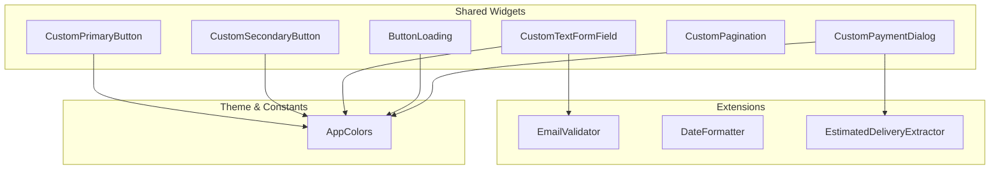
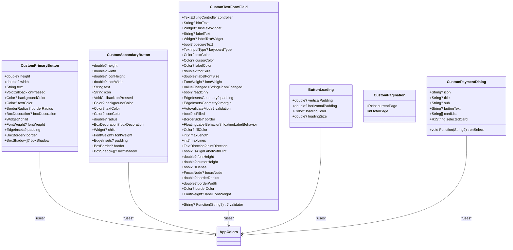
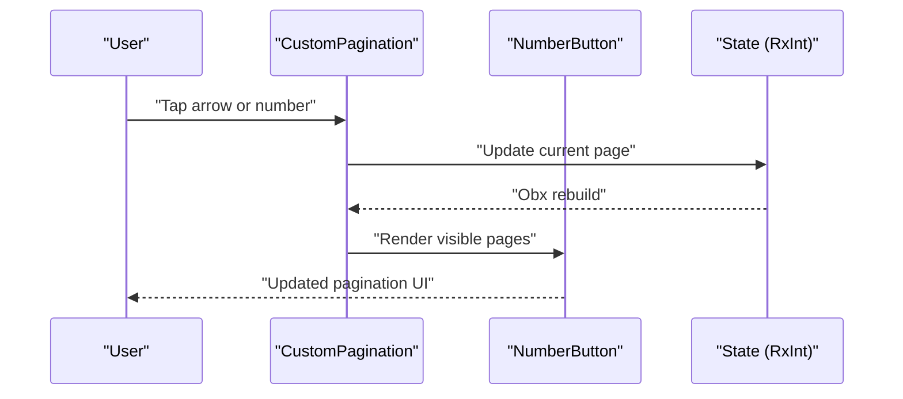
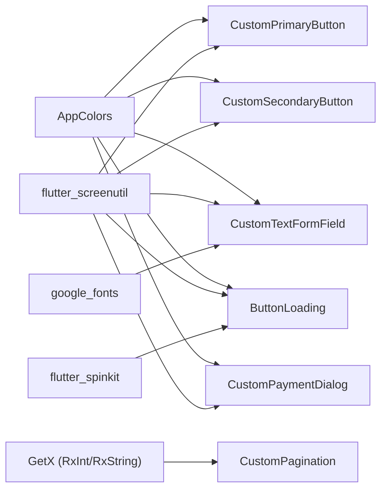

# Shared Components and Utilities

<cite>
**Referenced Files in This Document**
- [main.dart](file://lib/main.dart)
- [pubspec.yaml](file://pubspec.yaml)
- [colors.dart](file://lib/core/constant/colors.dart)
- [custom_primary_button.dart](file://lib/shared/widgets/custom_button/custom_primary_button.dart)
- [custom_secondary_button.dart](file://lib/shared/widgets/custom_button/custom_secondary_button.dart)
- [custom_text_form_field.dart](file://lib/shared/widgets/custom_form_field/custom_text_form_field.dart)
- [button_loading.dart](file://lib/shared/widgets/custom_loadings/button_loading.dart)
- [custom_pagination.dart](file://lib/shared/widgets/custom_pagination/custom_pagination.dart)
- [email_validator.dart](file://lib/shared/extensions/validators/email_validator.dart)
- [date_formatter.dart](file://lib/shared/extensions/formatters/date_formatter.dart)
- [estimate_delivery_extractor.dart](file://lib/shared/extensions/extractors/estimate_delivery_extractor.dart)
- [custom_payment_dialog.dart](file://lib/shared/widgets/custom_dialog/custom_payment_dialog.dart)
</cite>

## Table of Contents
1. [Introduction](#introduction)
2. [Project Structure](#project-structure)
3. [Core Components](#core-components)
4. [Architecture Overview](#architecture-overview)
5. [Detailed Component Analysis](#detailed-component-analysis)
6. [Dependency Analysis](#dependency-analysis)
7. [Performance Considerations](#performance-considerations)
8. [Troubleshooting Guide](#troubleshooting-guide)
9. [Conclusion](#conclusion)
10. [Appendices](#appendices)

## Introduction
This document describes the shared components and utility systems in ZB-DEZINE. It focuses on reusable UI components such as custom buttons, form fields, dialogs, loading indicators, and pagination. It also covers validation and formatting utilities, helper extensions, and extension methods. The guide explains component architecture, prop interfaces, event handling, customization options, composition patterns, accessibility considerations, responsive design, and guidelines for extending existing components and building new shared utilities.

## Project Structure
The shared components live under the shared directory, organized by feature families:
- widgets/custom_button: Primary and secondary buttons with theming and typography.
- widgets/custom_form_field: Reusable form fields with extensive customization.
- widgets/custom_loadings: Loading indicators tailored for actions.
- widgets/custom_pagination: Pagination controls with dynamic page rendering.
- widgets/custom_dialog: Payment and feedback dialogs.
- extensions/validators: Validation helpers for common inputs.
- extensions/formatters: Formatting helpers for dates and relative time.
- extensions/extractors: Domain-specific extractors for order-related data.

**Diagram sources**
- [custom_primary_button.dart:1-74](file://lib/shared/widgets/custom_button/custom_primary_button.dart#L1-L74)
- [custom_secondary_button.dart:1-88](file://lib/shared/widgets/custom_button/custom_secondary_button.dart#L1-L88)
- [custom_text_form_field.dart:1-191](file://lib/shared/widgets/custom_form_field/custom_text_form_field.dart#L1-L191)
- [button_loading.dart:1-36](file://lib/shared/widgets/custom_loadings/button_loading.dart#L1-L36)
- [custom_pagination.dart:1-87](file://lib/shared/widgets/custom_pagination/custom_pagination.dart#L1-L87)
- [custom_payment_dialog.dart:1-94](file://lib/shared/widgets/custom_dialog/custom_payment_dialog.dart#L1-L94)
- [email_validator.dart:1-14](file://lib/shared/extensions/validators/email_validator.dart#L1-L14)
- [date_formatter.dart:1-54](file://lib/shared/extensions/formatters/date_formatter.dart#L1-L54)
- [estimate_delivery_extractor.dart:1-39](file://lib/shared/extensions/extractors/estimate_delivery_extractor.dart#L1-L39)
- [colors.dart:1-117](file://lib/core/constant/colors.dart#L1-L117)

**Section sources**
- [main.dart:1-47](file://lib/main.dart#L1-L47)
- [pubspec.yaml:30-66](file://pubspec.yaml#L30-L66)

## Core Components
This section summarizes the reusable UI components and their primary responsibilities.

- CustomPrimaryButton
  - Purpose: Prominent call-to-action with theming and typography.
  - Key props: size, colors, border radius, padding, shadow, child widget, font weight.
  - Behavior: Uses theme brightness to select appropriate colors; supports custom decoration or defaults to brand colors.

- CustomSecondaryButton
  - Purpose: Secondary actions with icon and label.
  - Key props: icon asset, sizes, colors, border radius, padding, shadow.
  - Behavior: Renders icon and text in a row; applies theme-aware tinting.

- CustomTextFormField
  - Purpose: Consistent, theme-aware form field with extensive customization.
  - Key props: controller, hints, label, prefix/suffix icons, obscure text, keyboard type, validation, styling, borders, fill color.
  - Behavior: Applies theme-aware colors and typography; integrates with Google Fonts.

- ButtonLoading
  - Purpose: Loading indicator for actions.
  - Key props: padding, color, size.
  - Behavior: Centers a spinner with theme-aware color.

- CustomPagination
  - Purpose: Page navigation with dynamic page range and navigation arrows.
  - Key props: current page (Rx), total pages.
  - Behavior: Renders numbered pages and ellipses; updates reactive current page.

- CustomPaymentDialog
  - Purpose: Payment selection dialog with amount and method list.
  - Key props: icon, title, subtitle, button text, card list, selected card (Rx), selection callback.
  - Behavior: Dialog with shadow and theme-aware background; composes payment method component.

**Section sources**
- [custom_primary_button.dart:6-74](file://lib/shared/widgets/custom_button/custom_primary_button.dart#L6-L74)
- [custom_secondary_button.dart:6-88](file://lib/shared/widgets/custom_button/custom_secondary_button.dart#L6-L88)
- [custom_text_form_field.dart:7-191](file://lib/shared/widgets/custom_form_field/custom_text_form_field.dart#L7-L191)
- [button_loading.dart:6-36](file://lib/shared/widgets/custom_loadings/button_loading.dart#L6-L36)
- [custom_pagination.dart:7-87](file://lib/shared/widgets/custom_pagination/custom_pagination.dart#L7-L87)
- [custom_payment_dialog.dart:9-94](file://lib/shared/widgets/custom_dialog/custom_payment_dialog.dart#L9-L94)

## Architecture Overview
The shared components follow a consistent pattern:
- Props-first design: All customization is exposed via constructor parameters.
- Theme-aware rendering: Components check brightness and apply appropriate colors from AppColors.
- Composition: Components often wrap smaller shared text widgets or reuse common styling logic.
- Reactive updates: Pagination uses GetX reactive integers for current page.

**Diagram sources**
- [custom_primary_button.dart:6-74](file://lib/shared/widgets/custom_button/custom_primary_button.dart#L6-L74)
- [custom_secondary_button.dart:6-88](file://lib/shared/widgets/custom_button/custom_secondary_button.dart#L6-L88)
- [custom_text_form_field.dart:7-191](file://lib/shared/widgets/custom_form_field/custom_text_form_field.dart#L7-L191)
- [button_loading.dart:6-36](file://lib/shared/widgets/custom_loadings/button_loading.dart#L6-L36)
- [custom_pagination.dart:7-87](file://lib/shared/widgets/custom_pagination/custom_pagination.dart#L7-L87)
- [custom_payment_dialog.dart:9-94](file://lib/shared/widgets/custom_dialog/custom_payment_dialog.dart#L9-L94)
- [colors.dart:3-117](file://lib/core/constant/colors.dart#L3-L117)

## Detailed Component Analysis

### CustomPrimaryButton
- Props interface
  - Size and layout: height, width, padding.
  - Theming: backgroundColor, textColor, borderRadius, border, boxShadow.
  - Typography: fontSize, fontWeight.
  - Interaction: onPressed, child override.
- Event handling
  - Tap gesture triggers onPressed callback.
- Customization
  - Supports custom child widget to render complex layouts inside the button.
  - Falls back to a centered text label using a shared text widget.
- Accessibility and responsiveness
  - Uses screen-aware units for sizing and padding.
  - Respects theme brightness for color selection.

Usage example pattern
- Integrate with a controller’s onPressed handler and pass theme-aware colors.

**Section sources**
- [custom_primary_button.dart:6-74](file://lib/shared/widgets/custom_button/custom_primary_button.dart#L6-L74)
- [colors.dart:3-117](file://lib/core/constant/colors.dart#L3-L117)

### CustomSecondaryButton
- Props interface
  - Icon and text: icon asset path, text, iconHeight, iconWidth.
  - Layout and styling: height, width, backgroundColor, textColor, iconColor, radius, padding, border, boxShadow.
- Behavior
  - Composes an icon and text in a centered row.
  - Applies theme-aware tinting to icon and text.
- Accessibility and responsiveness
  - Uses screen-aware units for sizing and spacing.

Usage example pattern
- Use for secondary actions like “Sign in with provider” with an associated icon asset.

**Section sources**
- [custom_secondary_button.dart:6-88](file://lib/shared/widgets/custom_button/custom_secondary_button.dart#L6-L88)
- [colors.dart:3-117](file://lib/core/constant/colors.dart#L3-L117)

### CustomTextFormField
- Props interface
  - Content: controller, maxLines, maxLength, readOnly, onChanged.
  - Hints and labels: hintText, labelText, hintTextWidget, labelTextWidget.
  - Validation: validator, validation mode, errorText.
  - Styling: textColor, fontSize, fontWeight, labelColor, labelFontSize, labelFontWeight.
  - Borders and fills: border, borderRadius, borderWidth, borderColor, isFilled, fillColor, floatingLabelBehavior, isAlignLabelWithHint.
  - Focus and cursor: focusNode, cursorColor, cursorHeight, isDense.
- Behavior
  - Applies theme-aware colors and typography.
  - Integrates with Google Fonts and a consistent label/text widget.
- Accessibility and responsiveness
  - Supports text direction, dense layout, and cursor customization.

Usage example pattern
- Wrap with a form and pass a validator from the extensions module.

**Section sources**
- [custom_text_form_field.dart:7-191](file://lib/shared/widgets/custom_form_field/custom_text_form_field.dart#L7-L191)
- [colors.dart:3-117](file://lib/core/constant/colors.dart#L3-L117)

### ButtonLoading
- Props interface
  - Spacing: verticalPadding, horizontalPadding.
  - Visual: loadingColor, loadingSize.
- Behavior
  - Renders a spinner with theme-aware color and centering.
- Accessibility and responsiveness
  - Uses screen-aware units for size and padding.

Usage example pattern
- Display during async operations; hide when not busy.

**Section sources**
- [button_loading.dart:6-36](file://lib/shared/widgets/custom_loadings/button_loading.dart#L6-L36)
- [colors.dart:3-117](file://lib/core/constant/colors.dart#L3-L117)

### CustomPagination
- Props interface
  - Reactive: currentPage (RxInt), totalPage (int).
- Behavior
  - Dynamically renders page numbers around the current page.
  - Shows ellipses when not all pages are visible.
  - Provides left/right navigation arrows with disabled states.
- Reactive updates
  - Uses Obx to rebuild when current page changes.

**Diagram sources**
- [custom_pagination.dart:7-87](file://lib/shared/widgets/custom_pagination/custom_pagination.dart#L7-L87)

**Section sources**
- [custom_pagination.dart:7-87](file://lib/shared/widgets/custom_pagination/custom_pagination.dart#L7-L87)

### CustomPaymentDialog
- Props interface
  - Presentation: icon, title, sub, buttonText.
  - Data: cardList (List<String>), selectedCard (RxString), onSelect (callback).
- Behavior
  - Dialog with theme-aware background and shadow.
  - Displays amount and delegates payment method selection to a composed component.
- Accessibility and responsiveness
  - Full-width dialog with centered content; uses screen-aware units.

Usage example pattern
- Open via Get.dialog and update selected card via the provided callback.

**Section sources**
- [custom_payment_dialog.dart:9-94](file://lib/shared/widgets/custom_dialog/custom_payment_dialog.dart#L9-L94)
- [colors.dart:3-117](file://lib/core/constant/colors.dart#L3-L117)

### Validation Utilities
- EmailValidator
  - Function: Validates email presence and format.
  - Returns null on success or an error message string.

Usage example pattern
- Pass to CustomTextFormField.validator for email inputs.

**Section sources**
- [email_validator.dart:1-14](file://lib/shared/extensions/validators/email_validator.dart#L1-L14)

### Formatting Utilities
- DateFormatter
  - Methods:
    - toFormattedDate: ISO 8601 to “MMM dd, yyyy”.
    - toFormattedDateTime: ISO 8601 to “MMM dd, yyyy hh:mm a”.
    - toRelativeTime: Relative time like “2 days ago”, “Just now”.

Usage example pattern
- Apply to model strings before displaying.

**Section sources**
- [date_formatter.dart:3-54](file://lib/shared/extensions/formatters/date_formatter.dart#L3-L54)

### Extractor Utilities
- EstimatedDeliveryExtractor
  - Method: calculateEstimatedDelivery
    - Parses order creation date and delivery window.
    - Computes min/max delivery dates and formats as “Month D – Month D, YYYY”.

Usage example pattern
- Call on order data to present estimated delivery range.

**Section sources**
- [estimate_delivery_extractor.dart:5-39](file://lib/shared/extensions/extractors/estimate_delivery_extractor.dart#L5-L39)

## Dependency Analysis
Shared components depend on:
- AppColors for theme-aware colors.
- Flutter SDK and third-party packages for UI and utilities.
- GetX for reactive state in pagination.
- ScreenUtil for responsive sizing.

**Diagram sources**
- [colors.dart:3-117](file://lib/core/constant/colors.dart#L3-L117)
- [custom_primary_button.dart:1-74](file://lib/shared/widgets/custom_button/custom_primary_button.dart#L1-L74)
- [custom_secondary_button.dart:1-88](file://lib/shared/widgets/custom_button/custom_secondary_button.dart#L1-L88)
- [custom_text_form_field.dart:1-191](file://lib/shared/widgets/custom_form_field/custom_text_form_field.dart#L1-L191)
- [button_loading.dart:1-36](file://lib/shared/widgets/custom_loadings/button_loading.dart#L1-L36)
- [custom_pagination.dart:1-87](file://lib/shared/widgets/custom_pagination/custom_pagination.dart#L1-L87)
- [custom_payment_dialog.dart:1-94](file://lib/shared/widgets/custom_dialog/custom_payment_dialog.dart#L1-L94)
- [pubspec.yaml:37-59](file://pubspec.yaml#L37-L59)

**Section sources**
- [pubspec.yaml:30-66](file://pubspec.yaml#L30-L66)

## Performance Considerations
- Prefer lightweight widgets for lists and paginations to minimize rebuild scope.
- Use reactive props (RxInt/RxString) judiciously; avoid unnecessary global state updates.
- Keep custom decoration and shadows minimal to reduce overdraw.
- Use screen-aware units consistently to avoid layout thrashing on different screen densities.

## Troubleshooting Guide
- Buttons appear inverted in dark mode
  - Verify theme brightness detection and color fallbacks.
  - Ensure AppColors constants are defined for dark variants.

- Form fields not validating
  - Confirm validator function returns null for valid input and a non-empty string for invalid input.
  - Set AutovalidateMode appropriately on the form field.

- Pagination not updating
  - Ensure the currentPage prop is a reactive variable and is updated via callbacks.

- Loading indicator not visible
  - Check theme brightness and loadingColor; ensure the widget is rendered during async operations.

**Section sources**
- [custom_primary_button.dart:39-72](file://lib/shared/widgets/custom_button/custom_primary_button.dart#L39-L72)
- [custom_text_form_field.dart:103-187](file://lib/shared/widgets/custom_form_field/custom_text_form_field.dart#L103-L187)
- [custom_pagination.dart:14-78](file://lib/shared/widgets/custom_pagination/custom_pagination.dart#L14-L78)
- [button_loading.dart:20-35](file://lib/shared/widgets/custom_loadings/button_loading.dart#L20-L35)

## Conclusion
The shared components and utilities in ZB-DEZINE provide a cohesive, theme-aware foundation for UI development. They emphasize composability, customization, and responsiveness. Validators and formatters enable consistent data handling across the app. Following the patterns described here will help maintain consistency and scalability as new features are added.

## Appendices

### Component Composition Patterns
- Prefer small, single-responsibility widgets and compose them into larger components.
- Use props to externalize behavior and appearance; avoid hardcoding values.
- Centralize theme colors in AppColors and derive all component colors from it.

### Accessibility Considerations
- Ensure sufficient color contrast in theme-aware modes.
- Provide meaningful labels and hints for form fields.
- Respect text scaling and use responsive units for paddings and sizes.

### Responsive Design Implementation
- Use screen-aware units for sizing and spacing.
- Avoid fixed widths; prefer flexible layouts with Spacers and centering.

### Extending Existing Components
- Add new props to constructors with sensible defaults.
- Keep backward compatibility by making new parameters optional.
- Update AppColors if introducing new brand colors.

### Creating New Shared Utilities
- Place validators and formatters under extensions with clear method names.
- Encapsulate domain-specific extractors as extensions on model types.
- Export utilities from a central library file if needed for broader access.