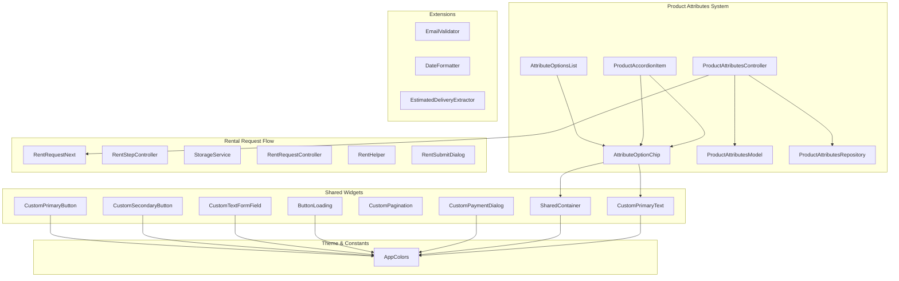
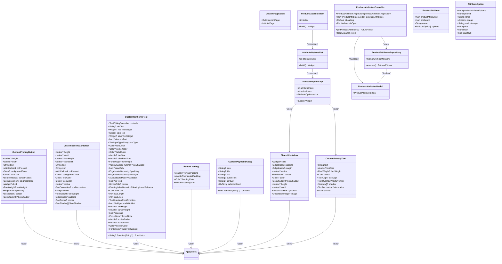
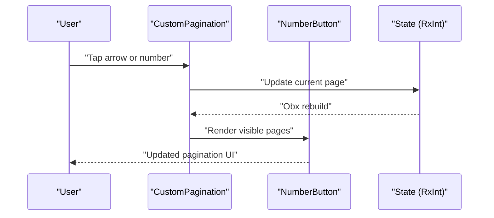
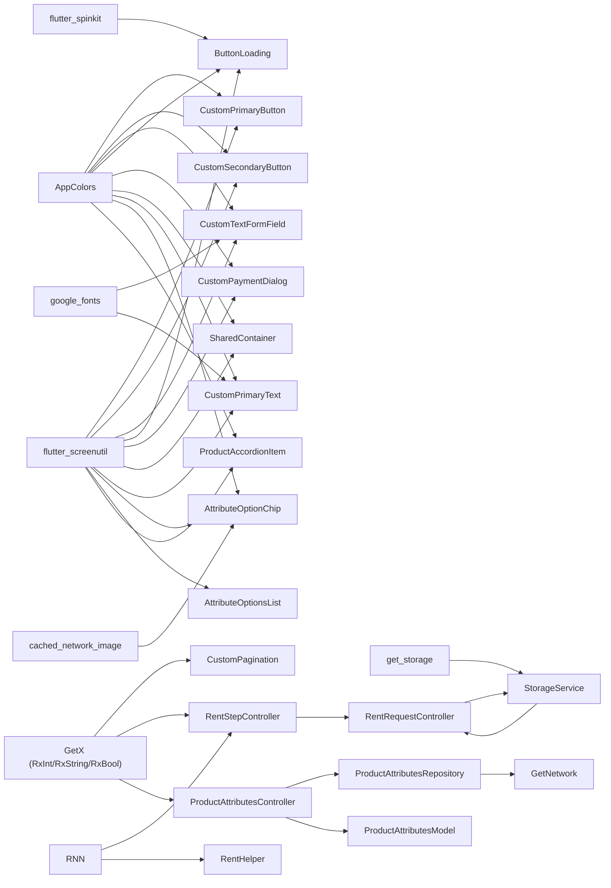

# Shared Components and Utilities

<cite>
**Referenced Files in This Document**
- [main.dart](file://lib/main.dart)
- [pubspec.yaml](file://pubspec.yaml)
- [colors.dart](file://lib/core/constant/colors.dart)
- [custom_primary_button.dart](file://lib/shared/widgets/custom_button/custom_primary_button.dart)
- [custom_secondary_button.dart](file://lib/shared/widgets/custom_button/custom_secondary_button.dart)
- [custom_text_form_field.dart](file://lib/shared/widgets/custom_form_field/custom_text_form_field.dart)
- [button_loading.dart](file://lib/shared/widgets/custom_loadings/button_loading.dart)
- [custom_pagination.dart](file://lib/shared/widgets/custom_pagination/custom_pagination.dart)
- [custom_payment_dialog.dart](file://lib/shared/widgets/custom_dialog/custom_payment_dialog.dart)
- [shared_container.dart](file://lib/shared/widgets/shared_container.dart)
- [custom_primary_text.dart](file://lib/shared/widgets/custom_text/custom_primary_text.dart)
- [attribute_option_chip.dart](file://lib/features/product_details.dart/widgets/product_furniture_customized_widgets/attribute_option_chip.dart)
- [attribute_options_list.dart](file://lib/features/product_details.dart/widgets/product_furniture_customized_widgets/attribute_options_list.dart)
- [product_accordion_item.dart](file://lib/features/product_details.dart/widgets/product_furniture_customized_widgets/product_accordion_item.dart)
- [products_attributes_controller.dart](file://lib/features/product_details.dart/controller/products_attributes_controller.dart)
- [product_attributes_model.dart](file://lib/features/product_details.dart/models/product_attributes_model.dart)
- [product_attributes_repo.dart](file://lib/features/product_details.dart/repositories/product_attributes_repo.dart)
- [email_validator.dart](file://lib/shared/extensions/validators/email_validator.dart)
- [date_formatter.dart](file://lib/shared/extensions/formatters/date_formatter.dart)
- [estimate_delivery_extractor.dart](file://lib/shared/extensions/extractors/estimate_delivery_extractor.dart)
- [rent_request_next.dart](file://lib/features/rent_request/widgets/rent_request_view_widgets/rent_request_next.dart)
- [rent_step_controller.dart](file://lib/features/rent_request/controllers/rent_step_controller.dart)
- [storage_service.dart](file://lib/core/data/local/storage_service.dart)
- [rent_request_controller.dart](file://lib/features/rent_request/controllers/rent_request_controller.dart)
- [step_zero_repo.dart](file://lib/features/rent_request/repositories/step_zero_repo.dart)
- [rent_helper.dart](file://lib/features/rent_request/widgets/rent_helper.dart)
- [rent_submit_dialog.dart](file://lib/features/rent_request/widgets/rent_submit_dialog.dart)
</cite>

## Update Summary
**Changes Made**
- Added documentation for new Product Attributes widgets: AttributeOptionChip, AttributeOptionsList, and ProductAccordionItem
- Integrated Product Attributes Controller with GetX reactive state management
- Added Product Attributes Model with nested ProductAttribute and AttributeOption structures
- Included Product Attributes Repository with network integration and error handling
- Enhanced component architecture with accordion-based attribute display system
- Added comprehensive dependency analysis for product customization components

## Table of Contents
1. [Introduction](#introduction)
2. [Project Structure](#project-structure)
3. [Core Components](#core-components)
4. [Architecture Overview](#architecture-overview)
5. [Detailed Component Analysis](#detailed-component-analysis)
6. [Product Attributes System](#product-attributes-system)
7. [Dependency Analysis](#dependency-analysis)
8. [Performance Considerations](#performance-considerations)
9. [Troubleshooting Guide](#troubleshooting-guide)
10. [Conclusion](#conclusion)
11. [Appendices](#appendices)

## Introduction
This document describes the shared components and utility systems in ZB-DEZINE. It focuses on reusable UI components such as custom buttons, form fields, dialogs, loading indicators, and pagination. It also covers validation and formatting utilities, helper extensions, and extension methods. The guide explains component architecture, prop interfaces, event handling, customization options, composition patterns, accessibility considerations, responsive design, and guidelines for extending existing components and building new shared utilities.

**Updated** Enhanced with comprehensive documentation for the new Product Attributes system including AttributeOptionChip, AttributeOptionsList, ProductAccordionItem, and supporting controllers and models that enable advanced product customization and interaction capabilities.

## Project Structure
The shared components live under the shared directory, organized by feature families:
- widgets/custom_button: Primary and secondary buttons with theming and typography.
- widgets/custom_form_field: Reusable form fields with extensive customization.
- widgets/custom_loadings: Loading indicators tailored for actions.
- widgets/custom_pagination: Pagination controls with dynamic page rendering.
- widgets/custom_dialog: Payment and feedback dialogs.
- widgets/shared_container: Universal container component for consistent styling.
- widgets/custom_text: Primary text component with theme-aware typography.
- features/product_details: Product customization system with attributes and options.
- features/rent_request: Complete rental request flow with step navigation and async operations.
- extensions/validators: Validation helpers for common inputs.
- extensions/formatters: Formatting helpers for dates and relative time.
- extensions/extractors: Domain-specific extractors for order-related data.



**Diagram sources**
- [custom_primary_button.dart:1-74](file://lib/shared/widgets/custom_button/custom_primary_button.dart#L1-L74)
- [custom_secondary_button.dart:1-88](file://lib/shared/widgets/custom_button/custom_secondary_button.dart#L1-L88)
- [custom_text_form_field.dart:1-191](file://lib/shared/widgets/custom_form_field/custom_text_form_field.dart#L1-L191)
- [button_loading.dart:1-36](file://lib/shared/widgets/custom_loadings/button_loading.dart#L1-L36)
- [custom_pagination.dart:1-87](file://lib/shared/widgets/custom_pagination/custom_pagination.dart#L1-L87)
- [custom_payment_dialog.dart:1-94](file://lib/shared/widgets/custom_dialog/custom_payment_dialog.dart#L1-L94)
- [shared_container.dart:1-57](file://lib/shared/widgets/shared_container.dart#L1-L57)
- [custom_primary_text.dart:1-45](file://lib/shared/widgets/custom_text/custom_primary_text.dart#L1-L45)
- [attribute_option_chip.dart:1-73](file://lib/features/product_details.dart/widgets/product_furniture_customized_widgets/attribute_option_chip.dart#L1-L73)
- [attribute_options_list.dart:1-33](file://lib/features/product_details.dart/widgets/product_furniture_customized_widgets/attribute_options_list.dart#L1-L33)
- [product_accordion_item.dart:1-123](file://lib/features/product_details.dart/widgets/product_furniture_customized_widgets/product_accordion_item.dart#L1-L123)
- [products_attributes_controller.dart:1-41](file://lib/features/product_details.dart/controller/products_attributes_controller.dart#L1-L41)
- [product_attributes_model.dart:1-101](file://lib/features/product_details.dart/models/product_attributes_model.dart#L1-L101)
- [product_attributes_repo.dart:1-22](file://lib/features/product_details.dart/repositories/product_attributes_repo.dart#L1-L22)
- [email_validator.dart:1-14](file://lib/shared/extensions/validators/email_validator.dart#L1-L14)
- [date_formatter.dart:1-54](file://lib/shared/extensions/formatters/date_formatter.dart#L1-L54)
- [estimate_delivery_extractor.dart:1-39](file://lib/shared/extensions/extractors/estimate_delivery_extractor.dart#L1-L39)
- [colors.dart:1-117](file://lib/core/constant/colors.dart#L1-L117)
- [rent_request_next.dart:1-61](file://lib/features/rent_request/widgets/rent_request_view_widgets/rent_request_next.dart#L1-L61)
- [rent_step_controller.dart:1-96](file://lib/features/rent_request/controllers/rent_step_controller.dart#L1-L96)
- [storage_service.dart:1-24](file://lib/core/data/local/storage_service.dart#L1-L24)
- [rent_request_controller.dart:1-68](file://lib/features/rent_request/controllers/rent_request_controller.dart#L1-L68)
- [rent_helper.dart:1-41](file://lib/features/rent_request/widgets/rent_helper.dart#L1-L41)
- [rent_submit_dialog.dart:1-66](file://lib/features/rent_request/widgets/rent_submit_dialog.dart#L1-L66)

**Section sources**
- [main.dart:1-47](file://lib/main.dart#L1-L47)
- [pubspec.yaml:30-66](file://pubspec.yaml#L30-L66)

## Core Components
This section summarizes the reusable UI components and their primary responsibilities.

- CustomPrimaryButton
  - Purpose: Prominent call-to-action with theming and typography.
  - Key props: size, colors, border radius, padding, shadow, child widget, font weight.
  - Behavior: Uses theme brightness to select appropriate colors; supports custom decoration or defaults to brand colors.

- CustomSecondaryButton
  - Purpose: Secondary actions with icon and label.
  - Key props: icon asset, sizes, colors, border radius, padding, shadow.
  - Behavior: Renders icon and text in a row; applies theme-aware tinting.

- CustomTextFormField
  - Purpose: Consistent, theme-aware form field with extensive customization.
  - Key props: controller, hints, label, prefix/suffix icons, obscure text, keyboard type, validation, styling, borders, fill color.
  - Behavior: Applies theme-aware colors and typography; integrates with Google Fonts.

- ButtonLoading
  - Purpose: Loading indicator for actions.
  - Key props: padding, color, size.
  - Behavior: Centers a spinner with theme-aware color.

- CustomPagination
  - Purpose: Page navigation with dynamic page range and navigation arrows.
  - Key props: current page (Rx), total pages.
  - Behavior: Renders numbered pages and ellipses; updates reactive current page.

- CustomPaymentDialog
  - Purpose: Payment selection dialog with amount and method list.
  - Key props: icon, title, subtitle, button text, card list, selected card (Rx), selection callback.
  - Behavior: Dialog with shadow and theme-aware background; composes payment method component.

- SharedContainer
  - Purpose: Universal container for consistent styling and layout.
  - Key props: child, padding, margin, radius, border, color, boxShadow, height, width, gradient, image.
  - Behavior: Theme-aware container with flexible styling options and responsive sizing.

- CustomPrimaryText
  - Purpose: Primary text component with Google Fonts integration and theme-aware colors.
  - Key props: text, fontSize, fontWeight, color, textAlign, textOverflow, shadow, decoration, maxLine.
  - Behavior: Responsive typography with Montserrat font family and automatic theme adaptation.

**Updated** Added Product Attributes components for advanced product customization including interactive chips, accordion-based display, and comprehensive attribute management.

- AttributeOptionChip
  - Purpose: Individual attribute option display with image support and pricing.
  - Key props: attributeIndex, optionIndex, option (AttributeOption).
  - Behavior: Interactive chip with optional image, name, and price display; theme-aware styling.

- AttributeOptionsList
  - Purpose: Grid layout for displaying multiple attribute options.
  - Key props: attributeIndex.
  - Behavior: Wrap-based layout with spacing configuration and responsive design.

- ProductAccordionItem
  - Purpose: Accordion component for displaying product attributes with expand/collapse functionality.
  - Key props: index.
  - Behavior: Animated expansion with smooth transitions and theme-aware styling.

**Section sources**
- [custom_primary_button.dart:6-74](file://lib/shared/widgets/custom_button/custom_primary_button.dart#L6-L74)
- [custom_secondary_button.dart:6-88](file://lib/shared/widgets/custom_button/custom_secondary_button.dart#L6-L88)
- [custom_text_form_field.dart:7-191](file://lib/shared/widgets/custom_form_field/custom_text_form_field.dart#L7-L191)
- [button_loading.dart:6-36](file://lib/shared/widgets/custom_loadings/button_loading.dart#L6-L36)
- [custom_pagination.dart:7-87](file://lib/shared/widgets/custom_pagination/custom_pagination.dart#L7-L87)
- [custom_payment_dialog.dart:9-94](file://lib/shared/widgets/custom_dialog/custom_payment_dialog.dart#L9-L94)
- [shared_container.dart:5-57](file://lib/shared/widgets/shared_container.dart#L5-L57)
- [custom_primary_text.dart:8-45](file://lib/shared/widgets/custom_text/custom_primary_text.dart#L8-L45)
- [attribute_option_chip.dart:9-73](file://lib/features/product_details.dart/widgets/product_furniture_customized_widgets/attribute_option_chip.dart#L9-L73)
- [attribute_options_list.dart:7-33](file://lib/features/product_details.dart/widgets/product_furniture_customized_widgets/attribute_options_list.dart#L7-L33)
- [product_accordion_item.dart:11-123](file://lib/features/product_details.dart/widgets/product_furniture_customized_widgets/product_accordion_item.dart#L11-L123)

## Architecture Overview
The shared components follow a consistent pattern:
- Props-first design: All customization is exposed via constructor parameters.
- Theme-aware rendering: Components check brightness and apply appropriate colors from AppColors.
- Composition: Components often wrap smaller shared text widgets or reuse common styling logic.
- Reactive updates: Pagination uses GetX reactive integers for current page.
- Async operation support: Enhanced with loading states and error handling for network operations.

**Updated** The architecture now includes a comprehensive Product Attributes system with GetX reactive state management, model-driven data structures, and network integration for dynamic product customization.



**Diagram sources**
- [custom_primary_button.dart:6-74](file://lib/shared/widgets/custom_button/custom_primary_button.dart#L6-L74)
- [custom_secondary_button.dart:6-88](file://lib/shared/widgets/custom_button/custom_secondary_button.dart#L6-L88)
- [custom_text_form_field.dart:7-191](file://lib/shared/widgets/custom_form_field/custom_text_form_field.dart#L7-L191)
- [button_loading.dart:6-36](file://lib/shared/widgets/custom_loadings/button_loading.dart#L6-L36)
- [custom_pagination.dart:7-87](file://lib/shared/widgets/custom_pagination/custom_pagination.dart#L7-L87)
- [custom_payment_dialog.dart:9-94](file://lib/shared/widgets/custom_dialog/custom_payment_dialog.dart#L9-L94)
- [shared_container.dart:5-57](file://lib/shared/widgets/shared_container.dart#L5-L57)
- [custom_primary_text.dart:8-45](file://lib/shared/widgets/custom_text/custom_primary_text.dart#L8-L45)
- [attribute_option_chip.dart:9-73](file://lib/features/product_details.dart/widgets/product_furniture_customized_widgets/attribute_option_chip.dart#L9-L73)
- [attribute_options_list.dart:7-33](file://lib/features/product_details.dart/widgets/product_furniture_customized_widgets/attribute_options_list.dart#L7-L33)
- [product_accordion_item.dart:11-123](file://lib/features/product_details.dart/widgets/product_furniture_customized_widgets/product_accordion_item.dart#L11-L123)
- [products_attributes_controller.dart:6-41](file://lib/features/product_details.dart/controller/products_attributes_controller.dart#L6-L41)
- [product_attributes_model.dart:9-101](file://lib/features/product_details.dart/models/product_attributes_model.dart#L9-L101)
- [product_attributes_repo.dart:7-22](file://lib/features/product_details.dart/repositories/product_attributes_repo.dart#L7-L22)
- [colors.dart:3-117](file://lib/core/constant/colors.dart#L3-L117)

## Detailed Component Analysis

### CustomPrimaryButton
- Props interface
  - Size and layout: height, width, padding.
  - Theming: backgroundColor, textColor, borderRadius, border, boxShadow.
  - Typography: fontSize, fontWeight.
  - Interaction: onPressed, child override.
- Event handling
  - Tap gesture triggers onPressed callback.
- Customization
  - Supports custom child widget to render complex layouts inside the button.
  - Falls back to a centered text label using a shared text widget.
- Accessibility and responsiveness
  - Uses screen-aware units for sizing and padding.
  - Respects theme brightness for color selection.

Usage example pattern
- Integrate with a controller's onPressed handler and pass theme-aware colors.

**Section sources**
- [custom_primary_button.dart:6-74](file://lib/shared/widgets/custom_button/custom_primary_button.dart#L6-L74)
- [colors.dart:3-117](file://lib/core/constant/colors.dart#L3-L117)

### CustomSecondaryButton
- Props interface
  - Icon and text: icon asset path, text, iconHeight, iconWidth.
  - Layout and styling: height, width, backgroundColor, textColor, iconColor, radius, padding, border, boxShadow.
- Behavior
  - Composes an icon and text in a centered row.
  - Applies theme-aware tinting to icon and text.
- Accessibility and responsiveness
  - Uses screen-aware units for sizing and spacing.

Usage example pattern
- Use for secondary actions like "Sign in with provider" with an associated icon asset.

**Section sources**
- [custom_secondary_button.dart:6-88](file://lib/shared/widgets/custom_button/custom_secondary_button.dart#L6-L88)
- [colors.dart:3-117](file://lib/core/constant/colors.dart#L3-L117)

### CustomTextFormField
- Props interface
  - Content: controller, maxLines, maxLength, readOnly, onChanged.
  - Hints and labels: hintText, labelText, hintTextWidget, labelTextWidget.
  - Validation: validator, validation mode, errorText.
  - Styling: textColor, fontSize, fontWeight, labelColor, labelFontSize, labelFontWeight.
  - Borders and fills: border, borderRadius, borderWidth, borderColor, isFilled, fillColor, floatingLabelBehavior, isAlignLabelWithHint.
  - Focus and cursor: focusNode, cursorColor, cursorHeight, isDense.
- Behavior
  - Applies theme-aware colors and typography.
  - Integrates with Google Fonts and a consistent label/text widget.
- Accessibility and responsiveness
  - Supports text direction, dense layout, and cursor customization.

Usage example pattern
- Wrap with a form and pass a validator from the extensions module.

**Section sources**
- [custom_text_form_field.dart:7-191](file://lib/shared/widgets/custom_form_field/custom_text_form_field.dart#L7-L191)
- [colors.dart:3-117](file://lib/core/constant/colors.dart#L3-L117)

### ButtonLoading
- Props interface
  - Spacing: verticalPadding, horizontalPadding.
  - Visual: loadingColor, loadingSize.
- Behavior
  - Renders a spinner with theme-aware color and centering.
- Accessibility and responsiveness
  - Uses screen-aware units for size and padding.

Usage example pattern
- Display during async operations; hide when not busy.

**Section sources**
- [button_loading.dart:6-36](file://lib/shared/widgets/custom_loadings/button_loading.dart#L6-L36)
- [colors.dart:3-117](file://lib/core/constant/colors.dart#L3-L117)

### CustomPagination
- Props interface
  - Reactive: currentPage (RxInt), totalPage (int).
- Behavior
  - Dynamically renders page numbers around the current page.
  - Shows ellipses when not all pages are visible.
  - Provides left/right navigation arrows with disabled states.
- Reactive updates
  - Uses Obx to rebuild when current page changes.



**Diagram sources**
- [custom_pagination.dart:7-87](file://lib/shared/widgets/custom_pagination/custom_pagination.dart#L7-L87)

**Section sources**
- [custom_pagination.dart:7-87](file://lib/shared/widgets/custom_pagination/custom_pagination.dart#L7-L87)

### CustomPaymentDialog
- Props interface
  - Presentation: icon, title, sub, buttonText.
  - Data: cardList (List<String>), selectedCard (RxString), onSelect (callback).
- Behavior
  - Dialog with theme-aware background and shadow.
  - Displays amount and delegates payment method selection to a composed component.
- Accessibility and responsiveness
  - Full-width dialog with centered content; uses screen-aware units.

Usage example pattern
- Open via Get.dialog and update selected card via the provided callback.

**Section sources**
- [custom_payment_dialog.dart:9-94](file://lib/shared/widgets/custom_dialog/custom_payment_dialog.dart#L9-L94)
- [colors.dart:3-117](file://lib/core/constant/colors.dart#L3-L117)

### SharedContainer
- Props interface
  - Content: child (Widget?).
  - Spacing: padding (EdgeInsets?), margin (EdgeInsets?).
  - Sizing: height (double?), width (double?).
  - Styling: radius (double?), border (BoxBorder?), color (Color?).
  - Effects: boxShadow (List<BoxShadow>?), gradient (LinearGradient?), image (DecorationImage?).
- Behavior
  - Theme-aware container with automatic color selection based on brightness.
  - Flexible layout with responsive sizing using Flutter_ScreenUtil.
  - Supports both solid colors and gradient backgrounds.
- Accessibility and responsiveness
  - Uses screen-aware units for consistent sizing across devices.
  - Respects theme brightness for color adaptation.

Usage example pattern
- Use as a base container for cards, chips, and interactive elements.

**Section sources**
- [shared_container.dart:5-57](file://lib/shared/widgets/shared_container.dart#L5-L57)
- [colors.dart:3-117](file://lib/core/constant/colors.dart#L3-L117)

### CustomPrimaryText
- Props interface
  - Text content: text (String), fontSize (double?), fontWeight (FontWeight?).
  - Styling: color (Color?), textAlign (TextAlign?), textOverflow (TextOverflow?).
  - Effects: shadow (List<Shadow>?), decoration (TextDecoration?), maxLine (int?).
- Behavior
  - Google Fonts integration with Montserrat font family.
  - Automatic theme adaptation based on brightness detection.
  - Responsive typography using Flutter_ScreenUtil scaling.
- Accessibility and responsiveness
  - Supports text overflow handling and maximum line constraints.
  - Automatic color adjustment for light/dark themes.

Usage example pattern
- Use for consistent typography across the application with theme-aware colors.

**Section sources**
- [custom_primary_text.dart:8-45](file://lib/shared/widgets/custom_text/custom_primary_text.dart#L8-L45)
- [colors.dart:3-117](file://lib/core/constant/colors.dart#L3-L117)

### AttributeOptionChip
**Updated** New component for individual attribute option display.

- Props interface
  - Positional: attributeIndex (int), optionIndex (int).
  - Data: option (AttributeOption) containing productAttributeOptionId, optionId, name, image, productImage, price, stock, isDefault.
- Behavior
  - Interactive chip with GestureDetector for tap handling.
  - Optional image display using CachedNetworkImage for network images.
  - Price display with currency formatting for positive prices.
  - Theme-aware styling with SharedContainer and CustomPrimaryText.
- Visual Elements
  - Left-aligned image (20x20) when option.image exists.
  - Name text with 14sp font size and 500 fontWeight.
  - Optional price badge with +$ prefix and 12sp font size.
- Accessibility and responsiveness
  - Uses screen-aware units (w/h) for consistent sizing.
  - Responsive padding and spacing configuration.

Usage example pattern
- Render within AttributeOptionsList for each attribute option.
- Implement onTap handler for selection logic in parent components.

**Section sources**
- [attribute_option_chip.dart:9-73](file://lib/features/product_details.dart/widgets/product_furniture_customized_widgets/attribute_option_chip.dart#L9-L73)
- [shared_container.dart:5-57](file://lib/shared/widgets/shared_container.dart#L5-L57)
- [custom_primary_text.dart:8-45](file://lib/shared/widgets/custom_text/custom_primary_text.dart#L8-L45)

### AttributeOptionsList
**Updated** New component for grid layout of attribute options.

- Props interface
  - attributeIndex (int): Index of the parent attribute in the productsAttributes list.
- Behavior
  - Dynamic generation of AttributeOptionChip widgets for each option.
  - Wrap-based layout with configurable spacing (12.w horizontal, 12.h vertical).
  - Full-width container with infinite width constraint.
  - Responsive alignment set to WrapAlignment.start for natural flow.
- Integration
  - Accesses ProductAttributesController via GetView mixin.
  - Retrieves attribute data from controller.productsAttributes.value!.data[attributeIndex].
  - Generates chips using List.generate with option count.
- Performance Considerations
  - Efficient rendering using List.generate for dynamic content.
  - Minimal widget tree with direct chip composition.

Usage example pattern
- Use within ProductAccordionItem expanded content area.
- Pass attribute index from parent ProductAccordionItem.

**Section sources**
- [attribute_options_list.dart:7-33](file://lib/features/product_details.dart/widgets/product_furniture_customized_widgets/attribute_options_list.dart#L7-L33)

### ProductAccordionItem
**Updated** New component for accordion-based attribute display.

- Props interface
  - index (int): Position of this item in the attributes list.
- Behavior
  - Obx wrapper for reactive state management with ProductAttributesController.
  - Header section with category icon, attribute name, and expand/collapse indicator.
  - Animated expansion with smooth transitions using AnimatedSize.
  - Toggle functionality via controller.toggleExpand(index).
  - Theme-aware styling with automatic brightness detection.
- Visual Components
  - Category icon container with 36x36 dimensions and 8.r radius.
  - Attribute name using CustomPrimaryText with 16sp font and 500 fontWeight.
  - Animated expand/collapse icon with rotation animation.
  - Smooth content expansion with 300ms duration and easeInOut curve.
- Integration
  - Accesses controller state via GetView<ProductAttributesController>.
  - Uses controller.productsAttributes.value!.data for attribute data.
  - Manages isOpen state via controller.isOpen[index] reactive boolean.
- Animation Details
  - Header icon rotation: 0.5 turns for expanded state, 0 turns for collapsed.
  - Content expansion: AnimatedSize with top-left alignment.
  - Smooth transitions for both header and content areas.

Usage example pattern
- Render within ProductFurnitureCustomizedWidgets for each attribute.
- Use as part of the accordion-based attribute display system.

**Section sources**
- [product_accordion_item.dart:11-123](file://lib/features/product_details.dart/widgets/product_furniture_customized_widgets/product_accordion_item.dart#L11-L123)

## Product Attributes System
**Updated** Comprehensive system for product customization and attribute management.

### ProductAttributesController
- State Management
  - productsAttributes: Rxn<ProductAttributesModel> for reactive data storage.
  - isLoading: RxBool for loading state management.
  - isOpen: RxList<bool> for accordion expansion states, initialized with first item expanded.
- Data Fetching
  - getProductsAttributes(): Async method with loading state management.
  - Integrates with ProductAttributesRepository for network communication.
  - Handles Either type response with error and success branches.
  - Sets isLoading flag before and after network request.
- UI State Management
  - toggleExpand(int index): Toggles accordion expansion state.
  - onInit(): Automatically fetches attributes on controller initialization.
  - Uses Get.arguments for product ID injection.

### ProductAttributesModel
- Data Structure
  - ProductAttributesModel: Contains List<ProductAttribute> data array.
  - ProductAttribute: Represents attribute group with productAttributeId, attributeId, name, and options list.
  - AttributeOption: Individual option with comprehensive metadata including pricing and stock information.
- JSON Serialization
  - Complete fromJson and toJson implementations for network communication.
  - Support for nested object serialization and deserialization.
  - Handles optional fields like productImage and image.

### ProductAttributesRepository
- Network Integration
  - execute(): Single method for fetching product attributes via GET request.
  - Uses GetNetwork for HTTP communication with HeadersManager.
  - Returns Either type for robust error handling.
  - JSON parsing with ProductAttributesModel.fromJson.
- Endpoint Configuration
  - URL: "/api/products/$productID/attributes"
  - Automatic header injection via HeadersManager.
  - Type-safe response mapping.

```mermaid
flowchart TD
A[ProductAttributesController] --> B[ProductAttributesRepository]
B --> C[GetNetwork]
C --> D[API Endpoint: /api/products/{productID}/attributes]
D --> E[ProductAttributesModel]
E --> F[ProductAccordionItem]
F --> G[AttributeOptionsList]
G --> H[AttributeOptionChip]
```

**Diagram sources**
- [products_attributes_controller.dart:6-41](file://lib/features/product_details.dart/controller/products_attributes_controller.dart#L6-L41)
- [product_attributes_repo.dart:7-22](file://lib/features/product_details.dart/repositories/product_attributes_repo.dart#L7-L22)
- [product_attributes_model.dart:9-101](file://lib/features/product_details.dart/models/product_attributes_model.dart#L9-L101)
- [product_accordion_item.dart:11-123](file://lib/features/product_details.dart/widgets/product_furniture_customized_widgets/product_accordion_item.dart#L11-L123)
- [attribute_options_list.dart:7-33](file://lib/features/product_details.dart/widgets/product_furniture_customized_widgets/attribute_options_list.dart#L7-L33)
- [attribute_option_chip.dart:9-73](file://lib/features/product_details.dart/widgets/product_furniture_customized_widgets/attribute_option_chip.dart#L9-L73)

**Section sources**
- [products_attributes_controller.dart:6-41](file://lib/features/product_details.dart/controller/products_attributes_controller.dart#L6-L41)
- [product_attributes_model.dart:9-101](file://lib/features/product_details.dart/models/product_attributes_model.dart#L9-L101)
- [product_attributes_repo.dart:7-22](file://lib/features/product_details.dart/repositories/product_attributes_repo.dart#L7-L22)

### Validation Utilities
- EmailValidator
  - Function: Validates email presence and format.
  - Returns null on success or an error message string.

Usage example pattern
- Pass to CustomTextFormField.validator for email inputs.

**Section sources**
- [email_validator.dart:1-14](file://lib/shared/extensions/validators/email_validator.dart#L1-L14)

### Formatting Utilities
- DateFormatter
  - Methods:
    - toFormattedDate: ISO 8601 to "MMM dd, yyyy".
    - toFormattedDateTime: ISO 8601 to "MMM dd, yyyy hh:mm a".
    - toRelativeTime: Relative time like "2 days ago", "Just now".

Usage example pattern
- Apply to model strings before displaying.

**Section sources**
- [date_formatter.dart:3-54](file://lib/shared/extensions/formatters/date_formatter.dart#L3-L54)

### Extractor Utilities
- EstimatedDeliveryExtractor
  - Method: calculateEstimatedDelivery
    - Parses order creation date and delivery window.
    - Computes min/max delivery dates and formats as "Month D – Month D, YYYY".

Usage example pattern
- Call on order data to present estimated delivery range.

**Section sources**
- [estimate_delivery_extractor.dart:5-39](file://lib/shared/extensions/extractors/estimate_delivery_extractor.dart#L5-L39)

## Dependency Analysis
Shared components depend on:
- AppColors for theme-aware colors.
- Flutter SDK and third-party packages for UI and utilities.
- GetX for reactive state in pagination, rental request flow, and product attributes.
- ScreenUtil for responsive sizing.
- GetStorage for persistent storage in rental request flow.
- CachedNetworkImage for efficient image loading in product attributes.
- Google Fonts for typography consistency.

**Updated** Enhanced dependency graph with Product Attributes system components and network integration.



**Diagram sources**
- [colors.dart:3-117](file://lib/core/constant/colors.dart#L3-L117)
- [custom_primary_button.dart:1-74](file://lib/shared/widgets/custom_button/custom_primary_button.dart#L1-L74)
- [custom_secondary_button.dart:1-88](file://lib/shared/widgets/custom_button/custom_secondary_button.dart#L1-L88)
- [custom_text_form_field.dart:1-191](file://lib/shared/widgets/custom_form_field/custom_text_form_field.dart#L1-L191)
- [button_loading.dart:1-36](file://lib/shared/widgets/custom_loadings/button_loading.dart#L1-L36)
- [custom_pagination.dart:1-87](file://lib/shared/widgets/custom_pagination/custom_pagination.dart#L1-L87)
- [custom_payment_dialog.dart:1-94](file://lib/shared/widgets/custom_dialog/custom_payment_dialog.dart#L1-L94)
- [shared_container.dart:1-57](file://lib/shared/widgets/shared_container.dart#L1-L57)
- [custom_primary_text.dart:1-45](file://lib/shared/widgets/custom_text/custom_primary_text.dart#L1-L45)
- [attribute_option_chip.dart:1-73](file://lib/features/product_details.dart/widgets/product_furniture_customized_widgets/attribute_option_chip.dart#L1-L73)
- [attribute_options_list.dart:1-33](file://lib/features/product_details.dart/widgets/product_furniture_customized_widgets/attribute_options_list.dart#L1-L33)
- [product_accordion_item.dart:1-123](file://lib/features/product_details.dart/widgets/product_furniture_customized_widgets/product_accordion_item.dart#L1-L123)
- [products_attributes_controller.dart:1-41](file://lib/features/product_details.dart/controller/products_attributes_controller.dart#L1-L41)
- [product_attributes_model.dart:1-101](file://lib/features/product_details.dart/models/product_attributes_model.dart#L1-L101)
- [product_attributes_repo.dart:1-22](file://lib/features/product_details.dart/repositories/product_attributes_repo.dart#L1-L22)
- [rent_request_next.dart:1-61](file://lib/features/rent_request/widgets/rent_request_view_widgets/rent_request_next.dart#L1-L61)
- [rent_step_controller.dart:1-96](file://lib/features/rent_request/controllers/rent_step_controller.dart#L1-L96)
- [storage_service.dart:1-24](file://lib/core/data/local/storage_service.dart#L1-L24)
- [rent_request_controller.dart:1-68](file://lib/features/rent_request/controllers/rent_request_controller.dart#L1-L68)
- [rent_helper.dart:1-41](file://lib/features/rent_request/widgets/rent_helper.dart#L1-L41)
- [pubspec.yaml:37-59](file://pubspec.yaml#L37-L59)

**Section sources**
- [pubspec.yaml:30-66](file://pubspec.yaml#L30-L66)

## Performance Considerations
- Prefer lightweight widgets for lists and paginations to minimize rebuild scope.
- Use reactive props (RxInt/RxString) judiciously; avoid unnecessary global state updates.
- Keep custom decoration and shadows minimal to reduce overdraw.
- Use screen-aware units consistently to avoid layout thrashing on different screen densities.
- Implement proper loading states during async operations to prevent UI blocking.
- Use GetStorage for efficient key-value operations in rental request flow.
- **Updated** Optimize image loading with CachedNetworkImage for better performance in AttributeOptionChip.
- **Updated** Use List.generate for efficient rendering of dynamic attribute option lists.
- **Updated** Implement proper error handling with ErrorSnackbar for network failures.
- **Updated** Leverage reactive state management to minimize unnecessary widget rebuilds.

**Updated** Added performance considerations for the new Product Attributes system including image caching, efficient list rendering, and reactive state management.

## Troubleshooting Guide
- Buttons appear inverted in dark mode
  - Verify theme brightness detection and color fallbacks.
  - Ensure AppColors constants are defined for dark variants.

- Form fields not validating
  - Confirm validator function returns null for valid input and a non-empty string for invalid input.
  - Set AutovalidateMode appropriately on the form field.

- Pagination not updating
  - Ensure the currentPage prop is a reactive variable and is updated via callbacks.

- Loading indicator not visible
  - Check theme brightness and loadingColor; ensure the widget is rendered during async operations.

**Updated** Added troubleshooting guidance for the new Product Attributes system.

- AttributeOptionChip not displaying images
  - Verify option.image is not null and contains a valid URL string.
  - Check CachedNetworkImage configuration and network connectivity.
  - Ensure image URLs are accessible and properly formatted.

- AttributeOptionsList not rendering options
  - Confirm controller.productsAttributes.value is not null.
  - Verify attributeIndex is within bounds of the data array.
  - Check that options list contains valid AttributeOption objects.

- ProductAccordionItem not expanding/collapsing
  - Ensure controller.toggleExpand is properly bound to the GestureDetector.
  - Verify isOpen reactive list has correct length matching attribute count.
  - Check Obx wrapper is correctly accessing controller state.

- ProductAttributesController not fetching data
  - Confirm productID argument is passed correctly via Get.arguments.
  - Verify network connectivity and API endpoint accessibility.
  - Check ErrorSnackbar for error messages in case of failure.

- Loading state not updating
  - Ensure isLoading reactive variable is properly toggled in getProductsAttributes.
  - Verify Obx wrapper in ProductFurnitureCustomizedWidgets is monitoring isLoading.
  - Check for proper error handling in Either response.

**Section sources**
- [custom_primary_button.dart:39-72](file://lib/shared/widgets/custom_button/custom_primary_button.dart#L39-L72)
- [custom_text_form_field.dart:103-187](file://lib/shared/widgets/custom_form_field/custom_text_form_field.dart#L103-L187)
- [custom_pagination.dart:14-78](file://lib/shared/widgets/custom_pagination/custom_pagination.dart#L14-L78)
- [button_loading.dart:20-35](file://lib/shared/widgets/custom_loadings/button_loading.dart#L20-L35)
- [attribute_option_chip.dart:25-71](file://lib/features/product_details.dart/widgets/product_furniture_customized_widgets/attribute_option_chip.dart#L25-L71)
- [attribute_options_list.dart:12-31](file://lib/features/product_details.dart/widgets/product_furniture_customized_widgets/attribute_options_list.dart#L12-L31)
- [product_accordion_item.dart:31-62](file://lib/features/product_details.dart/widgets/product_furniture_customized_widgets/product_accordion_item.dart#L31-L62)
- [products_attributes_controller.dart:14-39](file://lib/features/product_details.dart/controller/products_attributes_controller.dart#L14-L39)

## Conclusion
The shared components and utilities in ZB-DEZINE provide a cohesive, theme-aware foundation for UI development. They emphasize composability, customization, and responsiveness. Validators and formatters enable consistent data handling across the app. The enhanced rental request flow demonstrates advanced patterns for async operations, loading states, and persistent storage integration. **Updated** The new Product Attributes system showcases modern Flutter development practices with reactive state management, efficient image loading, and comprehensive data modeling. The addition of AttributeOptionChip, AttributeOptionsList, and ProductAccordionItem components significantly enhances the application's customization capabilities while maintaining consistency with existing architectural patterns.

**Updated** The integration of GetX for state management, CachedNetworkImage for performance optimization, and comprehensive error handling demonstrates best practices for scalable and maintainable Flutter applications.

## Appendices

### Component Composition Patterns
- Prefer small, single-responsibility widgets and compose them into larger components.
- Use props to externalize behavior and appearance; avoid hardcoding values.
- Centralize theme colors in AppColors and derive all component colors from it.
- Implement proper loading states for async operations to maintain UI responsiveness.
- **Updated** Use GetView mixin for reactive state access in GetX-based components.
- **Updated** Implement proper error handling with Either type for network operations.
- **Updated** Leverage List.generate for efficient rendering of dynamic content.

**Updated** Added composition patterns for the new Product Attributes system including reactive state management and efficient rendering techniques.

### Accessibility Considerations
- Ensure sufficient color contrast in theme-aware modes.
- Provide meaningful labels and hints for form fields.
- Respect text scaling and use responsive units for paddings and sizes.
- Implement proper loading states for screen readers and accessibility tools.
- **Updated** Ensure interactive elements like AttributeOptionChip have proper touch targets.
- **Updated** Provide semantic feedback for accordion expansion/collapse states.
- **Updated** Support keyboard navigation for interactive attribute options.

**Updated** Added accessibility considerations for the new Product Attributes components including touch target sizing and semantic feedback.

### Responsive Design Implementation
- Use screen-aware units for sizing and spacing.
- Avoid fixed widths; prefer flexible layouts with Spacers and centering.
- Ensure loading indicators are appropriately sized across different screen densities.
- **Updated** Implement responsive image sizing with CachedNetworkImage.
- **Updated** Use Wrap widget for adaptive layout of attribute options.
- **Updated** Ensure proper spacing and alignment across different screen sizes.

**Updated** Added responsive design considerations for the new Product Attributes system including adaptive layouts and image scaling.

### Extending Existing Components
- Add new props to constructors with sensible defaults.
- Keep backward compatibility by making new parameters optional.
- Update AppColors if introducing new brand colors.
- Implement proper error handling and loading states for async operations.
- **Updated** Extend ProductAttributesModel with new fields using fromJson/toJson.
- **Updated** Add new AttributeOption properties with proper JSON serialization.
- **Updated** Implement new controller methods for additional functionality.

**Updated** Added guidelines for extending components with async capabilities and data model enhancements.

### Creating New Shared Utilities
- Place validators and formatters under extensions with clear method names.
- Encapsulate domain-specific extractors as extensions on model types.
- Export utilities from a central library file if needed for broader access.
- Implement proper error handling and logging for async operations.
- **Updated** Create new GetX controllers for reactive state management.
- **Updated** Implement comprehensive model classes with JSON serialization.
- **Updated** Develop repository classes for network integration and error handling.

**Updated** Added guidelines for creating utilities with async and storage capabilities, including the new Product Attributes system architecture.