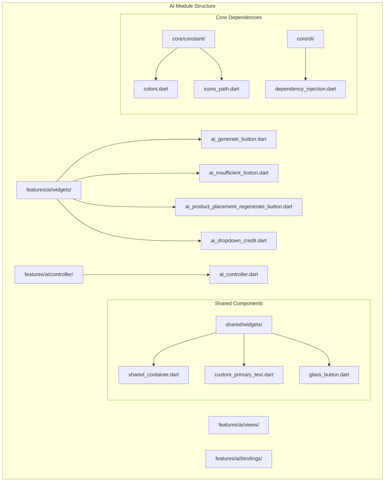
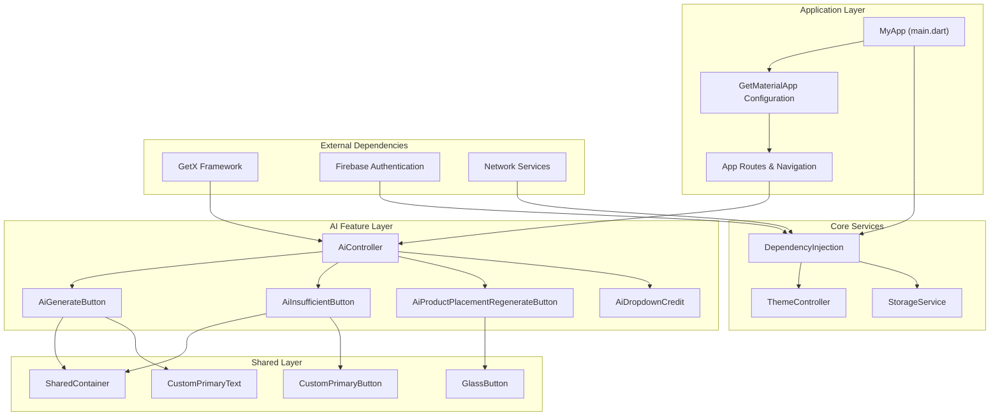
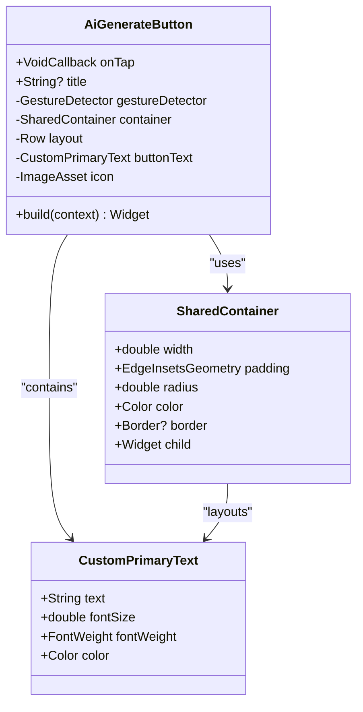
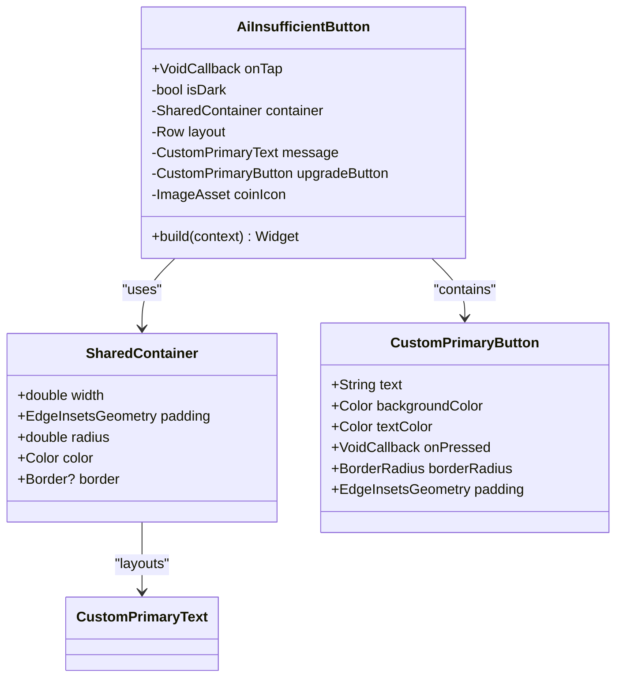
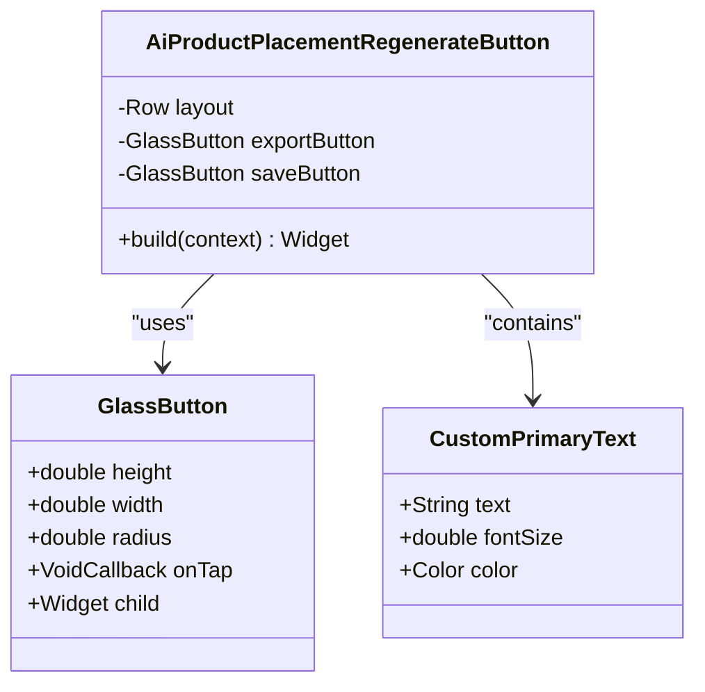
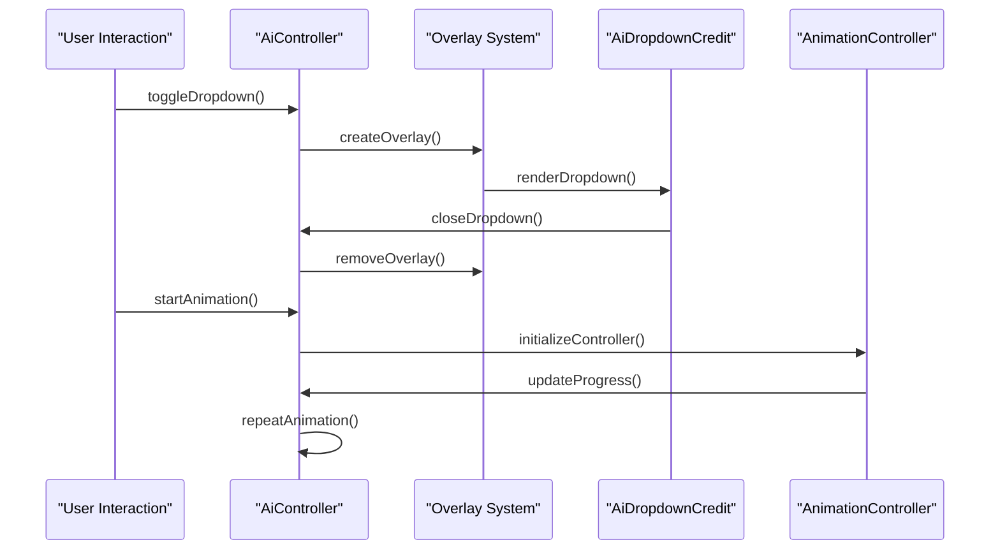
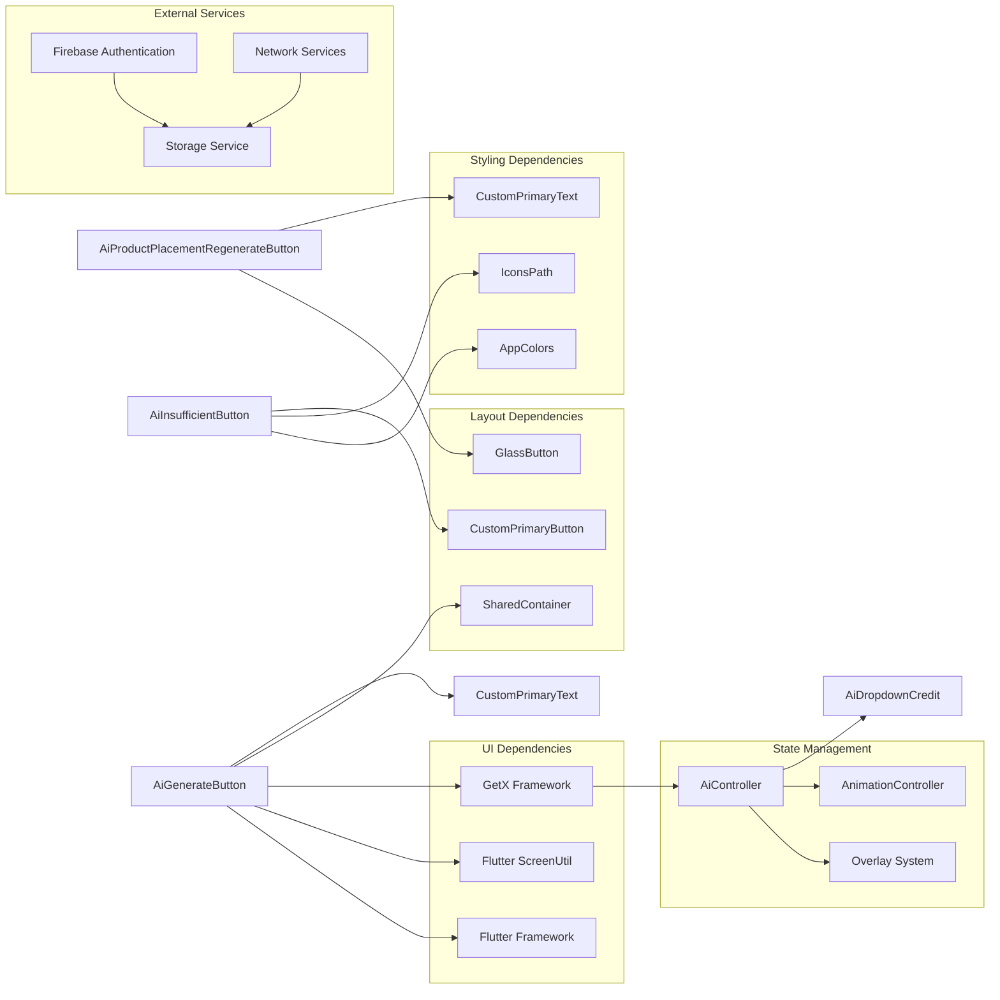

# AI Generate Button Components

<cite>
**Referenced Files in This Document**
- [ai_generate_button.dart](file://lib/features/ai/widgets/ai_generate_button.dart)
- [ai_insufficient_button.dart](file://lib/features/ai/widgets/ai_insufficient_button.dart)
- [ai_product_placement_regenerate_button.dart](file://lib/features/ai/widgets/ai_product_placement_widgets/ai_product_placement_regenerate_button.dart)
- [ai_controller.dart](file://lib/features/ai/controller/ai_controller.dart)
- [ai_dropdown_credit.dart](file://lib/features/ai/widgets/ai_view_widgets/ai_dropdown_credit.dart)
- [credit_transaction_model.dart](file://lib/features/credit_balance/models/credit_transaction_model.dart)
- [main.dart](file://lib/main.dart)
- [app_routes.dart](file://lib/core/routes/app_routes.dart)
- [routes.dart](file://lib/core/routes/routes.dart)
- [dependency_injection.dart](file://lib/core/di/dependency_injection.dart)
- [colors.dart](file://lib/core/constant/colors.dart)
- [icons_path.dart](file://lib/core/constant/icons_path.dart)
- [shared_container.dart](file://lib/shared/widgets/shared_container.dart)
- [custom_primary_text.dart](file://lib/shared/widgets/custom_text/custom_primary_text.dart)
- [glass_button.dart](file://lib/shared/widgets/glass_button.dart)
</cite>

## Table of Contents
1. [Introduction](#introduction)
2. [Project Structure](#project-structure)
3. [Core Components](#core-components)
4. [Architecture Overview](#architecture-overview)
5. [Detailed Component Analysis](#detailed-component-analysis)
6. [Dependency Analysis](#dependency-analysis)
7. [Performance Considerations](#performance-considerations)
8. [Troubleshooting Guide](#troubleshooting-guide)
9. [Conclusion](#conclusion)

## Introduction
This document provides comprehensive documentation for the AI Generate Button Components in the ZB-DEZINE Flutter application. These components form the interactive interface for AI-powered design generation, offering users intuitive controls to initiate AI processes, manage credits, and handle insufficient balance scenarios. The documentation covers component architecture, implementation patterns, integration points, and best practices for extending or modifying these components.

## Project Structure
The AI Generate Button Components are organized within the features/ai module, following Flutter's modular architecture pattern. The structure emphasizes separation of concerns through dedicated directories for widgets, controllers, views, and bindings.

**Diagram sources**
- [ai_generate_button.dart:1-64](file://lib/features/ai/widgets/ai_generate_button.dart#L1-L64)
- [ai_controller.dart:1-121](file://lib/features/ai/controller/ai_controller.dart#L1-L121)
- [shared_container.dart](file://lib/shared/widgets/shared_container.dart)
- [colors.dart](file://lib/core/constant/colors.dart)

**Section sources**
- [ai_generate_button.dart:1-64](file://lib/features/ai/widgets/ai_generate_button.dart#L1-L64)
- [ai_insufficient_button.dart:1-61](file://lib/features/ai/widgets/ai_insufficient_button.dart#L1-L61)
- [ai_product_placement_regenerate_button.dart:1-63](file://lib/features/ai/widgets/ai_product_placement_widgets/ai_product_placement_regenerate_button.dart#L1-L63)

## Core Components
The AI Generate Button ecosystem consists of three primary button components, each serving distinct user interaction scenarios:

### Generate Button Component
The main AI generation button provides a prominent call-to-action for initiating AI-powered design processes. It features a cohesive design with integrated credit cost display and responsive touch feedback.

### Insufficient Credit Button Component
This component handles scenarios where users lack adequate credits for AI generation, providing clear messaging and direct navigation to credit upgrade options.

### Product Placement Regenerate Button
Specialized buttons for export and save actions in product placement workflows, utilizing glass-morphism styling for modern UI aesthetics.

**Section sources**
- [ai_generate_button.dart:8-63](file://lib/features/ai/widgets/ai_generate_button.dart#L8-L63)
- [ai_insufficient_button.dart:9-60](file://lib/features/ai/widgets/ai_insufficient_button.dart#L9-L60)
- [ai_product_placement_regenerate_button.dart:8-62](file://lib/features/ai/widgets/ai_product_placement_widgets/ai_product_placement_regenerate_button.dart#L8-L62)

## Architecture Overview
The AI Generate Button Components integrate with the broader application architecture through GetX state management, dependency injection, and modular routing systems.

**Diagram sources**
- [main.dart:12-46](file://lib/main.dart#L12-L46)
- [ai_controller.dart:7-120](file://lib/features/ai/controller/ai_controller.dart#L7-L120)
- [dependency_injection.dart](file://lib/core/di/dependency_injection.dart)

**Section sources**
- [main.dart:1-47](file://lib/main.dart#L1-L47)
- [ai_controller.dart:1-121](file://lib/features/ai/controller/ai_controller.dart#L1-L121)

## Detailed Component Analysis

### AiGenerateButton Component
The AiGenerateButton serves as the primary interface for initiating AI generation workflows. It implements a clean, accessible design with clear visual hierarchy and consistent styling.

**Diagram sources**
- [ai_generate_button.dart:8-63](file://lib/features/ai/widgets/ai_generate_button.dart#L8-L63)
- [shared_container.dart](file://lib/shared/widgets/shared_container.dart)
- [custom_primary_text.dart](file://lib/shared/widgets/custom_text/custom_primary_text.dart)

#### Component Features
- **Responsive Design**: Utilizes Flutter ScreenUtil for adaptive sizing across devices
- **Visual Hierarchy**: Clear icon-text pairing with credit cost display
- **Interactive Feedback**: Touch-enabled gesture detection with ripple effects
- **Consistent Styling**: Integrated with global color scheme and typography system

#### Implementation Details
The component follows Flutter's StatelessWidget pattern with optimized rendering through proper widget composition. The design incorporates Material Design principles with custom styling for brand consistency.

**Section sources**
- [ai_generate_button.dart:1-64](file://lib/features/ai/widgets/ai_generate_button.dart#L1-L64)

### AiInsufficientButton Component
The AiInsufficientButton handles user experience when credit balances are insufficient for AI generation, providing clear messaging and direct upgrade pathways.

**Diagram sources**
- [ai_insufficient_button.dart:9-60](file://lib/features/ai/widgets/ai_insufficient_button.dart#L9-L60)
- [shared_container.dart](file://lib/shared/widgets/shared_container.dart)
- [custom_primary_button.dart](file://lib/shared/widgets/custom_button/custom_primary_button.dart)

#### Component Features
- **Dynamic Theming**: Automatic light/dark mode adaptation
- **Clear Messaging**: Distinct error state communication
- **Actionable Upgrade Path**: Direct navigation to credit purchase
- **Visual Feedback**: Appropriate color schemes for error states

**Section sources**
- [ai_insufficient_button.dart:1-61](file://lib/features/ai/widgets/ai_insufficient_button.dart#L1-L61)

### AiProductPlacementRegenerateButton Component
Specialized button pair for product placement workflows, featuring export and save functionality with glass-morphism styling.

**Diagram sources**
- [ai_product_placement_regenerate_button.dart:8-62](file://lib/features/ai/widgets/ai_product_placement_widgets/ai_product_placement_regenerate_button.dart#L8-L62)
- [glass_button.dart](file://lib/shared/widgets/glass_button.dart)

**Section sources**
- [ai_product_placement_regenerate_button.dart:1-63](file://lib/features/ai/widgets/ai_product_placement_widgets/ai_product_placement_regenerate_button.dart#L1-L63)

### AiController Integration
The AiController manages state and interactions for AI-related components, coordinating dropdown menus, animations, and overlay management.

**Diagram sources**
- [ai_controller.dart:59-93](file://lib/features/ai/controller/ai_controller.dart#L59-L93)

**Section sources**
- [ai_controller.dart:1-121](file://lib/features/ai/controller/ai_controller.dart#L1-L121)

## Dependency Analysis
The AI Generate Button Components rely on several core dependencies and architectural patterns:

**Diagram sources**
- [ai_generate_button.dart:1-7](file://lib/features/ai/widgets/ai_generate_button.dart#L1-L7)
- [ai_controller.dart:1-8](file://lib/features/ai/controller/ai_controller.dart#L1-L8)
- [colors.dart](file://lib/core/constant/colors.dart)
- [icons_path.dart](file://lib/core/constant/icons_path.dart)

**Section sources**
- [ai_generate_button.dart:1-64](file://lib/features/ai/widgets/ai_generate_button.dart#L1-L64)
- [ai_insufficient_button.dart:1-61](file://lib/features/ai/widgets/ai_insufficient_button.dart#L1-L61)
- [ai_product_placement_regenerate_button.dart:1-63](file://lib/features/ai/widgets/ai_product_placement_widgets/ai_product_placement_regenerate_button.dart#L1-L63)
- [ai_controller.dart:1-121](file://lib/features/ai/controller/ai_controller.dart#L1-L121)

## Performance Considerations
The AI Generate Button Components are designed with performance optimization in mind:

### Rendering Optimization
- **Lightweight Widgets**: Stateless components minimize rebuild overhead
- **Efficient Layouts**: Single-pass rendering through Row and Column widgets
- **Minimal State Updates**: Optimized state management through GetX framework

### Memory Management
- **Proper Disposal**: Animation controllers and overlay entries are properly disposed
- **Resource Cleanup**: Overlay entries removed when components are disposed
- **Lazy Loading**: Dropdown content loaded only when needed

### Accessibility Features
- **Touch Targets**: Sufficiently sized interactive areas (minimum 48px)
- **Color Contrast**: High contrast ratios for text and icons
- **Responsive Design**: Adaptive layouts for various screen sizes

## Troubleshooting Guide

### Common Issues and Solutions

#### Button Not Responding
**Symptoms**: Buttons appear but don't trigger callbacks
**Causes**: 
- Missing onTap callback implementation
- Gesture detection conflicts
- Overlay blocking interactions

**Solutions**:
- Verify VoidCallback implementation in parent widgets
- Check for overlapping overlay widgets
- Ensure proper widget tree hierarchy

#### Styling Issues
**Symptoms**: Incorrect colors, sizing, or positioning
**Causes**:
- Theme context not properly applied
- ScreenUtil configuration errors
- Missing asset paths

**Solutions**:
- Verify theme context availability
- Check ScreenUtil initialization
- Confirm asset paths in IconsPath constants

#### Animation Problems
**Symptoms**: Smooth animations not working
**Causes**:
- AnimationController not properly initialized
- VSync provider issues
- Memory leaks in animation lifecycle

**Solutions**:
- Ensure AnimationController disposal in onClose()
- Verify GetSingleTickerProviderStateMixin implementation
- Check for proper animation lifecycle management

**Section sources**
- [ai_controller.dart:115-119](file://lib/features/ai/controller/ai_controller.dart#L115-L119)
- [ai_generate_button.dart:14-17](file://lib/features/ai/widgets/ai_generate_button.dart#L14-L17)

## Conclusion
The AI Generate Button Components represent a well-architected solution for AI-powered design generation interfaces. Through thoughtful component design, robust state management, and comprehensive integration with the application's architecture, these components provide users with intuitive, accessible, and visually appealing controls for AI functionality. The modular structure facilitates easy maintenance, extension, and customization while maintaining consistency with the overall application design system.

The components demonstrate best practices in Flutter development including proper state management, efficient rendering, accessibility compliance, and responsive design. Future enhancements could include expanded customization options, additional interaction states, and integration with real-time credit balance updates.