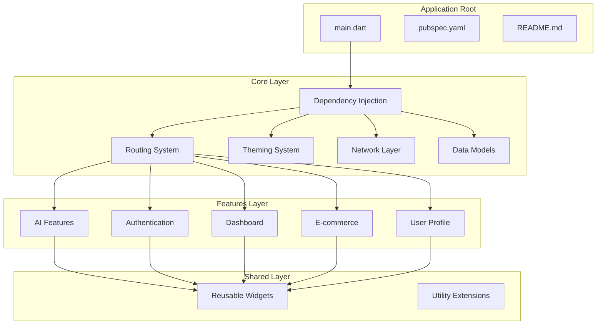
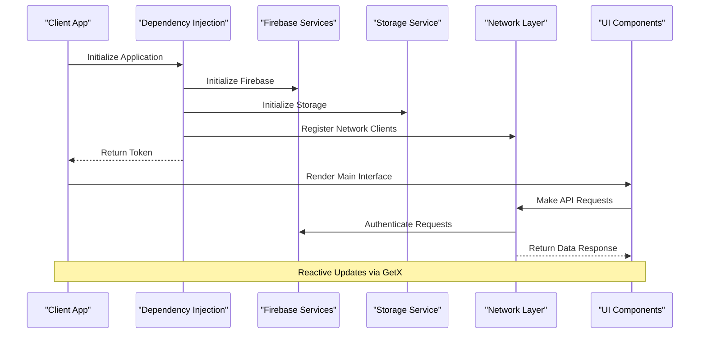
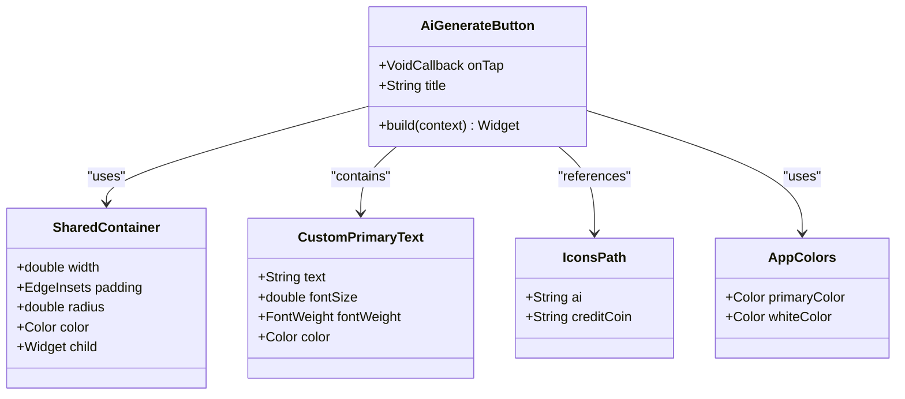
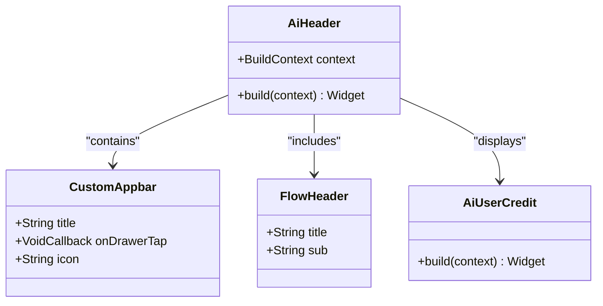
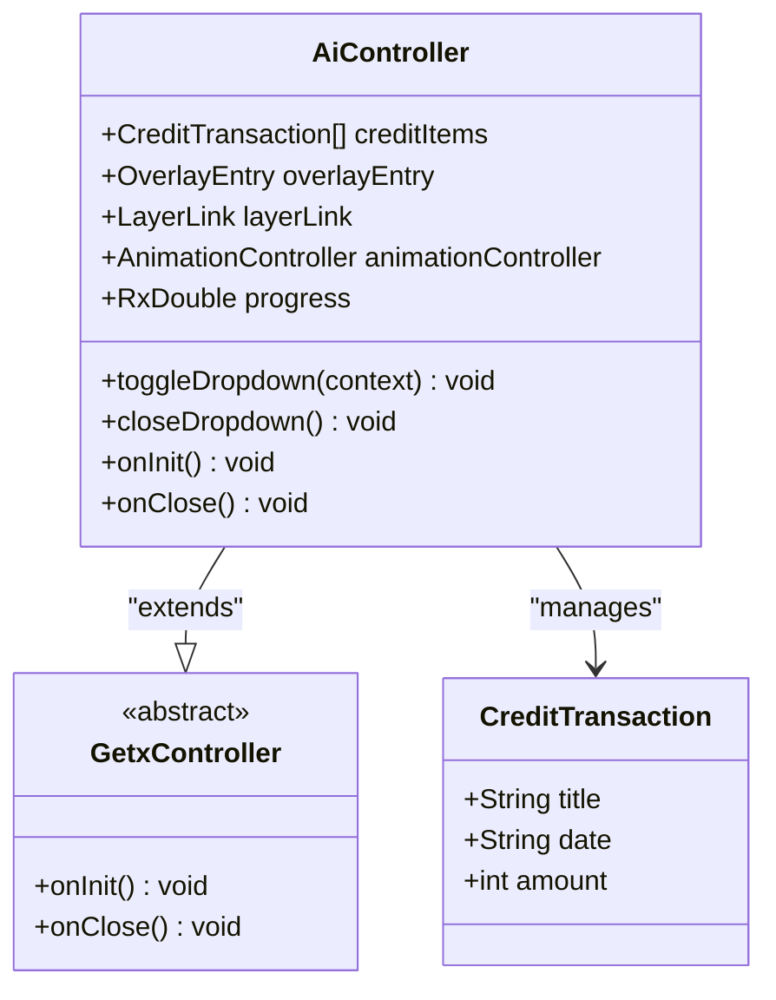
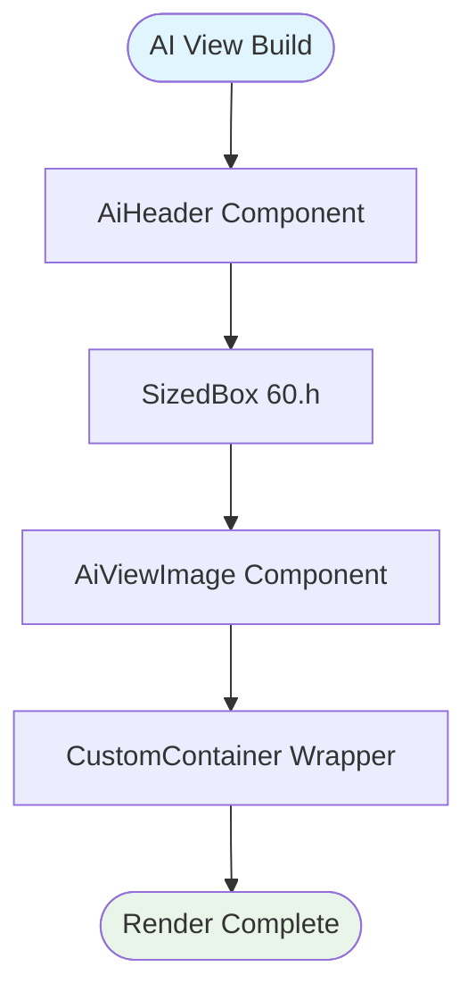

# AI Interior Design Widget Library

<cite>
**Referenced Files in This Document**
- [pubspec.yaml](file://pubspec.yaml)
- [README.md](file://README.md)
- [main.dart](file://lib/main.dart)
- [dependency_injection.dart](file://lib/core/di/dependency_injection.dart)
- [app_routes.dart](file://lib/core/routes/app_routes.dart)
- [app_theme.dart](file://lib/core/theme/app_theme.dart)
- [get_network.dart](file://lib/core/data/networks/get_network.dart)
- [ai_generate_button.dart](file://lib/features/ai/widgets/ai_generate_button.dart)
- [ai_header.dart](file://lib/features/ai/widgets/ai_header.dart)
- [ai_controller.dart](file://lib/features/ai/controller/ai_controller.dart)
- [ai_view.dart](file://lib/features/ai/views/ai_view.dart)
</cite>

## Table of Contents
1. [Introduction](#introduction)
2. [Project Structure](#project-structure)
3. [Core Components](#core-components)
4. [Architecture Overview](#architecture-overview)
5. [Detailed Component Analysis](#detailed-component-analysis)
6. [Widget Library Implementation](#widget-library-implementation)
7. [Dependency Management](#dependency-management)
8. [Performance Considerations](#performance-considerations)
9. [Integration Guide](#integration-guide)
10. [Conclusion](#conclusion)

## Introduction

The AI Interior Design Widget Library is a comprehensive Flutter-based solution designed to provide developers with reusable UI components and functionality for creating AI-powered interior design applications. This library focuses on streamlining the development of features such as AI-generated room designs, product placement, and interactive design tools.

The project follows modern Flutter architecture patterns with dependency injection, reactive programming using GetX, and modular feature-based organization. It integrates seamlessly with Firebase for authentication and backend services, while providing a robust foundation for AI-driven design experiences.

## Project Structure

The project is organized using a feature-based architecture pattern that promotes modularity and maintainability. The structure separates concerns into distinct directories for core functionality, features, and shared components.

**Diagram sources**
- [main.dart:12-47](file://lib/main.dart#L12-L47)
- [dependency_injection.dart:13-32](file://lib/core/di/dependency_injection.dart#L13-L32)
- [app_routes.dart:1-46](file://lib/core/routes/app_routes.dart#L1-L46)

**Section sources**
- [main.dart:1-47](file://lib/main.dart#L1-L47)
- [pubspec.yaml:1-119](file://pubspec.yaml#L1-L119)

## Core Components

The AI Interior Design Widget Library consists of several core components that work together to provide a cohesive development experience:

### Dependency Injection System
The dependency injection system initializes Firebase, storage services, and network clients. It manages the lifecycle of services and makes them available throughout the application.

### Routing and Navigation
The routing system provides centralized navigation with named routes for different application screens, supporting both authenticated and unauthenticated user flows.

### Theming System
A comprehensive theming system with light and dark themes, supporting Material Design 3 principles and custom color schemes.

### Network Layer
A robust network layer built on top of the HTTP package with proper error handling and response parsing capabilities.

**Section sources**
- [dependency_injection.dart:14-30](file://lib/core/di/dependency_injection.dart#L14-L30)
- [app_routes.dart:1-46](file://lib/core/routes/app_routes.dart#L1-L46)
- [app_theme.dart:4-23](file://lib/core/theme/app_theme.dart#L4-L23)
- [get_network.dart:9-42](file://lib/core/data/networks/get_network.dart#L9-L42)

## Architecture Overview

The application follows a layered architecture pattern with clear separation of concerns:

**Diagram sources**
- [main.dart:12-19](file://lib/main.dart#L12-L19)
- [dependency_injection.dart:14-30](file://lib/core/di/dependency_injection.dart#L14-L30)

The architecture emphasizes:
- **Separation of Concerns**: Clear boundaries between UI, business logic, and data layers
- **Reactive Programming**: Using GetX for state management and reactive updates
- **Modular Design**: Feature-based organization promoting code reusability
- **Dependency Injection**: Centralized service management and testing support

## Detailed Component Analysis

### AI Widget Library Components

The AI widget library provides specialized components for AI-powered interior design functionality:

#### AI Generate Button Component
The AI Generate Button is a customizable component that encapsulates the core functionality for triggering AI generation with visual feedback and credit deduction indicators.

**Diagram sources**
- [ai_generate_button.dart:8-64](file://lib/features/ai/widgets/ai_generate_button.dart#L8-L64)

#### AI Header Component
The AI Header component provides a standardized header layout for AI-related screens, including navigation controls, flow indicators, and user credit display.

**Diagram sources**
- [ai_header.dart:9-32](file://lib/features/ai/widgets/ai_header.dart#L9-L32)

#### AI Controller Component
The AI Controller manages the state and behavior of AI-related functionality, including overlay dropdowns, animation controllers, and credit transaction management.

**Diagram sources**
- [ai_controller.dart:7-121](file://lib/features/ai/controller/ai_controller.dart#L7-L121)

**Section sources**
- [ai_generate_button.dart:1-64](file://lib/features/ai/widgets/ai_generate_button.dart#L1-L64)
- [ai_header.dart:1-32](file://lib/features/ai/widgets/ai_header.dart#L1-L32)
- [ai_controller.dart:1-121](file://lib/features/ai/controller/ai_controller.dart#L1-L121)

### AI View Component

The AI View component serves as the main container for AI-related functionality, orchestrating the layout and interaction between various AI widgets.

**Diagram sources**
- [ai_view.dart:7-25](file://lib/features/ai/views/ai_view.dart#L7-L25)

**Section sources**
- [ai_view.dart:1-25](file://lib/features/ai/views/ai_view.dart#L1-L25)

## Widget Library Implementation

The widget library follows Flutter best practices for component design and reusability:

### Component Composition Pattern
Widgets are designed using composition over inheritance, allowing for flexible customization and extension. Each component encapsulates its own state and behavior while providing clear interfaces for customization.

### Responsive Design Integration
All widgets integrate with Flutter ScreenUtil for responsive design, ensuring consistent sizing across different device sizes and orientations.

### State Management
The library leverages GetX for reactive state management, providing efficient updates and reduced boilerplate code compared to traditional setState approaches.

### Theming Integration
Components consistently use the application's theming system, ensuring visual consistency and easy customization through theme modifications.

**Section sources**
- [ai_generate_button.dart:14-62](file://lib/features/ai/widgets/ai_generate_button.dart#L14-L62)
- [ai_header.dart:17-30](file://lib/features/ai/widgets/ai_header.dart#L17-L30)

## Dependency Management

The project utilizes a comprehensive set of dependencies optimized for the AI interior design use case:

### Core Dependencies
- **GetX**: Provides reactive state management, dependency injection, and navigation
- **Firebase**: Enables authentication, cloud services, and real-time functionality
- **Flutter ScreenUtil**: Ensures responsive design across device sizes
- **Google Fonts**: Provides typography flexibility and customization

### AI and Design Dependencies
- **Glassmorphism**: Enables modern glass-like UI effects
- **Animate Do**: Provides animation capabilities for enhanced user experience
- **Cached Network Image**: Optimizes image loading and caching for design assets

### Development Dependencies
- **Flutter Lints**: Enforces code quality and consistency standards
- **Testing Framework**: Supports comprehensive testing strategies

**Section sources**
- [pubspec.yaml:30-67](file://pubspec.yaml#L30-L67)
- [pubspec.yaml:68-78](file://pubspec.yaml#L68-L78)

## Performance Considerations

The AI Interior Design Widget Library incorporates several performance optimization strategies:

### Memory Management
- Proper disposal of AnimationControllers and OverlayEntries
- Efficient use of GetX for reactive updates
- Lazy loading of heavy components and images

### Network Optimization
- Centralized error handling with fallback mechanisms
- Proper HTTP status code handling
- JSON parsing optimization with type safety

### UI Performance
- Stateless widget design for optimal rebuild performance
- Efficient use of Flutter's rendering pipeline
- Responsive design considerations for smooth animations

## Integration Guide

### Basic Setup
1. Add the required dependencies to your `pubspec.yaml` file
2. Initialize Firebase services in your application
3. Configure the dependency injection system
4. Import and use AI widgets in your application

### Customization Options
- Modify colors through the central color management system
- Adjust typography using Google Fonts integration
- Customize animations through the AnimationController configuration
- Extend components by composing existing widgets

### Best Practices
- Use the provided dependency injection system for service management
- Leverage GetX for state management consistency
- Follow the established folder structure for new features
- Utilize the theming system for visual consistency

**Section sources**
- [main.dart:12-47](file://lib/main.dart#L12-L47)
- [dependency_injection.dart:14-30](file://lib/core/di/dependency_injection.dart#L14-L30)

## Conclusion

The AI Interior Design Widget Library provides a comprehensive foundation for building AI-powered interior design applications. Its modular architecture, extensive widget library, and integration with modern Flutter development practices make it an ideal choice for developers looking to create sophisticated design applications.

The library's emphasis on reusability, performance, and maintainability ensures that it can scale effectively as applications grow in complexity. The integration with Firebase and modern Flutter features positions it well for future enhancements and feature additions.

By following the established patterns and utilizing the provided components, developers can accelerate their development process while maintaining high code quality and user experience standards.