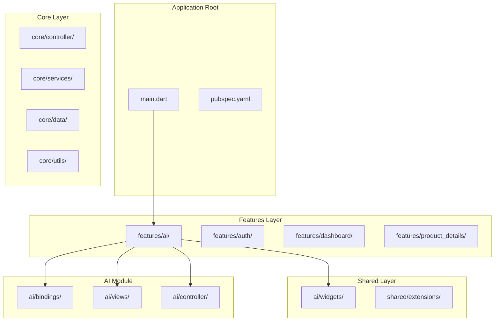
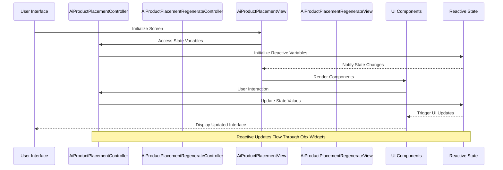
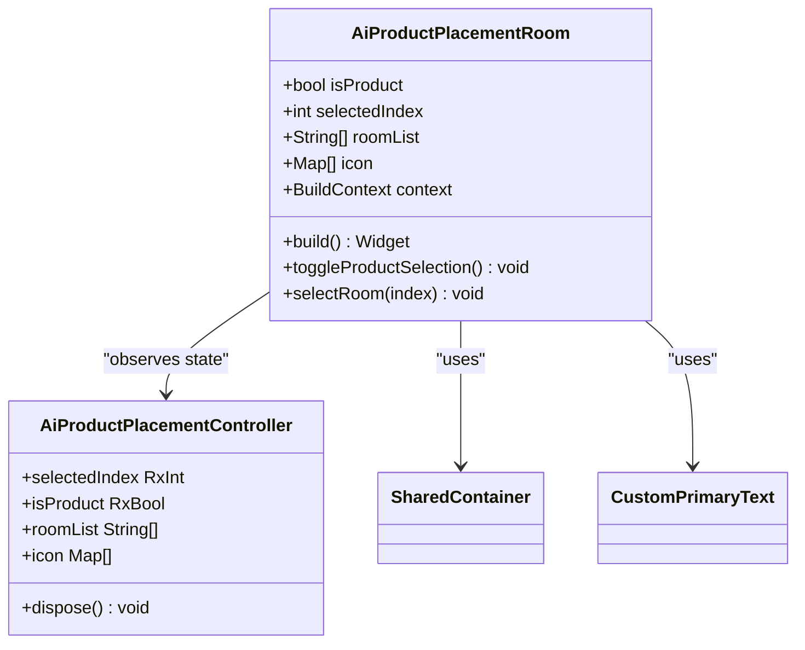
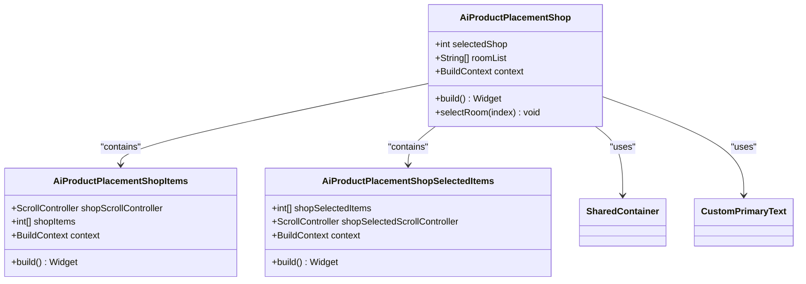
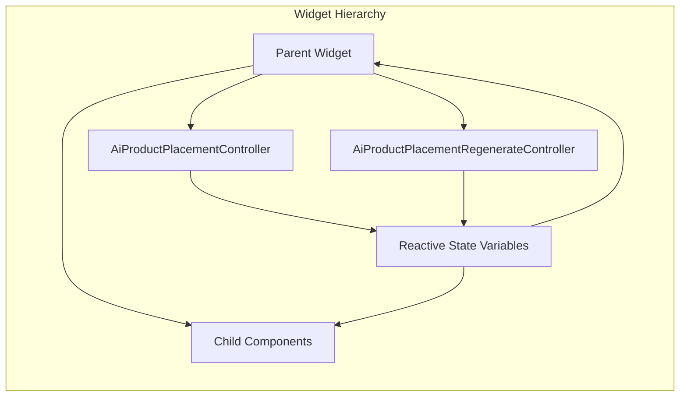
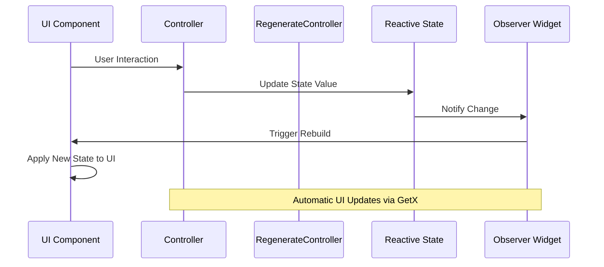
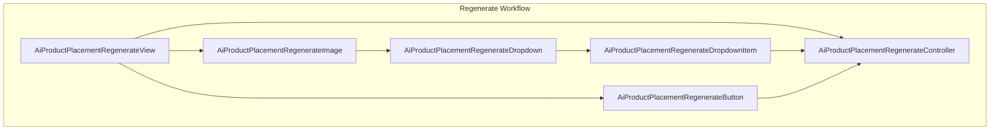
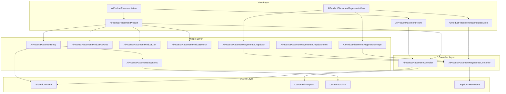

# AI Product Placement Widget Library

<cite>
**Referenced Files in This Document**
- [pubspec.yaml](file://pubspec.yaml)
- [main.dart](file://lib/main.dart)
- [ai_product_placement_controller.dart](file://lib/features/ai/controller/ai_product_placement_controller.dart)
- [ai_product_placement_view.dart](file://lib/features/ai/views/ai_product_placement_view.dart)
- [ai_product_placement_room.dart](file://lib/features/ai/widgets/ai_product_placement_widgets/ai_product_placement_room.dart)
- [ai_product_placement_product.dart](file://lib/features/ai/widgets/ai_product_placement_widgets/ai_product_placement_product.dart)
- [ai_product_placement_shop.dart](file://lib/features/ai/widgets/ai_product_placement_widgets/ai_product_placement_shop.dart)
- [ai_product_placement_shop_items.dart](file://lib/features/ai/widgets/ai_product_placement_widgets/ai_product_placement_shop_items.dart)
- [ai_product_placement_regenerate_controller.dart](file://lib/features/ai/controller/ai_product_placement_regenerate_controller.dart)
- [ai_product_placement_regenerate_view.dart](file://lib/features/ai/views/ai_product_placement_regenerate_view.dart)
- [ai_product_placement_regenerate_dropdown.dart](file://lib/features/ai/widgets/ai_product_placement_widgets/ai_product_placement_regenerate_dropdown.dart)
- [ai_product_placement_regenerate_dropdown_item.dart](file://lib/features/ai/widgets/ai_product_placement_widgets/ai_product_placement_regenerate_dropdown_item.dart)
- [ai_product_placement_regenerate_image.dart](file://lib/features/ai/widgets/ai_product_placement_widgets/ai_product_placement_regenerate_image.dart)
- [ai_product_placement_regenerate_button.dart](file://lib/features/ai/widgets/ai_product_placement_widgets/ai_product_placement_regenerate_button.dart)
- [ai_product_placement_regenerate_bindings.dart](file://lib/features/ai/bindings/ai_product_placement_regenerate_bindings.dart)
- [dropdown_menu_item.dart](file://lib/shared/widgets/custom_dropdown/dropdown_menu_item.dart)
</cite>

## Update Summary
**Changes Made**
- Added comprehensive documentation for the new AI Product Placement Regenerate functionality
- Updated widget library implementation section to include regenerate components
- Enhanced state management system documentation to cover regenerate controller
- Added new section covering the AI Product Placement Regenerate Feature
- Updated architecture overview to include regenerate functionality

## Table of Contents
1. [Introduction](#introduction)
2. [Project Structure](#project-structure)
3. [Core Components](#core-components)
4. [Architecture Overview](#architecture-overview)
5. [Detailed Component Analysis](#detailed-component-analysis)
6. [Widget Library Implementation](#widget-library-implementation)
7. [State Management System](#state-management-system)
8. [AI Product Placement Regenerate Feature](#ai-product-placement-regenerate-feature)
9. [UI Component Architecture](#ui-component-architecture)
10. [Performance Considerations](#performance-considerations)
11. [Integration Guide](#integration-guide)
12. [Conclusion](#conclusion)

## Introduction

The AI Product Placement Widget Library is a comprehensive Flutter solution designed to enable users to virtually place products within various room environments using artificial intelligence. This library provides an intuitive interface for selecting rooms, browsing product catalogs, managing favorites, and organizing shopping carts, all integrated with AI-powered placement capabilities.

The library leverages modern Flutter architecture patterns including GetX for state management, reactive programming with Obx widgets, and modular component design. It supports both light and dark themes, responsive layouts, and smooth animations for enhanced user experience.

**Updated** Enhanced with new AI Product Placement Regenerate functionality for improved user interaction and clearer text content.

## Project Structure

The AI Product Placement Widget Library follows a well-organized Flutter project structure with clear separation of concerns:



**Diagram sources**
- [main.dart:1-47](file://lib/main.dart#L1-L47)
- [pubspec.yaml:1-119](file://pubspec.yaml#L1-L119)

**Section sources**
- [main.dart:1-47](file://lib/main.dart#L1-L47)
- [pubspec.yaml:1-119](file://pubspec.yaml#L1-L119)

## Core Components

The AI Product Placement system consists of several interconnected components working together to provide a seamless user experience:

### State Management Controller
The [`AiProductPlacementController`:1-123](file://lib/features/ai/controller/ai_product_placement_controller.dart#L1-L123) serves as the central state manager, handling:
- Room selection and navigation state
- Product catalog interactions
- Shopping cart management
- Favorite items tracking
- Scroll position management
- Search functionality

### Regenerate Functionality Controller
The [`AiProductPlacementRegenerateController`:1-16](file://lib/features/ai/controller/ai_product_placement_regenerate_controller.dart#L1-L16) manages the AI regeneration workflow:
- Dropdown item selection state
- Regenerate modal visibility
- Selected product identification
- Dynamic label generation for selected items

### View Components
The [`AiProductPlacementView`:1-31](file://lib/features/ai/views/ai_product_placement_view.dart#L1-L31) provides the main interface containing:
- Header navigation
- Room selection area
- Product placement canvas
- Interactive elements

The [`AiProductPlacementRegenerateView`:1-62](file://lib/features/ai/views/ai_product_placement_regenerate_view.dart#L1-L62) extends the functionality with:
- Image preview container
- Regenerate action button
- Modal overlay for customization options

### Widget Library
The system includes a comprehensive set of reusable widgets organized by functionality:
- Room selection widgets
- Product browsing components
- Shopping cart interfaces
- Favorite management tools
- Search and filtering mechanisms
- **New** Regenerate functionality widgets

**Section sources**
- [ai_product_placement_controller.dart:1-123](file://lib/features/ai/controller/ai_product_placement_controller.dart#L1-L123)
- [ai_product_placement_view.dart:1-31](file://lib/features/ai/views/ai_product_placement_view.dart#L1-L31)
- [ai_product_placement_regenerate_controller.dart:1-16](file://lib/features/ai/controller/ai_product_placement_regenerate_controller.dart#L1-L16)

## Architecture Overview

The AI Product Placement Widget Library implements a reactive architecture pattern built on Flutter's GetX framework:



**Diagram sources**
- [ai_product_placement_controller.dart:1-123](file://lib/features/ai/controller/ai_product_placement_controller.dart#L1-L123)
- [ai_product_placement_view.dart:1-31](file://lib/features/ai/views/ai_product_placement_view.dart#L1-L31)

The architecture follows these key principles:
- **Reactive State Management**: Uses GetX's reactive system for automatic UI updates
- **Modular Design**: Clear separation between views, controllers, and widgets
- **Component Reusability**: Shared widgets across different screens and contexts
- **Theme Support**: Built-in light and dark mode compatibility
- **Enhanced Functionality**: Integrated regenerate feature with dedicated controller

## Detailed Component Analysis

### Room Selection Component

The [`AiProductPlacementRoom`:1-124](file://lib/features/ai/widgets/ai_product_placement_widgets/ai_product_placement_room.dart#L1-L124) component provides an intuitive interface for room selection:



**Diagram sources**
- [ai_product_placement_room.dart:11-124](file://lib/features/ai/widgets/ai_product_placement_widgets/ai_product_placement_room.dart#L11-L124)
- [ai_product_placement_controller.dart:5-38](file://lib/features/ai/controller/ai_product_placement_controller.dart#L5-L38)

**Section sources**
- [ai_product_placement_room.dart:1-124](file://lib/features/ai/widgets/ai_product_placement_widgets/ai_product_placement_room.dart#L1-L124)

### Product Selection Interface

The [`AiProductPlacementProduct`:1-137](file://lib/features/ai/widgets/ai_product_placement_widgets/ai_product_placement_product.dart#L1-L137) component manages the product selection workflow:


**Diagram sources**
- [ai_product_placement_product.dart:16-137](file://lib/features/ai/widgets/ai_product_placement_widgets/ai_product_placement_product.dart#L16-L137)

**Section sources**
- [ai_product_placement_product.dart:1-137](file://lib/features/ai/widgets/ai_product_placement_widgets/ai_product_placement_product.dart#L1-L137)

### Shopping Interface Component

The [`AiProductPlacementShop`:1-61](file://lib/features/ai/widgets/ai_product_placement_widgets/ai_product_placement_shop.dart#L1-L61) provides a comprehensive shopping experience:



**Diagram sources**
- [ai_product_placement_shop.dart:11-61](file://lib/features/ai/widgets/ai_product_placement_widgets/ai_product_placement_shop.dart#L11-L61)
- [ai_product_placement_shop_items.dart:10-64](file://lib/features/ai/widgets/ai_product_placement_widgets/ai_product_placement_shop_items.dart#L10-L64)

**Section sources**
- [ai_product_placement_shop.dart:1-61](file://lib/features/ai/widgets/ai_product_placement_widgets/ai_product_placement_shop.dart#L1-L61)
- [ai_product_placement_shop_items.dart:1-64](file://lib/features/ai/widgets/ai_product_placement_widgets/ai_product_placement_shop_items.dart#L1-L64)

## Widget Library Implementation

The AI Product Placement Widget Library provides a comprehensive collection of reusable UI components:

### Core Widget Categories

| Widget Category | Purpose | Key Features |
|----------------|---------|--------------|
| **Room Selection** | Room type selection interface | Animated transitions, theme-aware styling |
| **Product Catalog** | Product browsing and selection | Grid layout, selection state management |
| **Shopping Cart** | Cart management interface | Multi-item selection, scroll synchronization |
| **Favorites System** | Favorite items management | Toggle functionality, visual feedback |
| **Search Interface** | Product search functionality | Real-time filtering, input validation |
| **Regenerate Feature** | AI image regeneration interface | Dropdown selection, modal overlay, clear instructions |

### Component Composition Pattern

Each widget follows a consistent composition pattern:



**Diagram sources**
- [ai_product_placement_controller.dart:1-123](file://lib/features/ai/controller/ai_product_placement_controller.dart#L1-L123)
- [ai_product_placement_regenerate_controller.dart:1-16](file://lib/features/ai/controller/ai_product_placement_regenerate_controller.dart#L1-L16)

### Responsive Design Implementation

The widget library implements responsive design through:
- **ScreenUtil Integration**: Consistent scaling across device sizes
- **Flexible Layouts**: Adaptive grid systems for different screen orientations
- **Dynamic Sizing**: Percentage-based dimensions for optimal fit
- **Theme-Aware Components**: Automatic light/dark mode adaptation

**Section sources**
- [ai_product_placement_room.dart:1-124](file://lib/features/ai/widgets/ai_product_placement_widgets/ai_product_placement_room.dart#L1-L124)
- [ai_product_placement_product.dart:1-137](file://lib/features/ai/widgets/ai_product_placement_widgets/ai_product_placement_product.dart#L1-L137)

## State Management System

The AI Product Placement system utilizes GetX's reactive state management for efficient UI updates:

### State Variables Overview

| State Variable | Type | Purpose | Reactive |
|---------------|------|---------|----------|
| `selectedIndex` | `RxInt` | Currently selected room index | ✅ |
| `selectedShop` | `RxInt` | Currently selected shop tab | ✅ |
| `isProduct` | `RxBool` | Product placement mode flag | ✅ |
| `isProductExpand` | `RxInt` | Expanded view state | ✅ |
| `isReplace` | `RxInt` | Replacement mode indicator | ✅ |
| `shopSelectedItems` | `RxList<int>` | Selected shop items | ✅ |
| `favoriteSelectedItems` | `RxList<int>` | Selected favorite items | ✅ |
| `cartSelectedItems` | `RxList<int>` | Selected cart items | ✅ |
| **New** `isRegenerate` | `RxBool` | Regenerate modal visibility | ✅ |
| **New** `selectedIndex` | `RxInt` | Selected regenerate item | ✅ |

### State Update Flow



**Diagram sources**
- [ai_product_placement_controller.dart:1-123](file://lib/features/ai/controller/ai_product_placement_controller.dart#L1-L123)

**Section sources**
- [ai_product_placement_controller.dart:1-123](file://lib/features/ai/controller/ai_product_placement_controller.dart#L1-L123)

## AI Product Placement Regenerate Feature

**New Section** The AI Product Placement Regenerate Feature provides users with enhanced control over AI-generated product placements through a streamlined interface.

### Regenerate Controller Architecture

The [`AiProductPlacementRegenerateController`:1-16](file://lib/features/ai/controller/ai_product_placement_regenerate_controller.dart#L1-L16) manages the regenerate workflow:

```mermaid
classDiagram
class AiProductPlacementRegenerateController {
+List items
+RxInt selectedIndex
+RxBool isRegenerate
+String selectedLabel
+items : [{'title' : 'Sofa 1', 'image' : ImagesPath.chair}, ...]
+selectedIndex : 0.obs
+isRegenerate : false.obs
+selectedLabel : '@img${selectedIndex.value + 1}'
}
class RegenerateDropdown {
+PopupMenuButton
+Dropdown styling
+Item selection logic
}
class RegenerateImage {
+Modal overlay
+Instruction text
+Dropdown integration
}
AiProductPlacementRegenerateController --> RegenerateDropdown : "controls"
AiProductPlacementRegenerateController --> RegenerateImage : "manages state"
```

**Diagram sources**
- [ai_product_placement_regenerate_controller.dart:4-15](file://lib/features/ai/controller/ai_product_placement_regenerate_controller.dart#L4-L15)
- [ai_product_placement_regenerate_dropdown.dart:9-58](file://lib/features/ai/widgets/ai_product_placement_widgets/ai_product_placement_regenerate_dropdown.dart#L9-L58)
- [ai_product_placement_regenerate_image.dart:12-112](file://lib/features/ai/widgets/ai_product_placement_widgets/ai_product_placement_regenerate_image.dart#L12-112)

### Simplified Dropdown Logic

**Updated** The dropdown item background color logic has been significantly simplified:

#### Previous Complex Logic
- Multiple conditional checks for background colors
- Complex alpha value calculations
- Inconsistent styling across selection states

#### Current Simplified Logic
- Single background color assignment with consistent alpha
- Streamlined selection state handling
- Improved readability and maintainability

The [`AiProductPlacementRegenerateDropdownItem`:1-93](file://lib/features/ai/widgets/ai_product_placement_widgets/ai_product_placement_regenerate_dropdown_item.dart#L1-L93) now uses:
- Consistent black background with 0.5 alpha transparency
- Simplified selection state detection
- Cleaner visual hierarchy

### Refined Text Content

**Updated** Text content has been refined for better clarity and user guidance:

The [`AiProductPlacementRegenerateImage`:1-112](file://lib/features/ai/widgets/ai_product_placement_widgets/ai_product_placement_regenerate_image.dart#L1-L112) now features:

#### Enhanced Instruction Text
- **Previous**: Generic instruction about AI adjustments
- **Updated**: Specific guidance: "Add your requirements Tell us how you'd like the placement to look or if there are specific adjustments you'd like the AI to make."

#### Improved Clarity
- More descriptive action instructions
- Better explanation of regenerate functionality
- Clearer communication of AI capabilities

### Component Integration



**Diagram sources**
- [ai_product_placement_regenerate_view.dart:13-62](file://lib/features/ai/views/ai_product_placement_regenerate_view.dart#L13-L62)
- [ai_product_placement_regenerate_button.dart:8-63](file://lib/features/ai/widgets/ai_product_placement_widgets/ai_product_placement_regenerate_button.dart#L8-L63)
- [ai_product_placement_regenerate_image.dart:12-112](file://lib/features/ai/widgets/ai_product_placement_widgets/ai_product_placement_regenerate_image.dart#L12-112)
- [ai_product_placement_regenerate_dropdown.dart:9-58](file://lib/features/ai/widgets/ai_product_placement_widgets/ai_product_placement_regenerate_dropdown.dart#L9-L58)
- [ai_product_placement_regenerate_dropdown_item.dart:9-93](file://lib/features/ai/widgets/ai_product_placement_widgets/ai_product_placement_regenerate_dropdown_item.dart#L9-L93)

**Section sources**
- [ai_product_placement_regenerate_controller.dart:1-16](file://lib/features/ai/controller/ai_product_placement_regenerate_controller.dart#L1-L16)
- [ai_product_placement_regenerate_view.dart:1-62](file://lib/features/ai/views/ai_product_placement_regenerate_view.dart#L1-L62)
- [ai_product_placement_regenerate_dropdown.dart:1-58](file://lib/features/ai/widgets/ai_product_placement_widgets/ai_product_placement_regenerate_dropdown.dart#L1-L58)
- [ai_product_placement_regenerate_dropdown_item.dart:1-93](file://lib/features/ai/widgets/ai_product_placement_widgets/ai_product_placement_regenerate_dropdown_item.dart#L1-L93)
- [ai_product_placement_regenerate_image.dart:1-112](file://lib/features/ai/widgets/ai_product_placement_widgets/ai_product_placement_regenerate_image.dart#L1-L112)

## UI Component Architecture

The widget library implements a layered architecture with clear separation of concerns:

### Component Hierarchy



**Diagram sources**
- [ai_product_placement_view.dart:1-31](file://lib/features/ai/views/ai_product_placement_view.dart#L1-L31)
- [ai_product_placement_room.dart:1-124](file://lib/features/ai/widgets/ai_product_placement_widgets/ai_product_placement_room.dart#L1-L124)
- [ai_product_placement_product.dart:1-137](file://lib/features/ai/widgets/ai_product_placement_widgets/ai_product_placement_product.dart#L1-L137)
- [ai_product_placement_regenerate_view.dart:13-62](file://lib/features/ai/views/ai_product_placement_regenerate_view.dart#L13-L62)
- [ai_product_placement_regenerate_dropdown.dart:9-58](file://lib/features/ai/widgets/ai_product_placement_widgets/ai_product_placement_regenerate_dropdown.dart#L9-L58)
- [ai_product_placement_regenerate_dropdown_item.dart:9-93](file://lib/features/ai/widgets/ai_product_placement_widgets/ai_product_placement_regenerate_dropdown_item.dart#L9-L93)
- [ai_product_placement_regenerate_image.dart:12-112](file://lib/features/ai/widgets/ai_product_placement_widgets/ai_product_placement_regenerate_image.dart#L12-L112)

### Animation and Transition System

The library implements smooth transitions between different states:

| Animation Type | Trigger Condition | Duration | Easing Function |
|----------------|-------------------|----------|-----------------|
| Room Selection | Room change | 300ms | EaseInOut |
| Tab Switching | Tab selection | 300ms | EaseInOut |
| Item Selection | Toggle selection | 150ms | FastOutSlowIn |
| Scroll Navigation | Button press | 300ms | Ease |
| **New** Regenerate Modal | Button press | 300ms | EaseInOut |
| **New** Dropdown Selection | Item tap | 150ms | FastOutSlowIn |

**Section sources**
- [ai_product_placement_room.dart:1-124](file://lib/features/ai/widgets/ai_product_placement_widgets/ai_product_placement_room.dart#L1-L124)
- [ai_product_placement_product.dart:1-137](file://lib/features/ai/widgets/ai_product_placement_widgets/ai_product_placement_product.dart#L1-L137)

## Performance Considerations

The AI Product Placement Widget Library is optimized for performance through several key strategies:

### Memory Management
- **Controller Lifecycle**: Proper disposal of ScrollControllers and TextEditingControllers
- **State Optimization**: Minimal reactive state updates to prevent unnecessary rebuilds
- **Widget Reuse**: Efficient component composition to avoid redundant rendering
- **Regenerate Controller**: Lazy loading of regenerate functionality to reduce initial load

### Rendering Optimization
- **Lazy Loading**: Grid items rendered only when visible
- **AnimatedSize**: Optimized animations using AnimatedSize widget
- **Theme Caching**: Theme data cached per widget instance
- **Dropdown Optimization**: Simplified background logic reduces rendering overhead

### State Management Efficiency
- **Selective Observing**: Only relevant state variables trigger UI updates
- **Batch Updates**: Multiple state changes batched into single UI refreshes
- **Dispose Pattern**: Proper cleanup of resources in controller dispose method
- **Regenerate State**: Efficient modal state management with animated transitions

**Section sources**
- [ai_product_placement_controller.dart:111-123](file://lib/features/ai/controller/ai_product_placement_controller.dart#L111-L123)

## Integration Guide

### Basic Integration Steps

1. **Add Dependencies**: Include required packages in pubspec.yaml
2. **Initialize Controllers**: Set up both AiProductPlacementController and AiProductPlacementRegenerateController in your widget tree
3. **Configure Routing**: Add AI product placement routes to your application
4. **Theme Integration**: Ensure theme compatibility with existing app themes
5. **Regenerate Binding**: Register regenerate bindings for lazy loading support

### Customization Options

| Aspect | Customization Point | Implementation Method |
|--------|-------------------|----------------------|
| Colors | Theme variables | Modify AppColors constants |
| Dimensions | ScreenUtil sizing | Adjust designSize values |
| Animations | Animation parameters | Configure duration and curves |
| Content | Room lists | Update roomList array |
| Behavior | Controller methods | Override controller functions |
| **New** Regenerate | Dropdown items | Update items array in controller |
| **New** Instructions | Text content | Modify text properties in regenerate view |

### Extension Points

The widget library provides several extension points for customization:
- **Custom Themes**: Implement custom theme variants
- **Additional Rooms**: Extend room selection functionality
- **Custom Product Types**: Add new product categories
- **Integration Hooks**: Add callbacks for external integrations
- **Regenerate Extensions**: Customize dropdown items and instructions

**Section sources**
- [main.dart:1-47](file://lib/main.dart#L1-L47)
- [pubspec.yaml:30-66](file://pubspec.yaml#L30-L66)
- [ai_product_placement_regenerate_bindings.dart:1-10](file://lib/features/ai/bindings/ai_product_placement_regenerate_bindings.dart#L1-L10)

## Conclusion

The AI Product Placement Widget Library represents a sophisticated solution for virtual product placement within Flutter applications. Its modular architecture, reactive state management, and comprehensive widget library provide developers with a robust foundation for building AI-powered interior design experiences.

**Updated** The recent enhancements include a streamlined regenerate functionality with simplified dropdown logic and refined text content for improved user clarity.

Key strengths of the implementation include:
- **Clean Architecture**: Well-separated concerns with clear component boundaries
- **Reactive Programming**: Efficient state management with automatic UI updates
- **Responsive Design**: Adaptive layouts that work across all device sizes
- **Extensible Framework**: Easy customization and extension points
- **Performance Optimization**: Careful memory management and rendering optimization
- **Enhanced User Experience**: Streamlined regenerate functionality with clear instructions

The library successfully combines modern Flutter development practices with practical UI/UX considerations, resulting in a developer-friendly yet user-focused solution for AI-powered product placement functionality.

**New Features Added**:
- Comprehensive regenerate functionality with dedicated controller
- Simplified dropdown item background color logic
- Refined text content for better user guidance
- Enhanced modal overlay system for customization
- Improved accessibility and clarity in instructions