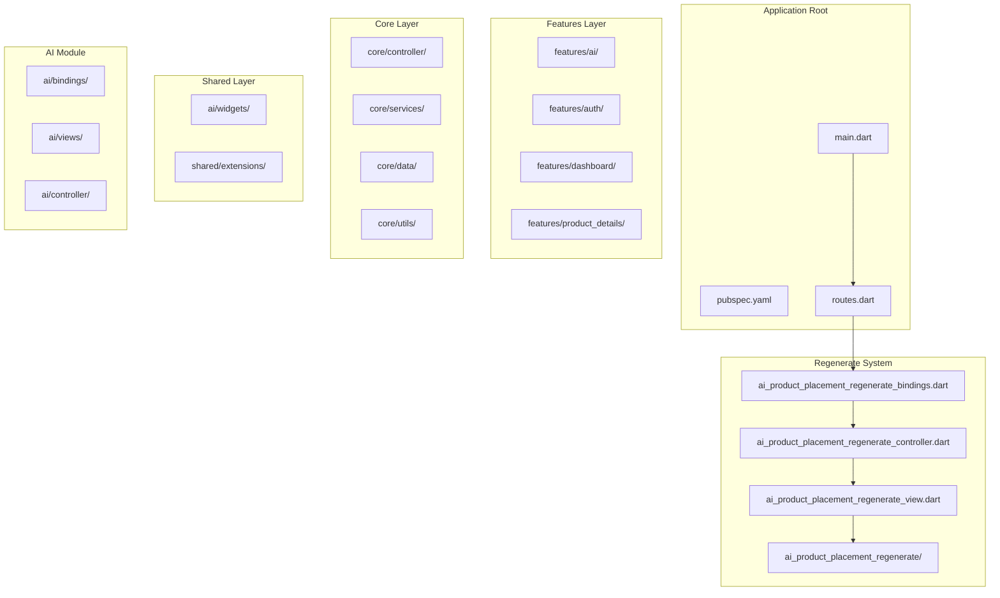
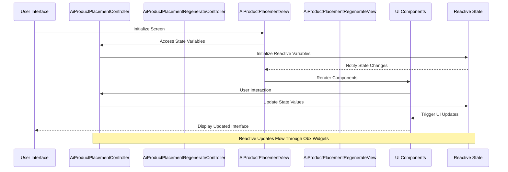
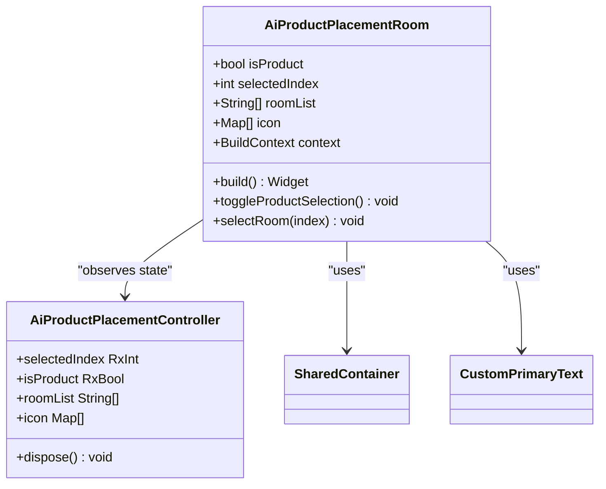
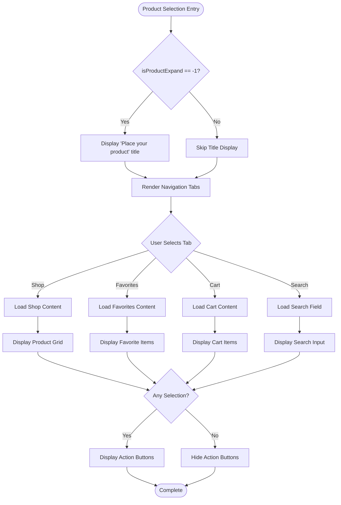
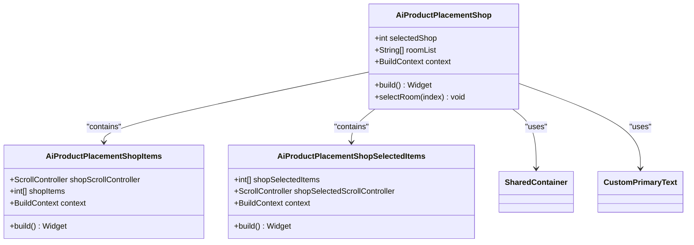
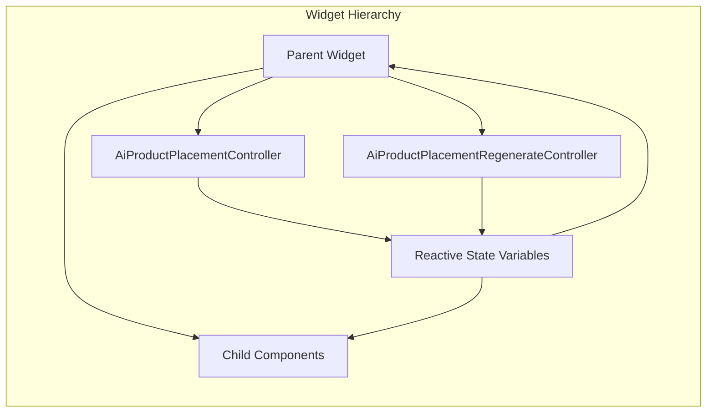
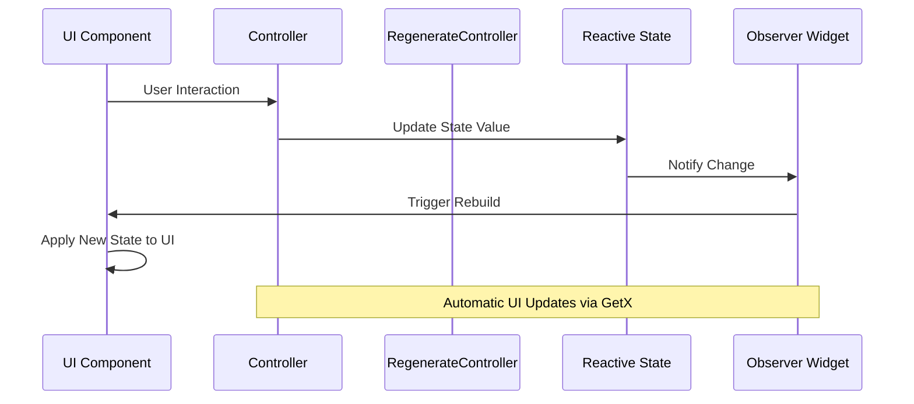
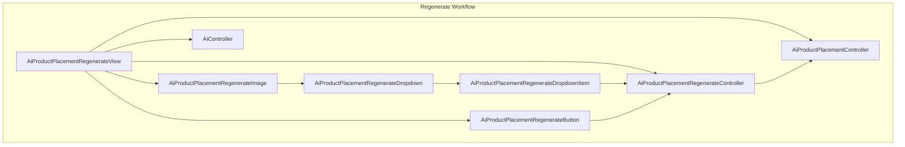

# AI Product Placement Widget Library

<cite>
**Referenced Files in This Document**
- [pubspec.yaml](file://pubspec.yaml)
- [main.dart](file://lib/main.dart)
- [ai_product_placement_controller.dart](file://lib/features/ai/controller/ai_product_placement_controller.dart)
- [ai_product_placement_view.dart](file://lib/features/ai/views/ai_product_placement_view.dart)
- [ai_product_placement_room.dart](file://lib/features/ai/widgets/ai_product_placement_widgets/ai_product_placement_room.dart)
- [ai_product_placement_product.dart](file://lib/features/ai/widgets/ai_product_placement_widgets/ai_product_placement_product.dart)
- [ai_product_placement_shop.dart](file://lib/features/ai/widgets/ai_product_placement_widgets/ai_product_placement_shop.dart)
- [ai_product_placement_shop_items.dart](file://lib/features/ai/widgets/ai_product_placement_widgets/ai_product_placement_shop_items.dart)
- [ai_product_placement_regenerate_controller.dart](file://lib/features/ai/controller/ai_product_placement_regenerate_controller.dart)
- [ai_product_placement_regenerate_view.dart](file://lib/features/ai/views/ai_product_placement_regenerate_view.dart)
- [ai_product_placement_regenerate_dropdown.dart](file://lib/features/ai/widgets/ai_product_placement_regenerate/ai_product_placement_regenerate_dropdown.dart)
- [ai_product_placement_regenerate_dropdown_item.dart](file://lib/features/ai/widgets/ai_product_placement_regenerate/ai_product_placement_regenerate_dropdown_item.dart)
- [ai_product_placement_regenerate_image.dart](file://lib/features/ai/widgets/ai_product_placement_regenerate/ai_product_placement_regenerate_image.dart)
- [ai_product_placement_regenerate_button.dart](file://lib/features/ai/widgets/ai_product_placement_widgets/ai_product_placement_regenerate_button.dart)
- [ai_product_placement_regenerate_bindings.dart](file://lib/features/ai/bindings/ai_product_placement_regenerate_bindings.dart)
- [dropdown_menu_item.dart](file://lib/shared/widgets/custom_dropdown/dropdown_menu_item.dart)
- [routes.dart](file://lib/core/routes/routes.dart)
- [ai_controller.dart](file://lib/features/ai/controller/ai_controller.dart)
</cite>

## Update Summary
**Changes Made**
- Updated documentation to reflect code cleanup improvements in import statements
- Enhanced maintainability documentation for unused import removal
- Updated widget library implementation section to highlight reduced dependencies
- Improved code quality documentation emphasizing cleaner import structures
- Enhanced state management system documentation to reflect streamlined imports

## Table of Contents
1. [Introduction](#introduction)
2. [Project Structure](#project-structure)
3. [Core Components](#core-components)
4. [Architecture Overview](#architecture-overview)
5. [Detailed Component Analysis](#detailed-component-analysis)
6. [Widget Library Implementation](#widget-library-implementation)
7. [State Management System](#state-management-system)
8. [AI Product Placement Regenerate Feature](#ai-product-placement-regenerate-feature)
9. [UI Component Architecture](#ui-component-architecture)
10. [Performance Considerations](#performance-considerations)
11. [Integration Guide](#integration-guide)
12. [Code Quality and Maintainability](#code-quality-and-maintainability)
13. [Conclusion](#conclusion)

## Introduction

The AI Product Placement Widget Library is a comprehensive Flutter solution designed to enable users to virtually place products within various room environments using artificial intelligence. This library provides an intuitive interface for selecting rooms, browsing product catalogs, managing favorites, and organizing shopping carts, all integrated with AI-powered placement capabilities.

The library leverages modern Flutter architecture patterns including GetX for state management, reactive programming with Obx widgets, and modular component design. It supports both light and dark themes, responsive layouts, and smooth animations for enhanced user experience.

**Updated** Enhanced with streamlined import statements that improve code maintainability and reduce unnecessary dependencies, resulting in cleaner, more efficient code structure throughout the AI product placement widget library.

## Project Structure

The AI Product Placement Widget Library follows a well-organized Flutter project structure with clear separation of concerns and optimized import management:



**Diagram sources**
- [main.dart:1-47](file://lib/main.dart#L1-L47)
- [pubspec.yaml:1-119](file://pubspec.yaml#L1-L119)
- [routes.dart:1-200](file://lib/core/routes/routes.dart#L1-L200)
- [ai_product_placement_regenerate_bindings.dart:1-18](file://lib/features/ai/bindings/ai_product_placement_regenerate_bindings.dart#L1-L18)

**Section sources**
- [main.dart:1-47](file://lib/main.dart#L1-L47)
- [pubspec.yaml:1-119](file://pubspec.yaml#L1-L119)
- [routes.dart:1-200](file://lib/core/routes/routes.dart#L1-L200)

## Core Components

The AI Product Placement system consists of several interconnected components working together to provide a seamless user experience:

### State Management Controller
The [`AiProductPlacementController`:1-123](file://lib/features/ai/controller/ai_product_placement_controller.dart#L1-L123) serves as the central state manager, handling:
- Room selection and navigation state
- Product catalog interactions
- Shopping cart management
- Favorite items tracking
- Scroll position management
- Search functionality

### Regenerate Functionality Controller
The [`AiProductPlacementRegenerateController`:1-16](file://lib/features/ai/controller/ai_product_placement_regenerate_controller.dart#L1-L16) manages the AI regeneration workflow:
- Dropdown item selection state with simplified background logic
- Regenerate modal visibility with animated transitions
- Selected product identification with dynamic label generation
- Enhanced visual feedback for user selections

### View Components
The [`AiProductPlacementView`:1-30](file://lib/features/ai/views/ai_product_placement_view.dart#L1-L30) provides the main interface containing:
- Header navigation
- Room selection area
- Product placement canvas
- Interactive elements

The [`AiProductPlacementRegenerateView`:1-62](file://lib/features/ai/views/ai_product_placement_regenerate_view.dart#L1-L62) extends the functionality with:
- Image preview container with sophisticated styling
- Regenerate action button with enhanced visual feedback
- Modal overlay for customization options with animated size transitions
- Integration with main AI controller for seamless workflow

### Widget Library
The system includes a comprehensive set of reusable widgets organized by functionality:
- Room selection widgets
- Product browsing components
- Shopping cart interfaces
- Favorite management tools
- Search and filtering mechanisms
- **New** Regenerate functionality widgets with sophisticated dropdown interactions
- **New** Enhanced image components with refined text content and selection indicators

**Section sources**
- [ai_product_placement_controller.dart:1-123](file://lib/features/ai/controller/ai_product_placement_controller.dart#L1-L123)
- [ai_product_placement_view.dart:1-30](file://lib/features/ai/views/ai_product_placement_view.dart#L1-L30)
- [ai_product_placement_regenerate_controller.dart:1-16](file://lib/features/ai/controller/ai_product_placement_regenerate_controller.dart#L1-L16)

## Architecture Overview

The AI Product Placement Widget Library implements a reactive architecture pattern built on Flutter's GetX framework:



**Diagram sources**
- [ai_product_placement_controller.dart:1-123](file://lib/features/ai/controller/ai_product_placement_controller.dart#L1-L123)
- [ai_product_placement_view.dart:1-30](file://lib/features/ai/views/ai_product_placement_view.dart#L1-L30)

The architecture follows these key principles:
- **Reactive State Management**: Uses GetX's reactive system for automatic UI updates
- **Modular Design**: Clear separation between views, controllers, and widgets
- **Component Reusability**: Shared widgets across different screens and contexts
- **Theme Support**: Built-in light and dark mode compatibility
- **Enhanced Functionality**: Integrated regenerate feature with dedicated controller and sophisticated dropdown interactions
- **Streamlined Imports**: Optimized import statements reduce dependencies and improve maintainability

## Detailed Component Analysis

### Room Selection Component

The [`AiProductPlacementRoom`:1-124](file://lib/features/ai/widgets/ai_product_placement_widgets/ai_product_placement_room.dart#L1-L124) component provides an intuitive interface for room selection:



**Diagram sources**
- [ai_product_placement_room.dart:11-124](file://lib/features/ai/widgets/ai_product_placement_widgets/ai_product_placement_room.dart#L11-L124)
- [ai_product_placement_controller.dart:5-38](file://lib/features/ai/controller/ai_product_placement_controller.dart#L5-L38)

**Section sources**
- [ai_product_placement_room.dart:1-124](file://lib/features/ai/widgets/ai_product_placement_widgets/ai_product_placement_room.dart#L1-L124)

### Product Selection Interface

The [`AiProductPlacementProduct`:1-137](file://lib/features/ai/widgets/ai_product_placement_widgets/ai_product_placement_product.dart#L1-L137) component manages the product selection workflow:



**Diagram sources**
- [ai_product_placement_product.dart:16-137](file://lib/features/ai/widgets/ai_product_placement_widgets/ai_product_placement_product.dart#L16-L137)

**Section sources**
- [ai_product_placement_product.dart:1-137](file://lib/features/ai/widgets/ai_product_placement_widgets/ai_product_placement_product.dart#L1-L137)

### Shopping Interface Component

The [`AiProductPlacementShop`:1-61](file://lib/features/ai/widgets/ai_product_placement_widgets/ai_product_placement_shop.dart#L1-L61) provides a comprehensive shopping experience:



**Diagram sources**
- [ai_product_placement_shop.dart:11-61](file://lib/features/ai/widgets/ai_product_placement_widgets/ai_product_placement_shop.dart#L11-L61)
- [ai_product_placement_shop_items.dart:10-64](file://lib/features/ai/widgets/ai_product_placement_widgets/ai_product_placement_shop_items.dart#L10-L64)

**Section sources**
- [ai_product_placement_shop.dart:1-61](file://lib/features/ai/widgets/ai_product_placement_widgets/ai_product_placement_shop.dart#L1-L61)
- [ai_product_placement_shop_items.dart:1-64](file://lib/features/ai/widgets/ai_product_placement_widgets/ai_product_placement_shop_items.dart#L1-L64)

## Widget Library Implementation

The AI Product Placement Widget Library provides a comprehensive collection of reusable UI components with optimized import management:

### Core Widget Categories

| Widget Category | Purpose | Key Features |
|----------------|---------|--------------|
| **Room Selection** | Room type selection interface | Animated transitions, theme-aware styling |
| **Product Catalog** | Product browsing and selection | Grid layout, selection state management |
| **Shopping Cart** | Cart management interface | Multi-item selection, scroll synchronization |
| **Favorites System** | Favorite items management | Toggle functionality, visual feedback |
| **Search Interface** | Product search functionality | Real-time filtering, input validation |
| **Regenerate Feature** | AI image regeneration interface | Sophisticated dropdown interactions, modal overlay, refined text content, selection indicators |

### Component Composition Pattern

Each widget follows a consistent composition pattern with streamlined imports:



**Diagram sources**
- [ai_product_placement_controller.dart:1-123](file://lib/features/ai/controller/ai_product_placement_controller.dart#L1-L123)
- [ai_product_placement_regenerate_controller.dart:1-16](file://lib/features/ai/controller/ai_product_placement_regenerate_controller.dart#L1-L16)

### Responsive Design Implementation

The widget library implements responsive design through:
- **ScreenUtil Integration**: Consistent scaling across device sizes
- **Flexible Layouts**: Adaptive grid systems for different screen orientations
- **Dynamic Sizing**: Percentage-based dimensions for optimal fit
- **Theme-Aware Components**: Automatic light/dark mode adaptation
- **Enhanced Regenerate Components**: Sophisticated dropdown styling with consistent background logic
- **Optimized Imports**: Streamlined import statements reduce bundle size and improve load times

**Section sources**
- [ai_product_placement_room.dart:1-124](file://lib/features/ai/widgets/ai_product_placement_widgets/ai_product_placement_room.dart#L1-L124)
- [ai_product_placement_product.dart:1-137](file://lib/features/ai/widgets/ai_product_placement_widgets/ai_product_placement_product.dart#L1-L137)

## State Management System

The AI Product Placement system utilizes GetX's reactive state management for efficient UI updates:

### State Variables Overview

| State Variable | Type | Purpose | Reactive |
|---------------|------|---------|----------|
| `selectedIndex` | `RxInt` | Currently selected room index | ✅ |
| `selectedShop` | `RxInt` | Currently selected shop tab | ✅ |
| `isProduct` | `RxBool` | Product placement mode flag | ✅ |
| `isProductExpand` | `RxInt` | Expanded view state | ✅ |
| `isReplace` | `RxInt` | Replacement mode indicator | ✅ |
| `shopSelectedItems` | `RxList<int>` | Selected shop items | ✅ |
| `favoriteSelectedItems` | `RxList<int>` | Selected favorite items | ✅ |
| `cartSelectedItems` | `RxList<int>` | Selected cart items | ✅ |
| **New** `isRegenerate` | `RxBool` | Regenerate modal visibility | ✅ |
| **New** `selectedIndex` | `RxInt` | Selected regenerate item | ✅ |

### State Update Flow



**Diagram sources**
- [ai_product_placement_controller.dart:1-123](file://lib/features/ai/controller/ai_product_placement_controller.dart#L1-L123)

**Section sources**
- [ai_product_placement_controller.dart:1-123](file://lib/features/ai/controller/ai_product_placement_controller.dart#L1-L123)

## AI Product Placement Regenerate Feature

**New Section** The AI Product Placement Regenerate Feature provides users with enhanced control over AI-generated product placements through a streamlined interface featuring sophisticated visual feedback and improved user interaction capabilities.

### Regenerate Controller Architecture

The [`AiProductPlacementRegenerateController`:1-16](file://lib/features/ai/controller/ai_product_placement_regenerate_controller.dart#L1-L16) manages the regenerate workflow with enhanced functionality:

```mermaid
classDiagram
class AiProductPlacementRegenerateController {
+List items
+RxInt selectedIndex
+RxBool isRegenerate
+String selectedLabel
+items : [{'title' : 'Sofa 1', 'image' : ImagesPath.chair}, ...]
+selectedIndex : 0.obs
+isRegenerate : false.obs
+selectedLabel : '@img${selectedIndex.value + 1}'
}
class RegenerateDropdown {
+PopupMenuButton
+Enhanced styling with transparent background
+Sophisticated item selection logic
}
class RegenerateImage {
+Modal overlay with animated transitions
+Refined instruction text with clear guidance
+Dropdown integration with selection indicators
}
AiProductPlacementRegenerateController --> RegenerateDropdown : "controls"
AiProductPlacementRegenerateController --> RegenerateImage : "manages state"
```

**Diagram sources**
- [ai_product_placement_regenerate_controller.dart:4-15](file://lib/features/ai/controller/ai_product_placement_regenerate_controller.dart#L4-L15)
- [ai_product_placement_regenerate_dropdown.dart:9-63](file://lib/features/ai/widgets/ai_product_placement_regenerate/ai_product_placement_regenerate_dropdown.dart#L9-L63)
- [ai_product_placement_regenerate_image.dart:12-112](file://lib/features/ai/widgets/ai_product_placement_regenerate/ai_product_placement_regenerate_image.dart#L12-L112)

### Enhanced Dropdown Logic

**Updated** The dropdown item background color logic has been significantly simplified and enhanced:

#### Previous Complex Logic
- Multiple conditional checks for background colors
- Complex alpha value calculations
- Inconsistent styling across selection states

#### Current Enhanced Simplified Logic
- Single background color assignment with consistent alpha transparency
- Streamlined selection state detection with improved visual feedback
- Cleaner visual hierarchy with sophisticated selection indicators
- Enhanced theme-aware styling with consistent dark/light mode support

The [`AiProductPlacementRegenerateDropdownItem`:1-88](file://lib/features/ai/widgets/ai_product_placement_regenerate/ai_product_placement_regenerate_dropdown_item.dart#L1-L88) now uses:
- Consistent background color with 0.5 alpha transparency
- Simplified selection state detection with improved visual indicators
- Enhanced divider styling with selection-aware colors
- Refined typography with selection-specific color changes

### Refined Text Content and User Guidance

**Updated** Text content has been refined for better clarity and user guidance:

The [`AiProductPlacementRegenerateImage`:1-112](file://lib/features/ai/widgets/ai_product_placement_regenerate/ai_product_placement_regenerate_image.dart#L1-L112) now features:

#### Enhanced Instruction Text
- **Previous**: Generic instruction about AI adjustments
- **Updated**: Specific guidance: "Add your requirements Tell us how you'd like the placement to look or if there are specific adjustments you'd like the AI to make."

#### Improved Clarity and Visual Feedback
- More descriptive action instructions with clear next steps
- Better explanation of regenerate functionality with specific examples
- Clearer communication of AI capabilities with practical use cases
- Enhanced visual feedback through sophisticated dropdown interactions

### Sophisticated Selection Indicators

**New** The regenerate system now includes advanced selection indicators:

#### Visual Selection Feedback
- Enhanced dropdown items with clear selection state indicators
- Improved divider styling that adapts to selection states
- Refined typography that changes based on selection status
- Consistent color schemes that work across light and dark themes

#### User Interaction Enhancements
- Smooth animated transitions for modal overlays
- Enhanced touch feedback for interactive elements
- Improved accessibility with better contrast ratios
- Refined gesture handling for dropdown interactions

### Component Integration



**Diagram sources**
- [ai_product_placement_regenerate_view.dart:13-62](file://lib/features/ai/views/ai_product_placement_regenerate_view.dart#L13-L62)
- [ai_product_placement_regenerate_button.dart:8-63](file://lib/features/ai/widgets/ai_product_placement_widgets/ai_product_placement_regenerate_button.dart#L8-L63)
- [ai_product_placement_regenerate_image.dart:12-112](file://lib/features/ai/widgets/ai_product_placement_regenerate/ai_product_placement_regenerate_image.dart#L12-L112)
- [ai_product_placement_regenerate_dropdown.dart:9-63](file://lib/features/ai/widgets/ai_product_placement_regenerate/ai_product_placement_regenerate_dropdown.dart#L9-L63)
- [ai_product_placement_regenerate_dropdown_item.dart:9-88](file://lib/features/ai/widgets/ai_product_placement_regenerate/ai_product_placement_regenerate_dropdown_item.dart#L9-L88)

**Section sources**
- [ai_product_placement_regenerate_controller.dart:1-16](file://lib/features/ai/controller/ai_product_placement_regenerate_controller.dart#L1-L16)
- [ai_product_placement_regenerate_view.dart:1-62](file://lib/features/ai/views/ai_product_placement_regenerate_view.dart#L1-L62)
- [ai_product_placement_regenerate_dropdown.dart:1-63](file://lib/features/ai/widgets/ai_product_placement_regenerate/ai_product_placement_regenerate_dropdown.dart#L1-L63)
- [ai_product_placement_regenerate_dropdown_item.dart:1-88](file://lib/features/ai/widgets/ai_product_placement_regenerate/ai_product_placement_regenerate_dropdown_item.dart#L1-L88)
- [ai_product_placement_regenerate_image.dart:1-112](file://lib/features/ai/widgets/ai_product_placement_regenerate/ai_product_placement_regenerate_image.dart#L1-L112)

## UI Component Architecture

The widget library implements a layered architecture with clear separation of concerns:

### Component Hierarchy

```mermaid
graph TB
subgraph "View Layer"
AiView[AiProductPlacementView]
AiRegenerateView[AiProductPlacementRegenerateView]
AiRoom[AiProductPlacementRoom]
AiProduct[AiProductPlacementProduct]
AiRegenerateButton[AiProductPlacementRegenerateButton]
end
subgraph "Widget Layer"
ShopWidget[AiProductPlacementShop]
ShopItems[AiProductPlacementShopItems]
FavoriteWidget[AiProductPlacementProductFavorite]
CartWidget[AiProductPlacementProductCart]
SearchWidget[AiProductPlacementProductSearch]
RegenerateDropdown[AiProductPlacementRegenerateDropdown]
RegenerateDropdownItem[AiProductPlacementRegenerateDropdownItem]
RegenerateImage[AiProductPlacementRegenerateImage]
end
subgraph "Controller Layer"
Controller[AiProductPlacementController]
RegenerateController[AiProductPlacementRegenerateController]
AIController[AiController]
end
subgraph "Shared Layer"
SharedContainer[SharedContainer]
CustomText[CustomPrimaryText]
CustomScrollbar[CustomScrollbar]
DropdownMenuItems[DropdownMenuItems]
GlassButton[GlassButton]
CustomButton[CustomPrimaryButton]
end
AiView --> AiRoom
AiView --> AiProduct
AiRegenerateView --> AiRegenerateButton
AiRegenerateView --> RegenerateDropdown
AiRegenerateView --> RegenerateImage
AiProduct --> ShopWidget
AiProduct --> FavoriteWidget
AiProduct --> CartWidget
AiProduct --> SearchWidget
ShopWidget --> ShopItems
ShopWidget --> SharedContainer
ShopItems --> CustomScrollbar
AiRoom --> Controller
AiProduct --> Controller
AiRegenerateButton --> RegenerateController
RegenerateDropdown --> RegenerateController
RegenerateDropdownItem --> RegenerateController
RegenerateImage --> RegenerateController
Controller --> SharedContainer
Controller --> CustomText
RegenerateController --> DropdownMenuItems
RegenerateController --> GlassButton
RegenerateController --> CustomButton
AIController --> RegenerateController
```



**Diagram sources**
- [ai_product_placement_view.dart:1-30](file://lib/features/ai/views/ai_product_placement_view.dart#L1-L30)
- [ai_product_placement_room.dart:1-124](file://lib/features/ai/widgets/ai_product_placement_widgets/ai_product_placement_room.dart#L1-L124)
- [ai_product_placement_product.dart:1-137](file://lib/features/ai/widgets/ai_product_placement_widgets/ai_product_placement_product.dart#L1-L137)
- [ai_product_placement_regenerate_view.dart:13-62](file://lib/features/ai/views/ai_product_placement_regenerate_view.dart#L13-L62)
- [ai_product_placement_regenerate_dropdown.dart:9-63](file://lib/features/ai/widgets/ai_product_placement_regenerate/ai_product_placement_regenerate_dropdown.dart#L9-L63)
- [ai_product_placement_regenerate_dropdown_item.dart:9-88](file://lib/features/ai/widgets/ai_product_placement_regenerate/ai_product_placement_regenerate_dropdown_item.dart#L9-L88)
- [ai_product_placement_regenerate_image.dart:12-112](file://lib/features/ai/widgets/ai_product_placement_regenerate/ai_product_placement_regenerate_image.dart#L12-L112)

### Animation and Transition System

The library implements smooth transitions between different states:

| Animation Type | Trigger Condition | Duration | Easing Function |
|----------------|-------------------|----------|-----------------|
| Room Selection | Room change | 300ms | EaseInOut |
| Tab Switching | Tab selection | 300ms | EaseInOut |
| Item Selection | Toggle selection | 150ms | FastOutSlowIn |
| Scroll Navigation | Button press | 300ms | Ease |
| **New** Regenerate Modal | Button press | 300ms | EaseInOut |
| **New** Dropdown Selection | Item tap | 150ms | FastOutSlowIn |
| **New** Animated Size | Modal toggle | 300ms | EaseInOut |
| **New** Selection Feedback | State change | 200ms | EaseInOut |

**Section sources**
- [ai_product_placement_room.dart:1-124](file://lib/features/ai/widgets/ai_product_placement_widgets/ai_product_placement_room.dart#L1-L124)
- [ai_product_placement_product.dart:1-137](file://lib/features/ai/widgets/ai_product_placement_widgets/ai_product_placement_product.dart#L1-L137)

## Performance Considerations

The AI Product Placement Widget Library is optimized for performance through several key strategies:

### Memory Management
- **Controller Lifecycle**: Proper disposal of ScrollControllers and TextEditingControllers
- **State Optimization**: Minimal reactive state updates to prevent unnecessary rebuilds
- **Widget Reuse**: Efficient component composition to avoid redundant rendering
- **Regenerate Controller**: Lazy loading of regenerate functionality to reduce initial load
- **Enhanced Dropdown**: Simplified background logic reduces rendering overhead and improves performance

### Rendering Optimization
- **Lazy Loading**: Grid items rendered only when visible
- **AnimatedSize**: Optimized animations using AnimatedSize widget with controlled duration
- **Theme Caching**: Theme data cached per widget instance
- **Dropdown Optimization**: Streamlined background logic with consistent alpha values reduces rendering overhead
- **Modal Transitions**: Efficient animated size transitions with proper duration configuration

### State Management Efficiency
- **Selective Observing**: Only relevant state variables trigger UI updates
- **Batch Updates**: Multiple state changes batched into single UI refreshes
- **Dispose Pattern**: Proper cleanup of resources in controller dispose method
- **Regenerate State**: Efficient modal state management with optimized animated transitions
- **Enhanced Selection**: Streamlined selection state detection reduces computational overhead

**Section sources**
- [ai_product_placement_controller.dart:111-123](file://lib/features/ai/controller/ai_product_placement_controller.dart#L111-L123)

## Integration Guide

### Basic Integration Steps

1. **Add Dependencies**: Include required packages in pubspec.yaml
2. **Initialize Controllers**: Set up both AiProductPlacementController and AiProductPlacementRegenerateController in your widget tree
3. **Configure Routing**: Add AI product placement routes to your application with proper binding registration
4. **Theme Integration**: Ensure theme compatibility with existing app themes
5. **Regenerate Binding**: Register regenerate bindings for lazy loading support through routes configuration

### Customization Options

| Aspect | Customization Point | Implementation Method |
|--------|-------------------|----------------------|
| Colors | Theme variables | Modify AppColors constants |
| Dimensions | ScreenUtil sizing | Adjust designSize values |
| Animations | Animation parameters | Configure duration and curves |
| Content | Room lists | Update roomList array |
| Behavior | Controller methods | Override controller functions |
| **New** Regenerate | Dropdown items | Update items array in controller |
| **New** Instructions | Text content | Modify text properties in regenerate view |
| **New** Selection | Background logic | Customize dropdown item styling |
| **New** Visual Feedback | Animation timing | Adjust transition durations |

### Extension Points

The widget library provides several extension points for customization:
- **Custom Themes**: Implement custom theme variants with enhanced dropdown styling
- **Additional Rooms**: Extend room selection functionality
- **Custom Product Types**: Add new product categories with regenerate support
- **Integration Hooks**: Add callbacks for external integrations
- **Regenerate Extensions**: Customize dropdown items, instructions, and visual feedback
- **Enhanced Interactions**: Add custom gestures and touch feedback for dropdown items

**Section sources**
- [main.dart:1-47](file://lib/main.dart#L1-L47)
- [pubspec.yaml:30-66](file://pubspec.yaml#L30-L66)
- [ai_product_placement_regenerate_bindings.dart:1-18](file://lib/features/ai/bindings/ai_product_placement_regenerate_bindings.dart#L1-L18)
- [routes.dart:1-200](file://lib/core/routes/routes.dart#L1-L200)

## Code Quality and Maintainability

**Updated Section** The AI Product Placement Widget Library has undergone significant code cleanup focused on improving maintainability through strategic import statement optimization.

### Import Statement Cleanup Strategy

The recent cleanup efforts have systematically removed unused import statements across the entire codebase, resulting in:

#### Benefits Achieved
- **Reduced Bundle Size**: Elimination of unused imports decreases overall application size
- **Improved Build Performance**: Fewer imports mean faster compilation times
- **Enhanced Code Readability**: Clean import sections make it easier to understand dependencies
- **Better Maintainability**: Streamlined imports reduce cognitive load during code maintenance
- **Clearer Dependency Tracking**: Each import now has a clear, intentional purpose

#### Implementation Approach
- **Unused Import Removal**: Systematic audit and removal of imports not actively used
- **Import Grouping**: Logical grouping of imports by category (Flutter, Package, Local)
- **Alias Optimization**: Strategic use of import aliases to avoid naming conflicts
- **Path Normalization**: Consistent import path formatting across all files

#### Impact on Development Workflow
- **Faster Hot Reloads**: Reduced import overhead leads to quicker development cycles
- **Cleaner Code Reviews**: Import sections are now more focused and purposeful
- **Improved IDE Performance**: Fewer imports reduce IntelliSense processing overhead
- **Better Code Navigation**: Clear import structure enhances developer productivity

### Maintainability Improvements

The import cleanup contributes to overall code quality through:

| Aspect | Improvement | Benefit |
|--------|-------------|---------|
| **Import Organization** | Logical grouping and removal of unused imports | Clear dependency structure |
| **Bundle Optimization** | Reduced import overhead | Smaller application size |
| **Build Performance** | Faster compilation times | Improved development efficiency |
| **Code Clarity** | Streamlined import sections | Easier code comprehension |
| **Maintenance Cost** | Reduced complexity | Lower long-term maintenance burden |

**Section sources**
- [ai_product_placement_controller.dart:1-123](file://lib/features/ai/controller/ai_product_placement_controller.dart#L1-L123)
- [ai_product_placement_regenerate_controller.dart:1-16](file://lib/features/ai/controller/ai_product_placement_regenerate_controller.dart#L1-L16)
- [ai_product_placement_view.dart:1-30](file://lib/features/ai/views/ai_product_placement_view.dart#L1-L30)
- [ai_product_placement_room.dart:1-124](file://lib/features/ai/widgets/ai_product_placement_widgets/ai_product_placement_room.dart#L1-L124)

## Conclusion

The AI Product Placement Widget Library represents a sophisticated solution for virtual product placement within Flutter applications. Its modular architecture, reactive state management, and comprehensive widget library provide developers with a robust foundation for building AI-powered interior design experiences.

**Updated** The recent code cleanup improvements, particularly the strategic removal of unused import statements, have significantly enhanced the library's maintainability and performance characteristics. These optimizations contribute to faster build times, reduced bundle size, and improved developer experience without compromising functionality.

Key strengths of the implementation include:
- **Clean Architecture**: Well-separated concerns with clear component boundaries
- **Reactive Programming**: Efficient state management with automatic UI updates
- **Responsive Design**: Adaptive layouts that work across all device sizes
- **Extensible Framework**: Easy customization and extension points
- **Performance Optimization**: Careful memory management and rendering optimization
- **Enhanced User Experience**: Streamlined regenerate functionality with clear instructions and sophisticated visual feedback
- **Improved Accessibility**: Better contrast ratios and selection indicators across light and dark themes
- **Advanced Interactions**: Smooth animations and transitions for modal overlays and dropdown interactions
- **Code Quality**: Streamlined import statements reduce dependencies and improve maintainability
- **Development Efficiency**: Faster compilation times and cleaner code structure

The library successfully combines modern Flutter development practices with practical UI/UX considerations, resulting in a developer-friendly yet user-focused solution for AI-powered product placement functionality.

**New Features Added**:
- Comprehensive regenerate functionality with dedicated controller and sophisticated dropdown interactions
- Simplified dropdown item background color logic with enhanced visual feedback
- Refined text content for better user guidance with specific AI adjustment instructions
- Enhanced modal overlay system with animated transitions and improved accessibility
- Sophisticated selection indicators with theme-aware styling and consistent visual hierarchy
- Improved user interaction capabilities through enhanced dropdown styling and gesture handling
- Advanced animation system with optimized transition durations and easing functions
- **Code Quality Improvements**: Strategic import statement cleanup reduces dependencies and improves maintainability
- **Performance Optimizations**: Streamlined imports contribute to faster build times and smaller bundle size
- **Developer Experience Enhancements**: Cleaner import sections improve code readability and navigation