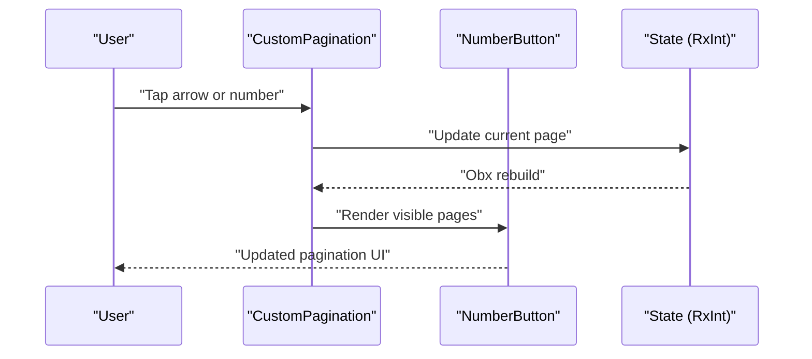
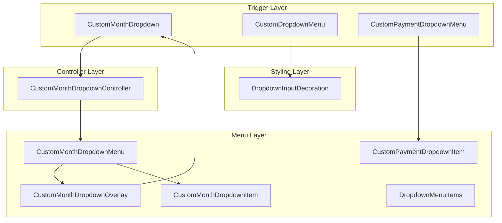
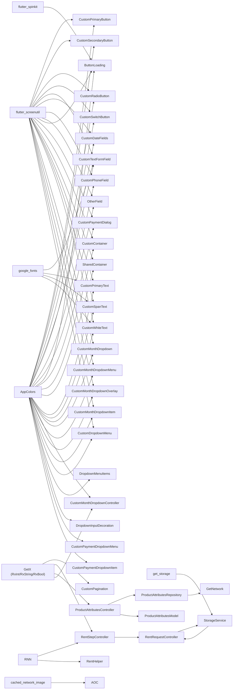

# Shared Components and Utilities

<cite>
**Referenced Files in This Document**
- [main.dart](file://lib/main.dart)
- [pubspec.yaml](file://pubspec.yaml)
- [colors.dart](file://lib/core/constant/colors.dart)
- [custom_primary_button.dart](file://lib/shared/widgets/custom_button/custom_primary_button.dart)
- [custom_secondary_button.dart](file://lib/shared/widgets/custom_button/custom_secondary_button.dart)
- [custom_radio_button.dart](file://lib/shared/widgets/custom_button/custom_radio_button.dart)
- [custom_switch_button.dart](file://lib/shared/widgets/custom_button/custom_switch_button.dart)
- [custom_text_form_field.dart](file://lib/shared/widgets/custom_form_field/custom_text_form_field.dart)
- [custom_date_fields.dart](file://lib/shared/widgets/custom_form_field/custom_date_fields.dart)
- [custom_phone_field.dart](file://lib/shared/widgets/custom_form_field/custom_phone_field.dart)
- [other_field.dart](file://lib/shared/widgets/custom_form_field/other_field.dart)
- [button_loading.dart](file://lib/shared/widgets/custom_loadings/button_loading.dart)
- [custom_pagination.dart](file://lib/shared/widgets/custom_pagination/custom_pagination.dart)
- [custom_pagination_button.dart](file://lib/shared/widgets/custom_pagination/custom_pagination_button.dart)
- [custom_pagination_dot.dart](file://lib/shared/widgets/custom_pagination/custom_pagination_dot.dart)
- [custom_pagination_number.dart](file://lib/shared/widgets/custom_pagination/custom_pagination_number.dart)
- [custom_payment_dialog.dart](file://lib/shared/widgets/custom_dialog/custom_payment_dialog.dart)
- [custom_payment_dialog_method.dart](file://lib/shared/widgets/custom_dialog/custom_payment_dialog_method.dart)
- [custom_payment_success_dialog.dart](file://lib/shared/widgets/custom_dialog/custom_payment_success_dialog.dart)
- [custom_rating_dialog.dart](file://lib/shared/widgets/custom_dialog/custom_rating_dialog.dart)
- [custom_reject_dialog.dart](file://lib/shared/widgets/custom_dialog/custom_reject_dialog.dart)
- [custom_appbar.dart](file://lib/shared/widgets/custom_appbar.dart)
- [custom_banner.dart](file://lib/shared/widgets/custom_banner.dart)
- [custom_check_box.dart](file://lib/shared/widgets/custom_check_box.dart)
- [custom_container.dart](file://lib/shared/widgets/custom_container.dart)
- [custom_divider.dart](file://lib/shared/widgets/custom_divider.dart)
- [custom_product_design.dart](file://lib/shared/widgets/custom_product_design.dart)
- [custom_product_text.dart](file://lib/shared/widgets/custom_product_text.dart)
- [custom_scrollbar.dart](file://lib/shared/widgets/custom_scrollbar.dart)
- [shipping_membership_card.dart](file://lib/shared/widgets/shipping_membership_card.dart)
- [shared_container.dart](file://lib/shared/widgets/shared_container.dart)
- [custom_primary_text.dart](file://lib/shared/widgets/custom_text/custom_primary_text.dart)
- [custom_span_text.dart](file://lib/shared/widgets/custom_text/custom_span_text.dart)
- [custom_white_text.dart](file://lib/shared/widgets/custom_text/custom_white_text.dart)
- [attribute_option_chip.dart](file://lib/features/product_details.dart/widgets/product_furniture_customized_widgets/attribute_option_chip.dart)
- [attribute_options_list.dart](file://lib/features/product_details.dart/widgets/product_furniture_customized_widgets/attribute_options_list.dart)
- [product_accordion_item.dart](file://lib/features/product_details.dart/widgets/product_furniture_customized_widgets/product_accordion_item.dart)
- [products_attributes_controller.dart](file://lib/features/product_details.dart/controller/products_attributes_controller.dart)
- [product_attributes_model.dart](file://lib/features/product_details.dart/models/product_attributes_model.dart)
- [product_attributes_repo.dart](file://lib/features/product_details.dart/repositories/product_attributes_repo.dart)
- [email_validator.dart](file://lib/shared/extensions/validators/email_validator.dart)
- [abn_validator.dart](file://lib/shared/extensions/validators/abn_validator.dart)
- [confirm_password_validator.dart](file://lib/shared/extensions/validators/confirm_password_validator.dart)
- [name_validator.dart](file://lib/shared/extensions/validators/name_validator.dart)
- [password_validator.dart](file://lib/shared/extensions/validators/password_validator.dart)
- [phone_validator.dart](file://lib/shared/extensions/validators/phone_validator.dart)
- [date_formatter.dart](file://lib/shared/extensions/formatters/date_formatter.dart)
- [dimension_formatter.dart](file://lib/shared/extensions/formatters/dimension_formatter.dart)
- [estimate_delivery_extractor.dart](file://lib/shared/extensions/extractors/estimate_delivery_extractor.dart)
- [custom_dropdown_menu.dart](file://lib/shared/widgets/custom_dropdown/custom_dropdown_menu.dart)
- [dropdown_menu_item.dart](file://lib/shared/widgets/custom_dropdown/dropdown_menu_item.dart)
- [dropdown_input_decoration.dart](file://lib/shared/widgets/custom_dropdown/dropdown_input_decoration.dart)
- [custom_payment_dropdown.dart](file://lib/shared/widgets/custom_dropdown/custom_payment_dropdown/custom_payment_dropdown.dart)
- [custom_payment_dropdown_item.dart](file://lib/shared/widgets/custom_dropdown/custom_payment_dropdown/custom_payment_dropdown_item.dart)
- [custom_month_dropdown.dart](file://lib/shared/widgets/custom_dropdown/month_dropdown/custom_month_dropdown.dart)
- [custom_month_dropdown_controller.dart](file://lib/shared/widgets/custom_dropdown/month_dropdown/custom_month_dropdown_controller.dart)
- [custom_month_dropdown_item.dart](file://lib/shared/widgets/custom_dropdown/month_dropdown/custom_month_dropdown_item.dart)
- [custom_month_dropdown_menu.dart](file://lib/shared/widgets/custom_dropdown/month_dropdown/custom_month_dropdown_menu.dart)
- [custom_month_dropdown_overlay.dart](file://lib/shared/widgets/custom_dropdown/month_dropdown/custom_month_dropdown_overlay.dart)
- [rent_request_next.dart](file://lib/features/rent_request/widgets/rent_request_view_widgets/rent_request_next.dart)
- [rent_step_controller.dart](file://lib/features/rent_request/controllers/rent_step_controller.dart)
- [storage_service.dart](file://lib/core/data/local/storage_service.dart)
- [rent_request_controller.dart](file://lib/features/rent_request/controllers/rent_request_controller.dart)
- [step_zero_repo.dart](file://lib/features/rent_request/repositories/step_zero_repo.dart)
- [rent_helper.dart](file://lib/features/rent_request/widgets/rent_helper.dart)
- [rent_submit_dialog.dart](file://lib/features/rent_request/widgets/rent_submit_dialog.dart)
- [ai_dropdown_credit.dart](file://lib/features/ai/widgets/ai_view_widgets/ai_dropdown_credit.dart)
- [credit_transaction_list.dart](file://lib/features/credit_balance/widgets/credit_balance_view_widgets/credit_transaction_list.dart)
</cite>

## Update Summary
**Changes Made**
- Added comprehensive documentation for the new month-specific dropdown functionality
- Documented four new components: CustomMonthDropdown, CustomMonthDropdownController, CustomMonthDropdownItem, CustomMonthDropdownMenu, and CustomMonthDropdownOverlay
- Integrated the month dropdown system into the existing dropdown architecture
- Added usage examples in AI features and credit balance components
- Enhanced dropdown component ecosystem with specialized month selection functionality

## Table of Contents
1. [Introduction](#introduction)
2. [Project Structure](#project-structure)
3. [Core Components](#core-components)
4. [Architecture Overview](#architecture-overview)
5. [Detailed Component Analysis](#detailed-component-analysis)
6. [Product Attributes System](#product-attributes-system)
7. [New Month Dropdown System](#new-month-dropdown-system)
8. [Dropdown Component Ecosystem](#dropdown-component-ecosystem)
9. [Dependency Analysis](#dependency-analysis)
10. [Performance Considerations](#performance-considerations)
11. [Troubleshooting Guide](#troubleshooting-guide)
12. [Conclusion](#conclusion)
13. [Appendices](#appendices)

## Introduction
This document describes the shared components and utility systems in ZB-DEZINE. It focuses on reusable UI components such as custom buttons, form fields, dialogs, loading indicators, pagination, and specialized components for product display and membership benefits. It also covers validation and formatting utilities, helper extensions, and extension methods. The guide explains component architecture, prop interfaces, event handling, customization options, composition patterns, accessibility considerations, responsive design, and guidelines for extending existing components and building new shared utilities.

**Updated** Enhanced with comprehensive documentation for the new month-specific dropdown system, providing standardized month selection functionality across the application. The month dropdown complements the existing dropdown ecosystem with specialized functionality for time-based filtering and reporting.

## Project Structure
The shared components live under the shared directory, organized by feature families:
- widgets/custom_button: Primary and secondary buttons with theming and typography.
- widgets/custom_form_field: Reusable form fields with extensive customization.
- widgets/custom_loadings: Loading indicators tailored for actions.
- widgets/custom_pagination: Pagination controls with dynamic page rendering.
- widgets/custom_dialog: Payment and feedback dialogs.
- widgets/custom_text: Primary text component with theme-aware typography.
- widgets/custom_product_design: Product visualization component.
- widgets/custom_product_text: Product information display component.
- widgets/custom_scrollbar: Enhanced scrollbar component.
- widgets/shipping_membership_card: Membership promotion component.
- widgets/custom_dropdown: Comprehensive dropdown system including month-specific dropdown.
- features/product_details: Product customization system with attributes and options.
- features/rent_request: Complete rental request flow with step navigation and async operations.
- extensions/validators: Validation helpers for common inputs.
- extensions/formatters: Formatting helpers for dates and relative time.
- extensions/extractors: Domain-specific extractors for order-related data.

```mermaid
graph TB
subgraph "Core UI Components"
CB1["CustomPrimaryButton"]
CB2["CustomSecondaryButton"]
CB3["CustomRadioButton"]
CB4["CustomSwitchButton"]
CFF["CustomTextFormField"]
CFF2["CustomDateFields"]
CFF3["CustomPhoneField"]
CFF4["OtherField"]
BL["ButtonLoading"]
CP["CustomPagination"]
CPB["CustomPaginationButton"]
CPD["CustomPaymentDialog"]
CPC["CustomContainer"]
SC["SharedContainer"]
CPT["CustomPrimaryText"]
CST["CustomSpanText"]
CWT["CustomWhiteText"]
end
subgraph "Dropdown System"
CMD["CustomMonthDropdown"]
CMDC["CustomMonthDropdownController"]
CMDD["CustomMonthDropdownMenu"]
CMDO["CustomMonthDropdownOverlay"]
CMDI["CustomMonthDropdownItem"]
CDD["CustomDropdownMenu"]
CDI["DropdownMenuItems"]
DID["DropdownInputDecoration"]
CPD2["CustomPaymentDropdown"]
CPDI["CustomPaymentDropdownItem"]
end
subgraph "Specialized Components"
CPD2["CustomProductDesign"]
CPT2["CustomProductText"]
CSB["CustomScrollbar"]
SMC["ShippingMembershipCard"]
end
subgraph "Product Attributes System"
AOC["AttributeOptionChip"]
AOL["AttributeOptionsList"]
PAI["ProductAccordionItem"]
PAC["ProductAttributesController"]
PAM["ProductAttributesModel"]
PAR["ProductAttributesRepository"]
end
subgraph "Extensions"
EV["EmailValidator"]
ABV["ABNValidator"]
CPV["ConfirmPasswordValidator"]
NV["NameValidator"]
PWV["PasswordValidator"]
PHV["PhoneValidator"]
DF["DateFormatter"]
DIMF["DimensionFormatter"]
EDE["EstimatedDeliveryExtractor"]
end
subgraph "Theme & Constants"
AC["AppColors"]
end
subgraph "Rental Request Flow"
RNN["RentRequestNext"]
RSC["RentStepController"]
SS["StorageService"]
RC["RentRequestController"]
RH["RentHelper"]
RSD["RentSubmitDialog"]
end
CB1 --> AC
CB2 --> AC
CB3 --> AC
CB4 --> AC
CFF --> AC
CFF2 --> AC
CFF3 --> AC
CFF4 --> AC
BL --> AC
CPD --> AC
CPC --> AC
SC --> AC
CPT --> AC
CST --> AC
CWT --> AC
CMD --> AC
CMDC --> AC
CMDD --> AC
CMDO --> AC
CMDI --> AC
CDD --> AC
CDI --> AC
DID --> AC
CPD2 --> AC
CPDI --> AC
CPD2 --> AC
CPT2 --> AC
CSB --> AC
SMC --> AC
AOC --> SC
AOC --> CPT
AOL --> AOC
PAI --> AOC
PAI --> AOC
PAC --> PAR
PAC --> PAM
PAC --> RNN
```



**Diagram sources**
- [custom_primary_button.dart:1-74](file://lib/shared/widgets/custom_button/custom_primary_button.dart#L1-L74)
- [custom_secondary_button.dart:1-88](file://lib/shared/widgets/custom_button/custom_secondary_button.dart#L1-L88)
- [custom_radio_button.dart:1-60](file://lib/shared/widgets/custom_button/custom_radio_button.dart#L1-L60)
- [custom_switch_button.dart:1-60](file://lib/shared/widgets/custom_button/custom_switch_button.dart#L1-L60)
- [custom_text_form_field.dart:1-191](file://lib/shared/widgets/custom_form_field/custom_text_form_field.dart#L1-L191)
- [custom_date_fields.dart:1-120](file://lib/shared/widgets/custom_form_field/custom_date_fields.dart#L1-L120)
- [custom_phone_field.dart:1-120](file://lib/shared/widgets/custom_form_field/custom_phone_field.dart#L1-L120)
- [other_field.dart:1-120](file://lib/shared/widgets/custom_form_field/other_field.dart#L1-L120)
- [button_loading.dart:1-36](file://lib/shared/widgets/custom_loadings/button_loading.dart#L1-L36)
- [custom_pagination.dart:1-87](file://lib/shared/widgets/custom_pagination/custom_pagination.dart#L1-L87)
- [custom_pagination_button.dart:1-60](file://lib/shared/widgets/custom_pagination/custom_pagination_button.dart#L1-L60)
- [custom_payment_dialog.dart:1-94](file://lib/shared/widgets/custom_dialog/custom_payment_dialog.dart#L1-L94)
- [custom_container.dart:1-49](file://lib/shared/widgets/custom_container.dart#L1-L49)
- [shared_container.dart:1-57](file://lib/shared/widgets/shared_container.dart#L1-L57)
- [custom_primary_text.dart:1-43](file://lib/shared/widgets/custom_text/custom_primary_text.dart#L1-L43)
- [custom_span_text.dart:1-43](file://lib/shared/widgets/custom_text/custom_span_text.dart#L1-L43)
- [custom_white_text.dart:1-43](file://lib/shared/widgets/custom_text/custom_white_text.dart#L1-L43)
- [custom_month_dropdown.dart:1-67](file://lib/shared/widgets/custom_dropdown/month_dropdown/custom_month_dropdown.dart#L1-L67)
- [custom_month_dropdown_controller.dart:1-55](file://lib/shared/widgets/custom_dropdown/month_dropdown/custom_month_dropdown_controller.dart#L1-L55)
- [custom_month_dropdown_menu.dart:1-62](file://lib/shared/widgets/custom_dropdown/month_dropdown/custom_month_dropdown_menu.dart#L1-L62)
- [custom_month_dropdown_overlay.dart:1-33](file://lib/shared/widgets/custom_dropdown/month_dropdown/custom_month_dropdown_overlay.dart#L1-L33)
- [custom_month_dropdown_item.dart:1-72](file://lib/shared/widgets/custom_dropdown/month_dropdown/custom_month_dropdown_item.dart#L1-L72)
- [custom_dropdown_menu.dart:1-161](file://lib/shared/widgets/custom_dropdown/custom_dropdown_menu.dart#L1-L161)
- [dropdown_menu_item.dart:1-61](file://lib/shared/widgets/custom_dropdown/dropdown_menu_item.dart#L1-L61)
- [dropdown_input_decoration.dart:1-53](file://lib/shared/widgets/custom_dropdown/dropdown_input_decoration.dart#L1-L53)
- [custom_payment_dropdown.dart:1-166](file://lib/shared/widgets/custom_dropdown/custom_payment_dropdown/custom_payment_dropdown.dart#L1-L166)
- [custom_payment_dropdown_item.dart:1-87](file://lib/shared/widgets/custom_dropdown/custom_payment_dropdown/custom_payment_dropdown_item.dart#L1-L87)
- [custom_product_design.dart:1-104](file://lib/shared/widgets/custom_product_design.dart#L1-L104)
- [custom_product_text.dart:1-90](file://lib/shared/widgets/custom_product_text.dart#L1-L90)
- [custom_scrollbar.dart:1-30](file://lib/shared/widgets/custom_scrollbar.dart#L1-L30)
- [shipping_membership_card.dart:1-82](file://lib/shared/widgets/shipping_membership_card.dart#L1-L82)
- [attribute_option_chip.dart:1-73](file://lib/features/product_details.dart/widgets/product_furniture_customized_widgets/attribute_option_chip.dart#L1-L73)
- [attribute_options_list.dart:1-33](file://lib/features/product_details.dart/widgets/product_furniture_customized_widgets/attribute_options_list.dart#L1-L33)
- [product_accordion_item.dart:1-123](file://lib/features/product_details.dart/widgets/product_furniture_customized_widgets/product_accordion_item.dart#L1-L123)
- [products_attributes_controller.dart:1-41](file://lib/features/product_details.dart/controller/products_attributes_controller.dart#L1-L41)
- [product_attributes_model.dart:1-101](file://lib/features/product_details.dart/models/product_attributes_model.dart#L1-L101)
- [product_attributes_repo.dart:1-22](file://lib/features/product_details.dart/repositories/product_attributes_repo.dart#L1-L22)
- [email_validator.dart:1-14](file://lib/shared/extensions/validators/email_validator.dart#L1-L14)
- [abn_validator.dart:1-14](file://lib/shared/extensions/validators/abn_validator.dart#L1-L14)
- [confirm_password_validator.dart:1-14](file://lib/shared/extensions/validators/confirm_password_validator.dart#L1-L14)
- [name_validator.dart:1-14](file://lib/shared/extensions/validators/name_validator.dart#L1-L14)
- [password_validator.dart:1-14](file://lib/shared/extensions/validators/password_validator.dart#L1-L14)
- [phone_validator.dart:1-14](file://lib/shared/extensions/validators/phone_validator.dart#L1-L14)
- [date_formatter.dart:1-54](file://lib/shared/extensions/formatters/date_formatter.dart#L1-L54)
- [dimension_formatter.dart:1-54](file://lib/shared/extensions/formatters/dimension_formatter.dart#L1-L54)
- [estimate_delivery_extractor.dart:1-39](file://lib/shared/extensions/extractors/estimate_delivery_extractor.dart#L1-L39)
- [colors.dart:1-117](file://lib/core/constant/colors.dart#L1-L117)
- [rent_request_next.dart:1-61](file://lib/features/rent_request/widgets/rent_request_view_widgets/rent_request_next.dart#L1-L61)
- [rent_step_controller.dart:1-96](file://lib/features/rent_request/controllers/rent_step_controller.dart#L1-L96)
- [storage_service.dart:1-24](file://lib/core/data/local/storage_service.dart#L1-L24)
- [rent_request_controller.dart:1-68](file://lib/features/rent_request/controllers/rent_request_controller.dart#L1-L68)
- [rent_helper.dart:1-41](file://lib/features/rent_request/widgets/rent_helper.dart#L1-L41)
- [rent_submit_dialog.dart:1-66](file://lib/features/rent_request/widgets/rent_submit_dialog.dart#L1-L66)

**Section sources**
- [main.dart:1-47](file://lib/main.dart#L1-L47)
- [pubspec.yaml:30-66](file://pubspec.yaml#L30-L66)

## Core Components
This section summarizes the reusable UI components and their primary responsibilities.

- CustomPrimaryButton
  - Purpose: Prominent call-to-action with theming and typography.
  - Key props: size, colors, border radius, padding, shadow, child widget, font weight.
  - Behavior: Uses theme brightness to select appropriate colors; supports custom decoration or defaults to brand colors.

- CustomSecondaryButton
  - Purpose: Secondary actions with icon and label.
  - Key props: icon asset, sizes, colors, border radius, padding, shadow.
  - Behavior: Renders icon and text in a row; applies theme-aware tinting.

- CustomRadioButton
  - Purpose: Radio button selection with custom styling.
  - Key props: value, groupValue, onChanged, activeColor, inactiveColor, fillColor.
  - Behavior: Theme-aware radio button with custom visual styling.

- CustomSwitchButton
  - Purpose: Toggle switch with custom styling.
  - Key props: isOn, onChanged, activeColor, inactiveColor, thumbColor.
  - Behavior: Smooth animated toggle with theme-aware colors.

- CustomTextFormField
  - Purpose: Consistent, theme-aware form field with extensive customization.
  - Key props: controller, hints, label, prefix/suffix icons, obscure text, keyboard type, validation, styling, borders, fill color.
  - Behavior: Applies theme-aware colors and typography; integrates with Google Fonts.

- CustomDateFields
  - Purpose: Date input fields with calendar picker integration.
  - Key props: controller, label, validator, initialDate, firstDate, lastDate.
  - Behavior: Date selection with validation and theme-aware styling.

- CustomPhoneField
  - Purpose: Phone number input with country code support.
  - Key props: controller, label, validator, initialCountryCode.
  - Behavior: Phone number formatting and validation.

- OtherField
  - Purpose: Generic form field with flexible configuration.
  - Key props: controller, label, validator, keyboardType, inputFormatters.
  - Behavior: Customizable form field for various input types.

- ButtonLoading
  - Purpose: Loading indicator for actions.
  - Key props: padding, color, size.
  - Behavior: Centers a spinner with theme-aware color.

- CustomPagination
  - Purpose: Page navigation with dynamic page range and navigation arrows.
  - Key props: current page (Rx), total pages.
  - Behavior: Renders numbered pages and ellipses; updates reactive current page.

- CustomPaginationButton
  - Purpose: Individual pagination control button.
  - Key props: onPressed, isSelected, child.
  - Behavior: Theme-aware button with selection state styling.

- CustomPaginationDot
  - Purpose: Dot indicator for pagination.
  - Key props: isActive.
  - Behavior: Small dot indicator with theme-aware colors.

- CustomPaginationNumber
  - Purpose: Numbered pagination button.
  - Key props: number, onPressed, isSelected.
  - Behavior: Numeric button with selection highlighting.

- CustomPaymentDialog
  - Purpose: Payment selection dialog with amount and method list.
  - Key props: icon, title, subtitle, button text, card list, selected card (Rx), selection callback.
  - Behavior: Dialog with shadow and theme-aware background; composes payment method component.

- CustomContainer
  - Purpose: Scaffold wrapper with customizable layout and gradients.
  - Key props: child, gradient, appbar, padding, margin, drawer, bottomNav.
  - Behavior: Full-screen scaffold with theme-aware gradient backgrounds.

- SharedContainer
  - Purpose: Universal container for consistent styling and layout.
  - Key props: child, padding, margin, radius, border, color, boxShadow, height, width, gradient, image.
  - Behavior: Theme-aware container with flexible styling options and responsive sizing.

- CustomPrimaryText
  - Purpose: Primary text component with Google Fonts integration and theme-aware colors.
  - Key props: text, fontSize, fontWeight, color, textAlign, textOverflow, shadow, decoration, maxLine.
  - Behavior: Responsive typography with Montserrat font family and automatic theme adaptation.

- CustomSpanText
  - Purpose: Text component with styled spans and custom styling.
  - Key props: text, spans, fontSize, fontWeight, color, textAlign.
  - Behavior: Rich text with customizable spans and theme-aware colors.

- CustomWhiteText
  - Purpose: White text component for dark theme contexts.
  - Key props: text, fontSize, fontWeight, textAlign, textOverflow, maxLine.
  - Behavior: High contrast white text for dark theme backgrounds.

**Updated** Enhanced dropdown system with comprehensive month-specific functionality and improved dropdown architecture.

- CustomMonthDropdown
  - Purpose: Month selection dropdown with animated rotation and theme-aware styling.
  - Key props: None (uses controller state internally).
  - Behavior: Tap-to-open dropdown with animated chevron indicator; integrates with overlay system.

- CustomMonthDropdownController
  - Purpose: Controller managing month dropdown state and options.
  - Key props: selectedOption (RxString), isOpen (RxBool), options (List<String>).
  - Behavior: Manages dropdown open/close state, option selection, and overlay entry lifecycle.

- CustomMonthDropdownMenu
  - Purpose: Menu component displaying month options with selection indicators.
  - Key props: None (uses controller state internally).
  - Behavior: Renders month options with selected state highlighting and checkmark indicators.

- CustomMonthDropdownItem
  - Purpose: Individual month option item with selection styling.
  - Key props: label (String), isSelected (bool), isLast (bool), isDark (bool), onTap (VoidCallback).
  - Behavior: Styled list item with selection background, border styling, and checkmark indicator.

- CustomMonthDropdownOverlay
  - Purpose: Overlay component positioning dropdown menu relative to trigger.
  - Key props: None (uses controller state internally).
  - Behavior: Handles overlay positioning, click-outside dismissal, and CompositedTransform linking.

- CustomDropdownMenu
  - Purpose: General-purpose dropdown menu with extensive customization.
  - Key props: option (List), onSelect (Function), isSelect (RxString), label (String), styling props.
  - Behavior: Comprehensive dropdown with theme-aware styling, custom decoration, and extensive customization.

- CustomPaymentDropdownMenu
  - Purpose: Payment method selection dropdown with brand icons and radio buttons.
  - Key props: cardList (List<String>), selectedCard (RxString), onSelect (Function), styling props.
  - Behavior: Specialized dropdown for payment methods with brand icon integration and radio button selection.

**Section sources**
- [custom_primary_button.dart:6-74](file://lib/shared/widgets/custom_button/custom_primary_button.dart#L6-L74)
- [custom_secondary_button.dart:6-88](file://lib/shared/widgets/custom_button/custom_secondary_button.dart#L6-L88)
- [custom_radio_button.dart:6-60](file://lib/shared/widgets/custom_button/custom_radio_button.dart#L6-L60)
- [custom_switch_button.dart:6-60](file://lib/shared/widgets/custom_button/custom_switch_button.dart#L6-L60)
- [custom_text_form_field.dart:7-191](file://lib/shared/widgets/custom_form_field/custom_text_form_field.dart#L7-L191)
- [custom_date_fields.dart:6-120](file://lib/shared/widgets/custom_form_field/custom_date_fields.dart#L6-L120)
- [custom_phone_field.dart:6-120](file://lib/shared/widgets/custom_form_field/custom_phone_field.dart#L6-L120)
- [other_field.dart:6-120](file://lib/shared/widgets/custom_form_field/other_field.dart#L6-L120)
- [button_loading.dart:6-36](file://lib/shared/widgets/custom_loadings/button_loading.dart#L6-L36)
- [custom_pagination.dart:7-87](file://lib/shared/widgets/custom_pagination/custom_pagination.dart#L7-L87)
- [custom_pagination_button.dart:6-60](file://lib/shared/widgets/custom_pagination/custom_pagination_button.dart#L6-L60)
- [custom_pagination_dot.dart:6-60](file://lib/shared/widgets/custom_pagination/custom_pagination_dot.dart#L6-L60)
- [custom_pagination_number.dart:6-60](file://lib/shared/widgets/custom_pagination/custom_pagination_number.dart#L6-L60)
- [custom_payment_dialog.dart:9-94](file://lib/shared/widgets/custom_dialog/custom_payment_dialog.dart#L9-L94)
- [custom_container.dart:5-49](file://lib/shared/widgets/custom_container.dart#L5-L49)
- [shared_container.dart:5-57](file://lib/shared/widgets/shared_container.dart#L5-L57)
- [custom_primary_text.dart:8-43](file://lib/shared/widgets/custom_text/custom_primary_text.dart#L8-L43)
- [custom_span_text.dart:8-43](file://lib/shared/widgets/custom_text/custom_span_text.dart#L8-L43)
- [custom_white_text.dart:8-43](file://lib/shared/widgets/custom_text/custom_white_text.dart#L8-L43)
- [custom_month_dropdown.dart:10-67](file://lib/shared/widgets/custom_dropdown/month_dropdown/custom_month_dropdown.dart#L10-L67)
- [custom_month_dropdown_controller.dart:5-55](file://lib/shared/widgets/custom_dropdown/month_dropdown/custom_month_dropdown_controller.dart#L5-L55)
- [custom_month_dropdown_menu.dart:8-62](file://lib/shared/widgets/custom_dropdown/month_dropdown/custom_month_dropdown_menu.dart#L8-L62)
- [custom_month_dropdown_overlay.dart:7-33](file://lib/shared/widgets/custom_dropdown/month_dropdown/custom_month_dropdown_overlay.dart#L7-L33)
- [custom_month_dropdown_item.dart:6-72](file://lib/shared/widgets/custom_dropdown/month_dropdown/custom_month_dropdown_item.dart#L6-L72)
- [custom_dropdown_menu.dart:11-161](file://lib/shared/widgets/custom_dropdown/custom_dropdown_menu.dart#L11-L161)
- [custom_payment_dropdown.dart:11-166](file://lib/shared/widgets/custom_dropdown/custom_payment_dropdown/custom_payment_dropdown.dart#L11-L166)

## Architecture Overview
The shared components follow a consistent pattern:
- Props-first design: All customization is exposed via constructor parameters.
- Theme-aware rendering: Components check brightness and apply appropriate colors from AppColors.
- Composition: Components often wrap smaller shared text widgets or reuse common styling logic.
- Reactive updates: Pagination uses GetX reactive integers for current page.
- Async operation support: Enhanced with loading states and error handling for network operations.

**Updated** The architecture now includes a comprehensive dropdown system with specialized month selection functionality. The month dropdown follows the same GetX reactive pattern as other components but adds overlay positioning and CompositedTransform linking for precise menu placement.

```mermaid
classDiagram
class CustomPrimaryButton {
+double? height
+double? width
+String text
+VoidCallback onPressed
+Color? backgroundColor
+Color? textColor
+BorderRadius? borderRadius
+BoxDecoration? boxDecoration
+Widget? child
+FontWeight? fontWeight
+EdgeInsets? padding
+BoxBorder? border
+BoxShadow[]? boxShadow
}
class CustomSecondaryButton {
+double? height
+double? width
+double? iconHeight
+double? iconWidth
+String text
+String icon
+VoidCallback onPressed
+Color? backgroundColor
+Color? textColor
+Color? iconColor
+double? radius
+BoxDecoration? boxDecoration
+Widget? child
+FontWeight? fontWeight
+EdgeInsets? padding
+BoxBorder? border
+BoxShadow[]? boxShadow
}
class CustomRadioButton {
+bool value
+bool groupValue
+ValueChanged~bool~ onChanged
+Color? activeColor
+Color? inactiveColor
+Color? fillColor
}
class CustomSwitchButton {
+bool isOn
+ValueChanged~bool~ onChanged
+Color? activeColor
+Color? inactiveColor
+Color? thumbColor
}
class CustomTextFormField {
+TextEditingController controller
+String? hintText
+Widget? hintTextWidget
+String? labelText
+Widget? labelTextWidget
+bool? obscureText
+TextInputType? keyboardType
+Color? textColor
+Color? cursorColor
+Color? labelColor
+double? fontSize
+double? labelFontSize
+FontWeight? fontWeight
+String? Function(String?)? validator
+ValueChanged~String~? onChanged
+bool? readOnly
+EdgeInsetsGeometry? padding
+EdgeInsetsGeometry? margin
+AutovalidateMode? validation
+bool? isFilled
+BorderSide? border
+FloatingLabelBehavior? floatingLabelBehavior
+Color? fillColor
+int? maxLength
+int? maxLines
+TextDirection? hintDirection
+bool? isAlignLabelWithHint
+double? fontHeight
+double? cursorHeight
+bool? isDense
+FocusNode? focusNode
+double? borderRadius
+double? borderWidth
+Color? borderColor
+FontWeight? labelFontWeight
}
class CustomDateFields {
+TextEditingController controller
+String label
+String Function(String)? validator
+DateTime? initialDate
+DateTime? firstDate
+DateTime? lastDate
}
class CustomPhoneField {
+TextEditingController controller
+String label
+String Function(String)? validator
+String initialCountryCode
}
class OtherField {
+TextEditingController controller
+String label
+String Function(String)? validator
+TextInputType? keyboardType
+TextInputFormatter[]? inputFormatters
}
class ButtonLoading {
+double? verticalPadding
+double? horizontalPadding
+Color? loadingColor
+double? loadingSize
}
class CustomPagination {
+RxInt currentPage
+int totalPage
}
class CustomPaginationButton {
+VoidCallback onPressed
+bool isSelected
+Widget child
}
class CustomPaginationDot {
+bool isActive
}
class CustomPaginationNumber {
+int number
+VoidCallback onPressed
+bool isSelected
}
class CustomPaymentDialog {
+String? icon
+String? title
+String? sub
+String? buttonText
+String[] cardList
+RxString selectedCard
+void Function(String?) onSelect
}
class CustomContainer {
+Widget child
+Gradient? gradient
+PreferredSizeWidget? appbar
+EdgeInsets? padding
+EdgeInsets? margin
+Widget? drawer
+Widget? bottomNav
}
class SharedContainer {
+Widget? child
+EdgeInsets? padding
+EdgeInsets? margin
+double? radius
+BoxBorder? border
+Color? color
+BoxShadow[]? boxShadow
+double? height
+double? width
+LinearGradient? gradient
+DecorationImage? image
}
class CustomPrimaryText {
+String text
+double? fontSize
+FontWeight? fontWeight
+Color? color
+TextAlign? textAlign
+TextOverflow? textOverflow
+Shadow[]? shadow
+TextDecoration? decoration
+int? maxLine
}
class CustomSpanText {
+String text
+TextSpan[] spans
+double? fontSize
+FontWeight? fontWeight
+Color? color
+TextAlign? textAlign
}
class CustomWhiteText {
+String text
+double? fontSize
+FontWeight? fontWeight
+TextAlign? textAlign
+TextOverflow? textOverflow
+int? maxLine
}
class CustomMonthDropdown {
+build() Widget
}
class CustomMonthDropdownController {
+RxString selectedOption
+RxBool isOpen
+String[] options
+LayerLink layerLink
+toggleDropdown() void
+selectOption() void
+closeDropdown() void
}
class CustomMonthDropdownMenu {
+build() Widget
}
class CustomMonthDropdownItem {
+String label
+bool isSelected
+bool isLast
+bool isDark
+VoidCallback onTap
+build() Widget
}
class CustomMonthDropdownOverlay {
+build() Widget
}
class CustomDropdownMenu {
+List option
+Function(String?) onSelect
+RxString isSelect
+String label
+Color? selectedTrailingIconColor
+Color? trailingIconColor
+Offset? offset
+double? borderWidth
+double? focusBorderWidth
+double? borderRadius
+double? focusBorderRadius
+EdgeInsets? expandedInsets
+EdgeInsets? contentPadding
+TextAlign? textAlign
+double? fontSize
+double? height
+double? width
+TextStyle? textStyle
+Color? fillColor
+Color? textColor
+Color? labelColor
+InputBorder? enableBorder
+InputBorder? focusBorder
+double? selectedTrailingIconHeight
+double? selectedTrailingIconWidth
+double? trailingIconHeight
+double? trailingIconWidth
+double? menuFontSize
+double? labelFontSize
+AlignmentGeometry? alignmentGeometry
+Color? borderColor
}
class CustomPaymentDropdownMenu {
+String[] cardList
+RxString selectedCard
+Function(String?) onSelect
+String? hintText
+String? label
+Color? fillColor
+Color? textColor
+Color? labelColor
+double? height
+double? width
+EdgeInsets? contentPadding
+EdgeInsets? entryPadding
+double? fontSize
+double? menuFontSize
+double? borderWidth
+double? focusBorderWidth
+double? borderRadius
+double? focusBorderRadius
+InputBorder? enableBorder
+InputBorder? focusBorder
+Offset? offset
+double? trailingIconHeight
+double? trailingIconWidth
+Color? trailingIconColor
+double? selectedTrailingIconHeight
+double? selectedTrailingIconWidth
+Color? selectedTrailingIconColor
+String brandIconPath
+Color? borderColor
}
CustomPrimaryButton --> AppColors : "uses"
CustomSecondaryButton --> AppColors : "uses"
CustomRadioButton --> AppColors : "uses"
CustomSwitchButton --> AppColors : "uses"
CustomTextFormField --> AppColors : "uses"
CustomDateFields --> AppColors : "uses"
CustomPhoneField --> AppColors : "uses"
OtherField --> AppColors : "uses"
ButtonLoading --> AppColors : "uses"
CustomPaymentDialog --> AppColors : "uses"
CustomContainer --> AppColors : "uses"
CustomMonthDropdown --> AppColors : "uses"
CustomMonthDropdownController --> AppColors : "uses"
CustomMonthDropdownMenu --> AppColors : "uses"
CustomMonthDropdownItem --> AppColors : "uses"
CustomMonthDropdownOverlay --> AppColors : "uses"
CustomDropdownMenu --> AppColors : "uses"
CustomPaymentDropdownMenu --> AppColors : "uses"
SharedContainer --> AppColors : "uses"
CustomPrimaryText --> AppColors : "uses"
CustomSpanText --> AppColors : "uses"
CustomWhiteText --> AppColors : "uses"
CustomMonthDropdown --> CustomMonthDropdownController : "uses"
CustomMonthDropdownMenu --> CustomMonthDropdownController : "uses"
CustomMonthDropdownItem --> CustomMonthDropdownController : "uses"
CustomMonthDropdownOverlay --> CustomMonthDropdownController : "uses"
```



**Diagram sources**
- [custom_primary_button.dart:6-74](file://lib/shared/widgets/custom_button/custom_primary_button.dart#L6-L74)
- [custom_secondary_button.dart:6-88](file://lib/shared/widgets/custom_button/custom_secondary_button.dart#L6-L88)
- [custom_radio_button.dart:6-60](file://lib/shared/widgets/custom_button/custom_radio_button.dart#L6-L60)
- [custom_switch_button.dart:6-60](file://lib/shared/widgets/custom_button/custom_switch_button.dart#L6-L60)
- [custom_text_form_field.dart:7-191](file://lib/shared/widgets/custom_form_field/custom_text_form_field.dart#L7-L191)
- [custom_date_fields.dart:6-120](file://lib/shared/widgets/custom_form_field/custom_date_fields.dart#L6-L120)
- [custom_phone_field.dart:6-120](file://lib/shared/widgets/custom_form_field/custom_phone_field.dart#L6-L120)
- [other_field.dart:6-120](file://lib/shared/widgets/custom_form_field/other_field.dart#L6-L120)
- [button_loading.dart:6-36](file://lib/shared/widgets/custom_loadings/button_loading.dart#L6-L36)
- [custom_pagination.dart:7-87](file://lib/shared/widgets/custom_pagination/custom_pagination.dart#L7-L87)
- [custom_pagination_button.dart:6-60](file://lib/shared/widgets/custom_pagination/custom_pagination_button.dart#L6-L60)
- [custom_pagination_dot.dart:6-60](file://lib/shared/widgets/custom_pagination/custom_pagination_dot.dart#L6-L60)
- [custom_pagination_number.dart:6-60](file://lib/shared/widgets/custom_pagination/custom_pagination_number.dart#L6-L60)
- [custom_payment_dialog.dart:9-94](file://lib/shared/widgets/custom_dialog/custom_payment_dialog.dart#L9-L94)
- [custom_container.dart:5-49](file://lib/shared/widgets/custom_container.dart#L5-L49)
- [shared_container.dart:5-57](file://lib/shared/widgets/shared_container.dart#L5-L57)
- [custom_primary_text.dart:8-43](file://lib/shared/widgets/custom_text/custom_primary_text.dart#L8-L43)
- [custom_span_text.dart:8-43](file://lib/shared/widgets/custom_text/custom_span_text.dart#L8-L43)
- [custom_white_text.dart:8-43](file://lib/shared/widgets/custom_text/custom_white_text.dart#L8-L43)
- [custom_month_dropdown.dart:10-67](file://lib/shared/widgets/custom_dropdown/month_dropdown/custom_month_dropdown.dart#L10-L67)
- [custom_month_dropdown_controller.dart:5-55](file://lib/shared/widgets/custom_dropdown/month_dropdown/custom_month_dropdown_controller.dart#L5-L55)
- [custom_month_dropdown_menu.dart:8-62](file://lib/shared/widgets/custom_dropdown/month_dropdown/custom_month_dropdown_menu.dart#L8-L62)
- [custom_month_dropdown_overlay.dart:7-33](file://lib/shared/widgets/custom_dropdown/month_dropdown/custom_month_dropdown_overlay.dart#L7-L33)
- [custom_month_dropdown_item.dart:6-72](file://lib/shared/widgets/custom_dropdown/month_dropdown/custom_month_dropdown_item.dart#L6-L72)
- [custom_dropdown_menu.dart:11-161](file://lib/shared/widgets/custom_dropdown/custom_dropdown_menu.dart#L11-L161)
- [custom_payment_dropdown.dart:11-166](file://lib/shared/widgets/custom_dropdown/custom_payment_dropdown/custom_payment_dropdown.dart#L11-L166)
- [colors.dart:3-117](file://lib/core/constant/colors.dart#L3-L117)

## Detailed Component Analysis

### CustomPrimaryButton
- Props interface
  - Size and layout: height, width, padding.
  - Theming: backgroundColor, textColor, borderRadius, border, boxShadow.
  - Typography: fontSize, fontWeight.
  - Interaction: onPressed, child override.
- Event handling
  - Tap gesture triggers onPressed callback.
- Customization
  - Supports custom child widget to render complex layouts inside the button.
  - Falls back to a centered text label using a shared text widget.
- Accessibility and responsiveness
  - Uses screen-aware units for sizing and padding.
  - Respects theme brightness for color selection.

Usage example pattern
- Integrate with a controller's onPressed handler and pass theme-aware colors.

**Section sources**
- [custom_primary_button.dart:6-74](file://lib/shared/widgets/custom_button/custom_primary_button.dart#L6-L74)
- [colors.dart:3-117](file://lib/core/constant/colors.dart#L3-L117)

### CustomSecondaryButton
- Props interface
  - Icon and text: icon asset path, text, iconHeight, iconWidth.
  - Layout and styling: height, width, backgroundColor, textColor, iconColor, radius, padding, border, boxShadow.
- Behavior
  - Composes an icon and text in a centered row.
  - Applies theme-aware tinting to icon and text.
- Accessibility and responsiveness
  - Uses screen-aware units for sizing and spacing.

Usage example pattern
- Use for secondary actions like "Sign in with provider" with an associated icon asset.

**Section sources**
- [custom_secondary_button.dart:6-88](file://lib/shared/widgets/custom_button/custom_secondary_button.dart#L6-L88)
- [colors.dart:3-117](file://lib/core/constant/colors.dart#L3-L117)

### CustomRadioButton
- Props interface
  - Selection state: value, groupValue, onChanged.
  - Visual styling: activeColor, inactiveColor, fillColor.
- Behavior
  - Custom radio button with theme-aware active/inactive states.
  - Smooth transition between states with animated color changes.
- Accessibility and responsiveness
  - Proper focus handling and touch target sizing.

Usage example pattern
- Use for option selection in forms and settings screens.

**Section sources**
- [custom_radio_button.dart:6-60](file://lib/shared/widgets/custom_button/custom_radio_button.dart#L6-L60)
- [colors.dart:3-117](file://lib/core/constant/colors.dart#L3-L117)

### CustomSwitchButton
- Props interface
  - Toggle state: isOn, onChanged.
  - Visual styling: activeColor, inactiveColor, thumbColor.
- Behavior
  - Animated toggle switch with smooth thumb movement.
  - Theme-aware colors for both active and inactive states.
- Accessibility and responsiveness
  - Proper haptic feedback and visual state indication.

Usage example pattern
- Use for enabling/disabling features and preferences.

**Section sources**
- [custom_switch_button.dart:6-60](file://lib/shared/widgets/custom_button/custom_switch_button.dart#L6-L60)
- [colors.dart:3-117](file://lib/core/constant/colors.dart#L3-L117)

### CustomTextFormField
- Props interface
  - Content: controller, maxLines, maxLength, readOnly, onChanged.
  - Hints and labels: hintText, labelText, hintTextWidget, labelTextWidget.
  - Validation: validator, validation mode, errorText.
  - Styling: textColor, fontSize, fontWeight, labelColor, labelFontSize, labelFontWeight.
  - Borders and fills: border, borderRadius, borderWidth, borderColor, isFilled, fillColor, floatingLabelBehavior, isAlignLabelWithHint.
  - Focus and cursor: focusNode, cursorColor, cursorHeight, isDense.
- Behavior
  - Applies theme-aware colors and typography.
  - Integrates with Google Fonts and a consistent label/text widget.
- Accessibility and responsiveness
  - Supports text direction, dense layout, and cursor customization.

Usage example pattern
- Wrap with a form and pass a validator from the extensions module.

**Section sources**
- [custom_text_form_field.dart:7-191](file://lib/shared/widgets/custom_form_field/custom_text_form_field.dart#L7-L191)
- [colors.dart:3-117](file://lib/core/constant/colors.dart#L3-L117)

### CustomDateFields
- Props interface
  - Date selection: controller, label, validator.
  - Date range: initialDate, firstDate, lastDate.
- Behavior
  - Date picker integration with validation.
  - Theme-aware styling with calendar icon.
- Accessibility and responsiveness
  - Proper date format handling and validation feedback.

Usage example pattern
- Use for birth dates, appointment scheduling, and deadline inputs.

**Section sources**
- [custom_date_fields.dart:6-120](file://lib/shared/widgets/custom_form_field/custom_date_fields.dart#L6-L120)
- [colors.dart:3-117](file://lib/core/constant/colors.dart#L3-L117)

### CustomPhoneField
- Props interface
  - Phone input: controller, label, validator.
  - Country code: initialCountryCode.
- Behavior
  - Phone number formatting and validation.
  - Country code detection and formatting.
- Accessibility and responsiveness
  - Proper input masking and validation feedback.

Usage example pattern
- Use for user registration and contact information forms.

**Section sources**
- [custom_phone_field.dart:6-120](file://lib/shared/widgets/custom_form_field/custom_phone_field.dart#L6-L120)
- [colors.dart:3-117](file://lib/core/constant/colors.dart#L3-L117)

### OtherField
- Props interface
  - Generic field: controller, label, validator.
  - Input configuration: keyboardType, inputFormatters.
- Behavior
  - Flexible form field for various input types.
  - Customizable input formatting and validation.
- Accessibility and responsiveness
  - Proper input type handling and validation feedback.

Usage example pattern
- Use for custom input types not covered by other specialized fields.

**Section sources**
- [other_field.dart:6-120](file://lib/shared/widgets/custom_form_field/other_field.dart#L6-L120)
- [colors.dart:3-117](file://lib/core/constant/colors.dart#L3-L117)

### ButtonLoading
- Props interface
  - Spacing: verticalPadding, horizontalPadding.
  - Visual: loadingColor, loadingSize.
- Behavior
  - Renders a spinner with theme-aware color and centering.
- Accessibility and responsiveness
  - Uses screen-aware units for size and padding.

Usage example pattern
- Display during async operations; hide when not busy.

**Section sources**
- [button_loading.dart:6-36](file://lib/shared/widgets/custom_loadings/button_loading.dart#L6-L36)
- [colors.dart:3-117](file://lib/core/constant/colors.dart#L3-L117)

### CustomPagination
- Props interface
  - Reactive: currentPage (RxInt), totalPage (int).
- Behavior
  - Dynamically renders page numbers around the current page.
  - Shows ellipses when not all pages are visible.
  - Provides left/right navigation arrows with disabled states.
- Reactive updates
  - Uses Obx to rebuild when current page changes.



**Diagram sources**
- [custom_pagination.dart:7-87](file://lib/shared/widgets/custom_pagination/custom_pagination.dart#L7-L87)

**Section sources**
- [custom_pagination.dart:7-87](file://lib/shared/widgets/custom_pagination/custom_pagination.dart#L7-L87)

### CustomPaginationButton
- Props interface
  - Interaction: onPressed, isSelected.
  - Content: child widget.
- Behavior
  - Theme-aware button with selection state styling.
  - Visual indication of current page with different styling.

**Section sources**
- [custom_pagination_button.dart:6-60](file://lib/shared/widgets/custom_pagination/custom_pagination_button.dart#L6-L60)

### CustomPaginationDot
- Props interface
  - State: isActive (bool).
- Behavior
  - Small dot indicator showing page position.
  - Theme-aware colors for active and inactive states.

**Section sources**
- [custom_pagination_dot.dart:6-60](file://lib/shared/widgets/custom_pagination/custom_pagination_dot.dart#L6-L60)

### CustomPaginationNumber
- Props interface
  - Navigation: number, onPressed, isSelected.
- Behavior
  - Numeric button with selection highlighting.
  - Theme-aware styling for current page indication.

**Section sources**
- [custom_pagination_number.dart:6-60](file://lib/shared/widgets/custom_pagination/custom_pagination_number.dart#L6-L60)

### CustomPaymentDialog
- Props interface
  - Presentation: icon, title, sub, buttonText.
  - Data: cardList (List<String>), selectedCard (RxString), onSelect (callback).
- Behavior
  - Dialog with theme-aware background and shadow.
  - Displays amount and delegates payment method selection to a composed component.
- Accessibility and responsiveness
  - Full-width dialog with centered content; uses screen-aware units.

Usage example pattern
- Open via Get.dialog and update selected card via the provided callback.

**Section sources**
- [custom_payment_dialog.dart:9-94](file://lib/shared/widgets/custom_dialog/custom_payment_dialog.dart#L9-L94)
- [colors.dart:3-117](file://lib/core/constant/colors.dart#L3-L117)

### CustomContainer
- Props interface
  - Layout: child (Widget), gradient (Gradient?).
  - Scaffold configuration: appbar, drawer, bottomNav.
  - Spacing: padding (EdgeInsets?), margin (EdgeInsets?).
- Behavior
  - Full-screen scaffold wrapper with customizable layout.
  - Theme-aware gradient backgrounds for both light and dark modes.
  - Supports app bar, drawer, and bottom navigation integration.
- Accessibility and responsiveness
  - Full viewport coverage with safe area handling.

Usage example pattern
- Use as a wrapper for complete screen layouts with custom gradients.

**Section sources**
- [custom_container.dart:5-49](file://lib/shared/widgets/custom_container.dart#L5-L49)
- [colors.dart:3-117](file://lib/core/constant/colors.dart#L3-L117)

### SharedContainer
- Props interface
  - Content: child (Widget?).
  - Spacing: padding (EdgeInsets?), margin (EdgeInsets?).
  - Sizing: height (double?), width (double?).
  - Styling: radius (double?), border (BoxBorder?), color (Color?).
  - Effects: boxShadow (List<BoxShadow>?), gradient (LinearGradient?), image (DecorationImage?).
- Behavior
  - Theme-aware container with automatic color selection based on brightness.
  - Flexible layout with responsive sizing using Flutter_ScreenUtil.
  - Supports both solid colors and gradient backgrounds.
- Accessibility and responsiveness
  - Uses screen-aware units for consistent sizing across devices.
  - Respects theme brightness for color adaptation.

Usage example pattern
- Use as a base container for cards, chips, and interactive elements.

**Section sources**
- [shared_container.dart:5-57](file://lib/shared/widgets/shared_container.dart#L5-L57)
- [colors.dart:3-117](file://lib/core/constant/colors.dart#L3-L117)

### CustomPrimaryText
- Props interface
  - Text content: text (String), fontSize (double?), fontWeight (FontWeight?).
  - Styling: color (Color?), textAlign (TextAlign?), textOverflow (TextOverflow?).
  - Effects: shadow (List<Shadow>?), decoration (TextDecoration?), maxLine (int?).
- Behavior
  - Google Fonts integration with Montserrat font family.
  - Automatic theme adaptation based on brightness detection.
  - Responsive typography using Flutter_ScreenUtil scaling.
- Accessibility and responsiveness
  - Supports text overflow handling and maximum line constraints.
  - Automatic color adjustment for light/dark themes.

Usage example pattern
- Use for consistent typography across the application with theme-aware colors.

**Section sources**
- [custom_primary_text.dart:8-43](file://lib/shared/widgets/custom_text/custom_primary_text.dart#L8-L43)
- [colors.dart:3-117](file://lib/core/constant/colors.dart#L3-L117)

### CustomSpanText
- Props interface
  - Text content: text (String), spans (List<TextSpan>).
  - Styling: fontSize (double?), fontWeight (FontWeight?), color (Color?), textAlign (TextAlign?).
- Behavior
  - Rich text with customizable spans and inline styling.
  - Theme-aware color application to text spans.
- Accessibility and responsiveness
  - Proper text scaling and overflow handling.

Usage example pattern
- Use for formatted text with mixed styling and colors.

**Section sources**
- [custom_span_text.dart:8-43](file://lib/shared/widgets/custom_text/custom_span_text.dart#L8-L43)
- [colors.dart:3-117](file://lib/core/constant/colors.dart#L3-L117)

### CustomWhiteText
- Props interface
  - Text content: text (String), fontSize (double?), fontWeight (FontWeight?).
  - Styling: textAlign (TextAlign?), textOverflow (TextOverflow?), maxLine (int?).
- Behavior
  - High contrast white text for dark theme contexts.
  - Automatic theme adaptation for optimal readability.
- Accessibility and responsiveness
  - Ensures proper contrast ratios for accessibility compliance.

Usage example pattern
- Use for text on dark backgrounds and promotional cards.

**Section sources**
- [custom_white_text.dart:8-43](file://lib/shared/widgets/custom_text/custom_white_text.dart#L8-L43)
- [colors.dart:3-117](file://lib/core/constant/colors.dart#L3-L117)

### CustomMonthDropdown
**Updated** New specialized component for month selection functionality.

- Props interface
  - None (uses controller state internally).
- Behavior
  - Tap-to-open dropdown with animated chevron indicator.
  - Integrates with CustomMonthDropdownController for state management.
  - Uses CompositedTransformTarget for overlay positioning.
  - Theme-aware styling with rotation animation for chevron.
- Visual Elements
  - Fixed dimensions: 8.35.w x 4.18.h padding with 32.67.r border radius.
  - Chevron icon: 10.96.w x 8.53.h with AnimatedRotation based on isOpen state.
  - Text: CustomPrimaryText with 12.sp font size and theme-aware color.
- Integration
  - Automatically registers controller if not already registered.
  - Uses GetView mixin for reactive state access.
  - Integrates with overlay system via LayerLink.
- Accessibility and responsiveness
  - Uses screen-aware units (w/h/r) for consistent sizing.
  - Theme-aware color selection for both light and dark modes.
  - Animated chevron provides visual feedback for state changes.

Usage example pattern
- Use in AI features and credit balance screens for time-based filtering.
- Combine with CustomMonthDropdownController for state management.

**Section sources**
- [custom_month_dropdown.dart:10-67](file://lib/shared/widgets/custom_dropdown/month_dropdown/custom_month_dropdown.dart#L10-L67)

### CustomMonthDropdownController
**Updated** New controller for managing month dropdown state and options.

- State Management
  - selectedOption: RxString with default "This Month".
  - isOpen: RxBool for dropdown open/close state.
  - options: List<String> containing predefined month options.
- Lifecycle Management
  - layerLink: LayerLink for CompositedTransform positioning.
  - overlayEntry: OverlayEntry for dropdown menu positioning.
- Core Methods
  - toggleDropdown: Opens dropdown if closed, closes if open.
  - selectOption: Updates selected option and closes dropdown.
  - closeDropdown: Removes overlay entry and resets state.
  - _openDropdown: Creates and inserts overlay entry.
  - _buildOverlayEntry: Creates overlay entry with CustomMonthDropdownOverlay.
- Integration
  - Extends GetxController for reactive state management.
  - Used by CustomMonthDropdown and CustomMonthDropdownMenu components.
  - Properly handles overlay cleanup in onClose method.

Usage example pattern
- Use as a singleton controller managed by Get framework.
- Access reactive state in UI components via GetView.

**Section sources**
- [custom_month_dropdown_controller.dart:5-55](file://lib/shared/widgets/custom_dropdown/month_dropdown/custom_month_dropdown_controller.dart#L5-L55)

### CustomMonthDropdownMenu
**Updated** New menu component for displaying month options.

- Props interface
  - None (uses controller state internally).
- Behavior
  - Renders month options as CustomMonthDropdownItem components.
  - Uses Obx for reactive state updates.
  - Applies theme-aware styling with shadow and border radius.
- Visual Elements
  - Fixed width: 130.w with 12.r border radius.
  - Shadow: 16 blur radius with 6 offset and 0.15 alpha black.
  - Border: 1 width with theme-aware color.
  - Items: Dynamic list built from controller.options with selection state.
- Integration
  - Uses controller.options.asMap() for indexed iteration.
  - Calls controller.selectOption for item selection.
  - Integrates with CustomMonthDropdownItem for individual item rendering.
- Accessibility and responsiveness
  - Uses screen-aware units for consistent sizing.
  - Theme-aware colors for both light and dark modes.
  - Proper spacing and alignment for all items.

Usage example pattern
- Use as child of CustomMonthDropdownOverlay for positioning.
- Combine with CustomMonthDropdownController for state management.

**Section sources**
- [custom_month_dropdown_menu.dart:8-62](file://lib/shared/widgets/custom_dropdown/month_dropdown/custom_month_dropdown_menu.dart#L8-L62)

### CustomMonthDropdownItem
**Updated** New individual item component for month dropdown options.

- Props interface
  - label: String for display text.
  - isSelected: bool for selection state styling.
  - isLast: bool for border styling on last item.
  - isDark: bool for theme-aware styling.
  - onTap: VoidCallback for item selection.
- Behavior
  - Tap gesture triggers parent onTap callback.
  - Applies selection background with theme-aware alpha values.
  - Adds bottom border for all items except the last one.
  - Displays checkmark icon for selected items.
- Visual Elements
  - Padding: 14.w horizontal, 10.h vertical.
  - Selection background: 0.15 alpha for dark theme, 0.08 alpha for light theme.
  - Border: 0.5 width with theme-aware color for non-last items.
  - Checkmark: 14.sp size with theme-aware color.
- Integration
  - Used by CustomMonthDropdownMenu for item rendering.
  - Receives selection state from controller.
  - Integrates with CustomPrimaryText for label display.
- Accessibility and responsiveness
  - Uses screen-aware units for consistent sizing.
  - Theme-aware colors for both light and dark modes.
  - Proper touch target sizing with full-width container.

Usage example pattern
- Use within CustomMonthDropdownMenu for individual option rendering.
- Combine with controller.selectOption for selection handling.

**Section sources**
- [custom_month_dropdown_item.dart:6-72](file://lib/shared/widgets/custom_dropdown/month_dropdown/custom_month_dropdown_item.dart#L6-L72)

### CustomMonthDropdownOverlay
**Updated** New overlay component for positioning dropdown menu.

- Props interface
  - None (uses controller state internally).
- Behavior
  - Handles click-outside dismissal via translucent gesture detector.
  - Uses CompositedTransformFollower for precise menu positioning.
  - Offsets menu by 36.h below trigger element.
  - Integrates with LayerLink for transform coordination.
- Visual Elements
  - Full-screen transparent GestureDetector for click-outside handling.
  - CompositedTransformFollower with showWhenUnlinked false.
  - Align with top-left alignment for menu positioning.
- Integration
  - Created by CustomMonthDropdownController._buildOverlayEntry.
  - Uses CustomMonthDropdownMenu as child component.
  - Integrates with CustomMonthDropdown for trigger element.
- Accessibility and responsiveness
  - Translucent gesture detection for proper click handling.
  - CompositedTransform ensures smooth positioning.
  - Proper z-order management with overlay system.

Usage example pattern
- Use as overlay wrapper for dropdown menus.
- Combine with CustomMonthDropdownController for state management.

**Section sources**
- [custom_month_dropdown_overlay.dart:7-33](file://lib/shared/widgets/custom_dropdown/month_dropdown/custom_month_dropdown_overlay.dart#L7-L33)

### CustomDropdownMenu
**Updated** Enhanced general-purpose dropdown with comprehensive customization.

- Props interface
  - Core: option (List), onSelect (Function), isSelect (RxString), label (String).
  - Styling: selectedTrailingIconColor, trailingIconColor, offset, borderWidth.
  - Layout: expandedInsets, contentPadding, textAlign, fontSize, height, width.
  - Typography: textStyle, fillColor, textColor, labelColor, borderColor.
  - Borders: enableBorder, focusBorder, focusBorderWidth, borderRadius, focusBorderRadius.
- Behavior
  - Comprehensive dropdown with theme-aware styling and extensive customization.
  - Integrates with DropdownInputDecoration for consistent styling.
  - Uses Google Fonts with Montserrat font family.
  - Supports custom label widgets via CustomPrimaryText.
- Visual Elements
  - Trailing icons: Custom down/up arrows with theme-aware coloring.
  - Menu styling: Maximum size constraint and shadow effects.
  - Background: Theme-aware color with rounded corners.
- Integration
  - Uses DropdownMenuItems for option rendering.
  - Integrates with CustomPrimaryText for label display.
  - Supports custom input decoration via DropdownInputDecoration.
- Accessibility and responsiveness
  - Uses screen-aware units for consistent sizing.
  - Theme-aware colors for both light and dark modes.
  - Proper spacing and alignment for all elements.

Usage example pattern
- Use for general-purpose dropdown selection with extensive customization.
- Combine with DropdownInputDecoration for consistent styling.

**Section sources**
- [custom_dropdown_menu.dart:11-161](file://lib/shared/widgets/custom_dropdown/custom_dropdown_menu.dart#L11-L161)

### CustomPaymentDropdownMenu
**Updated** Specialized dropdown for payment method selection.

- Props interface
  - Core: cardList (List<String>), selectedCard (RxString), onSelect (Function).
  - Styling: brandIconPath, fillColor, textColor, labelColor, borderColor.
  - Layout: height, width, contentPadding, entryPadding, fontSize, menuFontSize.
  - Borders: borderWidth, focusBorderWidth, borderRadius, focusBorderRadius.
  - Icons: trailingIconHeight, trailingIconWidth, trailingIconColor.
  - Selected state: selectedTrailingIconHeight, selectedTrailingIconWidth, selectedTrailingIconColor.
- Behavior
  - Specialized dropdown for payment method selection with brand icon integration.
  - Uses CustomPaymentDropdownItem for option rendering.
  - Integrates with CustomRadioButton for selection handling.
  - Supports custom brand icon path for different payment providers.
- Visual Elements
  - Brand icons: 28.w x 18.h with custom brandIconPath.
  - Radio buttons: CustomRadioButton for selection indication.
  - Entry styling: Selection background with theme-aware colors.
- Integration
  - Uses CustomPaymentDropdownItem for option rendering.
  - Integrates with CustomRadioButton for selection state.
  - Supports custom brand icons for different payment methods.
- Accessibility and responsiveness
  - Uses screen-aware units for consistent sizing.
  - Theme-aware colors for both light and dark modes.
  - Proper spacing and alignment for brand icons and text.

Usage example pattern
- Use for payment method selection in checkout flows.
- Combine with CustomRadioButton for radio button selection.

**Section sources**
- [custom_payment_dropdown.dart:11-166](file://lib/shared/widgets/custom_dropdown/custom_payment_dropdown/custom_payment_dropdown.dart#L11-L166)

## Product Attributes System
**Updated** Comprehensive system for product customization and attribute management.

### ProductAttributesController
- State Management
  - productsAttributes: Rxn<ProductAttributesModel> for reactive data storage.
  - isLoading: RxBool for loading state management.
  - isOpen: RxList<bool> for accordion expansion states, initialized with first item expanded.
- Data Fetching
  - getProductsAttributes(): Async method with loading state management.
  - Integrates with ProductAttributesRepository for network communication.
  - Handles Either type response with error and success branches.
  - Sets isLoading flag before and after network request.
- UI State Management
  - toggleExpand(int index): Toggles accordion expansion state.
  - onInit(): Automatically fetches attributes on controller initialization.
  - Uses Get.arguments for product ID injection.

### ProductAttributesModel
- Data Structure
  - ProductAttributesModel: Contains List<ProductAttribute> data array.
  - ProductAttribute: Represents attribute group with productAttributeId, attributeId, name, and options list.
  - AttributeOption: Individual option with comprehensive metadata including pricing and stock information.
- JSON Serialization
  - Complete fromJson and toJson implementations for network communication.
  - Support for nested object serialization and deserialization.
  - Handles optional fields like productImage and image.

### ProductAttributesRepository
- Network Integration
  - execute(): Single method for fetching product attributes via GET request.
  - Uses GetNetwork for HTTP communication with HeadersManager.
  - Returns Either type for robust error handling.
  - JSON parsing with ProductAttributesModel.fromJson.
- Endpoint Configuration
  - URL: "/api/products/$productID/attributes"
  - Automatic header injection via HeadersManager.
  - Type-safe response mapping.

```mermaid
flowchart TD
A[ProductAttributesController] --> B[ProductAttributesRepository]
B --> C[GetNetwork]
C --> D[API Endpoint: /api/products/{productID}/attributes]
D --> E[ProductAttributesModel]
E --> F[ProductAccordionItem]
F --> G[AttributeOptionsList]
G --> H[AttributeOptionChip]
```

**Diagram sources**
- [products_attributes_controller.dart:6-41](file://lib/features/product_details.dart/controller/products_attributes_controller.dart#L6-L41)
- [product_attributes_repo.dart:7-22](file://lib/features/product_details.dart/repositories/product_attributes_repo.dart#L7-L22)
- [product_attributes_model.dart:9-101](file://lib/features/product_details.dart/models/product_attributes_model.dart#L9-L101)
- [product_accordion_item.dart:11-123](file://lib/features/product_details.dart/widgets/product_furniture_customized_widgets/product_accordion_item.dart#L11-L123)
- [attribute_options_list.dart:7-33](file://lib/features/product_details.dart/widgets/product_furniture_customized_widgets/attribute_options_list.dart#L7-L33)
- [attribute_option_chip.dart:9-73](file://lib/features/product_details.dart/widgets/product_furniture_customized_widgets/attribute_option_chip.dart#L9-L73)

**Section sources**
- [products_attributes_controller.dart:6-41](file://lib/features/product_details.dart/controller/products_attributes_controller.dart#L6-L41)
- [product_attributes_model.dart:9-101](file://lib/features/product_details.dart/models/product_attributes_model.dart#L9-L101)
- [product_attributes_repo.dart:7-22](file://lib/features/product_details.dart/repositories/product_attributes_repo.dart#L7-L22)

### Validation Utilities
- EmailValidator
  - Function: Validates email presence and format.
  - Returns null on success or an error message string.

- ABNValidator
  - Function: Validates Australian Business Number format.
  - Returns null on success or an error message string.

- ConfirmPasswordValidator
  - Function: Validates password confirmation match.
  - Returns null on success or an error message string.

- NameValidator
  - Function: Validates name format and length.
  - Returns null on success or an error message string.

- PasswordValidator
  - Function: Validates password strength requirements.
  - Returns null on success or an error message string.

- PhoneValidator
  - Function: Validates phone number format.
  - Returns null on success or an error message string.

Usage example pattern
- Pass to CustomTextFormField.validator for email inputs.
- Use specialized validators for business and personal information.

**Section sources**
- [email_validator.dart:1-14](file://lib/shared/extensions/validators/email_validator.dart#L1-L14)
- [abn_validator.dart:1-14](file://lib/shared/extensions/validators/abn_validator.dart#L1-L14)
- [confirm_password_validator.dart:1-14](file://lib/shared/extensions/validators/confirm_password_validator.dart#L1-L14)
- [name_validator.dart:1-14](file://lib/shared/extensions/validators/name_validator.dart#L1-L14)
- [password_validator.dart:1-14](file://lib/shared/extensions/validators/password_validator.dart#L1-L14)
- [phone_validator.dart:1-14](file://lib/shared/extensions/validators/phone_validator.dart#L1-L14)

### Formatting Utilities
- DateFormatter
  - Methods:
    - toFormattedDate: ISO 8601 to "MMM dd, yyyy".
    - toFormattedDateTime: ISO 8601 to "MMM dd, yyyy hh:mm a".
    - toRelativeTime: Relative time like "2 days ago", "Just now".

- DimensionFormatter
  - Methods:
    - formatDimensions: Converts numeric dimensions to readable format.
    - formatWeight: Formats weight measurements with units.

Usage example pattern
- Apply to model strings before displaying.

**Section sources**
- [date_formatter.dart:3-54](file://lib/shared/extensions/formatters/date_formatter.dart#L3-L54)
- [dimension_formatter.dart:3-54](file://lib/shared/extensions/formatters/dimension_formatter.dart#L3-L54)

### Extractor Utilities
- EstimatedDeliveryExtractor
  - Method: calculateEstimatedDelivery
    - Parses order creation date and delivery window.
    - Computes min/max delivery dates and formats as "Month D – Month D, YYYY".

Usage example pattern
- Call on order data to present estimated delivery range.

**Section sources**
- [estimate_delivery_extractor.dart:5-39](file://lib/shared/extensions/extractors/estimate_delivery_extractor.dart#L5-L39)

## New Month Dropdown System
**Updated** Comprehensive month-specific dropdown functionality that enhances the application's filtering capabilities.

### CustomMonthDropdown
- Purpose: Month selection dropdown with animated rotation and theme-aware styling.
- Key Features:
  - Tap-to-open functionality with animated chevron indicator.
  - Integration with CustomMonthDropdownController for state management.
  - CompositedTransformTarget for precise overlay positioning.
  - Theme-aware color selection for both light and dark modes.
- Integration Points:
  - Automatically registers controller if not already present.
  - Uses GetView mixin for reactive state access.
  - Integrates with overlay system via LayerLink.
- Usage Patterns:
  - Time-based filtering in AI features and credit balance screens.
  - Reporting and analytics with standardized month selection.
  - User preference settings for date range selection.

### CustomMonthDropdownController
- Purpose: Controller managing month dropdown state and options.
- Key Features:
  - Reactive state management with GetX (RxString, RxBool).
  - Predefined month options: Today, This Week, This Month, Last Month, This Year.
  - Overlay entry lifecycle management with proper cleanup.
  - LayerLink integration for CompositedTransform positioning.
- Integration Points:
  - Singleton controller managed by Get framework.
  - Used by all month dropdown components for state coordination.
  - Handles overlay cleanup in onClose method.
- Usage Patterns:
  - Centralized state management for month dropdown functionality.
  - Reactive updates across all dependent components.

### CustomMonthDropdownMenu
- Purpose: Menu component displaying month options with selection indicators.
- Key Features:
  - Dynamic option rendering from controller.options.
  - Theme-aware styling with shadow and border radius.
  - Responsive sizing with screen-aware units.
  - Integration with CustomMonthDropdownItem for individual rendering.
- Integration Points:
  - Uses Obx for reactive state updates.
  - Built with ClipRRect for rounded corners.
  - Integrates with CustomMonthDropdownOverlay for positioning.
- Usage Patterns:
  - Primary menu component for month selection interface.
  - Standardized dropdown menu with consistent styling.

### CustomMonthDropdownItem
- Purpose: Individual month option item with selection styling.
- Key Features:
  - Selection state highlighting with theme-aware alpha values.
  - Bottom border styling for all items except the last one.
  - Checkmark indicator for selected items.
  - Full-width touch target for accessibility.
- Integration Points:
  - Used exclusively by CustomMonthDropdownMenu.
  - Receives selection state from controller.
  - Integrates with CustomPrimaryText for label display.
- Usage Patterns:
  - Individual option rendering within month dropdown menu.
  - Standardized item styling with selection feedback.

### CustomMonthDropdownOverlay
- Purpose: Overlay component positioning dropdown menu relative to trigger.
- Key Features:
  - Click-outside dismissal via translucent gesture detection.
  - CompositedTransformFollower for precise menu positioning.
  - LayerLink integration for transform coordination.
  - Offset positioning with 36.h vertical offset.
- Integration Points:
  - Created by CustomMonthDropdownController._buildOverlayEntry.
  - Uses CustomMonthDropdownMenu as child component.
  - Integrates with CustomMonthDropdown for trigger element.
- Usage Patterns:
  - Overlay wrapper for dropdown positioning.
  - Standardized overlay system for dropdown menus.

**Section sources**
- [custom_month_dropdown.dart:10-67](file://lib/shared/widgets/custom_dropdown/month_dropdown/custom_month_dropdown.dart#L10-L67)
- [custom_month_dropdown_controller.dart:5-55](file://lib/shared/widgets/custom_dropdown/month_dropdown/custom_month_dropdown_controller.dart#L5-L55)
- [custom_month_dropdown_menu.dart:8-62](file://lib/shared/widgets/custom_dropdown/month_dropdown/custom_month_dropdown_menu.dart#L8-L62)
- [custom_month_dropdown_overlay.dart:7-33](file://lib/shared/widgets/custom_dropdown/month_dropdown/custom_month_dropdown_overlay.dart#L7-L33)
- [custom_month_dropdown_item.dart:6-72](file://lib/shared/widgets/custom_dropdown/month_dropdown/custom_month_dropdown_item.dart#L6-L72)

## Dropdown Component Ecosystem
**Updated** Comprehensive dropdown system with specialized month selection functionality.

### Dropdown Architecture Overview
The dropdown system consists of three main layers:
- Trigger Components: CustomMonthDropdown and CustomDropdownMenu
- Controller Layer: CustomMonthDropdownController and state management
- Menu Components: CustomMonthDropdownMenu, CustomMonthDropdownItem, and CustomMonthDropdownOverlay

### Component Relationships


**Diagram sources**
- [custom_month_dropdown.dart:10-67](file://lib/shared/widgets/custom_dropdown/month_dropdown/custom_month_dropdown.dart#L10-L67)
- [custom_month_dropdown_controller.dart:5-55](file://lib/shared/widgets/custom_dropdown/month_dropdown/custom_month_dropdown_controller.dart#L5-L55)
- [custom_month_dropdown_menu.dart:8-62](file://lib/shared/widgets/custom_dropdown/month_dropdown/custom_month_dropdown_menu.dart#L8-L62)
- [custom_month_dropdown_overlay.dart:7-33](file://lib/shared/widgets/custom_dropdown/month_dropdown/custom_month_dropdown_overlay.dart#L7-L33)
- [custom_month_dropdown_item.dart:6-72](file://lib/shared/widgets/custom_dropdown/month_dropdown/custom_month_dropdown_item.dart#L6-L72)
- [custom_dropdown_menu.dart:11-161](file://lib/shared/widgets/custom_dropdown/custom_dropdown_menu.dart#L11-L161)
- [dropdown_menu_item.dart:7-61](file://lib/shared/widgets/custom_dropdown/dropdown_menu_item.dart#L7-L61)
- [dropdown_input_decoration.dart:5-53](file://lib/shared/widgets/custom_dropdown/dropdown_input_decoration.dart#L5-L53)
- [custom_payment_dropdown.dart:11-166](file://lib/shared/widgets/custom_dropdown/custom_payment_dropdown/custom_payment_dropdown.dart#L11-L166)
- [custom_payment_dropdown_item.dart:8-87](file://lib/shared/widgets/custom_dropdown/custom_payment_dropdown/custom_payment_dropdown_item.dart#L8-L87)

### Usage Examples in Application
- AI Features: CustomMonthDropdown integrated into AiDropdownCredit for credit usage filtering.
- Credit Balance: CustomMonthDropdown used in CreditTransactionList for transaction history filtering.
- General Forms: CustomDropdownMenu provides standard dropdown functionality across the application.
- Payment Selection: CustomPaymentDropdownMenu handles payment method selection with brand icons.

**Section sources**
- [ai_dropdown_credit.dart:13-105](file://lib/features/ai/widgets/ai_view_widgets/ai_dropdown_credit.dart#L13-L105)
- [credit_transaction_list.dart:10-88](file://lib/features/credit_balance/widgets/credit_balance_view_widgets/credit_transaction_list.dart#L10-L88)
- [custom_dropdown_menu.dart:11-161](file://lib/shared/widgets/custom_dropdown/custom_dropdown_menu.dart#L11-L161)
- [custom_payment_dropdown.dart:11-166](file://lib/shared/widgets/custom_dropdown/custom_payment_dropdown/custom_payment_dropdown.dart#L11-L166)

## Dependency Analysis
Shared components depend on:
- AppColors for theme-aware colors.
- Flutter SDK and third-party packages for UI and utilities.
- GetX for reactive state in pagination, rental request flow, product attributes, and month dropdown system.
- ScreenUtil for responsive sizing.
- GetStorage for persistent storage in rental request flow.
- CachedNetworkImage for efficient image loading in product attributes.
- Google Fonts for typography consistency.

**Updated** Enhanced dependency graph with comprehensive dropdown system including month-specific functionality and overlay positioning.



**Diagram sources**
- [colors.dart:3-117](file://lib/core/constant/colors.dart#L3-L117)
- [custom_primary_button.dart:1-74](file://lib/shared/widgets/custom_button/custom_primary_button.dart#L1-L74)
- [custom_secondary_button.dart:1-88](file://lib/shared/widgets/custom_button/custom_secondary_button.dart#L1-L88)
- [custom_radio_button.dart:1-60](file://lib/shared/widgets/custom_button/custom_radio_button.dart#L1-L60)
- [custom_switch_button.dart:1-60](file://lib/shared/widgets/custom_button/custom_switch_button.dart#L1-L60)
- [custom_text_form_field.dart:1-191](file://lib/shared/widgets/custom_form_field/custom_text_form_field.dart#L1-L191)
- [custom_date_fields.dart:1-120](file://lib/shared/widgets/custom_form_field/custom_date_fields.dart#L1-L120)
- [custom_phone_field.dart:1-120](file://lib/shared/widgets/custom_form_field/custom_phone_field.dart#L1-L120)
- [other_field.dart:1-120](file://lib/shared/widgets/custom_form_field/other_field.dart#L1-L120)
- [button_loading.dart:1-36](file://lib/shared/widgets/custom_loadings/button_loading.dart#L1-L36)
- [custom_pagination.dart:1-87](file://lib/shared/widgets/custom_pagination/custom_pagination.dart#L1-L87)
- [custom_payment_dialog.dart:1-94](file://lib/shared/widgets/custom_dialog/custom_payment_dialog.dart#L1-L94)
- [custom_container.dart:1-49](file://lib/shared/widgets/custom_container.dart#L1-L49)
- [shared_container.dart:1-57](file://lib/shared/widgets/shared_container.dart#L1-L57)
- [custom_primary_text.dart:1-43](file://lib/shared/widgets/custom_text/custom_primary_text.dart#L1-L43)
- [custom_span_text.dart:1-43](file://lib/shared/widgets/custom_text/custom_span_text.dart#L1-L43)
- [custom_white_text.dart:1-43](file://lib/shared/widgets/custom_text/custom_white_text.dart#L1-L43)
- [custom_month_dropdown.dart:1-67](file://lib/shared/widgets/custom_dropdown/month_dropdown/custom_month_dropdown.dart#L1-L67)
- [custom_month_dropdown_controller.dart:1-55](file://lib/shared/widgets/custom_dropdown/month_dropdown/custom_month_dropdown_controller.dart#L1-L55)
- [custom_month_dropdown_menu.dart:1-62](file://lib/shared/widgets/custom_dropdown/month_dropdown/custom_month_dropdown_menu.dart#L1-L62)
- [custom_month_dropdown_overlay.dart:1-33](file://lib/shared/widgets/custom_dropdown/month_dropdown/custom_month_dropdown_overlay.dart#L1-L33)
- [custom_month_dropdown_item.dart:1-72](file://lib/shared/widgets/custom_dropdown/month_dropdown/custom_month_dropdown_item.dart#L1-L72)
- [custom_dropdown_menu.dart:1-161](file://lib/shared/widgets/custom_dropdown/custom_dropdown_menu.dart#L1-L161)
- [dropdown_menu_item.dart:1-61](file://lib/shared/widgets/custom_dropdown/dropdown_menu_item.dart#L1-L61)
- [dropdown_input_decoration.dart:1-53](file://lib/shared/widgets/custom_dropdown/dropdown_input_decoration.dart#L1-L53)
- [custom_payment_dropdown.dart:1-166](file://lib/shared/widgets/custom_dropdown/custom_payment_dropdown/custom_payment_dropdown.dart#L1-L166)
- [custom_payment_dropdown_item.dart:1-87](file://lib/shared/widgets/custom_dropdown/custom_payment_dropdown/custom_payment_dropdown_item.dart#L1-L87)
- [products_attributes_controller.dart:1-41](file://lib/features/product_details.dart/controller/products_attributes_controller.dart#L1-L41)
- [product_attributes_model.dart:1-101](file://lib/features/product_details.dart/models/product_attributes_model.dart#L1-L101)
- [product_attributes_repo.dart:1-22](file://lib/features/product_details.dart/repositories/product_attributes_repo.dart#L1-L22)
- [rent_request_next.dart:1-61](file://lib/features/rent_request/widgets/rent_request_view_widgets/rent_request_next.dart#L1-L61)
- [rent_step_controller.dart:1-96](file://lib/features/rent_request/controllers/rent_step_controller.dart#L1-L96)
- [storage_service.dart:1-24](file://lib/core/data/local/storage_service.dart#L1-L24)
- [rent_request_controller.dart:1-68](file://lib/features/rent_request/controllers/rent_request_controller.dart#L1-L68)
- [rent_helper.dart:1-41](file://lib/features/rent_request/widgets/rent_helper.dart#L1-L41)
- [pubspec.yaml:37-59](file://pubspec.yaml#L37-L59)

**Section sources**
- [pubspec.yaml:30-66](file://pubspec.yaml#L30-L66)

## Performance Considerations
- Prefer lightweight widgets for lists and paginations to minimize rebuild scope.
- Use reactive props (RxInt/RxString) judiciously; avoid unnecessary global state updates.
- Keep custom decoration and shadows minimal to reduce overdraw.
- Use screen-aware units consistently to avoid layout thrashing on different screen densities.
- Implement proper loading states during async operations to prevent UI blocking.
- Use GetStorage for efficient key-value operations in rental request flow.
- **Updated** Optimize dropdown rendering with Obx wrappers for selective rebuilds.
- **Updated** Implement proper overlay cleanup to prevent memory leaks in month dropdown system.
- **Updated** Use LayerLink for efficient CompositedTransform positioning in dropdown overlays.
- **Updated** Leverage Get.lazyPut for controller instantiation in dropdown system.
- **Updated** Use List.generate for efficient rendering of dropdown options.
- **Updated** Implement proper error handling with ErrorSnackbar for network failures.
- **Updated** Leverage reactive state management to minimize unnecessary widget rebuilds.
- **Updated** Use screen-aware units for all dropdown components to ensure consistent sizing.
- **Updated** Implement efficient color swatch rendering in CustomProductText using Positioned widgets.
- **Updated** Use gradient backgrounds efficiently in CustomProductDesign and ShippingMembershipCard.
- **Updated** Maintain smooth scrollbar performance with minimal re-rendering in CustomScrollbar.

**Updated** Added performance considerations for the new month dropdown system including overlay management, controller instantiation, and efficient rendering techniques.

## Troubleshooting Guide
- Buttons appear inverted in dark mode
  - Verify theme brightness detection and color fallbacks.
  - Ensure AppColors constants are defined for dark variants.

- Form fields not validating
  - Confirm validator function returns null for valid input and a non-empty string for invalid input.
  - Set AutovalidateMode appropriately on the form field.

- Pagination not updating
  - Ensure the currentPage prop is a reactive variable and is updated via callbacks.

- Loading indicator not visible
  - Check theme brightness and loadingColor; ensure the widget is rendered during async operations.

**Updated** Added troubleshooting guidance for the new month dropdown system and enhanced dropdown components.

- CustomMonthDropdown not opening or closing
  - Verify CustomMonthDropdownController is properly instantiated and registered.
  - Check toggleDropdown method implementation and overlay entry creation.
  - Ensure LayerLink is properly configured for CompositedTransform.

- Month options not displaying correctly
  - Confirm controller.options contains valid month strings.
  - Verify CustomMonthDropdownMenu is iterating over controller.options correctly.
  - Check CustomMonthDropdownItem isSelected logic and styling.

- CustomMonthDropdownOverlay not positioning properly
  - Verify LayerLink is shared between trigger and overlay components.
  - Check CompositedTransformFollower alignment and offset configuration.
  - Ensure overlay entry is properly inserted and removed.

- Click-outside dismissal not working
  - Verify GestureDetector behavior is set to translucent for overlay.
  - Check overlay entry removal in closeDropdown method.
  - Ensure proper overlay cleanup in controller onClose.

- CustomDropdownMenu styling issues
  - Confirm DropdownInputDecoration is properly configured.
  - Verify theme brightness detection for color selection.
  - Check menuStyle configuration and shadow properties.

- CustomPaymentDropdownMenu not showing brand icons
  - Verify brandIconPath is correctly set for different payment providers.
  - Check CustomPaymentDropdownItem integration with CustomRadioButton.
  - Ensure proper image asset loading and sizing.

- Dropdown options not updating reactively
  - Confirm Obx wrappers are properly wrapping dropdown components.
  - Verify reactive state variables are being updated correctly.
  - Check GetView mixin usage for controller access.

**Section sources**
- [custom_primary_button.dart:39-72](file://lib/shared/widgets/custom_button/custom_primary_button.dart#L39-L72)
- [custom_text_form_field.dart:103-187](file://lib/shared/widgets/custom_form_field/custom_text_form_field.dart#L103-L187)
- [custom_pagination.dart:14-78](file://lib/shared/widgets/custom_pagination/custom_pagination.dart#L14-L78)
- [button_loading.dart:20-35](file://lib/shared/widgets/custom_loadings/button_loading.dart#L20-L35)
- [custom_month_dropdown.dart:16-67](file://lib/shared/widgets/custom_dropdown/month_dropdown/custom_month_dropdown.dart#L16-L67)
- [custom_month_dropdown_controller.dart:20-55](file://lib/shared/widgets/custom_dropdown/month_dropdown/custom_month_dropdown_controller.dart#L20-L55)
- [custom_month_dropdown_menu.dart:13-62](file://lib/shared/widgets/custom_dropdown/month_dropdown/custom_month_dropdown_menu.dart#L13-L62)
- [custom_month_dropdown_overlay.dart:13-33](file://lib/shared/widgets/custom_dropdown/month_dropdown/custom_month_dropdown_overlay.dart#L13-L33)
- [custom_month_dropdown_item.dart:22-72](file://lib/shared/widgets/custom_dropdown/month_dropdown/custom_month_dropdown_item.dart#L22-L72)
- [custom_dropdown_menu.dart:78-161](file://lib/shared/widgets/custom_dropdown/custom_dropdown_menu.dart#L78-L161)
- [custom_payment_dropdown.dart:74-166](file://lib/shared/widgets/custom_dropdown/custom_payment_dropdown/custom_payment_dropdown.dart#L74-L166)
- [custom_payment_dropdown_item.dart:8-87](file://lib/shared/widgets/custom_dropdown/custom_payment_dropdown/custom_payment_dropdown_item.dart#L8-L87)

## Conclusion
The shared components and utilities in ZB-DEZINE provide a cohesive, theme-aware foundation for UI development. They emphasize composability, customization, and responsiveness. Validators and formatters enable consistent data handling across the app. The enhanced rental request flow demonstrates advanced patterns for async operations, loading states, and persistent storage integration. **Updated** The comprehensive dropdown system, including the new month-specific functionality, significantly expands the application's filtering and selection capabilities. The month dropdown system provides standardized month selection across AI features and credit balance screens, while the general dropdown components offer extensive customization options for various use cases. The integration of GetX for state management, overlay positioning with CompositedTransform, and comprehensive error handling demonstrates best practices for scalable and maintainable Flutter applications. The new month dropdown system showcases modern Flutter development practices with efficient overlay management, reactive state handling, and seamless integration with existing component architecture.

**Updated** The addition of the month dropdown system and enhanced dropdown architecture demonstrates the evolution of the shared component ecosystem, providing powerful new functionality for time-based filtering while maintaining consistency with existing architectural patterns.

## Appendices

### Component Composition Patterns
- Prefer small, single-responsibility widgets and compose them into larger components.
- Use props to externalize behavior and appearance; avoid hardcoding values.
- Centralize theme colors in AppColors and derive all component colors from it.
- Implement proper loading states for async operations to maintain UI responsiveness.
- **Updated** Use GetView mixin for reactive state access in GetX-based components.
- **Updated** Implement proper error handling with Either type for network operations.
- **Updated** Leverage List.generate for efficient rendering of dynamic content.
- **Updated** Use Positioned widgets for precise element placement in complex layouts.
- **Updated** Implement gradient backgrounds efficiently with proper color management.
- **Updated** Use screen-aware units consistently across all dropdown components.
- **Updated** Leverage Get.lazyPut for efficient controller instantiation in dropdown system.
- **Updated** Use LayerLink for CompositedTransform positioning in overlay components.
- **Updated** Implement proper overlay cleanup to prevent memory leaks in dropdown system.

**Updated** Added composition patterns for the new month dropdown system including overlay management, controller instantiation, and efficient rendering techniques.

### Accessibility Considerations
- Ensure sufficient color contrast in theme-aware modes.
- Provide meaningful labels and hints for form fields.
- Respect text scaling and use responsive units for paddings and sizes.
- Implement proper loading states for screen readers and accessibility tools.
- **Updated** Ensure interactive elements like CustomMonthDropdown have proper focus handling.
- **Updated** Provide semantic feedback for dropdown open/close states.
- **Updated** Support keyboard navigation for dropdown options.
- **Updated** Ensure CustomMonthDropdownItem maintains proper touch targets.
- **Updated** Verify CustomMonthDropdownOverlay provides proper click-outside handling.
- **Updated** Check CustomDropdownMenu accessibility with proper label and hint support.
- **Updated** Ensure CustomPaymentDropdownMenu provides clear visual hierarchy and readable text.

**Updated** Added accessibility considerations for the new month dropdown system including focus handling, touch targets, and semantic feedback.

### Responsive Design Implementation
- Use screen-aware units for sizing and spacing.
- Avoid fixed widths; prefer flexible layouts with Spacers and centering.
- Ensure loading indicators are appropriately sized across different screen densities.
- **Updated** Implement responsive dropdown sizing with screen-aware units.
- **Updated** Use Wrap widget for adaptive layout of dropdown options.
- **Updated** Ensure proper spacing and alignment across different screen sizes.
- **Updated** Use screen-aware units (w/h/r) consistently in all dropdown components.
- **Updated** Implement proper aspect ratio handling for dropdown menus.
- **Updated** Ensure overlay positioning scales appropriately across device types.
- **Updated** Verify dropdown styling adapts to different screen densities.

**Updated** Added responsive design considerations for the new month dropdown system including screen-aware units and adaptive layouts.

### Extending Existing Components
- Add new props to constructors with sensible defaults.
- Keep backward compatibility by making new parameters optional.
- Update AppColors if introducing new brand colors.
- Implement proper error handling and loading states for async operations.
- **Updated** Extend CustomMonthDropdownController with new month options as needed.
- **Updated** Add new dropdown option types to existing dropdown menu systems.
- **Updated** Implement new controller methods for additional dropdown functionality.
- **Updated** Create new specialized dropdown components following the established pattern.
- **Updated** Ensure new dropdown components integrate with existing theme system.
- **Updated** Maintain consistency with screen-aware units and responsive design.

**Updated** Added guidelines for extending dropdown components with new functionality and specialized dropdown creation.

### Creating New Shared Utilities
- Place validators and formatters under extensions with clear method names.
- Encapsulate domain-specific extractors as extensions on model types.
- Export utilities from a central library file if needed for broader access.
- Implement proper error handling and logging for async operations.
- **Updated** Create new GetX controllers for reactive state management in dropdown system.
- **Updated** Implement comprehensive dropdown controller classes with proper lifecycle management.
- **Updated** Develop specialized dropdown components with theme-aware styling and responsive sizing.
- **Updated** Ensure new dropdown components follow established architectural patterns.
- **Updated** Implement proper overlay positioning with CompositedTransform.
- **Updated** Create dropdown item components with selection state management.

**Updated** Added guidelines for creating dropdown utilities with overlay management, controller instantiation, and specialized component creation.