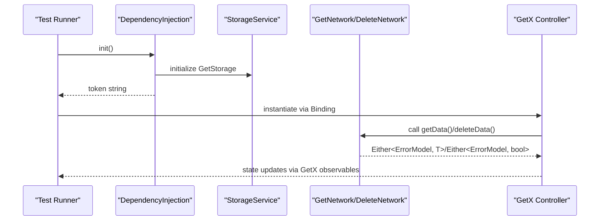
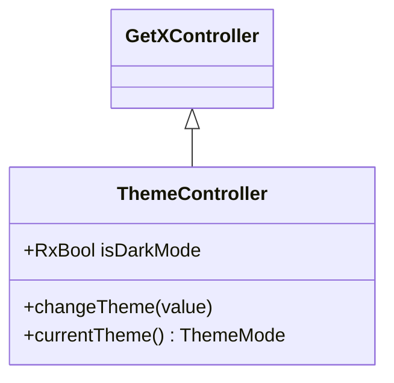
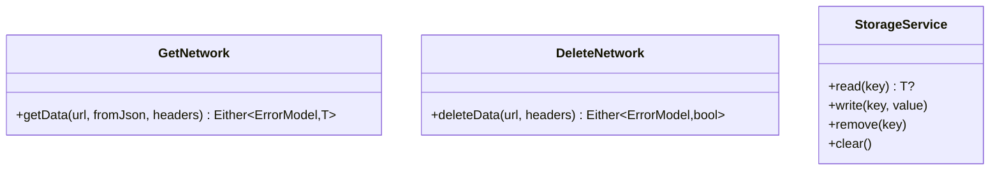
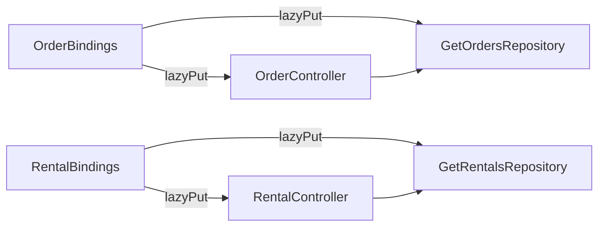

# Testing Strategy

<cite>
**Referenced Files in This Document**
- [pubspec.yaml](file://pubspec.yaml)
- [analysis_options.yaml](file://analysis_options.yaml)
- [test/widget_test.dart](file://test/widget_test.dart)
- [lib/main.dart](file://lib/main.dart)
- [lib/core/di/dependency_injection.dart](file://lib/core/di/dependency_injection.dart)
- [lib/core/data/networks/get_network.dart](file://lib/core/data/networks/get_network.dart)
- [lib/core/data/networks/delete_network.dart](file://lib/core/data/networks/delete_network.dart)
- [lib/core/data/local/storage_service.dart](file://lib/core/data/local/storage_service.dart)
- [lib/core/theme/theme_controller.dart](file://lib/core/theme/theme_controller.dart)
- [lib/features/order/bindings/order_bindings.dart](file://lib/features/order/bindings/order_bindings.dart)
- [lib/features/rental/bindings/rental_bindings.dart](file://lib/features/rental/bindings/rental_bindings.dart)
- [lib/features/rent_request/widgets/rent_appliance_widgets/rent_appliance_widgets.dart](file://lib/features/rent_request/widgets/rent_appliance_widgets/rent_appliance_widgets.dart)
- [lib/features/rent_request/widgets/rent_floor_plan_widgets/floor_plan_widgets.dart](file://lib/features/rent_request/widgets/rent_floor_plan_widgets/floor_plan_widgets.dart)
</cite>

## Table of Contents
1. [Introduction](#introduction)
2. [Project Structure](#project-structure)
3. [Core Components](#core-components)
4. [Architecture Overview](#architecture-overview)
5. [Detailed Component Analysis](#detailed-component-analysis)
6. [Dependency Analysis](#dependency-analysis)
7. [Performance Considerations](#performance-considerations)
8. [Troubleshooting Guide](#troubleshooting-guide)
9. [Conclusion](#conclusion)
10. [Appendices](#appendices)

## Introduction
This document defines a comprehensive testing strategy for the ZB-DEZINE Flutter project. It covers unit testing with Flutter’s testing framework, widget testing, mock data strategies, and testing patterns for GetX controllers, repositories, and services. It also outlines testing setup, configuration, continuous integration considerations, best practices for state management and asynchronous operations, API integration testing, performance testing, accessibility testing, and cross-platform testing.

## Project Structure
The project follows a layered architecture with clear separation of concerns:
- Presentation layer: GetMaterialApp and routes configured in main.
- Dependency injection: Centralized initialization via DependencyInjection.
- Data layer: Network clients and storage services.
- Feature layer: Feature-specific bindings and controllers.
- Test layer: Basic widget smoke test under test/.

```mermaid
graph TB
subgraph "Presentation"
MAIN["MyApp<br/>lib/main.dart"]
end
subgraph "DI"
DI["DependencyInjection<br/>lib/core/di/dependency_injection.dart"]
end
subgraph "Data Layer"
GETNET["GetNetwork<br/>lib/core/data/networks/get_network.dart"]
DELNET["DeleteNetwork<br/>lib/core/data/networks/delete_network.dart"]
STORAGE["StorageService<br/>lib/core/data/local/storage_service.dart"]
end
subgraph "Feature Bindings"
ORDERBIND["OrderBindings<br/>lib/features/order/bindings/order_bindings.dart"]
RENTALBIND["RentalBindings<br/>lib/features/rental/bindings/rental_bindings.dart"]
end
MAIN --> DI
DI --> GETNET
DI --> DELNET
DI --> STORAGE
ORDERBIND --> GETNET
RENTALBIND --> GETNET
```

**Diagram sources**
- [lib/main.dart:12-46](file://lib/main.dart#L12-L46)
- [lib/core/di/dependency_injection.dart:11-26](file://lib/core/di/dependency_injection.dart#L11-L26)
- [lib/core/data/networks/get_network.dart:8-40](file://lib/core/data/networks/get_network.dart#L8-L40)
- [lib/core/data/networks/delete_network.dart:8-40](file://lib/core/data/networks/delete_network.dart#L8-L40)
- [lib/core/data/local/storage_service.dart:3-23](file://lib/core/data/local/storage_service.dart#L3-L23)
- [lib/features/order/bindings/order_bindings.dart:5-11](file://lib/features/order/bindings/order_bindings.dart#L5-L11)
- [lib/features/rental/bindings/rental_bindings.dart:5-11](file://lib/features/rental/bindings/rental_bindings.dart#L5-L11)

**Section sources**
- [lib/main.dart:12-46](file://lib/main.dart#L12-L46)
- [lib/core/di/dependency_injection.dart:11-26](file://lib/core/di/dependency_injection.dart#L11-L26)
- [test/widget_test.dart:13-30](file://test/widget_test.dart#L13-L30)

## Core Components
- DependencyInjection initializes GetStorage and registers services and network clients as singletons for the app lifecycle.
- StorageService wraps GetStorage for token and preference persistence.
- ThemeController is an Rx controller managing theme mode and delegating persistence to ThemeService.
- GetNetwork and DeleteNetwork encapsulate HTTP GET and DELETE requests returning Either<ErrorModel, T>.
- Feature Bindings register repositories and controllers lazily using Get.lazyPut.

Key testing implications:
- Controllers and repositories depend on injected services and network clients.
- State management relies on GetX reactive variables; tests should assert observable state transitions.
- Network clients return Either types; tests should cover both Left and Right branches.

**Section sources**
- [lib/core/di/dependency_injection.dart:11-26](file://lib/core/di/dependency_injection.dart#L11-L26)
- [lib/core/data/local/storage_service.dart:3-23](file://lib/core/data/local/storage_service.dart#L3-L23)
- [lib/core/theme/theme_controller.dart:5-22](file://lib/core/theme/theme_controller.dart#L5-L22)
- [lib/core/data/networks/get_network.dart:8-40](file://lib/core/data/networks/get_network.dart#L8-L40)
- [lib/core/data/networks/delete_network.dart:8-40](file://lib/core/data/networks/delete_network.dart#L8-L40)
- [lib/features/order/bindings/order_bindings.dart:5-11](file://lib/features/order/bindings/order_bindings.dart#L5-L11)
- [lib/features/rental/bindings/rental_bindings.dart:5-11](file://lib/features/rental/bindings/rental_bindings.dart#L5-L11)

## Architecture Overview
The testing architecture leverages Flutter’s testing framework and GetX’s dependency injection. Tests will:
- Initialize DI in a controlled manner.
- Replace real services with mocks or fakes.
- Assert UI behavior via WidgetTester.
- Validate state changes and asynchronous flows.



**Diagram sources**
- [lib/core/di/dependency_injection.dart:12-25](file://lib/core/di/dependency_injection.dart#L12-L25)
- [lib/core/data/local/storage_service.dart:7-21](file://lib/core/data/local/storage_service.dart#L7-L21)
- [lib/core/data/networks/get_network.dart:10-39](file://lib/core/data/networks/get_network.dart#L10-L39)
- [lib/core/data/networks/delete_network.dart:10-39](file://lib/core/data/networks/delete_network.dart#L10-L39)

## Detailed Component Analysis

### Unit Testing Approach with Flutter
- Use test/ for unit and widget tests.
- Keep tests isolated; avoid relying on global state.
- Prefer injecting dependencies via DI or constructor parameters to enable mocking.

Recommended setup:
- Add dev_dependencies for flutter_test and lints.
- Configure analysis_options.yaml to enforce quality rules.

**Section sources**
- [pubspec.yaml:61-71](file://pubspec.yaml#L61-L71)
- [analysis_options.yaml:10-29](file://analysis_options.yaml#L10-L29)
- [test/widget_test.dart:13-30](file://test/widget_test.dart#L13-L30)

### Widget Testing Implementation
- Start with a smoke test to verify basic rendering and interactions.
- Use WidgetTester to pump widgets, tap buttons, and assert text or widget presence.
- For complex widgets, isolate reusable components and test them independently.

Example patterns:
- Render MyApp with a token and assert initial route and theme.
- Tap UI elements and verify state-driven UI changes.

**Section sources**
- [test/widget_test.dart:13-30](file://test/widget_test.dart#L13-L30)
- [lib/main.dart:21-46](file://lib/main.dart#L21-L46)

### Mock Data Strategies
- Define model factories or builders for test data.
- Use fake services that return predefined responses to simulate success and failure scenarios.
- For network clients, create stub implementations returning Either<ErrorModel, T> with Right or Left variants.

Best practices:
- Keep mock data minimal and deterministic.
- Parameterize test inputs to cover edge cases.

[No sources needed since this section provides general guidance]

### Testing Patterns for GetX Controllers
Controllers extend GetX controllers and manage reactive state. Tests should:
- Instantiate controllers with mocked dependencies.
- Trigger actions and assert observable state changes.
- Verify calls to repositories/services via spies or mocks.



**Diagram sources**
- [lib/core/theme/theme_controller.dart:5-22](file://lib/core/theme/theme_controller.dart#L5-L22)

**Section sources**
- [lib/core/theme/theme_controller.dart:5-22](file://lib/core/theme/theme_controller.dart#L5-L22)

### Testing Repository Classes
Repositories depend on network clients and encapsulate business logic. Tests should:
- Mock network clients to return Either<ErrorModel, T>.
- Assert repository methods handle success and error cases.
- Verify repository delegates to correct network endpoints.



**Diagram sources**
- [lib/core/data/networks/get_network.dart:8-40](file://lib/core/data/networks/get_network.dart#L8-L40)
- [lib/core/data/networks/delete_network.dart:8-40](file://lib/core/data/networks/delete_network.dart#L8-L40)
- [lib/core/data/local/storage_service.dart:3-23](file://lib/core/data/local/storage_service.dart#L3-L23)

**Section sources**
- [lib/core/data/networks/get_network.dart:8-40](file://lib/core/data/networks/get_network.dart#L8-L40)
- [lib/core/data/networks/delete_network.dart:8-40](file://lib/core/data/networks/delete_network.dart#L8-L40)
- [lib/core/data/local/storage_service.dart:3-23](file://lib/core/data/local/storage_service.dart#L3-L23)

### Testing Service Implementations
Services often wrap platform or third-party APIs. Tests should:
- Wrap services behind interfaces or abstract classes.
- Inject fakes for platform-specific behavior.
- Validate error propagation and success paths.

[No sources needed since this section provides general guidance]

### Testing Setup and Configuration
- Ensure flutter_test is declared in dev_dependencies.
- Configure lints via analysis_options.yaml.
- Initialize DI in tests by calling DependencyInjection.init() and controlling the returned token to simulate logged-in/logged-out states.

**Section sources**
- [pubspec.yaml:61-71](file://pubspec.yaml#L61-L71)
- [analysis_options.yaml:10-29](file://analysis_options.yaml#L10-L29)
- [lib/core/di/dependency_injection.dart:12-25](file://lib/core/di/dependency_injection.dart#L12-L25)

### Continuous Integration Considerations
- Run flutter test on CI to validate unit and widget tests.
- Use caching for dependencies to speed up builds.
- Separate jobs for different platforms if needed, but rely on Flutter’s cross-platform capabilities.

[No sources needed since this section provides general guidance]

### Best Practices for State Management
- Use GetX observables for reactive UI updates; tests should assert state transitions.
- Avoid tight coupling to global singletons; prefer injecting controllers and services.
- Keep controllers thin; delegate heavy logic to repositories/services.

**Section sources**
- [lib/core/theme/theme_controller.dart:5-22](file://lib/core/theme/theme_controller.dart#L5-L22)

### Asynchronous Operations and API Integration Testing
- Mock network clients to return Either<ErrorModel, T> with Right for success and Left for error.
- Test both happy path and error scenarios.
- For DELETE operations, assert Left(ErrorModel) when HTTP status indicates failure.

**Section sources**
- [lib/core/data/networks/get_network.dart:10-39](file://lib/core/data/networks/get_network.dart#L10-L39)
- [lib/core/data/networks/delete_network.dart:10-39](file://lib/core/data/networks/delete_network.dart#L10-L39)

### Examples of Test Implementation and Mocking Strategies
- Example: Counter smoke test pattern for widget testing.
- Strategy: Replace real StorageService with a fake that returns a fixed token or null to simulate auth state.
- Strategy: Replace GetNetwork with a spy/fake that returns Either.right for success and Either.left for error.

**Section sources**
- [test/widget_test.dart:13-30](file://test/widget_test.dart#L13-L30)
- [lib/core/data/local/storage_service.dart:7-21](file://lib/core/data/local/storage_service.dart#L7-L21)
- [lib/core/data/networks/get_network.dart:10-39](file://lib/core/data/networks/get_network.dart#L10-L39)

### Test Automation
- Automate running flutter test locally and on CI.
- Use selective test filtering during development and full suites in CI.
- Integrate coverage collection to track test completeness.

[No sources needed since this section provides general guidance]

### Accessibility Testing
- Verify semantic labels and content descriptions for interactive elements.
- Test dynamic type scaling and high contrast modes.
- Ensure focus traversal works as expected in tabbed UIs.

[No sources needed since this section provides general guidance]

### Cross-Platform Testing Considerations
- Run tests on iOS, Android, web, macOS, Windows, and Linux runners in CI.
- Account for platform-specific behaviors (e.g., keyboard handling, gesture differences).
- Use device/emulator matrices to detect regressions across platforms.

[No sources needed since this section provides general guidance]

## Dependency Analysis
Feature Bindings demonstrate dependency registration patterns. Tests should:
- Register fake repositories/controllers via Get.lazyPut.
- Verify that controllers resolve dependencies from Get.



**Diagram sources**
- [lib/features/order/bindings/order_bindings.dart:5-11](file://lib/features/order/bindings/order_bindings.dart#L5-L11)
- [lib/features/rental/bindings/rental_bindings.dart:5-11](file://lib/features/rental/bindings/rental_bindings.dart#L5-L11)

**Section sources**
- [lib/features/order/bindings/order_bindings.dart:5-11](file://lib/features/order/bindings/order_bindings.dart#L5-L11)
- [lib/features/rental/bindings/rental_bindings.dart:5-11](file://lib/features/rental/bindings/rental_bindings.dart#L5-L11)

## Performance Considerations
- Profile UI builds and long lists; use ListView.builder and optimized widgets.
- Minimize unnecessary rebuilds by scoping GetBuilder/Obx to minimal subtrees.
- Cache frequently accessed data and avoid synchronous I/O in hot loops.

[No sources needed since this section provides general guidance]

## Troubleshooting Guide
Common issues and resolutions:
- Tests fail due to missing DI: Initialize DependencyInjection.init() before building widgets.
- Network-dependent tests flaky: Mock network clients and return deterministic Either results.
- State not updating: Ensure controllers update Rx variables and views are wrapped in GetBuilder/Obx.

**Section sources**
- [lib/core/di/dependency_injection.dart:12-25](file://lib/core/di/dependency_injection.dart#L12-L25)
- [lib/core/data/networks/get_network.dart:10-39](file://lib/core/data/networks/get_network.dart#L10-L39)
- [lib/core/theme/theme_controller.dart:5-22](file://lib/core/theme/theme_controller.dart#L5-L22)

## Conclusion
This testing strategy aligns ZB-DEZINE’s architecture with Flutter’s testing ecosystem. By leveraging GetX’s reactive state, DI, and structured bindings, teams can write reliable unit and widget tests. Mocking network clients and storage services enables deterministic test runs. Extending these patterns across controllers, repositories, and services will ensure maintainable and robust code.

## Appendices

### Appendix A: Widget Interaction Examples
- Render MyApp with a token and assert initial route and theme.
- Interact with UI toggles and verify state-driven UI changes.

**Section sources**
- [lib/main.dart:21-46](file://lib/main.dart#L21-L46)
- [lib/features/rent_request/widgets/rent_appliance_widgets/rent_appliance_widgets.dart:47-87](file://lib/features/rent_request/widgets/rent_appliance_widgets/rent_appliance_widgets.dart#L47-L87)
- [lib/features/rent_request/widgets/rent_floor_plan_widgets/floor_plan_widgets.dart:46-87](file://lib/features/rent_request/widgets/rent_floor_plan_widgets/floor_plan_widgets.dart#L46-L87)