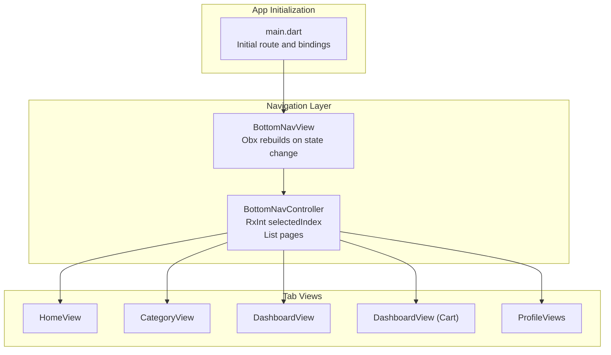
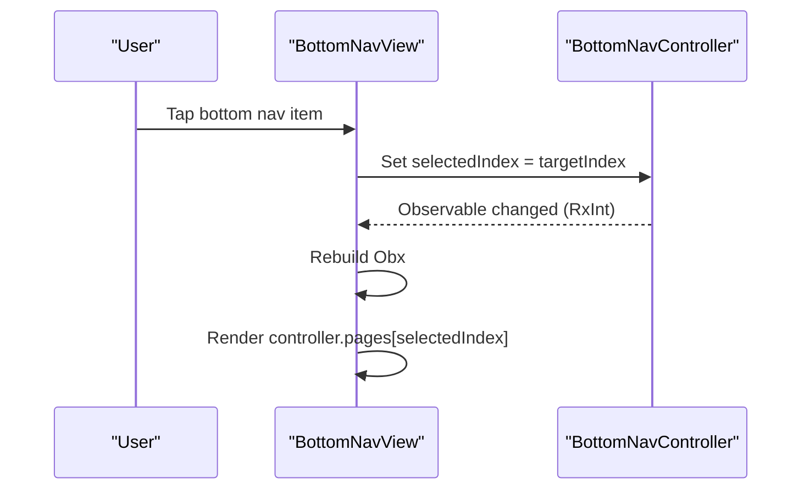
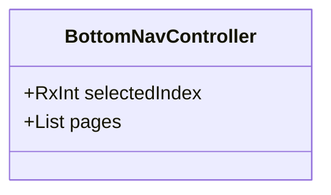
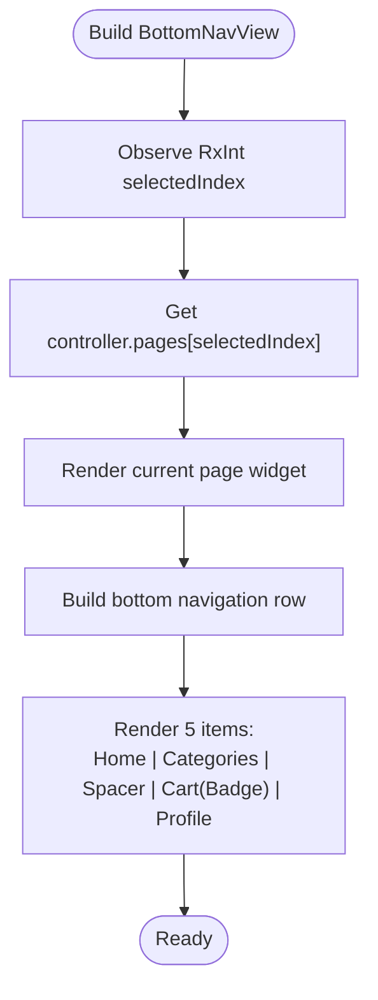
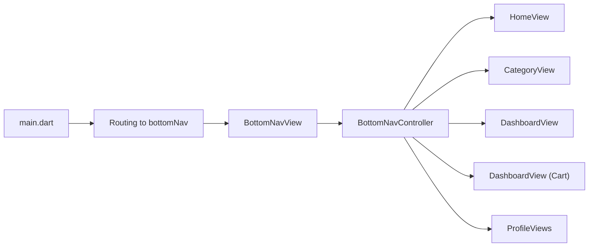

# Bottom Navigation System

<cite>
**Referenced Files in This Document**
- [bottom_nav_controller.dart](file://lib/features/home/controller/bottom_nav_controller.dart)
- [bottom_nav_view.dart](file://lib/features/home/views/bottom_nav_view.dart)
- [bottom_nav_items.dart](file://lib/features/home/widgets/bottom_nav_items.dart)
- [home_view.dart](file://lib/features/home/views/home_view.dart)
- [category_view.dart](file://lib/features/category/views/category_view.dart)
- [dashboard_view.dart](file://lib/features/dashboard/views/dashboard_view.dart)
- [profile_views.dart](file://lib/features/profile/views/profile_views.dart)
- [main.dart](file://lib/main.dart)
</cite>

## Table of Contents
1. [Introduction](#introduction)
2. [Project Structure](#project-structure)
3. [Core Components](#core-components)
4. [Architecture Overview](#architecture-overview)
5. [Detailed Component Analysis](#detailed-component-analysis)
6. [Dependency Analysis](#dependency-analysis)
7. [Performance Considerations](#performance-considerations)
8. [Troubleshooting Guide](#troubleshooting-guide)
9. [Conclusion](#conclusion)

## Introduction
This document explains the bottom navigation system used in ZB-DEZINE's user dashboard. It focuses on the BottomNavController implementation, page management, selected index tracking, and reactive state handling via GetX. The system supports a five-tab navigation: Home, Categories, Dashboard, Cart (with badge), and Profile. We also cover how to add new tabs, customize tab appearance, handle navigation events, manage the navigation lifecycle, and optimize performance for smooth tab switching.

## Project Structure
The bottom navigation is implemented using a dedicated controller and a view that renders the current page along with a custom bottom navigation bar. Supporting views represent each tab’s content. The main application bootstraps the app and routes to the bottom navigation screen.

**Diagram sources**
- [main.dart:36-40](file://lib/main.dart#L36-L40)
- [bottom_nav_controller.dart:7-16](file://lib/features/home/controller/bottom_nav_controller.dart#L7-L16)
- [bottom_nav_view.dart:11-131](file://lib/features/home/views/bottom_nav_view.dart#L11-L131)
- [home_view.dart:15-76](file://lib/features/home/views/home_view.dart#L15-L76)
- [category_view.dart:12-100](file://lib/features/category/views/category_view.dart#L12-L100)
- [dashboard_view.dart:17-62](file://lib/features/dashboard/views/dashboard_view.dart#L17-L62)
- [profile_views.dart:15-58](file://lib/features/profile/views/profile_views.dart#L15-L58)

**Section sources**
- [main.dart:12-47](file://lib/main.dart#L12-L47)
- [bottom_nav_controller.dart:1-17](file://lib/features/home/controller/bottom_nav_controller.dart#L1-L17)
- [bottom_nav_view.dart:1-256](file://lib/features/home/views/bottom_nav_view.dart#L1-L256)

## Core Components
- BottomNavController: Manages the selected tab index and holds a list of tab pages. It extends GetxController and exposes an observable integer for the selected index.
- BottomNavView: Renders the current page from the controller’s page list and displays a custom bottom navigation bar with five items. It reacts to state changes using Obx.
- Tab Views: Each tab corresponds to a view widget (Home, Category, Dashboard, Cart, Profile). These widgets are instantiated once and reused by the controller.

Key responsibilities:
- Page management: The controller maintains a list of page widgets mapped to indices.
- Selected index tracking: An observable integer tracks the currently selected tab.
- Reactive state: Changes to the selected index trigger rebuilds of the view via GetX’s reactive system.
- Navigation events: Tapping a bottom nav item updates the selected index, which triggers a rebuild and displays the corresponding page.

**Section sources**
- [bottom_nav_controller.dart:7-16](file://lib/features/home/controller/bottom_nav_controller.dart#L7-L16)
- [bottom_nav_view.dart:11-131](file://lib/features/home/views/bottom_nav_view.dart#L11-L131)

## Architecture Overview
The bottom navigation follows a unidirectional reactive flow:
- User taps a bottom navigation item.
- The view updates the controller’s selected index.
- The view observes the selected index and rebuilds to show the corresponding page from the controller’s page list.

**Diagram sources**
- [bottom_nav_view.dart:133-167](file://lib/features/home/views/bottom_nav_view.dart#L133-L167)
- [bottom_nav_view.dart:169-219](file://lib/features/home/views/bottom_nav_view.dart#L169-L219)
- [bottom_nav_view.dart:221-254](file://lib/features/home/views/bottom_nav_view.dart#L221-L254)
- [bottom_nav_controller.dart:8](file://lib/features/home/controller/bottom_nav_controller.dart#L8)

## Detailed Component Analysis

### BottomNavController
- Purpose: Centralizes navigation state and page list.
- State: RxInt selectedIndex initialized to 0.
- Pages: A list containing five widgets representing Home, Categories, Dashboard, Cart, and Profile.

Implementation highlights:
- Uses Getx for reactive state.
- Holds pre-instantiated page widgets for immediate rendering.

**Diagram sources**
- [bottom_nav_controller.dart:7-16](file://lib/features/home/controller/bottom_nav_controller.dart#L7-L16)

**Section sources**
- [bottom_nav_controller.dart:7-16](file://lib/features/home/controller/bottom_nav_controller.dart#L7-L16)

### BottomNavView
- Purpose: Renders the current page and the bottom navigation bar.
- Reactive rendering: Uses Obx to rebuild when the selected index changes.
- Layout: A Stack containing the current page and a custom bottom navigation bar.
- Bottom navigation bar: Composed of five items:
  - Home
  - Categories
  - Empty spacer
  - Cart with badge
  - Profile avatar
- Navigation event handling: Each item sets the controller’s selected index on tap.

Appearance customization:
- Uses theme brightness to choose container colors.
- Applies shadows and rounded corners to the bottom navigation container.
- Colors and sizes are responsive using screen util.

**Diagram sources**
- [bottom_nav_view.dart:11-131](file://lib/features/home/views/bottom_nav_view.dart#L11-L131)
- [bottom_nav_view.dart:133-254](file://lib/features/home/views/bottom_nav_view.dart#L133-L254)

**Section sources**
- [bottom_nav_view.dart:11-131](file://lib/features/home/views/bottom_nav_view.dart#L11-L131)
- [bottom_nav_view.dart:133-254](file://lib/features/home/views/bottom_nav_view.dart#L133-L254)

### Tab Views
- HomeView: Main landing screen with lists and widgets.
- CategoryView: Lists quick actions and navigates to named routes.
- DashboardView: Main dashboard content with app bar and multiple widgets.
- ProfileViews: User profile screen with loading states and logout action.

These views are referenced by the controller’s page list and rendered based on the selected index.

**Section sources**
- [home_view.dart:15-76](file://lib/features/home/views/home_view.dart#L15-L76)
- [category_view.dart:12-100](file://lib/features/category/views/category_view.dart#L12-L100)
- [dashboard_view.dart:17-62](file://lib/features/dashboard/views/dashboard_view.dart#L17-L62)
- [profile_views.dart:15-58](file://lib/features/profile/views/profile_views.dart#L15-L58)

### Alternative Bottom Navigation Item Widget
There is also a ConvexBottomBar delegate that renders icons for each tab. While not used in the current BottomNavView, it demonstrates an alternative approach to tab rendering.

**Section sources**
- [bottom_nav_items.dart:7-25](file://lib/features/home/widgets/bottom_nav_items.dart#L7-L25)

## Dependency Analysis
- BottomNavView depends on BottomNavController for state and page list.
- BottomNavController depends on the tab view widgets for its page list.
- The main app initializes routing and binds the Home module, which includes the bottom navigation.

**Diagram sources**
- [main.dart:36-40](file://lib/main.dart#L36-L40)
- [bottom_nav_view.dart:11-131](file://lib/features/home/views/bottom_nav_view.dart#L11-L131)
- [bottom_nav_controller.dart:7-16](file://lib/features/home/controller/bottom_nav_controller.dart#L7-L16)

**Section sources**
- [main.dart:36-40](file://lib/main.dart#L36-L40)
- [bottom_nav_controller.dart:7-16](file://lib/features/home/controller/bottom_nav_controller.dart#L7-L16)
- [bottom_nav_view.dart:11-131](file://lib/features/home/views/bottom_nav_view.dart#L11-L131)

## Performance Considerations
- Pre-instantiate pages: The controller stores widgets in a list so switching tabs avoids rebuilding heavy widgets.
- Reactive rebuild scope: Using Obx around the scaffold limits rebuilds to navigation-related changes.
- Minimal layout work: The bottom navigation bar is rendered once per rebuild; avoid unnecessary recompositions by keeping item widgets lightweight.
- Badge rendering: The cart badge adds minimal overhead but keep badge counts reactive only when needed.
- Drawer integration: When navigating to the dashboard via the floating center button, resetting drawer selection ensures consistent UI state.

[No sources needed since this section provides general guidance]

## Troubleshooting Guide
Common issues and resolutions:
- Tabs not updating after selection: Ensure the selected index setter is called on item taps and that the view is wrapped in Obx.
- Incorrect page shown: Verify the page list order matches tab indices and that the selected index stays within bounds.
- Styling inconsistencies: Confirm theme brightness is correctly detected and applied to container and text colors.
- Drawer state mismatch: When programmatically switching to the dashboard, update the drawer selection accordingly to prevent stale selections.

**Section sources**
- [bottom_nav_view.dart:133-167](file://lib/features/home/views/bottom_nav_view.dart#L133-L167)
- [bottom_nav_view.dart:169-219](file://lib/features/home/views/bottom_nav_view.dart#L169-L219)
- [bottom_nav_view.dart:221-254](file://lib/features/home/views/bottom_nav_view.dart#L221-L254)

## Conclusion
The bottom navigation system leverages GetX for reactive state management, with a dedicated controller holding the selected index and a list of tab pages. The view renders the current page and a custom bottom navigation bar with five items, supporting Home, Categories, Dashboard, Cart (with badge), and Profile. The design enables efficient tab switching, easy customization, and straightforward extension for additional tabs.