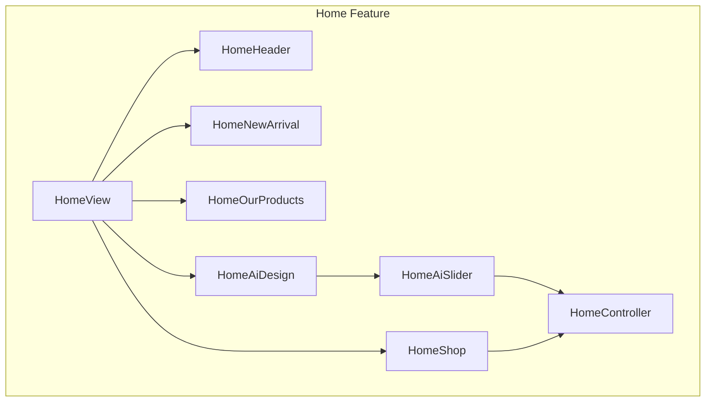
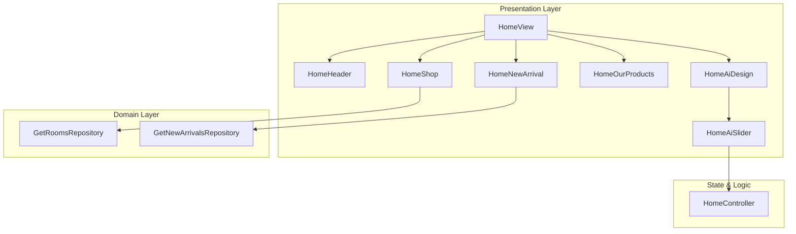
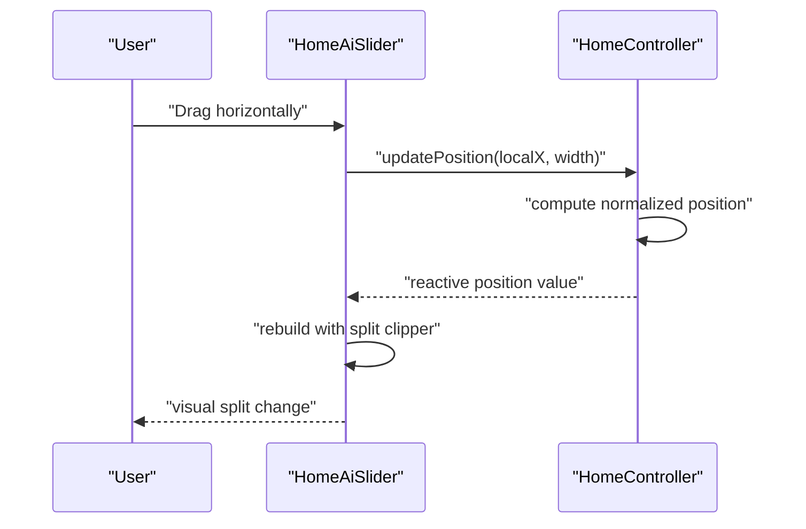
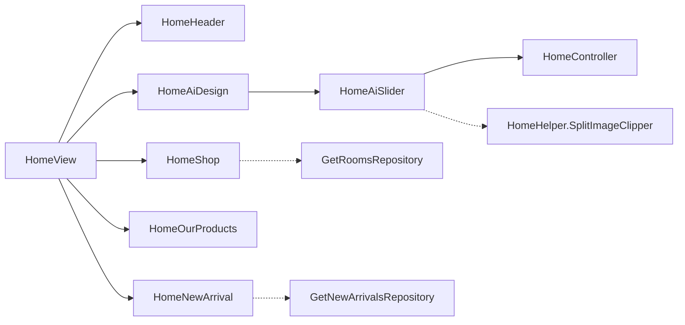

# Home Content Discovery

<cite>
**Referenced Files in This Document**
- [home_view.dart](file://lib/features/home/views/home_view.dart)
- [home_controller.dart](file://lib/features/home/controller/home_controller.dart)
- [home_header.dart](file://lib/features/home/widgets/home_widgets/home_header.dart)
- [home_helper.dart](file://lib/features/home/widgets/home_widgets/home_helper.dart)
- [home_shop.dart](file://lib/features/home/widgets/home_widgets/home_shop.dart)
- [home_new_arrival.dart](file://lib/features/home/widgets/home_widgets/home_new_arrival.dart)
- [home_our_products.dart](file://lib/features/home/widgets/home_widgets/home_our_products.dart)
- [home_ai_design.dart](file://lib/features/home/widgets/home_widgets/home_ai_design.dart)
- [home_ai_slider.dart](file://lib/features/home/widgets/home_widgets/home_ai_slider.dart)
- [get_rooms_repo.dart](file://lib/features/home/repositories/get_rooms_repo.dart)
- [get_new_arrivals_repo.dart](file://lib/features/home/repositories/get_new_arrivals_repo.dart)
</cite>

## Table of Contents
1. [Introduction](#introduction)
2. [Project Structure](#project-structure)
3. [Core Components](#core-components)
4. [Architecture Overview](#architecture-overview)
5. [Detailed Component Analysis](#detailed-component-analysis)
6. [Dependency Analysis](#dependency-analysis)
7. [Performance Considerations](#performance-considerations)
8. [Troubleshooting Guide](#troubleshooting-guide)
9. [Conclusion](#conclusion)

## Introduction
This document describes the home content discovery system in ZB-DEZINE’s user dashboard. It focuses on how the HomeView organizes and presents content, including featured/new arrivals, room-based browsing, personalized product recommendations, trending items, and AI-driven design previews. It also explains the role of the home controller in dynamic content loading, the content organization strategy, carousel and interactive elements, and how to customize and manage content freshness. Integration points with AI design features, promotional content, and recent activity feeds are covered alongside performance optimization strategies.

## Project Structure
The home feature is organized around a view-centric structure with controllers, repositories, models, and reusable widgets. The HomeView composes multiple specialized widgets to render a layered, horizontally scrollable feed of curated content. Controllers manage UI state and gestures, while repositories encapsulate network calls to fetch content.

**Diagram sources**
- [home_view.dart:15-76](file://lib/features/home/views/home_view.dart#L15-L76)
- [home_header.dart:10-58](file://lib/features/home/widgets/home_widgets/home_header.dart#L10-L58)
- [home_shop.dart:10-54](file://lib/features/home/widgets/home_widgets/home_shop.dart#L10-L54)
- [home_new_arrival.dart:9-67](file://lib/features/home/widgets/home_widgets/home_new_arrival.dart#L9-L67)
- [home_our_products.dart:11-89](file://lib/features/home/widgets/home_widgets/home_our_products.dart#L11-L89)
- [home_ai_design.dart:10-64](file://lib/features/home/widgets/home_widgets/home_ai_design.dart#L10-L64)
- [home_ai_slider.dart:9-82](file://lib/features/home/widgets/home_widgets/home_ai_slider.dart#L9-L82)
- [home_controller.dart:4-15](file://lib/features/home/controller/home_controller.dart#L4-L15)

**Section sources**
- [home_view.dart:15-76](file://lib/features/home/views/home_view.dart#L15-L76)
- [home_controller.dart:4-15](file://lib/features/home/controller/home_controller.dart#L4-L15)

## Core Components
- HomeView: The primary screen that arranges content sections vertically in a scrollable list. It sets up the background theme and composes header, room shop, new arrivals, product placement, curated products, promotions, and AI design preview.
- HomeController: Manages gesture-driven state for the AI slider, computing a normalized position value from drag deltas to drive the split-image comparison effect.
- HomeHeader: Renders a hero banner with branding and a search filter area.
- HomeHelper: Provides shared UI utilities such as category titles, shadows, and a custom clipper for the AI slider split effect.
- HomeShop: Displays horizontally scrollable room tiles fetched via a repository.
- HomeNewArrival: Presents newly arrived products in a horizontal list with placeholder loading.
- HomeOurProducts: Shows curated products with a filter row and horizontal scrolling.
- HomeAiDesign: Wraps the AI design preview container and integrates the slider and action button.
- HomeAiSlider: Implements a draggable split-image carousel comparing “before” and “after” visuals.

**Section sources**
- [home_view.dart:15-76](file://lib/features/home/views/home_view.dart#L15-L76)
- [home_controller.dart:4-15](file://lib/features/home/controller/home_controller.dart#L4-L15)
- [home_header.dart:10-58](file://lib/features/home/widgets/home_widgets/home_header.dart#L10-L58)
- [home_helper.dart:7-89](file://lib/features/home/widgets/home_widgets/home_helper.dart#L7-L89)
- [home_shop.dart:10-54](file://lib/features/home/widgets/home_widgets/home_shop.dart#L10-L54)
- [home_new_arrival.dart:9-67](file://lib/features/home/widgets/home_widgets/home_new_arrival.dart#L9-L67)
- [home_our_products.dart:11-89](file://lib/features/home/widgets/home_widgets/home_our_products.dart#L11-L89)
- [home_ai_design.dart:10-64](file://lib/features/home/widgets/home_widgets/home_ai_design.dart#L10-L64)
- [home_ai_slider.dart:9-82](file://lib/features/home/widgets/home_widgets/home_ai_slider.dart#L9-L82)

## Architecture Overview
The home content discovery follows a reactive MVVM-like pattern:
- View: Stateless widgets compose UI sections and bind to controllers/reactive state.
- Controller: Holds UI state and responds to user interactions (e.g., drag gestures).
- Repository: Encapsulates network calls and JSON deserialization for domain models.
- Model: Defines typed data structures for rooms and products.

**Diagram sources**
- [home_view.dart:15-76](file://lib/features/home/views/home_view.dart#L15-L76)
- [home_controller.dart:4-15](file://lib/features/home/controller/home_controller.dart#L4-L15)
- [get_rooms_repo.dart:7-20](file://lib/features/home/repositories/get_rooms_repo.dart#L7-L20)
- [get_new_arrivals_repo.dart:7-20](file://lib/features/home/repositories/get_new_arrivals_repo.dart#L7-L20)

## Detailed Component Analysis

### HomeView Composition and Content Organization
- Sections:
  - Hero header with branding and search filter.
  - Room-based browsing (“Shop by Room”) using a horizontal list.
  - New arrivals carousel.
  - Curated products carousel with filter row.
  - Promotional sections for selling and renting.
  - AI Room Interior Design preview with a draggable split-image slider.
- Layout:
  - Uses a vertical ListView with symmetric horizontal padding.
  - Theme-aware background color selection.
  - Consistent spacing and typography via shared widgets.

**Section sources**
- [home_view.dart:15-76](file://lib/features/home/views/home_view.dart#L15-L76)

### HomeHeader: Hero Banner and Search
- Renders a rounded-bottom banner image with overlayed headline and subtitle text.
- Integrates a search filter component to enable content discovery at a glance.

**Section sources**
- [home_header.dart:10-58](file://lib/features/home/widgets/home_widgets/home_header.dart#L10-L58)

### HomeShop: Room-Based Content Carousel
- Fetches room data via a repository and displays thumbnails in a horizontal ListView.
- Uses cached image providers for efficient rendering and smooth scrolling.
- Shows a loading indicator while data is being fetched.

**Section sources**
- [home_shop.dart:10-54](file://lib/features/home/widgets/home_widgets/home_shop.dart#L10-L54)
- [get_rooms_repo.dart:7-20](file://lib/features/home/repositories/get_rooms_repo.dart#L7-L20)

### HomeNewArrival: Trending/New Items
- Displays newly arrived products in a horizontal list.
- Includes a loading state and product metadata rendering.
- Supports favorite/cart actions placeholders for future integration.

**Section sources**
- [home_new_arrival.dart:9-67](file://lib/features/home/widgets/home_widgets/home_new_arrival.dart#L9-L67)
- [get_new_arrivals_repo.dart:7-20](file://lib/features/home/repositories/get_new_arrivals_repo.dart#L7-L20)

### HomeOurProducts: Curated Product Feed
- Presents a titled section with a filter row and a horizontal product carousel.
- Uses a consistent product card layout with media and pricing.

**Section sources**
- [home_our_products.dart:11-89](file://lib/features/home/widgets/home_widgets/home_our_products.dart#L11-L89)

### HomeAiDesign and HomeAiSlider: Interactive Preview
- HomeAiDesign wraps a bordered container with a title and a central preview area.
- HomeAiSlider implements a draggable split-image comparison:
  - Tracks horizontal drag updates.
  - Normalizes drag delta to a 0..1 position.
  - Clips “before” and “after” images based on the computed position.
  - Highlights a central handle for precise interaction.

**Diagram sources**
- [home_ai_slider.dart:16-22](file://lib/features/home/widgets/home_widgets/home_ai_slider.dart#L16-L22)
- [home_controller.dart:10-13](file://lib/features/home/controller/home_controller.dart#L10-L13)
- [home_helper.dart:69-89](file://lib/features/home/widgets/home_widgets/home_helper.dart#L69-L89)

**Section sources**
- [home_ai_design.dart:10-64](file://lib/features/home/widgets/home_widgets/home_ai_design.dart#L10-L64)
- [home_ai_slider.dart:9-82](file://lib/features/home/widgets/home_widgets/home_ai_slider.dart#L9-L82)
- [home_controller.dart:4-15](file://lib/features/home/controller/home_controller.dart#L4-L15)
- [home_helper.dart:7-89](file://lib/features/home/widgets/home_widgets/home_helper.dart#L7-L89)

### Content Aggregation and Recommendation Strategy
- Featured and curated content:
  - New arrivals and room-based categories are presented as curated feeds.
  - Filters (e.g., product type) are exposed to narrow selections.
- Personalization:
  - The current implementation does not include explicit personalized recommendation logic in the provided files.
  - Personalization could be introduced by adding a dedicated controller/repository pair to fetch user-specific suggestions and integrating it into HomeView.
- Trending items:
  - New arrivals are filtered server-side and surfaced as a dedicated carousel.
- User-specific content:
  - Placeholder actions (favorite, cart) indicate potential integration points for user preferences and purchase history.

**Section sources**
- [home_new_arrival.dart:9-67](file://lib/features/home/widgets/home_widgets/home_new_arrival.dart#L9-L67)
- [home_our_products.dart:11-89](file://lib/features/home/widgets/home_widgets/home_our_products.dart#L11-L89)

### Dynamic Content Loading and Freshness
- Reactive state:
  - Widgets observe controller state (e.g., isLoading) to switch between loading and content views.
- Network orchestration:
  - Repositories encapsulate GET requests with typed JSON parsing and centralized headers.
- Freshness controls:
  - No explicit cache invalidation or refresh triggers are present in the provided files.
  - Recommendations:
    - Add a last-refresh timestamp and a manual refresh trigger in the home controller.
    - Introduce cache TTL and background refresh policies at the repository level.

**Section sources**
- [home_shop.dart:15-51](file://lib/features/home/widgets/home_widgets/home_shop.dart#L15-L51)
- [get_rooms_repo.dart:11-18](file://lib/features/home/repositories/get_rooms_repo.dart#L11-L18)
- [get_new_arrivals_repo.dart:11-18](file://lib/features/home/repositories/get_new_arrivals_repo.dart#L11-L18)

### Carousels and Interactive Elements
- Horizontal carousels:
  - Room tiles, new arrivals, and curated products use horizontal ListViews with shrink-wrap sizing.
- Gesture handling:
  - The AI slider computes a normalized position from drag deltas and rebuilds the split-image clipper reactively.
- Visual feedback:
  - Central handle and divider enhance UX during interaction.

**Section sources**
- [home_shop.dart:20-49](file://lib/features/home/widgets/home_widgets/home_shop.dart#L20-L49)
- [home_new_arrival.dart:26-63](file://lib/features/home/widgets/home_widgets/home_new_arrival.dart#L26-L63)
- [home_our_products.dart:36-83](file://lib/features/home/widgets/home_widgets/home_our_products.dart#L36-L83)
- [home_ai_slider.dart:16-78](file://lib/features/home/widgets/home_widgets/home_ai_slider.dart#L16-L78)

### Customizing Homepage Content
- Adding a new feed:
  - Create a new controller and repository pair to fetch data.
  - Build a widget similar to existing carousels and integrate it into HomeView.
- Implementing content filters:
  - Extend the filter widget used by “Our Products” to support additional dimensions (e.g., price range, rating).
- Managing content freshness:
  - Track timestamps and expose a refresh mechanism in the home controller.

**Section sources**
- [home_view.dart:15-76](file://lib/features/home/views/home_view.dart#L15-L76)
- [home_our_products.dart:34-34](file://lib/features/home/widgets/home_widgets/home_our_products.dart#L34-L34)

### Integration with AI Design Features
- The AI design preview is a self-contained section with:
  - Step indicators.
  - A split-image slider for before/after comparison.
  - A call-to-action to initiate design placement.
- The slider leverages the home controller for gesture-driven state and the helper clipper for visual split.

**Section sources**
- [home_ai_design.dart:10-64](file://lib/features/home/widgets/home_widgets/home_ai_design.dart#L10-L64)
- [home_ai_slider.dart:9-82](file://lib/features/home/widgets/home_widgets/home_ai_slider.dart#L9-L82)
- [home_helper.dart:69-89](file://lib/features/home/widgets/home_widgets/home_helper.dart#L69-L89)

### Promotional Content Management
- Promotional sections (sell/rent) are integrated as dedicated widgets within HomeView.
- These can be extended to surface campaigns, banners, or CTAs aligned with marketing strategies.

**Section sources**
- [home_view.dart:65-67](file://lib/features/home/views/home_view.dart#L65-L67)

## Dependency Analysis
- View-to-controller coupling:
  - HomeAiSlider depends on HomeController for reactive position updates.
  - HomeShop and HomeNewArrival depend on their respective controllers for state and loading indicators.
- Controller-to-repository coupling:
  - Repositories encapsulate network logic and model parsing.
- UI helpers:
  - HomeHelper centralizes shared UI utilities and the split-image clipper.

**Diagram sources**
- [home_view.dart:15-76](file://lib/features/home/views/home_view.dart#L15-L76)
- [home_ai_slider.dart:9-82](file://lib/features/home/widgets/home_widgets/home_ai_slider.dart#L9-L82)
- [home_controller.dart:4-15](file://lib/features/home/controller/home_controller.dart#L4-L15)
- [get_rooms_repo.dart:7-20](file://lib/features/home/repositories/get_rooms_repo.dart#L7-L20)
- [get_new_arrivals_repo.dart:7-20](file://lib/features/home/repositories/get_new_arrivals_repo.dart#L7-L20)
- [home_helper.dart:69-89](file://lib/features/home/widgets/home_widgets/home_helper.dart#L69-L89)

**Section sources**
- [home_view.dart:15-76](file://lib/features/home/views/home_view.dart#L15-L76)
- [home_ai_slider.dart:9-82](file://lib/features/home/widgets/home_widgets/home_ai_slider.dart#L9-L82)
- [home_controller.dart:4-15](file://lib/features/home/controller/home_controller.dart#L4-L15)
- [get_rooms_repo.dart:7-20](file://lib/features/home/repositories/get_rooms_repo.dart#L7-L20)
- [get_new_arrivals_repo.dart:7-20](file://lib/features/home/repositories/get_new_arrivals_repo.dart#L7-L20)
- [home_helper.dart:69-89](file://lib/features/home/widgets/home_widgets/home_helper.dart#L69-L89)

## Performance Considerations
- Image loading:
  - Use cached network image providers for thumbnails to reduce bandwidth and improve perceived performance.
- Scroll performance:
  - Prefer ListView.builder with shrinkWrap only when necessary; avoid deep nested scrollables.
- Reactive rebuilds:
  - Keep reactive state granular (e.g., separate isLoading booleans per feed) to minimize unnecessary rebuilds.
- Gesture handling:
  - Debounce or throttle frequent updates (e.g., slider position) to balance responsiveness and performance.
- Caching and freshness:
  - Implement repository-level caching with TTL and background refresh.
  - Add pull-to-refresh or periodic refresh triggers controlled by the home controller.

[No sources needed since this section provides general guidance]

## Troubleshooting Guide
- Empty or missing content:
  - Verify repository URLs and headers; confirm network responses map to models.
- Slider not responding:
  - Ensure drag callbacks compute position relative to the widget’s max width.
- Visual clipping anomalies:
  - Confirm the split clipper receives a clamped position value and re-clips on updates.
- Loading states:
  - Ensure isLoading flags are toggled appropriately around asynchronous fetches.

**Section sources**
- [get_rooms_repo.dart:11-18](file://lib/features/home/repositories/get_rooms_repo.dart#L11-L18)
- [get_new_arrivals_repo.dart:11-18](file://lib/features/home/repositories/get_new_arrivals_repo.dart#L11-L18)
- [home_ai_slider.dart:16-78](file://lib/features/home/widgets/home_widgets/home_ai_slider.dart#L16-L78)
- [home_helper.dart:75-87](file://lib/features/home/widgets/home_widgets/home_helper.dart#L75-L87)

## Conclusion
The home content discovery system in ZB-DEZINE is structured around a clean separation of concerns: views assemble content, controllers manage UI state and gestures, and repositories encapsulate data fetching. The system supports curated feeds (rooms, new arrivals, products), promotional sections, and an engaging AI design preview. To evolve toward a fully personalized experience, introduce user-specific recommendation endpoints, refine filtering capabilities, and implement robust content freshness controls with caching and refresh strategies.