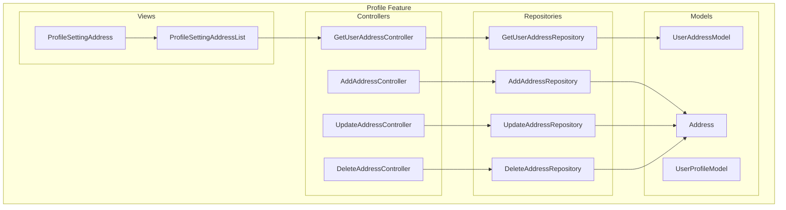
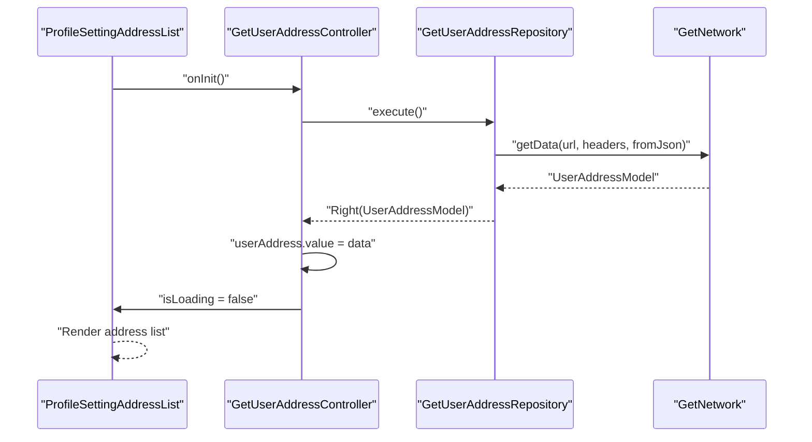
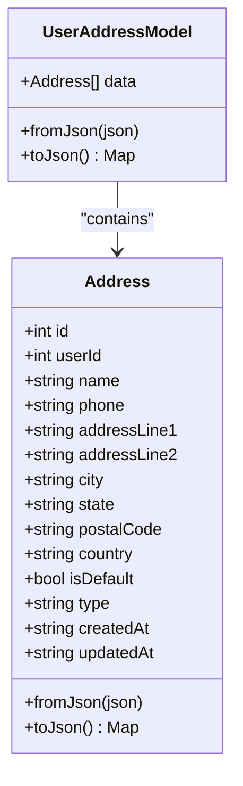
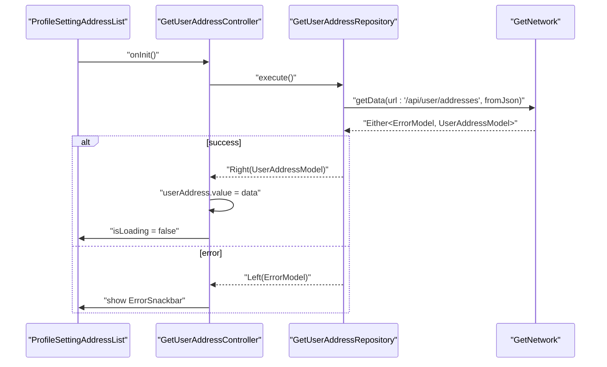
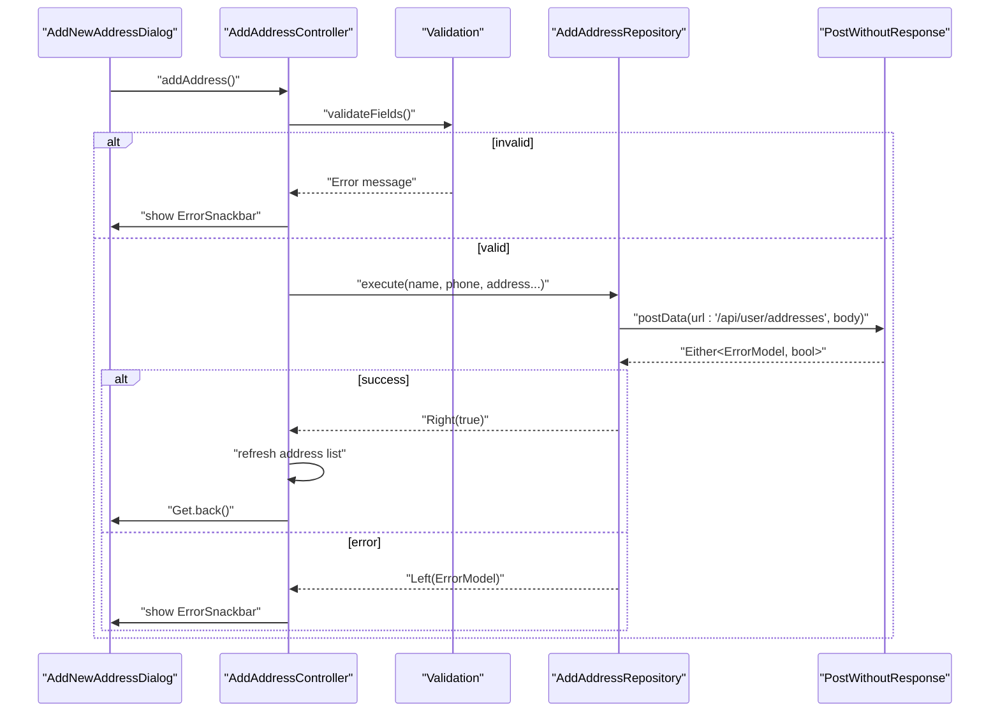
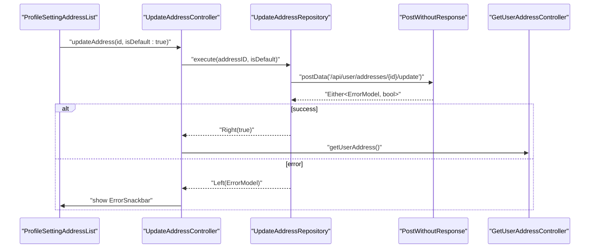
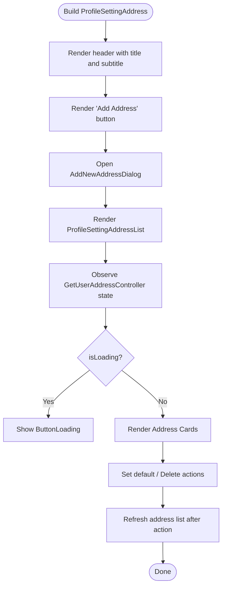
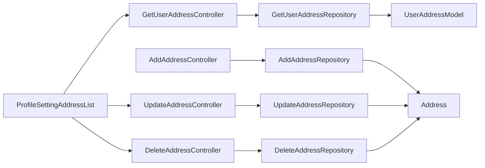

# Profile Management

<cite>
**Referenced Files in This Document**
- [get_user_address_controller.dart](file://lib/features/profile/controllers/get_user_address_controller.dart)
- [add_address_controller.dart](file://lib/features/profile/controllers/add_address_controller.dart)
- [update_address_controller.dart](file://lib/features/profile/controllers/update_address_controller.dart)
- [delete_address_controller.dart](file://lib/features/profile/controllers/delete_address_controller.dart)
- [get_user_address_repo.dart](file://lib/features/profile/repositories/get_user_address_repo.dart)
- [add_address_repo.dart](file://lib/features/profile/repositories/add_address_repo.dart)
- [update_address_repo.dart](file://lib/features/profile/repositories/update_address_repo.dart)
- [delete_address_repo.dart](file://lib/features/profile/repositories/delete_address_repo.dart)
- [user_address_model.dart](file://lib/features/profile/models/user_address_model.dart)
- [user_profile_model.dart](file://lib/core/data/global_models/user_profile_model.dart)
- [profile_setting_address.dart](file://lib/features/profile/widgets/profile_setting_widgets/profile_setting_address.dart)
- [profile_setting_address_list.dart](file://lib/features/profile/widgets/profile_setting_widgets/profile_setting_address_list.dart)
</cite>

## Table of Contents
1. [Introduction](#introduction)
2. [Project Structure](#project-structure)
3. [Core Components](#core-components)
4. [Architecture Overview](#architecture-overview)
5. [Detailed Component Analysis](#detailed-component-analysis)
6. [Dependency Analysis](#dependency-analysis)
7. [Performance Considerations](#performance-considerations)
8. [Troubleshooting Guide](#troubleshooting-guide)
9. [Security Considerations](#security-considerations)
10. [Conclusion](#conclusion)

## Introduction
This document describes the profile management system in ZB-DEZINE's user dashboard with a focus on:
- ProfileController functionality for retrieving and updating user information
- Profile views for displaying user details and managing addresses
- UserAddressModel structure and address book operations
- Examples of profile customization, address management, and preference settings
- Integration patterns between controllers and views, validation strategies, and error handling
- Security considerations for sensitive user data and privacy

## Project Structure
The profile management feature is organized under lib/features/profile with clear separation of concerns:
- Controllers handle UI logic and orchestrate network requests
- Repositories encapsulate network calls and data transformations
- Models define typed data structures for user profiles and addresses
- Widgets render views and bind to controller state

**Diagram sources**
- [get_user_address_controller.dart:1-32](file://lib/features/profile/controllers/get_user_address_controller.dart#L1-L32)
- [add_address_controller.dart:1-112](file://lib/features/profile/controllers/add_address_controller.dart#L1-L112)
- [update_address_controller.dart:1-32](file://lib/features/profile/controllers/update_address_controller.dart#L1-L32)
- [delete_address_controller.dart:1-28](file://lib/features/profile/controllers/delete_address_controller.dart#L1-L28)
- [get_user_address_repo.dart:1-20](file://lib/features/profile/repositories/get_user_address_repo.dart#L1-L20)
- [add_address_repo.dart:1-43](file://lib/features/profile/repositories/add_address_repo.dart#L1-L43)
- [update_address_repo.dart:1-24](file://lib/features/profile/repositories/update_address_repo.dart#L1-L24)
- [delete_address_repo.dart:1-19](file://lib/features/profile/repositories/delete_address_repo.dart#L1-L19)
- [user_address_model.dart:1-93](file://lib/features/profile/models/user_address_model.dart#L1-L93)
- [user_profile_model.dart:1-72](file://lib/core/data/global_models/user_profile_model.dart#L1-L72)
- [profile_setting_address.dart:1-45](file://lib/features/profile/widgets/profile_setting_widgets/profile_setting_address.dart#L1-L45)
- [profile_setting_address_list.dart:1-150](file://lib/features/profile/widgets/profile_setting_widgets/profile_setting_address_list.dart#L1-L150)

**Section sources**
- [get_user_address_controller.dart:1-32](file://lib/features/profile/controllers/get_user_address_controller.dart#L1-L32)
- [user_address_model.dart:1-93](file://lib/features/profile/models/user_address_model.dart#L1-L93)
- [profile_setting_address.dart:1-45](file://lib/features/profile/widgets/profile_setting_widgets/profile_setting_address.dart#L1-L45)

## Core Components
- GetUserAddressController: Fetches and exposes user addresses with loading and error states
- AddAddressController: Manages address creation with field validation and submission
- UpdateAddressController: Toggles default address selection
- DeleteAddressController: Removes saved addresses
- Repositories: Encapsulate network calls to "/api/user/addresses" endpoints
- Models: Typed structures for UserAddressModel and Address
- Views: Address management UI including header, add button, and address list

Key responsibilities:
- State management via GetX (Rx state, Obx widgets)
- Network responses handled with Either<ErrorModel, T> for robust error handling
- UI feedback via snackbars and loading indicators

**Section sources**
- [get_user_address_controller.dart:6-31](file://lib/features/profile/controllers/get_user_address_controller.dart#L6-L31)
- [add_address_controller.dart:7-112](file://lib/features/profile/controllers/add_address_controller.dart#L7-L112)
- [update_address_controller.dart:6-31](file://lib/features/profile/controllers/update_address_controller.dart#L6-L31)
- [delete_address_controller.dart:6-27](file://lib/features/profile/controllers/delete_address_controller.dart#L6-L27)
- [user_address_model.dart:1-93](file://lib/features/profile/models/user_address_model.dart#L1-L93)

## Architecture Overview
The system follows a layered pattern:
- Presentation Layer: Widgets observe controller state and trigger actions
- Business Logic Layer: Controllers coordinate repositories and manage validation
- Data Access Layer: Repositories perform network requests and parse JSON
- Domain Models: Strongly typed models for user and address data

**Diagram sources**
- [profile_setting_address_list.dart:13-148](file://lib/features/profile/widgets/profile_setting_widgets/profile_setting_address_list.dart#L13-L148)
- [get_user_address_controller.dart:13-24](file://lib/features/profile/controllers/get_user_address_controller.dart#L13-L24)
- [get_user_address_repo.dart:11-18](file://lib/features/profile/repositories/get_user_address_repo.dart#L11-L18)

## Detailed Component Analysis

### Address Model and Data Flow
The address domain is modeled with two classes:
- UserAddressModel: Top-level container with optional list of Address items
- Address: Full address record with metadata and timestamps

**Diagram sources**
- [user_address_model.dart:1-93](file://lib/features/profile/models/user_address_model.dart#L1-L93)

**Section sources**
- [user_address_model.dart:1-93](file://lib/features/profile/models/user_address_model.dart#L1-L93)

### Address Retrieval Workflow
- Controller initializes fetch on controller init
- Repository performs GET request to "/api/user/addresses"
- Response mapped to UserAddressModel via fromJson
- Error surfaced via snackbar; success updates reactive state

**Diagram sources**
- [get_user_address_controller.dart:13-24](file://lib/features/profile/controllers/get_user_address_controller.dart#L13-L24)
- [get_user_address_repo.dart:11-18](file://lib/features/profile/repositories/get_user_address_repo.dart#L11-L18)

**Section sources**
- [get_user_address_controller.dart:13-31](file://lib/features/profile/controllers/get_user_address_controller.dart#L13-L31)
- [get_user_address_repo.dart:11-18](file://lib/features/profile/repositories/get_user_address_repo.dart#L11-L18)

### Address Creation Workflow
- Collects form data from text controllers
- Validates required fields and phone length
- Submits to AddAddressRepository with complete phone number
- On success, refreshes address list and navigates back

**Diagram sources**
- [add_address_controller.dart:73-111](file://lib/features/profile/controllers/add_address_controller.dart#L73-L111)
- [add_address_repo.dart:12-42](file://lib/features/profile/repositories/add_address_repo.dart#L12-L42)

**Section sources**
- [add_address_controller.dart:46-111](file://lib/features/profile/controllers/add_address_controller.dart#L46-L111)
- [add_address_repo.dart:12-42](file://lib/features/profile/repositories/add_address_repo.dart#L12-L42)

### Address Update and Deletion Workflows
- Update: Calls repository endpoint to set an address as default
- Delete: Calls repository endpoint to remove an address

**Diagram sources**
- [update_address_controller.dart:11-30](file://lib/features/profile/controllers/update_address_controller.dart#L11-L30)
- [update_address_repo.dart:12-22](file://lib/features/profile/repositories/update_address_repo.dart#L12-L22)
- [get_user_address_controller.dart:13-24](file://lib/features/profile/controllers/get_user_address_controller.dart#L13-L24)

**Section sources**
- [update_address_controller.dart:11-30](file://lib/features/profile/controllers/update_address_controller.dart#L11-L30)
- [delete_address_controller.dart:11-26](file://lib/features/profile/controllers/delete_address_controller.dart#L11-L26)
- [update_address_repo.dart:12-22](file://lib/features/profile/repositories/update_address_repo.dart#L12-L22)
- [delete_address_repo.dart:10-17](file://lib/features/profile/repositories/delete_address_repo.dart#L10-L17)

### View Implementation and Integration
- ProfileSettingAddress: Renders header, add button, and address list container
- ProfileSettingAddressList: Observes controller state, renders address cards, and provides actions

**Diagram sources**
- [profile_setting_address.dart:10-44](file://lib/features/profile/widgets/profile_setting_widgets/profile_setting_address.dart#L10-L44)
- [profile_setting_address_list.dart:13-148](file://lib/features/profile/widgets/profile_setting_widgets/profile_setting_address_list.dart#L13-L148)

**Section sources**
- [profile_setting_address.dart:10-44](file://lib/features/profile/widgets/profile_setting_widgets/profile_setting_address.dart#L10-L44)
- [profile_setting_address_list.dart:13-148](file://lib/features/profile/widgets/profile_setting_widgets/profile_setting_address_list.dart#L13-L148)

### Form Validation Patterns
- Required fields validation for label, name, address lines, city, state, country, zip, and phone
- Phone normalization: extracts digits and enforces minimum length
- Immediate user feedback via snackbar on validation failure

Best practices demonstrated:
- Centralized validation method
- Clear error messages
- Pre-submission validation to avoid unnecessary network calls

**Section sources**
- [add_address_controller.dart:46-71](file://lib/features/profile/controllers/add_address_controller.dart#L46-L71)

### Error Handling Strategies
- Repository methods return Either<ErrorModel, T>, enabling explicit error handling
- Controllers surface errors via ErrorSnackbar
- UI remains responsive with loading flags and fallbacks

Recommendations:
- Extend error mapping to include HTTP status-specific messages
- Add retry mechanisms for transient failures
- Consider optimistic updates with rollback on error

**Section sources**
- [get_user_address_controller.dart:16-23](file://lib/features/profile/controllers/get_user_address_controller.dart#L16-L23)
- [add_address_controller.dart:99-109](file://lib/features/profile/controllers/add_address_controller.dart#L99-L109)
- [update_address_controller.dart:20-29](file://lib/features/profile/controllers/update_address_controller.dart#L20-L29)
- [delete_address_controller.dart:16-25](file://lib/features/profile/controllers/delete_address_controller.dart#L16-L25)

### Examples and Usage Scenarios
- Profile customization: Update user contact details via the user profile model (see UserProfileModel)
- Address addition: Fill the dialog form and submit; validation ensures completeness
- Address editing: Set an existing address as default using the update controller
- Preference settings: Toggle default address behavior through isDefault flag

Note: The user profile model (UserProfileModel) supports general user information retrieval and update operations outside the scope of address management.

**Section sources**
- [user_profile_model.dart:1-72](file://lib/core/data/global_models/user_profile_model.dart#L1-L72)
- [add_address_controller.dart:84-97](file://lib/features/profile/controllers/add_address_controller.dart#L84-L97)
- [update_address_controller.dart:14-18](file://lib/features/profile/controllers/update_address_controller.dart#L14-L18)

## Dependency Analysis
Controllers depend on repositories; repositories depend on network clients; views depend on controllers. There is minimal coupling between presentation and business logic via GetX state observation.

**Diagram sources**
- [profile_setting_address_list.dart:13-148](file://lib/features/profile/widgets/profile_setting_widgets/profile_setting_address_list.dart#L13-L148)
- [get_user_address_controller.dart:6-8](file://lib/features/profile/controllers/get_user_address_controller.dart#L6-L8)
- [add_address_controller.dart:7-9](file://lib/features/profile/controllers/add_address_controller.dart#L7-L9)
- [update_address_controller.dart:6-8](file://lib/features/profile/controllers/update_address_controller.dart#L6-L8)
- [delete_address_controller.dart:6-8](file://lib/features/profile/controllers/delete_address_controller.dart#L6-L8)
- [get_user_address_repo.dart:7-9](file://lib/features/profile/repositories/get_user_address_repo.dart#L7-L9)
- [add_address_repo.dart:8-10](file://lib/features/profile/repositories/add_address_repo.dart#L8-L10)
- [update_address_repo.dart:8-10](file://lib/features/profile/repositories/update_address_repo.dart#L8-L10)
- [delete_address_repo.dart:6-8](file://lib/features/profile/repositories/delete_address_repo.dart#L6-L8)
- [user_address_model.dart:1-2](file://lib/features/profile/models/user_address_model.dart#L1-L2)
- [user_address_model.dart:24-38](file://lib/features/profile/models/user_address_model.dart#L24-L38)

**Section sources**
- [profile_setting_address_list.dart:13-148](file://lib/features/profile/widgets/profile_setting_widgets/profile_setting_address_list.dart#L13-L148)
- [get_user_address_controller.dart:6-8](file://lib/features/profile/controllers/get_user_address_controller.dart#L6-L8)
- [add_address_controller.dart:7-9](file://lib/features/profile/controllers/add_address_controller.dart#L7-L9)
- [update_address_controller.dart:6-8](file://lib/features/profile/controllers/update_address_controller.dart#L6-L8)
- [delete_address_controller.dart:6-8](file://lib/features/profile/controllers/delete_address_controller.dart#L6-L8)

## Performance Considerations
- Reactive state updates: Use Obx sparingly; batch UI updates when rendering long lists
- Network efficiency: Reuse repositories and avoid redundant fetches by checking cached data
- Memory management: Dispose of TextEditingController instances in controllers
- Rendering: Virtualize long lists if address collections grow large

## Troubleshooting Guide
Common issues and resolutions:
- Empty address list: Verify network connectivity and authentication headers
- Validation errors: Ensure required fields are filled and phone number meets digit criteria
- Update/Delete failures: Confirm address ID exists and user has permission to modify

Diagnostics:
- Inspect controller isLoading state and error snackbars
- Log repository responses and error messages
- Verify endpoint URLs and payload structure

**Section sources**
- [add_address_controller.dart:32-37](file://lib/features/profile/controllers/add_address_controller.dart#L32-L37)
- [get_user_address_controller.dart:16-23](file://lib/features/profile/controllers/get_user_address_controller.dart#L16-L23)
- [update_address_controller.dart:20-29](file://lib/features/profile/controllers/update_address_controller.dart#L20-L29)
- [delete_address_controller.dart:16-25](file://lib/features/profile/controllers/delete_address_controller.dart#L16-L25)

## Security Considerations
- Sensitive data protection: Avoid logging raw addresses; sanitize console output
- Authentication: Ensure headers manager injects required tokens for all endpoints
- Input sanitization: Validate and normalize phone numbers; enforce length limits
- Privacy defaults: Respect user preferences for default addresses; avoid exposing PII unnecessarily
- Transport security: Use HTTPS endpoints and secure storage for tokens

## Conclusion
The profile management system employs a clean separation of concerns with GetX for state management, typed models for data safety, and repository-patterned networking. The address management feature supports CRUD-like operations with robust validation and error handling, while the view layer integrates seamlessly with controllers to deliver responsive user experiences.