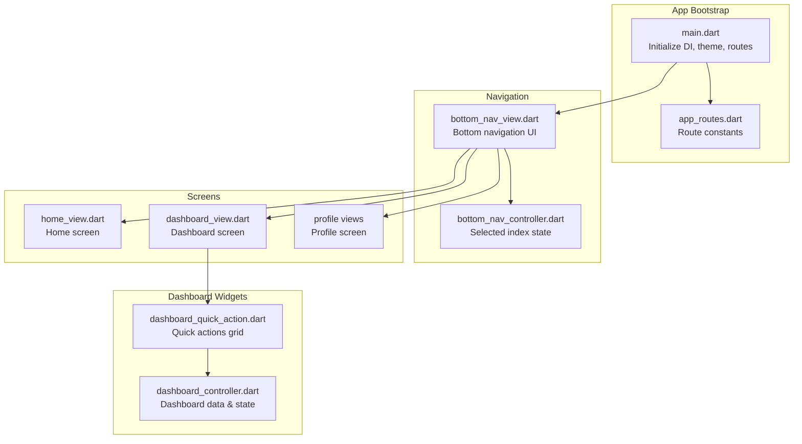
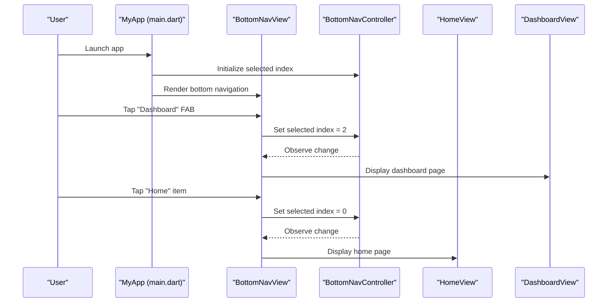
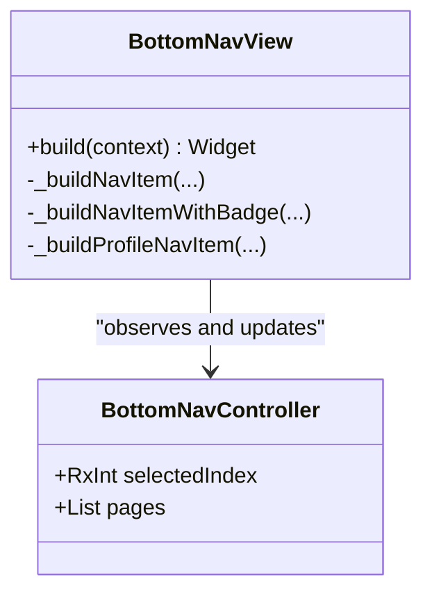
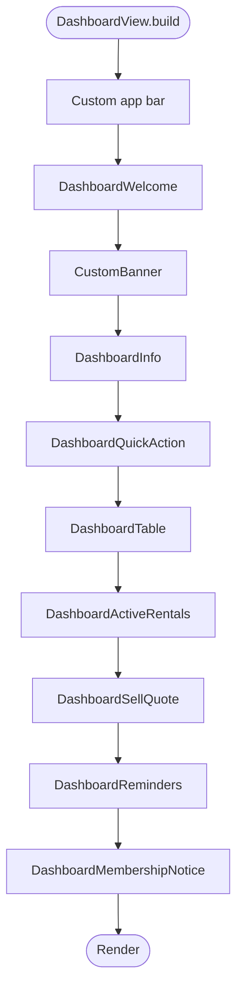
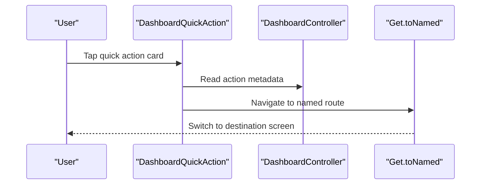
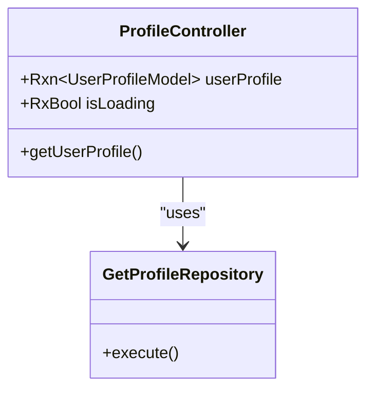
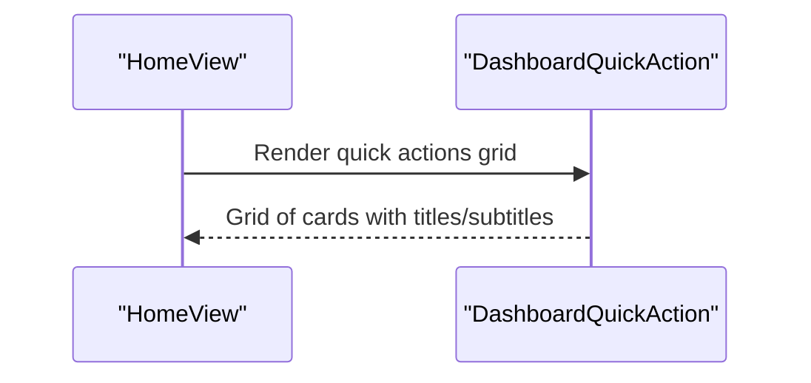
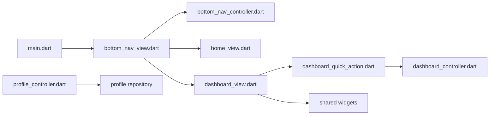

# User Dashboard

<cite>
**Referenced Files in This Document**
- [main.dart](file://lib/main.dart)
- [app_routes.dart](file://lib/core/routes/app_routes.dart)
- [bottom_nav_view.dart](file://lib/features/home/views/bottom_nav_view.dart)
- [bottom_nav_controller.dart](file://lib/features/home/controller/bottom_nav_controller.dart)
- [home_view.dart](file://lib/features/home/views/home_view.dart)
- [dashboard_view.dart](file://lib/features/dashboard/views/dashboard_view.dart)
- [dashboard_controller.dart](file://lib/features/dashboard/controller/dashboard_controller.dart)
- [dashboard_quick_action.dart](file://lib/features/dashboard/widgets/dashboard_widget/dashboard_quick_action.dart)
- [profile_controller.dart](file://lib/features/profile/controllers/profile_controller.dart)
- [colors.dart](file://lib/core/constant/colors.dart)
- [icons_path.dart](file://lib/core/constant/icons_path.dart)
- [custom_drawer.dart](file://lib/shared/widgets/custom_drawer/custom_drawer.dart)
- [custom_appbar.dart](file://lib/shared/widgets/custom_appbar.dart)
- [shared_container.dart](file://lib/shared/widgets/shared_container.dart)
</cite>

## Table of Contents
1. [Introduction](#introduction)
2. [Project Structure](#project-structure)
3. [Core Components](#core-components)
4. [Architecture Overview](#architecture-overview)
5. [Detailed Component Analysis](#detailed-component-analysis)
6. [Dependency Analysis](#dependency-analysis)
7. [Performance Considerations](#performance-considerations)
8. [Troubleshooting Guide](#troubleshooting-guide)
9. [Conclusion](#conclusion)
10. [Appendices](#appendices)

## Introduction
This document describes the user dashboard system for ZB-DEZINE, focusing on the bottom navigation, quick access features, content organization, and profile management. It explains how navigation controllers coordinate view management, how the home screen integrates quick actions, and how the dashboard presents personalized content. It also covers customization patterns for dashboard layouts, user preference management, and responsive design considerations for accessibility.

## Project Structure
The dashboard spans several modules:
- Application bootstrap initializes routing and theme via the main entry point.
- Navigation is handled by a bottom navigation view and controller.
- The dashboard view composes reusable widgets for quick actions, reminders, membership notices, and more.
- Profile management is encapsulated in dedicated controllers and repositories.
- Shared widgets provide consistent UI elements across screens.

**Diagram sources**
- [main.dart:12-46](file://lib/main.dart#L12-L46)
- [app_routes.dart:1-34](file://lib/core/routes/app_routes.dart#L1-L34)
- [bottom_nav_view.dart:11-131](file://lib/features/home/views/bottom_nav_view.dart#L11-L131)
- [bottom_nav_controller.dart:7-16](file://lib/features/home/controller/bottom_nav_controller.dart#L7-L16)
- [home_view.dart:15-75](file://lib/features/home/views/home_view.dart#L15-L75)
- [dashboard_view.dart:17-61](file://lib/features/dashboard/views/dashboard_view.dart#L17-L61)
- [dashboard_quick_action.dart:10-101](file://lib/features/dashboard/widgets/dashboard_widget/dashboard_quick_action.dart#L10-L101)
- [dashboard_controller.dart:6-63](file://lib/features/dashboard/controller/dashboard_controller.dart#L6-L63)

**Section sources**
- [main.dart:12-46](file://lib/main.dart#L12-L46)
- [app_routes.dart:1-34](file://lib/core/routes/app_routes.dart#L1-L34)

## Core Components
- Bottom navigation controller manages the selected tab index and page stack.
- Bottom navigation view renders the navigation bar, handles item selection, and centers a floating action button for dashboard access.
- Dashboard view organizes content into welcome, banners, info, quick actions, tables, reminders, and notices.
- Dashboard controller holds quick action items, recent orders, and expansion state for lists.
- Quick action widget displays a grid of shortcuts that route to named destinations.
- Profile controller fetches and exposes user profile data with loading and error handling.
- Shared widgets (custom drawer, app bar, containers) provide consistent UI across screens.

**Section sources**
- [bottom_nav_controller.dart:7-16](file://lib/features/home/controller/bottom_nav_controller.dart#L7-L16)
- [bottom_nav_view.dart:11-131](file://lib/features/home/views/bottom_nav_view.dart#L11-L131)
- [dashboard_view.dart:17-61](file://lib/features/dashboard/views/dashboard_view.dart#L17-L61)
- [dashboard_controller.dart:6-63](file://lib/features/dashboard/controller/dashboard_controller.dart#L6-L63)
- [dashboard_quick_action.dart:10-101](file://lib/features/dashboard/widgets/dashboard_widget/dashboard_quick_action.dart#L10-L101)
- [profile_controller.dart:6-31](file://lib/features/profile/controllers/profile_controller.dart#L6-L31)

## Architecture Overview
The dashboard architecture follows a layered pattern:
- Entry point configures theme, routing, and initial binding.
- Bottom navigation orchestrates page switching and exposes a central dashboard action.
- Dashboard composes modular widgets for quick actions, reminders, and content tables.
- Profile management is separate but integrated via navigation and settings.

**Diagram sources**
- [main.dart:21-46](file://lib/main.dart#L21-L46)
- [bottom_nav_view.dart:11-131](file://lib/features/home/views/bottom_nav_view.dart#L11-L131)
- [bottom_nav_controller.dart:7-16](file://lib/features/home/controller/bottom_nav_controller.dart#L7-L16)
- [home_view.dart:15-75](file://lib/features/home/views/home_view.dart#L15-L75)
- [dashboard_view.dart:17-61](file://lib/features/dashboard/views/dashboard_view.dart#L17-L61)

## Detailed Component Analysis

### Bottom Navigation System
The bottom navigation system:
- Maintains a selected index state.
- Holds a list of page widgets for each tab.
- Renders a modern, rounded navigation bar with icons and labels.
- Provides a floating center button to jump to the dashboard.
- Integrates a cart badge and profile avatar.

**Diagram sources**
- [bottom_nav_controller.dart:7-16](file://lib/features/home/controller/bottom_nav_controller.dart#L7-L16)
- [bottom_nav_view.dart:11-131](file://lib/features/home/views/bottom_nav_view.dart#L11-L131)

**Section sources**
- [bottom_nav_controller.dart:7-16](file://lib/features/home/controller/bottom_nav_controller.dart#L7-L16)
- [bottom_nav_view.dart:11-131](file://lib/features/home/views/bottom_nav_view.dart#L11-L131)

### Dashboard Layout and Content Organization
The dashboard view arranges content vertically:
- Custom app bar with drawer trigger.
- Welcome banner area.
- Promotional or informational banner.
- User info summary.
- Quick actions grid.
- Order history table.
- Active rentals section.
- Sell quote prompt.
- Reminders list.
- Membership notice.

**Diagram sources**
- [dashboard_view.dart:17-61](file://lib/features/dashboard/views/dashboard_view.dart#L17-L61)

**Section sources**
- [dashboard_view.dart:17-61](file://lib/features/dashboard/views/dashboard_view.dart#L17-L61)

### Quick Access Features
The quick actions widget:
- Uses a grid layout with two columns.
- Displays icon, title, and subtitle for each action.
- Navigates to named routes when tapped.
- Applies theme-aware styling and subtle decorative accents.

**Diagram sources**
- [dashboard_quick_action.dart:10-101](file://lib/features/dashboard/widgets/dashboard_widget/dashboard_quick_action.dart#L10-L101)
- [dashboard_controller.dart:6-63](file://lib/features/dashboard/controller/dashboard_controller.dart#L6-L63)

**Section sources**
- [dashboard_quick_action.dart:10-101](file://lib/features/dashboard/widgets/dashboard_widget/dashboard_quick_action.dart#L10-L101)
- [dashboard_controller.dart:6-63](file://lib/features/dashboard/controller/dashboard_controller.dart#L6-L63)

### Profile Management System
Profile management:
- Fetches user profile data via a repository abstraction.
- Exposes loading state and optional user data.
- Displays errors using a shared snackbar utility.
- Integrated into the bottom navigation via the profile tab.

**Diagram sources**
- [profile_controller.dart:6-31](file://lib/features/profile/controllers/profile_controller.dart#L6-L31)

**Section sources**
- [profile_controller.dart:6-31](file://lib/features/profile/controllers/profile_controller.dart#L6-L31)

### Home Screen Integration
The home screen reuses the quick actions widget to present categories and featured content. This ensures consistent navigation affordances across the app.

**Diagram sources**
- [home_view.dart:15-75](file://lib/features/home/views/home_view.dart#L15-L75)
- [dashboard_quick_action.dart:10-101](file://lib/features/dashboard/widgets/dashboard_widget/dashboard_quick_action.dart#L10-L101)

**Section sources**
- [home_view.dart:15-75](file://lib/features/home/views/home_view.dart#L15-L75)

## Dependency Analysis
Key dependencies and relationships:
- MyApp configures theme mode and initial route based on authentication state.
- BottomNavView depends on BottomNavController for state and on shared widgets for UI.
- DashboardView composes multiple dashboard widgets and uses shared containers.
- DashboardQuickAction depends on DashboardController for data and routing.
- ProfileController depends on a repository for fetching user data.

**Diagram sources**
- [main.dart:21-46](file://lib/main.dart#L21-L46)
- [bottom_nav_view.dart:11-131](file://lib/features/home/views/bottom_nav_view.dart#L11-L131)
- [bottom_nav_controller.dart:7-16](file://lib/features/home/controller/bottom_nav_controller.dart#L7-L16)
- [home_view.dart:15-75](file://lib/features/home/views/home_view.dart#L15-L75)
- [dashboard_view.dart:17-61](file://lib/features/dashboard/views/dashboard_view.dart#L17-L61)
- [dashboard_quick_action.dart:10-101](file://lib/features/dashboard/widgets/dashboard_widget/dashboard_quick_action.dart#L10-L101)
- [dashboard_controller.dart:6-63](file://lib/features/dashboard/controller/dashboard_controller.dart#L6-L63)
- [profile_controller.dart:6-31](file://lib/features/profile/controllers/profile_controller.dart#L6-L31)

**Section sources**
- [main.dart:21-46](file://lib/main.dart#L21-L46)
- [bottom_nav_view.dart:11-131](file://lib/features/home/views/bottom_nav_view.dart#L11-L131)
- [dashboard_quick_action.dart:10-101](file://lib/features/dashboard/widgets/dashboard_widget/dashboard_quick_action.dart#L10-L101)

## Performance Considerations
- Use lazy rendering: The dashboard view wraps content in a scrollable container to avoid unnecessary recompositions.
- Minimize rebuilds: Controllers use reactive state (GetX) to limit widget rebuilds to affected areas.
- Grid layout: Quick actions use a grid with fixed column count and non-scrollable physics to keep rendering efficient.
- Theme-aware rendering: Widgets adapt to light/dark themes without heavy computations.

## Troubleshooting Guide
- Navigation does not switch tabs:
  - Verify the selected index is being updated in the bottom navigation controller.
  - Confirm the bottom navigation view observes the reactive state.
- Quick action taps do nothing:
  - Ensure the named route exists and is registered.
  - Check that the action metadata includes a valid page route.
- Profile data not loading:
  - Confirm the repository returns a successful result.
  - Verify error handling displays appropriate feedback.
- Drawer not opening:
  - Ensure the custom drawer widget is properly imported and shown via dialog.

**Section sources**
- [bottom_nav_controller.dart:7-16](file://lib/features/home/controller/bottom_nav_controller.dart#L7-L16)
- [bottom_nav_view.dart:11-131](file://lib/features/home/views/bottom_nav_view.dart#L11-L131)
- [dashboard_quick_action.dart:10-101](file://lib/features/dashboard/widgets/dashboard_widget/dashboard_quick_action.dart#L10-L101)
- [profile_controller.dart:6-31](file://lib/features/profile/controllers/profile_controller.dart#L6-L31)

## Conclusion
The ZB-DEZINE dashboard integrates a robust bottom navigation system with a flexible dashboard layout. Quick access features streamline common tasks, while profile management remains decoupled for maintainability. The architecture leverages reactive controllers and shared widgets to ensure responsiveness and consistency across platforms.

## Appendices

### Customizing Dashboard Layouts
- Add new sections: Compose new widgets and insert them into the dashboard view column.
- Modify quick actions: Extend the quick action list in the dashboard controller with new items and routes.
- Personalized recommendations: Introduce a new widget that reads user preferences and renders tailored content.

**Section sources**
- [dashboard_view.dart:17-61](file://lib/features/dashboard/views/dashboard_view.dart#L17-L61)
- [dashboard_controller.dart:6-63](file://lib/features/dashboard/controller/dashboard_controller.dart#L6-L63)

### Managing User Preferences
- Load preferences: Use a repository to fetch user preferences and expose them via a controller.
- Update preferences: Provide methods to save changes and refresh dependent UI.
- Apply theme: Use theme controller to switch between light and dark modes.

**Section sources**
- [profile_controller.dart:6-31](file://lib/features/profile/controllers/profile_controller.dart#L6-L31)

### Implementing Personalized Content
- Data-driven content: Bind dashboard widgets to reactive user data and preferences.
- Conditional rendering: Show or hide sections based on user state or preferences.
- Accessibility: Ensure sufficient contrast, readable fonts, and touch targets sized appropriately.

**Section sources**
- [dashboard_view.dart:17-61](file://lib/features/dashboard/views/dashboard_view.dart#L17-L61)
- [colors.dart](file://lib/core/constant/colors.dart)

### Responsive Design and Accessibility
- Responsive layout: Use screen utility helpers to scale sizes and paddings across devices.
- Accessibility: Provide semantic labels, high contrast colors, and keyboard navigable elements.
- Dark mode: Respect theme brightness and adjust widget colors accordingly.

**Section sources**
- [bottom_nav_view.dart:11-131](file://lib/features/home/views/bottom_nav_view.dart#L11-L131)
- [dashboard_view.dart:17-61](file://lib/features/dashboard/views/dashboard_view.dart#L17-L61)
- [colors.dart](file://lib/core/constant/colors.dart)